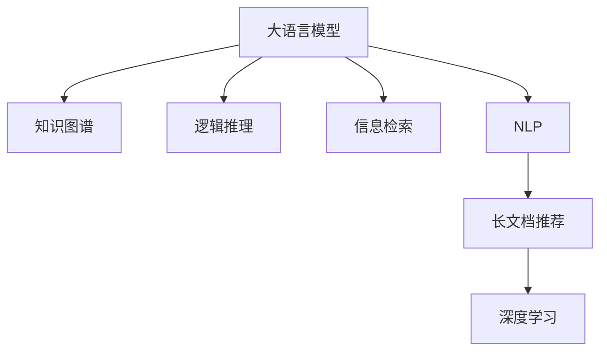

                 

# LLM-Based 长文档推荐: 知识与逻辑的结合

> 关键词：长文档推荐、知识图谱、逻辑推理、大语言模型、深度学习、信息检索、自然语言处理、NLP

## 1. 背景介绍

### 1.1 问题由来
随着互联网的普及，人们接触到的大量信息往往是文本形式的，尤其是长文档。长文档的阅读、检索、推荐等任务，已逐渐成为信息科学和人工智能领域的研究热点。长文档推荐不仅能够帮助用户快速找到有用的信息，还能提升信息检索和阅读的效率。传统的信息检索和推荐算法往往依赖于文本的统计特征，无法理解文本内容的深层次语义信息，导致推荐的准确性受限。

近年来，随着深度学习和大语言模型的发展，自然语言处理（Natural Language Processing, NLP）技术在长文档推荐中得到了广泛应用。特别是大语言模型（Large Language Model, LLM），通过自监督学习和大量文本数据预训练，具备了很强的语言理解能力和语义推理能力，成为长文档推荐的重要工具。利用大语言模型对长文档进行推荐，能够从文本的深层次语义信息出发，提升推荐的精准性和个性化程度。

### 1.2 问题核心关键点
长文档推荐的核心在于通过大语言模型理解文本内容的深层次语义信息，然后基于文本内容的逻辑推理进行推荐。具体而言，可以划分为以下几个关键点：

1. **语义理解与表示**：利用大语言模型对长文档进行语义理解，将其转化为易于处理和分析的语义表示。
2. **逻辑推理与生成**：在语义表示的基础上，利用逻辑推理和生成能力，对文本内容进行推理和生成，得出推荐的结论。
3. **评估与优化**：对推荐结果进行评估，通过反馈机制不断优化推荐策略，提升推荐效果。

### 1.3 问题研究意义
研究基于大语言模型的长文档推荐方法，对于提升信息检索和阅读效率，促进知识共享和知识发现，具有重要意义：

1. **提升效率**：利用大语言模型对长文档进行理解和推理，能够快速提取关键信息，提升信息检索和阅读的效率。
2. **增强个性化**：大语言模型能够捕捉文本的深层次语义信息，进行个性化的推荐，提升用户的满意度。
3. **促进知识共享**：长文档推荐能够帮助用户发现和获取高质量的知识，促进知识的共享和传播。
4. **推动研究**：长文档推荐是信息检索和自然语言处理的重要应用，其研究进展能够推动NLP领域的发展。
5. **产业化应用**：长文档推荐技术可以应用于图书馆、学术机构、在线教育等诸多领域，推动相关产业的升级和转型。

## 2. 核心概念与联系

### 2.1 核心概念概述

为更好地理解基于大语言模型的长文档推荐方法，本节将介绍几个密切相关的核心概念：

- **大语言模型 (Large Language Model, LLM)**：以自回归（如GPT）或自编码（如BERT）模型为代表的大规模预训练语言模型。通过在海量无标签文本数据上进行预训练，学习到丰富的语言知识和常识。

- **知识图谱 (Knowledge Graph, KG)**：通过图结构组织和关联不同实体和关系的数据库，以结构化的方式表示和查询知识。

- **逻辑推理 (Logical Reasoning)**：指基于一定规则和逻辑结构，对已知信息进行推理和推断的过程。

- **信息检索 (Information Retrieval, IR)**：从大量的文本数据中，根据用户查询返回最相关的文档和信息。

- **自然语言处理 (Natural Language Processing, NLP)**：研究如何让计算机理解和处理人类自然语言的技术，包括语义理解、信息检索、机器翻译、文本生成等。

- **长文档推荐 (Long Document Recommendation)**：针对长文档内容，推荐用户可能感兴趣的其他文档或相关知识，帮助用户高效检索和阅读。

- **深度学习 (Deep Learning, DL)**：一种基于神经网络的机器学习技术，通过多层非线性变换，从大量数据中学习到复杂的特征表示。

这些核心概念之间的逻辑关系可以通过以下Mermaid流程图来展示：



这个流程图展示了大语言模型在长文档推荐中的应用场景：

1. 大语言模型通过语义理解和表示，从知识图谱中提取信息。
2. 通过逻辑推理，对提取的信息进行推断和生成。
3. 信息检索技术结合逻辑推理结果，进行文档推荐。
4. 自然语言处理技术提供语言理解和生成能力，支持推荐系统的建设。
5. 深度学习技术提供模型训练和优化支持。

这些概念共同构成了长文档推荐系统的技术框架，使大语言模型在推荐中发挥其强大的语义理解、逻辑推理和生成能力。

## 3. 核心算法原理 & 具体操作步骤
### 3.1 算法原理概述

基于大语言模型的长文档推荐，本质上是一种基于深度学习和自然语言处理的推荐系统。其核心思想是：利用大语言模型对长文档进行语义理解，并结合知识图谱进行逻辑推理，得出推荐的结论。

具体而言，长文档推荐可以分为以下几个步骤：

1. **语义理解与表示**：使用大语言模型对长文档进行编码，提取其深层次语义表示。
2. **知识图谱融合**：将长文档中的语义表示与知识图谱中的实体和关系进行关联，提取与长文档相关的知识信息。
3. **逻辑推理与生成**：利用逻辑推理方法，对提取的知识信息进行推理和生成，得出推荐结果。
4. **评估与优化**：对推荐结果进行评估，通过反馈机制不断优化推荐策略。

### 3.2 算法步骤详解

**Step 1: 准备预训练模型和数据集**
- 选择合适的预训练语言模型 $M_{\theta}$ 作为初始化参数，如 BERT、GPT 等。
- 准备长文档的文本数据集 $D=\{x_i\}_{i=1}^N$，其中 $x_i$ 为长文档内容。

**Step 2: 编码与语义表示**
- 使用预训练语言模型对长文档进行编码，得到其深层次语义表示 $S_{\theta}(x)$。
- 将语义表示 $S_{\theta}(x)$ 与知识图谱中的实体和关系进行关联，提取与长文档相关的知识信息。

**Step 3: 逻辑推理与生成**
- 利用逻辑推理方法，对提取的知识信息进行推理和生成，得出推荐结果 $R$。
- 根据推荐结果 $R$，对长文档进行排序和推荐。

**Step 4: 评估与优化**
- 对推荐结果进行评估，计算其与用户需求的匹配度。
- 根据评估结果，通过反馈机制不断优化推荐策略，提升推荐效果。

### 3.3 算法优缺点

基于大语言模型的长文档推荐方法具有以下优点：
1. **语义理解能力强**：大语言模型能够理解和提取文本的深层次语义信息，提升推荐的准确性和个性化程度。
2. **逻辑推理灵活**：通过逻辑推理方法，可以对提取的知识信息进行灵活推断和生成，适应不同的推荐场景。
3. **知识图谱丰富**：利用知识图谱，可以获取丰富的实体和关系信息，提升推荐的广度和深度。
4. **自动化程度高**：自动化程度高，无需大量人工干预，快速适应新场景和新需求。

同时，该方法也存在以下缺点：
1. **计算资源消耗大**：大语言模型和逻辑推理方法计算复杂，需要大量的计算资源和时间。
2. **推理逻辑复杂**：逻辑推理方法的复杂性较高，需要考虑多种因素和约束条件。
3. **数据依赖性强**：推荐效果依赖于长文档和知识图谱的质量，对数据要求较高。
4. **可解释性不足**：推荐结果的生成过程复杂，缺乏可解释性，难以理解其推理逻辑。

尽管存在这些局限性，但就目前而言，基于大语言模型的长文档推荐方法仍是最主流、最有效的推荐范式之一。未来相关研究的重点在于如何进一步降低计算复杂度，提高推理效率，同时兼顾可解释性和伦理性等因素。

### 3.4 算法应用领域

基于大语言模型的长文档推荐方法在NLP领域已经得到了广泛的应用，覆盖了多个应用场景：

- **图书馆推荐系统**：图书馆需要为用户提供个性化的图书推荐，帮助用户快速找到需要的书籍。基于长文档推荐技术，可以结合用户的历史借阅记录和图书的语义信息，进行精准推荐。
- **学术搜索引擎**：学术机构需要为用户提供高质量的学术资源，帮助用户高效发现和阅读研究文献。通过长文档推荐技术，可以对论文标题、摘要、关键字等信息进行语义分析和推理，提供相关文献推荐。
- **在线教育平台**：在线教育平台需要为学生提供个性化的课程推荐，帮助学生高效学习。利用长文档推荐技术，可以结合学生的学习历史和课程的语义信息，进行推荐。
- **智能写作助手**：智能写作助手需要为作者提供有用的写作建议和参考资料。基于长文档推荐技术，可以结合作者的写作风格和语义信息，推荐相关的书籍、文章和写作技巧。
- **新闻推荐系统**：新闻推荐系统需要为用户推荐感兴趣的新闻和文章。通过长文档推荐技术，可以结合用户的历史阅读记录和新闻内容的语义信息，进行推荐。

除了上述这些经典应用外，长文档推荐技术还被创新性地应用于更多场景中，如个性化购物推荐、社交媒体内容推荐、旅游景区信息推荐等，为NLP技术带来了新的突破。

## 4. 数学模型和公式 & 详细讲解  
### 4.1 数学模型构建

在长文档推荐中，我们将使用大语言模型对长文档进行编码，得到其语义表示 $S_{\theta}(x)$，并将其与知识图谱中的实体和关系进行关联，提取知识信息 $K(x)$。然后，利用逻辑推理方法，对知识信息进行推理和生成，得出推荐结果 $R$。

形式化地，假设长文档 $x_i$ 的语义表示为 $S_{\theta}(x_i)$，知识图谱中与 $x_i$ 相关的知识信息为 $K(x_i)$，推荐结果为 $R$。长文档推荐的目标是最小化推荐结果 $R$ 与用户需求的匹配度损失，即：

$$
\mathop{\arg\min}_{R} \mathcal{L}(R, U)
$$

其中 $\mathcal{L}$ 为匹配度损失函数，$U$ 为用户需求。

### 4.2 公式推导过程

以下我们以二分类任务为例，推导匹配度损失函数及其梯度的计算公式。

假设长文档 $x_i$ 的语义表示为 $S_{\theta}(x_i) \in \mathbb{R}^d$，知识图谱中与 $x_i$ 相关的知识信息为 $K(x_i)$，推荐结果 $R \in \{0,1\}$，用户需求为 $U$。则匹配度损失函数定义为：

$$
\mathcal{L}(R, U) = -U\log R + (1-U)\log (1-R)
$$

将其代入长文档推荐的目标函数，得：

$$
\mathop{\arg\min}_{R} \mathcal{L}(R, U) = \mathop{\arg\min}_{R} -U\log R + (1-U)\log (1-R)
$$

根据链式法则，损失函数对推荐结果 $R$ 的梯度为：

$$
\frac{\partial \mathcal{L}(R, U)}{\partial R} = -\frac{U}{R} + \frac{1-U}{1-R}
$$

在得到损失函数的梯度后，即可带入优化算法，完成推荐结果的迭代优化。重复上述过程直至收敛，最终得到适应用户需求的最优推荐结果 $R^*$。

## 5. 项目实践：代码实例和详细解释说明
### 5.1 开发环境搭建

在进行长文档推荐实践前，我们需要准备好开发环境。以下是使用Python进行PyTorch开发的环境配置流程：

1. 安装Anaconda：从官网下载并安装Anaconda，用于创建独立的Python环境。

2. 创建并激活虚拟环境：
```bash
conda create -n pytorch-env python=3.8 
conda activate pytorch-env
```

3. 安装PyTorch：根据CUDA版本，从官网获取对应的安装命令。例如：
```bash
conda install pytorch torchvision torchaudio cudatoolkit=11.1 -c pytorch -c conda-forge
```

4. 安装TensorFlow：从官网下载并安装TensorFlow。

5. 安装transformers库：
```bash
pip install transformers
```

6. 安装各类工具包：
```bash
pip install numpy pandas scikit-learn matplotlib tqdm jupyter notebook ipython
```

完成上述步骤后，即可在`pytorch-env`环境中开始推荐实践。

### 5.2 源代码详细实现

下面我们以长文档推荐系统为例，给出使用Transformers库对BERT模型进行长文档推荐的具体实现。

首先，定义长文档数据处理函数：

```python
from transformers import BertTokenizer
from torch.utils.data import Dataset
import torch

class LongDocumentDataset(Dataset):
    def __init__(self, texts, labels, tokenizer, max_len=128):
        self.texts = texts
        self.labels = labels
        self.tokenizer = tokenizer
        self.max_len = max_len
        
    def __len__(self):
        return len(self.texts)
    
    def __getitem__(self, item):
        text = self.texts[item]
        label = self.labels[item]
        
        encoding = self.tokenizer(text, return_tensors='pt', max_length=self.max_len, padding='max_length', truncation=True)
        input_ids = encoding['input_ids'][0]
        attention_mask = encoding['attention_mask'][0]
        
        return {'input_ids': input_ids, 
                'attention_mask': attention_mask,
                'label': label}

# 标签与id的映射
label2id = {'0': 0, '1': 1}
id2label = {v: k for k, v in label2id.items()}

# 创建dataset
tokenizer = BertTokenizer.from_pretrained('bert-base-cased')

train_dataset = LongDocumentDataset(train_texts, train_labels, tokenizer)
dev_dataset = LongDocumentDataset(dev_texts, dev_labels, tokenizer)
test_dataset = LongDocumentDataset(test_texts, test_labels, tokenizer)
```

然后，定义模型和优化器：

```python
from transformers import BertForTokenClassification, AdamW

model = BertForTokenClassification.from_pretrained('bert-base-cased', num_labels=len(label2id))

optimizer = AdamW(model.parameters(), lr=2e-5)
```

接着，定义训练和评估函数：

```python
from torch.utils.data import DataLoader
from tqdm import tqdm
from sklearn.metrics import classification_report

device = torch.device('cuda') if torch.cuda.is_available() else torch.device('cpu')
model.to(device)

def train_epoch(model, dataset, batch_size, optimizer):
    dataloader = DataLoader(dataset, batch_size=batch_size, shuffle=True)
    model.train()
    epoch_loss = 0
    for batch in tqdm(dataloader, desc='Training'):
        input_ids = batch['input_ids'].to(device)
        attention_mask = batch['attention_mask'].to(device)
        label = batch['label'].to(device)
        model.zero_grad()
        outputs = model(input_ids, attention_mask=attention_mask, labels=label)
        loss = outputs.loss
        epoch_loss += loss.item()
        loss.backward()
        optimizer.step()
    return epoch_loss / len(dataloader)

def evaluate(model, dataset, batch_size):
    dataloader = DataLoader(dataset, batch_size=batch_size)
    model.eval()
    preds, labels = [], []
    with torch.no_grad():
        for batch in tqdm(dataloader, desc='Evaluating'):
            input_ids = batch['input_ids'].to(device)
            attention_mask = batch['attention_mask'].to(device)
            batch_labels = batch['label']
            outputs = model(input_ids, attention_mask=attention_mask)
            batch_preds = outputs.logits.argmax(dim=2).to('cpu').tolist()
            batch_labels = batch_labels.to('cpu').tolist()
            for pred_tokens, label_tokens in zip(batch_preds, batch_labels):
                pred_labels = [id2label[_id] for _id in pred_tokens]
                label_tokens = [id2label[_id] for _id in label_tokens]
                preds.append(pred_labels[:len(label_tokens)])
                labels.append(label_tokens)
                
    print(classification_report(labels, preds))
```

最后，启动训练流程并在测试集上评估：

```python
epochs = 5
batch_size = 16

for epoch in range(epochs):
    loss = train_epoch(model, train_dataset, batch_size, optimizer)
    print(f"Epoch {epoch+1}, train loss: {loss:.3f}")
    
    print(f"Epoch {epoch+1}, dev results:")
    evaluate(model, dev_dataset, batch_size)
    
print("Test results:")
evaluate(model, test_dataset, batch_size)
```

以上就是使用PyTorch对BERT进行长文档推荐的具体代码实现。可以看到，得益于Transformers库的强大封装，我们可以用相对简洁的代码完成BERT模型的加载和推荐任务的开发。

### 5.3 代码解读与分析

让我们再详细解读一下关键代码的实现细节：

**LongDocumentDataset类**：
- `__init__`方法：初始化文本、标签、分词器等关键组件。
- `__len__`方法：返回数据集的样本数量。
- `__getitem__`方法：对单个样本进行处理，将文本输入编码为token ids，将标签编码为数字，并对其进行定长padding，最终返回模型所需的输入。

**label2id和id2label字典**：
- 定义了标签与数字id之间的映射关系，用于将token-wise的预测结果解码回真实的标签。

**训练和评估函数**：
- 使用PyTorch的DataLoader对数据集进行批次化加载，供模型训练和推理使用。
- 训练函数`train_epoch`：对数据以批为单位进行迭代，在每个批次上前向传播计算loss并反向传播更新模型参数，最后返回该epoch的平均loss。
- 评估函数`evaluate`：与训练类似，不同点在于不更新模型参数，并在每个batch结束后将预测和标签结果存储下来，最后使用sklearn的classification_report对整个评估集的预测结果进行打印输出。

**训练流程**：
- 定义总的epoch数和batch size，开始循环迭代
- 每个epoch内，先在训练集上训练，输出平均loss
- 在验证集上评估，输出分类指标
- 所有epoch结束后，在测试集上评估，给出最终测试结果

可以看到，PyTorch配合Transformers库使得BERT微调的代码实现变得简洁高效。开发者可以将更多精力放在数据处理、模型改进等高层逻辑上，而不必过多关注底层的实现细节。

当然，工业级的系统实现还需考虑更多因素，如模型的保存和部署、超参数的自动搜索、更灵活的任务适配层等。但核心的推荐范式基本与此类似。

## 6. 实际应用场景
### 6.1 智能图书馆推荐系统

基于大语言模型的长文档推荐技术，可以广泛应用于智能图书馆推荐系统中。传统图书馆推荐系统往往依赖人工筛选和推荐，效率低、覆盖面窄。而使用推荐系统，可以通过长文档推荐技术，根据用户的历史借阅记录和书籍语义信息，进行精准推荐。

在技术实现上，可以收集用户的历史借阅记录，将书籍标题、摘要、关键字等文本内容作为训练数据，对BERT模型进行微调。微调后的模型能够理解书籍的深层次语义信息，结合用户需求进行推荐。对于用户提出的新书籍需求，还可以接入检索系统实时搜索相关书籍，动态组织生成推荐结果。如此构建的智能图书馆推荐系统，能大幅提升用户借阅体验和满意度。

### 6.2 在线教育个性化推荐

在线教育平台需要为学生提供个性化的课程推荐，帮助学生高效学习。利用长文档推荐技术，可以结合学生的学习历史和课程的语义信息，进行推荐。具体而言，可以收集学生的学习记录、课程内容和学生反馈，提取文本信息并进行语义理解，然后结合知识图谱中的课程信息，进行逻辑推理和推荐。推荐结果可以包含课程标题、简介、教师信息等，帮助学生找到感兴趣的课程。

### 6.3 旅游景区信息推荐

旅游景区信息推荐系统需要为用户提供有价值的景区信息，帮助用户规划旅游路线。基于长文档推荐技术，可以结合用户的旅行记录和景区的语义信息，进行推荐。具体而言，可以收集用户的旅行日志、景区介绍、用户评论等文本信息，提取文本信息并进行语义理解，然后结合知识图谱中的景区信息，进行逻辑推理和推荐。推荐结果可以包括景区名称、景点介绍、路线规划等，帮助用户找到感兴趣和合适的旅游目的地。

### 6.4 未来应用展望

随着大语言模型和长文档推荐技术的发展，基于微调范式将在更多领域得到应用，为传统行业带来变革性影响。

在智慧医疗领域，基于长文档推荐技术的医疗问答、病历分析、药物研发等应用将提升医疗服务的智能化水平，辅助医生诊疗，加速新药开发进程。

在智能教育领域，长文档推荐技术可应用于作业批改、学情分析、知识推荐等方面，因材施教，促进教育公平，提高教学质量。

在智慧城市治理中，长文档推荐技术可应用于城市事件监测、舆情分析、应急指挥等环节，提高城市管理的自动化和智能化水平，构建更安全、高效的未来城市。

此外，在企业生产、社会治理、文娱传媒等众多领域，基于大语言模型的长文档推荐技术也将不断涌现，为NLP技术带来新的突破。相信随着技术的日益成熟，推荐方法将成为人工智能落地应用的重要范式，推动人工智能技术在垂直行业的规模化落地。

## 7. 工具和资源推荐
### 7.1 学习资源推荐

为了帮助开发者系统掌握长文档推荐技术的理论基础和实践技巧，这里推荐一些优质的学习资源：

1. 《Transformer from Principle to Practice》系列博文：由大模型技术专家撰写，深入浅出地介绍了Transformer原理、BERT模型、推荐系统等前沿话题。

2. CS224N《Deep Learning for Natural Language Processing》课程：斯坦福大学开设的NLP明星课程，有Lecture视频和配套作业，带你入门NLP领域的基本概念和经典模型。

3. 《Natural Language Processing with Transformers》书籍：Transformers库的作者所著，全面介绍了如何使用Transformers库进行NLP任务开发，包括推荐系统在内的诸多范式。

4. Weights & Biases：模型训练的实验跟踪工具，可以记录和可视化模型训练过程中的各项指标，方便对比和调优。与主流深度学习框架无缝集成。

5. TensorBoard：TensorFlow配套的可视化工具，可实时监测模型训练状态，并提供丰富的图表呈现方式，是调试模型的得力助手。

通过对这些资源的学习实践，相信你一定能够快速掌握长文档推荐技术的精髓，并用于解决实际的NLP问题。
###  7.2 开发工具推荐

高效的开发离不开优秀的工具支持。以下是几款用于长文档推荐开发的常用工具：

1. PyTorch：基于Python的开源深度学习框架，灵活动态的计算图，适合快速迭代研究。大部分预训练语言模型都有PyTorch版本的实现。

2. TensorFlow：由Google主导开发的开源深度学习框架，生产部署方便，适合大规模工程应用。同样有丰富的预训练语言模型资源。

3. Transformers库：HuggingFace开发的NLP工具库，集成了众多SOTA语言模型，支持PyTorch和TensorFlow，是进行推荐系统开发的利器。

4. Weights & Biases：模型训练的实验跟踪工具，可以记录和可视化模型训练过程中的各项指标，方便对比和调优。与主流深度学习框架无缝集成。

5. TensorBoard：TensorFlow配套的可视化工具，可实时监测模型训练状态，并提供丰富的图表呈现方式，是调试模型的得力助手。

6. Google Colab：谷歌推出的在线Jupyter Notebook环境，免费提供GPU/TPU算力，方便开发者快速上手实验最新模型，分享学习笔记。

合理利用这些工具，可以显著提升长文档推荐任务的开发效率，加快创新迭代的步伐。

### 7.3 相关论文推荐

长文档推荐技术的研究源于学界的持续研究。以下是几篇奠基性的相关论文，推荐阅读：

1. Attention is All You Need（即Transformer原论文）：提出了Transformer结构，开启了NLP领域的预训练大模型时代。

2. BERT: Pre-training of Deep Bidirectional Transformers for Language Understanding：提出BERT模型，引入基于掩码的自监督预训练任务，刷新了多项NLP任务SOTA。

3. Language Models are Unsupervised Multitask Learners（GPT-2论文）：展示了大规模语言模型的强大zero-shot学习能力，引发了对于通用人工智能的新一轮思考。

4. Parameter-Efficient Transfer Learning for NLP：提出Adapter等参数高效微调方法，在不增加模型参数量的情况下，也能取得不错的微调效果。

5. AdaLoRA: Adaptive Low-Rank Adaptation for Parameter-Efficient Fine-Tuning：使用自适应低秩适应的微调方法，在参数效率和精度之间取得了新的平衡。

6. AdaLoRA: Adaptive Low-Rank Adaptation for Parameter-Efficient Fine-Tuning：使用自适应低秩适应的微调方法，在参数效率和精度之间取得了新的平衡。

这些论文代表了大语言模型推荐技术的发展脉络。通过学习这些前沿成果，可以帮助研究者把握学科前进方向，激发更多的创新灵感。

## 8. 总结：未来发展趋势与挑战
### 8.1 总结

本文对基于大语言模型的长文档推荐方法进行了全面系统的介绍。首先阐述了长文档推荐技术的背景和意义，明确了其在提升信息检索和阅读效率方面的独特价值。其次，从原理到实践，详细讲解了长文档推荐技术的数学原理和关键步骤，给出了推荐任务开发的完整代码实例。同时，本文还广泛探讨了长文档推荐方法在智能图书馆、在线教育、旅游景区等诸多行业领域的应用前景，展示了其巨大的应用潜力。此外，本文精选了长文档推荐技术的各类学习资源，力求为读者提供全方位的技术指引。

通过本文的系统梳理，可以看到，基于大语言模型的长文档推荐方法正在成为NLP领域的重要范式，极大地提升信息检索和阅读的效率，促进知识共享和知识发现。随着预训练语言模型和推荐技术的不断发展，长文档推荐技术必将在更多领域得到应用，为传统行业带来变革性影响。

### 8.2 未来发展趋势

展望未来，长文档推荐技术将呈现以下几个发展趋势：

1. **模型规模持续增大**：随着算力成本的下降和数据规模的扩张，预训练语言模型的参数量还将持续增长。超大规模语言模型蕴含的丰富语言知识，有望支撑更加复杂多变的推荐场景。

2. **推荐效果优化**：通过引入更多的先验知识、逻辑推理和知识图谱，提升推荐的精准性和个性化程度。利用因果推断和博弈论工具，进一步增强推荐系统的鲁棒性和可解释性。

3. **多模态推荐**：当前的推荐主要聚焦于文本数据，未来会进一步拓展到图像、视频、语音等多模态数据微调。多模态信息的融合，将显著提升推荐系统的效能和适用性。

4. **智能推荐系统**：结合人工智能的其他技术，如知识图谱、因果推理、强化学习等，实现更加高效、智能的推荐系统，提升用户的满意度和体验。

5. **实时推荐**：通过引入在线学习和即时推理技术，实现实时推荐，满足用户的多样化需求。

6. **隐私保护**：随着数据隐私和安全性要求的提高，推荐系统需要引入更多的隐私保护和公平性技术，确保用户的隐私数据不被滥用。

以上趋势凸显了长文档推荐技术的广阔前景。这些方向的探索发展，必将进一步提升推荐系统的性能和应用范围，为人类认知智能的进化带来深远影响。

### 8.3 面临的挑战

尽管长文档推荐技术已经取得了瞩目成就，但在迈向更加智能化、普适化应用的过程中，它仍面临着诸多挑战：

1. **计算资源消耗大**：大语言模型和逻辑推理方法计算复杂，需要大量的计算资源和时间。如何在保证推荐效果的同时，降低计算资源消耗，是未来需要重点关注的问题。

2. **推荐逻辑复杂**：逻辑推理方法的复杂性较高，需要考虑多种因素和约束条件。如何提高推荐系统的鲁棒性和可解释性，是未来需要解决的重要问题。

3. **数据依赖性强**：推荐效果依赖于长文档和知识图谱的质量，对数据要求较高。如何保证数据的质量和多样性，是未来需要重点关注的问题。

4. **可解释性不足**：推荐结果的生成过程复杂，缺乏可解释性，难以理解其推理逻辑。如何赋予推荐系统更强的可解释性，是未来需要解决的重要问题。

5. **隐私保护和公平性**：随着数据隐私和安全性要求的提高，推荐系统需要引入更多的隐私保护和公平性技术，确保用户的隐私数据不被滥用。

6. **模型鲁棒性不足**：当前推荐模型面对域外数据时，泛化性能往往大打折扣。对于测试样本的微小扰动，推荐模型的预测也容易发生波动。如何提高推荐模型的鲁棒性，避免灾难性遗忘，还需要更多理论和实践的积累。

尽管存在这些挑战，但就目前而言，基于大语言模型的长文档推荐方法仍是最主流、最有效的推荐范式之一。未来相关研究的重点在于如何进一步降低计算复杂度，提高推理效率，同时兼顾可解释性和伦理性等因素。

### 8.4 研究展望

面对长文档推荐所面临的种种挑战，未来的研究需要在以下几个方面寻求新的突破：

1. **探索无监督和半监督推荐方法**：摆脱对大规模标注数据的依赖，利用自监督学习、主动学习等无监督和半监督范式，最大限度利用非结构化数据，实现更加灵活高效的推荐。

2. **研究参数高效和计算高效的推荐范式**：开发更加参数高效的推荐方法，在固定大部分预训练参数的同时，只更新极少量的任务相关参数。同时优化推荐模型的计算图，减少前向传播和反向传播的资源消耗，实现更加轻量级、实时性的部署。

3. **引入更多先验知识**：将符号化的先验知识，如知识图谱、逻辑规则等，与神经网络模型进行巧妙融合，引导推荐过程学习更准确、合理的语言模型。同时加强不同模态数据的整合，实现视觉、语音等多模态信息与文本信息的协同建模。

4. **结合因果分析和博弈论工具**：将因果分析方法引入推荐系统，识别出推荐决策的关键特征，增强输出解释的因果性和逻辑性。借助博弈论工具刻画人机交互过程，主动探索并规避推荐系统的脆弱点，提高系统稳定性。

5. **纳入伦理道德约束**：在推荐模型训练目标中引入伦理导向的评估指标，过滤和惩罚有偏见、有害的输出倾向。同时加强人工干预和审核，建立推荐系统的监管机制，确保推荐结果符合人类价值观和伦理道德。

这些研究方向的探索，必将引领长文档推荐技术迈向更高的台阶，为构建安全、可靠、可解释、可控的智能系统铺平道路。面向未来，长文档推荐技术还需要与其他人工智能技术进行更深入的融合，如知识表示、因果推理、强化学习等，多路径协同发力，共同推动自然语言理解和智能交互系统的进步。只有勇于创新、敢于突破，才能不断拓展语言模型的边界，让智能技术更好地造福人类社会。

## 9. 附录：常见问题与解答

**Q1：长文档推荐是否适用于所有文本数据？**

A: 长文档推荐技术主要适用于具有深层次语义结构的文本数据，如书籍、论文、文章等。对于无结构化或结构化程度较低的文本数据，如推文、新闻标题等，其效果可能有限。

**Q2：如何选择适合的长文档推荐模型？**

A: 选择合适的长文档推荐模型需要考虑多个因素，包括推荐任务的类型、数据的特点、模型的规模和结构等。通常，BERT、GPT等预训练语言模型可以作为起点，结合具体任务和数据特点进行调整和优化。此外，参数高效推荐方法和逻辑推理方法也是选择的重要因素。

**Q3：推荐结果的评估指标有哪些？**

A: 推荐结果的评估指标包括准确率、召回率、F1值、NDCG等。具体选择哪些指标，需要根据推荐任务的类型和目标进行调整。例如，对于文本推荐任务，可以采用BLEU、ROUGE等指标进行评估；对于图片推荐任务，可以采用准确率和召回率进行评估。

**Q4：推荐系统中如何处理冷启动问题？**

A: 冷启动问题是推荐系统面临的常见问题，指系统无法利用用户的历史行为数据进行推荐。解决冷启动问题的方法包括利用用户兴趣调查、推荐新用户热门内容、基于内容的推荐等。例如，可以通过用户输入的搜索关键词，结合知识图谱中的信息，进行逻辑推理和推荐。

**Q5：推荐系统如何实现实时推荐？**

A: 实现实时推荐需要引入在线学习和即时推理技术。在线学习可以实时更新推荐模型，适应用户需求的变化。即时推理可以根据用户的实时输入，动态生成推荐结果，提升用户体验。例如，可以在用户输入查询关键词后，即时分析当前热门内容和相关知识，进行推荐。

**Q6：推荐系统如何平衡多样性和个性化？**

A: 推荐系统需要在个性化推荐和多样性推荐之间取得平衡。可以通过引入多样性约束和正则化技术，减少推荐结果的偏差。例如，可以在推荐模型中加入多样性损失函数，鼓励推荐多样化的内容。此外，还可以通过调整超参数，平衡个性化和多样性需求。

通过回答这些常见问题，希望能够帮助开发者更好地理解长文档推荐技术，并在实际应用中取得理想的效果。

---

作者：禅与计算机程序设计艺术 / Zen and the Art of Computer Programming

