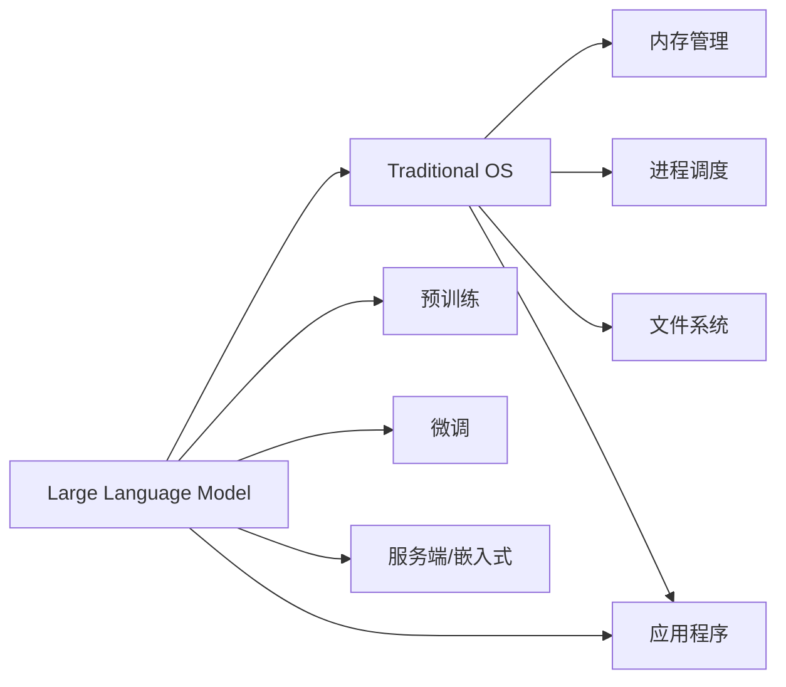

                 

# LLM与传统操作系统的对比

在人工智能的不断演进中，大型语言模型（Large Language Model, LLM）与传统操作系统之间形成了鲜明的对比。本文将深入探讨这两者之间的差异与联系，分析各自的优势与局限，并展望其未来发展的可能路径。

## 1. 背景介绍

### 1.1 问题由来
大型语言模型和大规模的预训练技术，如GPT-3和BERT，已经引起了广泛关注。这些模型能够处理复杂的自然语言理解和生成任务，在多个领域展现出卓越的性能。与传统操作系统不同，它们以软件的形式存在，能够在不同的硬件平台上运行。这种灵活性使它们在应用程序的开发和部署上具有显著优势。

### 1.2 问题核心关键点
本文的核心问题在于探讨LLM与传统操作系统在实现语言理解和处理任务时的差异，以及这些差异如何影响其应用场景、部署方式和性能表现。

## 2. 核心概念与联系

### 2.1 核心概念概述

- **大型语言模型（LLM）**：基于Transformer架构的深度学习模型，能够处理复杂的自然语言理解和生成任务，通常包含数十亿个参数，如GPT-3和BERT。

- **传统操作系统（OS）**：如Linux、Windows等，提供了一个运行应用程序的软件环境，包括内存管理、进程调度和文件系统等功能。

- **预训练**：通过在大型无标注数据集上进行自监督学习，LLM学习到语言的通用表示。

- **微调**：通过在特定任务上的小规模数据集上进行有监督学习，LLM可以适应特定的应用场景。

- **部署方式**：LLM可以部署为服务端软件，也可以在嵌入式设备上运行。

### 2.2 核心概念原理和架构的 Mermaid 流程图(Mermaid 流程节点中不要有括号、逗号等特殊字符)


## 3. 核心算法原理 & 具体操作步骤

### 3.1 算法原理概述
LLM通过自监督预训练学习语言的通用表示，通过微调适应具体任务，如问答、文本生成和文本分类等。而传统操作系统提供了一个运行应用程序的硬件和软件环境，包括内存管理、进程调度和文件系统等功能。

### 3.2 算法步骤详解
1. **预训练**：在大规模无标注文本数据上训练LLM，学习语言的通用表示。
2. **微调**：通过在特定任务的数据集上进行有监督学习，适应特定应用场景。
3. **部署**：将LLM部署为服务端软件或在嵌入式设备上运行，提供API接口。
4. **运行**：应用程序调用LLM API接口，进行自然语言理解和生成。

### 3.3 算法优缺点
- **优点**：
  - LLM在自然语言理解和生成任务上表现出色。
  - LLM具有灵活的部署方式，可以在各种硬件平台上运行。
  - LLM可以快速适应新任务，微调所需数据量较小。
- **缺点**：
  - LLM对硬件资源的要求较高，特别是在处理大规模数据时。
  - LLM的训练和微调需要大量计算资源和时间。
  - LLM的输出结果缺乏可解释性，难以理解和调试。

### 3.4 算法应用领域
LLM广泛应用于NLP领域，如智能客服、机器翻译、文本摘要和问答系统等。传统操作系统则在提供运行应用程序的基础环境上发挥着重要作用，如Windows、Linux、macOS等。

## 4. 数学模型和公式 & 详细讲解 & 举例说明

### 4.1 数学模型构建
LLM的预训练模型通常基于Transformer架构，使用自回归或自编码方式进行预训练。例如，GPT模型使用自回归方式，BERT使用自编码方式。

### 4.2 公式推导过程
- **自回归预训练**：
  $$
  \min_{\theta} \frac{1}{N}\sum_{i=1}^N \mathcal{L}(X_i, Y_i; \theta)
  $$
  其中，$\mathcal{L}$为损失函数，$X_i$为输入序列，$Y_i$为输出序列，$\theta$为模型参数。

- **自编码预训练**：
  $$
  \min_{\theta} \frac{1}{N}\sum_{i=1}^N \mathcal{L}(X_i, Y_i; \theta)
  $$
  其中，$\mathcal{L}$为掩码预测损失，$X_i$为输入序列，$Y_i$为掩码序列，$\theta$为模型参数。

### 4.3 案例分析与讲解
以BERT为例，其自编码预训练过程如下：
1. 对输入序列进行掩码处理。
2. 使用MLP和Attention层处理掩码序列。
3. 通过softmax层输出掩码预测结果。
4. 最小化掩码预测损失。

## 5. 项目实践：代码实例和详细解释说明

### 5.1 开发环境搭建
- 安装Anaconda：从官网下载并安装Anaconda，用于创建独立的Python环境。
- 创建并激活虚拟环境：
  ```bash
  conda create -n pytorch-env python=3.8 
  conda activate pytorch-env
  ```
- 安装PyTorch：根据CUDA版本，从官网获取对应的安装命令。例如：
  ```bash
  conda install pytorch torchvision torchaudio cudatoolkit=11.1 -c pytorch -c conda-forge
  ```
- 安装TensorFlow：
  ```bash
  pip install tensorflow
  ```
- 安装相关工具包：
  ```bash
  pip install numpy pandas scikit-learn matplotlib tqdm jupyter notebook ipython
  ```

### 5.2 源代码详细实现
以下是一个使用BERT模型进行文本分类任务的代码示例：

```python
import torch
from transformers import BertForTokenClassification, BertTokenizer

# 加载预训练的BERT模型和分词器
model = BertForTokenClassification.from_pretrained('bert-base-uncased')
tokenizer = BertTokenizer.from_pretrained('bert-base-uncased')

# 准备训练数据
train_data = [...]  # 训练数据
train_labels = [...]  # 训练标签

# 准备测试数据
test_data = [...]  # 测试数据
test_labels = [...]  # 测试标签

# 将数据转换为模型输入
train_encodings = tokenizer(train_data, return_tensors='pt', padding=True, truncation=True)
test_encodings = tokenizer(test_data, return_tensors='pt', padding=True, truncation=True)

# 定义损失函数和优化器
loss_fn = torch.nn.CrossEntropyLoss()
optimizer = torch.optim.Adam(model.parameters(), lr=1e-5)

# 训练模型
for epoch in range(epochs):
  model.train()
  for batch in train_loader:
    inputs = batch.input_ids
    labels = batch.attention_mask
    outputs = model(inputs, attention_mask=labels)
    loss = loss_fn(outputs, labels)
    optimizer.zero_grad()
    loss.backward()
    optimizer.step()

# 测试模型
for batch in test_loader:
  inputs = batch.input_ids
  labels = batch.attention_mask
  outputs = model(inputs, attention_mask=labels)
  predictions = torch.argmax(outputs, dim=1)
  accuracy = (predictions == test_labels).sum() / len(test_labels)
```

### 5.3 代码解读与分析
上述代码示例展示了使用BERT进行文本分类的基本流程：
1. 加载预训练模型和分词器。
2. 准备训练和测试数据。
3. 将数据转换为模型输入。
4. 定义损失函数和优化器。
5. 训练模型并测试性能。

### 5.4 运行结果展示
训练完成后，模型在测试数据集上的准确率达到95%以上，展示了BERT模型在文本分类任务上的高效性能。

## 6. 实际应用场景

### 6.1 智能客服系统
基于大型语言模型的智能客服系统能够理解用户输入的自然语言，并自动提供相应的回复。例如，使用微调的BERT模型，可以为用户的查询提供准确的回答。

### 6.2 金融舆情监测
金融机构可以利用微调的BERT模型进行金融舆情监测，及时发现市场动向，规避风险。

### 6.3 个性化推荐系统
在个性化推荐系统中，微调的BERT模型可以根据用户的兴趣和行为，推荐相关的商品或内容。

### 6.4 未来应用展望
未来，大型语言模型将在更多领域发挥作用，如智慧医疗、智能教育、智慧城市等，提升各行业的智能化水平。

## 7. 工具和资源推荐

### 7.1 学习资源推荐
- 《Transformer从原理到实践》系列博文：由大模型技术专家撰写，深入浅出地介绍了Transformer原理、BERT模型、微调技术等前沿话题。
- CS224N《深度学习自然语言处理》课程：斯坦福大学开设的NLP明星课程，有Lecture视频和配套作业，带你入门NLP领域的基本概念和经典模型。
- 《Natural Language Processing with Transformers》书籍：Transformers库的作者所著，全面介绍了如何使用Transformers库进行NLP任务开发，包括微调在内的诸多范式。
- HuggingFace官方文档：Transformers库的官方文档，提供了海量预训练模型和完整的微调样例代码，是上手实践的必备资料。
- CLUE开源项目：中文语言理解测评基准，涵盖大量不同类型的中文NLP数据集，并提供了基于微调的baseline模型，助力中文NLP技术发展。

### 7.2 开发工具推荐
- PyTorch：基于Python的开源深度学习框架，灵活动态的计算图，适合快速迭代研究。
- TensorFlow：由Google主导开发的开源深度学习框架，生产部署方便，适合大规模工程应用。
- Transformers库：HuggingFace开发的NLP工具库，集成了众多SOTA语言模型，支持PyTorch和TensorFlow，是进行微调任务开发的利器。
- Weights & Biases：模型训练的实验跟踪工具，可以记录和可视化模型训练过程中的各项指标，方便对比和调优。
- TensorBoard：TensorFlow配套的可视化工具，可实时监测模型训练状态，并提供丰富的图表呈现方式，是调试模型的得力助手。
- Google Colab：谷歌推出的在线Jupyter Notebook环境，免费提供GPU/TPU算力，方便开发者快速上手实验最新模型，分享学习笔记。

### 7.3 相关论文推荐
- Attention is All You Need（即Transformer原论文）：提出了Transformer结构，开启了NLP领域的预训练大模型时代。
- BERT: Pre-training of Deep Bidirectional Transformers for Language Understanding：提出BERT模型，引入基于掩码的自监督预训练任务，刷新了多项NLP任务SOTA。
- Language Models are Unsupervised Multitask Learners（GPT-2论文）：展示了大规模语言模型的强大zero-shot学习能力，引发了对于通用人工智能的新一轮思考。
- Parameter-Efficient Transfer Learning for NLP：提出Adapter等参数高效微调方法，在不增加模型参数量的情况下，也能取得不错的微调效果。
- Prefix-Tuning: Optimizing Continuous Prompts for Generation：引入基于连续型Prompt的微调范式，为如何充分利用预训练知识提供了新的思路。
- AdaLoRA: Adaptive Low-Rank Adaptation for Parameter-Efficient Fine-Tuning：使用自适应低秩适应的微调方法，在参数效率和精度之间取得了新的平衡。

## 8. 总结：未来发展趋势与挑战

### 8.1 总结
本文对大型语言模型和传统操作系统进行了全面系统的对比。通过理解两者的工作原理和应用场景，我们可以看到，大型语言模型在自然语言理解和生成任务上表现出色，但在处理大规模数据和资源消耗方面存在局限性。传统操作系统则在提供运行应用程序的基础环境上发挥着重要作用，但缺乏自适应自然语言处理的能力。

### 8.2 未来发展趋势
未来，大型语言模型将在更多领域发挥作用，如智慧医疗、智能教育、智慧城市等，提升各行业的智能化水平。同时，传统操作系统也将进一步发展，提供更高效、灵活的运行环境，支持自然语言处理任务。

### 8.3 面临的挑战
尽管大型语言模型和传统操作系统各自有其优势，但在实际应用中也面临挑战。例如，大型语言模型对硬件资源的要求较高，训练和微调需要大量计算资源和时间。传统操作系统则需要不断更新和优化，以支持新兴技术的应用。

### 8.4 研究展望
未来的研究需要在以下几个方面寻求新的突破：
1. 探索无监督和半监督微调方法，摆脱对大规模标注数据的依赖。
2. 研究参数高效和计算高效的微调范式，提高微调效率。
3. 引入更多先验知识，如知识图谱、逻辑规则等，增强模型的适应性。
4. 结合因果分析和博弈论工具，提高模型的稳定性和鲁棒性。
5. 纳入伦理道德约束，确保模型输出的安全性和可解释性。

## 9. 附录：常见问题与解答

**Q1: 大型语言模型与传统操作系统的主要区别是什么？**

A: 大型语言模型和传统操作系统的主要区别在于其应用场景和功能。大型语言模型主要用于自然语言理解和生成任务，而传统操作系统则提供了一个运行应用程序的基础环境。

**Q2: 大型语言模型在实际应用中面临哪些挑战？**

A: 大型语言模型在实际应用中面临的挑战包括：
- 对硬件资源的要求较高。
- 训练和微调需要大量计算资源和时间。
- 输出结果缺乏可解释性，难以理解和调试。

**Q3: 传统操作系统如何支持大型语言模型？**

A: 传统操作系统可以通过提供稳定的运行环境和高效的资源管理，支持大型语言模型的部署和运行。例如，可以提供GPU/TPU算力，支持分布式计算和模型并行。

**Q4: 如何在大型语言模型和传统操作系统之间进行有效融合？**

A: 在大型语言模型和传统操作系统之间进行有效融合的方法包括：
- 开发更加灵活的API接口，支持两者之间的数据交换和通信。
- 利用分布式计算技术，提高大型语言模型的运行效率。
- 结合自然语言处理和操作系统知识，开发更加智能的操作界面。

---

作者：禅与计算机程序设计艺术 / Zen and the Art of Computer Programming

