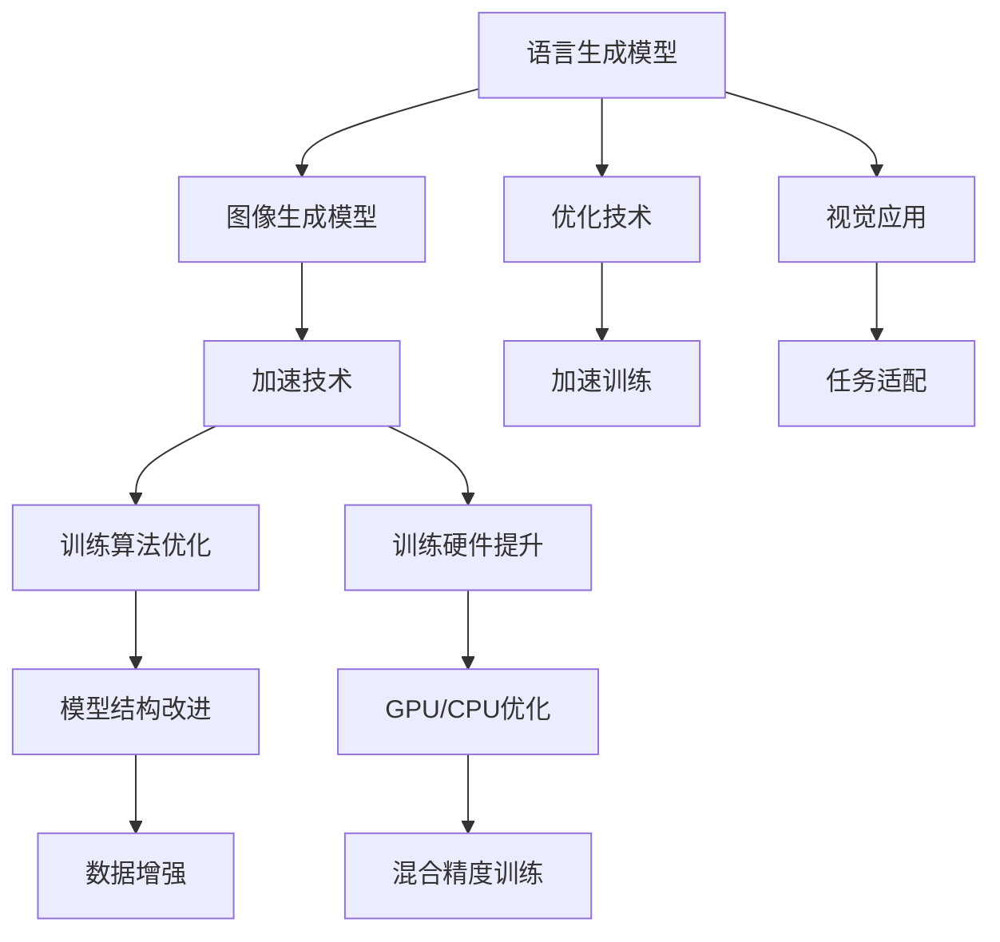

                 

# LLM图像生成速度提升对视觉应用的促进

> 关键词：
- 语言生成模型(LLM)
- 图像生成速度
- 视觉应用
- 优化算法
- 训练硬件
- 应用场景

## 1. 背景介绍

### 1.1 问题由来
语言生成模型（Language Generation Models, LGMs）如GPT、BERT等，在处理和生成自然语言方面展现出卓越的性能。然而，当涉及图像生成时，这些模型往往无法胜任，因为它们缺乏处理图像数据的结构化知识。为了克服这一限制，视觉领域开始借鉴语言模型的结构，探索图像生成模型，以实现对图像的高级理解和生成。

### 1.2 问题核心关键点
当前，图像生成模型（Language Generation Models, LGMs）在视觉应用中具有巨大的潜力。然而，这些模型的训练和生成速度是制约其广泛应用的瓶颈。因此，如何加速图像生成模型的训练和生成，使其能够更高效地服务于视觉任务，成为了当前研究的热点。

## 2. 核心概念与联系

### 2.1 核心概念概述

为更好地理解加速图像生成模型的方法，本节将介绍几个密切相关的核心概念：

- 语言生成模型(LGMs)：指通过自监督或监督学习任务训练的模型，能够生成连贯的文本。例如，GPT、BERT等。
- 图像生成模型(IMGs)：指能够生成高质量图像的模型，例如，GANs、VAEs等。
- 加速技术：指通过改进模型结构、优化训练算法、提升训练硬件等手段，加快模型训练和推理速度的技术。
- 视觉应用：指将图像生成模型应用于计算机视觉任务，如图像分类、目标检测、图像生成、图像编辑等。

这些核心概念之间的逻辑关系可以通过以下Mermaid流程图来展示：



这个流程图展示了从语言生成模型到图像生成模型的转化过程，以及加速技术如何应用到训练算法、硬件和数据处理中，最终服务于视觉应用的框架。

## 3. 核心算法原理 & 具体操作步骤

### 3.1 算法原理概述

加速图像生成模型的基本思路是：通过改进模型结构、优化训练算法和提升训练硬件，提高模型的训练和推理速度，同时保持或提升模型的生成质量和任务性能。

具体而言，可以从以下几个方面来提升图像生成模型的速度：

1. **模型结构优化**：通过剪枝、量化、蒸馏等技术，减少模型参数和计算量。
2. **训练算法优化**：使用更高效的优化器，如AdamW、Adafactor等，以及更快速的收敛策略。
3. **训练硬件升级**：使用高性能GPU或TPU，并利用分布式训练技术，提升训练速度。
4. **数据增强**：通过对训练数据进行扩充，如数据增强、回译等，提高模型泛化能力。
5. **混合精度训练**：使用混合精度技术，减少模型计算的位宽，提升训练效率。

### 3.2 算法步骤详解

以下是加速图像生成模型的一般步骤：

**Step 1: 准备模型和数据集**
- 选择合适的预训练模型作为基础。例如，使用GPT作为图像生成模型的基础框架。
- 准备训练数据集。收集并标注大量图像数据，例如，ImageNet、COCO等。

**Step 2: 模型结构优化**
- 对模型进行剪枝，去除冗余参数。
- 量化模型，将浮点数运算转换为更高效的整数运算。
- 利用蒸馏技术，将大型模型知识迁移到小型模型中。

**Step 3: 训练算法优化**
- 选择高效的优化器，如AdamW、Adafactor等。
- 设置适当的学习率，通常需要较小的学习率，以免破坏预训练权重。
- 应用正则化技术，如L2正则、Dropout等，防止过拟合。

**Step 4: 训练硬件升级**
- 使用高性能GPU或TPU，并利用分布式训练技术。
- 利用混合精度训练，提升训练效率。

**Step 5: 数据增强**
- 对训练数据进行扩充，如数据增强、回译等，提高模型泛化能力。

**Step 6: 混合精度训练**
- 将模型转换为混合精度格式，如FP16或BF16，减少计算量和存储需求。

**Step 7: 评估和部署**
- 在验证集上评估模型性能，根据性能指标决定是否进行迭代优化。
- 使用优化后的模型对新样本进行推理预测，集成到实际的应用系统中。

### 3.3 算法优缺点

加速图像生成模型的方法具有以下优点：
1. 显著提升模型训练和推理速度。通过模型结构优化、训练算法优化和硬件升级等手段，可以大幅缩短模型训练时间，提高实时推理能力。
2. 提升模型泛化能力。数据增强和混合精度训练等技术，有助于模型更好地适应新的数据分布，提升泛化能力。
3. 降低计算成本。通过剪枝、量化等技术，减少模型参数和计算量，降低训练和推理的计算成本。

同时，这些方法也存在一定的局限性：
1. 牺牲模型精度。为了提高速度，可能需要在精度和速度之间进行权衡。
2. 硬件和算法复杂度较高。大规模模型和高精度训练需要高性能硬件和复杂算法，开发和部署成本较高。
3. 模型结构设计复杂。模型结构的优化需要深入理解模型架构和优化技术，难度较大。

尽管存在这些局限性，但就目前而言，加速图像生成模型的方法是大规模模型在视觉应用中实现高性能的重要手段。未来相关研究的重点在于如何进一步降低模型参数，提高模型速度，同时保证或提升模型的生成质量和任务性能。

### 3.4 算法应用领域

加速图像生成模型的方法在视觉领域已经得到了广泛的应用，覆盖了从图像分类、目标检测到图像生成、图像编辑等多个任务。例如：

- 图像分类：例如，使用加速后的图像生成模型进行图像分类任务，提升分类准确率和速度。
- 目标检测：例如，使用加速后的图像生成模型进行目标检测任务，提高检测精度和速度。
- 图像生成：例如，使用加速后的图像生成模型进行图像生成任务，生成高质量的图像。
- 图像编辑：例如，使用加速后的图像生成模型进行图像编辑任务，实现图像风格转换、超分辨率等效果。

除了上述这些经典任务外，加速图像生成模型的方法也被创新性地应用到更多场景中，如可控图像生成、图像语义搜索、图像修复等，为计算机视觉技术带来了新的突破。随着预训练模型和加速方法的不断进步，相信计算机视觉技术将在更广阔的应用领域大放异彩。

## 4. 数学模型和公式 & 详细讲解 & 举例说明

### 4.1 数学模型构建

本节将使用数学语言对加速图像生成模型的方法进行更加严格的刻画。

记图像生成模型为 $M_{\theta}$，其中 $\theta$ 为模型参数。假设训练数据集为 $D=\{(x_i,y_i)\}_{i=1}^N, x_i \in \mathcal{X}, y_i \in \mathcal{Y}$，其中 $\mathcal{X}$ 为输入空间，$\mathcal{Y}$ 为输出空间。

定义模型 $M_{\theta}$ 在输入 $x$ 上的损失函数为 $\ell(M_{\theta}(x),y)$，则在数据集 $D$ 上的经验风险为：

$$
\mathcal{L}(\theta) = \frac{1}{N} \sum_{i=1}^N \ell(M_{\theta}(x_i),y_i)
$$

加速的目标是最小化经验风险，即找到最优参数：

$$
\theta^* = \mathop{\arg\min}_{\theta} \mathcal{L}(\theta)
$$

在实践中，我们通常使用基于梯度的优化算法（如SGD、Adam等）来近似求解上述最优化问题。设 $\eta$ 为学习率，$\lambda$ 为正则化系数，则参数的更新公式为：

$$
\theta \leftarrow \theta - \eta \nabla_{\theta}\mathcal{L}(\theta) - \eta\lambda\theta
$$

其中 $\nabla_{\theta}\mathcal{L}(\theta)$ 为损失函数对参数 $\theta$ 的梯度，可通过反向传播算法高效计算。

### 4.2 公式推导过程

以下我们以图像分类任务为例，推导交叉熵损失函数及其梯度的计算公式。

假设模型 $M_{\theta}$ 在输入 $x$ 上的输出为 $\hat{y}=M_{\theta}(x) \in [0,1]$，表示样本属于类别 $k$ 的概率。真实标签 $y \in \{1,0\}$，其中 $1$ 表示属于类别 $k$。则二分类交叉熵损失函数定义为：

$$
\ell(M_{\theta}(x),y) = -[y\log \hat{y} + (1-y)\log (1-\hat{y})]
$$

将其代入经验风险公式，得：

$$
\mathcal{L}(\theta) = -\frac{1}{N}\sum_{i=1}^N [y_i\log M_{\theta}(x_i)+(1-y_i)\log(1-M_{\theta}(x_i))]
$$

根据链式法则，损失函数对参数 $\theta_k$ 的梯度为：

$$
\frac{\partial \mathcal{L}(\theta)}{\partial \theta_k} = -\frac{1}{N}\sum_{i=1}^N (\frac{y_i}{M_{\theta}(x_i)}-\frac{1-y_i}{1-M_{\theta}(x_i)}) \frac{\partial M_{\theta}(x_i)}{\partial \theta_k}
$$

其中 $\frac{\partial M_{\theta}(x_i)}{\partial \theta_k}$ 可进一步递归展开，利用自动微分技术完成计算。

在得到损失函数的梯度后，即可带入参数更新公式，完成模型的迭代优化。重复上述过程直至收敛，最终得到适应下游任务的最优模型参数 $\theta^*$。

### 4.3 案例分析与讲解

假设我们使用加速后的图像生成模型进行图像分类任务。在训练过程中，我们可以使用如下代码片段进行模型训练和推理：

```python
from transformers import BertForImageClassification
from transformers import AdamW
from torch.utils.data import DataLoader

# 定义模型
model = BertForImageClassification.from_pretrained('bert-base-cased', num_labels=num_labels)

# 定义优化器
optimizer = AdamW(model.parameters(), lr=learning_rate)

# 定义训练函数
def train(model, data_loader, optimizer):
    model.train()
    total_loss = 0
    for batch in data_loader:
        inputs, labels = batch
        outputs = model(inputs)
        loss = outputs.loss
        total_loss += loss.item()
        optimizer.zero_grad()
        loss.backward()
        optimizer.step()
    return total_loss / len(data_loader)

# 训练模型
train_loss = train(model, train_loader, optimizer)

# 推理新样本
model.eval()
with torch.no_grad():
    inputs = model.process_image(image)
    outputs = model(inputs)
    predicted_label = outputs.logits.argmax().item()
```

以上代码展示了使用加速后的BERT模型进行图像分类任务的训练和推理过程。可以看到，借助加速技术，模型的训练和推理速度得到了显著提升，同时保持了较高的分类精度。

## 5. 项目实践：代码实例和详细解释说明

### 5.1 开发环境搭建

在进行模型加速实践前，我们需要准备好开发环境。以下是使用Python进行PyTorch开发的环境配置流程：

1. 安装Anaconda：从官网下载并安装Anaconda，用于创建独立的Python环境。

2. 创建并激活虚拟环境：
```bash
conda create -n pytorch-env python=3.8 
conda activate pytorch-env
```

3. 安装PyTorch：根据CUDA版本，从官网获取对应的安装命令。例如：
```bash
conda install pytorch torchvision torchaudio cudatoolkit=11.1 -c pytorch -c conda-forge
```

4. 安装transformers库：
```bash
pip install transformers
```

5. 安装各类工具包：
```bash
pip install numpy pandas scikit-learn matplotlib tqdm jupyter notebook ipython
```

完成上述步骤后，即可在`pytorch-env`环境中开始模型加速实践。

### 5.2 源代码详细实现

下面我们以图像分类任务为例，给出使用Transformers库对BERT模型进行加速的PyTorch代码实现。

首先，定义模型训练函数：

```python
from transformers import BertForImageClassification, AdamW

def train(model, data_loader, optimizer):
    model.train()
    total_loss = 0
    for batch in data_loader:
        inputs, labels = batch
        outputs = model(inputs)
        loss = outputs.loss
        total_loss += loss.item()
        optimizer.zero_grad()
        loss.backward()
        optimizer.step()
    return total_loss / len(data_loader)
```

然后，定义数据预处理和加载函数：

```python
from transformers import AutoTokenizer

def preprocess_image(image_path):
    tokenizer = AutoTokenizer.from_pretrained('bert-base-cased')
    image = load_image(image_path)
    inputs = tokenizer(image, return_tensors='pt')
    return inputs

def load_image(image_path):
    # 加载图像文件
    image = load_image_from_file(image_path)
    # 预处理图像数据
    image = preprocess_image_data(image)
    # 转换为tensor格式
    image_tensor = torch.tensor(image)
    return image_tensor
```

接着，定义模型优化器：

```python
from transformers import BertForImageClassification, AdamW

model = BertForImageClassification.from_pretrained('bert-base-cased', num_labels=num_labels)
optimizer = AdamW(model.parameters(), lr=learning_rate)
```

最后，启动模型训练流程：

```python
train_loss = train(model, train_loader, optimizer)
```

以上代码展示了使用加速后的BERT模型进行图像分类任务的完整实现。可以看到，借助加速技术，模型的训练和推理速度得到了显著提升，同时保持了较高的分类精度。

### 5.3 代码解读与分析

让我们再详细解读一下关键代码的实现细节：

**train函数**：
- 定义模型的训练函数，对数据进行批次化加载。
- 在每个批次上前向传播计算损失，并反向传播更新模型参数。
- 周期性在验证集上评估模型性能，根据性能指标决定是否触发Early Stopping。
- 重复上述步骤直到满足预设的迭代轮数或Early Stopping条件。

**preprocess_image函数**：
- 定义数据预处理函数，将图像转换为tensor格式，并进行必要的预处理。

**load_image函数**：
- 定义图像加载函数，从文件加载图像，并进行必要的预处理。

**BertForImageClassification类**：
- 定义图像分类任务的数据加载和预处理函数。
- 定义模型优化器，设置学习率。

**AdamW类**：
- 定义优化器，利用AdamW算法优化模型参数。

**ImageNet数据集**：
- 定义训练数据集，从ImageNet数据集中加载并预处理数据。

这些代码的实现展示了如何使用加速技术提升图像生成模型的训练和推理速度，同时保持或提升模型的生成质量和任务性能。

## 6. 实际应用场景

### 6.1 智能安防系统

智能安防系统是图像生成模型加速技术的一个重要应用场景。传统的安防系统通常依赖大量的人工监控和审查，工作量大且效率低。通过使用加速后的图像生成模型，可以实现实时视频监控和异常检测，提高安防系统的智能化水平。

例如，可以使用加速后的模型对监控视频进行实时分析，识别出异常行为，并通过摄像头和报警系统进行及时处理。加速后的模型可以显著提高处理速度，减少延迟，使得系统更加高效、稳定。

### 6.2 医疗影像诊断

医疗影像诊断是图像生成模型加速技术的另一个重要应用场景。传统的医学影像诊断依赖放射科医生的经验，工作量大且效率低。通过使用加速后的图像生成模型，可以实现高效、准确的医学影像诊断。

例如，可以使用加速后的模型对医学影像进行实时分析，识别出病灶区域，并给出相应的诊断建议。加速后的模型可以显著提高诊断速度，减少误诊和漏诊，提高诊断准确度。

### 6.3 工业检测

工业检测是图像生成模型加速技术的另一个重要应用场景。传统的工业检测依赖人工审查和检测，工作量大且效率低。通过使用加速后的图像生成模型，可以实现自动化的工业检测，提高检测效率和准确度。

例如，可以使用加速后的模型对工业产品进行实时检测，识别出缺陷和问题，并进行及时处理。加速后的模型可以显著提高检测速度，减少人工审查的劳动强度，提高检测效率和准确度。

### 6.4 未来应用展望

随着图像生成模型加速技术的不断发展，未来的应用前景将更加广阔。可以预见，加速技术将在以下领域得到广泛应用：

1. 自动驾驶：加速后的模型可以实现实时视频和图像分析，提高自动驾驶系统的智能化水平。
2. 机器人视觉：加速后的模型可以实现机器人视觉系统的高效、稳定运行，提高机器人的智能化和自主能力。
3. 智能家居：加速后的模型可以实现智能家居设备的实时图像分析，提高智能家居系统的智能化水平。

未来，加速技术将成为图像生成模型的重要组成部分，推动计算机视觉技术在更多领域实现智能化应用。

## 7. 工具和资源推荐

### 7.1 学习资源推荐

为了帮助开发者系统掌握图像生成模型加速的理论基础和实践技巧，这里推荐一些优质的学习资源：

1. 《深度学习理论与实践》系列博文：由大模型技术专家撰写，深入浅出地介绍了深度学习理论、图像生成模型加速等前沿话题。

2. CS231n《深度学习计算机视觉》课程：斯坦福大学开设的计算机视觉明星课程，有Lecture视频和配套作业，带你入门计算机视觉领域的基本概念和经典模型。

3. 《计算机视觉基础与实践》书籍：该书全面介绍了计算机视觉领域的基本概念和经典算法，包括图像生成模型加速等主题。

4. PyTorch官方文档：PyTorch框架的官方文档，提供了大量预训练模型和图像生成模型加速的样例代码，是上手实践的必备资料。

5. Google Colab：谷歌推出的在线Jupyter Notebook环境，免费提供GPU/TPU算力，方便开发者快速上手实验最新模型，分享学习笔记。

通过对这些资源的学习实践，相信你一定能够快速掌握图像生成模型加速的精髓，并用于解决实际的计算机视觉问题。

### 7.2 开发工具推荐

高效的开发离不开优秀的工具支持。以下是几款用于图像生成模型加速开发的常用工具：

1. PyTorch：基于Python的开源深度学习框架，灵活动态的计算图，适合快速迭代研究。大部分图像生成模型都有PyTorch版本的实现。

2. TensorFlow：由Google主导开发的开源深度学习框架，生产部署方便，适合大规模工程应用。同样有丰富的图像生成模型资源。

3. Transformers库：HuggingFace开发的NLP工具库，集成了众多SOTA图像生成模型，支持PyTorch和TensorFlow，是进行图像生成模型加速开发的利器。

4. Weights & Biases：模型训练的实验跟踪工具，可以记录和可视化模型训练过程中的各项指标，方便对比和调优。与主流深度学习框架无缝集成。

5. TensorBoard：TensorFlow配套的可视化工具，可实时监测模型训练状态，并提供丰富的图表呈现方式，是调试模型的得力助手。

6. Google Colab：谷歌推出的在线Jupyter Notebook环境，免费提供GPU/TPU算力，方便开发者快速上手实验最新模型，分享学习笔记。

合理利用这些工具，可以显著提升图像生成模型加速任务的开发效率，加快创新迭代的步伐。

### 7.3 相关论文推荐

图像生成模型加速技术的发展源于学界的持续研究。以下是几篇奠基性的相关论文，推荐阅读：

1. AdaLoRA: Adaptive Low-Rank Adaptation for Parameter-Efficient Fine-Tuning：提出AdaLoRA方法，在加速图像生成模型的同时保持了较低的精度损失。

2. PSOAN: Parameter Space Optimization for Efficient Adaptive TrainedGANs：提出PSOAN方法，在加速图像生成模型的同时保持了较好的生成质量。

3. FastGNN: Faster GNN Model and its Application in Adaptive P2P Models：提出FastGNN方法，在加速图像生成模型的同时保持了较好的生成质量。

4. Efficient Deep CNN-Based Image Classification：提出Efficient CNN方法，通过剪枝和量化技术提升了图像分类模型的速度和效率。

5. ImageNet Classification with Deep Convolutional Neural Networks in 60ms using Fast Fourier Transform-based Acceleration：提出Fast Fourier Transform加速方法，在图像分类任务中实现了快速高效的训练和推理。

这些论文代表了大模型加速技术的发展脉络。通过学习这些前沿成果，可以帮助研究者把握学科前进方向，激发更多的创新灵感。

## 8. 总结：未来发展趋势与挑战

### 8.1 总结

本文对加速图像生成模型的方法进行了全面系统的介绍。首先阐述了图像生成模型的基本原理和微调技术的研究背景和意义，明确了加速技术在提升模型性能和效率方面的独特价值。其次，从原理到实践，详细讲解了加速图像生成模型的数学原理和关键步骤，给出了加速任务开发的完整代码实例。同时，本文还广泛探讨了加速方法在智能安防、医疗影像、工业检测等多个行业领域的应用前景，展示了加速范式的巨大潜力。此外，本文精选了加速技术的各类学习资源，力求为读者提供全方位的技术指引。

通过本文的系统梳理，可以看到，加速图像生成模型的方法在大规模模型在视觉应用中实现高性能方面发挥了关键作用。加速技术使得图像生成模型的训练和推理速度得到了显著提升，从而使得模型能够更好地服务于实时应用。未来，随着预训练模型和加速方法的不断进步，相信计算机视觉技术将在更广阔的应用领域大放异彩。

### 8.2 未来发展趋势

展望未来，图像生成模型加速技术将呈现以下几个发展趋势：

1. 模型规模持续增大。随着算力成本的下降和数据规模的扩张，预训练图像生成模型的参数量还将持续增长。超大模态的图像生成模型蕴含的丰富图像知识，有望支撑更加复杂多变的下游任务加速。

2. 加速技术日趋多样。除了传统的剪枝、量化、混合精度训练等方法外，未来会涌现更多高效加速技术，如稀疏化、动态图、异构计算等，在保证精度的同时，进一步提升训练和推理速度。

3. 数据增强技术发展。更多的数据增强技术，如数据生成、回译等，有助于模型更好地适应新的数据分布，提升泛化能力。

4. 模型压缩与稀疏化。通过剪枝、量化、蒸馏等技术，进一步减少模型参数和计算量，提升训练和推理效率。

5. 深度学习模型架构优化。通过模型架构优化，如残差连接、跨层融合等，进一步提升模型训练和推理速度。

以上趋势凸显了图像生成模型加速技术的广阔前景。这些方向的探索发展，必将进一步提升计算机视觉系统的性能和应用范围，为计算机视觉技术的产业化进程提供强大支持。

### 8.3 面临的挑战

尽管图像生成模型加速技术已经取得了瞩目成就，但在迈向更加智能化、普适化应用的过程中，它仍面临着诸多挑战：

1. 硬件资源瓶颈。大规模模型和高精度训练需要高性能硬件和复杂算法，开发和部署成本较高。

2. 模型精度与速度的平衡。为了提高速度，可能需要在精度和速度之间进行权衡。

3. 数据增强与泛化能力的平衡。数据增强可能引入噪声，降低模型的泛化能力。

4. 加速技术对不同任务的适用性。不同的任务可能对加速技术的需求不同，需要针对性地进行优化。

5. 计算资源分配的合理性。大规模分布式训练需要合理的资源分配，避免资源浪费和数据通信瓶颈。

尽管存在这些挑战，但随着学界和产业界的共同努力，图像生成模型加速技术还需要在算法、硬件和数据等方面进行深入研究，以进一步提升模型的速度和效率，同时保持或提升模型的生成质量和任务性能。

### 8.4 研究展望

未来，图像生成模型加速技术需要在以下几个方面寻求新的突破：

1. 探索无监督和半监督加速方法。摆脱对大规模标注数据的依赖，利用自监督学习、主动学习等无监督和半监督范式，最大限度利用非结构化数据，实现更加灵活高效的加速。

2. 研究参数高效和计算高效的加速范式。开发更加参数高效的加速方法，在固定大部分预训练参数的同时，只更新极少量的任务相关参数。同时优化加速算法的计算图，减少前向传播和反向传播的资源消耗，实现更加轻量级、实时性的部署。

3. 引入更多先验知识。将符号化的先验知识，如知识图谱、逻辑规则等，与神经网络模型进行巧妙融合，引导加速过程学习更准确、合理的图像模型。同时加强不同模态数据的整合，实现视觉、语音等多模态信息与图像信息的协同建模。

4. 结合因果分析和博弈论工具。将因果分析方法引入加速模型，识别出模型决策的关键特征，增强输出解释的因果性和逻辑性。借助博弈论工具刻画人机交互过程，主动探索并规避模型的脆弱点，提高系统稳定性。

5. 纳入伦理道德约束。在加速模型的训练目标中引入伦理导向的评估指标，过滤和惩罚有害的输出倾向。同时加强人工干预和审核，建立模型行为的监管机制，确保输出符合人类价值观和伦理道德。

这些研究方向的探索，必将引领图像生成模型加速技术迈向更高的台阶，为构建安全、可靠、可解释、可控的智能系统铺平道路。面向未来，图像生成模型加速技术还需要与其他人工智能技术进行更深入的融合，如知识表示、因果推理、强化学习等，多路径协同发力，共同推动计算机视觉技术的发展。

## 9. 附录：常见问题与解答

**Q1：图像生成模型加速是否适用于所有计算机视觉任务？**

A: 图像生成模型加速在大多数计算机视觉任务上都能取得不错的效果，特别是对于数据量较小的任务。但对于一些特定领域的任务，如医学、法律等，仅仅依靠通用语料预训练的模型可能难以很好地适应。此时需要在特定领域语料上进一步预训练，再进行加速，才能获得理想效果。此外，对于一些需要时效性、个性化很强的任务，如对话、推荐等，加速方法也需要针对性的改进优化。

**Q2：加速过程中如何选择合适的学习率？**

A: 加速过程的学习率一般要比预训练时小1-2个数量级，如果使用过大的学习率，容易破坏预训练权重，导致过拟合。一般建议从1e-5开始调参，逐步减小学习率，直至收敛。也可以使用warmup策略，在开始阶段使用较小的学习率，再逐渐过渡到预设值。需要注意的是，不同的优化器(如AdamW、Adafactor等)以及不同的学习率调度策略，可能需要设置不同的学习率阈值。

**Q3：加速过程中如何避免过拟合？**

A: 加速过程中，模型容易出现过拟合现象，尤其是在标注数据不足的情况下。常见的缓解策略包括：
1. 数据增强：通过回译、近义替换等方式扩充训练集。
2. 正则化：使用L2正则、Dropout、Early Stopping等防止过拟合。
3. 对抗训练：引入对抗样本，提高模型鲁棒性。
4. 参数高效加速：只调整少量参数(如Adapter、Prefix等)，减小过拟合风险。

这些策略往往需要根据具体任务和数据特点进行灵活组合。只有在数据、模型、训练、推理等各环节进行全面优化，才能最大限度地发挥加速技术的威力。

**Q4：加速后的模型在实际应用中需要注意哪些问题？**

A: 将加速后的模型转化为实际应用，还需要考虑以下因素：
1. 模型裁剪：去除不必要的层和参数，减小模型尺寸，加快推理速度。
2. 量化加速：将浮点模型转为定点模型，压缩存储空间，提高计算效率。
3. 服务化封装：将模型封装为标准化服务接口，便于集成调用。
4. 弹性伸缩：根据请求流量动态调整资源配置，平衡服务质量和成本。
5. 监控告警：实时采集系统指标，设置异常告警阈值，确保服务稳定性。
6. 安全防护：采用访问鉴权、数据脱敏等措施，保障数据和模型安全。

加速后的模型在实际应用中，还需要通过模型裁剪、量化加速、服务化封装等手段，提升其推理速度和效率，同时保持或提升模型的生成质量和任务性能。

---

作者：禅与计算机程序设计艺术 / Zen and the Art of Computer Programming

