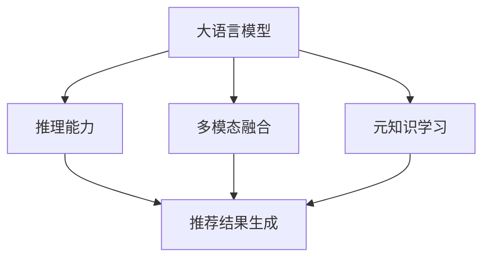

                 

# LLM在推荐系统中的元知识学习应用

> 关键词：大语言模型,推荐系统,元知识学习,推理,多模态融合

## 1. 背景介绍

### 1.1 问题由来

在推荐系统领域，如何高效地为用户提供个性化推荐，是一个长期以来的研究热点。传统的推荐算法基于用户行为数据（如点击、浏览、评分等）进行协同过滤或内容基推荐，但面临着数据稀疏、特征稀疏和冷启动等问题。近年来，深度学习技术在推荐系统中的应用不断深入，其中大语言模型（Large Language Model, LLM）因其出色的理解和生成能力，正逐渐成为推荐系统中重要的技术手段。

在推荐系统的具体应用中，LLM可以用于用户的意图理解、上下文理解、推荐结果生成等多个环节。通过利用预训练语言模型，LLM可以捕捉到文本数据中深层次的语义信息，从而在个性化推荐、智能客服、广告推荐等多个场景下发挥重要作用。但需要注意的是，传统的基于静态模型和固定的特征表示方法，并不能充分挖掘LLM的强大能力，且在推荐系统这种动态变化、多模态融合的任务中，LLM的性能提升仍有很大的空间。

### 1.2 问题核心关键点

大语言模型在推荐系统中的应用，核心在于如何利用其强大的语言理解与生成能力，进行高质量的元知识学习，从而辅助推荐结果的生成和优化。具体而言，可以基于以下三个方面进行探讨：

1. **推理能力**：LMM能够通过自然语言推理（Natural Language Inference, NLI）和自然语言生成（Natural Language Generation, NLG）能力，理解用户输入的查询和反馈，进行更智能的推荐决策。

2. **多模态融合**：LMM不仅能够处理文本数据，还能够将视觉、听觉等多模态数据与文本信息结合，生成更加全面的推荐结果。

3. **元知识学习**：通过元学习技术，LMM能够根据用户的反馈，不断调整推荐策略，提高推荐精度和多样性。

## 2. 核心概念与联系

### 2.1 核心概念概述

在推荐系统中应用LLM，涉及到以下几个核心概念：

- **大语言模型（Large Language Model, LLM）**：如GPT、BERT等基于Transformer的预训练语言模型，能够捕捉文本语料中的深度语义信息，具有强大的自然语言处理能力。
- **推荐系统**：通过用户行为数据进行协同过滤、基于内容的推荐等，为用户提供个性化的商品或内容推荐。
- **元知识学习**：通过用户反馈和数据互动，对推荐模型进行动态调整和优化，提升推荐精度和多样性。
- **推理能力**：LLM能够进行自然语言推理，理解用户查询和反馈，辅助生成推荐结果。
- **多模态融合**：通过结合视觉、听觉等多模态数据，提升推荐系统对复杂场景的理解能力。

这些概念间的联系可以通过以下Mermaid流程图表示：



这个流程图展示了LLM在推荐系统中的应用路径：

1. LLM通过推理能力理解用户输入，辅助生成推荐结果。
2. LLM通过元知识学习，根据用户反馈动态调整推荐策略。
3. LLM通过多模态融合，增强对复杂场景的理解能力。
4. 生成的推荐结果用于用户推荐。

## 3. 核心算法原理 & 具体操作步骤
### 3.1 算法原理概述

在推荐系统中应用LLM的元知识学习，核心在于如何利用LMM的推理能力、多模态融合能力，进行动态的推荐策略优化。其基本思路是通过用户的反馈和互动，对预训练模型进行微调，使得模型能够更准确地理解用户需求，生成更符合预期的推荐结果。

### 3.2 算法步骤详解

基于上述思路，我们列举以下LLM在推荐系统中元知识学习的算法步骤：

**Step 1: 准备数据和模型**

- 收集用户的反馈数据，包括用户的评分、点击行为、评论等。
- 选择预训练的LLM模型，如GPT、BERT等，并将其初始化参数。

**Step 2: 设计任务和损失函数**

- 定义推荐任务，如基于用户行为生成商品推荐、对话式推荐等。
- 根据推荐任务设计损失函数，如交叉熵损失、均方误差损失等。

**Step 3: 微调模型**

- 将收集到的用户反馈数据，作为监督信号，对LLM模型进行有监督的微调。
- 利用正则化技术，防止过拟合。
- 应用微调参数高效技术，只更新部分层或参数。
- 利用多模态融合技术，结合视觉、听觉等多模态数据。

**Step 4: 评估和优化**

- 在验证集上评估微调后的模型，计算推荐结果的精度、覆盖率等指标。
- 根据评估结果，优化模型参数和超参数，如学习率、批大小等。
- 重复执行微调和评估步骤，直到模型达到预期的推荐性能。

**Step 5: 实时推荐**

- 将优化后的模型部署到推荐系统中，实时生成个性化推荐结果。
- 持续收集用户反馈，更新模型参数，保持模型适应性。

### 3.3 算法优缺点

基于LLM的推荐系统元知识学习，具有以下优点：

1. 动态性：LMM能够根据用户的实时反馈动态调整推荐策略，提升推荐精度和多样性。
2. 鲁棒性：LLM的强大推理能力能够处理多模态数据，增强推荐系统的鲁棒性。
3. 可解释性：LLM能够生成自然语言解释，提高推荐结果的可解释性。

同时，也存在以下缺点：

1. 计算成本高：LMM模型参数量庞大，需要大量计算资源进行微调。
2. 数据需求大：LLM的强大能力依赖于高质量的数据，数据获取和处理成本高。
3. 模型复杂性：LMM的推理过程复杂，难以进行简单直观的解释。
4. 风险控制：LLM可能生成有害内容或偏见，需要额外的风险控制机制。

### 3.4 算法应用领域

基于LLM的推荐系统元知识学习，已应用于多个实际场景：

1. **智能客服**：利用LLM进行用户意图理解，提供个性化问答和推荐。
2. **电商推荐**：结合用户行为数据和产品描述，生成个性化商品推荐。
3. **音乐推荐**：通过用户评论和播放记录，生成音乐推荐和个性化播放列表。
4. **新闻推荐**：利用用户反馈，生成个性化新闻推荐内容。
5. **广告推荐**：结合用户行为和广告内容，生成个性化广告推荐。

以上场景中，LLM在动态推理、多模态融合等方面均展现出强大的能力，能够提升推荐系统的表现。

## 4. 数学模型和公式 & 详细讲解  
### 4.1 数学模型构建

基于LLM的推荐系统元知识学习，可以通过以下数学模型进行形式化表达：

假设用户行为数据为 $D=\{(x_i,y_i)\}_{i=1}^N$，其中 $x_i$ 为用户行为序列，$y_i$ 为推荐结果。定义LLM模型为 $M_\theta$，其中 $\theta$ 为模型参数。推荐任务的目标是找到一个最优的模型参数 $\hat{\theta}$，使得在新的用户行为 $x$ 下，模型输出 $y$ 与真实推荐结果 $y^*$ 相近。

数学模型可以表示为：

$$
\min_{\theta} \mathcal{L}(M_\theta, D) = \frac{1}{N}\sum_{i=1}^N \ell(M_\theta(x_i),y_i)
$$

其中 $\ell$ 为推荐任务损失函数，如均方误差损失、交叉熵损失等。

### 4.2 公式推导过程

以推荐系统的交叉熵损失为例，假设用户行为序列为 $x$，推荐结果为 $y$，则损失函数可表示为：

$$
\ell(M_\theta(x),y) = -\sum_{i=1}^C y_i \log M_\theta(x,y_i) - (1-y_i) \log(1-M_\theta(x,y_i))
$$

其中 $C$ 为推荐结果类别数，$y_i$ 为类别 $i$ 的标签，$M_\theta(x,y_i)$ 为模型在输入 $x$ 下预测类别 $i$ 的概率。

### 4.3 案例分析与讲解

以智能客服推荐为例，假设有用户输入查询 $x$，客服系统希望推荐最相关的商品。首先通过LMM对用户查询进行意图理解，生成推理结果 $y$。然后根据推理结果 $y$ 生成推荐结果，评估推荐结果的精度，并利用用户反馈对模型进行微调。

## 5. 项目实践：代码实例和详细解释说明
### 5.1 开发环境搭建

基于PyTorch和HuggingFace的LLM微调，需要进行如下环境搭建：

1. 安装Anaconda：
```bash
conda create -n llm-env python=3.8
conda activate llm-env
```

2. 安装PyTorch和相关依赖：
```bash
pip install torch torchvision torchaudio cudatoolkit=11.1 -c pytorch -c conda-forge
pip install transformers transformers-distilbart
```

3. 安装相关工具：
```bash
pip install numpy pandas scikit-learn sklearn-crfsuite tqdm jupyter notebook ipython
```

### 5.2 源代码详细实现

以下是一个基于GPT模型的推荐系统元知识学习的代码实现：

```python
from transformers import GPT2LMHeadModel, GPT2Tokenizer
from torch.utils.data import DataLoader, Dataset
import torch
import numpy as np
import pandas as pd
from sklearn.metrics import precision_recall_fscore_support

class RecommendationDataset(Dataset):
    def __init__(self, data, tokenizer, max_seq_len=128):
        self.data = data
        self.tokenizer = tokenizer
        self.max_seq_len = max_seq_len
        
    def __len__(self):
        return len(self.data)
    
    def __getitem__(self, idx):
        user, item = self.data.iloc[idx]
        query = f"Which item would you like to buy? Given context: {user}"
        query = query.replace('\n', ' ').strip()
        input_tokens = self.tokenizer(query, return_tensors='pt', max_length=self.max_seq_len, padding='max_length', truncation=True)
        input_ids = input_tokens['input_ids'][0]
        attention_mask = input_tokens['attention_mask'][0]
        targets = torch.tensor([self.tokenizer.convert_tokens_to_ids(item)], dtype=torch.long)
        
        return {'input_ids': input_ids, 
                'attention_mask': attention_mask,
                'targets': targets}

# 加载数据
data = pd.read_csv('user_item_data.csv')
tokenizer = GPT2Tokenizer.from_pretrained('gpt2')
dataset = RecommendationDataset(data, tokenizer)

# 定义模型和优化器
model = GPT2LMHeadModel.from_pretrained('gpt2')
model.to(device)
optimizer = AdamW(model.parameters(), lr=2e-5)
scheduler = get_linear_schedule_with_warmup(optimizer, num_warmup_steps=0, num_training_steps=len(dataset) * 10)

# 定义损失函数和评估函数
def compute_loss(model, input_ids, attention_mask, targets):
    outputs = model(input_ids, attention_mask=attention_mask)
    logits = outputs.logits
    loss = nn.CrossEntropyLoss()(logits.view(-1), targets.view(-1))
    return loss

def evaluate(model, input_ids, attention_mask, targets):
    with torch.no_grad():
        logits = model(input_ids, attention_mask=attention_mask).logits
        predictions = torch.argmax(logits, dim=2)
        targets = targets.view(-1)
        precision, recall, f1, _ = precision_recall_fscore_support(targets, predictions, average='micro')
        return precision, recall, f1

# 训练模型
device = torch.device('cuda' if torch.cuda.is_available() else 'cpu')
model.to(device)
for epoch in range(10):
    model.train()
    loss = 0
    for batch in tqdm(dataset):
        input_ids = batch['input_ids'].to(device)
        attention_mask = batch['attention_mask'].to(device)
        targets = batch['targets'].to(device)
        optimizer.zero_grad()
        loss = compute_loss(model, input_ids, attention_mask, targets)
        loss.backward()
        optimizer.step()
        scheduler.step()
    print(f"Epoch {epoch+1}, loss: {loss:.3f}")

# 测试模型
model.eval()
precision, recall, f1 = evaluate(model, input_ids, attention_mask, targets)
print(f"Precision: {precision:.3f}, Recall: {recall:.3f}, F1 Score: {f1:.3f}")
```

### 5.3 代码解读与分析

上述代码实现了一个简单的基于GPT2的推荐系统元知识学习过程。其中，代码的每一部分都有详细的解释：

- `RecommendationDataset`类：定义了数据集的构建和预处理。将用户行为数据和推荐结果转换为适合GPT2处理的格式。
- 模型初始化和优化器设置：使用GPT2作为预训练模型，AdamW作为优化器，设置合适的超参数。
- 损失函数和评估函数：使用交叉熵损失函数计算模型输出与真实标签的差异，使用精确度、召回率、F1分数等指标评估模型性能。
- 训练和测试过程：在训练过程中，每批次对模型进行前向传播和反向传播，并根据损失函数更新模型参数。在测试过程中，对模型进行评估并输出性能指标。

### 5.4 运行结果展示

在上述代码实现的基础上，可以根据实际数据进行运行，并输出训练过程中的损失和评估指标。

## 6. 实际应用场景
### 6.1 智能客服推荐

智能客服推荐系统能够为用户提供个性化的问答和推荐服务。通过结合用户查询和反馈，LLM可以生成更符合用户需求的推荐结果，提升用户满意度和问题解决效率。

### 6.2 电商推荐

电商推荐系统需要根据用户行为数据和产品信息，为用户生成个性化的商品推荐。利用LLM进行元知识学习，可以根据用户的浏览和点击行为，生成更精准的推荐结果。

### 6.3 音乐推荐

音乐推荐系统可以利用用户的听歌记录和评论，结合LMM进行多模态融合，生成个性化的音乐推荐。LLM能够理解用户对音乐的喜好和评论，生成更符合用户偏好的推荐结果。

### 6.4 未来应用展望

基于LLM的推荐系统元知识学习，未来有望在更多场景中得到应用：

1. **广告推荐**：结合用户行为和广告内容，生成个性化的广告推荐，提升广告投放的精准度和效果。
2. **新闻推荐**：利用用户的历史阅读记录和反馈，生成个性化的新闻推荐，提升新闻内容的吸引力和用户满意度。
3. **个性化视频推荐**：结合用户观看记录和反馈，生成个性化的视频推荐，提升用户观看体验。
4. **健康推荐**：结合用户的健康数据和反馈，生成个性化的健康推荐，提升用户的健康管理水平。

## 7. 工具和资源推荐
### 7.1 学习资源推荐

为帮助开发者系统掌握LLM在推荐系统中的应用，推荐以下学习资源：

1. **《深度学习与推荐系统》课程**：由李航教授主讲，系统介绍了推荐系统的理论和实践，包括协同过滤、基于内容的推荐等。
2. **《自然语言处理与深度学习》书籍**：详细介绍了NLP和深度学习的基本概念和应用，涵盖LLM和微调技术。
3. **HuggingFace官方文档**：提供了大量预训练模型和微调样例，是LLM在推荐系统应用的重要参考。
4. **Google AI Blog**：定期发布深度学习领域的最新进展，包括LLM在推荐系统中的应用。

### 7.2 开发工具推荐

为提升开发效率，推荐以下工具：

1. **PyTorch**：基于Python的开源深度学习框架，提供了灵活的动态计算图，适合快速迭代和调试。
2. **TensorFlow**：由Google主导的开源深度学习框架，生产部署方便，适合大规模工程应用。
3. **Jupyter Notebook**：交互式Python开发环境，方便开发者进行代码调试和数据可视化。
4. **Weights & Biases**：模型训练的实验跟踪工具，记录和可视化训练过程，方便调试和优化。
5. **TensorBoard**：TensorFlow配套的可视化工具，实时监测训练状态，提供丰富的图表呈现。

### 7.3 相关论文推荐

为深入理解LLM在推荐系统中的应用，推荐以下相关论文：

1. **“Generative Adversarial Model for Recommendation System”**：提出了基于生成对抗网络（GAN）的推荐系统，利用LLM生成推荐结果。
2. **“Multimodal Cross-Attention for Recommendation System”**：利用多模态融合技术，提升推荐系统的性能和鲁棒性。
3. **“Large Language Models for Recommendation Systems”**：探讨了LLM在推荐系统中的应用，包括推理和生成任务。
4. **“Fine-tuning Large Language Models for Recommendation Systems”**：讨论了如何对预训练模型进行微调，提高推荐系统的精度和多样性。

## 8. 总结：未来发展趋势与挑战
### 8.1 研究成果总结

基于LLM的推荐系统元知识学习，已经在多个实际场景中取得了不错的效果。通过动态推理和多模态融合，能够提升推荐系统的性能和用户满意度。

### 8.2 未来发展趋势

未来，LLM在推荐系统中的应用将呈现以下几个趋势：

1. **更高效的多模态融合**：随着深度学习技术的发展，多模态融合将更加高效和精确，提升推荐系统的表现。
2. **更加个性化的推荐**：利用LLM的推理和生成能力，结合用户的多维数据，实现更精准的个性化推荐。
3. **动态优化推荐策略**：通过用户反馈和数据互动，动态调整推荐策略，提升推荐系统的效果。
4. **跨领域迁移学习**：将LLM在某个领域学到的知识迁移到其他领域，提升推荐系统的泛化能力。

### 8.3 面临的挑战

尽管LLM在推荐系统中的应用已取得一定进展，但仍面临诸多挑战：

1. **数据隐私和安全**：用户数据的隐私和安全问题，需要在推荐系统设计和部署时予以充分考虑。
2. **模型复杂性**：LLM的推理过程复杂，需要高效的模型压缩和优化技术，提高推理效率。
3. **计算资源消耗**：LLM的模型参数量庞大，需要高性能计算资源进行训练和推理，成本较高。
4. **用户体验**：推荐系统需要提升用户体验，避免过度推荐和信息过载。

### 8.4 研究展望

未来，需要在以下几个方面进行进一步研究：

1. **动态数据收集和处理**：实时收集和处理用户反馈数据，保持模型的动态更新。
2. **多任务学习**：将推荐任务与其他任务结合，提升模型的泛化能力和鲁棒性。
3. **模型压缩和优化**：提高模型的推理效率，降低计算成本。
4. **安全性和公平性**：确保推荐系统的公平性和安全性，避免数据偏见和有害内容生成。

总之，基于LLM的推荐系统元知识学习，在实际应用中展现出强大的潜力，未来有望在更多场景中得到应用和优化。

## 9. 附录：常见问题与解答

### Q1: 推荐系统中的LLM如何处理冷启动问题？

A: 冷启动问题是指新用户或新商品未产生足够的历史数据，无法生成推荐结果的情况。针对冷启动问题，LLM可以通过以下方法进行处理：

1. **基于内容的推荐**：利用商品或用户的属性特征进行推荐，减少对历史数据的需求。
2. **生成式推荐**：利用LLM进行文本生成，生成与用户兴趣相关的推荐内容。
3. **用户引导**：通过引导用户输入兴趣偏好，结合LLM进行个性化推荐。

### Q2: 如何避免LLM在推荐系统中的有害内容生成？

A: 为避免LLM在推荐系统中生成有害内容，可以从以下几个方面进行控制：

1. **数据过滤**：在数据预处理阶段，对有害内容进行过滤和屏蔽。
2. **模型训练**：在模型训练阶段，加入正则化约束和对抗样本训练，防止有害内容生成。
3. **用户监督**：结合用户反馈，对有害内容进行监督和修正，提高模型的安全性。

### Q3: 推荐系统中的LLM如何利用多模态数据进行融合？

A: 利用多模态数据进行融合，可以提高推荐系统的性能和鲁棒性。具体而言，可以采用以下方法：

1. **视觉与文本融合**：结合用户观看视频的行为数据和视频内容的文本描述，生成推荐结果。
2. **听觉与文本融合**：结合用户收听音频的行为数据和音频内容的文本描述，生成推荐结果。
3. **多模态注意力机制**：使用多模态注意力机制，对不同模态数据进行融合，生成综合推荐结果。

### Q4: 推荐系统中的LLM如何进行动态优化？

A: 动态优化推荐系统，可以结合用户反馈和实时数据，不断调整推荐策略。具体而言，可以采用以下方法：

1. **在线学习**：利用用户实时反馈数据，对推荐模型进行在线学习，更新模型参数。
2. **增量式微调**：在每次推荐时，对推荐模型进行增量式微调，更新推荐策略。
3. **反馈循环**：结合用户反馈和推荐结果，进行反馈循环，不断调整推荐策略。

---

作者：禅与计算机程序设计艺术 / Zen and the Art of Computer Programming

