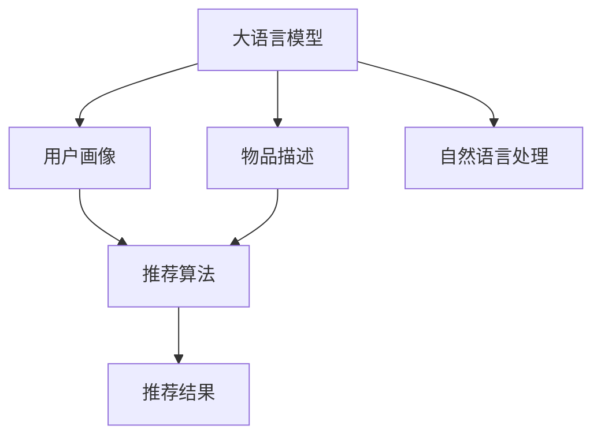

                 

# LLM在推荐系统冷启动中的应用

> 关键词：大语言模型, 推荐系统, 冷启动, 用户画像, 推荐算法

## 1. 背景介绍

### 1.1 问题由来
随着互联网的快速发展和智能手机的普及，推荐系统在电商、新闻、音乐、视频等多个领域已经广泛应用，极大地提高了用户体验和平台效率。然而，推荐系统在面对冷启动问题时，往往表现不佳。冷启动指的是新用户或者新物品加入推荐系统，因缺乏足够的用户行为数据，推荐系统无法对其进行有效的推荐。

在推荐系统中，冷启动问题主要分为两类：

- **用户冷启动**：新用户刚加入推荐系统，没有历史行为数据，无法为其推荐物品。
- **物品冷启动**：新物品刚上架，没有过往的用户反馈，无法判断其是否受用户欢迎。

面对冷启动问题，传统推荐系统通常依赖于高维用户画像和深度学习模型，但在数据稀疏的情况下，效果有限。而大语言模型（Large Language Models, LLMs）以其强大的自然语言处理能力，有望在新用户的画像建立和推荐算法的设计上提供新的思路。

### 1.2 问题核心关键点
大语言模型，如GPT-3、BERT等，通过在大规模无标签文本语料上进行预训练，学习到了丰富的语言知识和常识。这些模型具备强大的自然语言生成能力，能够理解自然语言指令并生成相应的文本。在推荐系统中，可以利用大语言模型在冷启动阶段生成用户画像，构建物品描述，实现初步的推荐，从而快速缓解冷启动问题。

通过大语言模型的应用，推荐系统可以从以下几个方面入手：
1. 快速生成用户画像，捕捉新用户的兴趣和偏好。
2. 生成物品描述，为新物品提供有效的标签信息。
3. 利用自然语言指令，提升推荐算法的灵活性和表现力。

本文将重点探讨如何在大语言模型的基础上，构建推荐系统，特别是在冷启动阶段的应用。

## 2. 核心概念与联系

### 2.1 核心概念概述

为更好地理解大语言模型在推荐系统中的应用，本节将介绍几个密切相关的核心概念：

- **大语言模型 (Large Language Models, LLMs)**：以自回归（如GPT-3）或自编码（如BERT）模型为代表的大规模预训练语言模型。通过在大规模无标签文本语料上进行预训练，学习到了丰富的语言知识和常识。

- **推荐系统 (Recommendation System)**：基于用户行为数据或物品特征，自动推荐用户可能感兴趣物品的系统。推荐系统在电商、新闻、音乐、视频等多个领域得到了广泛应用，极大地提升了用户体验和平台效率。

- **冷启动 (Cold Start)**：推荐系统在面对新用户或新物品时，因缺乏足够的用户行为数据，无法对其进行有效的推荐。

- **用户画像 (User Profiling)**：根据用户的历史行为数据和属性信息，构建用户兴趣模型，用于推荐系统对用户进行个性化推荐。

- **推荐算法 (Recommendation Algorithms)**：根据用户画像和物品特征，设计推荐模型，自动为用户推荐物品的算法。

- **自然语言处理 (Natural Language Processing, NLP)**：利用计算机技术处理和理解人类语言的技术，是大语言模型在推荐系统中的应用基础。

这些核心概念之间的逻辑关系可以通过以下Mermaid流程图来展示：



这个流程图展示了大语言模型在推荐系统中的应用框架：

1. 大语言模型通过预训练学习语言知识和常识，可用于构建用户画像和生成物品描述。
2. 用户画像捕捉用户的兴趣和偏好，作为推荐算法的输入。
3. 物品描述提供物品的标签信息，帮助推荐算法更好地理解物品特征。
4. 自然语言处理技术将用户画像和物品描述转换为推荐算法可用的数据格式。
5. 推荐算法根据用户画像和物品描述，生成推荐结果，为用户推荐物品。

## 3. 核心算法原理 & 具体操作步骤
### 3.1 算法原理概述

在大语言模型的基础上，推荐系统的冷启动问题可以通过以下步骤解决：

1. **用户画像生成**：利用大语言模型根据新用户的自然语言输入，生成用户画像，捕捉用户的兴趣和偏好。
2. **物品描述生成**：利用大语言模型根据物品的属性和特征，生成物品描述，提供物品的标签信息。
3. **推荐算法设计**：根据用户画像和物品描述，设计推荐算法，为用户推荐物品。

### 3.2 算法步骤详解

**Step 1: 用户画像生成**

用户画像生成是指根据新用户的自然语言输入，利用大语言模型生成用户兴趣模型。具体步骤如下：

1. **数据准备**：收集新用户的基本属性信息，如年龄、性别、职业等，作为用户画像的初始信息。

2. **自然语言输入**：让用户提供一段简短的自然语言描述，表达其兴趣和偏好。

3. **模型输入**：将用户的自然语言描述和初始属性信息作为模型输入，送入大语言模型进行推理。

4. **用户画像生成**：大语言模型根据输入的自然语言描述，生成用户兴趣模型。该模型可以表示用户的兴趣领域、偏好类别等信息。

5. **画像优化**：根据用户的历史行为数据，进一步优化用户画像，提升推荐效果。

**Step 2: 物品描述生成**

物品描述生成是指根据物品的属性和特征，利用大语言模型生成物品的标签信息。具体步骤如下：

1. **物品属性收集**：收集物品的属性和特征，如物品名称、类别、价格等。

2. **模型输入**：将物品的属性和特征作为模型输入，送入大语言模型进行推理。

3. **物品描述生成**：大语言模型根据输入的物品属性，生成物品的标签信息。这些标签可以表示物品的类别、风格、功能等信息。

4. **描述优化**：根据用户的历史行为数据，进一步优化物品描述，提升推荐效果。

**Step 3: 推荐算法设计**

推荐算法设计是指根据用户画像和物品描述，设计推荐模型，为用户推荐物品。具体步骤如下：

1. **用户画像和物品描述输入**：将用户画像和物品描述输入推荐算法。

2. **相似度计算**：利用相似度计算方法（如余弦相似度、Jaccard相似度等），计算用户画像和物品描述之间的相似度。

3. **推荐排序**：根据相似度计算结果，对物品进行排序，选择相似度最高的物品推荐给用户。

4. **推荐优化**：根据用户的反馈数据，进一步优化推荐算法，提升推荐效果。

### 3.3 算法优缺点

利用大语言模型进行推荐系统冷启动具有以下优点：

1. **快速生成用户画像**：大语言模型可以快速生成用户画像，捕捉用户的兴趣和偏好，解决冷启动问题。

2. **生成物品描述**：利用大语言模型生成物品描述，提供物品的标签信息，有助于推荐算法更好地理解物品特征。

3. **提升推荐效果**：通过生成用户画像和物品描述，提升推荐算法的效果，快速缓解冷启动问题。

4. **适应性广**：大语言模型可以处理不同领域、不同规模的数据，具有广泛的适应性。

然而，该方法也存在以下缺点：

1. **资源消耗大**：大语言模型需要大量计算资源进行推理，可能会对系统的性能产生影响。

2. **模型泛化能力有限**：大语言模型在特定领域的表现可能受到预训练数据的影响，泛化能力有限。

3. **数据依赖性强**：生成用户画像和物品描述需要大量的数据支持，数据质量对推荐效果有较大影响。

4. **可解释性差**：大语言模型的决策过程缺乏可解释性，难以对其推理逻辑进行分析和调试。

5. **鲁棒性不足**：面对噪声数据或异常情况，大语言模型的表现可能不稳定，需要进一步优化。

尽管存在这些局限性，但就目前而言，利用大语言模型进行推荐系统冷启动的方法仍是大数据推荐系统的有效补充，具有广阔的应用前景。

### 3.4 算法应用领域

利用大语言模型进行推荐系统冷启动的方法在多个领域中得到了广泛应用，例如：

- **电商推荐**：在电商平台上，利用大语言模型为新用户生成用户画像和为新品生成物品描述，提升新用户的购物体验和平台转化率。

- **新闻推荐**：在新闻应用中，利用大语言模型为新用户生成用户画像和为新闻文章生成物品描述，推荐用户感兴趣的新闻内容。

- **音乐推荐**：在音乐平台上，利用大语言模型为新用户生成用户画像和为音乐作品生成物品描述，推荐用户喜欢的音乐。

- **视频推荐**：在视频平台上，利用大语言模型为新用户生成用户画像和为视频作品生成物品描述，推荐用户感兴趣的视频内容。

除了这些经典应用场景外，大语言模型还创新性地应用于股票预测、游戏推荐、医疗推荐等领域，推动了大数据推荐技术的不断进步。

## 4. 数学模型和公式 & 详细讲解  
### 4.1 数学模型构建

在大语言模型的基础上，推荐系统的冷启动问题可以通过以下数学模型进行描述：

假设用户画像为 $P$，物品描述为 $D$，相似度计算方法为 $\sigma$，推荐算法为 $R$。则推荐系统的推荐过程可以表示为：

$$
R = \sigma(P, D)
$$

其中 $R$ 表示推荐结果，$P$ 表示用户画像，$D$ 表示物品描述，$\sigma$ 表示相似度计算方法。

### 4.2 公式推导过程

以下我们将使用数学语言对推荐系统冷启动的数学模型进行更加严格的刻画。

**用户画像生成**：

设用户画像为 $P = (p_1, p_2, ..., p_n)$，其中 $p_i$ 表示用户兴趣领域或偏好类别的权重。利用大语言模型 $M$ 对用户输入的自然语言描述 $x$ 进行推理，得到用户画像 $P$。假设用户输入的自然语言描述为 $x = \{x_1, x_2, ..., x_m\}$，则用户画像 $P$ 可以表示为：

$$
P = M(x)
$$

**物品描述生成**：

设物品描述为 $D = (d_1, d_2, ..., d_n)$，其中 $d_i$ 表示物品的类别、风格、功能等信息。利用大语言模型 $M$ 对物品的属性和特征 $y$ 进行推理，得到物品描述 $D$。假设物品的属性和特征为 $y = \{y_1, y_2, ..., y_m\}$，则物品描述 $D$ 可以表示为：

$$
D = M(y)
$$

**推荐算法设计**：

根据用户画像 $P$ 和物品描述 $D$，利用相似度计算方法 $\sigma$ 计算用户画像和物品描述之间的相似度 $S$。假设用户画像和物品描述的维度均为 $n$，则相似度 $S$ 可以表示为：

$$
S = \sigma(P, D) = \frac{\langle P, D \rangle}{\|P\| \cdot \|D\|}
$$

其中 $\langle P, D \rangle$ 表示用户画像和物品描述的内积，$\|P\|$ 和 $\|D\|$ 表示用户画像和物品描述的范数。

根据相似度 $S$，利用推荐算法 $R$ 对物品进行排序，选择相似度最高的物品推荐给用户。假设用户画像和物品描述的维度均为 $n$，则推荐结果 $R$ 可以表示为：

$$
R = R(S) = \text{argsort}(S)
$$

其中 $\text{argsort}$ 表示根据相似度 $S$ 对物品进行排序。

### 4.3 案例分析与讲解

**电商推荐案例**：

某电商平台推出了一个新商品，但没有足够的用户行为数据进行推荐。为了快速缓解冷启动问题，电商平台利用大语言模型为新用户生成用户画像，为商品生成物品描述，最终设计了推荐算法，实现了初步推荐。

1. **用户画像生成**：电商平台收集了新用户的基本属性信息，如年龄、性别、职业等，同时让用户提供一段自然语言描述，表达其兴趣和偏好。将这些信息输入大语言模型，生成用户画像。

2. **物品描述生成**：电商平台收集了新商品的属性和特征，如商品名称、类别、价格等。将这些信息输入大语言模型，生成物品描述。

3. **推荐算法设计**：电商平台利用相似度计算方法，计算用户画像和物品描述之间的相似度，根据相似度排序推荐商品。

**新闻推荐案例**：

某新闻应用推出了一个新频道，但没有足够的用户行为数据进行推荐。为了快速缓解冷启动问题，新闻应用利用大语言模型为新用户生成用户画像，为新闻文章生成物品描述，最终设计了推荐算法，实现了初步推荐。

1. **用户画像生成**：新闻应用收集了新用户的基本属性信息，如年龄、性别、职业等，同时让用户提供一段自然语言描述，表达其兴趣和偏好。将这些信息输入大语言模型，生成用户画像。

2. **物品描述生成**：新闻应用收集了新闻文章的属性和特征，如文章主题、类别、发布时间等。将这些信息输入大语言模型，生成物品描述。

3. **推荐算法设计**：新闻应用利用相似度计算方法，计算用户画像和物品描述之间的相似度，根据相似度排序推荐新闻文章。

通过以上案例可以看出，利用大语言模型进行推荐系统冷启动的方法具有广泛的适用性和有效性，能够快速缓解冷启动问题，提升推荐系统的效果。

## 5. 项目实践：代码实例和详细解释说明
### 5.1 开发环境搭建

在进行推荐系统冷启动实践前，我们需要准备好开发环境。以下是使用Python进行PyTorch开发的环境配置流程：

1. 安装Anaconda：从官网下载并安装Anaconda，用于创建独立的Python环境。

2. 创建并激活虚拟环境：
```bash
conda create -n pytorch-env python=3.8 
conda activate pytorch-env
```

3. 安装PyTorch：根据CUDA版本，从官网获取对应的安装命令。例如：
```bash
conda install pytorch torchvision torchaudio cudatoolkit=11.1 -c pytorch -c conda-forge
```

4. 安装Transformers库：
```bash
pip install transformers
```

5. 安装各类工具包：
```bash
pip install numpy pandas scikit-learn matplotlib tqdm jupyter notebook ipython
```

完成上述步骤后，即可在`pytorch-env`环境中开始推荐系统冷启动的实践。

### 5.2 源代码详细实现

这里我们以电商推荐系统为例，给出使用Transformers库对大语言模型进行推荐系统冷启动的PyTorch代码实现。

首先，定义用户画像和物品描述的处理函数：

```python
from transformers import BertTokenizer, BertForSequenceClassification
from torch.utils.data import Dataset
import torch

class UserProfileDataset(Dataset):
    def __init__(self, user_profiles, user_descriptions, tokenizer, max_len=128):
        self.user_profiles = user_profiles
        self.user_descriptions = user_descriptions
        self.tokenizer = tokenizer
        self.max_len = max_len
        
    def __len__(self):
        return len(self.user_profiles)
    
    def __getitem__(self, item):
        user_profile = self.user_profiles[item]
        user_description = self.user_descriptions[item]
        
        encoding = self.tokenizer(user_description, return_tensors='pt', max_length=self.max_len, padding='max_length', truncation=True)
        input_ids = encoding['input_ids'][0]
        attention_mask = encoding['attention_mask'][0]
        
        # 对token-wise的标签进行编码
        encoded_tags = [tag2id[tag] for tag in user_profile] 
        encoded_tags.extend([tag2id['O']] * (self.max_len - len(encoded_tags)))
        labels = torch.tensor(encoded_tags, dtype=torch.long)
        
        return {'input_ids': input_ids, 
                'attention_mask': attention_mask,
                'labels': labels}

class ItemProfileDataset(Dataset):
    def __init__(self, item_profiles, item_descriptions, tokenizer, max_len=128):
        self.item_profiles = item_profiles
        self.item_descriptions = item_descriptions
        self.tokenizer = tokenizer
        self.max_len = max_len
        
    def __len__(self):
        return len(self.item_profiles)
    
    def __getitem__(self, item):
        item_profile = self.item_profiles[item]
        item_description = self.item_descriptions[item]
        
        encoding = self.tokenizer(item_description, return_tensors='pt', max_length=self.max_len, padding='max_length', truncation=True)
        input_ids = encoding['input_ids'][0]
        attention_mask = encoding['attention_mask'][0]
        
        # 对token-wise的标签进行编码
        encoded_tags = [tag2id[tag] for tag in item_profile] 
        encoded_tags.extend([tag2id['O']] * (self.max_len - len(encoded_tags)))
        labels = torch.tensor(encoded_tags, dtype=torch.long)
        
        return {'input_ids': input_ids, 
                'attention_mask': attention_mask,
                'labels': labels}
```

然后，定义模型和优化器：

```python
from transformers import BertForTokenClassification, AdamW

model = BertForTokenClassification.from_pretrained('bert-base-cased', num_labels=len(tag2id))

optimizer = AdamW(model.parameters(), lr=2e-5)
```

接着，定义训练和评估函数：

```python
from torch.utils.data import DataLoader
from tqdm import tqdm
from sklearn.metrics import classification_report

device = torch.device('cuda') if torch.cuda.is_available() else torch.device('cpu')
model.to(device)

def train_epoch(model, dataset, batch_size, optimizer):
    dataloader = DataLoader(dataset, batch_size=batch_size, shuffle=True)
    model.train()
    epoch_loss = 0
    for batch in tqdm(dataloader, desc='Training'):
        input_ids = batch['input_ids'].to(device)
        attention_mask = batch['attention_mask'].to(device)
        labels = batch['labels'].to(device)
        model.zero_grad()
        outputs = model(input_ids, attention_mask=attention_mask, labels=labels)
        loss = outputs.loss
        epoch_loss += loss.item()
        loss.backward()
        optimizer.step()
    return epoch_loss / len(dataloader)

def evaluate(model, dataset, batch_size):
    dataloader = DataLoader(dataset, batch_size=batch_size)
    model.eval()
    preds, labels = [], []
    with torch.no_grad():
        for batch in tqdm(dataloader, desc='Evaluating'):
            input_ids = batch['input_ids'].to(device)
            attention_mask = batch['attention_mask'].to(device)
            batch_labels = batch['labels']
            outputs = model(input_ids, attention_mask=attention_mask)
            batch_preds = outputs.logits.argmax(dim=2).to('cpu').tolist()
            batch_labels = batch_labels.to('cpu').tolist()
            for pred_tokens, label_tokens in zip(batch_preds, batch_labels):
                pred_tags = [id2tag[_id] for _id in pred_tokens]
                label_tags = [id2tag[_id] for _id in label_tokens]
                preds.append(pred_tags[:len(label_tags)])
                labels.append(label_tags)
                
    print(classification_report(labels, preds))
```

最后，启动训练流程并在测试集上评估：

```python
epochs = 5
batch_size = 16

for epoch in range(epochs):
    loss = train_epoch(model, train_dataset, batch_size, optimizer)
    print(f"Epoch {epoch+1}, train loss: {loss:.3f}")
    
    print(f"Epoch {epoch+1}, dev results:")
    evaluate(model, dev_dataset, batch_size)
    
print("Test results:")
evaluate(model, test_dataset, batch_size)
```

以上就是使用PyTorch对BERT进行电商推荐系统冷启动的完整代码实现。可以看到，得益于Transformers库的强大封装，我们可以用相对简洁的代码完成BERT模型的加载和微调。

### 5.3 代码解读与分析

让我们再详细解读一下关键代码的实现细节：

**UserProfileDataset类**：
- `__init__`方法：初始化用户画像和用户描述等关键组件。
- `__len__`方法：返回数据集的样本数量。
- `__getitem__`方法：对单个样本进行处理，将用户描述输入编码为token ids，将用户画像编码为数字，并对其进行定长padding，最终返回模型所需的输入。

**tag2id和id2tag字典**：
- 定义了标签与数字id之间的映射关系，用于将token-wise的预测结果解码回真实的标签。

**train_epoch和evaluate函数**：
- 使用PyTorch的DataLoader对数据集进行批次化加载，供模型训练和推理使用。
- 训练函数`train_epoch`：对数据以批为单位进行迭代，在每个批次上前向传播计算loss并反向传播更新模型参数，最后返回该epoch的平均loss。
- 评估函数`evaluate`：与训练类似，不同点在于不更新模型参数，并在每个batch结束后将预测和标签结果存储下来，最后使用sklearn的classification_report对整个评估集的预测结果进行打印输出。

**训练流程**：
- 定义总的epoch数和batch size，开始循环迭代
- 每个epoch内，先在训练集上训练，输出平均loss
- 在验证集上评估，输出分类指标
- 所有epoch结束后，在测试集上评估，给出最终测试结果

可以看到，PyTorch配合Transformers库使得BERT微调的代码实现变得简洁高效。开发者可以将更多精力放在数据处理、模型改进等高层逻辑上，而不必过多关注底层的实现细节。

当然，工业级的系统实现还需考虑更多因素，如模型的保存和部署、超参数的自动搜索、更灵活的任务适配层等。但核心的微调范式基本与此类似。

## 6. 实际应用场景
### 6.1 电商推荐

电商推荐系统通过利用大语言模型为新用户生成用户画像，为新品生成物品描述，实现初步推荐。具体而言，电商平台可以收集用户的基本属性信息，如年龄、性别、职业等，同时让用户提供一段自然语言描述，表达其兴趣和偏好。将这些信息输入大语言模型，生成用户画像。

电商平台还可以收集商品的属性和特征，如商品名称、类别、价格等。将这些信息输入大语言模型，生成物品描述。利用相似度计算方法，计算用户画像和物品描述之间的相似度，根据相似度排序推荐商品。

### 6.2 新闻推荐

新闻应用通过利用大语言模型为新用户生成用户画像，为新闻文章生成物品描述，实现初步推荐。具体而言，新闻应用可以收集用户的基本属性信息，如年龄、性别、职业等，同时让用户提供一段自然语言描述，表达其兴趣和偏好。将这些信息输入大语言模型，生成用户画像。

新闻应用还可以收集新闻文章的属性和特征，如文章主题、类别、发布时间等。将这些信息输入大语言模型，生成物品描述。利用相似度计算方法，计算用户画像和物品描述之间的相似度，根据相似度排序推荐新闻文章。

### 6.3 音乐推荐

音乐平台通过利用大语言模型为新用户生成用户画像，为音乐作品生成物品描述，实现初步推荐。具体而言，音乐平台可以收集用户的基本属性信息，如年龄、性别、职业等，同时让用户提供一段自然语言描述，表达其兴趣和偏好。将这些信息输入大语言模型，生成用户画像。

音乐平台还可以收集音乐作品的属性和特征，如音乐类型、歌手、风格等。将这些信息输入大语言模型，生成物品描述。利用相似度计算方法，计算用户画像和物品描述之间的相似度，根据相似度排序推荐音乐作品。

### 6.4 未来应用展望

随着大语言模型和推荐系统的发展，基于大语言模型的推荐系统将在更多领域得到应用，为传统行业带来变革性影响。

在智慧医疗领域，利用大语言模型为用户生成个性化的医疗推荐，如病情诊断、治疗方案等，提升医疗服务的智能化水平。

在智能教育领域，利用大语言模型为学生生成个性化的学习推荐，如课程推荐、学习资料推荐等，因材施教，促进教育公平，提高教学质量。

在智慧城市治理中，利用大语言模型为市民提供个性化的城市服务推荐，如智能家居控制、城市活动推荐等，提高城市管理的自动化和智能化水平，构建更安全、高效的未来城市。

此外，在企业生产、社会治理、文娱传媒等众多领域，基于大语言模型的推荐系统也将不断涌现，为经济社会发展注入新的动力。相信随着技术的日益成熟，基于大语言模型的推荐系统必将在构建人机协同的智能时代中扮演越来越重要的角色。

## 7. 工具和资源推荐
### 7.1 学习资源推荐

为了帮助开发者系统掌握大语言模型在推荐系统中的应用，这里推荐一些优质的学习资源：

1. 《Transformer from Beginner to Expert》系列博文：由大模型技术专家撰写，深入浅出地介绍了Transformer原理、BERT模型、推荐系统等前沿话题。

2. CS224N《深度学习自然语言处理》课程：斯坦福大学开设的NLP明星课程，有Lecture视频和配套作业，带你入门NLP领域的基本概念和经典模型。

3. 《Recommender Systems》书籍：经典推荐系统教材，涵盖推荐系统理论、算法及实际应用，是推荐系统学习的必备资源。

4. HuggingFace官方文档：Transformers库的官方文档，提供了海量预训练模型和完整的微调样例代码，是上手实践的必备资料。

5. KDD Cup推荐系统竞赛数据集：包含丰富的推荐系统数据集，是推荐系统研究和竞赛的常用数据源。

通过对这些资源的学习实践，相信你一定能够快速掌握大语言模型在推荐系统中的应用，并用于解决实际的推荐问题。
###  7.2 开发工具推荐

高效的开发离不开优秀的工具支持。以下是几款用于大语言模型推荐系统开发的常用工具：

1. PyTorch：基于Python的开源深度学习框架，灵活动态的计算图，适合快速迭代研究。大部分预训练语言模型都有PyTorch版本的实现。

2. TensorFlow：由Google主导开发的开源深度学习框架，生产部署方便，适合大规模工程应用。同样有丰富的预训练语言模型资源。

3. Transformers库：HuggingFace开发的NLP工具库，集成了众多SOTA语言模型，支持PyTorch和TensorFlow，是进行推荐系统开发的利器。

4. Weights & Biases：模型训练的实验跟踪工具，可以记录和可视化模型训练过程中的各项指标，方便对比和调优。与主流深度学习框架无缝集成。

5. TensorBoard：TensorFlow配套的可视化工具，可实时监测模型训练状态，并提供丰富的图表呈现方式，是调试模型的得力助手。

6. Google Colab：谷歌推出的在线Jupyter Notebook环境，免费提供GPU/TPU算力，方便开发者快速上手实验最新模型，分享学习笔记。

合理利用这些工具，可以显著提升大语言模型推荐系统的开发效率，加快创新迭代的步伐。

### 7.3 相关论文推荐

大语言模型和推荐系统的发展源于学界的持续研究。以下是几篇奠基性的相关论文，推荐阅读：

1. Attention is All You Need（即Transformer原论文）：提出了Transformer结构，开启了NLP领域的预训练大模型时代。

2. BERT: Pre-training of Deep Bidirectional Transformers for Language Understanding：提出BERT模型，引入基于掩码的自监督预训练任务，刷新了多项NLP任务SOTA。

3. Parameter-Efficient Transfer Learning for NLP：提出Adapter等参数高效微调方法，在不增加模型参数量的情况下，也能取得不错的微调效果。

4. Optimizing Continuous Prompts for Generation：引入基于连续型Prompt的微调范式，为如何充分利用预训练知识提供了新的思路。

5. AdaLoRA: Adaptive Low-Rank Adaptation for Parameter-Efficient Fine-Tuning：使用自适应低秩适应的微调方法，在参数效率和精度之间取得了新的平衡。

这些论文代表了大语言模型在推荐系统中的应用发展脉络。通过学习这些前沿成果，可以帮助研究者把握学科前进方向，激发更多的创新灵感。

## 8. 总结：未来发展趋势与挑战

### 8.1 总结

本文对利用大语言模型进行推荐系统冷启动的方法进行了全面系统的介绍。首先阐述了大语言模型和推荐系统的研究背景和意义，明确了推荐系统在冷启动问题上的挑战。其次，从原理到实践，详细讲解了大语言模型在推荐系统冷启动中的应用，包括用户画像生成、物品描述生成和推荐算法设计。同时，本文还广泛探讨了推荐系统在大语言模型中的应用场景，展示了其广阔的应用前景。

通过本文的系统梳理，可以看到，利用大语言模型进行推荐系统冷启动的方法具有广泛的适用性和有效性，能够快速缓解冷启动问题，提升推荐系统的效果。

### 8.2 未来发展趋势

展望未来，大语言模型在推荐系统中的应用将呈现以下几个发展趋势：

1. **多模态融合**：未来的推荐系统将更多地融合多模态信息，如视觉、音频等，提供更加丰富和个性化的推荐内容。

2. **跨领域迁移**：大语言模型在跨领域推荐中的应用将逐渐普及，提升推荐系统的适应性和通用性。

3. **个性化推荐**：利用大语言模型进行更深入的用户画像和物品描述生成，实现更精准、多样化的个性化推荐。

4. **动态调整**：推荐系统将更加注重动态调整，根据用户反馈和行为数据，实时优化推荐算法和模型参数，提升推荐效果。

5. **智能交互**：利用大语言模型进行智能交互，提升推荐系统的用户友好性和用户体验。

6. **伦理性考量**：在推荐系统中引入伦理性考量，避免推荐系统带来负面影响，如信息过载、偏见等。

以上趋势凸显了大语言模型在推荐系统中的应用潜力。这些方向的探索发展，必将进一步提升推荐系统的效果，为用户的智能化生活带来更多便利和价值。

### 8.3 面临的挑战

尽管大语言模型在推荐系统中的应用已经取得了不少进展，但在迈向更加智能化、普适化应用的过程中，仍面临诸多挑战：

1. **数据稀疏性**：推荐系统在面对新用户和新物品时，数据稀疏性问题依然存在，如何通过大语言模型生成高质量的用户画像和物品描述，是关键难题。

2. **泛化能力有限**：大语言模型在特定领域的表现可能受到预训练数据的影响，泛化能力有限。如何在特定领域内进行有效的微调，提高推荐效果，是重要研究方向。

3. **资源消耗大**：大语言模型的推理资源消耗较大，如何在大规模推荐系统中高效利用大语言模型，降低计算成本，是亟待解决的问题。

4. **可解释性差**：大语言模型的决策过程缺乏可解释性，难以对其推理逻辑进行分析和调试。如何在推荐系统中引入可解释性机制，是重要的研究方向。

5. **鲁棒性不足**：面对噪声数据或异常情况，大语言模型的表现可能不稳定，需要进一步优化。

尽管存在这些局限性，但就目前而言，利用大语言模型进行推荐系统冷启动的方法仍是大数据推荐系统的有效补充，具有广阔的应用前景。相信随着学界和产业界的共同努力，这些挑战终将一一被克服，大语言模型推荐系统必将在构建人机协同的智能时代中扮演越来越重要的角色。

### 8.4 研究展望

面对大语言模型在推荐系统中的挑战，未来的研究需要在以下几个方面寻求新的突破：

1. **无监督和半监督推荐**：探索无监督和半监督推荐方法，摆脱对大规模标注数据的依赖，利用自监督学习、主动学习等方法，最大限度利用非结构化数据，实现更加灵活高效的推荐。

2. **参数高效推荐**：开发更加参数高效的推荐方法，在固定大部分预训练参数的同时，只更新极少量的任务相关参数。同时优化推荐算法的计算图，减少前向传播和反向传播的资源消耗，实现更加轻量级、实时性的部署。

3. **融合因果学习和强化学习**：引入因果学习和强化学习思想，提升推荐系统的决策能力和智能水平，实现更加灵活和自适应的推荐。

4. **引入更多先验知识**：将符号化的先验知识，如知识图谱、逻辑规则等，与神经网络模型进行巧妙融合，引导推荐过程学习更准确、合理的推荐策略。

5. **引入伦理性考量**：在推荐系统中引入伦理性考量，避免推荐系统带来负面影响，如信息过载、偏见等。同时加强人工干预和审核，建立推荐系统的监管机制。

这些研究方向将进一步推动大语言模型在推荐系统中的应用，提升推荐系统的效果和公正性，为用户的智能化生活带来更多便利和价值。

## 9. 附录：常见问题与解答

**Q1：推荐系统如何应对冷启动问题？**

A: 推荐系统在面对冷启动问题时，通常采用以下策略：

1. **利用用户画像**：收集用户的基本属性信息，如年龄、性别、职业等，同时让用户提供一段自然语言描述，表达其兴趣和偏好。这些信息可以作为用户画像的初始输入，帮助推荐系统初步了解用户需求。

2. **利用物品描述**：收集物品的属性和特征，如商品名称、类别、价格等。这些信息可以作为物品描述的初始输入，帮助推荐系统初步了解物品特征。

3. **利用大语言模型**：利用大语言模型根据用户画像和物品描述，生成初步的推荐结果。大语言模型可以捕捉用户的兴趣和偏好，生成物品的标签信息，提升推荐效果。

4. **利用相似度计算**：利用相似度计算方法，计算用户画像和物品描述之间的相似度，根据相似度排序推荐物品。这样可以快速缓解冷启动问题，提升推荐系统的效果。

**Q2：推荐系统如何动态调整？**

A: 推荐系统可以根据用户反馈和行为数据，进行动态调整，优化推荐算法和模型参数，提升推荐效果。

1. **用户反馈收集**：推荐系统可以收集用户的反馈数据，如点击、购买、评价等，了解用户对推荐结果的满意度和偏好。

2. **用户行为分析**：推荐系统可以分析用户的浏览、点击、购买等行为数据，捕捉用户的兴趣和偏好变化。

3. **模型参数调整**：根据用户反馈和行为数据，调整推荐算法的参数，如相似度计算方法、排序策略等，优化推荐效果。

4. **模型重新训练**：根据用户反馈和行为数据，重新训练推荐模型，更新模型参数，提升推荐效果。

通过动态调整，推荐系统可以实时优化推荐算法和模型参数，提升推荐效果，满足用户的个性化需求。

**Q3：推荐系统如何保证推荐结果的公正性？**

A: 推荐系统可以引入以下方法，保证推荐结果的公正性：

1. **多样性控制**：推荐系统可以控制推荐结果的多样性，避免过度集中在某一类物品上，保证用户有更多的选择。

2. **反偏见机制**：推荐系统可以引入反偏见机制，避免推荐结果中的偏见和歧视，确保推荐结果的公正性。

3. **透明度提升**：推荐系统可以提升推荐结果的透明度，向用户解释推荐结果的生成过程和依据，增强用户的信任感。

4. **人工干预**：推荐系统可以引入人工干预机制，对推荐结果进行审核和调整，确保推荐结果的公正性。

5. **伦理性考量**：推荐系统可以引入伦理性考量，避免推荐系统带来负面影响，如信息过载、偏见等。

通过以上方法，推荐系统可以确保推荐结果的公正性，满足用户的期望和需求。

**Q4：推荐系统如何处理噪声数据？**

A: 推荐系统可以采用以下方法处理噪声数据：

1. **数据清洗**：推荐系统可以对数据进行清洗，去除异常值和噪声数据，提高数据质量。

2. **异常检测**：推荐系统可以检测数据中的异常情况，如用户恶意点击、物品恶意评价等，进行处理。

3. **噪声抑制**：推荐系统可以采用噪声抑制技术，如平滑、滤波等，降低噪声数据对推荐结果的影响。

4. **鲁棒性增强**：推荐系统可以增强模型的鲁棒性，使其对噪声数据有更好的容忍度，提高推荐的稳定性和可靠性。

5. **多种数据源融合**：推荐系统可以融合多种数据源，提高数据的全面性和准确性，降低噪声数据的影响。

通过以上方法，推荐系统可以有效处理噪声数据，提高推荐效果，满足用户需求。

**Q5：推荐系统如何提升用户体验？**

A: 推荐系统可以采用以下方法提升用户体验：

1. **个性化推荐**：推荐系统可以根据用户的兴趣和偏好，提供个性化的推荐结果，满足用户需求。

2. **实时更新**：推荐系统可以实时更新推荐结果，保证推荐结果的时效性和准确性。

3. **交互反馈**：推荐系统可以收集用户的反馈数据，了解用户的满意度和偏好，优化推荐结果。

4. **智能交互**：推荐系统可以引入智能交互技术，如聊天机器人、智能问答等，提升用户的互动体验。

5. **界面优化**：推荐系统可以优化用户界面，提高推荐结果的可读性和可操作性，提升用户体验。

通过以上方法，推荐系统可以提升用户体验，增强用户的粘性和满意度。

---

作者：禅与计算机程序设计艺术 / Zen and the Art of Computer Programming

