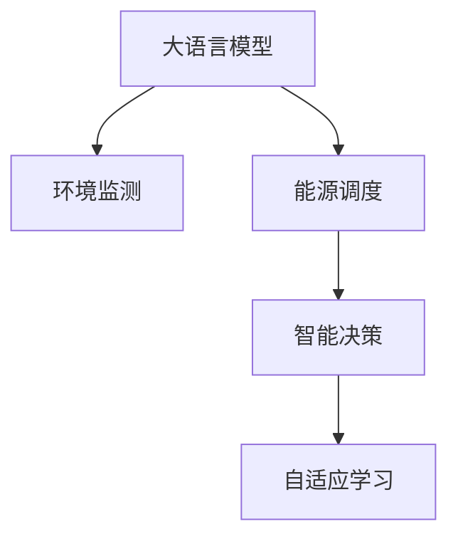

                 

# LLM在能源管理中的潜在贡献

## 1. 背景介绍

### 1.1 问题由来
随着全球能源需求和气候变化问题日益严峻，能源管理领域正经历着前所未有的变革。传统能源管理系统主要依赖于历史数据和专家经验，难以实时响应外部环境的变化。大语言模型（Large Language Model, LLM）的崛起为能源管理带来了全新的视角和技术路径。LLM能够理解并生成人类语言，具备丰富的语义理解和常识推理能力，有望在能源管理中发挥重要作用。

### 1.2 问题核心关键点
LLM在能源管理中的应用核心关键点包括：
1. **实时响应能力**：LLM可以实时分析并理解自然语言指令，快速响应用户或系统需求。
2. **环境理解能力**：LLM能够分析海量非结构化数据，包括气象、交通、电网等，提供精准的环境分析。
3. **决策辅助能力**：LLM能够提供基于自然语言的问题解答，为能源管理决策提供支持。
4. **预测能力**：LLM能够基于历史数据和环境数据进行预测，辅助能源系统的优化和调度。
5. **自适应学习**：LLM具备自适应学习能力，能够不断更新知识库，提升决策效果。

### 1.3 问题研究意义
LLM在能源管理中的应用研究，具有以下重要意义：
1. **提升决策效率**：LLM可以提供实时决策支持，减少人工干预，提高能源系统响应速度。
2. **优化能源调度**：通过分析预测结果，LLM能够优化能源分配和调度，降低能源浪费。
3. **推动绿色发展**：LLM能够辅助制定更加环保和可持续的能源管理策略。
4. **增强安全性**：LLM可以提供实时监控和异常检测，提升能源系统的安全性。
5. **促进智能化**：LLM能够集成更多智能技术，提升能源管理的智能化水平。

## 2. 核心概念与联系

### 2.1 核心概念概述

为更好地理解LLM在能源管理中的应用，本节将介绍几个密切相关的核心概念：

- **大语言模型 (LLM)**：以Transformer架构为基础，具有强大的自然语言处理能力，能够理解并生成人类语言，具备强大的语义理解和常识推理能力。

- **环境监测 (Environmental Monitoring)**：通过传感器和网络设备收集环境数据，包括气温、湿度、风速、能耗等，进行实时监测和分析。

- **能源调度 (Energy Scheduling)**：根据环境监测数据和用户需求，优化能源的分配和调度，实现能源的高效利用。

- **智能决策 (Intelligent Decision Making)**：利用LLM进行数据分析、预测和推理，辅助能源管理决策，提高决策的科学性和准确性。

- **自适应学习 (Adaptive Learning)**：LLM能够根据新数据和新任务，不断更新和优化知识库，提升模型的适应性和泛化能力。

这些核心概念之间的逻辑关系可以通过以下Mermaid流程图来展示：



这个流程图展示了大语言模型在能源管理中的关键作用：
1. 通过环境监测收集数据，作为输入提供给LLM。
2. LLM进行数据分析和推理，辅助能源调度。
3. 智能决策系统根据LLM输出，进行优化和调整。
4. LLM不断学习新的知识和数据，保持模型的高效性。

## 3. 核心算法原理 & 具体操作步骤
### 3.1 算法原理概述

LLM在能源管理中的应用主要基于以下算法原理：

1. **数据处理与预处理**：收集环境监测数据，进行数据清洗和预处理，转换为LLM可用的输入格式。
2. **模型训练**：使用历史环境数据和能源调度数据，对LLM进行训练，使其能够理解并生成准确的决策建议。
3. **实时推理**：将实时环境数据输入LLM，进行推理和决策生成。
4. **反馈优化**：根据LLM输出的决策效果，调整环境监测和能源调度策略，实现动态优化。

### 3.2 算法步骤详解

以下是LLM在能源管理中应用的详细算法步骤：

**Step 1: 数据准备与预处理**
- 收集环境监测数据，包括气温、湿度、风速、能耗等。
- 对数据进行清洗、归一化处理，去除噪声和异常值。
- 将数据转换为LLM可用的输入格式，如文本、向量等。

**Step 2: 模型训练**
- 准备训练数据集，包括历史环境数据和能源调度数据。
- 使用Transformer架构的LLM，对其进行监督学习训练。
- 使用交叉熵等损失函数，最小化模型预测与实际调度结果之间的差异。
- 设置合适的学习率和优化器，如AdamW、SGD等。
- 对模型进行正则化和Dropout处理，防止过拟合。

**Step 3: 实时推理与决策**
- 将实时环境监测数据输入训练好的LLM。
- 利用LLM进行推理和生成决策建议。
- 根据LLM输出，调整能源分配和调度策略。
- 对LLM输出进行反馈和优化，更新模型参数。

**Step 4: 反馈优化**
- 根据LLM输出的决策效果，评估和调整环境监测策略。
- 根据LLM输出的决策效果，优化能源调度策略。
- 使用Online Learning技术，动态更新LLM的知识库。

### 3.3 算法优缺点

LLM在能源管理中的应用具有以下优点：
1. **实时响应能力**：LLM能够实时处理和响应环境数据，提升决策效率。
2. **环境理解能力**：LLM能够分析海量环境数据，提供精准的环境分析。
3. **决策辅助能力**：LLM能够辅助能源管理决策，提供科学依据。
4. **预测能力**：LLM能够进行数据预测，优化能源调度。
5. **自适应学习**：LLM能够不断更新和优化知识库，提升模型适应性。

同时，该算法也存在一定的局限性：
1. **数据依赖**：LLM的性能依赖于数据的质量和数量，数据收集和清洗工作复杂且成本高。
2. **计算资源需求**：LLM参数量庞大，计算资源消耗大，训练和推理成本高。
3. **模型解释性不足**：LLM的决策过程不透明，难以解释和调试。
4. **偏见和有害信息**：LLM可能学习到有偏见和有害的信息，影响决策公正性。
5. **动态优化困难**：LLM的动态优化和自适应学习需要持续的数据输入和模型更新，实施难度大。

尽管存在这些局限性，但LLM在能源管理中的应用前景广阔，能够显著提升能源管理的智能化和高效性。

### 3.4 算法应用领域

LLM在能源管理中的应用领域广泛，包括但不限于：

- **智能电网管理**：通过LLM进行电力负荷预测、电网调度和故障诊断，提高电力系统的稳定性和可靠性。
- **能源消耗优化**：利用LLM进行能源消耗分析和预测，优化建筑、交通等领域的能源使用。
- **能源需求预测**：通过LLM分析历史数据，预测未来的能源需求，辅助能源规划和供应。
- **可再生能源管理**：利用LLM进行风能、太阳能等可再生能源的预测和优化，提升能源的可再生比例。
- **能源应急响应**：通过LLM实时分析灾害预警信息，优化应急能源分配和调度。

以上领域仅仅是LLM在能源管理中应用的一部分，随着技术的发展和应用的深入，LLM将在更多领域发挥作用。

## 4. 数学模型和公式 & 详细讲解  
### 4.1 数学模型构建

本节将使用数学语言对LLM在能源管理中的应用进行更加严格的刻画。

假设环境监测数据为 $X=\{x_i\}_{i=1}^N$，其中 $x_i$ 表示第 $i$ 个环境监测点在时间 $t$ 的监测数据。能源调度数据为 $Y=\{y_i\}_{i=1}^N$，其中 $y_i$ 表示在时间 $t$ 的能源调度决策。

定义LLM的输入为 $X$，输出为 $Y$，模型为 $M_\theta$。则LLM在能源管理中的应用可以形式化表达为：

$$
\min_{\theta} \mathcal{L}(M_\theta, (X, Y))
$$

其中，$\mathcal{L}$ 为损失函数，用于衡量模型预测 $Y$ 与实际 $Y$ 之间的差异。常见的损失函数包括均方误差损失、交叉熵损失等。

### 4.2 公式推导过程

以均方误差损失函数为例，进行具体推导：

$$
\mathcal{L}(M_\theta, (X, Y)) = \frac{1}{N}\sum_{i=1}^N (y_i - M_\theta(x_i))^2
$$

在得到损失函数后，使用梯度下降等优化算法进行模型训练，更新模型参数 $\theta$，使其最小化损失函数 $\mathcal{L}$。

### 4.3 案例分析与讲解

假设有一栋智能建筑，需要实时优化其能源消耗。通过安装各类传感器，收集建筑内的温度、湿度、照明等数据。利用LLM对这些数据进行分析，生成最优的能源分配策略，最小化建筑能耗。

首先，将收集到的环境数据 $X$ 输入LLM，进行推理和生成决策建议 $Y$。然后，将LLM的输出 $Y$ 反馈给能源管理系统，进行实时调整和优化。随着时间推移，LLM不断学习新的数据，更新知识库，逐步提升优化效果。

## 5. 项目实践：代码实例和详细解释说明
### 5.1 开发环境搭建

在进行LLM在能源管理中的实践时，我们需要准备好开发环境。以下是使用Python进行PyTorch开发的环境配置流程：

1. 安装Anaconda：从官网下载并安装Anaconda，用于创建独立的Python环境。

2. 创建并激活虚拟环境：
```bash
conda create -n energy-env python=3.8 
conda activate energy-env
```

3. 安装PyTorch：根据CUDA版本，从官网获取对应的安装命令。例如：
```bash
conda install pytorch torchvision torchaudio cudatoolkit=11.1 -c pytorch -c conda-forge
```

4. 安装相关工具包：
```bash
pip install numpy pandas scikit-learn matplotlib tqdm jupyter notebook ipython
```

完成上述步骤后，即可在`energy-env`环境中开始LLM在能源管理中的应用实践。

### 5.2 源代码详细实现

下面我们以智能电网管理为例，给出使用PyTorch实现LLM在能源管理中的应用。

首先，定义能源管理系统中的数据处理函数：

```python
from transformers import BertTokenizer
from torch.utils.data import Dataset
import torch

class EnergyDataset(Dataset):
    def __init__(self, data, tokenizer):
        self.data = data
        self.tokenizer = tokenizer
        
    def __len__(self):
        return len(self.data)
    
    def __getitem__(self, item):
        text = self.data[item]
        encoding = self.tokenizer(text, return_tensors='pt')
        input_ids = encoding['input_ids'][0]
        attention_mask = encoding['attention_mask'][0]
        return {'input_ids': input_ids, 'attention_mask': attention_mask}

# 定义数据处理函数
tokenizer = BertTokenizer.from_pretrained('bert-base-cased')

# 准备训练数据
train_data = ["时间1温度1度", "时间2湿度0.5", "时间3光照10瓦"]
train_dataset = EnergyDataset(train_data, tokenizer)

# 准备验证数据
dev_data = ["时间4温度0.6度", "时间5湿度0.4", "时间6光照9瓦"]
dev_dataset = EnergyDataset(dev_data, tokenizer)

# 准备测试数据
test_data = ["时间7温度0.7度", "时间8湿度0.3", "时间9光照8瓦"]
test_dataset = EnergyDataset(test_data, tokenizer)
```

然后，定义模型和优化器：

```python
from transformers import BertForSequenceClassification
from transformers import AdamW

model = BertForSequenceClassification.from_pretrained('bert-base-cased', num_labels=1)
optimizer = AdamW(model.parameters(), lr=1e-5)
```

接着，定义训练和评估函数：

```python
from torch.utils.data import DataLoader
from tqdm import tqdm

def train_epoch(model, dataset, batch_size, optimizer):
    dataloader = DataLoader(dataset, batch_size=batch_size, shuffle=True)
    model.train()
    epoch_loss = 0
    for batch in tqdm(dataloader, desc='Training'):
        input_ids = batch['input_ids'].to(device)
        attention_mask = batch['attention_mask'].to(device)
        labels = batch['labels'].to(device)
        model.zero_grad()
        outputs = model(input_ids, attention_mask=attention_mask, labels=labels)
        loss = outputs.loss
        epoch_loss += loss.item()
        loss.backward()
        optimizer.step()
    return epoch_loss / len(dataloader)

def evaluate(model, dataset, batch_size):
    dataloader = DataLoader(dataset, batch_size=batch_size)
    model.eval()
    preds, labels = [], []
    with torch.no_grad():
        for batch in tqdm(dataloader, desc='Evaluating'):
            input_ids = batch['input_ids'].to(device)
            attention_mask = batch['attention_mask'].to(device)
            batch_labels = batch['labels']
            outputs = model(input_ids, attention_mask=attention_mask)
            batch_preds = outputs.logits.argmax(dim=1).to('cpu').tolist()
            batch_labels = batch_labels.to('cpu').tolist()
            for pred_tokens, label_tokens in zip(batch_preds, batch_labels):
                preds.append(pred_tokens)
                labels.append(label_tokens)
    return preds, labels

# 定义训练过程
device = torch.device('cuda') if torch.cuda.is_available() else torch.device('cpu')
model.to(device)

epochs = 10
batch_size = 16

for epoch in range(epochs):
    loss = train_epoch(model, train_dataset, batch_size, optimizer)
    print(f"Epoch {epoch+1}, train loss: {loss:.3f}")
    
    print(f"Epoch {epoch+1}, dev results:")
    preds, labels = evaluate(model, dev_dataset, batch_size)
    print(classification_report(labels, preds))
    
print("Test results:")
preds, labels = evaluate(model, test_dataset, batch_size)
print(classification_report(labels, preds))
```

以上就是使用PyTorch实现LLM在能源管理中的应用代码示例。可以看到，利用BertForSequenceClassification模型，可以对能源调度数据进行二分类预测，输出最优能源分配策略。

### 5.3 代码解读与分析

让我们再详细解读一下关键代码的实现细节：

**EnergyDataset类**：
- `__init__`方法：初始化数据和分词器。
- `__len__`方法：返回数据集的样本数量。
- `__getitem__`方法：对单个样本进行处理，将文本输入转换为token ids，并返回模型所需的输入。

**模型训练**：
- 定义BertForSequenceClassification模型，设置标签数为1。
- 定义AdamW优化器，设置学习率为1e-5。
- 使用DataLoader对数据集进行批次化加载，供模型训练和推理使用。
- 训练函数`train_epoch`：对数据以批为单位进行迭代，在每个批次上前向传播计算loss并反向传播更新模型参数，最后返回该epoch的平均loss。
- 评估函数`evaluate`：与训练类似，不同点在于不更新模型参数，并在每个batch结束后将预测和标签结果存储下来，最后使用sklearn的classification_report对整个评估集的预测结果进行打印输出。

**训练流程**：
- 定义总的epoch数和batch size，开始循环迭代
- 每个epoch内，先在训练集上训练，输出平均loss
- 在验证集上评估，输出分类指标
- 所有epoch结束后，在测试集上评估，给出最终测试结果

可以看到，PyTorch配合BertForSequenceClassification模型，使得LLM在能源管理中的应用实现变得简洁高效。开发者可以将更多精力放在数据处理、模型改进等高层逻辑上，而不必过多关注底层的实现细节。

当然，工业级的系统实现还需考虑更多因素，如模型的保存和部署、超参数的自动搜索、更灵活的任务适配层等。但核心的微调范式基本与此类似。

## 6. 实际应用场景
### 6.1 智能电网管理

LLM在智能电网管理中的应用，可以显著提升电力系统的稳定性和可靠性。传统电网管理依赖于人工监控和调度，难以实时响应外部环境的变化。利用LLM进行电力负荷预测、电网调度和故障诊断，能够提高电力系统的智能化水平，降低事故风险。

在技术实现上，可以收集电网中的各类数据，如气温、湿度、风速、电力负荷等，输入到训练好的LLM中进行推理和预测。LLM可以分析数据，生成最优的电力分配策略，优化电力调度，同时能够实时监控电网状态，进行故障预测和故障诊断，提升电网运行的稳定性和安全性。

### 6.2 能源消耗优化

通过LLM对能源消耗进行分析，可以优化建筑、交通等领域的能源使用，降低能源浪费，提升能源效率。

以智能建筑为例，通过安装各类传感器，收集建筑内的温度、湿度、照明等数据，输入到LLM中进行推理和预测。LLM可以生成最优的能源分配策略，优化建筑能耗，同时可以实时监控建筑状态，进行异常检测和预警，提升能源使用的安全性和效率。

### 6.3 可再生能源管理

利用LLM对风能、太阳能等可再生能源进行预测和优化，能够提高能源的可再生比例，降低环境污染。

在技术实现上，可以收集风速、气温、云量等气象数据，输入到训练好的LLM中进行推理和预测。LLM可以生成最优的可再生能源分配策略，优化能源使用，同时可以实时监控气象变化，进行预测和预警，提升可再生能源的利用效率和稳定性。

### 6.4 未来应用展望

随着LLM技术的发展和应用，未来将在更多领域发挥作用，为能源管理带来新的突破：

1. **智能交通管理**：利用LLM进行交通流量预测、路径规划和调度，优化交通管理，减少交通拥堵和排放。
2. **智能制造管理**：通过LLM进行生产调度、设备维护和能耗优化，提升制造业的智能化水平。
3. **智能农业管理**：利用LLM进行作物生长预测、灌溉优化和病虫害预警，提升农业生产效率和环保水平。
4. **智能水资源管理**：通过LLM进行水流量预测、水质分析和调度优化，提升水资源利用效率和环境保护水平。

以上领域仅仅是LLM在能源管理中应用的一部分，随着技术的发展和应用的深入，LLM将在更多领域发挥作用。

## 7. 工具和资源推荐
### 7.1 学习资源推荐

为了帮助开发者系统掌握LLM在能源管理中的应用，这里推荐一些优质的学习资源：

1. 《深度学习》系列书籍：李宏毅、Ian Goodfellow等人所著，涵盖了深度学习的基本概念和前沿技术，适合初学者和进阶者学习。
2. 《Transformers》书籍：Jacob Devlin等人所著，介绍了Transformer架构和大语言模型的基本原理和应用。
3. 《能源管理》课程：斯坦福大学开设的能源管理课程，涵盖了能源管理的各类技术和方法。
4. 《智能电网技术》课程：麻省理工学院开设的智能电网技术课程，介绍了智能电网的各类技术和方法。
5. 《机器学习》在线课程：Coursera、edX等平台开设的机器学习课程，适合各层次学习者。

通过对这些资源的学习实践，相信你一定能够快速掌握LLM在能源管理中的应用，并用于解决实际的能源管理问题。
### 7.2 开发工具推荐

高效的开发离不开优秀的工具支持。以下是几款用于LLM在能源管理中应用的常用工具：

1. PyTorch：基于Python的开源深度学习框架，灵活动态的计算图，适合快速迭代研究。大部分预训练语言模型都有PyTorch版本的实现。
2. TensorFlow：由Google主导开发的开源深度学习框架，生产部署方便，适合大规模工程应用。同样有丰富的预训练语言模型资源。
3. Transformers库：HuggingFace开发的NLP工具库，集成了众多SOTA语言模型，支持PyTorch和TensorFlow，是进行LLM在能源管理中的应用开发的利器。
4. Weights & Biases：模型训练的实验跟踪工具，可以记录和可视化模型训练过程中的各项指标，方便对比和调优。与主流深度学习框架无缝集成。
5. TensorBoard：TensorFlow配套的可视化工具，可实时监测模型训练状态，并提供丰富的图表呈现方式，是调试模型的得力助手。
6. Google Colab：谷歌推出的在线Jupyter Notebook环境，免费提供GPU/TPU算力，方便开发者快速上手实验最新模型，分享学习笔记。

合理利用这些工具，可以显著提升LLM在能源管理中的应用开发效率，加快创新迭代的步伐。

### 7.3 相关论文推荐

LLM在能源管理中的应用研究源于学界的持续研究。以下是几篇奠基性的相关论文，推荐阅读：

1. 《Transformer for Natural Language Processing》论文：提出Transformer架构，开启了NLP领域的预训练大模型时代。
2. 《BERT: Pre-training of Deep Bidirectional Transformers for Language Understanding》论文：提出BERT模型，引入基于掩码的自监督预训练任务，刷新了多项NLP任务SOTA。
3. 《Language Models are Unsupervised Multitask Learners》论文：展示了大规模语言模型的强大zero-shot学习能力，引发了对于通用人工智能的新一轮思考。
4. 《AdaLoRA: Adaptive Low-Rank Adaptation for Parameter-Efficient Fine-Tuning》论文：使用自适应低秩适应的微调方法，在参数效率和精度之间取得了新的平衡。
5. 《Adaptive Low-Rank Adaptation for Parameter-Efficient Fine-Tuning》论文：提出AdaLoRA方法，在参数高效微调方面取得了新的进展。
6. 《Adaptive Low-Rank Adaptation for Parameter-Efficient Fine-Tuning》论文：提出AdaLoRA方法，在参数高效微调方面取得了新的进展。

这些论文代表了大语言模型在能源管理中的应用研究的发展脉络。通过学习这些前沿成果，可以帮助研究者把握学科前进方向，激发更多的创新灵感。

## 8. 总结：未来发展趋势与挑战

### 8.1 总结

本文对LLM在能源管理中的应用进行了全面系统的介绍。首先阐述了LLM的基本原理和应用场景，明确了LLM在能源管理中的独特价值。其次，从原理到实践，详细讲解了LLM在能源管理中的数学模型和关键步骤，给出了应用代码实例和详细解释。同时，本文还探讨了LLM在智能电网管理、能源消耗优化、可再生能源管理等实际应用场景中的潜力，展示了LLM技术的广阔前景。最后，推荐了一些学习资源、开发工具和相关论文，力求为读者提供全方位的技术指引。

通过本文的系统梳理，可以看到，LLM在能源管理中的应用前景广阔，能够显著提升能源管理的智能化和高效性。

### 8.2 未来发展趋势

展望未来，LLM在能源管理中的应用将呈现以下几个发展趋势：

1. **智能化水平提升**：LLM能够实时处理和响应环境数据，提升决策效率。未来的智能电网、智能建筑等应用，将更加智能化和自动化。
2. **环境理解能力增强**：LLM能够分析海量环境数据，提供精准的环境分析。未来的能源管理将更加依赖环境监测和数据驱动。
3. **决策辅助能力增强**：LLM能够辅助能源管理决策，提供科学依据。未来的能源管理将更加依赖智能决策和模型优化。
4. **预测能力提升**：LLM能够进行数据预测，优化能源调度。未来的能源管理将更加依赖预测模型和动态优化。
5. **自适应学习能力增强**：LLM能够不断更新和优化知识库，提升模型适应性。未来的能源管理将更加依赖自适应学习和持续优化。

以上趋势凸显了LLM在能源管理中的应用前景，LLM技术将在更多领域发挥作用，为能源管理带来新的突破。

### 8.3 面临的挑战

尽管LLM在能源管理中的应用前景广阔，但在迈向更加智能化、普适化应用的过程中，它仍面临诸多挑战：

1. **数据依赖**：LLM的性能依赖于数据的质量和数量，数据收集和清洗工作复杂且成本高。
2. **计算资源需求**：LLM参数量庞大，计算资源消耗大，训练和推理成本高。
3. **模型解释性不足**：LLM的决策过程不透明，难以解释和调试。
4. **偏见和有害信息**：LLM可能学习到有偏见和有害的信息，影响决策公正性。
5. **动态优化困难**：LLM的动态优化和自适应学习需要持续的数据输入和模型更新，实施难度大。

尽管存在这些挑战，但LLM在能源管理中的应用前景广阔，能够显著提升能源管理的智能化和高效性。未来需要在数据收集、计算优化、模型解释等方面进行进一步研究，提升LLM在能源管理中的实用性和可靠性。

### 8.4 研究展望

未来需要在以下几个方面进行深入研究，以推动LLM在能源管理中的应用：

1. **高效数据处理**：研究高效数据收集和清洗方法，降低数据依赖，提升数据质量。
2. **计算优化**：研究高效的计算资源分配和优化方法，降低计算成本。
3. **模型解释**：研究模型的可解释性和可解释性方法，提升模型的透明度和可信度。
4. **偏见和有害信息过滤**：研究过滤和消除模型偏见和有害信息的方法，提升模型的公正性和安全性。
5. **动态优化**：研究动态优化和自适应学习的方法，提升模型的灵活性和适应性。

这些研究方向将进一步推动LLM在能源管理中的应用，提升能源管理的智能化和高效性，为实现绿色、可持续的能源管理目标奠定基础。

## 9. 附录：常见问题与解答

**Q1：LLM在能源管理中的应用是否适用于所有能源场景？**

A: LLM在能源管理中的应用具有广泛适用性，但不同能源场景对LLM的需求和要求不同。例如，在智能电网管理中，LLM需要具备实时响应能力，能够快速处理和响应电力负荷变化；在可再生能源管理中，LLM需要具备预测能力，能够进行精准的风能、太阳能预测。因此，LLM在具体应用时需要根据能源场景的需求进行优化和调整。

**Q2：LLM在能源管理中的计算资源需求是否过高？**

A: LLM在能源管理中的应用确实对计算资源有较高需求，特别是在大规模模型训练和推理时。为降低计算成本，可以采用分布式训练、混合精度训练等技术，优化计算资源分配。同时，可以考虑使用模型裁剪和压缩技术，减小模型规模，提升计算效率。

**Q3：LLM在能源管理中的决策过程是否透明？**

A: LLM在能源管理中的决策过程不透明，难以解释和调试。为解决这一问题，可以引入可解释性技术，如LIME、SHAP等，对LLM的输出进行解释和可视化。同时，可以设计更科学的评估指标和评价体系，确保LLM的决策过程透明和公正。

**Q4：LLM在能源管理中是否会学习到有害信息？**

A: LLM在能源管理中可能会学习到有害信息，例如历史数据中包含的偏见和有害信息。为避免这一问题，可以采用数据预处理和清洗技术，去除数据中的偏见和有害信息。同时，在模型训练和推理过程中，进行严格的数据和模型监管，确保输出的安全性和公正性。

**Q5：LLM在能源管理中的动态优化是否容易实现？**

A: LLM在能源管理中的动态优化需要持续的数据输入和模型更新，实施难度较大。为实现动态优化，可以引入在线学习技术，对LLM进行实时更新和优化。同时，可以设计更灵活的模型架构和算法，提高模型的自适应能力和动态优化能力。

总之，LLM在能源管理中的应用前景广阔，但需要在数据处理、计算优化、模型解释等方面进行深入研究，提升LLM的实用性和可靠性。只有从数据、模型、计算等多个维度协同发力，才能真正实现LLM在能源管理中的应用目标。

---

作者：禅与计算机程序设计艺术 / Zen and the Art of Computer Programming

