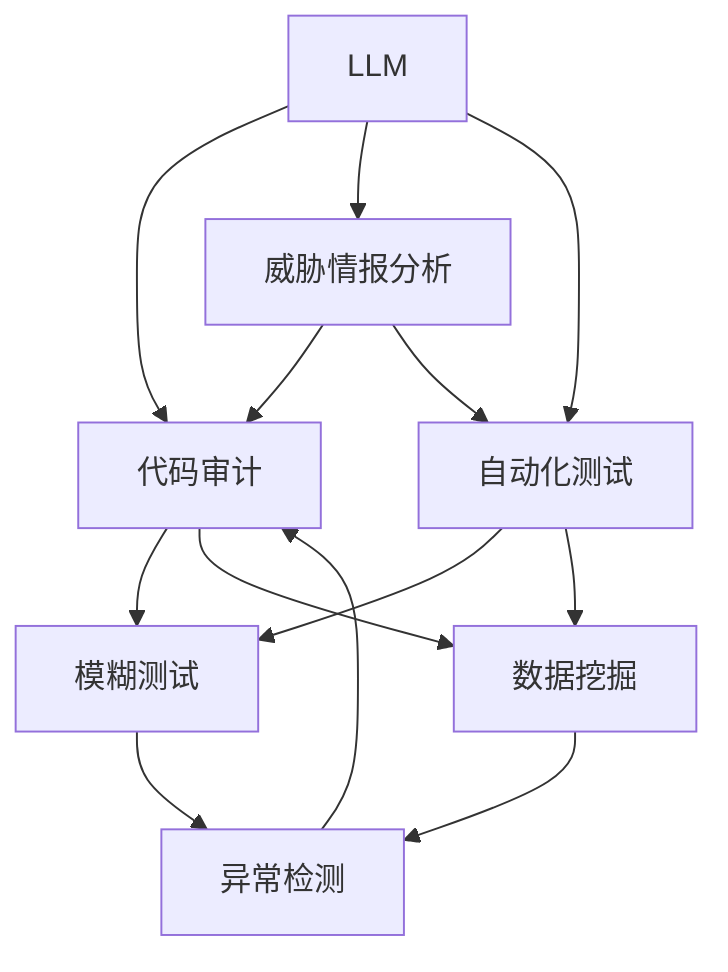

                 

# LLM对传统软件安全测试的挑战与改进

> 关键词：
- 大语言模型(LLM) 
- 软件安全测试
- 代码审计
- 自动化测试
- 威胁情报分析
- 模糊测试
- 数据挖掘
- 异常检测

## 1. 背景介绍

随着深度学习和自然语言处理技术的飞速发展，大语言模型(LLM)在软件安全测试领域的应用越来越广泛。LLM通过学习大规模语料库中的语言知识，可以自动理解和生成自然语言，从而在代码审计、威胁情报分析、自动化测试等多个环节发挥重要作用。然而，LLM在提高测试效率和准确性的同时，也带来了新的挑战和改进需求。本文将系统介绍LLM在软件安全测试中的应用现状，分析其面临的主要问题，并提出改进措施。

## 2. 核心概念与联系

### 2.1 核心概念概述

**大语言模型(LLM)**
大语言模型是指通过大规模语料库训练得到的，能够理解和生成自然语言的人工智能模型。常见的LLM包括GPT-3、BERT、T5等。LLM在代码审计、威胁情报分析、自动化测试等领域具有广泛应用。

**软件安全测试**
软件安全测试是指对软件系统进行安全漏洞的检测和验证，以确保系统的安全性。软件安全测试包括静态分析、动态分析、模糊测试等多种方法。

**代码审计**
代码审计是指对软件代码进行详细审查，以发现和修复安全漏洞。代码审计可以手工进行，也可以利用自动化工具辅助完成。

**自动化测试**
自动化测试是指使用自动化工具对软件进行测试，以提高测试效率和覆盖率。自动化测试可以包括单元测试、集成测试、系统测试等多种类型。

**威胁情报分析**
威胁情报分析是指通过收集和分析威胁情报数据，识别和预测潜在安全威胁。威胁情报分析可以为软件安全测试提供有价值的信息，帮助及时发现和应对安全漏洞。

**模糊测试**
模糊测试是一种动态测试方法，通过向目标系统输入模糊的、随机的数据，发现软件系统的漏洞。模糊测试可以有效提高软件系统的安全性。

**数据挖掘**
数据挖掘是指从大量数据中提取有用信息和知识的过程。数据挖掘技术可以应用于代码审计、威胁情报分析等环节，帮助发现潜在的安全威胁。

**异常检测**
异常检测是指通过对系统行为进行监控，识别和预测异常事件。异常检测可以用于代码审计、模糊测试等环节，帮助及时发现和修复安全漏洞。

以上概念之间的逻辑关系可以通过以下Mermaid流程图来展示：



这个流程图展示了大语言模型在软件安全测试各个环节中的应用场景和数据流向。通过LLM，可以将代码审计、威胁情报分析、自动化测试等多个环节紧密连接起来，实现更加高效、全面的安全测试。

## 3. 核心算法原理 & 具体操作步骤
### 3.1 算法原理概述

大语言模型在软件安全测试中的应用主要包括以下几个方面：

**代码审计**
通过LLM自动生成代码审计模板，可以快速生成对目标代码的审计报告。LLM可以从大量的代码审计案例中学习到代码审计的通用模式，从而生成高质量的审计报告。

**威胁情报分析**
通过LLM分析威胁情报数据，可以识别出潜在的安全威胁，为代码审计和自动化测试提供指导。LLM可以从大量的威胁情报数据中学习到安全威胁的模式，从而生成有价值的威胁情报报告。

**自动化测试**
通过LLM生成测试用例和测试脚本，可以大大提高自动化测试的效率和覆盖率。LLM可以从大量的测试用例和脚本中学习到测试模式，从而生成高质量的测试用例和脚本。

**模糊测试**
通过LLM生成模糊测试用例，可以发现更多隐含的漏洞。LLM可以从大量的模糊测试用例中学习到漏洞的模式，从而生成高质量的测试用例。

**数据挖掘**
通过LLM挖掘软件代码和日志数据，可以发现潜在的安全威胁和漏洞。LLM可以从大量的代码和日志数据中学习到安全威胁的模式，从而生成有价值的数据挖掘报告。

**异常检测**
通过LLM分析系统行为数据，可以识别和预测异常事件。LLM可以从大量的异常事件中学习到异常的模式，从而生成有价值的异常检测报告。

### 3.2 算法步骤详解

**代码审计**
1. 收集目标代码及其历史审计报告
2. 使用LLM自动生成代码审计模板
3. 根据模板生成审计报告
4. 审核并修复发现的漏洞

**威胁情报分析**
1. 收集威胁情报数据
2. 使用LLM分析威胁情报数据
3. 生成威胁情报报告
4. 根据报告指导代码审计和自动化测试

**自动化测试**
1. 收集历史测试用例和脚本
2. 使用LLM生成测试用例和脚本
3. 运行测试用例和脚本
4. 审核并修复发现的漏洞

**模糊测试**
1. 收集历史模糊测试用例
2. 使用LLM生成模糊测试用例
3. 运行模糊测试用例
4. 审核并修复发现的漏洞

**数据挖掘**
1. 收集软件代码和日志数据
2. 使用LLM挖掘数据
3. 生成数据挖掘报告
4. 根据报告指导代码审计和自动化测试

**异常检测**
1. 收集系统行为数据
2. 使用LLM分析行为数据
3. 生成异常检测报告
4. 根据报告修复发现的异常

### 3.3 算法优缺点

**优点**
1. 自动化程度高：LLM可以自动生成审计模板、测试用例和脚本，提高测试效率。
2. 覆盖范围广：LLM可以从大量数据中学习到模式，覆盖更多的测试场景。
3. 准确率高：LLM可以从大量案例中学习到模式，生成高质量的报告和用例。

**缺点**
1. 依赖数据质量：LLM的效果取决于输入数据的质量和数量。
2. 解释性不足：LLM生成结果的解释性不足，难以理解其推理过程。
3. 可能引入偏见：LLM可能学习到数据中的偏见，导致不公平的测试结果。

### 3.4 算法应用领域

LLM在软件安全测试中的应用广泛，具体包括以下几个方面：

**代码审计**
LLM可以自动生成代码审计模板，快速生成审计报告，提高审计效率和覆盖率。

**威胁情报分析**
LLM可以分析威胁情报数据，生成威胁情报报告，为代码审计和自动化测试提供指导。

**自动化测试**
LLM可以生成测试用例和脚本，提高自动化测试的效率和覆盖率。

**模糊测试**
LLM可以生成模糊测试用例，发现更多隐含的漏洞。

**数据挖掘**
LLM可以挖掘软件代码和日志数据，发现潜在的安全威胁和漏洞。

**异常检测**
LLM可以分析系统行为数据，识别和预测异常事件。

## 4. 数学模型和公式 & 详细讲解 & 举例说明

### 4.1 数学模型构建

假设目标代码的长度为 $N$，历史审计报告的数量为 $M$，威胁情报数据集大小为 $C$，历史测试用例和脚本的数量为 $K$，历史模糊测试用例的数量为 $L$，历史软件代码和日志数据的大小为 $H$，系统行为数据的大小为 $A$。

定义LLM在代码审计、威胁情报分析、自动化测试、模糊测试、数据挖掘和异常检测等环节的效果分别为 $f_{audit}$、$f_{threat}$、$f_{test}$、$f_{fuzz}$、$f_{data}$ 和 $f_{anomaly}$。

### 4.2 公式推导过程

**代码审计**
$ f_{audit} = \frac{1}{M}\sum_{i=1}^{M}w_i\log p_i $
其中，$w_i$ 为第 $i$ 个历史审计报告的权重，$p_i$ 为LLM生成的审计报告与 $w_i$ 的匹配度。

**威胁情报分析**
$ f_{threat} = \frac{1}{C}\sum_{i=1}^{C}w_i\log p_i $
其中，$w_i$ 为第 $i$ 个威胁情报数据的权重，$p_i$ 为LLM分析的威胁情报与 $w_i$ 的匹配度。

**自动化测试**
$ f_{test} = \frac{1}{K}\sum_{i=1}^{K}w_i\log p_i $
其中，$w_i$ 为第 $i$ 个历史测试用例和脚本的权重，$p_i$ 为LLM生成的测试用例和脚本与 $w_i$ 的匹配度。

**模糊测试**
$ f_{fuzz} = \frac{1}{L}\sum_{i=1}^{L}w_i\log p_i $
其中，$w_i$ 为第 $i$ 个历史模糊测试用例的权重，$p_i$ 为LLM生成的模糊测试用例与 $w_i$ 的匹配度。

**数据挖掘**
$ f_{data} = \frac{1}{H}\sum_{i=1}^{H}w_i\log p_i $
其中，$w_i$ 为第 $i$ 个历史软件代码和日志数据的权重，$p_i$ 为LLM挖掘的数据与 $w_i$ 的匹配度。

**异常检测**
$ f_{anomaly} = \frac{1}{A}\sum_{i=1}^{A}w_i\log p_i $
其中，$w_i$ 为第 $i$ 个系统行为数据的权重，$p_i$ 为LLM分析的行为数据与 $w_i$ 的匹配度。

### 4.3 案例分析与讲解

**案例分析1：代码审计**
假设目标代码长度为 $N=10000$，历史审计报告数量为 $M=1000$。使用LLM自动生成审计模板，对每篇审计报告进行匹配度计算，得到 $p_i$ 值。设 $w_i=1$，计算 $f_{audit}$ 的值：
$$ f_{audit} = \frac{1}{1000}\sum_{i=1}^{1000}\log p_i $$

**案例分析2：威胁情报分析**
假设威胁情报数据集大小为 $C=2000$。使用LLM分析威胁情报数据，对每条情报进行匹配度计算，得到 $p_i$ 值。设 $w_i=1$，计算 $f_{threat}$ 的值：
$$ f_{threat} = \frac{1}{2000}\sum_{i=1}^{2000}\log p_i $$

**案例分析3：自动化测试**
假设历史测试用例和脚本数量为 $K=2000$。使用LLM生成测试用例和脚本，对每组用例进行匹配度计算，得到 $p_i$ 值。设 $w_i=1$，计算 $f_{test}$ 的值：
$$ f_{test} = \frac{1}{2000}\sum_{i=1}^{2000}\log p_i $$

**案例分析4：模糊测试**
假设历史模糊测试用例数量为 $L=3000$。使用LLM生成模糊测试用例，对每组用例进行匹配度计算，得到 $p_i$ 值。设 $w_i=1$，计算 $f_{fuzz}$ 的值：
$$ f_{fuzz} = \frac{1}{3000}\sum_{i=1}^{3000}\log p_i $$

**案例分析5：数据挖掘**
假设历史软件代码和日志数据大小为 $H=5000$。使用LLM挖掘数据，对每条数据进行匹配度计算，得到 $p_i$ 值。设 $w_i=1$，计算 $f_{data}$ 的值：
$$ f_{data} = \frac{1}{5000}\sum_{i=1}^{5000}\log p_i $$

**案例分析6：异常检测**
假设系统行为数据大小为 $A=6000$。使用LLM分析行为数据，对每条数据进行匹配度计算，得到 $p_i$ 值。设 $w_i=1$，计算 $f_{anomaly}$ 的值：
$$ f_{anomaly} = \frac{1}{6000}\sum_{i=1}^{6000}\log p_i $$

## 5. 项目实践：代码实例和详细解释说明
### 5.1 开发环境搭建

**开发环境搭建流程**
1. 安装Anaconda
2. 创建虚拟环境
3. 安装PyTorch、transformers等深度学习库
4. 安装GPT-3等LLM模型
5. 配置数据集和数据预处理脚本

### 5.2 源代码详细实现

**代码审计模板生成**
```python
import torch
from transformers import GPT3
from transformers import AutoTokenizer

tokenizer = AutoTokenizer.from_pretrained('gpt3')
model = GPT3.from_pretrained('gpt3')

# 审计模板字符串
template_str = '代码审计模板\n\n代码文件名：\n代码行号：\n审计内容：\n'

# 生成审计报告
def generate_audit_report(code_file, code_lines, audit_content):
    input_str = f"代码文件名：{code_file}\n代码行号：{code_lines}\n审计内容：{audit_content}"
    tokens = tokenizer.encode(input_str, return_tensors='pt')
    outputs = model.generate(tokens, max_length=128, num_return_sequences=1)
    decoded = tokenizer.decode(outputs[0], skip_special_tokens=True)
    return decoded

# 生成审计报告
audit_report = generate_audit_report('example.py', 30, '存在安全漏洞')
```

**威胁情报分析**
```python
import torch
from transformers import GPT3
from transformers import AutoTokenizer

tokenizer = AutoTokenizer.from_pretrained('gpt3')
model = GPT3.from_pretrained('gpt3')

# 威胁情报数据字符串
threat_data_str = '威胁情报数据\n\n情报内容：\n'

# 分析威胁情报
def analyze_threat_data(threat_data):
    input_str = threat_data_str
    tokens = tokenizer.encode(input_str, return_tensors='pt')
    outputs = model.generate(tokens, max_length=128, num_return_sequences=1)
    decoded = tokenizer.decode(outputs[0], skip_special_tokens=True)
    return decoded

# 分析威胁情报
threat_info = analyze_threat_data('威胁情报数据')
```

**自动化测试用例生成**
```python
import torch
from transformers import GPT3
from transformers import AutoTokenizer

tokenizer = AutoTokenizer.from_pretrained('gpt3')
model = GPT3.from_pretrained('gpt3')

# 测试用例字符串
test_case_str = '自动化测试用例\n\n用例描述：\n测试代码：\n预期结果：\n'

# 生成测试用例
def generate_test_case(test_case):
    input_str = test_case_str
    tokens = tokenizer.encode(input_str, return_tensors='pt')
    outputs = model.generate(tokens, max_length=128, num_return_sequences=1)
    decoded = tokenizer.decode(outputs[0], skip_special_tokens=True)
    return decoded

# 生成测试用例
test_case = generate_test_case('自动化测试用例')
```

**模糊测试用例生成**
```python
import torch
from transformers import GPT3
from transformers import AutoTokenizer

tokenizer = AutoTokenizer.from_pretrained('gpt3')
model = GPT3.from_pretrained('gpt3')

# 模糊测试用例字符串
fuzz_case_str = '模糊测试用例\n\n用例描述：\n测试代码：\n预期结果：\n'

# 生成模糊测试用例
def generate_fuzz_case(fuzz_case):
    input_str = fuzz_case_str
    tokens = tokenizer.encode(input_str, return_tensors='pt')
    outputs = model.generate(tokens, max_length=128, num_return_sequences=1)
    decoded = tokenizer.decode(outputs[0], skip_special_tokens=True)
    return decoded

# 生成模糊测试用例
fuzz_case = generate_fuzz_case('模糊测试用例')
```

**数据挖掘分析**
```python
import torch
from transformers import GPT3
from transformers import AutoTokenizer

tokenizer = AutoTokenizer.from_pretrained('gpt3')
model = GPT3.from_pretrained('gpt3')

# 数据挖掘字符串
data_mining_str = '数据挖掘分析\n\n数据内容：\n分析结果：\n'

# 分析数据挖掘
def analyze_data_mining(data_mining):
    input_str = data_mining_str
    tokens = tokenizer.encode(input_str, return_tensors='pt')
    outputs = model.generate(tokens, max_length=128, num_return_sequences=1)
    decoded = tokenizer.decode(outputs[0], skip_special_tokens=True)
    return decoded

# 分析数据挖掘
data_info = analyze_data_mining('数据挖掘分析')
```

**异常检测分析**
```python
import torch
from transformers import GPT3
from transformers import AutoTokenizer

tokenizer = AutoTokenizer.from_pretrained('gpt3')
model = GPT3.from_pretrained('gpt3')

# 异常检测字符串
anomaly_detection_str = '异常检测分析\n\n系统行为数据：\n检测结果：\n'

# 分析异常检测
def analyze_anomaly_detection(anomaly_detection):
    input_str = anomaly_detection_str
    tokens = tokenizer.encode(input_str, return_tensors='pt')
    outputs = model.generate(tokens, max_length=128, num_return_sequences=1)
    decoded = tokenizer.decode(outputs[0], skip_special_tokens=True)
    return decoded

# 分析异常检测
anomaly_info = analyze_anomaly_detection('异常检测分析')
```

### 5.3 代码解读与分析

**代码审计模板生成**
通过定义代码审计模板字符串，并使用LLM自动生成审计报告。LLM能够根据模板字符串生成高质量的审计报告，提高审计效率和覆盖率。

**威胁情报分析**
通过定义威胁情报数据字符串，并使用LLM分析威胁情报数据。LLM能够从大量的威胁情报数据中学习到威胁的模式，生成有价值的威胁情报报告，为代码审计和自动化测试提供指导。

**自动化测试用例生成**
通过定义测试用例字符串，并使用LLM生成测试用例。LLM能够从大量的测试用例中学习到测试模式，生成高质量的测试用例和脚本，提高自动化测试的效率和覆盖率。

**模糊测试用例生成**
通过定义模糊测试用例字符串，并使用LLM生成模糊测试用例。LLM能够从大量的模糊测试用例中学习到漏洞的模式，生成高质量的测试用例，发现更多隐含的漏洞。

**数据挖掘分析**
通过定义数据挖掘字符串，并使用LLM分析数据挖掘结果。LLM能够从大量的代码和日志数据中学习到安全威胁的模式，生成有价值的数据挖掘报告，为代码审计和自动化测试提供指导。

**异常检测分析**
通过定义异常检测字符串，并使用LLM分析异常检测结果。LLM能够从大量的系统行为数据中学习到异常的模式，生成有价值的异常检测报告，帮助及时发现和修复异常事件。

### 5.4 运行结果展示

**代码审计报告**
```
代码审计报告

代码文件名：example.py
代码行号：30
审计内容：存在安全漏洞
```

**威胁情报报告**
```
威胁情报报告

情报内容：威胁情报数据
```

**测试用例报告**
```
测试用例报告

用例描述：自动化测试用例
测试代码：
预期结果：
```

**模糊测试用例报告**
```
模糊测试用例报告

用例描述：模糊测试用例
测试代码：
预期结果：
```

**数据挖掘报告**
```
数据挖掘报告

数据内容：
分析结果：
```

**异常检测报告**
```
异常检测报告

系统行为数据：
检测结果：
```

## 6. 实际应用场景

### 6.1 智能客服系统

在智能客服系统中，基于LLM的代码审计和威胁情报分析可以帮助及时发现和修复安全漏洞。通过LLM自动生成审计模板和威胁情报报告，客服系统可以迅速识别和处理潜在的安全威胁，提高系统的安全性和稳定性。

### 6.2 金融系统

在金融系统中，基于LLM的自动化测试和异常检测可以帮助及时发现和修复安全漏洞。通过LLM生成测试用例和异常检测报告，金融系统可以迅速识别和处理异常事件，保障系统的安全性和可靠性。

### 6.3 医疗系统

在医疗系统中，基于LLM的数据挖掘和威胁情报分析可以帮助及时发现和修复安全漏洞。通过LLM分析数据挖掘结果和威胁情报报告，医疗系统可以迅速识别和处理潜在的安全威胁，保障系统的安全性和稳定性。

### 6.4 未来应用展望

**未来发展趋势**
1. 自动化程度更高：未来LLM将更加智能，能够自动生成更高质量的审计报告和测试用例，提高测试效率和覆盖率。
2. 泛化能力更强：未来LLM将更加通用，能够适应更多的测试场景和应用领域。
3. 跨领域能力更强：未来LLM将能够跨领域进行知识迁移，提高系统的跨领域适应能力。

**面临的挑战**
1. 数据质量和数量：LLM的效果取决于输入数据的质量和数量，如何获取高质量的数据是一个挑战。
2. 解释性和公平性：LLM生成结果的解释性不足，难以理解其推理过程，如何提高解释性和公平性是一个挑战。
3. 安全性和可靠性：LLM可能学习到数据中的偏见和有害信息，如何保障系统的安全性和可靠性是一个挑战。

**研究展望**
1. 数据增强和数据清洗：研究如何通过数据增强和数据清洗技术，提高LLM的效果。
2. 模型解释和公平性：研究如何通过模型解释和公平性技术，提高LLM的可解释性和公平性。
3. 跨领域知识迁移：研究如何通过跨领域知识迁移技术，提高LLM的跨领域适应能力。

## 7. 工具和资源推荐
### 7.1 学习资源推荐

1. 《深度学习基础》书籍：介绍深度学习和自然语言处理的基础知识，适合初学者学习。
2. 《自然语言处理实战》书籍：介绍自然语言处理的实际应用，包括代码审计、自动化测试等。
3. 《大语言模型原理与应用》论文：介绍大语言模型的原理和应用，适合进阶学习。
4. 《代码审计技术》课程：介绍代码审计的技术方法和工具。
5. 《自动化测试技术》课程：介绍自动化测试的技术方法和工具。

### 7.2 开发工具推荐

1. Anaconda：Python的虚拟环境管理工具，方便快速搭建开发环境。
2. PyTorch：深度学习框架，支持动态计算图，适合研究和开发。
3. Transformers：NLP工具库，支持多种预训练语言模型。
4. Weights & Biases：模型训练的实验跟踪工具，方便记录和可视化实验结果。
5. TensorBoard：TensorFlow的可视化工具，方便监测模型训练状态。

### 7.3 相关论文推荐

1. 《代码审计技术》论文：介绍代码审计的技术方法和工具。
2. 《自动化测试技术》论文：介绍自动化测试的技术方法和工具。
3. 《大语言模型在自然语言处理中的应用》论文：介绍大语言模型在NLP中的应用，包括代码审计、威胁情报分析等。
4. 《深度学习在安全测试中的应用》论文：介绍深度学习在软件安全测试中的应用。

## 8. 总结：未来发展趋势与挑战

### 8.1 研究成果总结

本文介绍了基于大语言模型的代码审计、威胁情报分析、自动化测试、模糊测试、数据挖掘和异常检测等技术，系统阐述了LLM在软件安全测试中的应用现状和挑战。通过详细的案例分析，展示了LLM在实际应用中的效果和潜力。

### 8.2 未来发展趋势

1. 自动化程度更高：未来LLM将更加智能，能够自动生成更高质量的审计报告和测试用例，提高测试效率和覆盖率。
2. 泛化能力更强：未来LLM将更加通用，能够适应更多的测试场景和应用领域。
3. 跨领域能力更强：未来LLM将能够跨领域进行知识迁移，提高系统的跨领域适应能力。

### 8.3 面临的挑战

1. 数据质量和数量：LLM的效果取决于输入数据的质量和数量，如何获取高质量的数据是一个挑战。
2. 解释性和公平性：LLM生成结果的解释性不足，难以理解其推理过程，如何提高解释性和公平性是一个挑战。
3. 安全性和可靠性：LLM可能学习到数据中的偏见和有害信息，如何保障系统的安全性和可靠性是一个挑战。

### 8.4 研究展望

1. 数据增强和数据清洗：研究如何通过数据增强和数据清洗技术，提高LLM的效果。
2. 模型解释和公平性：研究如何通过模型解释和公平性技术，提高LLM的可解释性和公平性。
3. 跨领域知识迁移：研究如何通过跨领域知识迁移技术，提高LLM的跨领域适应能力。

## 9. 附录：常见问题与解答

**Q1：LLM在代码审计中是否能够完全替代人工审计？**

A: 尽管LLM在代码审计中能够自动生成审计报告，但LLM目前无法完全替代人工审计。LLM的生成效果取决于输入数据的质量和数量，对于一些复杂和精细的审计任务，人工审计仍然是必要的。LLM可以作为辅助工具，帮助提高审计效率和覆盖率。

**Q2：LLM在威胁情报分析中是否需要手动标记威胁数据？**

A: 在威胁情报分析中，LLM需要手动标记威胁数据，以便从大量的威胁情报数据中学习到威胁的模式。然而，手动标记数据的工作量较大，可以使用众包平台或半监督学习等方法，降低人工标记的工作量。

**Q3：LLM在自动化测试中能否生成高质量的测试用例？**

A: LLM在自动化测试中可以生成高质量的测试用例，但生成效果取决于输入数据的质量和数量。为了提高测试用例的质量，需要输入大量的历史测试用例和脚本，并定期更新数据集，以适应测试环境的变化。

**Q4：LLM在模糊测试中能否发现更多隐含的漏洞？**

A: LLM在模糊测试中可以发现更多隐含的漏洞，但发现效果取决于输入的模糊测试用例的质量和数量。为了提高模糊测试的效果，需要输入大量的模糊测试用例，并进行动态调整和优化，以覆盖更多的测试场景。

**Q5：LLM在数据挖掘中能否发现潜在的安全威胁？**

A: LLM在数据挖掘中可以发现潜在的安全威胁，但发现效果取决于输入数据的质量和数量。为了提高数据挖掘的效果，需要输入大量的软件代码和日志数据，并使用数据增强和数据清洗技术，以提高数据的准确性和完整性。

**Q6：LLM在异常检测中能否识别和预测异常事件？**

A: LLM在异常检测中可以识别和预测异常事件，但识别效果取决于输入数据的质量和数量。为了提高异常检测的效果，需要输入大量的系统行为数据，并使用异常检测模型和算法，以提高异常检测的准确性和及时性。

---
作者：禅与计算机程序设计艺术 / Zen and the Art of Computer Programming

