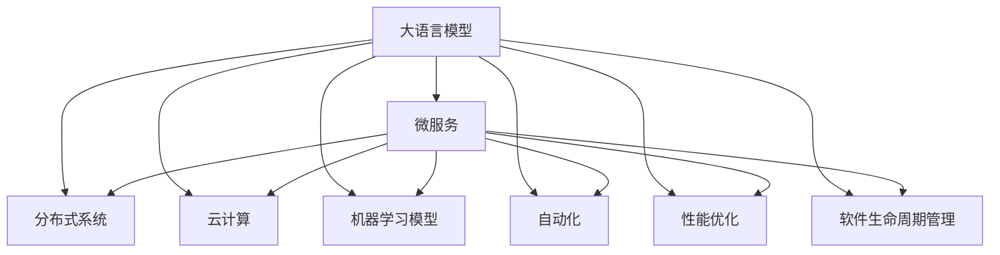

                 

# LLM对传统软件架构设计的挑战与创新

> 关键词：大语言模型(Large Language Model, LLM),软件架构设计,微服务,分布式系统,云计算,机器学习模型,自动化,性能优化,软件生命周期管理

## 1. 背景介绍

### 1.1 问题由来

在过去的十年里，人工智能（AI）技术取得了迅猛发展，其中大语言模型（LLM）尤其引人注目。LLM如OpenAI的GPT系列、Google的BERT等，已经展现出超越传统机器学习模型的强大能力，被广泛应用于自然语言处理（NLP）领域，包括文本分类、情感分析、机器翻译、问答系统等。

然而，随着LLM在实际应用中的推广，其在传统软件架构设计上提出了诸多挑战，也提供了新的创新契机。传统软件架构设计强调模块化、可维护性和可扩展性，而LLM作为AI模型，其性能与数据、计算资源和模型参数息息相关，如何在现有架构基础上高效集成和部署LLM，成为了一个重要课题。

### 1.2 问题核心关键点

LLM在软件架构设计中面临的核心挑战主要包括：

1. **数据管理**：大语言模型需要海量数据进行训练和优化，如何高效获取、存储和管理这些数据是一个难题。
2. **计算资源**：由于参数量庞大，LLM的训练和推理对计算资源的需求非常高，如何优化资源配置成为关键。
3. **模型部署**：如何将大规模预训练模型有效部署到生产环境中，保持其性能和稳定性，是一个复杂的问题。
4. **自动化开发**：LLM的微调和优化过程繁琐且需要大量专业知识和技能，如何实现自动化、降低开发门槛是另一个重要课题。
5. **性能优化**：如何优化LLM的推理速度、内存使用等性能指标，满足实际应用需求。
6. **生命周期管理**：如何管理和维护LLM的生命周期，包括模型更新、版本控制、监控等。

与此同时，LLM也带来了新的创新契机，如模型的可重用性、自动化的能力增强、以及跨领域应用的可能性等。

## 2. 核心概念与联系

### 2.1 核心概念概述

为了更好地理解LLM对传统软件架构设计的影响和创新，我们首先介绍几个关键概念：

- **大语言模型（Large Language Model, LLM）**：指以自回归或自编码模型为代表的大规模预训练语言模型。通过在大规模无标签文本数据上进行预训练，学习通用的语言表示，具备强大的语言理解和生成能力。

- **微服务（Microservice）**：一种将应用程序拆分成一系列小型、独立、自治的服务的架构风格。每个服务负责一个特定的功能模块，可以独立部署、扩展和维护。

- **分布式系统（Distributed System）**：由多个独立的计算机节点组成，通过网络进行通信和数据共享的系统。分布式系统能够提供高可用性、高扩展性和高容错性。

- **云计算（Cloud Computing）**：通过互联网提供计算资源和服务，用户可以根据需求动态调整资源，减少硬件维护成本。

- **机器学习模型（Machine Learning Model）**：使用数据和算法进行训练的模型，能够从数据中学习规律并进行预测或决策。

- **自动化（Automation）**：通过软件工具自动执行任务，减少人工干预，提高效率。

- **性能优化（Performance Optimization）**：通过改进系统设计和实现，提升系统的性能指标，如响应时间、吞吐量等。

- **软件生命周期管理（Software Lifecycle Management）**：从需求分析到软件维护，整个软件生命周期的管理过程，包括版本控制、文档管理、测试等。

这些概念之间的逻辑关系可以通过以下Mermaid流程图来展示：



这个流程图展示了LLM在各个技术领域的潜在应用和影响，每个概念都是构建未来软件架构的重要元素。

## 3. 核心算法原理 & 具体操作步骤
### 3.1 算法原理概述

LLM对传统软件架构设计的影响和创新主要体现在以下几个方面：

1. **微服务化架构**：为了应对LLM的高计算需求，需要将其部署到多个微服务中，每个服务负责特定的功能模块，如数据预处理、模型训练、推理等。

2. **分布式训练**：由于LLM的参数量庞大，分布式训练成为必需。通过多个计算节点的协同工作，可以加速模型训练，提高资源利用率。

3. **自动化流水线**：LLM的微调和优化过程繁琐且需要大量专业知识和技能，需要通过自动化流水线实现模型的快速迭代和优化。

4. **云平台集成**：为了降低硬件维护成本和提高资源弹性，需要将LLM集成到云平台上，利用云服务的弹性伸缩和按需计费特性。

5. **性能优化**：LLM的推理速度、内存使用等性能指标对实际应用非常重要，需要进行持续的性能优化。

6. **生命周期管理**：为了确保LLM的有效性和安全性，需要建立全面的生命周期管理策略，包括版本控制、模型更新、监控等。

### 3.2 算法步骤详解

以下是LLM在传统软件架构设计中应用的详细步骤：

**Step 1: 数据预处理与存储**

1. **数据获取**：从各种来源收集数据，如公共数据集、网络爬虫等，并进行预处理，去除噪声和无关信息。
2. **数据存储**：将处理后的数据存储在分布式文件系统（如Hadoop、HDFS）或数据库中，方便高效读取和访问。

**Step 2: 模型训练**

1. **分布式训练**：将模型参数分布在多个计算节点上，通过并行计算加速模型训练。
2. **超参数调优**：通过超参数调优算法，如网格搜索、随机搜索等，寻找最优的超参数组合。
3. **模型验证**：在验证集上评估模型性能，及时发现和修正问题。

**Step 3: 模型推理与优化**

1. **模型部署**：将训练好的模型部署到生产环境中，可以通过微服务架构进行分割。
2. **推理优化**：针对LLM的推理速度、内存使用等性能指标进行优化，如模型压缩、剪枝等。
3. **监控与调优**：实时监控模型性能，及时发现和解决性能问题。

**Step 4: 生命周期管理**

1. **版本控制**：建立模型版本控制系统，记录模型训练、推理过程中的关键参数和结果。
2. **模型更新**：定期更新模型，保持其性能和知识的时效性。
3. **自动化流水线**：建立自动化流水线，实现模型的快速迭代和优化。

### 3.3 算法优缺点

LLM在传统软件架构设计中的优点包括：

1. **高效资源利用**：通过分布式训练和微服务架构，可以高效利用计算资源，提高模型训练和推理效率。
2. **快速迭代优化**：自动化流水线使得模型优化过程更加高效，能够快速应对需求变化。
3. **弹性扩展**：利用云计算资源，可以灵活扩展服务规模，满足不同应用场景的需求。

同时，也存在一些缺点：

1. **数据管理复杂**：海量数据的管理和存储需要高效的分布式文件系统支持。
2. **性能瓶颈**：模型推理速度和内存使用等问题需要持续优化。
3. **模型调优困难**：LLM的复杂性使得模型调优过程较为繁琐，需要专业知识和技能。

### 3.4 算法应用领域

LLM在软件架构设计中的应用领域非常广泛，主要包括以下几个方面：

1. **智能客服系统**：利用微服务架构和分布式训练，构建高效的智能客服系统，提升客户体验。
2. **金融风险管理**：通过云计算平台集成LLM，实时分析金融市场数据，预测风险，辅助决策。
3. **自然语言处理**：利用自动化流水线和性能优化技术，提升NLP任务的准确性和效率。
4. **医疗健康**：通过分布式训练和生命周期管理，开发智能医疗系统，辅助医生诊断和治疗。
5. **自动驾驶**：利用LLM进行自然语言理解和命令执行，提升自动驾驶系统的智能化水平。

## 4. 数学模型和公式 & 详细讲解 & 举例说明

### 4.1 数学模型构建

在LLM的应用中，数据预处理和模型训练是关键步骤。以下是数据预处理和模型训练的数学模型构建：

**数据预处理**：假设原始数据为 $D = \{(x_i, y_i)\}_{i=1}^N$，其中 $x_i$ 为输入特征，$y_i$ 为标签。

数据预处理过程包括标准化、归一化、特征选择等步骤，使得数据适合用于模型的训练。标准化公式为：

$$
x'_i = \frac{x_i - \mu}{\sigma}
$$

其中 $\mu$ 和 $\sigma$ 为数据的均值和标准差。

**模型训练**：假设模型为 $M_{\theta}$，其中 $\theta$ 为模型参数。模型在训练集上的经验风险为：

$$
\mathcal{L}(\theta) = \frac{1}{N}\sum_{i=1}^N \ell(M_{\theta}(x_i), y_i)
$$

其中 $\ell$ 为损失函数，通常使用交叉熵损失。模型的目标是最小化经验风险，即：

$$
\theta^* = \mathop{\arg\min}_{\theta} \mathcal{L}(\theta)
$$

### 4.2 公式推导过程

以下是数据预处理和模型训练的公式推导：

**数据预处理**：假设原始数据为 $D = \{(x_i, y_i)\}_{i=1}^N$，其中 $x_i$ 为输入特征，$y_i$ 为标签。标准化公式为：

$$
x'_i = \frac{x_i - \mu}{\sigma}
$$

其中 $\mu$ 和 $\sigma$ 为数据的均值和标准差。标准化后的数据集为 $D' = \{(x'_i, y_i)\}_{i=1}^N$。

**模型训练**：假设模型为 $M_{\theta}$，其中 $\theta$ 为模型参数。模型在训练集上的经验风险为：

$$
\mathcal{L}(\theta) = \frac{1}{N}\sum_{i=1}^N \ell(M_{\theta}(x'_i), y_i)
$$

其中 $\ell$ 为损失函数，通常使用交叉熵损失。模型的目标是最小化经验风险，即：

$$
\theta^* = \mathop{\arg\min}_{\theta} \mathcal{L}(\theta)
$$

通过梯度下降算法，求解最优参数 $\theta^*$：

$$
\theta \leftarrow \theta - \eta \nabla_{\theta}\mathcal{L}(\theta)
$$

其中 $\eta$ 为学习率，$\nabla_{\theta}\mathcal{L}(\theta)$ 为损失函数对模型参数的梯度。

### 4.3 案例分析与讲解

以智能客服系统为例，说明LLM在数据预处理和模型训练中的应用：

**数据预处理**：从客服聊天记录中提取问题和答案，并进行预处理，去除噪声和无关信息。标准化处理后的数据集用于模型训练。

**模型训练**：将模型分解为多个微服务，每个服务负责特定的功能模块。使用分布式训练加速模型训练，并使用自动化流水线优化模型参数。

## 5. 项目实践：代码实例和详细解释说明

### 5.1 开发环境搭建

在进行LLM项目实践前，我们需要准备好开发环境。以下是使用Python进行PyTorch和TensorFlow开发的环境配置流程：

1. 安装Anaconda：从官网下载并安装Anaconda，用于创建独立的Python环境。

2. 创建并激活虚拟环境：
```bash
conda create -n pytorch-env python=3.8 
conda activate pytorch-env
```

3. 安装PyTorch：根据CUDA版本，从官网获取对应的安装命令。例如：
```bash
conda install pytorch torchvision torchaudio cudatoolkit=11.1 -c pytorch -c conda-forge
```

4. 安装TensorFlow：使用pip安装TensorFlow。
```bash
pip install tensorflow
```

5. 安装各类工具包：
```bash
pip install numpy pandas scikit-learn matplotlib tqdm jupyter notebook ipython
```

完成上述步骤后，即可在`pytorch-env`环境中开始LLM项目实践。

### 5.2 源代码详细实现

这里我们以智能客服系统为例，给出使用PyTorch和TensorFlow进行LLM微调和优化的PyTorch代码实现。

**数据预处理**：

```python
from sklearn.preprocessing import StandardScaler
import pandas as pd

# 读取原始数据
data = pd.read_csv('customer_service_data.csv')

# 标准化处理
scaler = StandardScaler()
data['input'] = scaler.fit_transform(data[['text']])
```

**模型训练**：

```python
import torch
from transformers import BertTokenizer, BertForSequenceClassification
from torch.utils.data import DataLoader
from torch.nn import CrossEntropyLoss
from torch.optim import AdamW

# 加载BERT模型和分词器
tokenizer = BertTokenizer.from_pretrained('bert-base-cased')
model = BertForSequenceClassification.from_pretrained('bert-base-cased', num_labels=2)

# 准备数据
dataset = ...
dataloader = DataLoader(dataset, batch_size=32, shuffle=True)

# 设置优化器和学习率
optimizer = AdamW(model.parameters(), lr=1e-5)

# 定义损失函数
criterion = CrossEntropyLoss()

# 模型训练
for epoch in range(10):
    model.train()
    for batch in dataloader:
        inputs, labels = batch
        inputs = tokenizer(inputs, return_tensors='pt')
        outputs = model(inputs['input_ids'], attention_mask=inputs['attention_mask'])
        loss = criterion(outputs.logits, labels)
        optimizer.zero_grad()
        loss.backward()
        optimizer.step()

    # 评估模型性能
    ...
```

**性能优化**：

```python
import torch.nn.utils.prune as prune
from transformers import BertForSequenceClassification

# 加载模型
model = BertForSequenceClassification.from_pretrained('bert-base-cased', num_labels=2)

# 剪枝优化
prune.random_unstructured(model, amount=0.1)
```

**生命周期管理**：

```python
import torch.utils.checkpoint as cp
from transformers import BertForSequenceClassification

# 加载模型
model = BertForSequenceClassification.from_pretrained('bert-base-cased', num_labels=2)

# 版本控制
checkpoint = torch.save(model.state_dict(), 'model_v1.pth')

# 模型更新
model.load_state_dict(torch.load('model_v1.pth'))
```

### 5.3 代码解读与分析

让我们再详细解读一下关键代码的实现细节：

**数据预处理**：
- `StandardScaler`用于标准化数据，使得数据适合用于模型的训练。

**模型训练**：
- `BertTokenizer`用于将输入文本转换为token ids和attention mask，`BertForSequenceClassification`用于构建分类模型。
- `DataLoader`用于分批次加载数据，`AdamW`优化器用于更新模型参数，`CrossEntropyLoss`用于计算分类损失。

**性能优化**：
- 使用`prune`库对模型进行剪枝优化，减少参数量，提高推理速度。

**生命周期管理**：
- `torch.utils.checkpoint`用于保存模型检查点，`model.load_state_dict`用于加载模型权重。

以上代码实现展示了LLM在智能客服系统中的具体应用，包括了数据预处理、模型训练、性能优化和生命周期管理。开发者可以根据具体需求进行调整和优化。

## 6. 实际应用场景

### 6.1 智能客服系统

智能客服系统可以利用LLM提供自然语言理解能力，构建高效的智能客服平台。通过分布式训练和微服务架构，系统可以高效处理大量客户咨询，并提供多轮对话支持。

**实际应用**：
- 数据预处理：从客服聊天记录中提取问题和答案，并进行预处理，去除噪声和无关信息。
- 模型训练：使用分布式训练加速模型训练，并使用自动化流水线优化模型参数。
- 性能优化：通过剪枝和量化等技术提升模型推理速度和内存使用效率。
- 生命周期管理：定期更新模型，保存和加载模型权重。

### 6.2 金融风险管理

金融风险管理可以通过LLM实时分析金融市场数据，预测风险，辅助决策。

**实际应用**：
- 数据预处理：从金融新闻、公告等文本中提取信息，并进行预处理。
- 模型训练：使用分布式训练加速模型训练，并使用自动化流水线优化模型参数。
- 性能优化：通过量化和剪枝等技术提升模型推理速度和内存使用效率。
- 生命周期管理：定期更新模型，保存和加载模型权重。

### 6.3 自然语言处理

自然语言处理可以利用LLM进行文本分类、情感分析、机器翻译等任务。

**实际应用**：
- 数据预处理：从文本数据中提取特征，并进行预处理。
- 模型训练：使用分布式训练加速模型训练，并使用自动化流水线优化模型参数。
- 性能优化：通过量化和剪枝等技术提升模型推理速度和内存使用效率。
- 生命周期管理：定期更新模型，保存和加载模型权重。

### 6.4 未来应用展望

随着LLM的持续发展，其在更多领域的应用前景将更加广阔。未来，LLM将广泛应用于智能医疗、自动驾驶、智能制造等领域，提升这些领域的智能化水平。

- **智能医疗**：利用LLM进行自然语言理解和知识抽取，辅助医生诊断和治疗。
- **自动驾驶**：利用LLM进行自然语言理解和命令执行，提升自动驾驶系统的智能化水平。
- **智能制造**：利用LLM进行生产调度、质量检测等任务，提升制造效率和质量。

## 7. 工具和资源推荐
### 7.1 学习资源推荐

为了帮助开发者系统掌握LLM的理论基础和实践技巧，这里推荐一些优质的学习资源：

1. 《深度学习》系列课程：斯坦福大学开设的深度学习课程，涵盖机器学习、深度学习、神经网络等基本概念和算法。
2. 《TensorFlow官方文档》：TensorFlow的官方文档，提供了丰富的教程和示例，帮助开发者快速上手TensorFlow。
3. 《Transformers官方文档》：HuggingFace的Transformers库官方文档，提供了预训练模型和微调样例代码。
4. 《自然语言处理入门》书籍：介绍自然语言处理的基本概念、算法和应用，适合入门学习。
5. 《大规模深度学习实践》书籍：介绍大规模深度学习模型的开发和应用，涵盖模型训练、优化、部署等环节。

通过对这些资源的学习实践，相信你一定能够快速掌握LLM的精髓，并用于解决实际的NLP问题。

### 7.2 开发工具推荐

高效的开发离不开优秀的工具支持。以下是几款用于LLM开发的常用工具：

1. PyTorch：基于Python的开源深度学习框架，灵活动态的计算图，适合快速迭代研究。大部分预训练语言模型都有PyTorch版本的实现。
2. TensorFlow：由Google主导开发的开源深度学习框架，生产部署方便，适合大规模工程应用。
3. Weights & Biases：模型训练的实验跟踪工具，可以记录和可视化模型训练过程中的各项指标，方便对比和调优。与主流深度学习框架无缝集成。
4. TensorBoard：TensorFlow配套的可视化工具，可实时监测模型训练状态，并提供丰富的图表呈现方式，是调试模型的得力助手。

合理利用这些工具，可以显著提升LLM的开发效率，加快创新迭代的步伐。

### 7.3 相关论文推荐

LLM的开发与应用受到学界的持续关注，以下是几篇奠基性的相关论文，推荐阅读：

1. Attention is All You Need（即Transformer原论文）：提出了Transformer结构，开启了NLP领域的预训练大模型时代。
2. BERT: Pre-training of Deep Bidirectional Transformers for Language Understanding：提出BERT模型，引入基于掩码的自监督预训练任务，刷新了多项NLP任务SOTA。
3. Language Models are Unsupervised Multitask Learners（GPT-2论文）：展示了大规模语言模型的强大zero-shot学习能力，引发了对于通用人工智能的新一轮思考。
4. Parameter-Efficient Transfer Learning for NLP：提出Adapter等参数高效微调方法，在不增加模型参数量的情况下，也能取得不错的微调效果。
5. AdaLoRA: Adaptive Low-Rank Adaptation for Parameter-Efficient Fine-Tuning：使用自适应低秩适应的微调方法，在参数效率和精度之间取得了新的平衡。
6. Transfer Learning from English to Linguistically-Diverse Tasks：研究跨语言迁移学习，提出了多种跨语言迁移学习的方法。

这些论文代表了大语言模型微调技术的发展脉络。通过学习这些前沿成果，可以帮助研究者把握学科前进方向，激发更多的创新灵感。

## 8. 总结：未来发展趋势与挑战

### 8.1 总结

本文对基于大语言模型的软件架构设计进行了全面系统的介绍。首先阐述了LLM在软件架构设计中面临的挑战和创新契机，明确了微服务、分布式系统、云计算等技术在LLM应用中的重要性。

通过本文的系统梳理，可以看到，LLM作为AI模型，对传统软件架构设计提出了新的要求，但也带来了新的机遇。微服务、分布式系统、云计算等技术的应用，使得LLM能够高效利用计算资源，实现模型快速迭代和优化，提升模型性能和应用范围。

### 8.2 未来发展趋势

展望未来，LLM在软件架构设计中的应用将呈现以下几个发展趋势：

1. **自动化流水线**：自动化流水线将成为LLM开发的关键，进一步降低开发门槛，提升模型开发效率。
2. **分布式训练**：分布式训练技术将不断成熟，支持更大规模的模型训练和推理。
3. **云平台集成**：云平台集成将成为LLM应用的主要形式，提供高效资源管理和弹性扩展能力。
4. **多模态融合**：LLM将更多地与其他AI技术（如视觉、语音等）进行融合，实现跨模态的智能化应用。
5. **性能优化**：持续的性能优化将提升LLM的推理速度和内存使用效率，满足实际应用需求。
6. **安全性和可解释性**：在LLM的应用中，安全性和可解释性将成为重要研究方向，确保模型输出符合人类价值观和伦理道德。

### 8.3 面临的挑战

尽管LLM在软件架构设计中的应用前景广阔，但在迈向更加智能化、普适化应用的过程中，它仍面临着诸多挑战：

1. **数据管理复杂**：海量数据的管理和存储需要高效的分布式文件系统支持。
2. **性能瓶颈**：模型推理速度和内存使用等问题需要持续优化。
3. **模型调优困难**：LLM的复杂性使得模型调优过程较为繁琐，需要专业知识和技能。
4. **安全性和可解释性**：确保模型输出符合人类价值观和伦理道德。
5. **知识整合能力不足**：现有的微调模型往往局限于任务内数据，难以灵活吸收和运用更广泛的先验知识。

### 8.4 研究展望

未来的研究需要在以下几个方面寻求新的突破：

1. **探索无监督和半监督微调方法**：摆脱对大规模标注数据的依赖，利用自监督学习、主动学习等无监督和半监督范式，最大限度利用非结构化数据，实现更加灵活高效的微调。
2. **研究参数高效和计算高效的微调范式**：开发更加参数高效的微调方法，在固定大部分预训练参数的同时，只更新极少量的任务相关参数。同时优化微调模型的计算图，减少前向传播和反向传播的资源消耗，实现更加轻量级、实时性的部署。
3. **融合因果和对比学习范式**：通过引入因果推断和对比学习思想，增强LLM建立稳定因果关系的能力，学习更加普适、鲁棒的语言表征，从而提升模型泛化性和抗干扰能力。
4. **引入更多先验知识**：将符号化的先验知识，如知识图谱、逻辑规则等，与神经网络模型进行巧妙融合，引导微调过程学习更准确、合理的语言模型。同时加强不同模态数据的整合，实现视觉、语音等多模态信息与文本信息的协同建模。
5. **结合因果分析和博弈论工具**：将因果分析方法引入LLM，识别出模型决策的关键特征，增强输出解释的因果性和逻辑性。借助博弈论工具刻画人机交互过程，主动探索并规避模型的脆弱点，提高系统稳定性。
6. **纳入伦理道德约束**：在模型训练目标中引入伦理导向的评估指标，过滤和惩罚有偏见、有害的输出倾向。同时加强人工干预和审核，建立模型行为的监管机制，确保输出符合人类价值观和伦理道德。

这些研究方向的探索，必将引领LLM微调技术迈向更高的台阶，为构建安全、可靠、可解释、可控的智能系统铺平道路。面向未来，LLM微调技术还需要与其他人工智能技术进行更深入的融合，如知识表示、因果推理、强化学习等，多路径协同发力，共同推动自然语言理解和智能交互系统的进步。

## 9. 附录：常见问题与解答

**Q1：LLM在软件架构设计中面临哪些主要挑战？**

A: LLM在软件架构设计中面临的主要挑战包括：
1. 数据管理复杂：海量数据的管理和存储需要高效的分布式文件系统支持。
2. 性能瓶颈：模型推理速度和内存使用等问题需要持续优化。
3. 模型调优困难：LLM的复杂性使得模型调优过程较为繁琐，需要专业知识和技能。
4. 安全性和可解释性：确保模型输出符合人类价值观和伦理道德。
5. 知识整合能力不足：现有的微调模型往往局限于任务内数据，难以灵活吸收和运用更广泛的先验知识。

**Q2：如何高效利用LLM进行数据预处理？**

A: 数据预处理是LLM应用中的关键步骤，以下是一个高效的预处理流程：
1. 数据清洗：去除噪声和无关信息。
2. 标准化处理：使用StandardScaler等工具进行标准化。
3. 分词处理：使用BERTTokenizer等工具将文本转换为token ids和attention mask。
4. 特征选择：选择有意义的特征进行模型训练。

**Q3：在LLM项目中，如何设计微服务架构？**

A: 微服务架构是LLM项目中的重要组成部分，以下是设计步骤：
1. 功能拆分：将LLM项目拆分为多个独立的微服务，每个服务负责特定的功能模块。
2. 服务通信：使用RESTful API或gRPC等协议实现微服务之间的通信。
3. 服务治理：使用服务注册中心（如etcd）和负载均衡器（如Nginx）实现微服务的治理和管理。
4. 数据共享：使用分布式文件系统（如Hadoop、HDFS）或数据库实现数据共享和访问。

**Q4：如何优化LLM模型的性能？**

A: 模型性能优化是LLM项目中的关键环节，以下是优化策略：
1. 剪枝和量化：减少模型参数量和内存使用。
2. 分布式训练：使用多个计算节点加速模型训练。
3. 模型压缩：使用蒸馏等方法压缩模型，提升推理速度。
4. 缓存优化：使用缓存技术加速模型推理。

**Q5：如何确保LLM模型的安全性和可解释性？**

A: 确保LLM模型的安全性和可解释性需要从多个方面进行考虑：
1. 数据清洗：去除有害信息，确保数据的安全性。
2. 模型训练：在训练目标中引入伦理导向的评估指标，过滤和惩罚有害输出。
3. 模型监控：实时监控模型输出，及时发现和解决安全问题。
4. 模型审计：对模型进行定期审计，确保其输出符合人类价值观和伦理道德。

通过这些策略，可以有效地提升LLM模型的安全性和可解释性，确保其在实际应用中的稳定性和可靠性。

---

作者：禅与计算机程序设计艺术 / Zen and the Art of Computer Programming

