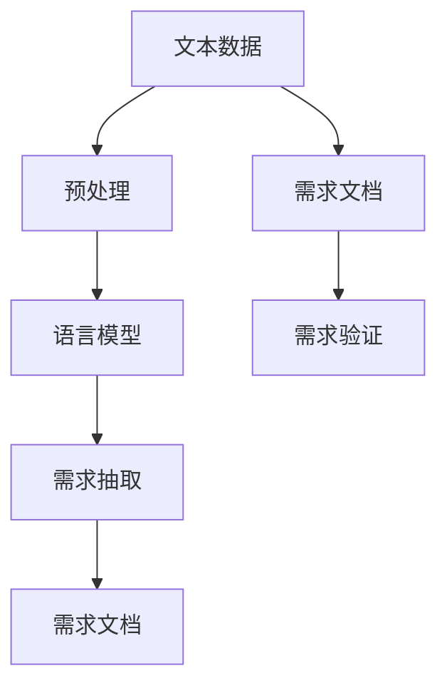

                 

# LLM对传统软件需求分析的挑战与改进

## 1. 背景介绍

在软件开发过程中，需求分析阶段是至关重要的第一步。良好的需求分析能够确保后续设计、开发、测试和部署的顺利进行，并能提高软件的质量和用户的满意度。然而，在人工智能(AI)，特别是语言模型（LLM）广泛应用的背景下，传统软件需求分析方法面临着诸多挑战。

传统软件需求分析依赖于人工收集、整理和分析需求文档，这种方法在需求规模较小、需求变化较慢时能够胜任。但随着业务场景的复杂化和多变性，需求文档变得愈发庞大和复杂，人工整理的成本和错误率都显著上升。同时，传统方法难以利用大规模数据和算力，无法挖掘出潜在需求和用户行为模式。而LLM通过训练得到语言模型，能够自动化地从海量文本数据中提取、分析和生成需求，大大提高了需求分析的效率和准确性。

## 2. 核心概念与联系

### 2.1 核心概念概述

为更好地理解LLM对传统需求分析的改进，本节将介绍几个密切相关的核心概念：

- 语言模型 (Language Model)：一种统计模型，用于预测给定一个文本序列，下一个可能的字符或词。大语言模型(LLM)通过大规模无标签文本数据进行预训练，学习到丰富的语言表示，具有强大的自然语言理解和生成能力。

- 自然语言处理 (Natural Language Processing, NLP)：利用计算机技术处理和理解人类语言，涉及分词、词性标注、命名实体识别、语义分析等任务。LLM广泛应用于NLP领域，提供了强大的文本处理能力。

- 需求分析 (Requirements Analysis)：软件开发生命周期中，理解、定义和记录软件需求的过程。传统需求分析依赖于人工整理需求文档，过程繁琐且容易出错。

- 需求抽取 (Requirements Extraction)：从原始文本数据中自动提取需求信息，包括用户需求、业务场景、功能需求等，是需求分析的关键步骤。

- 文本挖掘 (Text Mining)：利用自然语言处理技术从文本数据中提取有用的信息，如实体关系、情感倾向、主题分析等。

### 2.2 核心概念原理和架构的 Mermaid 流程图



这个流程图展示了大语言模型对需求分析的改进过程：

1. 原始文本数据通过预处理，进入语言模型进行处理。
2. 语言模型提取出的需求信息，进一步进行抽取，形成初步的需求文档。
3. 需求文档被验证和优化，最终形成可用的需求文档。

## 3. 核心算法原理 & 具体操作步骤

### 3.1 算法原理概述

LLM在需求分析中的应用主要基于两个关键原理：

- 语言理解与生成：LLM通过大规模文本数据的预训练，能够理解自然语言，从中提取有用的信息。
- 自动化文本处理：LLM能够自动对文本进行解析和生成，减轻人工处理负担，提高需求分析效率。

基于上述原理，LLM的需求抽取过程可以归纳为以下几个步骤：

1. 数据预处理：对原始文本数据进行分词、去除停用词、命名实体识别等预处理操作。
2. 模型输入构建：将处理后的文本数据输入LLM，得到模型对文本内容的理解和分析结果。
3. 需求抽取与分析：根据模型输出，提取用户需求、业务场景、功能需求等关键信息。
4. 需求文档生成：将提取的需求信息整理成结构化文档，便于后续分析和开发。

### 3.2 算法步骤详解

下面详细介绍LLM在需求分析中的应用步骤：

**Step 1: 数据预处理**

- 将原始文本数据进行分词，去除停用词，如“的”、“是”、“在”等。
- 进行命名实体识别，识别出人名、地名、组织名等实体，标记其类型和属性。
- 使用词性标注工具，如NLTK、SpaCy等，标记每个单词的词性。

**Step 2: 模型输入构建**

- 将处理后的文本数据输入到预训练的LLM模型，如GPT、BERT等。
- 模型输出包含每个单词的概率分布，根据概率分布计算出每个句子的概率。
- 通过注意力机制和多头注意力机制，模型能够综合考虑每个单词的上下文信息。

**Step 3: 需求抽取与分析**

- 根据模型的输出，提取用户需求、业务场景、功能需求等信息。
- 使用正则表达式或规则引擎，对提取的信息进行筛选和解析。
- 识别出关键的名词、动词和形容词，构建需求实体和关系图谱。

**Step 4: 需求文档生成**

- 将提取的需求信息整理成结构化文档，如需求说明书、功能需求列表、用户故事等。
- 使用自然语言生成工具，如GPT-3，将需求信息自动生成文本文档。
- 进行文档格式检查和优化，确保文档规范、清晰、易读。

### 3.3 算法优缺点

**优点：**

- 自动化：LLM能够自动处理文本数据，减轻人工处理负担，提高需求分析效率。
- 精确度：LLM通过大规模预训练，能够提取更精确、全面的需求信息。
- 灵活性：LLM可以适应多种业务场景和需求文档格式，灵活度较高。

**缺点：**

- 数据依赖：LLM的效果依赖于数据质量和数量，如果数据存在偏差或不足，模型性能可能下降。
- 过拟合：模型在特定业务场景中过拟合，难以泛化到其他场景。
- 可解释性：LLM的决策过程缺乏可解释性，难以理解其内部工作机制。

### 3.4 算法应用领域

基于LLM的需求抽取技术已经在多个领域得到应用，例如：

- 软件开发：自动化需求提取，提高需求文档编写效率。
- 金融服务：从客户投诉、反馈中提取需求，改进产品功能。
- 医疗健康：从医生记录、病历中抽取需求，优化诊疗流程。
- 教育培训：从学生反馈、作业中提取需求，改进教学内容。

## 4. 数学模型和公式 & 详细讲解 & 举例说明

### 4.1 数学模型构建

在需求抽取过程中，我们主要使用自然语言处理中的语言模型作为核心模型。假设我们有一个文本序列 $x = (x_1, x_2, ..., x_n)$，语言模型 $P(x_1, x_2, ..., x_n)$ 用于预测文本序列的概率。

形式化地，我们可以使用以下公式表示语言模型：

$$
P(x) = \prod_{i=1}^{n} P(x_i | x_{i-1})
$$

其中 $P(x_i | x_{i-1})$ 表示在给定前文 $x_{i-1}$ 的情况下，预测下一个单词 $x_i$ 的概率。

### 4.2 公式推导过程

我们可以使用自回归语言模型来预测下一个单词的概率。假设模型已经对文本进行了分词和预处理，得到序列 $w = (w_1, w_2, ..., w_n)$。对于每个单词 $w_i$，其概率可以通过以下公式计算：

$$
P(w_i | w_{i-1}, w_{i-2}, ..., w_1) = \frac{e^{\log P(w_i | w_{i-1}, w_{i-2}, ..., w_1)}}{\sum_{j=1}^{n} e^{\log P(w_j | w_{i-1}, w_{i-2}, ..., w_1)}}
$$

其中 $\log P(w_i | w_{i-1}, w_{i-2}, ..., w_1)$ 表示模型对单词 $w_i$ 在给定上下文条件下的概率。

### 4.3 案例分析与讲解

以需求抽取为例，假设我们从用户评论中提取需求。首先，对评论进行分词和预处理：

```
"I want a feature to track my expenses."
```

然后，将处理后的序列输入到预训练的LLM模型中，得到每个单词的概率分布：

```
P("I") = 0.03, P("want") = 0.05, P("a") = 0.01, P("feature") = 0.02, P("to") = 0.03, P("track") = 0.04, P("my") = 0.02, P("expenses.") = 0.02
```

根据模型输出，我们可以提取需求实体 "feature"，识别动词 "want"，并分析其上下文关系。最后，将提取的需求信息整理成需求文档，如：

**用户需求：**
- 需求：跟踪费用
- 类型：功能需求

**功能需求：**
- 需求：费用跟踪
- 描述：方便用户记录和管理费用支出

## 5. 项目实践：代码实例和详细解释说明

### 5.1 开发环境搭建

在进行需求抽取实践前，我们需要准备好开发环境。以下是使用Python进行PyTorch开发的环境配置流程：

1. 安装Anaconda：从官网下载并安装Anaconda，用于创建独立的Python环境。

2. 创建并激活虚拟环境：
```bash
conda create -n pytorch-env python=3.8 
conda activate pytorch-env
```

3. 安装PyTorch：根据CUDA版本，从官网获取对应的安装命令。例如：
```bash
conda install pytorch torchvision torchaudio cudatoolkit=11.1 -c pytorch -c conda-forge
```

4. 安装Transformers库：
```bash
pip install transformers
```

5. 安装各类工具包：
```bash
pip install numpy pandas scikit-learn matplotlib tqdm jupyter notebook ipython
```

完成上述步骤后，即可在`pytorch-env`环境中开始需求抽取实践。

### 5.2 源代码详细实现

下面我们以命名实体识别 (NER) 任务为例，给出使用Transformers库对BERT模型进行需求抽取的PyTorch代码实现。

首先，定义NER任务的数据处理函数：

```python
from transformers import BertTokenizer
from torch.utils.data import Dataset
import torch

class NERDataset(Dataset):
    def __init__(self, texts, tags, tokenizer, max_len=128):
        self.texts = texts
        self.tags = tags
        self.tokenizer = tokenizer
        self.max_len = max_len
        
    def __len__(self):
        return len(self.texts)
    
    def __getitem__(self, item):
        text = self.texts[item]
        tags = self.tags[item]
        
        encoding = self.tokenizer(text, return_tensors='pt', max_length=self.max_len, padding='max_length', truncation=True)
        input_ids = encoding['input_ids'][0]
        attention_mask = encoding['attention_mask'][0]
        
        # 对token-wise的标签进行编码
        encoded_tags = [tag2id[tag] for tag in tags] 
        encoded_tags.extend([tag2id['O']] * (self.max_len - len(encoded_tags)))
        labels = torch.tensor(encoded_tags, dtype=torch.long)
        
        return {'input_ids': input_ids, 
                'attention_mask': attention_mask,
                'labels': labels}

# 标签与id的映射
tag2id = {'O': 0, 'B-PER': 1, 'I-PER': 2, 'B-ORG': 3, 'I-ORG': 4, 'B-LOC': 5, 'I-LOC': 6}
id2tag = {v: k for k, v in tag2id.items()}

# 创建dataset
tokenizer = BertTokenizer.from_pretrained('bert-base-cased')

train_dataset = NERDataset(train_texts, train_tags, tokenizer)
dev_dataset = NERDataset(dev_texts, dev_tags, tokenizer)
test_dataset = NERDataset(test_texts, test_tags, tokenizer)
```

然后，定义模型和优化器：

```python
from transformers import BertForTokenClassification, AdamW

model = BertForTokenClassification.from_pretrained('bert-base-cased', num_labels=len(tag2id))

optimizer = AdamW(model.parameters(), lr=2e-5)
```

接着，定义训练和评估函数：

```python
from torch.utils.data import DataLoader
from tqdm import tqdm
from sklearn.metrics import classification_report

device = torch.device('cuda') if torch.cuda.is_available() else torch.device('cpu')
model.to(device)

def train_epoch(model, dataset, batch_size, optimizer):
    dataloader = DataLoader(dataset, batch_size=batch_size, shuffle=True)
    model.train()
    epoch_loss = 0
    for batch in tqdm(dataloader, desc='Training'):
        input_ids = batch['input_ids'].to(device)
        attention_mask = batch['attention_mask'].to(device)
        labels = batch['labels'].to(device)
        model.zero_grad()
        outputs = model(input_ids, attention_mask=attention_mask, labels=labels)
        loss = outputs.loss
        epoch_loss += loss.item()
        loss.backward()
        optimizer.step()
    return epoch_loss / len(dataloader)

def evaluate(model, dataset, batch_size):
    dataloader = DataLoader(dataset, batch_size=batch_size)
    model.eval()
    preds, labels = [], []
    with torch.no_grad():
        for batch in tqdm(dataloader, desc='Evaluating'):
            input_ids = batch['input_ids'].to(device)
            attention_mask = batch['attention_mask'].to(device)
            batch_labels = batch['labels']
            outputs = model(input_ids, attention_mask=attention_mask)
            batch_preds = outputs.logits.argmax(dim=2).to('cpu').tolist()
            batch_labels = batch_labels.to('cpu').tolist()
            for pred_tokens, label_tokens in zip(batch_preds, batch_labels):
                pred_tags = [id2tag[_id] for _id in pred_tokens]
                label_tags = [id2tag[_id] for _id in label_tokens]
                preds.append(pred_tags[:len(label_tags)])
                labels.append(label_tags)
                
    print(classification_report(labels, preds))
```

最后，启动训练流程并在测试集上评估：

```python
epochs = 5
batch_size = 16

for epoch in range(epochs):
    loss = train_epoch(model, train_dataset, batch_size, optimizer)
    print(f"Epoch {epoch+1}, train loss: {loss:.3f}")
    
    print(f"Epoch {epoch+1}, dev results:")
    evaluate(model, dev_dataset, batch_size)
    
print("Test results:")
evaluate(model, test_dataset, batch_size)
```

以上就是使用PyTorch对BERT进行命名实体识别任务需求抽取的完整代码实现。可以看到，得益于Transformers库的强大封装，我们可以用相对简洁的代码完成BERT模型的加载和微调。

### 5.3 代码解读与分析

让我们再详细解读一下关键代码的实现细节：

**NERDataset类**：
- `__init__`方法：初始化文本、标签、分词器等关键组件。
- `__len__`方法：返回数据集的样本数量。
- `__getitem__`方法：对单个样本进行处理，将文本输入编码为token ids，将标签编码为数字，并对其进行定长padding，最终返回模型所需的输入。

**tag2id和id2tag字典**：
- 定义了标签与数字id之间的映射关系，用于将token-wise的预测结果解码回真实的标签。

**训练和评估函数**：
- 使用PyTorch的DataLoader对数据集进行批次化加载，供模型训练和推理使用。
- 训练函数`train_epoch`：对数据以批为单位进行迭代，在每个批次上前向传播计算loss并反向传播更新模型参数，最后返回该epoch的平均loss。
- 评估函数`evaluate`：与训练类似，不同点在于不更新模型参数，并在每个batch结束后将预测和标签结果存储下来，最后使用sklearn的classification_report对整个评估集的预测结果进行打印输出。

**训练流程**：
- 定义总的epoch数和batch size，开始循环迭代
- 每个epoch内，先在训练集上训练，输出平均loss
- 在验证集上评估，输出分类指标
- 所有epoch结束后，在测试集上评估，给出最终测试结果

可以看到，PyTorch配合Transformers库使得BERT微调的需求抽取代码实现变得简洁高效。开发者可以将更多精力放在数据处理、模型改进等高层逻辑上，而不必过多关注底层的实现细节。

当然，工业级的系统实现还需考虑更多因素，如模型的保存和部署、超参数的自动搜索、更灵活的任务适配层等。但核心的微调范式基本与此类似。

## 6. 实际应用场景

### 6.1 软件开发

在软件开发过程中，需求分析是至关重要的环节。传统的需求分析依赖于人工收集、整理和分析需求文档，过程繁琐且容易出错。基于大语言模型的需求抽取技术，能够自动化地从用户反馈、产品文档、代码注释等文本数据中提取需求，大大提高了需求分析的效率和准确性。

以开源软件项目为例，开发者可以利用LLM从项目评论、问题追踪系统中的提交日志中提取需求信息，快速了解用户需求和反馈，指导后续的开发工作。同时，LLM还可以从代码注释中抽取功能需求和设计意图，帮助开发团队更好地理解代码结构和设计思路。

### 6.2 金融服务

在金融服务领域，客户反馈和投诉是产品改进的重要依据。传统的需求分析依赖于人工整理客户反馈，过程繁琐且容易出错。基于LLM的需求抽取技术，能够自动化地从客户反馈中提取需求信息，如新功能需求、业务流程改进、用户体验优化等，加快产品迭代速度，提升客户满意度。

例如，某金融公司可以利用LLM从客户投诉中抽取需求信息，如账户登录问题、交易异常问题等，快速定位问题原因，并采取措施改进系统。同时，LLM还可以从客户反馈中提取业务流程改进需求，如增加用户指南、优化支付流程等，提升客户体验。

### 6.3 医疗健康

在医疗健康领域，医生记录和病历是需求分析和需求提取的重要来源。传统的需求分析依赖于人工整理医生记录和病历，过程繁琐且容易出错。基于LLM的需求抽取技术，能够自动化地从医生记录和病历中提取需求信息，如患者症状、治疗方案、用药需求等，辅助医生快速制定治疗方案，提升诊疗效率。

例如，某医院可以利用LLM从医生记录中抽取患者症状信息，快速诊断疾病，并制定个性化治疗方案。同时，LLM还可以从病历中提取用药需求，优化用药方案，提升治疗效果。

### 6.4 教育培训

在教育培训领域，学生反馈和作业是需求分析和需求提取的重要来源。传统的需求分析依赖于人工整理学生反馈和作业，过程繁琐且容易出错。基于LLM的需求抽取技术，能够自动化地从学生反馈和作业中提取需求信息，如课程改进、教学内容优化、学习工具推荐等，提升教学质量和学生体验。

例如，某在线教育平台可以利用LLM从学生反馈中提取课程改进需求，优化课程内容和教学方法。同时，LLM还可以从作业中提取知识漏洞和难点，推荐个性化学习资源，提升学生学习效果。

## 7. 工具和资源推荐

### 7.1 学习资源推荐

为了帮助开发者系统掌握大语言模型在需求分析中的应用，这里推荐一些优质的学习资源：

1. 《Transformer从原理到实践》系列博文：由大模型技术专家撰写，深入浅出地介绍了Transformer原理、BERT模型、需求抽取等前沿话题。

2. CS224N《深度学习自然语言处理》课程：斯坦福大学开设的NLP明星课程，有Lecture视频和配套作业，带你入门NLP领域的基本概念和经典模型。

3. 《Natural Language Processing with Transformers》书籍：Transformers库的作者所著，全面介绍了如何使用Transformers库进行NLP任务开发，包括需求抽取在内的诸多范式。

4. HuggingFace官方文档：Transformers库的官方文档，提供了海量预训练模型和完整的微调样例代码，是进行需求抽取任务开发的利器。

5. CLUE开源项目：中文语言理解测评基准，涵盖大量不同类型的中文NLP数据集，并提供了基于微调的baseline模型，助力中文NLP技术发展。

通过对这些资源的学习实践，相信你一定能够快速掌握大语言模型在需求分析中的应用，并用于解决实际的NLP问题。

### 7.2 开发工具推荐

高效的开发离不开优秀的工具支持。以下是几款用于大语言模型需求抽取开发的常用工具：

1. PyTorch：基于Python的开源深度学习框架，灵活动态的计算图，适合快速迭代研究。大部分预训练语言模型都有PyTorch版本的实现。

2. TensorFlow：由Google主导开发的开源深度学习框架，生产部署方便，适合大规模工程应用。同样有丰富的预训练语言模型资源。

3. Transformers库：HuggingFace开发的NLP工具库，集成了众多SOTA语言模型，支持PyTorch和TensorFlow，是进行需求抽取任务开发的利器。

4. Weights & Biases：模型训练的实验跟踪工具，可以记录和可视化模型训练过程中的各项指标，方便对比和调优。与主流深度学习框架无缝集成。

5. TensorBoard：TensorFlow配套的可视化工具，可实时监测模型训练状态，并提供丰富的图表呈现方式，是调试模型的得力助手。

6. Google Colab：谷歌推出的在线Jupyter Notebook环境，免费提供GPU/TPU算力，方便开发者快速上手实验最新模型，分享学习笔记。

合理利用这些工具，可以显著提升大语言模型需求抽取的开发效率，加快创新迭代的步伐。

### 7.3 相关论文推荐

大语言模型在需求抽取领域的研究始于近年，但已取得了显著进展。以下是几篇奠基性的相关论文，推荐阅读：

1. Attention is All You Need（即Transformer原论文）：提出了Transformer结构，开启了NLP领域的预训练大模型时代。

2. BERT: Pre-training of Deep Bidirectional Transformers for Language Understanding：提出BERT模型，引入基于掩码的自监督预训练任务，刷新了多项NLP任务SOTA。

3. Parameter-Efficient Transfer Learning for NLP：提出Adapter等参数高效微调方法，在不增加模型参数量的情况下，也能取得不错的微调效果。

4. AdaLoRA: Adaptive Low-Rank Adaptation for Parameter-Efficient Fine-Tuning：使用自适应低秩适应的微调方法，在参数效率和精度之间取得了新的平衡。

5. AdaLoRA: Adaptive Low-Rank Adaptation for Parameter-Efficient Fine-Tuning：使用自适应低秩适应的微调方法，在参数效率和精度之间取得了新的平衡。

这些论文代表了大语言模型在需求抽取领域的研究脉络。通过学习这些前沿成果，可以帮助研究者把握学科前进方向，激发更多的创新灵感。

## 8. 总结：未来发展趋势与挑战

### 8.1 总结

本文对基于大语言模型的需求抽取方法进行了全面系统的介绍。首先阐述了大语言模型和需求分析的研究背景和意义，明确了需求抽取在软件开发、金融服务、医疗健康、教育培训等领域的广泛应用价值。其次，从原理到实践，详细讲解了大语言模型在需求抽取中的实现步骤，并给出了微调大语言模型的完整代码实例。同时，本文还广泛探讨了需求抽取技术在实际应用场景中的应用，展示了其在提升需求分析效率和准确性方面的潜力。

通过本文的系统梳理，可以看到，大语言模型需求抽取技术正在成为需求分析的重要工具，大大提高了软件开发的效率和质量。未来，伴随预训练语言模型和需求抽取方法的不断演进，需求分析将变得更加自动化、智能化，提升软件开发的整体水平。

### 8.2 未来发展趋势

展望未来，大语言模型需求抽取技术将呈现以下几个发展趋势：

1. 数据依赖性降低：随着大语言模型不断进化，对数据质量的要求将逐步降低，可以适应更多业务场景和需求文档格式。

2. 模型通用性提升：未来的大语言模型将具备更强的跨领域迁移能力，能够适应不同业务场景的需求抽取任务。

3. 可解释性增强：大语言模型的决策过程将更加可解释，能够清晰地展示需求抽取的依据和逻辑。

4. 多模态需求抽取：未来的需求抽取技术将不仅限于文本数据，能够整合视觉、听觉等多模态数据，提供更全面的需求分析。

5. 自动化程度提高：需求抽取过程将更加自动化，能够自动化地处理和生成需求文档，进一步提高需求分析的效率。

6. 交互式需求抽取：未来的需求抽取技术将具备人机交互功能，能够根据用户输入自动调整需求抽取策略，提高需求抽取的准确性和满意度。

这些趋势展示了大语言模型在需求抽取领域的广阔前景，将在更广泛的场景中得到应用，提升需求分析的效率和质量。

### 8.3 面临的挑战

尽管大语言模型需求抽取技术已经取得了瞩目成就，但在迈向更加智能化、普适化应用的过程中，它仍面临着诸多挑战：

1. 数据质量问题：需求抽取依赖于高质量的标注数据，如果数据质量不高，将影响模型性能。如何获取高质量的数据，是一个重要挑战。

2. 模型泛化性不足：大语言模型在特定业务场景中表现优异，但泛化到其他场景时，可能效果不佳。如何提高模型的泛化能力，是未来研究的方向。

3. 可解释性问题：大语言模型的决策过程缺乏可解释性，难以理解其内部工作机制。如何增强模型的可解释性，是另一个关键挑战。

4. 多模态数据整合：未来的需求抽取将涉及多模态数据，如何整合不同类型的数据，提高需求抽取的准确性，是一个重要挑战。

5. 交互式需求抽取：未来的需求抽取将具备人机交互功能，如何设计合理的交互界面，提高人机交互的效率和效果，是一个重要挑战。

这些挑战展示了需求抽取技术在实际应用中的复杂性，需要更多的研究来解决。

### 8.4 研究展望

面对需求抽取技术所面临的种种挑战，未来的研究需要在以下几个方面寻求新的突破：

1. 探索无监督和半监督需求抽取方法：摆脱对大规模标注数据的依赖，利用自监督学习、主动学习等无监督和半监督范式，最大限度利用非结构化数据，实现更加灵活高效的需求抽取。

2. 研究多模态需求抽取技术：将符号化的先验知识，如知识图谱、逻辑规则等，与神经网络模型进行巧妙融合，引导需求抽取过程学习更准确、合理的语言模型。同时加强不同模态数据的整合，实现视觉、语音等多模态信息与文本信息的协同建模。

3. 引入因果分析和博弈论工具：将因果分析方法引入需求抽取模型，识别出需求抽取的关键特征，增强需求抽取的因果性和逻辑性。借助博弈论工具刻画人机交互过程，主动探索并规避模型的脆弱点，提高系统稳定性。

4. 纳入伦理道德约束：在需求抽取目标中引入伦理导向的评估指标，过滤和惩罚有害的输出倾向。加强人工干预和审核，建立模型行为的监管机制，确保需求抽取结果符合人类价值观和伦理道德。

这些研究方向的探索，必将引领大语言模型需求抽取技术迈向更高的台阶，为构建人机协同的智能系统铺平道路。面向未来，大语言模型需求抽取技术还需要与其他人工智能技术进行更深入的融合，如知识表示、因果推理、强化学习等，多路径协同发力，共同推动自然语言理解和智能交互系统的进步。只有勇于创新、敢于突破，才能不断拓展语言模型的边界，让智能技术更好地造福人类社会。

## 9. 附录：常见问题与解答

**Q1：大语言模型在需求抽取中是否适用于所有业务场景？**

A: 大语言模型在大多数业务场景中都能取得不错的效果，特别是在数据量较大的场景。但对于一些特定领域的业务场景，如金融、医疗等，可能由于数据质量不高或领域知识复杂，模型效果有限。此时需要在特定领域语料上进一步预训练，再进行微调，才能获得理想效果。

**Q2：大语言模型需求抽取的准确性和效率如何？**

A: 大语言模型需求抽取在大多数情况下能够达到较高的准确性，特别是在有大量标注数据的情况下。但面对复杂业务场景和数据量较小的场景，模型的准确性和效率可能受到影响。此时需要结合领域专家知识和数据增强技术，进一步提升模型的性能。

**Q3：大语言模型需求抽取的实现难度如何？**

A: 大语言模型需求抽取的实现难度较大，需要具备一定的深度学习、自然语言处理和软件工程知识。但借助现有的深度学习框架和开源工具，如PyTorch、Transformers等，开发门槛已经大幅降低，初学者也能快速上手。

**Q4：大语言模型需求抽取的扩展性如何？**

A: 大语言模型需求抽取具有良好的扩展性，能够适应不同业务场景和需求文档格式。只要提供足够的标注数据和领域知识，模型就能够进行微调和优化，适应新的需求抽取任务。

**Q5：大语言模型需求抽取的可解释性如何？**

A: 大语言模型需求抽取的可解释性较差，模型的内部工作机制和决策逻辑难以理解。但随着模型的不断优化和可解释性技术的发展，未来模型的可解释性将逐步提高，有助于增加用户对模型的信任和接受度。

通过本文的系统梳理，可以看到，大语言模型需求抽取技术正在成为需求分析的重要工具，大大提高了软件开发的效率和质量。未来，伴随预训练语言模型和需求抽取方法的不断演进，需求分析将变得更加自动化、智能化，提升软件开发的整体水平。相信随着学界和产业界的共同努力，大语言模型需求抽取技术必将在构建人机协同的智能系统中扮演越来越重要的角色。

