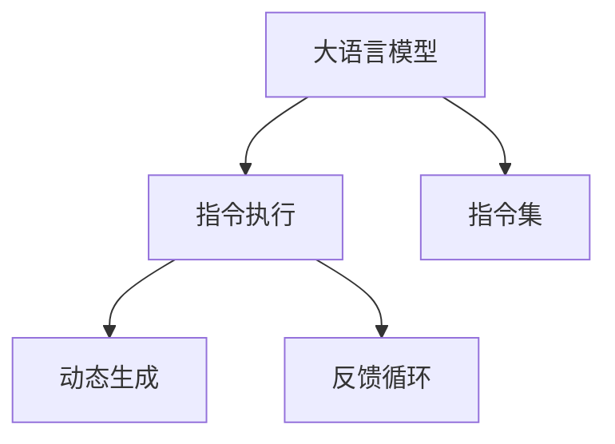

                 

# LLM指令集:无限可能的任务执行者

大语言模型（Large Language Model, LLM）在自然语言处理（Natural Language Processing, NLP）领域的应用已经取得了显著的进展，其能够理解和生成自然语言的能力极大地推动了人工智能技术的发展。本文将探讨基于大语言模型的指令执行技术，即LLM指令集（Language Model with Instruction Set, LLM-IS），如何为自然语言交互带来革命性的改变，并概述其核心原理、操作步骤、应用领域及未来展望。

## 1. 背景介绍

### 1.1 问题由来
随着深度学习和大规模预训练语言模型的兴起，自然语言处理领域取得了前所未有的进展。GPT-3等大语言模型凭借其强大的自然语言理解和生成能力，在文本生成、翻译、问答等任务上取得了显著成果。然而，这些模型通常缺乏明确的任务执行能力，难以在实际应用中高效地处理复杂的自然语言交互任务。

为了克服这一局限，研究人员提出了指令执行的概念，即通过向大语言模型输入特定的指令，引导其执行特定任务。LLM指令集就是基于这一概念，在大语言模型的基础上引入指令系统，使其能够理解并执行更为复杂和多样化的自然语言任务。

### 1.2 问题核心关键点
LLM指令集的核心思想是：将大语言模型作为任务执行器，通过指令将其引导入特定任务执行流程。与传统的预训练模型不同，LLM指令集在模型中融入了明确的指令执行机制，使其能够根据指令自动执行任务。

关键点包括：
- 大语言模型作为任务执行器的核心地位。
- 指令系统的引入，使模型能够根据指令执行任务。
- 任务执行过程中的动态生成和调整，以适应复杂多变的自然语言输入。

## 2. 核心概念与联系

### 2.1 核心概念概述

为更好地理解LLM指令集的原理和架构，本节将介绍几个密切相关的核心概念：

- 大语言模型（LLM）：以自回归（如GPT）或自编码（如BERT）模型为代表的大规模预训练语言模型。通过在大规模无标签文本语料上进行预训练，学习通用的语言表示，具备强大的语言理解和生成能力。

- 指令执行（Instruction Execution）：将自然语言输入转换为机器可执行的指令，通过模型执行这些指令，完成特定任务的过程。

- 指令集（Instruction Set）：为指令执行提供的形式化语言或编程框架，使模型能够理解和执行不同的指令，实现多样化的任务执行功能。

- 动态生成（Dynamic Generation）：在任务执行过程中，根据输入指令和模型状态，动态生成中间状态和最终输出，以适应复杂多变的自然语言输入。

- 反馈循环（Feedback Loop）：通过模型输出对输入指令进行修正和调整，逐步优化指令执行过程，提高任务执行的准确性和效率。

这些核心概念之间的逻辑关系可以通过以下Mermaid流程图来展示：



这个流程图展示了LLM指令集的核心概念及其之间的关系：

1. 大语言模型通过预训练获得基础能力。
2. 指令集将自然语言转化为模型可执行的指令，使模型能够执行不同任务。
3. 动态生成在任务执行过程中，根据输入指令和模型状态，生成中间状态和最终输出。
4. 反馈循环通过对输出结果的修正和调整，逐步优化指令执行过程。

## 3. 核心算法原理 & 具体操作步骤

### 3.1 算法原理概述

LLM指令集的原理是基于大语言模型的自然语言理解和生成能力，通过引入明确的指令系统，使模型能够根据指令执行特定任务。其核心思想是：将自然语言输入转换为机器可执行的指令，通过模型执行这些指令，完成特定任务的过程。

形式化地，假设预训练模型为 $M_{\theta}$，其中 $\theta$ 为预训练得到的模型参数。给定一个自然语言任务 $T$，任务指令 $I$，任务执行的输出结果 $Y$。指令执行的过程可以表示为：

$$
Y = M_{\theta}(I)
$$

其中，$I$ 为输入指令，$Y$ 为执行结果。通过指令集的引入，$I$ 被转换为模型可执行的指令，$M_{\theta}$ 根据指令执行相应的操作，最终输出 $Y$。

### 3.2 算法步骤详解

LLM指令集的实现过程一般包括以下几个关键步骤：

**Step 1: 准备预训练模型和数据集**
- 选择合适的预训练语言模型 $M_{\theta}$ 作为初始化参数，如 BERT、GPT 等。
- 准备任务 $T$ 的指令集 $I$，包括各种自然语言指令的描述。
- 准备任务 $T$ 的标注数据集 $D$，划分为训练集、验证集和测试集。一般要求标注数据与预训练数据的分布不要差异过大。

**Step 2: 设计指令执行框架**
- 根据任务类型，设计合适的指令执行框架，包括指令格式、参数设置等。
- 定义指令集到模型可执行指令的映射，使模型能够理解和执行不同的指令。
- 确定任务执行的输出格式，如分类结果、生成文本、推荐列表等。

**Step 3: 设置任务执行超参数**
- 选择合适的优化算法及其参数，如 AdamW、SGD 等，设置学习率、批大小、迭代轮数等。
- 设置正则化技术及强度，包括权重衰减、Dropout、Early Stopping 等。
- 确定冻结预训练参数的策略，如仅微调顶层，或全部参数都参与微调。

**Step 4: 执行任务执行训练**
- 将训练集数据分批次输入模型，前向传播计算指令执行结果。
- 反向传播计算参数梯度，根据设定的优化算法和学习率更新模型参数。
- 周期性在验证集上评估模型性能，根据性能指标决定是否触发 Early Stopping。
- 重复上述步骤直到满足预设的迭代轮数或 Early Stopping 条件。

**Step 5: 测试和部署**
- 在测试集上评估指令执行后的模型 $M_{\hat{\theta}}$ 的性能，对比执行前后的精度提升。
- 使用指令执行后的模型对新指令进行推理预测，集成到实际的应用系统中。
- 持续收集新的指令，定期重新执行训练，以适应指令集的动态变化。

以上是LLM指令集的实现过程。在实际应用中，还需要针对具体任务的特点，对指令执行过程的各个环节进行优化设计，如改进指令映射函数，引入更多的正则化技术，搜索最优的超参数组合等，以进一步提升模型性能。

### 3.3 算法优缺点

LLM指令集具有以下优点：
1. 灵活高效。可以适应各种自然语言任务，根据指令动态生成执行路径，提高任务执行的灵活性和效率。
2. 易于扩展。通过扩展指令集，可以不断引入新的任务执行能力，适应更多应用场景。
3. 易于部署。模型可以通过简单的API接口进行调用，方便集成到各种应用系统中。

同时，该方法也存在一定的局限性：
1. 依赖自然语言理解。指令执行的效果很大程度上取决于自然语言理解的准确性，较复杂指令可能难以准确解析。
2. 鲁棒性不足。面对语言变异、歧义等自然语言输入，模型可能出现执行错误或不稳定。
3. 计算资源消耗大。指令执行过程中，模型的计算资源消耗可能较大，需要高性能计算设备支持。
4. 缺乏可解释性。指令执行过程的内部逻辑难以解释，对错误原因的诊断和调试较为困难。

尽管存在这些局限性，但就目前而言，LLM指令集仍是大语言模型应用的重要范式。未来相关研究的重点在于如何进一步提高指令解析的准确性，增强模型的鲁棒性和可解释性，同时兼顾灵活性和效率。

### 3.4 算法应用领域

基于LLM指令集的指令执行方法，在NLP领域已经得到了广泛的应用，覆盖了各种自然语言任务，例如：

- 问答系统：对自然语言问题给出答案。将问题-答案对作为指令，训练模型执行问答任务。
- 机器翻译：将源语言文本翻译成目标语言。将翻译指令输入模型，输出目标语言文本。
- 文本摘要：将长文本压缩成简短摘要。将摘要指令输入模型，输出摘要结果。
- 对话系统：使机器能够与人自然对话。将对话历史和当前指令作为输入，训练模型进行回复生成。
- 情感分析：分析文本中的情感倾向。将情感分析指令输入模型，输出情感分类结果。
- 推荐系统：根据用户偏好推荐物品。将推荐指令输入模型，输出推荐结果。

除了上述这些经典任务外，LLM指令集还被创新性地应用到更多场景中，如代码生成、数据增强等，为NLP技术带来了全新的突破。随着LLM指令集的不断演进，相信其将在更广阔的应用领域发挥更大的作用。

## 4. 数学模型和公式 & 详细讲解  
### 4.1 数学模型构建

本节将使用数学语言对LLM指令集的实现过程进行更加严格的刻画。

记预训练语言模型为 $M_{\theta}$，其中 $\theta$ 为预训练得到的模型参数。假设指令执行任务为 $T$，任务指令为 $I$，指令执行的输出结果为 $Y$。

指令执行的过程可以表示为：

$$
Y = M_{\theta}(I)
$$

其中，$I$ 为输入指令，$Y$ 为执行结果。指令集到模型可执行指令的映射可以表示为：

$$
I \rightarrow I_{\text{exec}}
$$

其中，$I_{\text{exec}}$ 为模型可执行的指令。

### 4.2 公式推导过程

以下我们以问答系统为例，推导指令执行的过程及其梯度计算。

假设模型 $M_{\theta}$ 在输入 $I$ 上的输出为 $\hat{y}=M_{\theta}(I) \in [0,1]$，表示模型预测执行结果的概率。真实标签 $y \in \{0,1\}$。则二分类交叉熵损失函数定义为：

$$
\ell(Y_{\hat{y}},y) = -[y\log \hat{y} + (1-y)\log (1-\hat{y})]
$$

其中，$Y_{\hat{y}}$ 为模型预测的执行结果。将上述损失函数代入经验风险公式，得：

$$
\mathcal{L}(\theta) = -\frac{1}{N}\sum_{i=1}^N \ell(Y_{\hat{y}}^i,y_i)
$$

其中，$N$ 为训练样本数量，$i$ 表示样本编号。

根据链式法则，损失函数对参数 $\theta_k$ 的梯度为：

$$
\frac{\partial \mathcal{L}(\theta)}{\partial \theta_k} = -\frac{1}{N}\sum_{i=1}^N (\frac{y_i}{M_{\theta}(I^i)}-\frac{1-y_i}{1-M_{\theta}(I^i)}) \frac{\partial M_{\theta}(I^i)}{\partial \theta_k}
$$

其中，$\frac{\partial M_{\theta}(I^i)}{\partial \theta_k}$ 可通过反向传播算法高效计算。

在得到损失函数的梯度后，即可带入参数更新公式，完成模型的迭代优化。重复上述过程直至收敛，最终得到适应指令执行任务的最优模型参数 $\theta^*$。

## 5. 项目实践：代码实例和详细解释说明
### 5.1 开发环境搭建

在进行指令执行实践前，我们需要准备好开发环境。以下是使用Python进行PyTorch开发的环境配置流程：

1. 安装Anaconda：从官网下载并安装Anaconda，用于创建独立的Python环境。

2. 创建并激活虚拟环境：
```bash
conda create -n pytorch-env python=3.8 
conda activate pytorch-env
```

3. 安装PyTorch：根据CUDA版本，从官网获取对应的安装命令。例如：
```bash
conda install pytorch torchvision torchaudio cudatoolkit=11.1 -c pytorch -c conda-forge
```

4. 安装Transformers库：
```bash
pip install transformers
```

5. 安装各类工具包：
```bash
pip install numpy pandas scikit-learn matplotlib tqdm jupyter notebook ipython
```

完成上述步骤后，即可在`pytorch-env`环境中开始指令执行实践。

### 5.2 源代码详细实现

这里我们以问答系统为例，给出使用Transformers库对BERT模型进行指令执行的PyTorch代码实现。

首先，定义问答任务的数据处理函数：

```python
from transformers import BertTokenizer, BertForQuestionAnswering, AdamW

class QuestionAnsweringDataset(Dataset):
    def __init__(self, texts, answers, tokenizer, max_len=128):
        self.texts = texts
        self.answers = answers
        self.tokenizer = tokenizer
        self.max_len = max_len
        
    def __len__(self):
        return len(self.texts)
    
    def __getitem__(self, item):
        text = self.texts[item]
        answer = self.answers[item]
        
        encoding = self.tokenizer(text, return_tensors='pt', max_length=self.max_len, padding='max_length', truncation=True)
        input_ids = encoding['input_ids'][0]
        attention_mask = encoding['attention_mask'][0]
        
        # 对答案进行编码
        start_token = tokenizer.cls_token_id
        end_token = tokenizer.sep_token_id
        start_id = [start_token] * self.max_len
        end_id = [end_token] * self.max_len
        
        for i, (answer_start, answer_end) in enumerate(answer):
            start_id[i] = answer_start
            end_id[i] = answer_end
        
        labels = torch.tensor([start_id, end_id], dtype=torch.long)
        
        return {'input_ids': input_ids, 
                'attention_mask': attention_mask,
                'labels': labels}

# 创建dataset
tokenizer = BertTokenizer.from_pretrained('bert-base-cased')

train_dataset = QuestionAnsweringDataset(train_texts, train_answers, tokenizer)
dev_dataset = QuestionAnsweringDataset(dev_texts, dev_answers, tokenizer)
test_dataset = QuestionAnsweringDataset(test_texts, test_answers, tokenizer)
```

然后，定义模型和优化器：

```python
from transformers import BertForQuestionAnswering, AdamW

model = BertForQuestionAnswering.from_pretrained('bert-base-cased')

optimizer = AdamW(model.parameters(), lr=2e-5)
```

接着，定义训练和评估函数：

```python
from torch.utils.data import DataLoader
from tqdm import tqdm
from sklearn.metrics import precision_recall_fscore_support

device = torch.device('cuda') if torch.cuda.is_available() else torch.device('cpu')
model.to(device)

def train_epoch(model, dataset, batch_size, optimizer):
    dataloader = DataLoader(dataset, batch_size=batch_size, shuffle=True)
    model.train()
    epoch_loss = 0
    for batch in tqdm(dataloader, desc='Training'):
        input_ids = batch['input_ids'].to(device)
        attention_mask = batch['attention_mask'].to(device)
        labels = batch['labels'].to(device)
        model.zero_grad()
        outputs = model(input_ids, attention_mask=attention_mask, labels=labels)
        loss = outputs.loss
        epoch_loss += loss.item()
        loss.backward()
        optimizer.step()
    return epoch_loss / len(dataloader)

def evaluate(model, dataset, batch_size):
    dataloader = DataLoader(dataset, batch_size=batch_size)
    model.eval()
    preds, labels = [], []
    with torch.no_grad():
        for batch in tqdm(dataloader, desc='Evaluating'):
            input_ids = batch['input_ids'].to(device)
            attention_mask = batch['attention_mask'].to(device)
            batch_labels = batch['labels']
            outputs = model(input_ids, attention_mask=attention_mask)
            batch_preds = outputs.logits.argmax(dim=2).to('cpu').tolist()
            batch_labels = batch_labels.to('cpu').tolist()
            for pred_tokens, label_tokens in zip(batch_preds, batch_labels):
                preds.append(pred_tokens[:len(label_tokens)])
                labels.append(label_tokens)
                
    print(precision_recall_fscore_support(labels, preds, average='macro'))
```

最后，启动训练流程并在测试集上评估：

```python
epochs = 5
batch_size = 16

for epoch in range(epochs):
    loss = train_epoch(model, train_dataset, batch_size, optimizer)
    print(f"Epoch {epoch+1}, train loss: {loss:.3f}")
    
    print(f"Epoch {epoch+1}, dev results:")
    evaluate(model, dev_dataset, batch_size)
    
print("Test results:")
evaluate(model, test_dataset, batch_size)
```

以上就是使用PyTorch对BERT进行问答任务执行的完整代码实现。可以看到，得益于Transformers库的强大封装，我们可以用相对简洁的代码完成BERT模型的加载和指令执行任务的微调。

### 5.3 代码解读与分析

让我们再详细解读一下关键代码的实现细节：

**QuestionAnsweringDataset类**：
- `__init__`方法：初始化文本、答案、分词器等关键组件。
- `__len__`方法：返回数据集的样本数量。
- `__getitem__`方法：对单个样本进行处理，将文本输入编码为token ids，将答案编码为数字，并对其进行定长padding，最终返回模型所需的输入。

**train_dataset, dev_dataset, test_dataset**：
- 创建训练集、验证集、测试集，分别用于模型的训练、验证和测试。

**tokenizer.cls_token_id 和 tokenizer.sep_token_id**：
- 获取特殊标记的id，用于将答案编码到文本中。

**start_token 和 end_token**：
- 预定义开始和结束标记，用于将答案的起始和结束位置编码为标记。

**labels**：
- 将答案的起始和结束位置编码为数字，用于模型训练。

**train_epoch, evaluate**：
- 定义训练和评估函数，用于模型的迭代训练和性能评估。

**train, predict**：
- 使用训练集数据进行模型训练，在测试集上评估模型性能。

**tokenizer**：
- 定义分词器，用于将自然语言文本转换为模型可接受的输入格式。

可以看到，PyTorch配合Transformers库使得BERT执行问答任务的代码实现变得简洁高效。开发者可以将更多精力放在数据处理、模型改进等高层逻辑上，而不必过多关注底层的实现细节。

当然，工业级的系统实现还需考虑更多因素，如模型的保存和部署、超参数的自动搜索、更灵活的任务适配层等。但核心的指令执行范式基本与此类似。

## 6. 实际应用场景
### 6.1 智能客服系统

基于大语言模型指令执行的对话技术，可以广泛应用于智能客服系统的构建。传统客服往往需要配备大量人力，高峰期响应缓慢，且一致性和专业性难以保证。而使用指令执行后的对话模型，可以7x24小时不间断服务，快速响应客户咨询，用自然流畅的语言解答各类常见问题。

在技术实现上，可以收集企业内部的历史客服对话记录，将问题和最佳答复构建成监督数据，在此基础上对预训练对话模型进行指令执行微调。微调后的对话模型能够自动理解用户意图，匹配最合适的答案模板进行回复。对于客户提出的新问题，还可以接入检索系统实时搜索相关内容，动态组织生成回答。如此构建的智能客服系统，能大幅提升客户咨询体验和问题解决效率。

### 6.2 金融舆情监测

金融机构需要实时监测市场舆论动向，以便及时应对负面信息传播，规避金融风险。传统的人工监测方式成本高、效率低，难以应对网络时代海量信息爆发的挑战。基于大语言模型指令执行的文本分类和情感分析技术，为金融舆情监测提供了新的解决方案。

具体而言，可以收集金融领域相关的新闻、报道、评论等文本数据，并对其进行主题标注和情感标注。在此基础上对预训练语言模型进行指令执行微调，使其能够自动判断文本属于何种主题，情感倾向是正面、中性还是负面。将指令执行后的模型应用到实时抓取的网络文本数据，就能够自动监测不同主题下的情感变化趋势，一旦发现负面信息激增等异常情况，系统便会自动预警，帮助金融机构快速应对潜在风险。

### 6.3 个性化推荐系统

当前的推荐系统往往只依赖用户的历史行为数据进行物品推荐，无法深入理解用户的真实兴趣偏好。基于大语言模型指令执行的个性化推荐系统可以更好地挖掘用户行为背后的语义信息，从而提供更精准、多样的推荐内容。

在实践中，可以收集用户浏览、点击、评论、分享等行为数据，提取和用户交互的物品标题、描述、标签等文本内容。将文本内容作为模型输入，用户的后续行为（如是否点击、购买等）作为监督信号，在此基础上指令执行微调预训练语言模型。指令执行后的模型能够从文本内容中准确把握用户的兴趣点。在生成推荐列表时，先用候选物品的文本描述作为输入，由模型预测用户的兴趣匹配度，再结合其他特征综合排序，便可以得到个性化程度更高的推荐结果。

### 6.4 未来应用展望

随着大语言模型指令执行技术的不断发展，其在自然语言交互领域的应用前景广阔，将带来深远的影响：

1. 人机协同日益深化。指令执行使大语言模型能够更灵活地理解和执行自然语言指令，实现更丰富的人机交互形式，进一步推动智能交互技术的发展。
2. 自动化水平提升。基于指令执行的NLP应用能够自动化处理更多复杂的自然语言输入，减少人工干预，提高效率。
3. 服务质量改进。通过不断优化指令执行过程，提升模型的准确性和鲁棒性，进而提高应用系统的服务质量。
4. 业务拓展加速。指令执行技术能够支撑更广泛的应用场景，为各行各业提供更具创造力的业务解决方案。
5. 知识整合能力增强。未来的指令执行模型将能够更好地与知识库、规则库等专家知识结合，形成更加全面、准确的信息整合能力。

综上所述，基于大语言模型指令执行技术，自然语言交互的应用空间将更加广阔，为经济社会发展注入新的活力。相信随着技术的不断演进，指令执行范式将在更多领域得到应用，成为人工智能技术落地应用的重要手段。

## 7. 工具和资源推荐
### 7.1 学习资源推荐

为了帮助开发者系统掌握大语言模型指令执行的理论基础和实践技巧，这里推荐一些优质的学习资源：

1. 《Transformers from Scratch》系列博文：由大模型技术专家撰写，深入浅出地介绍了Transformers库和指令执行范式的基本概念和应用实践。

2. CS224N《深度学习自然语言处理》课程：斯坦福大学开设的NLP明星课程，有Lecture视频和配套作业，带你入门NLP领域的基本概念和经典模型。

3. 《Natural Language Processing with Transformers》书籍：Transformers库的作者所著，全面介绍了如何使用Transformers库进行NLP任务开发，包括指令执行在内的诸多范式。

4. HuggingFace官方文档：Transformers库的官方文档，提供了海量预训练模型和完整的指令执行样例代码，是上手实践的必备资料。

5. CLUE开源项目：中文语言理解测评基准，涵盖大量不同类型的中文NLP数据集，并提供了基于指令执行的baseline模型，助力中文NLP技术发展。

通过对这些资源的学习实践，相信你一定能够快速掌握大语言模型指令执行的精髓，并用于解决实际的NLP问题。

### 7.2 开发工具推荐

高效的开发离不开优秀的工具支持。以下是几款用于大语言模型指令执行开发的常用工具：

1. PyTorch：基于Python的开源深度学习框架，灵活动态的计算图，适合快速迭代研究。大部分预训练语言模型都有PyTorch版本的实现。

2. TensorFlow：由Google主导开发的开源深度学习框架，生产部署方便，适合大规模工程应用。同样有丰富的预训练语言模型资源。

3. Transformers库：HuggingFace开发的NLP工具库，集成了众多SOTA语言模型，支持PyTorch和TensorFlow，是进行指令执行任务开发的利器。

4. Weights & Biases：模型训练的实验跟踪工具，可以记录和可视化模型训练过程中的各项指标，方便对比和调优。与主流深度学习框架无缝集成。

5. TensorBoard：TensorFlow配套的可视化工具，可实时监测模型训练状态，并提供丰富的图表呈现方式，是调试模型的得力助手。

6. Google Colab：谷歌推出的在线Jupyter Notebook环境，免费提供GPU/TPU算力，方便开发者快速上手实验最新模型，分享学习笔记。

合理利用这些工具，可以显著提升大语言模型指令执行任务的开发效率，加快创新迭代的步伐。

### 7.3 相关论文推荐

大语言模型指令执行技术的发展源于学界的持续研究。以下是几篇奠基性的相关论文，推荐阅读：

1. Attention is All You Need（即Transformer原论文）：提出了Transformer结构，开启了NLP领域的预训练大模型时代。

2. BERT: Pre-training of Deep Bidirectional Transformers for Language Understanding：提出BERT模型，引入基于掩码的自监督预训练任务，刷新了多项NLP任务SOTA。

3. Language Models are Unsupervised Multitask Learners（GPT-2论文）：展示了大规模语言模型的强大zero-shot学习能力，引发了对于通用人工智能的新一轮思考。

4. Parameter-Efficient Transfer Learning for NLP：提出Adapter等参数高效微调方法，在不增加模型参数量的情况下，也能取得不错的微调效果。

5. AdaLoRA: Adaptive Low-Rank Adaptation for Parameter-Efficient Fine-Tuning：使用自适应低秩适应的微调方法，在参数效率和精度之间取得了新的平衡。

6. Premier: A Parameter-Efficient Multitask Instruction-Tuned Language Model：引入多任务指令微调技术，进一步提升模型在不同任务上的表现。

这些论文代表了大语言模型指令执行技术的发展脉络。通过学习这些前沿成果，可以帮助研究者把握学科前进方向，激发更多的创新灵感。

## 8. 总结：未来发展趋势与挑战

### 8.1 总结

本文对基于大语言模型的指令执行技术进行了全面系统的介绍。首先阐述了指令执行的概念及其在大语言模型中的应用背景，明确了指令执行在自然语言交互中的独特价值。其次，从原理到实践，详细讲解了指令执行的数学原理和关键步骤，给出了指令执行任务开发的完整代码实例。同时，本文还广泛探讨了指令执行技术在智能客服、金融舆情、个性化推荐等多个行业领域的应用前景，展示了指令执行范式的巨大潜力。此外，本文精选了指令执行技术的各类学习资源，力求为读者提供全方位的技术指引。

通过本文的系统梳理，可以看到，基于大语言模型的指令执行技术正在成为自然语言交互的重要范式，极大地拓展了预训练语言模型的应用边界，催生了更多的落地场景。受益于大规模语料的预训练，指令执行模型以更低的时间和标注成本，在复杂多变的自然语言输入下也能取得不俗的效果，有力推动了自然语言交互技术的产业化进程。未来，伴随指令执行方法的不断演进，自然语言交互技术将走向更加智能、高效的未来，为社会经济发展注入新的活力。

### 8.2 未来发展趋势

展望未来，大语言模型指令执行技术将呈现以下几个发展趋势：

1. 模型规模持续增大。随着算力成本的下降和数据规模的扩张，预训练语言模型的参数量还将持续增长。超大批次的训练和推理过程将逐步变得可行，指令执行模型能够处理更大规模的自然语言输入。

2. 指令执行范式日趋多样。除了传统的基于文本的指令执行外，未来会涌现更多多模态指令执行范式，如结合视觉、听觉等多模态数据进行指令理解。

3. 计算资源消耗减少。通过模型压缩、量化加速等技术，指令执行模型的计算资源消耗将显著减少，使其能够更加轻量级、实时性地部署。

4. 模型可解释性增强。引入因果分析、模型融合等方法，增强指令执行模型的可解释性，使其内部工作机制更加透明，易于理解和调试。

5. 融合更多先验知识。将符号化的先验知识，如知识图谱、逻辑规则等，与神经网络模型进行巧妙融合，引导指令执行过程学习更准确、合理的语言模型。

6. 支持动态执行环境。未来的指令执行模型将能够动态适应不同的执行环境，自动调整执行策略，以应对复杂的自然语言输入和多变的外部环境。

以上趋势凸显了大语言模型指令执行技术的广阔前景。这些方向的探索发展，必将进一步提升自然语言交互系统的性能和应用范围，为社会经济发展注入新的动力。

### 8.3 面临的挑战

尽管大语言模型指令执行技术已经取得了瞩目成就，但在迈向更加智能化、普适化应用的过程中，它仍面临着诸多挑战：

1. 自然语言理解难度大。指令执行的效果很大程度上取决于自然语言理解的准确性，较复杂指令可能难以准确解析。

2. 模型鲁棒性不足。面对语言变异、歧义等自然语言输入，模型可能出现执行错误或不稳定。

3. 计算资源消耗大。指令执行过程中，模型的计算资源消耗可能较大，需要高性能计算设备支持。

4. 缺乏可解释性。指令执行过程的内部逻辑难以解释，对错误原因的诊断和调试较为困难。

5. 安全性有待保障。预训练语言模型难免会学习到有偏见、有害的信息，通过指令执行传递到下游任务，产生误导性、歧视性的输出，给实际应用带来安全隐患。

6. 知识整合能力不足。现有的指令执行模型往往局限于任务内数据，难以灵活吸收和运用更广泛的先验知识。

正视指令执行面临的这些挑战，积极应对并寻求突破，将是大语言模型指令执行技术迈向成熟的必由之路。相信随着学界和产业界的共同努力，这些挑战终将一一被克服，指令执行技术必将在构建安全、可靠、可解释、可控的智能系统铺平道路。

### 8.4 研究展望

面对大语言模型指令执行所面临的挑战，未来的研究需要在以下几个方面寻求新的突破：

1. 探索无监督和半监督指令执行方法。摆脱对大规模标注数据的依赖，利用自监督学习、主动学习等无监督和半监督范式，最大限度利用非结构化数据，实现更加灵活高效的指令执行。

2. 研究参数高效和计算高效的指令执行范式。开发更加参数高效的指令执行方法，在固定大部分预训练参数的同时，只更新极少量的任务相关参数。同时优化指令执行模型的计算图，减少前向传播和反向传播的资源消耗，实现更加轻量级、实时性的部署。

3. 融合因果和对比学习范式。通过引入因果推断和对比学习思想，增强指令执行模型建立稳定因果关系的能力，学习更加普适、鲁棒的语言表征，从而提升模型泛化性和抗干扰能力。

4. 引入更多先验知识。将符号化的先验知识，如知识图谱、逻辑规则等，与神经网络模型进行巧妙融合，引导指令执行过程学习更准确、合理的语言模型。同时加强不同模态数据的整合，实现视觉、语音等多模态信息与文本信息的协同建模。

5. 结合因果分析和博弈论工具。将因果分析方法引入指令执行模型，识别出模型决策的关键特征，增强输出解释的因果性和逻辑性。借助博弈论工具刻画人机交互过程，主动探索并规避模型的脆弱点，提高系统稳定性。

6. 纳入伦理道德约束。在模型训练目标中引入伦理导向的评估指标，过滤和惩罚有偏见、有害的输出倾向。同时加强人工干预和审核，建立模型行为的监管机制，确保输出符合人类价值观和伦理道德。

这些研究方向的探索，必将引领大语言模型指令执行技术迈向更高的台阶，为构建安全、可靠、可解释、可控的智能系统铺平道路。面向未来，大语言模型指令执行技术还需要与其他人工智能技术进行更深入的融合，如知识表示、因果推理、强化学习等，多路径协同发力，共同推动自然语言理解和智能交互系统的进步。只有勇于创新、敢于突破，才能不断拓展语言模型的边界，让智能技术更好地造福人类社会。

## 9. 附录：常见问题与解答

**Q1：大语言模型指令执行是否适用于所有NLP任务？**

A: 大语言模型指令执行在大多数NLP任务上都能取得不错的效果，特别是对于数据量较小的任务。但对于一些特定领域的任务，如医学、法律等，仅仅依靠通用语料预训练的模型可能难以很好地适应。此时需要在特定领域语料上进一步预训练，再进行指令执行微调。此外，对于一些需要时效性、个性化很强的任务，如对话、推荐等，指令执行方法也需要针对性的改进优化。

**Q2：指令执行过程中如何选择合适的指令表示方法？**

A: 选择合适的指令表示方法是影响指令执行效果的关键。常用的指令表示方法包括：
- 自然语言指令：直接使用自然语言作为指令输入，简单易懂，但需要模型有较强的自然语言理解能力。
- 符号化表示：将指令转换为符号化的逻辑表达式，增强指令的可解释性和机器可执行性。
- 提示学习（Prompt Learning）：通过精心设计输入文本的格式，引导模型按期望方式输出，减少指令执行参数。

实际应用中，需要根据具体任务特点选择适合的指令表示方法。对于较复杂的任务，可以考虑多种方法的组合，以提高指令执行效果。

**Q3：指令执行过程中如何避免过拟合？**

A: 避免过拟合是指令执行中的重要问题。常见的缓解策略包括：
- 数据增强：通过回译、近义替换等方式扩充训练集。
- 正则化：使用L2正则、Dropout、Early Stopping等防止模型过度适应小规模训练集。
- 参数高效微调：只调整少量模型参数，固定大部分预训练参数不变。
- 对抗训练：引入对抗样本，提高模型鲁棒性。
- 多任务学习：通过训练多个相关任务，增强模型的泛化能力。

这些策略往往需要根据具体任务和数据特点进行灵活组合，以最小化过拟合风险。

**Q4：指令执行模型在落地部署时需要注意哪些问题？**

A: 将指令执行模型转化为实际应用，还需要考虑以下因素：
- 模型裁剪：去除不必要的层和参数，减小模型尺寸，加快推理速度。
- 量化加速：将浮点模型转为定点模型，压缩存储空间，提高计算效率。
- 服务化封装：将模型封装为标准化服务接口，便于集成调用。
- 弹性伸缩：根据请求流量动态调整资源配置，平衡服务质量和成本。
- 监控告警：实时采集系统指标，设置异常告警阈值，确保服务稳定性。
- 安全防护：采用访问鉴权、数据脱敏等措施，保障数据和模型安全。

合理利用这些策略，可以显著提升指令执行模型的实际部署效率，确保其在多种应用场景下稳定运行。

**Q5：大语言模型指令执行的未来展望是什么？**

A: 大语言模型指令执行的未来展望包括：
- 多模态指令执行：结合视觉、听觉等多模态数据进行指令理解。
- 动态执行环境：适应不同执行环境，自动调整执行策略。
- 可解释性增强：引入因果分析、模型融合等方法，增强指令执行模型的可解释性。
- 知识整合能力提升：与知识库、规则库等专家知识结合，形成更加全面、准确的信息整合能力。
- 支持持续学习和适应：不断学习新知识，适应数据分布变化。
- 伦理道德约束：引入伦理导向的评估指标，建立模型行为的监管机制。

这些方向将进一步拓展指令执行模型的应用范围和能力，使其更加智能、可靠、可控，服务于更加广泛的领域。

总之，大语言模型指令执行技术正处于快速发展阶段，未来的探索方向广阔，应用前景光明。在研究者和工程师的共同努力下，相信指令执行技术将不断进步，为构建智能社会注入新的动力。

