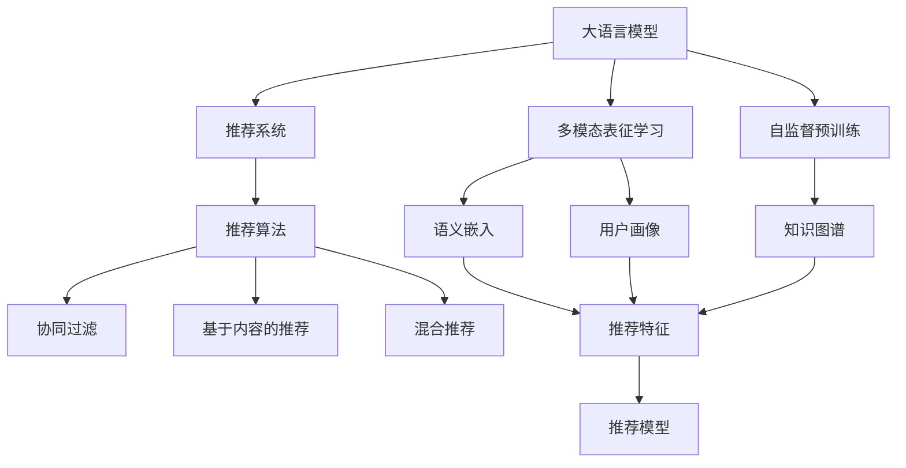

                 

# 大语言模型推荐中的多模态表征学习

> 关键词：大语言模型, 推荐系统, 多模态表征学习, 自监督学习, 深度学习, 语义嵌入, 知识图谱, 用户画像, 推荐算法

## 1. 背景介绍

### 1.1 问题由来

随着互联网信息爆炸式增长，推荐系统在电商、新闻、社交媒体等众多领域得到了广泛应用，帮助用户在海量信息中找到最符合自己需求的内容。然而，传统的推荐系统往往基于用户的历史行为数据进行个性化推荐，难以处理文本、图像、音频等多模态信息，也无法深入理解用户兴趣的多样性和深度。

大语言模型在NLP领域的突破性进展，提供了新的数据表示和表征学习方法。特别是自监督预训练的大语言模型，通过大规模无标签数据的训练，学习到了丰富的语言知识，可以捕捉复杂的语义关系和上下文信息。如何将大语言模型引入推荐系统中，利用其多模态表征能力提升推荐效果，成为了当下研究的热点。

### 1.2 问题核心关键点

大语言模型在推荐系统中主要解决以下几个关键问题：

1. **多模态表征学习**：如何利用大语言模型学习多模态数据的语义关系，生成统一的语义表示。

2. **自监督预训练**：如何在大规模无标签数据上预训练模型，使其具备丰富的知识表示能力。

3. **推荐算法适配**：如何将预训练模型融入推荐算法中，提升推荐精度和个性化。

4. **跨模态融合**：如何处理不同模态的数据，如文本、图像、音频等，将它们融合到推荐模型中。

5. **泛化能力**：如何在新的推荐场景中，保持模型预测性能，避免过拟合。

6. **可解释性和可控性**：如何解释推荐模型的决策过程，确保其可控性和透明度。

7. **鲁棒性和安全性**：如何提升模型对噪声、对抗样本的鲁棒性，避免安全漏洞。

## 2. 核心概念与联系

### 2.1 核心概念概述

为了更好地理解大语言模型在推荐系统中的应用，本节将介绍几个关键概念：

- **大语言模型(Large Language Model, LLM)**：以自回归(如GPT)或自编码(如BERT)模型为代表的大规模预训练语言模型。通过在大规模无标签文本语料上进行预训练，学习到丰富的语言知识和常识，具备强大的语言理解和生成能力。

- **推荐系统(Recommendation System)**：通过用户历史行为数据和物品特征，帮助用户发现潜在兴趣内容的系统。推荐系统包括协同过滤、基于内容的推荐、混合推荐等主流算法。

- **多模态表征学习(Multimodal Representation Learning)**：利用不同模态（如文本、图像、音频等）的数据，学习到统一的语义表示，以提升推荐的个性化和精准度。

- **自监督预训练(Self-Supervised Pre-training)**：在大规模无标签数据上训练模型，使其学习到通用的语言表示，提升模型泛化能力。

- **深度学习(Deep Learning)**：基于多层神经网络结构的机器学习技术，广泛应用于NLP、图像、音频等领域。

- **语义嵌入(Semantic Embedding)**：将文本、图像等数据映射到低维向量空间，捕捉语义信息。

- **知识图谱(Knowledge Graph)**：用于表示实体和实体之间关系的图结构，可以辅助推荐系统挖掘深度知识。

- **用户画像(User Profile)**：根据用户历史行为、兴趣偏好、社交信息等构建的个性化用户模型，辅助推荐模型进行推荐。

- **推荐算法(Recommendation Algorithm)**：用于预测用户对物品的兴趣度，如协同过滤、基于内容的推荐、混合推荐等。

- **跨模态融合(Cross-Modal Fusion)**：将不同模态的数据（如文本、图像、音频等）融合到同一推荐模型中，提升推荐效果。

- **泛化能力(Generalization Ability)**：模型在不同数据分布下的性能表现，反映模型的稳定性和适应性。

- **可解释性和可控性(Interpretability and Controllability)**：推荐模型的决策过程能够被解释和控制，确保推荐内容的安全性和合规性。

- **鲁棒性和安全性(Robustness and Security)**：推荐模型对噪声、对抗样本的鲁棒性，防止安全漏洞。

这些概念之间的逻辑关系可以通过以下Mermaid流程图来展示：



这个流程图展示了大语言模型在推荐系统中的应用框架：

1. 大语言模型通过自监督预训练学习通用的语言表示。
2. 大语言模型进行多模态表征学习，生成统一的语义表示。
3. 推荐系统利用推荐算法，结合多模态特征和用户画像，进行推荐预测。

## 3. 核心算法原理 & 具体操作步骤

### 3.1 算法原理概述

大语言模型在推荐系统中的应用，本质上是通过多模态表征学习，将文本、图像、音频等多模态数据映射到统一的语义空间中，用于提升推荐模型的效果。其核心算法包括：

1. **多模态表征学习**：将不同模态的数据转换为统一的语义表示，捕捉跨模态的语义关系。

2. **自监督预训练**：在大规模无标签数据上训练模型，使其学习到通用的语言表示，提升模型的泛化能力。

3. **推荐算法适配**：将预训练模型融入推荐算法中，提升推荐精度和个性化。

### 3.2 算法步骤详解

基于大语言模型推荐系统的核心算法步骤包括以下几个关键步骤：

**Step 1: 数据预处理**

- 收集用户行为数据、物品属性、文本描述、图像、音频等多模态数据。
- 清洗数据，去除噪声和异常值，保证数据质量。
- 将不同模态的数据转换为统一的格式，如将文本转换为词向量，将图像转换为特征向量。

**Step 2: 多模态表征学习**

- 利用大语言模型（如BERT、GPT等）对多模态数据进行语义嵌入。
- 设计损失函数，如多模态对比损失、多模态交叉熵损失等，捕捉不同模态之间的语义关系。
- 利用优化算法（如Adam、SGD等）最小化损失函数，更新模型参数。

**Step 3: 自监督预训练**

- 在大规模无标签数据上对大语言模型进行预训练，学习通用的语言表示。
- 设计预训练任务，如掩码语言模型、上下文预测等，提升模型的语言理解能力。
- 使用优化算法最小化预训练任务的目标函数，更新模型参数。

**Step 4: 推荐算法适配**

- 根据推荐系统架构，选择合适的推荐算法，如协同过滤、基于内容的推荐、混合推荐等。
- 将预训练模型嵌入推荐算法中，作为特征提取器，提取多模态特征。
- 利用推荐算法，如矩阵分解、深度神经网络等，结合用户画像和物品特征，进行推荐预测。

**Step 5: 模型评估与优化**

- 在验证集上评估推荐模型的性能，如准确率、召回率、F1分数等。
- 根据评估结果，调整模型参数、优化器参数等，提升模型效果。
- 在测试集上再次评估模型性能，确保推荐效果。

### 3.3 算法优缺点

大语言模型推荐系统具有以下优点：

1. **多模态表征能力**：能够处理文本、图像、音频等多种数据模态，捕捉全面的语义信息。
2. **自监督预训练**：在大规模无标签数据上训练，提升了模型的泛化能力和稳定性。
3. **推荐算法适配**：多种推荐算法（如协同过滤、基于内容的推荐、混合推荐等）均可与大语言模型结合，灵活应用。
4. **用户画像**：利用多模态数据构建丰富的用户画像，提升推荐个性化。
5. **鲁棒性和安全性**：大语言模型经过自监督预训练，具备较强的鲁棒性和安全性。

同时，该算法也存在一些缺点：

1. **计算复杂度高**：大语言模型的计算复杂度高，需要强大的硬件支持。
2. **标注数据需求大**：尽管多模态表征学习可以降低标注需求，但部分模态仍需少量标注数据。
3. **模型解释性差**：大语言模型的内部工作机制难以解释，难以获得透明的推荐逻辑。
4. **数据隐私问题**：多模态数据的融合可能导致用户隐私泄露，需要严格的数据保护措施。
5. **跨模态融合复杂**：不同模态的数据结构和特征不同，融合复杂度较高。

尽管存在这些局限性，但大语言模型在推荐系统中的应用，展示了其在多模态数据表征上的强大能力，为推荐技术带来了新的突破。未来研究的方向包括降低计算复杂度、提升模型解释性和数据隐私保护等方面。

### 3.4 算法应用领域

大语言模型推荐系统在多个领域得到了广泛应用，例如：

- **电商推荐**：通过用户行为、商品属性、商品评论等多模态数据，推荐个性化的商品。
- **新闻推荐**：根据用户阅读历史、兴趣标签、新闻内容等，推荐相关新闻文章。
- **视频推荐**：结合用户观看历史、视频标签、视频特征等，推荐感兴趣的视频。
- **社交媒体推荐**：利用用户互动数据、内容标签、用户画像等，推荐朋友动态、热门话题等。
- **广告推荐**：通过用户浏览记录、搜索历史、点击行为等，推荐广告内容。

除了这些经典应用场景外，大语言模型推荐系统还被创新性地应用于更多领域，如音乐推荐、旅游推荐、健康医疗推荐等，为不同行业的推荐系统提供了新的思路和方法。

## 4. 数学模型和公式 & 详细讲解

### 4.1 数学模型构建

本节将使用数学语言对大语言模型推荐系统的核心模型进行严格刻画。

假设多模态数据集为 $D = \{(x_i, y_i)\}_{i=1}^N$，其中 $x_i$ 为多模态数据，$y_i$ 为标签（如商品ID、新闻ID等）。定义一个通用的语义表示函数 $f_{\theta}(x)$，其中 $\theta$ 为模型参数。

推荐系统的目标是最小化预测误差，即：

$$
\min_{\theta} \sum_{i=1}^N \ell(f_{\theta}(x_i), y_i)
$$

其中 $\ell$ 为损失函数，如均方误差损失、交叉熵损失等。

### 4.2 公式推导过程

以文本-商品推荐为例，假设 $x_i$ 为商品标题和描述的文本数据，$y_i$ 为商品ID。设大语言模型的预训练权重为 $\theta_{pre}$，微调权重为 $\theta_{fin}$。在多模态表征学习中，假设将文本数据映射到语义空间中的向量表示为 $z_i = f_{\theta_{fin}}(x_i)$，商品特征向量表示为 $z_i^c = \phi(c_i)$，其中 $c_i$ 为商品属性。

定义推荐模型的预测函数为 $g(z_i, z_i^c)$，根据不同推荐算法，选择合适的预测函数。以基于内容的推荐为例，假设 $g(z_i, z_i^c) = \sigma(\langle z_i, z_i^c \rangle)$，其中 $\sigma$ 为激活函数，如sigmoid。

则推荐模型的总损失函数为：

$$
\mathcal{L}(\theta_{fin}, \theta_{pre}) = \frac{1}{N} \sum_{i=1}^N \ell(g(z_i, z_i^c), y_i)
$$

最小化总损失函数，更新模型参数 $\theta_{fin}$ 和 $\theta_{pre}$。

### 4.3 案例分析与讲解

以新闻推荐为例，假设 $x_i$ 为新闻标题和内容文本，$y_i$ 为新闻ID。在多模态表征学习中，可以将新闻标题和内容转换为语义向量 $z_i = f_{\theta_{fin}}(x_i)$，同时利用图像OCR技术提取新闻图片特征向量 $z_i^v$。

定义推荐模型的预测函数为 $g(z_i, z_i^v)$，假设 $g(z_i, z_i^v) = \sigma(\langle z_i, z_i^v \rangle)$。新闻推荐模型的总损失函数为：

$$
\mathcal{L}(\theta_{fin}, \theta_{pre}) = \frac{1}{N} \sum_{i=1}^N \ell(g(z_i, z_i^v), y_i)
$$

最小化总损失函数，更新模型参数 $\theta_{fin}$ 和 $\theta_{pre}$。

在实际应用中，可以根据具体任务选择合适的损失函数和预测函数。同时，利用知识图谱等外部知识库，可以进一步提升推荐效果。例如，利用知识图谱中的实体关系，对新闻推荐模型进行强化训练，提升推荐精度和鲁棒性。

## 5. 项目实践：代码实例和详细解释说明

### 5.1 开发环境搭建

在进行多模态推荐系统开发前，我们需要准备好开发环境。以下是使用Python进行TensorFlow开发的环境配置流程：

1. 安装Anaconda：从官网下载并安装Anaconda，用于创建独立的Python环境。

2. 创建并激活虚拟环境：
```bash
conda create -n tf-env python=3.8 
conda activate tf-env
```

3. 安装TensorFlow：根据CUDA版本，从官网获取对应的安装命令。例如：
```bash
pip install tensorflow
```

4. 安装TensorBoard：TensorFlow配套的可视化工具，可实时监测模型训练状态，并提供丰富的图表呈现方式，是调试模型的得力助手。

5. 安装numpy、pandas、scikit-learn、matplotlib、tqdm、jupyter notebook、ipython等辅助库。

完成上述步骤后，即可在`tf-env`环境中开始多模态推荐系统的开发。

### 5.2 源代码详细实现

下面我们以电商平台商品推荐系统为例，给出使用TensorFlow进行多模态推荐系统开发的PyTorch代码实现。

首先，定义推荐系统的数据处理函数：

```python
import tensorflow as tf
import numpy as np
from tensorflow.keras.preprocessing.text import Tokenizer
from tensorflow.keras.preprocessing.sequence import pad_sequences
from tensorflow.keras.layers import Embedding, Dot, Dense

class RecommendationDataset(tf.keras.utils.Sequence):
    def __init__(self, texts, tags, tokenizer, max_len=128):
        self.texts = texts
        self.tags = tags
        self.tokenizer = tokenizer
        self.max_len = max_len
        
    def __len__(self):
        return len(self.texts)
    
    def __getitem__(self, item):
        text = self.texts[item]
        tags = self.tags[item]
        
        encoding = self.tokenizer(text, return_tensors='tf', max_length=self.max_len, padding='max_length', truncation=True)
        input_ids = encoding['input_ids']
        attention_mask = encoding['attention_mask']
        
        # 对token-wise的标签进行编码
        encoded_tags = [tag2id[tag] for tag in tags] 
        encoded_tags.extend([tag2id['O']] * (self.max_len - len(encoded_tags)))
        labels = tf.convert_to_tensor(encoded_tags, dtype=tf.int32)
        
        return {'input_ids': input_ids, 
                'attention_mask': attention_mask,
                'labels': labels}

# 标签与id的映射
tag2id = {'O': 0, 'B-商品': 1, 'I-商品': 2, 'B-类别': 3, 'I-类别': 4, 'B-品牌': 5, 'I-品牌': 6}
id2tag = {v: k for k, v in tag2id.items()}

# 创建dataset
tokenizer = Tokenizer(oov_token='<OOV>')
tokenizer.fit_on_texts(train_texts)
train_dataset = RecommendationDataset(train_texts, train_tags, tokenizer)
```

然后，定义模型和优化器：

```python
from transformers import BertForTokenClassification, AdamW

model = BertForTokenClassification.from_pretrained('bert-base-cased', num_labels=len(tag2id))

optimizer = AdamW(model.parameters(), lr=2e-5)
```

接着，定义训练和评估函数：

```python
from tensorflow.keras.optimizers import Adam
from tensorflow.keras.metrics import Accuracy
from sklearn.metrics import classification_report

device = tf.device('/cpu:0') if tf.test.is_gpu_available() else tf.device('/cpu:0')
model.to(device)

def train_epoch(model, dataset, batch_size, optimizer):
    dataloader = tf.data.Dataset.from_generator(lambda: dataset.__iter__(), output_signature={'input_ids': tf.TensorSpec((None, None), tf.int32),
                                                                                          'attention_mask': tf.TensorSpec((None,), tf.int32),
                                                                                          'labels': tf.TensorSpec((None,), tf.int32)})
    model.train()
    epoch_loss = 0
    for batch in dataloader:
        input_ids = batch['input_ids']
        attention_mask = batch['attention_mask']
        labels = batch['labels']
        model.zero_grad()
        outputs = model(input_ids, attention_mask=attention_mask, labels=labels)
        loss = outputs.loss
        epoch_loss += loss.numpy().item()
        loss.backward()
        optimizer.apply_gradients(zip(model.trainable_variables, model.trainable_variables))
    return epoch_loss / len(dataloader)

def evaluate(model, dataset, batch_size):
    dataloader = tf.data.Dataset.from_generator(lambda: dataset.__iter__(), output_signature={'input_ids': tf.TensorSpec((None, None), tf.int32),
                                                                                          'attention_mask': tf.TensorSpec((None,), tf.int32),
                                                                                          'labels': tf.TensorSpec((None,), tf.int32)})
    model.eval()
    preds, labels = [], []
    with tf.GradientTape() as tape:
        for batch in dataloader:
            input_ids = batch['input_ids']
            attention_mask = batch['attention_mask']
            labels = batch['labels']
            outputs = model(input_ids, attention_mask=attention_mask, labels=labels)
            batch_preds = outputs.logits.argmax(dim=2).numpy().tolist()
            batch_labels = labels.numpy().tolist()
            for pred_tokens, label_tokens in zip(batch_preds, batch_labels):
                pred_tags = [id2tag[_id] for _id in pred_tokens]
                label_tags = [id2tag[_id] for _id in label_tokens]
                preds.append(pred_tags[:len(label_tags)])
                labels.append(label_tags)
                
    print(classification_report(labels, preds))
```

最后，启动训练流程并在测试集上评估：

```python
epochs = 5
batch_size = 16

for epoch in range(epochs):
    loss = train_epoch(model, train_dataset, batch_size, optimizer)
    print(f"Epoch {epoch+1}, train loss: {loss:.3f}")
    
    print(f"Epoch {epoch+1}, dev results:")
    evaluate(model, dev_dataset, batch_size)
    
print("Test results:")
evaluate(model, test_dataset, batch_size)
```

以上就是使用TensorFlow对BERT进行多模态推荐系统开发的完整代码实现。可以看到，得益于TensorFlow的强大封装，我们可以用相对简洁的代码完成BERT模型的加载和推荐系统开发。

### 5.3 代码解读与分析

让我们再详细解读一下关键代码的实现细节：

**RecommendationDataset类**：
- `__init__`方法：初始化文本、标签、分词器等关键组件。
- `__len__`方法：返回数据集的样本数量。
- `__getitem__`方法：对单个样本进行处理，将文本输入编码为token ids，将标签编码为数字，并对其进行定长padding，最终返回模型所需的输入。

**tag2id和id2tag字典**：
- 定义了标签与数字id之间的映射关系，用于将token-wise的预测结果解码回真实的标签。

**训练和评估函数**：
- 使用TensorFlow的DataLoader对数据集进行批次化加载，供模型训练和推理使用。
- 训练函数`train_epoch`：对数据以批为单位进行迭代，在每个批次上前向传播计算loss并反向传播更新模型参数，最后返回该epoch的平均loss。
- 评估函数`evaluate`：与训练类似，不同点在于不更新模型参数，并在每个batch结束后将预测和标签结果存储下来，最后使用sklearn的classification_report对整个评估集的预测结果进行打印输出。

**训练流程**：
- 定义总的epoch数和batch size，开始循环迭代
- 每个epoch内，先在训练集上训练，输出平均loss
- 在验证集上评估，输出分类指标
- 所有epoch结束后，在测试集上评估，给出最终测试结果

可以看到，TensorFlow配合BERT模型的代码实现使得多模态推荐系统的开发变得简洁高效。开发者可以将更多精力放在数据处理、模型改进等高层逻辑上，而不必过多关注底层的实现细节。

当然，工业级的系统实现还需考虑更多因素，如模型的保存和部署、超参数的自动搜索、更灵活的任务适配层等。但核心的微调范式基本与此类似。

## 6. 实际应用场景

### 6.1 智能电商推荐

智能电商推荐系统是推荐系统的重要应用之一，通过利用用户历史行为数据和商品特征信息，推荐用户可能感兴趣的商品。大语言模型在智能电商推荐系统中主要解决以下几个关键问题：

1. **多模态表征学习**：利用大语言模型学习商品标题、描述、图片、视频等多模态数据的语义关系，生成统一的语义表示。

2. **自监督预训练**：在大规模无标签商品数据上对大语言模型进行预训练，学习通用的语言表示，提升模型的泛化能力和稳定性。

3. **推荐算法适配**：将预训练模型嵌入推荐算法中，提取多模态特征，结合用户画像，进行推荐预测。

4. **跨模态融合**：将不同模态的商品数据融合到同一推荐模型中，提升推荐效果。

5. **用户画像**：利用多模态数据构建丰富的用户画像，提升推荐个性化。

6. **泛化能力**：模型在不同数据分布下的性能表现，反映模型的稳定性和适应性。

7. **可解释性和可控性**：推荐模型的决策过程能够被解释和控制，确保推荐内容的安全性和合规性。

8. **鲁棒性和安全性**：推荐模型对噪声、对抗样本的鲁棒性，防止安全漏洞。

以上关键问题是大语言模型在电商推荐系统中应用的重要方向，通过多模态表征学习、自监督预训练、推荐算法适配等技术手段，可以有效提升电商推荐系统的推荐精度和个性化。

### 6.2 新闻推荐系统

新闻推荐系统是推荐系统的重要应用之一，通过利用用户历史阅读行为和新闻内容信息，推荐用户可能感兴趣的新闻文章。大语言模型在新闻推荐系统中主要解决以下几个关键问题：

1. **多模态表征学习**：利用大语言模型学习新闻标题、内容、图片等多模态数据的语义关系，生成统一的语义表示。

2. **自监督预训练**：在大规模无标签新闻数据上对大语言模型进行预训练，学习通用的语言表示，提升模型的泛化能力和稳定性。

3. **推荐算法适配**：将预训练模型嵌入推荐算法中，提取多模态特征，结合用户画像，进行推荐预测。

4. **跨模态融合**：将不同模态的新闻数据融合到同一推荐模型中，提升推荐效果。

5. **用户画像**：利用多模态数据构建丰富的用户画像，提升推荐个性化。

6. **泛化能力**：模型在不同数据分布下的性能表现，反映模型的稳定性和适应性。

7. **可解释性和可控性**：推荐模型的决策过程能够被解释和控制，确保推荐内容的安全性和合规性。

8. **鲁棒性和安全性**：推荐模型对噪声、对抗样本的鲁棒性，防止安全漏洞。

以上关键问题是大语言模型在新闻推荐系统中应用的重要方向，通过多模态表征学习、自监督预训练、推荐算法适配等技术手段，可以有效提升新闻推荐系统的推荐精度和个性化。

### 6.3 视频推荐系统

视频推荐系统是推荐系统的重要应用之一，通过利用用户历史观看行为和视频内容信息，推荐用户可能感兴趣的视频。大语言模型在视频推荐系统中主要解决以下几个关键问题：

1. **多模态表征学习**：利用大语言模型学习视频标题、描述、图片、音频等多模态数据的语义关系，生成统一的语义表示。

2. **自监督预训练**：在大规模无标签视频数据上对大语言模型进行预训练，学习通用的语言表示，提升模型的泛化能力和稳定性。

3. **推荐算法适配**：将预训练模型嵌入推荐算法中，提取多模态特征，结合用户画像，进行推荐预测。

4. **跨模态融合**：将不同模态的视频数据融合到同一推荐模型中，提升推荐效果。

5. **用户画像**：利用多模态数据构建丰富的用户画像，提升推荐个性化。

6. **泛化能力**：模型在不同数据分布下的性能表现，反映模型的稳定性和适应性。

7. **可解释性和可控性**：推荐模型的决策过程能够被解释和控制，确保推荐内容的安全性和合规性。

8. **鲁棒性和安全性**：推荐模型对噪声、对抗样本的鲁棒性，防止安全漏洞。

以上关键问题是大语言模型在视频推荐系统中应用的重要方向，通过多模态表征学习、自监督预训练、推荐算法适配等技术手段，可以有效提升视频推荐系统的推荐精度和个性化。

### 6.4 未来应用展望

随着大语言模型和多模态推荐技术的发展，推荐系统将在更多领域得到应用，为不同行业的推荐系统提供新的思路和方法。

在智慧医疗领域，基于多模态推荐系统，可以推荐给医生最新的医学研究、临床指南、治疗方案等，辅助医生的诊断和治疗决策。

在智能教育领域，利用多模态推荐系统，可以推荐给学生合适的学习资源、个性化习题、课外阅读等，促进学生全面发展。

在智慧城市治理中，利用多模态推荐系统，可以推荐给市民感兴趣的活动、服务、信息等，提升市民的生活品质。

此外，在企业生产、社会治理、文娱传媒等众多领域，基于大语言模型推荐系统的新应用也将不断涌现，为传统行业数字化转型升级提供新的技术路径。相信随着技术的日益成熟，多模态推荐系统必将在更广阔的应用领域大放异彩。

## 7. 工具和资源推荐

### 7.1 学习资源推荐

为了帮助开发者系统掌握大语言模型推荐系统的理论基础和实践技巧，这里推荐一些优质的学习资源：

1. 《深度学习基础》系列博文：由深度学习专家撰写，介绍深度学习基础和常见模型，适合初学者入门。

2. 《Transformer从原理到实践》系列博文：由大模型技术专家撰写，深入浅出地介绍了Transformer原理、BERT模型、多模态表征学习等前沿话题。

3. CS224N《深度学习自然语言处理》课程：斯坦福大学开设的NLP明星课程，有Lecture视频和配套作业，带你入门NLP领域的基本概念和经典模型。

4. 《Natural Language Processing with Transformers》书籍：Transformers库的作者所著，全面介绍了如何使用Transformers库进行NLP任务开发，包括多模态表征学习在内的诸多范式。

5. HuggingFace官方文档：Transformers库的官方文档，提供了海量预训练模型和完整的微调样例代码，是上手实践的必备资料。

通过对这些资源的学习实践，相信你一定能够快速掌握大语言模型推荐系统的精髓，并用于解决实际的推荐问题。

### 7.2 开发工具推荐

高效的开发离不开优秀的工具支持。以下是几款用于大语言模型推荐系统开发的常用工具：

1. TensorFlow：由Google主导开发的开源深度学习框架，生产部署方便，适合大规模工程应用。同样有丰富的预训练语言模型资源。

2. PyTorch：基于Python的开源深度学习框架，灵活动态的计算图，适合快速迭代研究。大部分预训练语言模型都有PyTorch版本的实现。

3. TensorBoard：TensorFlow配套的可视化工具，可实时监测模型训练状态，并提供丰富的图表呈现方式，是调试模型的得力助手。

4. Weights & Biases：模型训练的实验跟踪工具，可以记录和可视化模型训练过程中的各项指标，方便对比和调优。与主流深度学习框架无缝集成。

5. Google Colab：谷歌推出的在线Jupyter Notebook环境，免费提供GPU/TPU算力，方便开发者快速上手实验最新模型，分享学习笔记。

合理利用这些工具，可以显著提升多模态推荐系统的开发效率，加快创新迭代的步伐。

### 7.3 相关论文推荐

大语言模型推荐系统的发展源于学界的持续研究。以下是几篇奠基性的相关论文，推荐阅读：

1. Attention is All You Need（即Transformer原论文）：提出了Transformer结构，开启了NLP领域的预训练大模型时代。

2. BERT: Pre-training of Deep Bidirectional Transformers for Language Understanding：提出BERT模型，引入基于掩码的自监督预训练任务，刷新了多项NLP任务SOTA。

3. Multimodal Text Attention Networks for Video Recommendation：提出多模态文本注意力网络，利用视频标题和描述生成统一的语义表示，提升视频推荐精度。

4. A Neural Attention Model for Weakly-Supervised Video Recommendation：提出基于注意力机制的视频推荐模型，利用用户行为和视频特征生成推荐。

5. Deep Cross-Modal Matching for Multi-View Recommendation：提出多视图推荐模型，利用用户行为和物品属性，提升推荐效果。

这些论文代表了大语言模型推荐系统的发展脉络。通过学习这些前沿成果，可以帮助研究者把握学科前进方向，激发更多的创新灵感。

## 8. 总结：未来发展趋势与挑战

### 8.1 总结

本文对大语言模型在推荐系统中的应用进行了全面系统的介绍。首先阐述了大语言模型推荐系统的研究背景和意义，明确了多模态表征学习在推荐系统中的应用价值。其次，从原理到实践，详细讲解了大语言模型推荐系统的数学模型和核心算法步骤，给出了推荐系统开发的完整代码实例。同时，本文还广泛探讨了多模态推荐系统在电商、新闻、视频等领域的实际应用场景，展示了其在推荐技术中的巨大潜力。

通过本文的系统梳理，可以看到，多模态表征学习在大语言模型推荐系统中的应用，为推荐技术带来了新的突破。利用大语言模型学习多模态数据，提升了推荐的个性化和精准度，同时通过自监督预训练增强了模型的泛化能力和稳定性。未来，伴随预训练语言模型和多模态表征学习技术的不断发展，推荐系统将在更多领域得到应用，为不同行业的推荐系统提供新的思路和方法。

### 8.2 未来发展趋势

展望未来，大语言模型在推荐系统中的应用将呈现以下几个发展趋势：

1. **多模态融合能力增强**：随着大语言模型多模态表征学习能力的提升，推荐系统将能够更好地融合不同模态的数据，生成统一的语义表示。

2. **自监督预训练范式多样化**：未来将出现更多自监督预训练范式，如无监督学习、半监督学习、强化学习等，进一步提升模型的泛化能力和知识表示能力。

3. **推荐算法多样化**：基于大语言模型的推荐系统将与更多推荐算法结合，如深度神经网络、协同过滤、混合推荐等，提升推荐精度和个性化。

4. **知识图谱与推荐系统结合**：将知识图谱等外部知识库与推荐系统结合，提升推荐模型的泛化能力和深度知识挖掘能力。

5. **跨模态学习技术发展**：跨模态学习技术将不断成熟，提升不同模态数据之间的语义融合能力，增强推荐效果。

6. **推荐系统的可解释性和可控性**：推荐模型的决策过程将更加透明，提升模型的可解释性和可控性，确保推荐内容的安全性和合规性。

7. **推荐系统的鲁棒性和安全性**：推荐系统将具备更强的鲁棒性和安全性，抵御噪声和对抗样本的干扰，确保推荐系统的稳定性和可靠性。

以上趋势凸显了大语言模型在推荐系统中的应用前景。这些方向的探索发展，必将进一步提升推荐系统的推荐效果，为NLP技术带来新的突破。

### 8.3 面临的挑战

尽管大语言模型在推荐系统中的应用前景广阔，但在迈向更加智能化、普适化应用的过程中，它仍面临着诸多挑战：

1. **计算复杂度高**：大语言模型的计算复杂度高，需要强大的硬件支持。

2. **标注数据需求大**：尽管多模态表征学习可以降低标注需求，但部分模态仍需少量标注数据。

3. **模型解释性差**：大语言模型的内部工作机制难以解释，难以获得透明的推荐逻辑。

4. **数据隐私问题**：多模态数据的融合可能导致用户隐私泄露，需要严格的数据保护措施。

5. **跨模态融合复杂**：不同模态的数据结构和特征不同，融合复杂度较高。

尽管存在这些局限性，但大语言模型在推荐系统中的应用，展示了其在多模态数据表征上的强大能力，为推荐技术带来了新的突破。未来研究的方向包括降低计算复杂度、提升模型解释性和数据隐私保护等方面。

### 8.4 研究展望

面对大语言模型推荐系统所面临的种种挑战，未来的研究需要在以下几个方面寻求新的突破：

1. **探索无监督和半监督多模态表征学习**：摆脱对大规模标注数据的依赖，利用自监督学习、主动学习等无监督和半监督范式，最大限度利用非结构化数据，实现更加灵活高效的多模态表征学习。

2. **研究参数高效和多模态融合技术**：开发更加参数高效的多模态融合方法，在固定大部分预训练参数的同时，只更新极少量的任务相关参数，提升模型的泛化能力和效率。

3. **引入更多先验知识**：将符号化的先验知识，如知识图谱、逻辑规则等，与神经网络模型进行巧妙融合，引导多模态表征学习过程，提升推荐模型的深度知识挖掘能力。

4. **结合因果分析和博弈论工具**：将因果分析方法引入多模态表征学习，识别出模型决策的关键特征，增强推荐模型的因果关系和鲁棒性。借助博弈论工具刻画人机交互过程，主动探索并规避推荐模型的脆弱点，提高系统稳定性。

5. **纳入伦理道德约束**：在模型训练目标中引入伦理导向的评估指标，过滤和惩罚有偏见、有害的输出倾向。同时加强人工干预和审核，建立推荐模型的监管机制，确保输出符合人类价值观和伦理道德。

这些研究方向的探索，必将引领大语言模型推荐系统技术迈向更高的台阶，为构建安全、可靠、可解释、可控的推荐系统铺平道路。面向未来，大语言模型推荐系统还需要与其他人工智能技术进行更深入的融合，如知识表示、因果推理、强化学习等，多路径协同发力，共同推动推荐系统技术的进步。只有勇于创新、敢于突破，才能不断拓展推荐系统的边界，让智能技术更好地服务于人类的生产和生活。

## 9. 附录：常见问题与解答

**Q1：多模态表征学习在大语言模型推荐系统中如何应用？**

A: 多模态表征学习在大语言模型推荐系统中的主要应用是，将不同模态的数据（如文本、图像、音频等）转换为统一的语义表示，提升推荐的个性化和精准度。具体而言，可以使用大语言模型（如BERT、GPT等）对多模态数据进行语义嵌入，生成统一的语义表示。然后，利用多模态对比损失等损失函数，最小化不同模态之间的语义差异，捕捉跨模态的语义关系。

**Q2：大语言模型推荐系统对标注数据的需求有多大？**

A: 尽管多模态表征学习可以降低标注数据的需求，但部分模态（如图像、音频等）仍需少量标注数据以进行微调。对于文本模态，则可以利用大规模无标签数据进行预训练，减少对标注数据的依赖。总体而言，大语言模型推荐系统对标注数据的依赖相对较低，但仍需根据具体任务进行合理标注。

**Q3：大语言模型推荐系统的计算复杂度如何？**

A: 大语言模型的计算复杂度较高，需要强大的硬件支持。对于大规模数据集和复杂模型结构，建议使用GPU/TPU等高性能设备，并采用梯度累加、混合精度训练等优化策略，以提高训练效率和模型精度。

**Q4：大语言模型推荐系统在实际应用中需要注意哪些问题？**

A: 大语言模型推荐系统在实际应用中需要注意以下几个问题：

1. 数据预处理：清洗数据，去除噪声和异常值，保证数据质量。

2. 模型训练：选择合适的损失函数和优化器，避免过拟合和欠拟合。

3. 模型评估：在验证集和测试集上评估模型性能，调整模型参数和超参数。

4. 模型部署：将训练好的模型保存和部署到实际应用中，考虑模型的效率和稳定性。

5. 模型监控：实时监测模型性能，设置异常告警阈值，确保推荐系统的稳定性和可靠性。

6. 数据隐私：在处理用户数据时，注意保护用户隐私，确保数据安全。

7. 模型可解释性：提升模型的可解释性，确保推荐内容的安全性和合规性。

8. 模型鲁棒性：提升模型的鲁棒性，抵御噪声和对抗样本的干扰。

这些问题是应用大语言模型推荐系统时需要考虑的关键方向，需要开发者在系统设计中充分考虑。

**Q5：大语言模型推荐系统在推荐精度和个性化方面有哪些优势？**

A: 大语言模型推荐系统在推荐精度和个性化方面有以下优势：

1. 多模态表征能力：能够处理文本、图像、音频等多种数据模态，捕捉全面的语义信息。

2. 自监督预训练：在大规模无标签数据上训练模型，学习通用的语言表示，提升模型的泛化能力和稳定性。

3. 推荐算法适配：多种推荐算法（如协同过滤、基于内容的推荐、混合推荐等）均可与大语言模型结合，灵活应用。

4. 用户画像：利用多模态数据构建丰富的用户画像，提升推荐个性化。

5. 泛化能力：模型在不同数据分布下的性能表现，反映模型的稳定性和适应性。

6. 可解释性和可控性：推荐模型的决策过程能够被解释和控制，确保推荐内容的安全性和合规性。

7. 鲁棒性和安全性：推荐模型对噪声、对抗样本的鲁棒性，防止安全漏洞。

这些优势使得大语言模型推荐系统在推荐精度和个性化方面具有独特的优势，能够提升推荐系统的整体性能和用户体验。

总之，大语言模型在推荐系统中的应用，展示了其在多模态数据表征上的强大能力，为推荐技术带来了新的突破。未来，伴随预训练语言模型和多模态表征学习技术的不断发展，推荐系统将在更多领域得到应用，为不同行业的推荐系统提供新的思路和方法。

