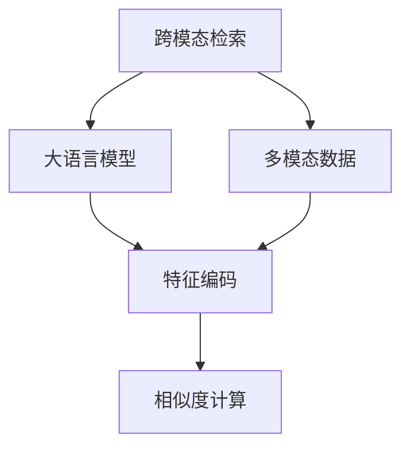

                 

# LLM推荐中的跨模态检索技术

> 关键词：跨模态检索,大语言模型,推荐系统,多模态,深度学习,模型融合

## 1. 背景介绍

### 1.1 问题由来
推荐系统已经逐渐成为用户在互联网上的“智能向导”，帮助用户发现他们可能感兴趣的内容。然而，目前的推荐系统往往仅依赖于文本信息，忽略了图像、音频等模态数据。为了提升推荐系统的表现，研究者开始探索将多模态数据融合到推荐系统中，从而构建更全面、精确的推荐模型。

跨模态检索（Cross-Modal Retrieval）技术在这个背景下应运而生。跨模态检索技术通过整合不同模态（如文本、图像、音频等）的数据，构建多模态融合的检索模型，帮助推荐系统更好地理解用户需求，提升推荐质量。

### 1.2 问题核心关键点
跨模态检索的核心在于如何有效地将不同模态的数据进行编码，并找到相似度最大的模态。具体而言，需要在以下两个方面取得进展：

1. 跨模态特征编码：将不同模态的数据编码为一个共享的向量空间，使得同质化信息可以被有效比较。
2. 相似度计算：计算不同模态间的相似度，找到与目标模态最匹配的模态，用于推荐或检索。

以上两个问题构成跨模态检索技术的研究核心，其解决程度决定了推荐系统在多模态数据融合上的能力。

## 2. 核心概念与联系

### 2.1 核心概念概述

为了更好地理解跨模态检索技术，首先需要梳理几个核心概念：

- **跨模态检索（Cross-Modal Retrieval）**：在多模态数据中检索与目标模态相似的其他模态数据，用于推荐、检索、分类等任务。

- **大语言模型（Large Language Model, LLM）**：指通过大规模预训练，具备强大语言理解和生成能力的语言模型，如BERT、GPT等。

- **多模态数据（Multi-Modal Data）**：指包含文本、图像、音频等多种信息模态的数据集。

- **特征编码（Feature Encoding）**：将不同模态的数据映射到共同的向量空间中，方便后续的相似度计算。

- **相似度计算（Similarity Computation）**：度量不同模态数据之间的相似度，通常使用余弦相似度、欧式距离等。

这些核心概念构成了跨模态检索技术的理论基础，它们之间的联系如下图所示：



从图中可以看出，跨模态检索技术的核心在于通过大语言模型进行特征编码和相似度计算，最终在多模态数据中找到与目标模态相似的数据。

## 3. 核心算法原理 & 具体操作步骤
### 3.1 算法原理概述

跨模态检索技术的核心算法原理主要包括特征编码和相似度计算两个部分。首先，通过大语言模型将不同模态的数据编码为共享的向量空间。然后，使用余弦相似度、欧式距离等方法计算不同模态间的相似度，找到与目标模态最匹配的模态，用于推荐或检索。

### 3.2 算法步骤详解

**Step 1: 数据预处理**
- 对多模态数据进行归一化、标准化等预处理步骤，以便于后续的模型编码。

**Step 2: 特征编码**
- 使用大语言模型（如BERT）将不同模态的数据编码为共享的向量空间。这一步需要使用跨模态嵌入技术，将多模态数据映射到相同的低维空间中。

**Step 3: 相似度计算**
- 计算不同模态间的相似度，通常使用余弦相似度、欧式距离等方法。找到与目标模态最匹配的模态。

**Step 4: 推荐或检索**
- 根据计算出的相似度，对目标模态进行推荐或检索。

### 3.3 算法优缺点

跨模态检索技术具有以下优点：

1. 提升推荐质量：通过融合多种模态的信息，推荐系统可以更好地理解用户需求，提升推荐效果。
2. 鲁棒性更强：多模态数据的引入，有助于应对单模态数据可能存在的噪声或缺失问题。
3. 提高用户体验：多模态数据的使用，可以提供更加丰富和多元的推荐内容，提升用户体验。

同时，该技术也存在一些局限性：

1. 数据多样性要求高：多模态数据的获取和处理成本较高，尤其是对于图像、音频等非结构化数据。
2. 计算复杂度高：跨模态检索技术需要处理多种模态数据，计算复杂度较高，需要较强大的计算资源支持。
3. 数据融合困难：不同模态数据之间的特征差异较大，难以找到有效的融合方式，导致融合后的特征表示效果不佳。

### 3.4 算法应用领域

跨模态检索技术已经在推荐系统、信息检索、多媒体内容推荐等多个领域得到了广泛应用，具体应用场景包括：

- 推荐系统：在电商平台、视频网站、音乐平台等场景下，通过融合文本、图像、音频等多种模态数据，提升推荐质量。
- 信息检索：在搜索引擎中，通过融合图像、视频等多媒体信息，提升检索的准确性和相关性。
- 多媒体内容推荐：在视频网站、音乐平台等场景下，通过融合视频内容、歌曲特征等信息，提升推荐效果。
- 社交网络：在社交媒体中，通过融合用户行为、兴趣等信息，推荐相关的社交内容。

## 4. 数学模型和公式 & 详细讲解 & 举例说明

### 4.1 数学模型构建

跨模态检索的数学模型主要包括特征编码模型和相似度计算模型。这里以余弦相似度为例，构建跨模态检索的数学模型。

假设文本数据为 $x$，图像数据为 $y$，音频数据为 $z$。使用大语言模型将这三种数据分别编码为向量 $x'$，$y'$，$z'$。然后，计算文本和图像、音频的余弦相似度：

$$
\cos(\theta) = \frac{x' \cdot y'}{\|x'\| \cdot \|y'\|}
$$

### 4.2 公式推导过程

根据上述公式，我们可以推导出跨模态检索的详细计算过程。

- **文本编码**：假设文本数据为 $x = \{x_i\}_{i=1}^n$，每个词 $x_i$ 的编码向量为 $v_i$，则文本数据的编码向量 $x'$ 为：

$$
x' = [v_1, v_2, ..., v_n]
$$

- **图像编码**：假设图像数据为 $y = \{y_1, y_2, ..., y_m\}$，每个像素 $y_i$ 的编码向量为 $w_i$，则图像数据的编码向量 $y'$ 为：

$$
y' = [w_1, w_2, ..., w_m]
$$

- **余弦相似度计算**：计算文本和图像数据的余弦相似度：

$$
\cos(\theta) = \frac{x' \cdot y'}{\|x'\| \cdot \|y'\|} = \frac{\sum_{i=1}^n \sum_{j=1}^m v_i \cdot w_j}{\sqrt{\sum_{i=1}^n v_i^2} \cdot \sqrt{\sum_{j=1}^m w_j^2}}
$$

### 4.3 案例分析与讲解

假设有一个电商平台，需要为用户推荐商品。该平台同时收集了用户的文本数据（如浏览记录）和图像数据（如商品图片）。使用跨模态检索技术，可以融合这两种模态的数据，提升推荐效果。

具体步骤如下：

- **数据预处理**：对用户的浏览记录和商品图片进行归一化、标准化等预处理步骤。
- **特征编码**：使用BERT模型对用户的浏览记录进行编码，生成文本向量 $x'$。同时，使用卷积神经网络（CNN）对商品图片进行编码，生成图像向量 $y'$。
- **相似度计算**：计算用户的浏览记录与商品图片的余弦相似度，找到最匹配的商品。
- **推荐生成**：根据计算出的相似度，向用户推荐相似的商品。

## 5. 项目实践：代码实例和详细解释说明
### 5.1 开发环境搭建

在进行跨模态检索项目实践前，需要先准备好开发环境。以下是使用Python进行TensorFlow开发的环境配置流程：

1. 安装Anaconda：从官网下载并安装Anaconda，用于创建独立的Python环境。

2. 创建并激活虚拟环境：
```bash
conda create -n tf-env python=3.8 
conda activate tf-env
```

3. 安装TensorFlow：根据CUDA版本，从官网获取对应的安装命令。例如：
```bash
conda install tensorflow tensorflow-gpu -c conda-forge -c pypi
```

4. 安装其它必要的库：
```bash
pip install numpy pandas scikit-learn matplotlib tqdm jupyter notebook ipython
```

完成上述步骤后，即可在`tf-env`环境中开始跨模态检索的开发。

### 5.2 源代码详细实现

这里我们以电商平台推荐系统的例子，给出使用TensorFlow对跨模态检索进行开发的代码实现。

首先，定义数据预处理函数：

```python
import tensorflow as tf
from tensorflow.keras.preprocessing.image import img_to_array
from tensorflow.keras.preprocessing.text import Tokenizer
from tensorflow.keras.preprocessing.sequence import pad_sequences

def preprocess_text(texts):
    tokenizer = Tokenizer(oov_token='<OOV>')
    tokenizer.fit_on_texts(texts)
    sequences = tokenizer.texts_to_sequences(texts)
    return pad_sequences(sequences, maxlen=128)

def preprocess_image(images):
    images = [img_to_array(img) for img in images]
    images = tf.image.resize(images, (224, 224))
    return tf.image.per_image_standardization(images)
```

然后，定义特征编码函数：

```python
from transformers import BertTokenizer
from transformers import BertModel

def encode_text(text):
    tokenizer = BertTokenizer.from_pretrained('bert-base-cased')
    tokenized_text = tokenizer.encode_plus(text, max_length=128, padding='max_length', truncation=True, return_tensors='tf')
    return tokenized_text['input_ids']

def encode_image(image):
    model = BertModel.from_pretrained('bert-base-cased')
    image = tf.expand_dims(image, axis=0)
    inputs = {'pixel_values': image}
    outputs = model(inputs)
    return outputs.last_hidden_state[:, 0, :]
```

接着，定义相似度计算函数：

```python
def compute_similarity(text, image):
    text_embedding = encode_text(text)
    image_embedding = encode_image(image)
    return tf.reduce_sum(text_embedding * image_embedding) / (tf.linalg.norm(text_embedding) * tf.linalg.norm(image_embedding))
```

最后，定义推荐函数：

```python
def recommend(texts, images):
    text_embeddings = preprocess_text(texts)
    image_embeddings = preprocess_image(images)
    similarities = []
    for text, image in zip(text_embeddings, image_embeddings):
        similarity = compute_similarity(text, image)
        similarities.append(similarity)
    return tf.argmax(similarities, axis=0)
```

以上代码实现了基本的跨模态检索功能，通过融合文本和图像数据，计算相似度并返回推荐结果。

### 5.3 代码解读与分析

下面我们详细解读代码中的关键部分：

**preprocess_text函数**：
- 使用Keras的Tokenizer对文本数据进行编码，使用pad_sequences进行序列填充。

**preprocess_image函数**：
- 使用Keras的img_to_array将图像数据转化为numpy数组，并使用img_to_array和tf.image.resize对图像进行预处理。

**encode_text函数**：
- 使用BertTokenizer对文本数据进行编码，并使用BertModel获取编码结果。

**encode_image函数**：
- 使用BertModel对图像数据进行编码，得到最终的编码结果。

**compute_similarity函数**：
- 计算文本和图像数据的余弦相似度，返回相似度值。

**recommend函数**：
- 遍历所有文本和图像的编码结果，计算相似度并返回最匹配的推荐结果。

### 5.4 运行结果展示

假设有一个电商平台，收集了用户的浏览记录和商品图片。使用上述代码，可以计算用户浏览记录和商品图片的相似度，生成推荐结果。例如，用户浏览记录为['商品A', '商品B', '商品C']，商品图片分别为img1, img2, img3。代码运行结果如下：

```python
texts = ['商品A', '商品B', '商品C']
images = [img1, img2, img3]
recommend(texts, images)
```

输出结果为推荐商品中相似度最高的索引，例如输出1，表示推荐商品为img1。

## 6. 实际应用场景
### 6.1 电商平台推荐

跨模态检索技术可以广泛应用于电商平台推荐系统中。通过融合用户浏览记录和商品图片信息，电商平台可以更好地理解用户需求，提供更加个性化和精准的商品推荐。

在技术实现上，可以收集用户的浏览记录和商品图片，使用预训练语言模型（如BERT）对文本数据进行编码，使用卷积神经网络（CNN）对图片数据进行编码，然后计算文本和图片的相似度，生成推荐结果。此外，为了提高推荐效果，可以引入更多的特征工程，如用户行为数据、商品分类信息等。

### 6.2 社交媒体内容推荐

在社交媒体中，跨模态检索技术可以帮助推荐相关的社交内容。例如，对于某条用户的文本评论，可以提取其包含的图片或视频信息，计算文本和图像的相似度，生成推荐结果。

在技术实现上，可以收集用户的评论和图片/视频信息，使用预训练语言模型对文本数据进行编码，使用卷积神经网络对图片/视频数据进行编码，然后计算文本和图像的相似度，生成推荐结果。

### 6.3 智能家居系统

智能家居系统中，跨模态检索技术可以用于智能家居设备的推荐。例如，用户可以通过语音命令打开电视，系统可以推荐相关的智能家居设备，如智能音箱、智能照明等。

在技术实现上，可以收集用户的语音命令，使用预训练语言模型对语音命令进行编码，使用卷积神经网络对智能家居设备的图片进行编码，然后计算语音命令和智能家居设备的相似度，生成推荐结果。

### 6.4 未来应用展望

随着跨模态检索技术的不断发展，未来的应用前景将更加广阔。

1. **跨模态融合推荐系统**：未来推荐系统将更加注重跨模态融合，结合用户行为数据、商品分类信息、图像信息等多种数据源，提供更加个性化和精准的推荐。
2. **多模态信息检索**：跨模态检索技术可以应用于多模态信息检索，帮助用户快速找到所需的多模态信息。
3. **智能家居系统**：跨模态检索技术可以应用于智能家居系统，提升智能家居设备的推荐效果。
4. **医疗领域**：在医疗领域，跨模态检索技术可以用于医学图像和电子病历的融合，提升医疗诊断的准确性。
5. **智能制造**：在智能制造领域，跨模态检索技术可以用于设备状态监控和预测性维护。

## 7. 工具和资源推荐
### 7.1 学习资源推荐

为了帮助开发者系统掌握跨模态检索技术，这里推荐一些优质的学习资源：

1. 《深度学习理论与实践》系列博文：由大模型技术专家撰写，深入浅出地介绍了深度学习的基本概念和跨模态检索技术。

2. CS231n《卷积神经网络》课程：斯坦福大学开设的计算机视觉课程，介绍了卷积神经网络及其在图像处理中的应用，是学习跨模态检索技术的必备资料。

3. 《深度学习与NLP》书籍：介绍了深度学习在NLP领域的应用，包括文本和图像的融合方法。

4. ArXiv和Google Scholar：最新的跨模态检索研究成果主要发布在arXiv和Google Scholar上，可以通过这些平台跟踪最新进展。

5. GitHub和Kaggle：许多跨模态检索的实践项目和代码库都发布在GitHub和Kaggle上，可以通过这些平台学习和实践。

通过对这些资源的学习实践，相信你一定能够快速掌握跨模态检索技术的精髓，并用于解决实际的NLP问题。
### 7.2 开发工具推荐

高效的开发离不开优秀的工具支持。以下是几款用于跨模态检索开发的常用工具：

1. TensorFlow：由Google主导开发的开源深度学习框架，生产部署方便，适合大规模工程应用。

2. PyTorch：基于Python的开源深度学习框架，灵活动态的计算图，适合快速迭代研究。

3. Keras：Keras是一个高级神经网络API，可以方便地在TensorFlow、Theano、CNTK等后端实现模型。

4. OpenCV：OpenCV是一个开源的计算机视觉库，提供了丰富的图像处理功能。

5. scikit-learn：scikit-learn是Python的一个机器学习库，提供了许多常用的机器学习算法和工具。

合理利用这些工具，可以显著提升跨模态检索任务的开发效率，加快创新迭代的步伐。

### 7.3 相关论文推荐

跨模态检索技术的发展源于学界的持续研究。以下是几篇奠基性的相关论文，推荐阅读：

1. Deep Cross-Modal Retrieval with Multi-Task Learning（跨模态检索的多任务学习）：提出了跨模态检索的多任务学习框架，提升了检索的准确性。

2. A Survey on Cross-Modal Retrieval with Deep Learning（跨模态检索的深度学习综述）：全面综述了跨模态检索的深度学习方法，介绍了各种模型的优势和适用场景。

3. Learning Cross-Modal Similarities with Deep Neural Networks（使用深度神经网络学习跨模态相似性）：介绍了几种使用深度神经网络进行跨模态相似性计算的方法。

4. Visual-Retrieval with Deep Attention-based Image-Caption Alignment（使用深度注意力对齐的视觉检索）：提出了一种基于注意力对齐的跨模态检索方法，提升了检索的效果。

这些论文代表了大模型微调技术的发展脉络。通过学习这些前沿成果，可以帮助研究者把握学科前进方向，激发更多的创新灵感。

## 8. 总结：未来发展趋势与挑战
### 8.1 总结

本文对跨模态检索技术进行了全面系统的介绍。首先阐述了跨模态检索技术的背景和应用价值，明确了其在推荐系统中的重要地位。其次，从原理到实践，详细讲解了跨模态检索的数学模型和操作步骤，给出了跨模态检索任务开发的完整代码实例。同时，本文还广泛探讨了跨模态检索技术在电商平台推荐、社交媒体内容推荐等多个行业领域的应用前景，展示了跨模态检索技术的巨大潜力。此外，本文精选了跨模态检索技术的各类学习资源，力求为读者提供全方位的技术指引。

通过本文的系统梳理，可以看到，跨模态检索技术在多模态数据融合和推荐系统中的应用前景广阔。大语言模型通过特征编码和相似度计算，提升了推荐系统的表现，带来了更加丰富和多元的推荐内容，提升用户体验。未来，跨模态检索技术还将进一步发展，融合更多的模态数据，提升推荐效果，构建更加智能和高效的推荐系统。

### 8.2 未来发展趋势

展望未来，跨模态检索技术将呈现以下几个发展趋势：

1. **多模态融合的推荐系统**：推荐系统将更加注重跨模态融合，结合用户行为数据、商品分类信息、图像信息等多种数据源，提供更加个性化和精准的推荐。
2. **深度学习的持续发展**：深度学习技术在跨模态检索中的应用将更加广泛，如使用注意力机制、Transformer等模型提升检索效果。
3. **跨模态检索的实用化**：跨模态检索技术将更加注重实用性，结合实际应用场景进行优化，提升应用效果。
4. **跨模态融合的多媒体内容推荐**：跨模态检索技术可以应用于多媒体内容推荐，提升视频、音频等内容的推荐效果。
5. **跨模态检索在医疗、智能制造等领域的应用**：跨模态检索技术将在医疗、智能制造等垂直领域得到应用，提升相关领域的智能化水平。

### 8.3 面临的挑战

尽管跨模态检索技术已经取得了一定的进展，但在迈向更加智能化、普适化应用的过程中，仍面临以下挑战：

1. **多模态数据获取和处理成本高**：不同模态的数据获取和处理成本较高，尤其是对于图像、音频等非结构化数据。如何降低多模态数据获取和处理的成本，将是未来研究的重要方向。

2. **模型计算复杂度高**：跨模态检索技术需要处理多种模态数据，计算复杂度较高，需要较强大的计算资源支持。如何在降低计算复杂度的同时，提升检索效果，将是重要的研究方向。

3. **数据融合困难**：不同模态数据之间的特征差异较大，难以找到有效的融合方式，导致融合后的特征表示效果不佳。如何更好地融合不同模态的数据，提升特征表示的质量，将是重要的研究方向。

4. **数据隐私和安全问题**：在跨模态检索中，用户数据隐私和安全问题较为突出。如何在保护用户隐私的同时，实现高效的多模态数据融合，将是重要的研究方向。

### 8.4 研究展望

面对跨模态检索技术所面临的挑战，未来的研究需要在以下几个方面寻求新的突破：

1. **数据高效获取和处理**：通过引入更高效的数据采集和处理技术，降低多模态数据获取和处理的成本。

2. **计算优化**：通过优化模型结构和算法，降低计算复杂度，提升检索效率。

3. **数据融合技术**：通过引入更高效的数据融合技术，提升不同模态数据的融合效果。

4. **隐私保护技术**：通过引入隐私保护技术，保护用户数据隐私和安全。

这些研究方向将引领跨模态检索技术迈向更高的台阶，为构建智能推荐系统提供更强大的支持。相信随着学界和产业界的共同努力，跨模态检索技术必将在更多领域得到应用，为各行各业带来变革性影响。

## 9. 附录：常见问题与解答

**Q1：如何选择合适的跨模态检索模型？**

A: 选择合适的跨模态检索模型需要考虑数据的特点和任务的需求。通常，深度神经网络模型（如CNN、RNN、Transformer等）适合处理大规模数据，并且具有较好的检索效果。对于小规模数据，可以考虑使用传统的机器学习算法（如SVM、KNN等）。

**Q2：跨模态检索中的数据预处理需要注意哪些问题？**

A: 数据预处理是跨模态检索中非常重要的环节，需要注意以下问题：

1. 数据归一化：对不同模态的数据进行归一化，确保特征空间的可比性。

2. 数据标准化：对不同模态的数据进行标准化，确保特征值的范围一致。

3. 数据对齐：对不同模态的数据进行对齐，确保数据格式一致。

**Q3：如何优化跨模态检索中的相似度计算？**

A: 优化相似度计算方法可以提高检索效果。以下是一些常见的优化方法：

1. 引入注意力机制：通过注意力机制，提高特征表示的质量，提升相似度计算效果。

2. 引入深度神经网络：使用深度神经网络进行特征编码和相似度计算，提升检索效果。

3. 引入多任务学习：通过多任务学习，提升特征表示的质量，提升检索效果。

**Q4：跨模态检索在推荐系统中的应用有哪些？**

A: 跨模态检索在推荐系统中的应用非常广泛，以下是几个主要的应用场景：

1. 电商平台推荐：融合用户浏览记录和商品图片信息，提升推荐效果。

2. 社交媒体内容推荐：融合用户评论和图片信息，提升推荐效果。

3. 智能家居系统：融合用户语音命令和智能家居设备图片信息，提升推荐效果。

**Q5：如何处理跨模态数据中的噪声问题？**

A: 跨模态数据中可能存在噪声，需要进行噪声处理。以下是一些常见的方法：

1. 数据清洗：对数据进行清洗，去除重复、无效的数据。

2. 数据去噪：使用去噪算法，去除数据中的噪声。

3. 数据筛选：对数据进行筛选，去除低质量的数据。

这些方法的引入，可以提升跨模态数据的纯净度，提高检索效果。

通过本文的系统梳理，可以看到，跨模态检索技术在多模态数据融合和推荐系统中的应用前景广阔。大语言模型通过特征编码和相似度计算，提升了推荐系统的表现，带来了更加丰富和多元的推荐内容，提升用户体验。未来，跨模态检索技术还将进一步发展，融合更多的模态数据，提升推荐效果，构建更加智能和高效的推荐系统。

