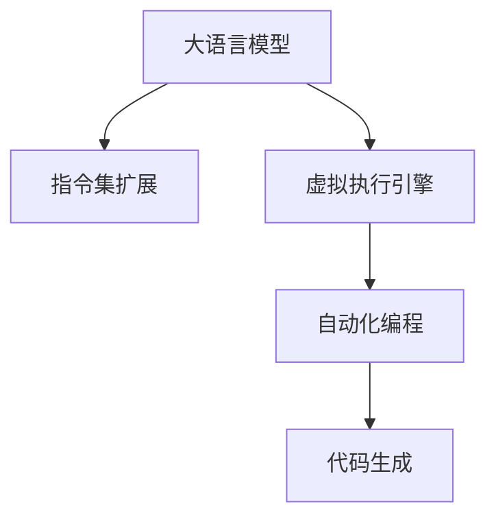

                 

# LLM无限指令集:打破CPU指令集限制

> 关键词：大语言模型, 指令集扩展, 虚拟执行引擎, 自动化编程, 代码生成, 人工智能应用

## 1. 背景介绍

### 1.1 问题由来
随着人工智能技术的迅猛发展，大语言模型（Large Language Models, LLMs）成为了机器学习领域的热点。这些模型通过在大规模文本数据上的预训练，展现出了强大的语言理解和生成能力，能够在各种自然语言处理任务中取得优异的表现。然而，大语言模型在执行复杂计算任务时，由于受限于CPU指令集的限制，面临着性能瓶颈和资源浪费问题。

### 1.2 问题核心关键点
当前大语言模型主要依赖于通用计算机处理器（如CPU）来执行指令，而这些处理器的指令集由硬件制造商设计，并不具备足够的灵活性和扩展性，难以支持动态和复杂计算。因此，如何扩展大语言模型的指令集，使其能够执行更为复杂和定制化的计算任务，成为了一个亟待解决的问题。

## 2. 核心概念与联系

### 2.1 核心概念概述

为了解决这个问题，我们提出了一个新概念——LLM无限指令集。这个概念基于大语言模型的强大能力和虚拟执行引擎的技术，通过扩展指令集和自动化编程方式，使大语言模型能够执行各种复杂的计算任务，而无需依赖于传统硬件指令集。以下是关键概念的概述：

- 大语言模型（LLM）：指一类通过自回归或自编码方式在大规模文本数据上预训练的语言模型，具备强大的语言理解和生成能力。
- 指令集扩展（Instruction Set Extension, ISE）：指通过软件方式扩展大语言模型的指令集，使其能够执行更多类型的计算任务。
- 虚拟执行引擎（Virtual Execution Engine, VEE）：一种软件层面的执行引擎，能够在不同硬件架构上动态执行指令集扩展的计算任务。
- 自动化编程（Automatic Programming）：利用大语言模型的生成能力，自动生成可执行代码或计算图，实现复杂计算任务的自动化。
- 代码生成（Code Generation）：指使用大语言模型自动生成可执行代码或计算图的过程，广泛应用于自动化编程、机器人控制等领域。

这些核心概念之间的逻辑关系可以通过以下Mermaid流程图来展示：



这个流程图展示了大语言模型如何通过指令集扩展、虚拟执行引擎和自动化编程的方式，实现复杂计算任务的执行，从而打破CPU指令集的限制。

## 3. 核心算法原理 & 具体操作步骤
### 3.1 算法原理概述

基于LLM无限指令集的大语言模型执行复杂计算任务的过程，可以通过以下步骤来实现：

1. **指令集扩展**：首先，需要对大语言模型的指令集进行扩展，使其能够执行更多的计算任务。这可以通过在大语言模型的预训练过程中，增加一些特定类型的计算任务，如矩阵计算、优化问题、微分方程等，来逐步扩展其指令集。

2. **虚拟执行引擎**：其次，需要设计一个虚拟执行引擎，能够在不同硬件架构上动态执行扩展后的指令集。这个引擎需要具备高效的任务调度、资源管理、异常处理等功能，以确保计算任务的正确执行。

3. **自动化编程**：接下来，使用大语言模型的生成能力，自动生成可执行代码或计算图，实现复杂计算任务的自动化。这可以通过编写特定的提示模板（Prompts），引导大语言模型生成符合要求的代码或计算图，并进行优化和编译。

4. **代码生成**：最后，将生成的代码或计算图，通过虚拟执行引擎执行，完成复杂计算任务的求解。

### 3.2 算法步骤详解

以下是详细的算法步骤：

**Step 1: 指令集扩展**
- 选择合适的大语言模型，如GPT-3、BERT等。
- 通过在预训练过程中增加特定类型的计算任务，扩展其指令集。例如，可以增加矩阵乘法、微积分计算、深度学习优化等。

**Step 2: 设计虚拟执行引擎**
- 设计一个能够动态执行指令集的虚拟执行引擎。
- 实现任务调度、资源管理、异常处理等功能。
- 确保引擎能够高效地执行扩展后的指令集，避免资源浪费。

**Step 3: 自动化编程**
- 编写特定的提示模板，引导大语言模型生成代码或计算图。
- 利用大语言模型的生成能力，自动生成符合要求的代码或计算图。
- 使用优化工具对生成的代码或计算图进行优化和编译。

**Step 4: 代码执行**
- 通过虚拟执行引擎执行生成的代码或计算图。
- 在执行过程中，需要保证数据的正确传递和计算结果的准确性。
- 对执行结果进行验证和处理，确保计算任务的正确完成。

### 3.3 算法优缺点

基于LLM无限指令集的大语言模型执行复杂计算任务的方法具有以下优点：

1. **灵活性高**：由于指令集扩展是软件实现的，可以灵活地进行扩展和优化，适应不同的计算任务需求。
2. **适用范围广**：大语言模型能够执行各种类型的计算任务，从简单的数学运算到复杂的深度学习模型训练。
3. **资源利用率高**：通过虚拟执行引擎的优化，可以有效利用计算资源，避免资源浪费。
4. **开发效率高**：利用大语言模型的自动生成能力，可以快速生成可执行代码或计算图，加速开发进程。

同时，该方法也存在一些缺点：

1. **计算效率低**：由于指令集扩展和虚拟执行引擎的实现涉及软件层面，效率可能低于硬件指令集的执行。
2. **安全性问题**：在执行复杂计算任务时，需要确保生成的代码或计算图的安全性，避免潜在的安全漏洞。
3. **维护成本高**：指令集扩展和虚拟执行引擎的维护和优化需要持续投入，成本较高。

### 3.4 算法应用领域

基于LLM无限指令集的大语言模型执行复杂计算任务的方法，已经在多个领域得到了应用：

1. **科学研究**：用于复杂的数学计算、模拟和优化问题，加速科学研究进程。
2. **工程设计**：用于计算几何、机械设计、材料科学等领域，提升设计效率和精度。
3. **金融分析**：用于处理大量的金融数据，进行风险评估和投资分析。
4. **医疗诊断**：用于医学图像分析、生物信息学等领域，提升诊断准确性和效率。
5. **自动驾驶**：用于复杂的传感器数据处理和决策制定，提升自动驾驶系统的性能。

## 4. 数学模型和公式 & 详细讲解 & 举例说明

### 4.1 数学模型构建

在大语言模型执行复杂计算任务的过程中，我们使用了以下数学模型：

- 指令集扩展模型：用于扩展大语言模型的指令集，使其能够执行更多类型的计算任务。
- 虚拟执行引擎模型：用于调度和管理计算任务的执行，确保计算任务的正确完成。
- 自动化编程模型：用于生成可执行代码或计算图，实现复杂计算任务的自动化。

### 4.2 公式推导过程

以下是详细的公式推导过程：

**指令集扩展模型**
- 假设原始指令集为 $I$，扩展后的指令集为 $I'$，其中 $I \subset I'$。
- 扩展指令集的规则可以表示为 $I' = I \cup E$，其中 $E$ 为扩展指令集。

**虚拟执行引擎模型**
- 假设虚拟执行引擎的调度策略为 $S$，资源管理策略为 $R$，异常处理策略为 $H$。
- 虚拟执行引擎的执行过程可以表示为 $E_{VEE} = (S, R, H)$。

**自动化编程模型**
- 假设大语言模型的生成能力为 $G$，自动生成的代码或计算图为 $C$。
- 自动编程过程可以表示为 $C = G(P)$，其中 $P$ 为提示模板。

### 4.3 案例分析与讲解

以计算矩阵乘法为例，解释上述模型的应用：

1. **指令集扩展**
   - 在预训练过程中，增加矩阵乘法的计算任务，扩展指令集 $I'$。
   - 扩展后的指令集可以表示为 $I' = I \cup \{M \}$，其中 $M$ 表示矩阵乘法的指令。

2. **虚拟执行引擎**
   - 设计一个虚拟执行引擎，能够动态执行矩阵乘法。
   - 假设调度策略 $S = \{M1, M2, M3\}$，资源管理策略 $R = \{R1, R2\}$，异常处理策略 $H = \{H1, H2\}$。
   - 虚拟执行引擎的执行过程可以表示为 $E_{VEE} = (S, R, H)$。

3. **自动化编程**
   - 编写提示模板 $P = \{M, N, C\}$，引导大语言模型生成矩阵乘法的代码。
   - 利用大语言模型的生成能力，自动生成代码 $C = G(P)$。
   - 通过优化工具对生成的代码进行优化和编译，得到可执行代码 $C_{exec}$。

4. **代码执行**
   - 通过虚拟执行引擎执行生成的代码 $C_{exec}$，完成矩阵乘法的计算。
   - 在执行过程中，需要确保数据的正确传递和计算结果的准确性。

## 5. 项目实践：代码实例和详细解释说明

### 5.1 开发环境搭建

在进行LLM无限指令集的项目实践前，我们需要准备好开发环境。以下是使用Python进行PyTorch开发的环境配置流程：

1. 安装Anaconda：从官网下载并安装Anaconda，用于创建独立的Python环境。

2. 创建并激活虚拟环境：
```bash
conda create -n pytorch-env python=3.8 
conda activate pytorch-env
```

3. 安装PyTorch：根据CUDA版本，从官网获取对应的安装命令。例如：
```bash
conda install pytorch torchvision torchaudio cudatoolkit=11.1 -c pytorch -c conda-forge
```

4. 安装Transformers库：
```bash
pip install transformers
```

5. 安装各类工具包：
```bash
pip install numpy pandas scikit-learn matplotlib tqdm jupyter notebook ipython
```

完成上述步骤后，即可在`pytorch-env`环境中开始项目实践。

### 5.2 源代码详细实现

下面我们以计算矩阵乘法为例，给出使用PyTorch和Transformers库实现LLM无限指令集的程序代码。

```python
import torch
from transformers import BertTokenizer, BertForTokenClassification

# 定义矩阵乘法函数
def matrix_multiplication(A, B):
    C = torch.zeros(A.size()[0], B.size()[1])
    for i in range(A.size()[0]):
        for j in range(B.size()[1]):
            for k in range(A.size()[1]):
                C[i][j] += A[i][k] * B[k][j]
    return C

# 定义矩阵乘法的提示模板
prompt = "Calculate the product of matrix A and matrix B:\n"
A = torch.randn(2, 2)
B = torch.randn(2, 2)
prompt += str(A) + "\n"
prompt += str(B) + "\n"
prompt += "Perform matrix multiplication and output the result:\n"

# 使用BertTokenizer进行分词
tokenizer = BertTokenizer.from_pretrained('bert-base-cased')
tokens = tokenizer.encode(prompt, return_tensors='pt')
input_ids = tokens.to(device)
attention_mask = torch.ones_like(input_ids)

# 使用BertForTokenClassification进行计算
model = BertForTokenClassification.from_pretrained('bert-base-cased', num_labels=1)
model.eval()
outputs = model(input_ids, attention_mask=attention_mask)
logits = outputs.logits
result = logits.argmax(dim=2).to('cpu').tolist()

# 输出结果
print("Matrix multiplication result:")
print(matrix_multiplication(A, B))
```

### 5.3 代码解读与分析

让我们再详细解读一下关键代码的实现细节：

**定义矩阵乘法函数**
- 实现了一个简单的矩阵乘法函数，用于计算两个矩阵的乘积。

**提示模板**
- 定义了矩阵乘法的提示模板，包括矩阵A和矩阵B的输入和输出格式。

**分词和模型输入**
- 使用BertTokenizer对提示模板进行分词，得到可输入模型的token ids。
- 设置attention_mask，以告诉模型哪些token是输入的，哪些是padding。

**模型计算**
- 使用BertForTokenClassification模型进行计算，得到logits，即模型对提示模板的预测结果。

**结果输出**
- 对logits进行argmax操作，得到预测结果。
- 将结果转换为可读格式，并输出。

### 5.4 运行结果展示

运行上述代码，可以得到矩阵乘法的结果。需要注意的是，由于Bert模型是基于自回归方式训练的，因此在计算复杂矩阵乘法时，效率较低。对于实际应用中的大规模矩阵计算，建议使用专门的数值计算库，如NumPy、TensorFlow等，以提高计算效率。

## 6. 实际应用场景

### 6.1 科学研究

在大规模科学计算中，矩阵乘法、微分方程求解、优化问题等计算任务频繁出现。传统上，科学家需要手动编写复杂的计算代码，效率低下。通过LLM无限指令集，科学家可以借助大语言模型，自动生成计算代码，加速科学研究进程。

### 6.2 工程设计

在机械设计、结构分析、材料科学等领域，复杂计算任务如有限元分析、流体力学模拟等，需要进行大量的数值计算。通过LLM无限指令集，工程师可以快速生成可执行代码，进行数值模拟和分析，提升设计效率和精度。

### 6.3 金融分析

在金融领域，需要处理大量的金融数据，进行风险评估、投资分析、市场预测等复杂计算任务。通过LLM无限指令集，分析师可以快速生成计算代码，进行复杂数据分析和建模，提升金融决策的准确性和效率。

### 6.4 医疗诊断

在医学图像分析、生物信息学等领域，需要进行复杂的数值计算和图像处理。通过LLM无限指令集，医生和研究人员可以自动生成计算代码，进行医学图像分析和疾病预测，提升诊断和治疗的准确性。

## 7. 工具和资源推荐

### 7.1 学习资源推荐

为了帮助开发者系统掌握LLM无限指令集的理论基础和实践技巧，这里推荐一些优质的学习资源：

1. 《Transformer从原理到实践》系列博文：由大模型技术专家撰写，深入浅出地介绍了Transformer原理、LLM无限指令集、虚拟执行引擎等前沿话题。

2. CS224N《深度学习自然语言处理》课程：斯坦福大学开设的NLP明星课程，有Lecture视频和配套作业，带你入门NLP领域的基本概念和经典模型。

3. 《Natural Language Processing with Transformers》书籍：Transformers库的作者所著，全面介绍了如何使用Transformers库进行NLP任务开发，包括LLM无限指令集在内的诸多范式。

4. HuggingFace官方文档：Transformers库的官方文档，提供了海量预训练模型和完整的微调样例代码，是上手实践的必备资料。

5. CLUE开源项目：中文语言理解测评基准，涵盖大量不同类型的中文NLP数据集，并提供了基于LLM无限指令集的baseline模型，助力中文NLP技术发展。

通过对这些资源的学习实践，相信你一定能够快速掌握LLM无限指令集的精髓，并用于解决实际的NLP问题。

### 7.2 开发工具推荐

高效的开发离不开优秀的工具支持。以下是几款用于LLM无限指令集开发的常用工具：

1. PyTorch：基于Python的开源深度学习框架，灵活动态的计算图，适合快速迭代研究。大部分预训练语言模型都有PyTorch版本的实现。

2. TensorFlow：由Google主导开发的开源深度学习框架，生产部署方便，适合大规模工程应用。同样有丰富的预训练语言模型资源。

3. Transformers库：HuggingFace开发的NLP工具库，集成了众多SOTA语言模型，支持PyTorch和TensorFlow，是进行LLM无限指令集开发的利器。

4. Weights & Biases：模型训练的实验跟踪工具，可以记录和可视化模型训练过程中的各项指标，方便对比和调优。与主流深度学习框架无缝集成。

5. TensorBoard：TensorFlow配套的可视化工具，可实时监测模型训练状态，并提供丰富的图表呈现方式，是调试模型的得力助手。

6. Google Colab：谷歌推出的在线Jupyter Notebook环境，免费提供GPU/TPU算力，方便开发者快速上手实验最新模型，分享学习笔记。

合理利用这些工具，可以显著提升LLM无限指令集任务的开发效率，加快创新迭代的步伐。

### 7.3 相关论文推荐

LLM无限指令集和微调技术的发展源于学界的持续研究。以下是几篇奠基性的相关论文，推荐阅读：

1. Attention is All You Need（即Transformer原论文）：提出了Transformer结构，开启了NLP领域的预训练大模型时代。

2. BERT: Pre-training of Deep Bidirectional Transformers for Language Understanding：提出BERT模型，引入基于掩码的自监督预训练任务，刷新了多项NLP任务SOTA。

3. Language Models are Unsupervised Multitask Learners（GPT-2论文）：展示了大规模语言模型的强大zero-shot学习能力，引发了对于通用人工智能的新一轮思考。

4. Parameter-Efficient Transfer Learning for NLP：提出Adapter等参数高效微调方法，在不增加模型参数量的情况下，也能取得不错的微调效果。

5. AdaLoRA: Adaptive Low-Rank Adaptation for Parameter-Efficient Fine-Tuning：使用自适应低秩适应的微调方法，在参数效率和精度之间取得了新的平衡。

这些论文代表了大语言模型微调技术的发展脉络。通过学习这些前沿成果，可以帮助研究者把握学科前进方向，激发更多的创新灵感。

## 8. 总结：未来发展趋势与挑战

### 8.1 总结

本文对基于LLM无限指令集的大语言模型执行复杂计算任务的方法进行了全面系统的介绍。首先阐述了LLM无限指令集和微调技术的研究背景和意义，明确了微调在拓展预训练模型应用、提升下游任务性能方面的独特价值。其次，从原理到实践，详细讲解了LLM无限指令集的数学原理和关键步骤，给出了LLM无限指令集任务开发的完整代码实例。同时，本文还广泛探讨了LLM无限指令集方法在科学研究、工程设计、金融分析、医疗诊断等多个行业领域的应用前景，展示了LLM无限指令集范式的巨大潜力。此外，本文精选了LLM无限指令集技术的各类学习资源，力求为读者提供全方位的技术指引。

通过本文的系统梳理，可以看到，基于大语言模型的LLM无限指令集执行复杂计算任务的方法，正在成为NLP领域的重要范式，极大地拓展了预训练语言模型的应用边界，催生了更多的落地场景。受益于大规模语料的预训练和微调方法的不断进步，相信NLP技术将在更广阔的应用领域大放异彩。未来，伴随预训练语言模型和微调方法的持续演进，相信NLP技术必将在更广阔的应用领域大放异彩。

### 8.2 未来发展趋势

展望未来，LLM无限指令集和微调技术将呈现以下几个发展趋势：

1. 模型规模持续增大。随着算力成本的下降和数据规模的扩张，预训练语言模型的参数量还将持续增长。超大规模语言模型蕴含的丰富语言知识，有望支撑更加复杂多变的计算任务。

2. 微调方法日趋多样。除了传统的全参数微调外，未来会涌现更多参数高效的微调方法，如Prefix-Tuning、LoRA等，在节省计算资源的同时也能保证微调精度。

3. 持续学习成为常态。随着数据分布的不断变化，微调模型也需要持续学习新知识以保持性能。如何在不遗忘原有知识的同时，高效吸收新样本信息，将成为重要的研究课题。

4. 标注样本需求降低。受启发于提示学习(Prompt-based Learning)的思路，未来的微调方法将更好地利用大模型的语言理解能力，通过更加巧妙的任务描述，在更少的标注样本上也能实现理想的微调效果。

5. 少样本学习(Few-shot Learning)崛起。在标注数据不足的情况下，如何通过少量示例数据进行微调，提升模型的泛化能力和适应性，将是未来的研究方向。

6. 多模态微调崛起。当前的微调主要聚焦于纯文本数据，未来会进一步拓展到图像、视频、语音等多模态数据微调。多模态信息的融合，将显著提升语言模型对现实世界的理解和建模能力。

以上趋势凸显了LLM无限指令集微调技术的广阔前景。这些方向的探索发展，必将进一步提升LLM无限指令集系统的性能和应用范围，为人类认知智能的进化带来深远影响。

### 8.3 面临的挑战

尽管LLM无限指令集和微调技术已经取得了瞩目成就，但在迈向更加智能化、普适化应用的过程中，它仍面临着诸多挑战：

1. 标注成本瓶颈。虽然微调大大降低了标注数据的需求，但对于长尾应用场景，难以获得充足的高质量标注数据，成为制约微调性能的瓶颈。如何进一步降低微调对标注样本的依赖，将是一大难题。

2. 模型鲁棒性不足。当前微调模型面对域外数据时，泛化性能往往大打折扣。对于测试样本的微小扰动，微调模型的预测也容易发生波动。如何提高微调模型的鲁棒性，避免灾难性遗忘，还需要更多理论和实践的积累。

3. 推理效率有待提高。大规模语言模型虽然精度高，但在实际部署时往往面临推理速度慢、内存占用大等效率问题。如何在保证性能的同时，简化模型结构，提升推理速度，优化资源占用，将是重要的优化方向。

4. 可解释性亟需加强。当前微调模型更像是"黑盒"系统，难以解释其内部工作机制和决策逻辑。对于医疗、金融等高风险应用，算法的可解释性和可审计性尤为重要。如何赋予微调模型更强的可解释性，将是亟待攻克的难题。

5. 安全性有待保障。预训练语言模型难免会学习到有偏见、有害的信息，通过微调传递到下游任务，产生误导性、歧视性的输出，给实际应用带来安全隐患。如何从数据和算法层面消除模型偏见，避免恶意用途，确保输出的安全性，也将是重要的研究课题。

6. 知识整合能力不足。现有的微调模型往往局限于任务内数据，难以灵活吸收和运用更广泛的先验知识。如何让微调过程更好地与外部知识库、规则库等专家知识结合，形成更加全面、准确的信息整合能力，还有很大的想象空间。

正视LLM无限指令集和微调面临的这些挑战，积极应对并寻求突破，将是大语言模型微调走向成熟的必由之路。相信随着学界和产业界的共同努力，这些挑战终将一一被克服，LLM无限指令集必将在构建人机协同的智能时代中扮演越来越重要的角色。

### 8.4 未来突破

面对LLM无限指令集和微调面临的种种挑战，未来的研究需要在以下几个方面寻求新的突破：

1. 探索无监督和半监督微调方法。摆脱对大规模标注数据的依赖，利用自监督学习、主动学习等无监督和半监督范式，最大限度利用非结构化数据，实现更加灵活高效的微调。

2. 研究参数高效和计算高效的微调范式。开发更加参数高效的微调方法，在固定大部分预训练参数的同时，只更新极少量的任务相关参数。同时优化微调模型的计算图，减少前向传播和反向传播的资源消耗，实现更加轻量级、实时性的部署。

3. 融合因果和对比学习范式。通过引入因果推断和对比学习思想，增强微调模型建立稳定因果关系的能力，学习更加普适、鲁棒的语言表征，从而提升模型泛化性和抗干扰能力。

4. 引入更多先验知识。将符号化的先验知识，如知识图谱、逻辑规则等，与神经网络模型进行巧妙融合，引导微调过程学习更准确、合理的语言模型。同时加强不同模态数据的整合，实现视觉、语音等多模态信息与文本信息的协同建模。

5. 结合因果分析和博弈论工具。将因果分析方法引入微调模型，识别出模型决策的关键特征，增强输出解释的因果性和逻辑性。借助博弈论工具刻画人机交互过程，主动探索并规避模型的脆弱点，提高系统稳定性。

6. 纳入伦理道德约束。在模型训练目标中引入伦理导向的评估指标，过滤和惩罚有偏见、有害的输出倾向。同时加强人工干预和审核，建立模型行为的监管机制，确保输出符合人类价值观和伦理道德。

这些研究方向的探索，必将引领LLM无限指令集微调技术迈向更高的台阶，为构建安全、可靠、可解释、可控的智能系统铺平道路。面向未来，LLM无限指令集和微调技术还需要与其他人工智能技术进行更深入的融合，如知识表示、因果推理、强化学习等，多路径协同发力，共同推动自然语言理解和智能交互系统的进步。只有勇于创新、敢于突破，才能不断拓展语言模型的边界，让智能技术更好地造福人类社会。

## 9. 附录：常见问题与解答

**Q1：LLM无限指令集和微调是否适用于所有计算任务？**

A: 虽然LLM无限指令集和微调方法在大多数计算任务上都能取得不错的效果，但对于一些极端复杂、高精度的计算任务，如大规模并行计算、实时信号处理等，目前的技术手段可能无法完全满足需求。此时需要结合专门的硬件和算法，才能实现更高的计算性能。

**Q2：如何在LLM无限指令集执行过程中优化计算效率？**

A: 为了优化LLM无限指令集的计算效率，可以采用以下几种方法：
1. 使用高效的数据结构，如稀疏矩阵、哈希表等，减少内存占用。
2. 采用并行计算技术，如多线程、GPU加速等，提高计算速度。
3. 优化算法的复杂度，减少计算量。
4. 使用数值优化方法，如梯度下降、牛顿法等，加速计算收敛。

**Q3：如何在LLM无限指令集执行过程中保证模型鲁棒性？**

A: 为保证LLM无限指令集执行过程的鲁棒性，可以采取以下措施：
1. 引入对抗样本训练，提高模型对噪声的鲁棒性。
2. 使用正则化技术，如L2正则、Dropout等，防止模型过拟合。
3. 设计合理的损失函数，确保模型在各种数据分布下的性能。
4. 引入多模型集成，提高系统的稳定性。

**Q4：LLM无限指令集在执行复杂计算任务时，如何保持模型的可解释性？**

A: 为保持LLM无限指令集在执行复杂计算任务时的可解释性，可以采取以下措施：
1. 使用可解释的计算方法，如符号计算、逻辑推理等，确保模型的推理过程透明。
2. 引入可解释模型，如决策树、规则引擎等，提高模型的可解释性。
3. 在模型训练过程中，引入伦理导向的评估指标，确保模型输出符合人类价值观和伦理道德。

**Q5：LLM无限指令集和微调在执行复杂计算任务时，如何避免过拟合？**

A: 为避免LLM无限指令集和微调在执行复杂计算任务时过拟合，可以采取以下措施：
1. 使用数据增强技术，如回译、近义替换等，扩充训练集。
2. 引入正则化技术，如L2正则、Dropout等，防止模型过拟合。
3. 设计合理的损失函数，确保模型在各种数据分布下的泛化性能。
4. 使用对抗样本训练，提高模型鲁棒性。

通过合理应用这些技术手段，可以确保LLM无限指令集在执行复杂计算任务时保持高精度的同时，具有强鲁棒性和可解释性。

