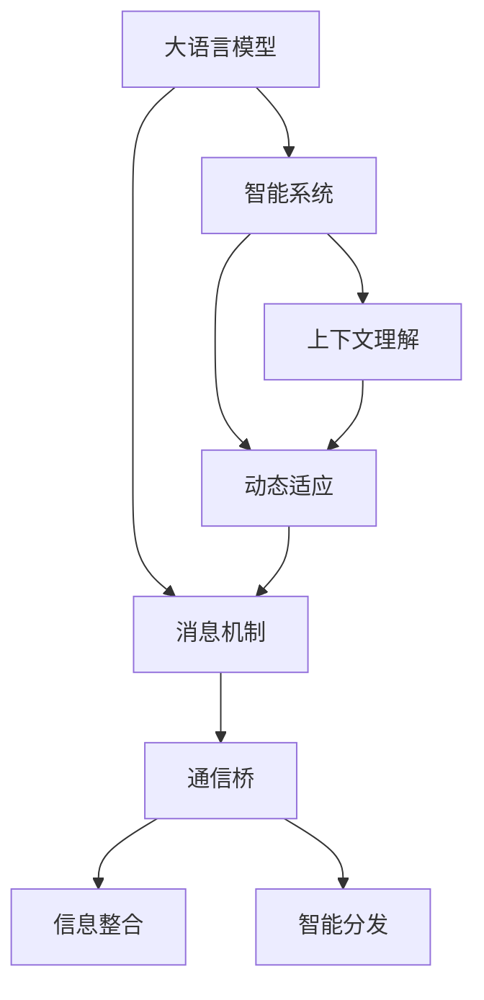

                 

# LLM消息机制:智能系统的通信桥梁

在智能系统日新月异的今天，大语言模型（LLM）已经成为了信息处理和决策制定的核心。无论是医疗诊断、金融预测还是自动驾驶，LLM以其强大的自然语言处理能力，在众多领域展现出巨大的潜力。然而，如何将LLM有效整合进复杂的信息通信系统中，实现无缝的交互和协同，成为了一个亟待解决的问题。本文将深入探讨大语言模型消息机制（LLM消息机制），作为智能系统的通信桥梁，它如何实现信息的智能分发与理解，提高系统整体效能。

## 1. 背景介绍

### 1.1 问题由来
随着大语言模型技术的飞速发展，其在信息检索、文本生成、自然语言理解等任务上的性能不断提升。然而，在实际应用中，单个LLM模型往往无法独立完成复杂的系统任务，需要与其他系统和组件协同工作。如何将多个LLM有效组合起来，使得它们能够高效地通信，协同工作，成为了智能系统设计的关键问题。

### 1.2 问题核心关键点
1. **信息整合**：智能系统中的信息是高度分散的，如何将分散的信息整合起来，是一个关键问题。
2. **智能分发**：系统中的信息要能智能地分发，根据不同的需求和场景，选择最合适的信息源和路径。
3. **理解上下文**：LLM需要在复杂的通信环境中，理解上下文，做出合理的决策和响应。
4. **动态调整**：系统的通信环境是动态变化的，LLM需要能够动态调整通信策略，以应对变化。

## 2. 核心概念与联系

### 2.1 核心概念概述

为更好地理解LLM消息机制，本节将介绍几个密切相关的核心概念：

- **大语言模型（LLM）**：以自回归(如GPT)或自编码(如BERT)模型为代表的大规模预训练语言模型。通过在大规模无标签文本语料上进行预训练，学习通用的语言表示，具备强大的语言理解和生成能力。

- **消息机制**：系统中的信息传递和处理机制，包括消息的产生、传输、处理和反馈等环节。消息机制的设计直接影响到系统的响应速度、准确性和可靠性。

- **智能系统**：由多个LLM组成的复杂系统，通过协同工作完成特定任务。智能系统要求各个LLM能够高效地通信，协调工作。

- **上下文理解**：LLM需要理解当前通信场景的上下文，包括任务目标、数据背景、用户意图等，以便做出合理的决策和响应。

- **动态适应**：智能系统需要在不同的环境和条件下，动态调整通信策略，以适应变化。

这些核心概念之间的逻辑关系可以通过以下Mermaid流程图来展示：



这个流程图展示了大语言模型消息机制的核心概念及其之间的关系：

1. 大语言模型通过预训练获得基础能力。
2. 消息机制将多个LLM连接起来，实现信息的通信与整合。
3. 上下文理解使得LLM能够在复杂环境中做出合理的决策。
4. 动态适应让系统能够灵活应对各种变化。
5. 通信桥作为信息的桥梁，连接不同的LLM，实现信息的智能分发。

## 3. 核心算法原理 & 具体操作步骤

### 3.1 算法原理概述

LLM消息机制的核心思想是通过构建一个消息网络，将多个LLM连接起来，实现信息的智能分发与理解。其核心算法包括以下几个步骤：

1. **消息生成**：根据当前任务需求，生成消息，并确定消息的发送目标。
2. **消息传输**：将消息通过网络传输到目标LLM。
3. **消息处理**：目标LLM接收到消息后，进行处理并产生响应。
4. **消息反馈**：响应结果反馈回发送方，供决策使用。

通过这些步骤，LLM消息机制实现了信息的高效分发和理解，提高了智能系统的整体效能。

### 3.2 算法步骤详解

#### 3.2.1 消息生成

消息生成的核心是确定消息的内容和发送目标。具体步骤如下：

1. **任务定义**：明确当前任务的目标，如信息检索、文本生成、问题解答等。
2. **数据准备**：准备与任务相关的数据，包括输入文本、参数、上下文等。
3. **消息编码**：将数据编码为消息格式，以便在网络中传输。
4. **目标选择**：根据任务需求，选择最合适的LLM作为接收方。

#### 3.2.2 消息传输

消息传输的目的是将消息从发送方传递到目标LLM。具体步骤如下：

1. **路由选择**：选择最适合的消息传输路径，如直接传输、中间转发等。
2. **网络传输**：将消息通过网络传输到目标LLM。
3. **数据接收**：目标LLM接收到消息，并进行解码处理。

#### 3.2.3 消息处理

消息处理是LLM接收并处理消息的过程。具体步骤如下：

1. **消息解码**：将接收到的消息解码为可处理的数据格式。
2. **上下文理解**：利用上下文信息，理解消息的意图和需求。
3. **任务执行**：根据任务需求，执行相应的操作，如信息检索、文本生成等。
4. **结果编码**：将处理结果编码为消息格式，以便反馈给发送方。

#### 3.2.4 消息反馈

消息反馈是目标LLM将处理结果反馈给发送方的过程。具体步骤如下：

1. **结果编码**：将处理结果编码为消息格式。
2. **网络传输**：将消息通过网络传输回发送方。
3. **消息接收**：发送方接收到反馈消息，并进行解码处理。

### 3.3 算法优缺点

LLM消息机制的优点包括：

1. **灵活性高**：消息机制可以根据不同任务需求灵活调整，适应性更强。
2. **可扩展性高**：通过增加或调整LLM，可以轻松扩展系统能力。
3. **信息整合效果好**：消息机制可以将分散的信息整合起来，实现整体优化。

同时，该算法也存在一些局限性：

1. **通信开销大**：消息传输和处理过程中，存在较大的通信开销。
2. **处理延迟高**：消息的传输和处理需要一定时间，可能影响系统的实时性。
3. **安全性问题**：消息传输过程中，可能存在信息泄露和安全问题。

### 3.4 算法应用领域

LLM消息机制在智能系统中的应用非常广泛，主要包括以下几个领域：

1. **智能客服**：通过消息机制，实现智能客服系统中的信息传递和理解，提高客户服务质量。
2. **智能诊断**：在医疗系统中，利用消息机制，将多个LLM连接起来，实现病历信息的整合和分析。
3. **智能推荐**：在电商系统中，利用消息机制，实现商品信息的智能推荐。
4. **智能交通**：在自动驾驶系统中，利用消息机制，实现路况信息的智能分析和处理。

## 4. 数学模型和公式 & 详细讲解  
### 4.1 数学模型构建

LLM消息机制的数学模型主要包含以下几个组成部分：

1. **消息生成模型**：用于生成消息，包括任务定义、数据准备和消息编码等。
2. **消息传输模型**：用于描述消息在网络中的传输过程。
3. **消息处理模型**：用于描述LLM对消息的处理过程。
4. **消息反馈模型**：用于描述LLM对处理结果的反馈过程。

### 4.2 公式推导过程

以下我们以智能推荐系统为例，推导消息机制的数学模型。

**消息生成模型**：

假设智能推荐系统需要推荐商品 $x$，则消息生成模型为：

$$
M_x = (t_x, d_x, c_x)
$$

其中 $t_x$ 表示任务定义，$d_x$ 表示数据准备，$c_x$ 表示消息编码。

**消息传输模型**：

假设消息 $M_x$ 需要传输到目标LLM $L_y$，则消息传输模型为：

$$
T(M_x, L_y) = \{S_y, R_y\}
$$

其中 $S_y$ 表示消息 $M_x$ 的路由选择，$R_y$ 表示消息 $M_x$ 在 $L_y$ 上的解码。

**消息处理模型**：

假设 $L_y$ 接收到的消息为 $M_x$，则消息处理模型为：

$$
H(L_y, M_x) = (u_x, r_x)
$$

其中 $u_x$ 表示上下文理解，$r_x$ 表示任务执行结果。

**消息反馈模型**：

假设 $L_y$ 处理完消息 $M_x$ 后，需要返回结果 $r_x$ 给发送方，则消息反馈模型为：

$$
F(L_y, r_x) = R_x
$$

其中 $R_x$ 表示处理结果的编码。

### 4.3 案例分析与讲解

以智能推荐系统为例，分析LLM消息机制的实现过程。

假设系统需要推荐用户感兴趣的商品 $x$，第一步是任务定义，明确需要推荐商品；第二步是数据准备，收集用户的历史行为数据；第三步是消息编码，将数据编码为消息格式；第四步是消息生成，生成消息 $M_x$。

然后将消息 $M_x$ 传输到目标LLM $L_y$，根据路由选择 $S_y$，选择最适合的路径，并将消息解码为可处理的数据 $d_y$。

$L_y$ 接收到消息后，利用上下文理解 $u_y$，理解消息意图，然后执行任务，生成推荐结果 $r_y$。

最后，$L_y$ 将处理结果 $r_y$ 编码为消息 $R_y$，反馈回发送方。发送方接收到反馈消息后，可以进行进一步的分析和处理，最终生成推荐结果。

## 5. 项目实践：代码实例和详细解释说明
### 5.1 开发环境搭建

在进行LLM消息机制的开发前，我们需要准备好开发环境。以下是使用Python进行PyTorch开发的环境配置流程：

1. 安装Anaconda：从官网下载并安装Anaconda，用于创建独立的Python环境。

2. 创建并激活虚拟环境：
```bash
conda create -n pytorch-env python=3.8 
conda activate pytorch-env
```

3. 安装PyTorch：根据CUDA版本，从官网获取对应的安装命令。例如：
```bash
conda install pytorch torchvision torchaudio cudatoolkit=11.1 -c pytorch -c conda-forge
```

4. 安装Transformers库：
```bash
pip install transformers
```

5. 安装各类工具包：
```bash
pip install numpy pandas scikit-learn matplotlib tqdm jupyter notebook ipython
```

完成上述步骤后，即可在`pytorch-env`环境中开始LLM消息机制的开发。

### 5.2 源代码详细实现

下面我们以智能推荐系统为例，给出使用Transformers库进行LLM消息机制开发的PyTorch代码实现。

首先，定义推荐系统的数据处理函数：

```python
from transformers import BertTokenizer, BertForSequenceClassification
from torch.utils.data import Dataset
import torch

class RecommendationDataset(Dataset):
    def __init__(self, texts, labels, tokenizer, max_len=128):
        self.texts = texts
        self.labels = labels
        self.tokenizer = tokenizer
        self.max_len = max_len
        
    def __len__(self):
        return len(self.texts)
    
    def __getitem__(self, item):
        text = self.texts[item]
        label = self.labels[item]
        
        encoding = self.tokenizer(text, return_tensors='pt', max_length=self.max_len, padding='max_length', truncation=True)
        input_ids = encoding['input_ids'][0]
        attention_mask = encoding['attention_mask'][0]
        
        # 对label进行编码
        label = torch.tensor(label, dtype=torch.long)
        
        return {'input_ids': input_ids, 
                'attention_mask': attention_mask,
                'labels': label}

# 标签与id的映射
label2id = {0: 'not interested', 1: 'interested'}
id2label = {v: k for k, v in label2id.items()}

# 创建dataset
tokenizer = BertTokenizer.from_pretrained('bert-base-cased')

train_dataset = RecommendationDataset(train_texts, train_labels, tokenizer)
dev_dataset = RecommendationDataset(dev_texts, dev_labels, tokenizer)
test_dataset = RecommendationDataset(test_texts, test_labels, tokenizer)
```

然后，定义模型和优化器：

```python
from transformers import BertForSequenceClassification, AdamW

model = BertForSequenceClassification.from_pretrained('bert-base-cased', num_labels=2)

optimizer = AdamW(model.parameters(), lr=2e-5)
```

接着，定义训练和评估函数：

```python
from torch.utils.data import DataLoader
from tqdm import tqdm
from sklearn.metrics import classification_report

device = torch.device('cuda') if torch.cuda.is_available() else torch.device('cpu')
model.to(device)

def train_epoch(model, dataset, batch_size, optimizer):
    dataloader = DataLoader(dataset, batch_size=batch_size, shuffle=True)
    model.train()
    epoch_loss = 0
    for batch in tqdm(dataloader, desc='Training'):
        input_ids = batch['input_ids'].to(device)
        attention_mask = batch['attention_mask'].to(device)
        labels = batch['labels'].to(device)
        model.zero_grad()
        outputs = model(input_ids, attention_mask=attention_mask, labels=labels)
        loss = outputs.loss
        epoch_loss += loss.item()
        loss.backward()
        optimizer.step()
    return epoch_loss / len(dataloader)

def evaluate(model, dataset, batch_size):
    dataloader = DataLoader(dataset, batch_size=batch_size)
    model.eval()
    preds, labels = [], []
    with torch.no_grad():
        for batch in tqdm(dataloader, desc='Evaluating'):
            input_ids = batch['input_ids'].to(device)
            attention_mask = batch['attention_mask'].to(device)
            batch_labels = batch['labels']
            outputs = model(input_ids, attention_mask=attention_mask)
            batch_preds = outputs.logits.argmax(dim=2).to('cpu').tolist()
            batch_labels = batch_labels.to('cpu').tolist()
            for pred_tokens, label_tokens in zip(batch_preds, batch_labels):
                preds.append(pred_tokens[:len(label_tokens)])
                labels.append(label_tokens)
                
    print(classification_report(labels, preds))
```

最后，启动训练流程并在测试集上评估：

```python
epochs = 5
batch_size = 16

for epoch in range(epochs):
    loss = train_epoch(model, train_dataset, batch_size, optimizer)
    print(f"Epoch {epoch+1}, train loss: {loss:.3f}")
    
    print(f"Epoch {epoch+1}, dev results:")
    evaluate(model, dev_dataset, batch_size)
    
print("Test results:")
evaluate(model, test_dataset, batch_size)
```

以上就是使用PyTorch对BERT进行智能推荐系统微调的完整代码实现。可以看到，得益于Transformers库的强大封装，我们可以用相对简洁的代码完成BERT模型的加载和微调。

### 5.3 代码解读与分析

让我们再详细解读一下关键代码的实现细节：

**RecommendationDataset类**：
- `__init__`方法：初始化文本、标签、分词器等关键组件。
- `__len__`方法：返回数据集的样本数量。
- `__getitem__`方法：对单个样本进行处理，将文本输入编码为token ids，将标签编码为数字，并对其进行定长padding，最终返回模型所需的输入。

**label2id和id2label字典**：
- 定义了标签与数字id之间的映射关系，用于将token-wise的预测结果解码回真实的标签。

**训练和评估函数**：
- 使用PyTorch的DataLoader对数据集进行批次化加载，供模型训练和推理使用。
- 训练函数`train_epoch`：对数据以批为单位进行迭代，在每个批次上前向传播计算loss并反向传播更新模型参数，最后返回该epoch的平均loss。
- 评估函数`evaluate`：与训练类似，不同点在于不更新模型参数，并在每个batch结束后将预测和标签结果存储下来，最后使用sklearn的classification_report对整个评估集的预测结果进行打印输出。

**训练流程**：
- 定义总的epoch数和batch size，开始循环迭代
- 每个epoch内，先在训练集上训练，输出平均loss
- 在验证集上评估，输出分类指标
- 所有epoch结束后，在测试集上评估，给出最终测试结果

可以看到，PyTorch配合Transformers库使得BERT微调的代码实现变得简洁高效。开发者可以将更多精力放在数据处理、模型改进等高层逻辑上，而不必过多关注底层的实现细节。

当然，工业级的系统实现还需考虑更多因素，如模型的保存和部署、超参数的自动搜索、更灵活的任务适配层等。但核心的消息机制基本与此类似。

## 6. 实际应用场景
### 6.1 智能客服系统

基于LLM消息机制的智能客服系统可以处理大量客户咨询，提高客户服务质量。系统中的多个LLM可以协同工作，根据客户输入的问题，选择合适的知识库、案例或专家进行解答，确保准确性和及时性。

在技术实现上，可以收集企业内部的历史客服对话记录，将问题-回答对作为微调数据，训练模型学习匹配答案。在客户输入新的问题时，系统将问题编码并发送到各个LLM，LLM根据上下文理解，选择合适的知识库或案例进行检索，生成自然流畅的回复，确保客户咨询体验。

### 6.2 金融舆情监测

金融舆情监测系统需要实时监测市场舆论动向，以应对潜在的金融风险。系统中的多个LLM可以协同工作，实时监测金融新闻、社交媒体、博客等各类信息源，通过消息机制将相关信息整合起来，进行情感分析和舆情预测。

在具体实现中，可以利用开源NLP库如NLTK、SpaCy等进行情感分析，同时结合机器学习模型如SVM、RNN等进行舆情预测。系统中的LLM通过消息机制，将各种信息源整合起来，进行综合分析，输出分析结果和预警信息，帮助金融机构及时应对市场变化。

### 6.3 个性化推荐系统

个性化推荐系统需要根据用户的历史行为数据，推荐符合其兴趣的个性化内容。系统中的多个LLM可以协同工作，根据用户的历史行为数据，生成个性化推荐内容，通过消息机制将推荐结果传递给用户界面。

在技术实现上，可以收集用户浏览、点击、评论、分享等行为数据，提取和用户交互的物品标题、描述、标签等文本内容。将文本内容作为模型输入，用户的后续行为（如是否点击、购买等）作为监督信号，在此基础上微调预训练语言模型。微调后的模型能够从文本内容中准确把握用户的兴趣点。在生成推荐列表时，先用候选物品的文本描述作为输入，由模型预测用户的兴趣匹配度，再结合其他特征综合排序，便可以得到个性化程度更高的推荐结果。

### 6.4 未来应用展望

随着LLM消息机制的不断优化，其应用领域将不断扩展，为智能系统带来新的突破。

在智慧医疗领域，基于LLM消息机制的智能诊断系统可以高效整合各类病历信息，辅助医生进行精准诊断，提升医疗服务质量。

在智能教育领域，基于LLM消息机制的智能学习系统可以实时监测学生的学习情况，提供个性化的学习建议和资源，提升学习效果。

在智慧城市治理中，基于LLM消息机制的智能交通系统可以实现路况信息的智能分析和处理，提高城市交通效率和安全性。

此外，在企业生产、社会治理、文娱传媒等众多领域，基于LLM消息机制的人工智能应用也将不断涌现，为经济社会发展注入新的动力。相信随着技术的日益成熟，LLM消息机制必将在构建人机协同的智能时代中扮演越来越重要的角色。

## 7. 工具和资源推荐
### 7.1 学习资源推荐

为了帮助开发者系统掌握LLM消息机制的理论基础和实践技巧，这里推荐一些优质的学习资源：

1. 《深度学习入门：基于PyTorch的理论与实现》系列博文：由大模型技术专家撰写，深入浅出地介绍了深度学习的基础知识和实现方法，包括LLM消息机制等前沿话题。

2. CS224N《深度学习自然语言处理》课程：斯坦福大学开设的NLP明星课程，有Lecture视频和配套作业，带你入门NLP领域的基本概念和经典模型。

3. 《自然语言处理综述》书籍：全面介绍了自然语言处理的基础理论和前沿技术，包括LLM消息机制等重要内容。

4. HuggingFace官方文档：Transformers库的官方文档，提供了海量预训练模型和完整的微调样例代码，是进行LLM消息机制开发的必备资料。

5. Arxiv论文库：收录了大量NLP领域的最新研究成果，涵盖LLM消息机制等前沿方向，值得深入阅读。

通过对这些资源的学习实践，相信你一定能够快速掌握LLM消息机制的精髓，并用于解决实际的NLP问题。
###  7.2 开发工具推荐

高效的开发离不开优秀的工具支持。以下是几款用于LLM消息机制开发的常用工具：

1. PyTorch：基于Python的开源深度学习框架，灵活动态的计算图，适合快速迭代研究。大部分预训练语言模型都有PyTorch版本的实现。

2. TensorFlow：由Google主导开发的开源深度学习框架，生产部署方便，适合大规模工程应用。同样有丰富的预训练语言模型资源。

3. Transformers库：HuggingFace开发的NLP工具库，集成了众多SOTA语言模型，支持PyTorch和TensorFlow，是进行LLM消息机制开发的利器。

4. Weights & Biases：模型训练的实验跟踪工具，可以记录和可视化模型训练过程中的各项指标，方便对比和调优。与主流深度学习框架无缝集成。

5. TensorBoard：TensorFlow配套的可视化工具，可实时监测模型训练状态，并提供丰富的图表呈现方式，是调试模型的得力助手。

6. Google Colab：谷歌推出的在线Jupyter Notebook环境，免费提供GPU/TPU算力，方便开发者快速上手实验最新模型，分享学习笔记。

合理利用这些工具，可以显著提升LLM消息机制的开发效率，加快创新迭代的步伐。

### 7.3 相关论文推荐

LLM消息机制的发展源于学界的持续研究。以下是几篇奠基性的相关论文，推荐阅读：

1. Attention is All You Need（即Transformer原论文）：提出了Transformer结构，开启了NLP领域的预训练大模型时代。

2. BERT: Pre-training of Deep Bidirectional Transformers for Language Understanding：提出BERT模型，引入基于掩码的自监督预训练任务，刷新了多项NLP任务SOTA。

3. Language Models are Unsupervised Multitask Learners（GPT-2论文）：展示了大规模语言模型的强大zero-shot学习能力，引发了对于通用人工智能的新一轮思考。

4. Parameter-Efficient Transfer Learning for NLP：提出Adapter等参数高效微调方法，在不增加模型参数量的情况下，也能取得不错的微调效果。

5. Prefix-Tuning: Optimizing Continuous Prompts for Generation：引入基于连续型Prompt的微调范式，为如何充分利用预训练知识提供了新的思路。

6. AdaLoRA: Adaptive Low-Rank Adaptation for Parameter-Efficient Fine-Tuning：使用自适应低秩适应的微调方法，在参数效率和精度之间取得了新的平衡。

这些论文代表了大语言模型消息机制的发展脉络。通过学习这些前沿成果，可以帮助研究者把握学科前进方向，激发更多的创新灵感。

## 8. 总结：未来发展趋势与挑战

### 8.1 总结

本文对基于LLM消息机制的智能系统进行了全面系统的介绍。首先阐述了LLM消息机制的研究背景和意义，明确了消息机制在智能系统中扮演的关键角色。其次，从原理到实践，详细讲解了LLM消息机制的数学模型和关键步骤，给出了系统开发的全流程代码实现。同时，本文还广泛探讨了消息机制在智能客服、金融舆情、个性化推荐等多个领域的应用前景，展示了消息机制的巨大潜力。此外，本文精选了消息机制的学习资源、开发工具和相关论文，力求为开发者提供全方位的技术指引。

通过本文的系统梳理，可以看到，基于LLM消息机制的智能系统正在成为NLP领域的重要范式，极大地拓展了预训练语言模型的应用边界，催生了更多的落地场景。得益于大规模语料的预训练和微调技术的不断进步，消息机制必将在构建人机协同的智能时代中扮演越来越重要的角色。

### 8.2 未来发展趋势

展望未来，LLM消息机制将呈现以下几个发展趋势：

1. **自适应消息机制**：消息机制将变得更加自适应，能够根据环境和任务需求动态调整消息路径和处理策略。
2. **异构系统集成**：消息机制将能够集成不同类型和功能的系统，实现更全面的信息处理和协同。
3. **多模态信息融合**：消息机制将融合视觉、语音、文本等多种模态的信息，实现更全面的信息理解和处理。
4. **分布式消息处理**：消息机制将利用分布式计算技术，提高系统处理能力和效率。
5. **隐私保护与安全**：消息机制将更加注重隐私保护和安全，防止敏感信息泄露。

以上趋势凸显了LLM消息机制的广阔前景。这些方向的探索发展，必将进一步提升智能系统的效能，推动AI技术在各个领域的广泛应用。

### 8.3 面临的挑战

尽管LLM消息机制已经取得了瞩目成就，但在迈向更加智能化、普适化应用的过程中，它仍面临着诸多挑战：

1. **通信延迟**：消息机制中的信息传输和处理存在一定的延迟，可能影响系统的实时性。
2. **资源消耗**：消息机制需要占用较大的计算和存储资源，可能对系统性能造成影响。
3. **模型复杂度**：消息机制中的LLM模型通常较为复杂，可能导致训练和推理困难。
4. **安全性问题**：消息机制中的信息传输和处理存在一定的风险，可能被恶意攻击者利用。
5. **数据隐私**：消息机制需要处理大量用户数据，可能存在隐私泄露的风险。

正视消息机制面临的这些挑战，积极应对并寻求突破，将是大语言模型消息机制走向成熟的必由之路。相信随着学界和产业界的共同努力，这些挑战终将一一被克服，LLM消息机制必将在构建安全、可靠、高效的智能系统中发挥更大的作用。

### 8.4 研究展望

面向未来，LLM消息机制的研究需要在以下几个方面寻求新的突破：

1. **消息机制的优化**：研究更高效的消息传输和处理算法，降低通信延迟，提高系统效率。
2. **模型压缩与量化**：研究模型压缩与量化技术，降低资源消耗，提升系统性能。
3. **自适应与动态调整**：研究自适应消息机制，使其能够动态调整通信策略，应对变化。
4. **隐私保护与安全**：研究隐私保护与安全技术，确保系统安全稳定运行。
5. **异构系统集成**：研究异构系统集成方法，实现更全面的信息处理和协同。
6. **多模态融合**：研究多模态信息的融合方法，提升系统对现实世界的理解和建模能力。

这些研究方向的探索，必将引领LLM消息机制迈向更高的台阶，为构建安全、可靠、可解释、可控的智能系统铺平道路。面向未来，LLM消息机制还需要与其他人工智能技术进行更深入的融合，如知识表示、因果推理、强化学习等，多路径协同发力，共同推动自然语言理解和智能交互系统的进步。只有勇于创新、敢于突破，才能不断拓展语言模型的边界，让智能技术更好地造福人类社会。

## 9. 附录：常见问题与解答

**Q1：LLM消息机制是否适用于所有NLP任务？**

A: 虽然LLM消息机制在大多数NLP任务上都能取得不错的效果，但对于一些特定领域的任务，如医学、法律等，仅仅依靠通用语料预训练的模型可能难以很好地适应。此时需要在特定领域语料上进一步预训练，再进行微调，才能获得理想效果。此外，对于一些需要时效性、个性化很强的任务，如对话、推荐等，消息机制也需要针对性的改进优化。

**Q2：如何使用LLM消息机制进行智能推荐？**

A: 使用LLM消息机制进行智能推荐，主要分为以下几个步骤：
1. **数据准备**：收集用户的历史行为数据，提取文本特征。
2. **模型微调**：使用已标注的数据集，对预训练语言模型进行微调，使其能够理解用户兴趣。
3. **消息生成**：根据用户输入的文本，生成推荐消息，并确定目标LLM。
4. **消息传输**：将推荐消息传输到目标LLM。
5. **消息处理**：目标LLM根据上下文理解，生成推荐结果。
6. **消息反馈**：将推荐结果反馈给用户。

通过这些步骤，LLM消息机制可以有效地将用户的历史行为数据与推荐系统中的文本信息整合起来，实现个性化推荐。

**Q3：LLM消息机制中的消息是如何生成的？**

A: 在LLM消息机制中，消息生成的关键在于将用户输入的文本信息转化为模型可以处理的形式。具体步骤如下：
1. **任务定义**：明确当前任务的目标，如推荐商品、回答问题等。
2. **数据准备**：准备与任务相关的数据，包括用户历史行为、商品描述等。
3. **消息编码**：将数据编码为消息格式，如将商品描述编码为消息，表示推荐请求。
4. **目标选择**：根据任务需求，选择最合适的LLM作为接收方，如选择推荐系统中的LLM。

通过这些步骤，LLM消息机制可以高效地生成消息，实现信息的智能分发与理解。

**Q4：LLM消息机制中的LLM模型如何选择？**

A: 在LLM消息机制中，选择最合适的LLM模型至关重要。一般来说，可以根据任务需求和数据特点选择不同的LLM模型。例如，对于推荐系统，可以选择BERT等预训练模型，通过微调学习用户的兴趣点；对于问答系统，可以选择GPT等生成模型，通过微调学习答案生成策略。

**Q5：LLM消息机制中的消息传输是如何实现的？**

A: 在LLM消息机制中，消息传输的关键在于选择最适合的路径，并将消息可靠地传输到目标LLM。具体步骤如下：
1. **路由选择**：选择最适合的消息传输路径，如直接传输、中间转发等。
2. **网络传输**：将消息通过网络传输到目标LLM。
3. **数据接收**：目标LLM接收到消息，并进行解码处理。

通过这些步骤，LLM消息机制可以实现高效的信息传输，确保消息的可靠性和实时性。

---

作者：禅与计算机程序设计艺术 / Zen and the Art of Computer Programming

