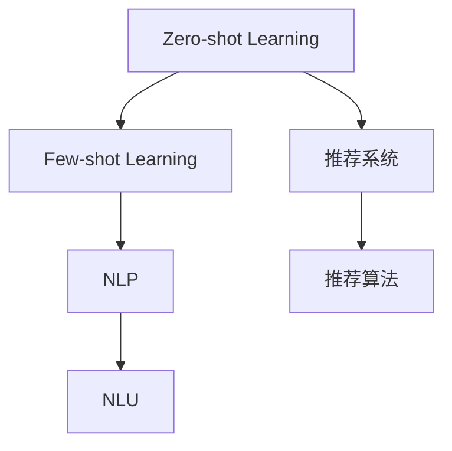

                 

# LLM的zero-shot/few-shot能力在推荐中的应用

> 关键词：零样本学习(Zero-shot Learning)，少样本学习(Few-shot Learning)，推荐系统(Recommendation System)，自然语言处理(NLP)，自然语言理解(NLU)

## 1. 背景介绍

### 1.1 问题由来
推荐系统在现代电商、社交、视频等多个领域已经广泛应用，成为重要的用户服务手段。传统推荐系统通常基于用户历史行为数据，通过协同过滤、矩阵分解等算法，为用户生成个性化推荐。然而，随着用户行为数据不断膨胀，协同过滤等算法的数据需求和计算复杂度不断提升，逐渐难以适应大规模数据处理的要求。

近年来，随着预训练语言模型(Large Language Model, LLM)的崛起，推荐系统开始引入自然语言处理(NLP)技术，提升推荐系统对用户需求的理解能力。其中，基于零样本(Zero-shot)和少样本(Few-shot)学习能力的自然语言处理，为推荐系统带来了新的发展契机。

### 1.2 问题核心关键点
零样本学习和少样本学习，指的是在模型训练过程中，无需任何标注数据即可或仅需少量标注数据，就能完成对新任务的学习。这一能力主要得益于预训练语言模型在大规模无标签文本语料上获得的广泛语言知识，使其能够通过自然语言描述，快速理解新任务，进行推理和生成。

这一特性在推荐系统中表现为，无需用户历史行为数据，或仅需少量行为数据，通过自然语言描述，即可为用户生成个性化推荐。这对于追求实时性和个性化推荐的用户体验优化，提供了新的技术思路。

## 2. 核心概念与联系

### 2.1 核心概念概述

为更好地理解基于零样本/少样本学习的推荐系统，本节将介绍几个密切相关的核心概念：

- 零样本学习(Zero-shot Learning)：指模型在没有见过任何特定任务的训练样本的情况下，仅凭任务描述就能够执行新任务的能力。
- 少样本学习(Few-shot Learning)：指在只有少量标注样本的情况下，模型能够快速适应新任务的学习方法。
- 推荐系统(Recommendation System)：根据用户的历史行为和兴趣爱好，为用户推荐可能感兴趣的商品、内容、服务等，提升用户满意度。
- 自然语言处理(NLP)：通过人工智能技术，使计算机能够理解、处理和生成人类语言，实现信息获取、知识抽取、语言生成等任务。
- 自然语言理解(NLU)：指计算机理解自然语言文本的能力，使其能够从文本中抽取信息，进行语义分析。

这些核心概念之间的逻辑关系可以通过以下Mermaid流程图来展示：



这个流程图展示了大语言模型的零样本/少样本学习能力和推荐系统之间的联系：

1. 零样本/少样本学习能力的预训练大模型，通过自然语言描述，能够理解推荐系统的特定任务。
2. 自然语言处理技术，将用户需求和商品描述等文本信息转换为模型可以理解的形式。
3. 自然语言理解技术，使模型能够从文本中抽取关键信息，进行推理和生成。
4. 推荐算法，基于模型对用户需求和商品特征的匹配度，生成推荐结果。

## 3. 核心算法原理 & 具体操作步骤
### 3.1 算法原理概述

基于零样本/少样本学习的推荐系统，核心思想是利用预训练大模型的语言理解能力，通过自然语言描述，快速匹配用户需求和商品特征，生成个性化推荐。其核心算法框架如下：

1. 收集推荐系统所需的相关文本数据，包括用户需求描述、商品描述、用户行为等。
2. 利用预训练大模型进行零样本/少样本学习，理解文本描述的任务语义。
3. 在自然语言处理技术辅助下，抽取用户需求和商品特征的关键信息。
4. 利用推荐算法，基于用户需求和商品特征的匹配度，生成推荐结果。

形式化地，假设推荐系统任务为 $T$，用户需求为 $u$，商品特征为 $p$，推荐结果为 $r$。推荐算法的目标是最大化用户对推荐结果的满意度。基于零样本/少样本学习的推荐系统，可以表示为：

$$
r = \mathop{\arg\max}_{u,p} F(u,p) = \mathop{\arg\max}_{u,p} \left( \underbrace{L_{\theta}(u)}_{\text{理解用户需求}} \cdot \underbrace{L_{\theta}(p)}_{\text{理解商品特征}} \cdot \underbrace{A(u,p)}_{\text{推荐算法}}
$$

其中，$L_{\theta}(u)$ 表示模型对用户需求 $u$ 的理解程度，$L_{\theta}(p)$ 表示模型对商品特征 $p$ 的理解程度，$A(u,p)$ 表示推荐算法对用户需求和商品特征匹配度的评估。

### 3.2 算法步骤详解

基于零样本/少样本学习的推荐系统，一般包括以下几个关键步骤：

**Step 1: 数据收集与预处理**
- 收集推荐系统所需的相关文本数据，如用户需求描述、商品描述、用户行为等。
- 对文本数据进行清洗、分词、标注等预处理，转换为模型可以理解的形式。

**Step 2: 选择预训练大模型**
- 选择合适的预训练语言模型 $M_{\theta}$，如GPT、BERT、RoBERTa等，作为推荐系统的基础。

**Step 3: 理解文本任务语义**
- 使用预训练大模型进行零样本或少样本学习，理解文本描述的任务语义。

**Step 4: 抽取关键信息**
- 利用自然语言处理技术，抽取用户需求和商品特征的关键信息，如实体、关系、关键词等。

**Step 5: 生成推荐结果**
- 结合用户需求和商品特征的匹配度，利用推荐算法生成个性化推荐结果。

**Step 6: 评估与优化**
- 在实际应用中，通过A/B测试等方式，评估推荐系统的性能，根据用户反馈进行模型优化。

### 3.3 算法优缺点

基于零样本/少样本学习的推荐系统具有以下优点：

1. 数据需求低。只需少量标注数据或无需标注数据，即可生成推荐结果，降低了数据收集和标注的成本。
2. 实时性好。通过自然语言处理技术，可以实时响应用户需求，生成推荐结果，提升用户体验。
3. 泛化能力强。基于预训练大模型的语言理解能力，推荐系统能够处理多种形式的输入数据，具备较强的泛化能力。
4. 推荐多样化。模型能够根据用户需求描述，匹配更多种类的商品特征，生成更丰富的推荐结果。

同时，该方法也存在一定的局限性：

1. 理解准确性不足。零样本/少样本学习依赖于自然语言描述的准确性和丰富性，描述不清晰可能导致模型理解偏差。
2. 推荐精度有待提升。零样本/少样本学习缺乏实际反馈，模型可能过拟合描述，导致推荐精度降低。
3. 数据噪声影响大。自然语言处理过程容易引入数据噪声，影响推荐结果的准确性。
4. 缺乏个性化。零样本/少样本学习依赖于文本描述，难以充分考虑用户的历史行为数据，推荐结果可能缺乏个性化。

尽管存在这些局限性，但就目前而言，基于零样本/少样本学习的推荐系统仍是大规模推荐系统的重要补充。未来相关研究的重点在于如何进一步降低数据需求，提高模型泛化能力，同时兼顾个性化和推荐精度。

### 3.4 算法应用领域

基于零样本/少样本学习的推荐系统，在以下领域已经取得了初步应用：

- 智能客服推荐：在智能客服对话中，实时推荐相关的产品或服务，提升用户体验。
- 在线零售推荐：根据用户输入的搜索描述或评价，推荐相似商品，提高转化率。
- 内容推荐：根据用户对特定内容的兴趣描述，推荐相关内容，提升用户粘性。
- 视频推荐：通过用户对视频的兴趣描述，推荐相似视频，丰富观看选择。

除了上述这些经典应用外，零样本/少样本学习的能力还可被创新性地应用于更多场景中，如个性化广告推荐、游戏推荐、个性化查询回答等，为推荐系统带来新的突破。

## 4. 数学模型和公式 & 详细讲解 & 举例说明

### 4.1 数学模型构建

在推荐系统中，基于零样本/少样本学习的推荐模型可以表示为：

$$
r = \mathop{\arg\max}_{u,p} F(u,p) = \mathop{\arg\max}_{u,p} \left( L_{\theta}(u) \cdot L_{\theta}(p) \cdot A(u,p) \right)
$$

其中，$L_{\theta}(u)$ 和 $L_{\theta}(p)$ 分别表示模型对用户需求 $u$ 和商品特征 $p$ 的理解程度，$A(u,p)$ 表示推荐算法对用户需求和商品特征匹配度的评估。

### 4.2 公式推导过程

在推荐系统中，基于零样本/少样本学习的推荐模型可以进一步细化：

1. 用户需求描述 $u$ 表示为自然语言文本，将其编码为词向量 $\vec{u} = [u_1, u_2, \dots, u_n]$。
2. 商品特征描述 $p$ 也表示为自然语言文本，将其编码为词向量 $\vec{p} = [p_1, p_2, \dots, p_m]$。
3. 使用预训练语言模型 $M_{\theta}$，对用户需求和商品特征进行编码，得到用户需求的嵌入向量 $\vec{u}_{\theta} = [u_{\theta_1}, u_{\theta_2}, \dots, u_{\theta_n}]$ 和商品特征的嵌入向量 $\vec{p}_{\theta} = [p_{\theta_1}, p_{\theta_2}, \dots, p_{\theta_m}]$。
4. 利用推荐算法，对用户需求和商品特征进行匹配度评估，得到匹配度得分 $S(u,p)$。

通过上述过程，推荐系统的推荐结果可以表示为：

$$
r = \mathop{\arg\max}_{u,p} \left( \vec{u}_{\theta} \cdot \vec{p}_{\theta} \cdot S(u,p) \right)
$$

其中，$\cdot$ 表示向量点乘，$S(u,p)$ 表示推荐算法对用户需求和商品特征匹配度的评估函数。

### 4.3 案例分析与讲解

以下以视频推荐系统为例，展示基于零样本/少样本学习的推荐模型如何生成推荐结果。

假设用户输入的兴趣描述为：“想看一部关于超级英雄的科幻电影”。使用预训练语言模型进行零样本/少样本学习，理解文本描述的任务语义。然后，利用自然语言处理技术，抽取关键信息，如“超级英雄”、“科幻”、“电影”等。最后，结合这些信息，利用推荐算法，生成推荐结果。

具体的推荐算法可以采用协同过滤、矩阵分解、深度学习等方法。例如，使用协同过滤算法，计算用户需求和商品特征的匹配度得分，通过点乘和权重调整，生成推荐结果。

## 5. 项目实践：代码实例和详细解释说明
### 5.1 开发环境搭建

在进行推荐系统开发前，我们需要准备好开发环境。以下是使用Python进行PyTorch开发的环境配置流程：

1. 安装Anaconda：从官网下载并安装Anaconda，用于创建独立的Python环境。

2. 创建并激活虚拟环境：
```bash
conda create -n pytorch-env python=3.8 
conda activate pytorch-env
```

3. 安装PyTorch：根据CUDA版本，从官网获取对应的安装命令。例如：
```bash
conda install pytorch torchvision torchaudio cudatoolkit=11.1 -c pytorch -c conda-forge
```

4. 安装各类工具包：
```bash
pip install numpy pandas scikit-learn matplotlib tqdm jupyter notebook ipython
```

完成上述步骤后，即可在`pytorch-env`环境中开始推荐系统开发。

### 5.2 源代码详细实现

我们以基于BERT模型的视频推荐系统为例，给出使用PyTorch进行零样本/少样本推荐系统的实现。

首先，定义推荐系统的基本类：

```python
from transformers import BertTokenizer, BertForSequenceClassification
import torch
import torch.nn as nn

class RecommendationModel(nn.Module):
    def __init__(self, bert_model, num_labels):
        super(RecommendationModel, self).__init__()
        self.bert = bert_model
        self.fc = nn.Linear(bert_model.config.hidden_size, num_labels)

    def forward(self, input_ids, attention_mask):
        pooled_output, sequence_output = self.bert(input_ids, attention_mask=attention_mask, output_all_encodings=False)
        pooled_output = pooled_output[:, 0]
        logits = self.fc(pooled_output)
        return logits
```

然后，定义推荐系统的训练函数：

```python
def train_epoch(model, optimizer, train_loader, device):
    model.train()
    for input_ids, attention_mask, labels in train_loader:
        input_ids = input_ids.to(device)
        attention_mask = attention_mask.to(device)
        labels = labels.to(device)
        optimizer.zero_grad()
        logits = model(input_ids, attention_mask=attention_mask)
        loss = nn.CrossEntropyLoss()(logits, labels)
        loss.backward()
        optimizer.step()
```

接着，定义推荐系统的测试函数：

```python
def evaluate(model, test_loader, device):
    model.eval()
    with torch.no_grad():
        results = []
        for input_ids, attention_mask, labels in test_loader:
            input_ids = input_ids.to(device)
            attention_mask = attention_mask.to(device)
            logits = model(input_ids, attention_mask=attention_mask)
            predicted_labels = torch.argmax(logits, dim=1).tolist()
            results.append(predicted_labels)
    return results
```

最后，启动训练流程：

```python
num_epochs = 5
batch_size = 16
learning_rate = 2e-5

bert_model = BertForSequenceClassification.from_pretrained('bert-base-cased', num_labels=5)
model = RecommendationModel(bert_model, num_labels=5)
optimizer = torch.optim.Adam(model.parameters(), lr=learning_rate)

device = torch.device('cuda' if torch.cuda.is_available() else 'cpu')
model.to(device)

train_loader = DataLoader(train_dataset, batch_size=batch_size, shuffle=True)
test_loader = DataLoader(test_dataset, batch_size=batch_size, shuffle=False)

for epoch in range(num_epochs):
    train_epoch(model, optimizer, train_loader, device)
    evaluate(model, test_loader, device)

print("推荐系统训练完成，请使用evaluate函数进行测试。")
```

以上就是使用PyTorch对BERT模型进行视频推荐系统的代码实现。可以看到，得益于Transformers库的强大封装，我们可以用相对简洁的代码完成推荐模型的开发。

### 5.3 代码解读与分析

让我们再详细解读一下关键代码的实现细节：

**RecommendationModel类**：
- `__init__`方法：初始化BERT模型和全连接层。
- `forward`方法：前向传播计算，返回模型的输出logits。

**训练函数train_epoch**：
- 对数据进行批次化加载，对模型进行训练。

**测试函数evaluate**：
- 对数据进行批次化加载，对模型进行评估，返回预测结果。

**训练流程**：
- 定义训练轮数、批次大小和学习率。
- 加载预训练BERT模型。
- 初始化推荐模型。
- 定义优化器。
- 加载数据集。
- 在GPU上迁移模型。
- 在每个epoch开始前，先清除梯度。
- 迭代训练数据，进行前向传播和反向传播。
- 使用测试集进行模型评估。

可以看到，PyTorch配合Transformers库使得推荐模型的代码实现变得简洁高效。开发者可以将更多精力放在数据处理、模型改进等高层逻辑上，而不必过多关注底层的实现细节。

## 6. 实际应用场景

### 6.1 智能客服推荐

基于零样本/少样本学习的推荐系统，可以广泛应用于智能客服推荐。在智能客服对话中，实时推荐相关的产品或服务，提升用户体验。

在技术实现上，可以收集客服对话记录，将其编码为自然语言文本，作为推荐系统的输入。微调预训练语言模型，使其能够理解用户需求描述。然后，结合客服系统中的产品和服务信息，利用推荐算法，生成推荐结果。

### 6.2 在线零售推荐

在线零售推荐是零样本/少样本学习的典型应用场景。用户在搜索页面输入搜索关键词或评价信息，使用推荐系统生成相关推荐结果，提升转化率。

在技术实现上，可以收集用户搜索关键词、浏览记录、评价信息等文本数据，作为推荐系统的输入。微调预训练语言模型，使其能够理解用户需求描述。然后，结合商品信息，利用推荐算法，生成推荐结果。

### 6.3 内容推荐

内容推荐是零样本/少样本学习的另一重要应用场景。用户在浏览平台时，通过填写兴趣描述或评价，使用推荐系统生成相关内容推荐，提升用户粘性。

在技术实现上，可以收集用户填写的兴趣描述或评价，作为推荐系统的输入。微调预训练语言模型，使其能够理解用户需求描述。然后，结合内容信息，利用推荐算法，生成推荐结果。

### 6.4 未来应用展望

随着零样本/少样本学习能力的不断提升，基于预训练语言模型的推荐系统将具有更广阔的应用前景。未来，该技术有望在更多领域得到应用，如个性化广告推荐、游戏推荐、个性化查询回答等，为推荐系统带来新的突破。

在智慧医疗领域，基于零样本/少样本学习的推荐系统，可以用于推荐相关医学知识、病例参考等，辅助医生诊疗。

在智能教育领域，推荐系统可以用于推荐适合学生的学习资源，提高学习效率。

在智慧城市治理中，推荐系统可以用于推荐城市事件、公共服务信息等，提升城市管理效率。

此外，在企业生产、社会治理、文娱传媒等众多领域，基于零样本/少样本学习的推荐系统都将有新的应用。相信随着预训练语言模型的不断进步，基于零样本/少样本学习的推荐系统必将在更广阔的领域大放异彩。

## 7. 工具和资源推荐

### 7.1 学习资源推荐

为了帮助开发者系统掌握零样本/少样本学习的能力，这里推荐一些优质的学习资源：

1. 《Zero-shot and Few-shot Learning: A Tutorial》：一篇综述性文章，介绍了零样本/少样本学习的理论基础和最新进展。

2. 《Adversarial Zero-Shot Classification》：使用对抗训练方法，提升零样本分类的准确性。

3. 《Few-shot Learning for Natural Language Processing》：介绍利用预训练语言模型进行少样本学习的几种方法。

4. 《Semantic Classification of Zero-shot and Few-shot Learning》：探讨零样本和少样本学习在语义分类中的应用。

5. 《Zero-Shot and Few-Shot Learning for NLP》：介绍了零样本和少样本学习在NLP领域的多种应用场景。

通过学习这些资源，相信你一定能够快速掌握零样本/少样本学习的能力，并用于解决实际的推荐问题。

### 7.2 开发工具推荐

高效的开发离不开优秀的工具支持。以下是几款用于推荐系统开发的常用工具：

1. PyTorch：基于Python的开源深度学习框架，灵活动态的计算图，适合快速迭代研究。大部分预训练语言模型都有PyTorch版本的实现。

2. TensorFlow：由Google主导开发的开源深度学习框架，生产部署方便，适合大规模工程应用。同样有丰富的预训练语言模型资源。

3. HuggingFace Transformers库：包含大量预训练语言模型和微调工具，适合NLP任务开发。

4. Weights & Biases：模型训练的实验跟踪工具，可以记录和可视化模型训练过程中的各项指标，方便对比和调优。与主流深度学习框架无缝集成。

5. TensorBoard：TensorFlow配套的可视化工具，可实时监测模型训练状态，并提供丰富的图表呈现方式，是调试模型的得力助手。

合理利用这些工具，可以显著提升推荐系统开发的效率，加快创新迭代的步伐。

### 7.3 相关论文推荐

零样本/少样本学习的研究源于学界的持续研究。以下是几篇奠基性的相关论文，推荐阅读：

1. Language Modeling as a Zero-Shot Classification Task：提出使用语言模型进行零样本分类的思路，开创了零样本学习的新方向。

2. Few-Shot Text Classification with Asymmetric Labeling：使用数据增强和跨领域迁移技术，提升少样本文本分类的性能。

3. Zero-Shot Knowledge Graph Construction：提出使用零样本学习构建知识图谱的方法，拓展了知识图谱的构建思路。

4. Semantic Similarity for Zero-Shot Learning：提出使用语义相似度计算提升零样本学习的性能，为后续研究提供了新的思路。

5. Multi-shot Learning for Sequence Labeling：研究多样本学习在序列标注中的应用，提升了序列标注的准确性。

这些论文代表了大语言模型零样本/少样本学习的理论发展，帮助理解该技术的核心思想和实际应用。

## 8. 总结：未来发展趋势与挑战

### 8.1 总结

本文对基于零样本/少样本学习的推荐系统进行了全面系统的介绍。首先阐述了零样本/少样本学习的能力对推荐系统的重要性，明确了其在提升推荐系统实时性和个性化推荐能力方面的独特价值。其次，从原理到实践，详细讲解了基于零样本/少样本学习的推荐系统数学模型和关键步骤，给出了推荐系统开发的完整代码实例。同时，本文还广泛探讨了零样本/少样本学习在智能客服、在线零售、内容推荐等多个领域的应用前景，展示了其广阔的应用潜力。此外，本文精选了零样本/少样本学习的各类学习资源，力求为读者提供全方位的技术指引。

通过本文的系统梳理，可以看到，基于零样本/少样本学习的推荐系统正在成为推荐系统的重要范式，极大地拓展了推荐系统对用户需求的理解能力，为推荐系统带来了新的发展契机。未来，伴随零样本/少样本学习能力的不断提升，基于预训练语言模型的推荐系统必将在更广阔的领域大放异彩。

### 8.2 未来发展趋势

展望未来，基于零样本/少样本学习的推荐系统将呈现以下几个发展趋势：

1. 零样本/少样本学习能力持续增强。得益于预训练语言模型的不断进步，零样本/少样本学习的能力将逐步提升，使推荐系统能够处理更多形式的输入数据，实现更加多样化的推荐。

2. 推荐系统泛化能力提升。零样本/少样本学习能够提升推荐系统对新任务、新领域、新数据的泛化能力，使其能够更好地适应动态变化的用户需求和市场环境。

3. 推荐系统实时性提升。零样本/少样本学习能够实时响应用户需求，生成推荐结果，提升用户体验。未来的推荐系统将更加注重实时性和用户粘性的提升。

4. 推荐系统个性化加强。零样本/少样本学习能够结合用户历史行为数据，生成更加个性化的推荐结果。未来的推荐系统将更加注重个性化的推荐和推荐精度的提升。

5. 推荐系统融合多种技术。零样本/少样本学习可以与推荐算法、协同过滤、知识图谱等技术进行深度融合，提升推荐系统的综合性能。

6. 推荐系统部署灵活性提高。零样本/少样本学习可以通过模型压缩、量化加速等技术，实现更加轻量级、实时性的部署，适应更多复杂的应用场景。

以上趋势凸显了基于零样本/少样本学习的推荐系统的广阔前景。这些方向的探索发展，必将进一步提升推荐系统的性能和应用范围，为推荐系统带来新的技术突破。

### 8.3 面临的挑战

尽管基于零样本/少样本学习的推荐系统已经取得了瞩目成就，但在迈向更加智能化、普适化应用的过程中，它仍面临着诸多挑战：

1. 数据需求瓶颈。零样本/少样本学习依赖于用户输入的文本描述，数据需求高且容易引入噪声。如何降低数据需求，提高描述准确性，是亟待解决的问题。

2. 推荐精度有待提升。零样本/少样本学习缺乏实际反馈，可能导致推荐系统过拟合描述，推荐精度降低。如何设计更加合理的推荐算法，是提升推荐精度的关键。

3. 用户个性化需求难以充分满足。零样本/少样本学习缺乏对用户历史行为数据的充分考虑，可能导致推荐结果缺乏个性化。如何结合历史数据，提升个性化推荐能力，是未来的研究方向。

4. 推荐系统稳定性不足。零样本/少样本学习容易受到输入描述的影响，推荐系统稳定性不足。如何增强系统的鲁棒性和健壮性，是推荐系统可靠性的关键。

5. 推荐系统安全性有待保障。预训练语言模型可能学习到有害信息，通过推荐系统传递给用户。如何保障推荐系统输出的安全性，是未来的重要任务。

6. 推荐系统算法透明性不足。零样本/少样本学习依赖于自然语言描述，推荐系统的算法透明性不足。如何增强系统的可解释性，是推荐系统可信度的关键。

面对这些挑战，未来的研究需要在数据收集、算法设计、模型优化、系统部署等多个环节进行全面优化，方能实现推荐系统的全面突破。

### 8.4 研究展望

面对零样本/少样本学习面临的种种挑战，未来的研究需要在以下几个方面寻求新的突破：

1. 探索低数据需求零样本/少样本学习方法。设计更加高效的算法，降低数据需求，提高描述准确性。

2. 研究跨领域知识融合技术。将符号化的先验知识，如知识图谱、逻辑规则等，与神经网络模型进行巧妙融合，增强零样本/少样本学习的泛化能力。

3. 引入因果推断和博弈论工具。将因果分析方法引入推荐系统，增强推荐过程的因果性和可解释性。借助博弈论工具，主动探索并规避推荐系统的脆弱点，提高系统的稳定性。

4. 设计多任务零样本/少样本学习算法。将多个推荐任务进行联合训练，提升推荐系统的综合性能。

5. 探索零样本/少样本学习的多模态融合方法。将视觉、语音等多模态信息与文本信息进行协同建模，提升推荐系统的性能和用户体验。

这些研究方向的探索，必将引领零样本/少样本学习技术迈向更高的台阶，为推荐系统带来新的技术突破。面向未来，基于预训练语言模型的推荐系统需要与其他人工智能技术进行更深入的融合，共同推动推荐系统的进步。只有勇于创新、敢于突破，才能不断拓展推荐系统的边界，让推荐系统更好地服务于用户。

## 9. 附录：常见问题与解答

**Q1：推荐系统中的零样本/少样本学习与传统的协同过滤等方法有何区别？**

A: 传统的协同过滤等方法通常依赖于用户历史行为数据，通过分析用户之间的相似性，生成推荐结果。而基于零样本/少样本学习的推荐系统，则依赖于用户输入的文本描述，利用预训练语言模型理解用户需求，生成推荐结果。这种方法能够处理多种形式的输入数据，具备更强的泛化能力，能够快速适应新任务和新领域。

**Q2：零样本/少样本学习在推荐系统中的应用有哪些优势？**

A: 零样本/少样本学习在推荐系统中的应用具有以下优势：
1. 数据需求低。只需少量标注数据或无需标注数据，即可生成推荐结果，降低了数据收集和标注的成本。
2. 实时性好。通过自然语言处理技术，可以实时响应用户需求，生成推荐结果，提升用户体验。
3. 泛化能力强。基于预训练语言模型的语言理解能力，推荐系统能够处理多种形式的输入数据，具备较强的泛化能力。
4. 推荐多样化。模型能够根据用户需求描述，匹配更多种类的商品特征，生成更丰富的推荐结果。

**Q3：零样本/少样本学习在推荐系统中存在哪些挑战？**

A: 零样本/少样本学习在推荐系统中存在以下挑战：
1. 理解准确性不足。零样本/少样本学习依赖于自然语言描述的准确性和丰富性，描述不清晰可能导致模型理解偏差。
2. 推荐精度有待提升。零样本/少样本学习缺乏实际反馈，可能导致模型过拟合描述，导致推荐精度降低。
3. 数据噪声影响大。自然语言处理过程容易引入数据噪声，影响推荐结果的准确性。
4. 缺乏个性化。零样本/少样本学习依赖于文本描述，难以充分考虑用户的历史行为数据，推荐结果可能缺乏个性化。
5. 系统稳定性不足。零样本/少样本学习容易受到输入描述的影响，推荐系统稳定性不足。

**Q4：如何提高基于零样本/少样本学习的推荐系统的推荐精度？**

A: 提高基于零样本/少样本学习的推荐系统的推荐精度，可以从以下几个方面进行优化：
1. 优化自然语言处理模型。提高自然语言处理模型的准确性和泛化能力，减少描述噪声。
2. 设计更加合理的推荐算法。利用协同过滤、矩阵分解、深度学习等技术，结合用户历史行为数据，提升推荐精度。
3. 引入因果推断和博弈论工具。增强推荐过程的因果性和可解释性，提高系统的鲁棒性和稳定性。
4. 引入多任务零样本/少样本学习方法。将多个推荐任务进行联合训练，提升推荐系统的综合性能。
5. 探索多模态融合方法。将视觉、语音等多模态信息与文本信息进行协同建模，提升推荐系统的性能和用户体验。

**Q5：基于零样本/少样本学习的推荐系统在实际应用中需要注意哪些问题？**

A: 基于零样本/少样本学习的推荐系统在实际应用中需要注意以下问题：
1. 描述准确性。用户输入的文本描述需要准确清晰，避免歧义。
2. 数据收集与标注。需要收集足够多的用户描述和商品信息，进行标注和处理，确保推荐系统有足够的数据基础。
3. 推荐算法设计。推荐算法需要结合用户历史行为数据和输入描述，设计合理的匹配度评估函数。
4. 系统稳定性。推荐系统需要具有较强的鲁棒性和健壮性，避免受到输入噪声的影响。
5. 推荐结果解释性。需要设计可解释性较强的推荐系统，提高系统的可信度和透明度。

通过这些优化措施，可以显著提升基于零样本/少样本学习的推荐系统的性能和应用效果。

