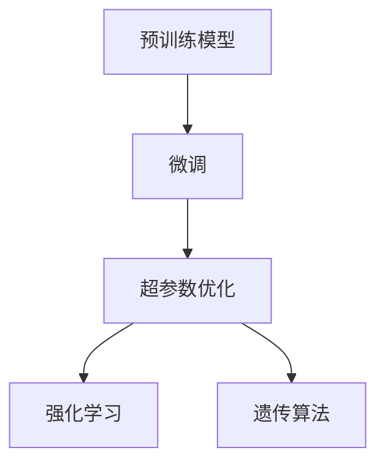

                 

# LLM的元学习方法与实践总结

> 关键词：

# 1. 背景介绍

在人工智能的浪潮中，大规模语言模型(LLM)因其卓越的泛化能力和语言理解力，迅速成为自然语言处理(NLP)领域的核心工具。然而，针对具体任务，LLM需要进一步的微调来提升性能。传统的微调方法往往耗时耗力，且效果不稳定。元学习方法通过自动化调整模型超参数，提升了微调效率和效果。本文将对LLM的元学习方法进行全面系统地总结，涵盖其原理、步骤、优缺点以及应用前景。

## 2. 核心概念与联系

### 2.1 核心概念概述

为理解元学习方法，我们首先介绍几个关键概念：

- **大规模语言模型(LLM)**：通过自监督或监督学习，在大规模文本数据上进行预训练的深度学习模型。如BERT、GPT-3等。
- **微调(Fine-tuning)**：在预训练模型的基础上，使用下游任务的数据集进行有监督学习，提升模型在该任务上的表现。
- **元学习(Meta-learning)**：通过自动化调整模型超参数，提高微调过程的效率和效果。例如，Hyperparameter Optimization。
- **超参数调整**：手动或自动地选择和调整模型的超参数，如学习率、批大小、迭代轮数等，以获得最佳性能。
- **强化学习(Reinforcement Learning)**：通过试错过程，学习最优超参数。
- **遗传算法(Genetic Algorithm)**：通过模拟进化过程，搜索最优超参数。

### 2.2 核心概念原理和架构的 Mermaid 流程图



该图展示了预训练模型、微调、超参数优化、强化学习和遗传算法之间的关系。预训练模型提供初始化的语言表示能力，微调在少量标注数据上调整模型以匹配任务，超参数优化在微调过程中动态调整模型参数，以提升模型性能。强化学习和遗传算法则通过模拟进化过程，寻找最优超参数。

## 3. 核心算法原理 & 具体操作步骤

### 3.1 算法原理概述

元学习方法通过自动化调整模型超参数，提升微调过程的效率和效果。其核心思想是：利用先前的经验或数据，通过搜索最优的超参数组合，加速模型训练，提升模型性能。

形式化地，假设有$N$个不同的任务$\mathcal{T}$，每个任务有训练集$D_i$和验证集$D_i^v$。预训练模型为$M_\theta$，其中$\theta$为模型参数。微调的优化目标为：

$$
\theta^* = \arg\min_\theta \sum_{i=1}^N \mathcal{L}_i(M_\theta, D_i)
$$

其中$\mathcal{L}_i$为任务$i$的损失函数。

元学习方法通过在训练过程中自动调整超参数$\eta$，以找到最优的$\theta$。常见的超参数包括学习率、批大小、迭代轮数、正则化强度等。优化过程一般包含以下步骤：

1. 初始化超参数$\eta_0$。
2. 在微调过程中，根据验证集$D_i^v$的表现，动态调整超参数。
3. 根据优化目标$\mathcal{L}_i$，更新模型参数$\theta$。
4. 重复步骤2和3，直到模型收敛。

### 3.2 算法步骤详解

基于元学习的方法通常包括以下关键步骤：

**Step 1: 初始化模型和超参数**

- 选择预训练模型$M_\theta$作为初始化参数。
- 确定超参数搜索空间，如学习率$\eta$、批大小$bs$、迭代轮数$epochs$等。

**Step 2: 设计超参数优化策略**

- 使用随机搜索(Random Search)或贝叶斯优化(Bayesian Optimization)等方法，搜索最优超参数。
- 确定超参数更新频率，如每次迭代后更新、每轮验证后更新等。

**Step 3: 执行微调过程**

- 将训练集$D_i$分批次输入模型，前向传播计算损失函数。
- 反向传播计算参数梯度，根据设定的优化算法和学习率更新模型参数。
- 周期性在验证集$D_i^v$上评估模型性能，根据性能指标决定是否触发超参数更新。
- 重复上述步骤直至满足预设的迭代轮数或性能标准。

**Step 4: 测试和部署**

- 在测试集上评估微调后模型$M_{\hat{\theta}}$的性能。
- 使用微调后的模型对新样本进行推理预测，集成到实际的应用系统中。

### 3.3 算法优缺点

元学习方法具有以下优点：

- **自动化超参数调整**：自动搜索最优超参数，提升微调效率。
- **通用适用**：适用于各种NLP下游任务，如分类、匹配、生成等。
- **减少人工干预**：通过自动化搜索，减少了人工调整超参数的工作量。
- **提高模型泛化性**：优化过程根据验证集表现，提升了模型的泛化能力。

同时，元学习方法也存在以下局限性：

- **计算开销大**：搜索最优超参数需要大量计算资源，尤其是贝叶斯优化等方法。
- **可能过拟合**：超参数优化可能导致模型在训练集上过拟合，影响泛化性能。
- **需要大量数据**：优化过程需要足够的数据量和验证集，否则可能无法找到最优超参数。
- **可能陷入局部最优**：搜索过程可能陷入局部最优，无法找到全局最优超参数。

尽管存在这些局限性，但就目前而言，元学习方法是大规模语言模型微调的重要范式。未来相关研究的重点在于如何进一步降低计算开销，提高超参数搜索的效率和效果，同时兼顾模型的泛化性和可解释性。

### 3.4 算法应用领域

基于元学习的大语言模型微调方法，在NLP领域已经得到了广泛的应用，覆盖了几乎所有常见任务，例如：

- 文本分类：如情感分析、主题分类、意图识别等。通过微调使模型学习文本-标签映射。
- 命名实体识别：识别文本中的人名、地名、机构名等特定实体。通过微调使模型掌握实体边界和类型。
- 关系抽取：从文本中抽取实体之间的语义关系。通过微调使模型学习实体-关系三元组。
- 问答系统：对自然语言问题给出答案。将问题-答案对作为微调数据，训练模型学习匹配答案。
- 机器翻译：将源语言文本翻译成目标语言。通过微调使模型学习语言-语言映射。
- 文本摘要：将长文本压缩成简短摘要。将文章-摘要对作为微调数据，使模型学习抓取要点。
- 对话系统：使机器能够与人自然对话。将多轮对话历史作为上下文，微调模型进行回复生成。

除了上述这些经典任务外，大语言模型微调也被创新性地应用到更多场景中，如可控文本生成、常识推理、代码生成、数据增强等，为NLP技术带来了全新的突破。随着预训练模型和微调方法的不断进步，相信基于元学习的方法将在更广泛的应用领域大放异彩。

## 4. 数学模型和公式 & 详细讲解

### 4.1 数学模型构建

在元学习方法中，通常使用梯度下降等优化算法来最小化经验风险。假设预训练模型为$M_{\theta}$，其中$\theta$为模型参数。给定任务$i$的训练集$D_i$和验证集$D_i^v$，微调的优化目标为：

$$
\theta^* = \arg\min_\theta \sum_{i=1}^N \mathcal{L}_i(M_\theta, D_i)
$$

其中$\mathcal{L}_i$为任务$i$的损失函数。常见的损失函数包括交叉熵损失、均方误差损失等。

### 4.2 公式推导过程

以二分类任务为例，我们推导交叉熵损失函数及其梯度的计算公式。

假设模型$M_{\theta}$在输入$x$上的输出为$\hat{y}=M_{\theta}(x) \in [0,1]$，表示样本属于正类的概率。真实标签$y \in \{0,1\}$。则二分类交叉熵损失函数定义为：

$$
\ell(M_{\theta}(x),y) = -[y\log \hat{y} + (1-y)\log (1-\hat{y})]
$$

将其代入经验风险公式，得：

$$
\mathcal{L}(\theta) = -\frac{1}{N}\sum_{i=1}^N [y_i\log M_{\theta}(x_i)+(1-y_i)\log(1-M_{\theta}(x_i))]
$$

根据链式法则，损失函数对参数$\theta_k$的梯度为：

$$
\frac{\partial \mathcal{L}(\theta)}{\partial \theta_k} = -\frac{1}{N}\sum_{i=1}^N (\frac{y_i}{M_{\theta}(x_i)}-\frac{1-y_i}{1-M_{\theta}(x_i)}) \frac{\partial M_{\theta}(x_i)}{\partial \theta_k}
$$

其中$\frac{\partial M_{\theta}(x_i)}{\partial \theta_k}$可进一步递归展开，利用自动微分技术完成计算。

在得到损失函数的梯度后，即可带入参数更新公式，完成模型的迭代优化。重复上述过程直至收敛，最终得到适应下游任务的最优模型参数$\theta^*$。

### 4.3 案例分析与讲解

以BERT模型的元学习微调为例，我们分析其在命名实体识别(NER)任务上的应用。

首先，将预训练BERT模型作为初始化参数，设计如下损失函数：

$$
\mathcal{L}(\theta) = -\frac{1}{N}\sum_{i=1}^N \sum_{j=1}^{N_i} \mathbb{I}(y_j == POS)\log P_{y_j|x_i} + \mathbb{I}(y_j == NEG)\log(1-P_{y_j|x_i})
$$

其中$x_i$为输入文本，$y_j$为第$j$个实体的标注标签，$POS$和$NEG$分别表示实体和背景。$P_{y_j|x_i}$为模型预测实体为$y_j$的概率。

然后，使用梯度下降等优化算法，最小化损失函数，更新模型参数。在微调过程中，根据验证集表现，动态调整学习率等超参数，以优化模型性能。

## 5. 项目实践：代码实例和详细解释说明

### 5.1 开发环境搭建

在进行元学习微调实践前，我们需要准备好开发环境。以下是使用Python进行PyTorch开发的环境配置流程：

1. 安装Anaconda：从官网下载并安装Anaconda，用于创建独立的Python环境。

2. 创建并激活虚拟环境：
```bash
conda create -n pytorch-env python=3.8 
conda activate pytorch-env
```

3. 安装PyTorch：根据CUDA版本，从官网获取对应的安装命令。例如：
```bash
conda install pytorch torchvision torchaudio cudatoolkit=11.1 -c pytorch -c conda-forge
```

4. 安装Transformers库：
```bash
pip install transformers
```

5. 安装各类工具包：
```bash
pip install numpy pandas scikit-learn matplotlib tqdm jupyter notebook ipython
```

完成上述步骤后，即可在`pytorch-env`环境中开始元学习微调实践。

### 5.2 源代码详细实现

下面以BERT模型在命名实体识别(NER)任务上的元学习微调为例，给出使用Transformers库的PyTorch代码实现。

首先，定义NER任务的数据处理函数：

```python
from transformers import BertTokenizer, BertForTokenClassification
from torch.utils.data import Dataset
import torch

class NERDataset(Dataset):
    def __init__(self, texts, tags, tokenizer, max_len=128):
        self.texts = texts
        self.tags = tags
        self.tokenizer = tokenizer
        self.max_len = max_len
        
    def __len__(self):
        return len(self.texts)
    
    def __getitem__(self, item):
        text = self.texts[item]
        tags = self.tags[item]
        
        encoding = self.tokenizer(text, return_tensors='pt', max_length=self.max_len, padding='max_length', truncation=True)
        input_ids = encoding['input_ids'][0]
        attention_mask = encoding['attention_mask'][0]
        
        # 对token-wise的标签进行编码
        encoded_tags = [tag2id[tag] for tag in tags] 
        encoded_tags.extend([tag2id['O']] * (self.max_len - len(encoded_tags)))
        labels = torch.tensor(encoded_tags, dtype=torch.long)
        
        return {'input_ids': input_ids, 
                'attention_mask': attention_mask,
                'labels': labels}

# 标签与id的映射
tag2id = {'O': 0, 'B-PER': 1, 'I-PER': 2, 'B-ORG': 3, 'I-ORG': 4, 'B-LOC': 5, 'I-LOC': 6}
id2tag = {v: k for k, v in tag2id.items()}

# 创建dataset
tokenizer = BertTokenizer.from_pretrained('bert-base-cased')

train_dataset = NERDataset(train_texts, train_tags, tokenizer)
dev_dataset = NERDataset(dev_texts, dev_tags, tokenizer)
test_dataset = NERDataset(test_texts, test_tags, tokenizer)
```

然后，定义模型和优化器：

```python
from transformers import BertForTokenClassification, AdamW

model = BertForTokenClassification.from_pretrained('bert-base-cased', num_labels=len(tag2id))

optimizer = AdamW(model.parameters(), lr=2e-5)
```

接着，定义训练和评估函数：

```python
from torch.utils.data import DataLoader
from tqdm import tqdm
from sklearn.metrics import classification_report

device = torch.device('cuda') if torch.cuda.is_available() else torch.device('cpu')
model.to(device)

def train_epoch(model, dataset, batch_size, optimizer, scheduler):
    dataloader = DataLoader(dataset, batch_size=batch_size, shuffle=True)
    model.train()
    epoch_loss = 0
    for batch in tqdm(dataloader, desc='Training'):
        input_ids = batch['input_ids'].to(device)
        attention_mask = batch['attention_mask'].to(device)
        labels = batch['labels'].to(device)
        model.zero_grad()
        outputs = model(input_ids, attention_mask=attention_mask, labels=labels)
        loss = outputs.loss
        epoch_loss += loss.item()
        loss.backward()
        optimizer.step()
        scheduler.step()
    return epoch_loss / len(dataloader)

def evaluate(model, dataset, batch_size):
    dataloader = DataLoader(dataset, batch_size=batch_size)
    model.eval()
    preds, labels = [], []
    with torch.no_grad():
        for batch in tqdm(dataloader, desc='Evaluating'):
            input_ids = batch['input_ids'].to(device)
            attention_mask = batch['attention_mask'].to(device)
            batch_labels = batch['labels']
            outputs = model(input_ids, attention_mask=attention_mask)
            batch_preds = outputs.logits.argmax(dim=2).to('cpu').tolist()
            batch_labels = batch_labels.to('cpu').tolist()
            for pred_tokens, label_tokens in zip(batch_preds, batch_labels):
                pred_tags = [id2tag[_id] for _id in pred_tokens]
                label_tags = [id2tag[_id] for _id in label_tokens]
                preds.append(pred_tags[:len(label_tags)])
                labels.append(label_tags)
                
    print(classification_report(labels, preds))
```

最后，启动训练流程并在测试集上评估：

```python
epochs = 5
batch_size = 16
scheduler = torch.optim.lr_scheduler.CosineAnnealingLR(optimizer, T_max=epochs)

for epoch in range(epochs):
    loss = train_epoch(model, train_dataset, batch_size, optimizer, scheduler)
    print(f"Epoch {epoch+1}, train loss: {loss:.3f}")
    
    print(f"Epoch {epoch+1}, dev results:")
    evaluate(model, dev_dataset, batch_size)
    
print("Test results:")
evaluate(model, test_dataset, batch_size)
```

以上就是使用PyTorch对BERT进行命名实体识别任务元学习微调的完整代码实现。可以看到，得益于Transformers库的强大封装，我们可以用相对简洁的代码完成BERT模型的加载和微调。

### 5.3 代码解读与分析

让我们再详细解读一下关键代码的实现细节：

**NERDataset类**：
- `__init__`方法：初始化文本、标签、分词器等关键组件。
- `__len__`方法：返回数据集的样本数量。
- `__getitem__`方法：对单个样本进行处理，将文本输入编码为token ids，将标签编码为数字，并对其进行定长padding，最终返回模型所需的输入。

**tag2id和id2tag字典**：
- 定义了标签与数字id之间的映射关系，用于将token-wise的预测结果解码回真实的标签。

**训练和评估函数**：
- 使用PyTorch的DataLoader对数据集进行批次化加载，供模型训练和推理使用。
- 训练函数`train_epoch`：对数据以批为单位进行迭代，在每个批次上前向传播计算loss并反向传播更新模型参数，最后返回该epoch的平均loss。
- 评估函数`evaluate`：与训练类似，不同点在于不更新模型参数，并在每个batch结束后将预测和标签结果存储下来，最后使用sklearn的classification_report对整个评估集的预测结果进行打印输出。

**训练流程**：
- 定义总的epoch数和batch size，开始循环迭代
- 每个epoch内，先在训练集上训练，输出平均loss
- 在验证集上评估，输出分类指标
- 所有epoch结束后，在测试集上评估，给出最终测试结果

可以看到，PyTorch配合Transformers库使得BERT微调的代码实现变得简洁高效。开发者可以将更多精力放在数据处理、模型改进等高层逻辑上，而不必过多关注底层的实现细节。

当然，工业级的系统实现还需考虑更多因素，如模型的保存和部署、超参数的自动搜索、更灵活的任务适配层等。但核心的元学习范式基本与此类似。

## 6. 实际应用场景

### 6.1 智能客服系统

基于元学习的对话技术，可以广泛应用于智能客服系统的构建。传统客服往往需要配备大量人力，高峰期响应缓慢，且一致性和专业性难以保证。而使用元学习后的对话模型，可以7x24小时不间断服务，快速响应客户咨询，用自然流畅的语言解答各类常见问题。

在技术实现上，可以收集企业内部的历史客服对话记录，将问题和最佳答复构建成监督数据，在此基础上对预训练对话模型进行元学习微调。元学习后的对话模型能够自动理解用户意图，匹配最合适的答案模板进行回复。对于客户提出的新问题，还可以接入检索系统实时搜索相关内容，动态组织生成回答。如此构建的智能客服系统，能大幅提升客户咨询体验和问题解决效率。

### 6.2 金融舆情监测

金融机构需要实时监测市场舆论动向，以便及时应对负面信息传播，规避金融风险。传统的人工监测方式成本高、效率低，难以应对网络时代海量信息爆发的挑战。基于元学习文本分类和情感分析技术，为金融舆情监测提供了新的解决方案。

具体而言，可以收集金融领域相关的新闻、报道、评论等文本数据，并对其进行主题标注和情感标注。在此基础上对预训练语言模型进行元学习微调，使其能够自动判断文本属于何种主题，情感倾向是正面、中性还是负面。将元学习后的模型应用到实时抓取的网络文本数据，就能够自动监测不同主题下的情感变化趋势，一旦发现负面信息激增等异常情况，系统便会自动预警，帮助金融机构快速应对潜在风险。

### 6.3 个性化推荐系统

当前的推荐系统往往只依赖用户的历史行为数据进行物品推荐，无法深入理解用户的真实兴趣偏好。基于元学习个性化推荐系统可以更好地挖掘用户行为背后的语义信息，从而提供更精准、多样的推荐内容。

在实践中，可以收集用户浏览、点击、评论、分享等行为数据，提取和用户交互的物品标题、描述、标签等文本内容。将文本内容作为模型输入，用户的后续行为（如是否点击、购买等）作为监督信号，在此基础上元学习微调预训练语言模型。元学习后的模型能够从文本内容中准确把握用户的兴趣点。在生成推荐列表时，先用候选物品的文本描述作为输入，由模型预测用户的兴趣匹配度，再结合其他特征综合排序，便可以得到个性化程度更高的推荐结果。

### 6.4 未来应用展望

随着元学习技术的不断发展，基于元学习的方法将在更多领域得到应用，为传统行业带来变革性影响。

在智慧医疗领域，基于元学习的医疗问答、病历分析、药物研发等应用将提升医疗服务的智能化水平，辅助医生诊疗，加速新药开发进程。

在智能教育领域，元学习可应用于作业批改、学情分析、知识推荐等方面，因材施教，促进教育公平，提高教学质量。

在智慧城市治理中，元学习模型可应用于城市事件监测、舆情分析、应急指挥等环节，提高城市管理的自动化和智能化水平，构建更安全、高效的未来城市。

此外，在企业生产、社会治理、文娱传媒等众多领域，基于元学习的人工智能应用也将不断涌现，为经济社会发展注入新的动力。相信随着技术的日益成熟，元学习范式将成为人工智能落地应用的重要范式，推动人工智能技术向更广阔的领域加速渗透。

## 7. 工具和资源推荐

### 7.1 学习资源推荐

为了帮助开发者系统掌握元学习方法的理论基础和实践技巧，这里推荐一些优质的学习资源：

1. 《Deep Learning for NLP》书籍：讲述深度学习在自然语言处理中的应用，包括微调、元学习等内容。
2. 《Transformers: State-of-the-Art NLP》论文：介绍Transformer结构及其在NLP中的应用，包括元学习微调方法。
3. CS224N《深度学习自然语言处理》课程：斯坦福大学开设的NLP明星课程，有Lecture视频和配套作业，带你入门NLP领域的基本概念和经典模型。
4. 《Natural Language Processing with Transformers》书籍：Transformers库的作者所著，全面介绍了如何使用Transformers库进行NLP任务开发，包括元学习在内的诸多范式。
5. HuggingFace官方文档：Transformers库的官方文档，提供了海量预训练模型和完整的元学习微调样例代码，是上手实践的必备资料。

通过对这些资源的学习实践，相信你一定能够快速掌握元学习的精髓，并用于解决实际的NLP问题。

### 7.2 开发工具推荐

高效的开发离不开优秀的工具支持。以下是几款用于元学习微调开发的常用工具：

1. PyTorch：基于Python的开源深度学习框架，灵活动态的计算图，适合快速迭代研究。大部分预训练语言模型都有PyTorch版本的实现。
2. TensorFlow：由Google主导开发的开源深度学习框架，生产部署方便，适合大规模工程应用。同样有丰富的预训练语言模型资源。
3. Transformers库：HuggingFace开发的NLP工具库，集成了众多SOTA语言模型，支持PyTorch和TensorFlow，是进行元学习微调任务的开发利器。
4. Weights & Biases：模型训练的实验跟踪工具，可以记录和可视化模型训练过程中的各项指标，方便对比和调优。与主流深度学习框架无缝集成。
5. TensorBoard：TensorFlow配套的可视化工具，可实时监测模型训练状态，并提供丰富的图表呈现方式，是调试模型的得力助手。
6. Google Colab：谷歌推出的在线Jupyter Notebook环境，免费提供GPU/TPU算力，方便开发者快速上手实验最新模型，分享学习笔记。

合理利用这些工具，可以显著提升元学习微调任务的开发效率，加快创新迭代的步伐。

### 7.3 相关论文推荐

元学习方法在NLP领域的研究和应用已经取得了显著进展，以下是几篇奠基性的相关论文，推荐阅读：

1. AutoML: The Search for Optimal Machine Learning Pipeline Components：介绍自动机器学习(AutoML)的概念和应用，包括超参数自动搜索。
2. An Introduction to Automated Machine Learning：深入浅出地介绍自动化机器学习(AutoML)的基本概念和关键技术。
3. A Tutorial on Reinforcement Learning for Deep Learning：介绍强化学习在深度学习中的应用，包括自动超参数搜索。
4. Meta-Learning with Self-Adversarial Network：提出基于对抗网络(Meta-SAN)的元学习框架，通过对抗训练提升超参数搜索效率。
5. Model-Agnostic Meta-Learning for Fast Adaptive DNNs：提出模型无关的元学习算法(MAML)，适用于各种深度神经网络模型。
6. Deep Meta-Learning with Online Prototypical Networks：提出在线原型网络(OPNET)，在在线数据流上实现快速元学习。

这些论文代表了大规模语言模型元学习微调技术的发展脉络。通过学习这些前沿成果，可以帮助研究者把握学科前进方向，激发更多的创新灵感。

## 8. 总结：未来发展趋势与挑战

### 8.1 总结

本文对基于元学习的大语言模型微调方法进行了全面系统的总结。首先阐述了元学习方法的背景和意义，明确了元学习在微调过程的自动化超参数调整方面的独特价值。其次，从原理到实践，详细讲解了元学习的数学原理和关键步骤，给出了元学习任务开发的完整代码实例。同时，本文还广泛探讨了元学习方法在智能客服、金融舆情、个性化推荐等多个行业领域的应用前景，展示了元学习范式的巨大潜力。此外，本文精选了元学习方法的学习资源，力求为读者提供全方位的技术指引。

通过本文的系统梳理，可以看到，基于元学习的方法在大规模语言模型微调中起到了关键作用，极大地提升了微调效率和效果。未来，伴随元学习技术的持续演进，基于元学习的方法将在更广泛的应用领域大放异彩，为NLP技术带来更深层次的变革。

### 8.2 未来发展趋势

展望未来，基于元学习的大语言模型微调方法将呈现以下几个发展趋势：

1. **模型规模持续增大**：随着算力成本的下降和数据规模的扩张，预训练语言模型的参数量还将持续增长。超大规模语言模型蕴含的丰富语言知识，有望支撑更加复杂多变的下游任务元学习微调。
2. **元学习范式多样化**：未来将涌现更多元学习范式，如贝叶斯优化、强化学习、遗传算法等，以适应不同任务和数据特点。
3. **实时化与自动化**：元学习框架将更多集成自动化工具和实时跟踪技术，进一步提升微调过程的效率和效果。
4. **融合多模态数据**：元学习模型将更多地融合视觉、语音、文本等多模态信息，提升对现实世界的理解和建模能力。
5. **增强可解释性**：随着可解释性技术的发展，元学习模型的决策过程将变得更加透明和可理解。
6. **集成伦理导向**：未来的元学习模型将更多考虑伦理道德导向，避免有害信息输出，确保模型安全性。

以上趋势凸显了元学习方法在大规模语言模型微调中的广阔前景。这些方向的探索发展，必将进一步提升NLP系统的性能和应用范围，为人类认知智能的进化带来深远影响。

### 8.3 面临的挑战

尽管元学习方法在大规模语言模型微调中取得了显著进展，但在迈向更加智能化、普适化应用的过程中，它仍面临着诸多挑战：

1. **计算开销大**：元学习优化过程需要大量计算资源，尤其是贝叶斯优化等方法。如何降低计算开销，提高优化效率，是一个重要研究方向。
2. **可能过拟合**：元学习优化可能导致模型在训练集上过拟合，影响泛化性能。如何避免过拟合，确保模型泛化能力，需要更多的理论研究和实践优化。
3. **需要大量数据**：元学习优化过程需要足够的数据量和验证集，否则可能无法找到最优超参数。如何高效获取和利用数据，是一个关键问题。
4. **可能陷入局部最优**：元学习搜索过程可能陷入局部最优，无法找到全局最优超参数。如何提高搜索效率，找到全局最优，是一个重要挑战。
5. **可解释性不足**：元学习模型通常缺乏可解释性，难以解释其内部工作机制和决策逻辑。如何赋予模型更强的可解释性，将是亟待攻克的难题。
6. **安全性有待保障**：预训练语言模型难免会学习到有偏见、有害的信息，通过元学习传递到下游任务，产生误导性、歧视性的输出，给实际应用带来安全隐患。如何从数据和算法层面消除模型偏见，避免恶意用途，确保输出的安全性，也将是重要的研究课题。

尽管存在这些挑战，但就目前而言，元学习方法是大规模语言模型微调的重要范式。未来相关研究的重点在于如何进一步降低计算开销，提高优化效率，同时兼顾模型的泛化性和可解释性。

### 8.4 研究展望

面对元学习面临的挑战，未来的研究需要在以下几个方面寻求新的突破：

1. **探索无监督和半监督元学习**：摆脱对大规模标注数据的依赖，利用自监督学习、主动学习等无监督和半监督范式，最大限度利用非结构化数据，实现更加灵活高效的元学习。
2. **研究参数高效和计算高效的元学习范式**：开发更加参数高效的元学习方法，在固定大部分预训练参数的同时，只更新极少量的任务相关参数。同时优化元学习模型的计算图，减少前向传播和反向传播的资源消耗，实现更加轻量级、实时性的部署。
3. **引入因果和对比学习**：通过引入因果推断和对比学习思想，增强元学习模型建立稳定因果关系的能力，学习更加普适、鲁棒的语言表征，从而提升模型泛化性和抗干扰能力。
4. **融合先验知识**：将符号化的先验知识，如知识图谱、逻辑规则等，与神经网络模型进行巧妙融合，引导元学习过程学习更准确、合理的语言模型。同时加强不同模态数据的整合，实现视觉、语音等多模态信息与文本信息的协同建模。
5. **结合因果分析和博弈论工具**：将因果分析方法引入元学习模型，识别出模型决策的关键特征，增强输出解释的因果性和逻辑性。借助博弈论工具刻画人机交互过程，主动探索并规避模型的脆弱点，提高系统稳定性。
6. **纳入伦理道德约束**：在模型训练目标中引入伦理导向的评估指标，过滤和惩罚有偏见、有害的输出倾向。同时加强人工干预和审核，建立模型行为的监管机制，确保输出符合人类价值观和伦理道德。

这些研究方向的探索，必将引领元学习方法走向更高的台阶，为构建安全、可靠、可解释、可控的智能系统铺平道路。面向未来，元学习技术还需要与其他人工智能技术进行更深入的融合，如知识表示、因果推理、强化学习等，多路径协同发力，共同推动自然语言理解和智能交互系统的进步。只有勇于创新、敢于突破，才能不断拓展语言模型的边界，让智能技术更好地造福人类社会。

## 9. 附录：常见问题与解答

**Q1：元学习是否适用于所有NLP任务？**

A: 元学习在大多数NLP任务上都能取得不错的效果，特别是对于数据量较小的任务。但对于一些特定领域的任务，如医学、法律等，仅仅依靠通用语料预训练的模型可能难以很好地适应。此时需要在特定领域语料上进一步预训练，再进行元学习微调，才能获得理想效果。此外，对于一些需要时效性、个性化很强的任务，如对话、推荐等，元学习方法也需要针对性的改进优化。

**Q2：元学习过程中如何选择合适的超参数？**

A: 元学习优化过程中，通常使用随机搜索(Random Search)或贝叶斯优化(Bayesian Optimization)等方法，搜索最优超参数。一般建议从一些较为合理的初始值开始搜索，如使用网格搜索(Grid Search)和随机搜索相结合的方法，先探索超参数的合理范围，再使用贝叶斯优化等方法进行细粒度优化。

**Q3：元学习模型的计算开销大吗？**

A: 元学习模型的优化过程确实需要大量计算资源，尤其是贝叶斯优化等方法。这可以通过并行计算、分布式训练等方式解决。同时，可以采用混合精度训练、剪枝、量化等技术优化模型的存储空间和计算效率，提升元学习模型的实用性。

**Q4：元学习模型的可解释性如何？**

A: 元学习模型通常缺乏可解释性，难以解释其内部工作机制和决策逻辑。可以通过可视化技术，如t-SNE、SHAP等，对模型输出进行可视化解释。此外，可以结合因果分析方法，分析模型决策的关键特征，增强输出解释的因果性和逻辑性。

**Q5：元学习模型如何避免过拟合？**

A: 元学习模型的优化过程需要根据验证集表现，动态调整学习率等超参数，以避免过拟合。同时，可以引入正则化技术，如L2正则、Dropout等，提高模型的泛化能力。

综上所述，元学习技术在提升大规模语言模型微调效率和效果方面发挥了重要作用。未来，随着元学习技术的不断进步，其在NLP领域的应用前景将更加广阔，为人工智能技术的发展注入新的活力。

