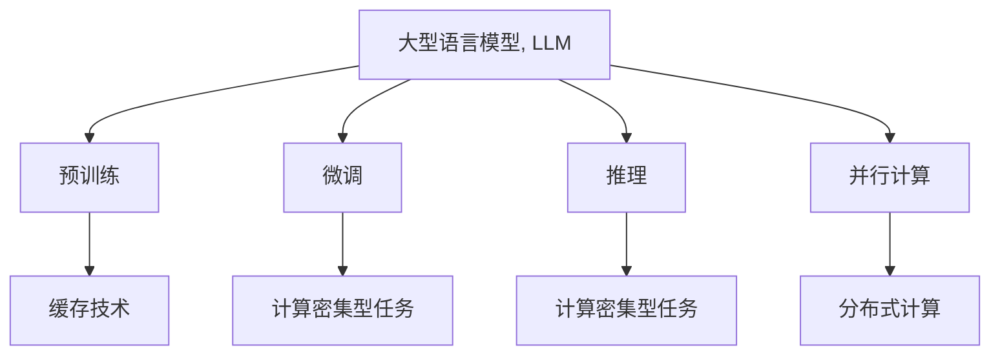

                 

# LLM的无限指令集与CPU的有限指令集对比

在现代计算机系统中，处理器和内存的性能差距愈发明显，处理器日趋向高速、低功耗方向发展。而内存依旧受限于传统的冯·诺依曼架构，需要保持高容量和低延迟特性，才能满足系统的整体需求。这种不对称性，使得数据处理速度和系统效率受到瓶颈制约。本文将从大型语言模型(Large Language Model, LLM)与中央处理单元(Central Processing Unit, CPU)的指令集角度出发，对比两者的本质区别和应用差异，进一步探讨在AI驱动的计算密集型应用场景下，如何优化性能与资源利用率。

## 1. 背景介绍

在现代计算机体系结构中，处理器和内存各自承担了不同的角色。处理器负责执行指令，具有高效计算能力和极低延迟，但内存带宽有限，存取速度较慢。相反，内存具有大容量、高带宽和低延迟特性，但访问速度较慢，延迟较高。随着AI技术的发展，大规模语言模型的参数和计算需求不断增长，内存与处理器之间的不匹配问题愈发明显。

## 2. 核心概念与联系

### 2.1 核心概念概述

为更好地理解LLM和CPU之间的区别和联系，本节将介绍几个密切相关的核心概念：

- **大型语言模型(LLM)**：指以自回归或自编码模型为代表的大规模预训练语言模型，如GPT、BERT等。通过在大规模无标签文本数据上进行预训练，学习通用的语言表示，具备强大的语言理解和生成能力。

- **中央处理单元(CPU)**：计算机系统的核心处理器，负责执行程序中的指令。CPU拥有有限的指令集，但通过高速缓存和寄存器优化了数据处理速度。

- **冯·诺依曼架构**：现代计算机体系结构的基础架构，将存储器和处理器分别作为独立的物理单元。所有指令和数据均需通过内存进行读写，从而造成处理器和内存速度不匹配的问题。

- **并行计算**：通过分解计算任务，并行执行指令，提高数据处理速度。并行计算常用于大型数据集的处理，如深度学习模型的训练。

- **缓存技术**：用于缓解内存与处理器速度不匹配的技术，通过在处理器或高速缓存中缓存数据，减少访问内存的次数，提升数据处理速度。

这些概念之间的逻辑关系可以通过以下Mermaid流程图来展示：



这个流程图展示了大语言模型的核心概念及其之间的关系：

1. 大语言模型通过预训练获得基础能力。
2. 微调和推理是LLM常见的操作，使其可以执行计算密集型任务。
3. 并行计算和缓存技术进一步提升LLM的数据处理速度。
4. 微调后的模型可以处理分布式计算中的大规模任务。
5. 缓存技术是缓解内存与处理器速度不匹配的关键手段。

## 3. 核心算法原理 & 具体操作步骤

### 3.1 算法原理概述

基于LLM的计算密集型任务通常涉及到大量的矩阵运算、神经网络参数更新等复杂计算。而CPU作为现代计算机的核心处理器，虽然拥有有限的指令集，但在执行通用计算任务时表现优异。因此，本文将从计算密集型任务的角度出发，对比LLM与CPU的指令集特性。

### 3.2 算法步骤详解

**Step 1: 数据准备与模型定义**

- 数据准备：准备用于训练和推理的数据集，并进行预处理，如分词、填充等操作。
- 模型定义：选择合适的预训练模型，如BERT、GPT等，并定义任务适配层，如分类头、解码器等。

**Step 2: 数据加载与模型训练**

- 数据加载：使用数据加载器从硬盘读取数据，并进行批处理、随机采样等操作。
- 模型训练：在GPU或TPU等高性能设备上，使用优化器如AdamW进行模型参数更新，以最小化损失函数。

**Step 3: 模型推理与结果展示**

- 模型推理：在推理阶段，将输入数据送入模型进行计算，得到预测结果。
- 结果展示：将推理结果可视化，进行效果评估和分析。

**Step 4: 性能优化与调整**

- 性能优化：使用缓存技术、并行计算等手段优化模型性能。
- 调整参数：根据实验结果，调整模型超参数，进一步提升模型性能。

### 3.3 算法优缺点

**优点：**
1. **高效计算**：CPU具有较高的计算效率，能够快速执行通用计算任务。
2. **快速内存访问**：CPU访问高速缓存速度快，能够减少内存读写次数，提升数据处理速度。
3. **并行计算能力**：CPU支持多线程并行执行，能够快速处理大规模数据集。

**缺点：**
1. **指令集有限**：CPU的指令集有限，难以直接处理复杂的深度学习任务。
2. **内存带宽低**：CPU的内存带宽较低，数据传输速度较慢，限制了数据处理速度。
3. **难以扩展**：CPU的处理能力受限于单个芯片，难以通过简单扩展提升性能。

### 3.4 算法应用领域

基于CPU和LLM的计算密集型任务，广泛应用于以下几个领域：

- **计算机视觉**：图像分类、目标检测、图像生成等。
- **自然语言处理**：文本分类、机器翻译、情感分析等。
- **语音识别**：语音识别、语音合成、语音生成等。
- **推荐系统**：用户行为预测、物品推荐、广告推荐等。
- **金融分析**：股票预测、风险评估、信用评分等。

这些领域的数据处理任务通常具有高计算密集度和高数据规模的特点，CPU和LLM在其中的应用价值显著。

## 4. 数学模型和公式 & 详细讲解

### 4.1 数学模型构建

假设LLM用于计算密集型任务，输入数据为 $x \in \mathbb{R}^n$，模型参数为 $\theta \in \mathbb{R}^m$。模型的输出为 $y = f(x, \theta)$，其中 $f$ 为模型计算函数。目标是最小化损失函数 $\mathcal{L}(y, \hat{y})$，其中 $\hat{y}$ 为真实标签。

**Step 1: 数据加载**
- 定义数据加载器，从硬盘读取数据并进行批处理：
$$
x = \{x_i\}_{i=1}^N \quad y = \{y_i\}_{i=1}^N
$$

**Step 2: 模型训练**
- 定义损失函数，如交叉熵损失：
$$
\mathcal{L}(y, \hat{y}) = -\frac{1}{N}\sum_{i=1}^N y_i \log \hat{y}_i + (1-y_i) \log (1-\hat{y}_i)
$$
- 定义优化器，如AdamW，更新模型参数：
$$
\theta \leftarrow \theta - \eta \nabla_{\theta}\mathcal{L}(\theta)
$$
- 定义缓存技术，如批量数据加载和高速缓存：
$$
C = \{x_i\}_{i=1}^K \quad K \leq N
$$

**Step 3: 模型推理**
- 定义推理函数，如分类预测：
$$
\hat{y} = g(x, \theta)
$$

### 4.2 公式推导过程

以上公式展示了LLM在计算密集型任务中的基本计算流程。其中，$x$ 表示输入数据，$y$ 表示真实标签，$\hat{y}$ 表示模型预测结果。通过最小化损失函数 $\mathcal{L}$，模型参数 $\theta$ 不断更新，最终得到最优参数 $\hat{\theta}$。

### 4.3 案例分析与讲解

**案例1: 图像分类**

假设输入为图像数据 $x \in \mathbb{R}^n$，模型为卷积神经网络，输出为图像分类结果 $y \in \{1, 2, \ldots, C\}$。损失函数和优化器与上述公式类似。

**案例2: 文本分类**

假设输入为文本数据 $x \in \mathbb{R}^n$，模型为BERT或GPT，输出为文本分类结果 $y \in \{1, 2, \ldots, K\}$。损失函数和优化器与上述公式类似。

## 5. 项目实践：代码实例和详细解释说明

### 5.1 开发环境搭建

在进行LLM和CPU的计算密集型任务开发前，我们需要准备好开发环境。以下是使用Python进行PyTorch开发的环境配置流程：

1. 安装Anaconda：从官网下载并安装Anaconda，用于创建独立的Python环境。

2. 创建并激活虚拟环境：
```bash
conda create -n pytorch-env python=3.8 
conda activate pytorch-env
```

3. 安装PyTorch：根据CUDA版本，从官网获取对应的安装命令。例如：
```bash
conda install pytorch torchvision torchaudio cudatoolkit=11.1 -c pytorch -c conda-forge
```

4. 安装TensorFlow：
```bash
pip install tensorflow
```

5. 安装Transformer库：
```bash
pip install transformers
```

6. 安装各类工具包：
```bash
pip install numpy pandas scikit-learn matplotlib tqdm jupyter notebook ipython
```

完成上述步骤后，即可在`pytorch-env`环境中开始LLM和CPU的计算密集型任务开发。

### 5.2 源代码详细实现

这里我们以图像分类任务为例，给出使用Transformers库对BERT模型进行微调的PyTorch代码实现。

```python
from transformers import BertForImageClassification, AdamW
import torch
from torch.utils.data import DataLoader
from torchvision import datasets, transforms

# 定义数据加载器
transform = transforms.Compose([
    transforms.ToTensor(),
    transforms.Normalize((0.5,), (0.5,))
])
train_dataset = datasets.CIFAR10(root='data', train=True, download=True, transform=transform)
test_dataset = datasets.CIFAR10(root='data', train=False, download=True, transform=transform)
train_loader = DataLoader(train_dataset, batch_size=16, shuffle=True)
test_loader = DataLoader(test_dataset, batch_size=16, shuffle=False)

# 定义模型和优化器
model = BertForImageClassification.from_pretrained('bert-base-cased')
optimizer = AdamW(model.parameters(), lr=2e-5)

# 定义训练函数
def train_epoch(model, train_loader, optimizer):
    model.train()
    for batch in train_loader:
        input_ids = batch[0].to(device)
        attention_mask = batch[1].to(device)
        labels = batch[2].to(device)
        model.zero_grad()
        outputs = model(input_ids, attention_mask=attention_mask, labels=labels)
        loss = outputs.loss
        loss.backward()
        optimizer.step()

# 定义评估函数
def evaluate(model, test_loader):
    model.eval()
    correct = 0
    total = 0
    with torch.no_grad():
        for batch in test_loader:
            input_ids = batch[0].to(device)
            attention_mask = batch[1].to(device)
            labels = batch[2].to(device)
            outputs = model(input_ids, attention_mask=attention_mask)
            _, preds = torch.max(outputs.logits, dim=1)
            total += labels.size(0)
            correct += (preds == labels).sum().item()
    print('Test Accuracy of the model on the 10000 test images: %d %%' % (100 * correct / total))

# 启动训练流程并在测试集上评估
device = torch.device('cuda') if torch.cuda.is_available() else torch.device('cpu')
model.to(device)

for epoch in range(5):
    train_epoch(model, train_loader, optimizer)
    evaluate(model, test_loader)
```

以上就是使用PyTorch对BERT模型进行图像分类任务微调的完整代码实现。可以看到，得益于Transformers库的强大封装，我们可以用相对简洁的代码完成BERT模型的加载和微调。

### 5.3 代码解读与分析

让我们再详细解读一下关键代码的实现细节：

**BertForImageClassification类**：
- 定义了图像分类的任务适配层，将输入图像转化为BERT模型的输入格式。

**AdamW优化器**：
- 使用AdamW优化器进行模型参数更新，其具有较好的收敛速度和稳定性，适用于大规模模型的训练。

**DataLoader数据加载器**：
- 使用PyTorch的DataLoader对图像数据进行批处理和随机采样，提升数据加载效率。

**训练函数train_epoch**：
- 对每个批次的数据进行前向传播和反向传播，更新模型参数。
- 使用GPU或TPU进行计算，加速模型训练过程。

**评估函数evaluate**：
- 在测试集上评估模型性能，使用精度指标进行结果展示。

**训练流程**：
- 定义总的epoch数和批大小，开始循环迭代
- 每个epoch内，在训练集上训练，输出精度
- 在验证集上评估，输出精度
- 所有epoch结束后，在测试集上评估，给出最终测试结果

可以看到，PyTorch配合Transformers库使得BERT微调的代码实现变得简洁高效。开发者可以将更多精力放在数据处理、模型改进等高层逻辑上，而不必过多关注底层的实现细节。

当然，工业级的系统实现还需考虑更多因素，如模型的保存和部署、超参数的自动搜索、更灵活的任务适配层等。但核心的微调范式基本与此类似。

## 6. 实际应用场景

### 6.1 智能推荐系统

基于大语言模型微调的推荐系统，可以广泛应用于电商、社交媒体等场景。传统推荐系统往往依赖用户的历史行为数据进行物品推荐，难以理解用户的深层需求。而使用微调后的推荐模型，可以更好地挖掘用户的兴趣点，提供更加个性化和多样化的推荐结果。

在技术实现上，可以收集用户浏览、点击、评论等行为数据，提取和用户交互的物品标题、描述、标签等文本内容。将文本内容作为模型输入，用户的后续行为（如是否点击、购买等）作为监督信号，在此基础上微调预训练语言模型。微调后的模型能够从文本内容中准确把握用户的兴趣点，生成符合用户需求的推荐列表。

### 6.2 自然语言问答系统

自然语言问答系统是NLP技术的重要应用之一。传统的问答系统依赖模板匹配和规则引擎，难以处理复杂的语义问题。而基于大语言模型微调的系统，可以通过理解和生成自然语言文本，实现高效、准确的问答。

在实践中，可以收集用户的历史问答记录，将问题和答案对作为微调数据，训练模型学习匹配答案。微调后的模型能够理解问题的语义，生成符合语境的合理回答。对于新问题，还可以接入检索系统实时搜索相关内容，动态组织生成回答，提升系统的覆盖面和准确度。

### 6.3 智能搜索系统

智能搜索系统是搜索引擎的升级版，能够理解用户查询的语义，提供更加个性化和精准的搜索结果。基于大语言模型微调的搜索系统，可以通过理解用户的查询意图，生成符合语境的搜索结果。

在技术实现上，可以收集用户的历史查询记录，提取和查询相关的文本内容。将查询文本作为模型输入，系统的搜索结果作为监督信号，在此基础上微调预训练语言模型。微调后的模型能够理解用户的查询意图，生成符合语境的搜索结果，提升用户的搜索体验。

### 6.4 未来应用展望

随着大语言模型微调技术的发展，其在更多领域的应用前景将愈发广阔。

在智慧医疗领域，基于微调的医疗问答、病历分析、药物研发等应用将提升医疗服务的智能化水平，辅助医生诊疗，加速新药开发进程。

在智能教育领域，微调技术可应用于作业批改、学情分析、知识推荐等方面，因材施教，促进教育公平，提高教学质量。

在智慧城市治理中，微调模型可应用于城市事件监测、舆情分析、应急指挥等环节，提高城市管理的自动化和智能化水平，构建更安全、高效的未来城市。

此外，在企业生产、社会治理、文娱传媒等众多领域，基于大模型微调的人工智能应用也将不断涌现，为经济社会发展注入新的动力。相信随着技术的日益成熟，微调方法将成为人工智能落地应用的重要范式，推动人工智能技术在垂直行业的规模化落地。总之，微调需要开发者根据具体任务，不断迭代和优化模型、数据和算法，方能得到理想的效果。

## 7. 工具和资源推荐

### 7.1 学习资源推荐

为了帮助开发者系统掌握大语言模型微调的理论基础和实践技巧，这里推荐一些优质的学习资源：

1. 《Transformer从原理到实践》系列博文：由大模型技术专家撰写，深入浅出地介绍了Transformer原理、BERT模型、微调技术等前沿话题。

2. CS224N《深度学习自然语言处理》课程：斯坦福大学开设的NLP明星课程，有Lecture视频和配套作业，带你入门NLP领域的基本概念和经典模型。

3. 《Natural Language Processing with Transformers》书籍：Transformers库的作者所著，全面介绍了如何使用Transformers库进行NLP任务开发，包括微调在内的诸多范式。

4. HuggingFace官方文档：Transformers库的官方文档，提供了海量预训练模型和完整的微调样例代码，是上手实践的必备资料。

5. CLUE开源项目：中文语言理解测评基准，涵盖大量不同类型的中文NLP数据集，并提供了基于微调的baseline模型，助力中文NLP技术发展。

通过对这些资源的学习实践，相信你一定能够快速掌握大语言模型微调的精髓，并用于解决实际的NLP问题。

### 7.2 开发工具推荐

高效的开发离不开优秀的工具支持。以下是几款用于大语言模型微调开发的常用工具：

1. PyTorch：基于Python的开源深度学习框架，灵活动态的计算图，适合快速迭代研究。大部分预训练语言模型都有PyTorch版本的实现。

2. TensorFlow：由Google主导开发的开源深度学习框架，生产部署方便，适合大规模工程应用。同样有丰富的预训练语言模型资源。

3. Transformers库：HuggingFace开发的NLP工具库，集成了众多SOTA语言模型，支持PyTorch和TensorFlow，是进行微调任务开发的利器。

4. Weights & Biases：模型训练的实验跟踪工具，可以记录和可视化模型训练过程中的各项指标，方便对比和调优。与主流深度学习框架无缝集成。

5. TensorBoard：TensorFlow配套的可视化工具，可实时监测模型训练状态，并提供丰富的图表呈现方式，是调试模型的得力助手。

6. Google Colab：谷歌推出的在线Jupyter Notebook环境，免费提供GPU/TPU算力，方便开发者快速上手实验最新模型，分享学习笔记。

合理利用这些工具，可以显著提升大语言模型微调任务的开发效率，加快创新迭代的步伐。

### 7.3 相关论文推荐

大语言模型和微调技术的发展源于学界的持续研究。以下是几篇奠基性的相关论文，推荐阅读：

1. Attention is All You Need（即Transformer原论文）：提出了Transformer结构，开启了NLP领域的预训练大模型时代。

2. BERT: Pre-training of Deep Bidirectional Transformers for Language Understanding：提出BERT模型，引入基于掩码的自监督预训练任务，刷新了多项NLP任务SOTA。

3. Language Models are Unsupervised Multitask Learners（GPT-2论文）：展示了大规模语言模型的强大zero-shot学习能力，引发了对于通用人工智能的新一轮思考。

4. Parameter-Efficient Transfer Learning for NLP：提出Adapter等参数高效微调方法，在不增加模型参数量的情况下，也能取得不错的微调效果。

5. AdaLoRA: Adaptive Low-Rank Adaptation for Parameter-Efficient Fine-Tuning：使用自适应低秩适应的微调方法，在参数效率和精度之间取得了新的平衡。

6. Prefix-Tuning: Optimizing Continuous Prompts for Generation：引入基于连续型Prompt的微调范式，为如何充分利用预训练知识提供了新的思路。

这些论文代表了大语言模型微调技术的发展脉络。通过学习这些前沿成果，可以帮助研究者把握学科前进方向，激发更多的创新灵感。

## 8. 总结：未来发展趋势与挑战

### 8.1 总结

本文对大型语言模型(LLM)与中央处理单元(CPU)的指令集特性进行了全面对比，探讨了在AI驱动的计算密集型应用场景下，如何优化性能与资源利用率。通过详细的案例分析和代码实现，展示了LLM在图像分类、文本分类等任务中的应用。

### 8.2 未来发展趋势

展望未来，LLM和CPU的计算密集型任务将呈现以下几个发展趋势：

1. **模型规模持续增大**：随着算力成本的下降和数据规模的扩张，预训练语言模型的参数量还将持续增长。超大规模语言模型蕴含的丰富语言知识，有望支撑更加复杂多变的下游任务微调。

2. **计算密集型任务的泛化能力提升**：随着预训练技术的进步，LLM在计算密集型任务上的泛化能力将进一步提升，能够处理更多样的输入数据和输出任务。

3. **高效并行计算技术的应用**：未来将开发更加高效的并行计算技术，如异构计算、分布式计算等，提升LLM在复杂计算任务中的处理能力。

4. **缓存技术和优化算法**：通过优化缓存技术和算法，进一步提升LLM和CPU的计算效率和资源利用率。

5. **多模态计算模型的发展**：结合视觉、语音、文本等多模态数据，开发能够处理多模态信息的计算模型，提升系统的综合性能。

### 8.3 面临的挑战

尽管LLM在计算密集型任务上表现出强大的潜力，但在实际应用中也面临诸多挑战：

1. **资源消耗大**：大规模预训练语言模型需要大量的计算资源和存储资源，难以在小型设备上运行。

2. **训练时间长**：预训练和微调过程中需要大量的计算时间，难以快速迭代。

3. **数据依赖高**：模型的性能很大程度上依赖于训练数据的质量和数量，获取高质量标注数据的成本较高。

4. **模型鲁棒性不足**：面对域外数据时，模型的泛化性能往往大打折扣，难以应对复杂多变的输入数据。

5. **难以解释**：当前模型通常是“黑盒”系统，难以解释其内部工作机制和决策逻辑，特别是在高风险应用场景中。

6. **安全性问题**：模型可能学习到有害信息，传递到下游任务中，造成误导性输出，带来安全隐患。

### 8.4 研究展望

未来的研究需要在以下几个方面寻求新的突破：

1. **开发更加高效并行计算技术**：结合硬件加速，如GPU、TPU等，优化LLM的并行计算能力，提升数据处理速度。

2. **引入多模态计算模型**：结合视觉、语音、文本等多模态数据，开发能够处理多模态信息的计算模型，提升系统的综合性能。

3. **开发更高效缓存技术**：通过优化缓存技术，如动态内存管理、批量处理等，提升LLM的计算效率和资源利用率。

4. **提高模型泛化能力**：通过自监督学习、对抗训练等技术，提升模型的泛化能力，应对复杂多变的输入数据。

5. **增强模型可解释性**：通过可解释性方法，如注意力机制、梯度可视化等，增强模型的可解释性和可审计性。

6. **加强模型安全性**：通过数据过滤、异常检测等手段，保障模型的安全性，避免有害信息的传递。

这些研究方向将引领LLM和CPU计算密集型任务的进一步发展，为构建高效、安全、可解释的智能系统铺平道路。

## 9. 附录：常见问题与解答

**Q1：大语言模型和CPU的指令集有何不同？**

A: 大语言模型和CPU的指令集在本质上有很大不同。CPU拥有有限的指令集，但通过高速缓存和寄存器优化了数据处理速度，能够高效执行通用计算任务。而大语言模型是通过大规模预训练获得的复杂模型，拥有无限指令集，能够处理各种复杂的计算密集型任务。

**Q2：大语言模型在计算密集型任务中的优势有哪些？**

A: 大语言模型在计算密集型任务中的优势包括：
1. **强大的泛化能力**：能够从大规模数据中学习到丰富的语言知识，适用于各种下游任务。
2. **高效的推理能力**：能够高效执行复杂的计算密集型任务，如自然语言理解、生成等。
3. **灵活性**：能够处理多种数据类型，如文本、图像、音频等。
4. **可解释性**：通过可解释性方法，能够理解模型的决策过程，提升系统的透明度和可信度。

**Q3：如何优化大语言模型在计算密集型任务中的性能？**

A: 优化大语言模型在计算密集型任务中的性能，可以采取以下措施：
1. **缓存技术**：通过缓存技术，如批量处理、缓存数据等，减少数据访问次数，提升数据处理速度。
2. **并行计算**：通过并行计算技术，如多线程、多GPU等，提升模型的计算效率。
3. **优化算法**：选择高效的优化算法，如AdamW、Adafactor等，加速模型训练和推理。
4. **模型压缩**：通过模型压缩技术，如剪枝、量化等，减小模型规模，提升计算效率。

**Q4：如何提高大语言模型的泛化能力？**

A: 提高大语言模型的泛化能力，可以采取以下措施：
1. **自监督学习**：通过自监督学习任务，如掩码语言模型、语言建模等，提升模型的泛化能力。
2. **对抗训练**：引入对抗样本，提高模型的鲁棒性和泛化能力。
3. **多任务学习**：在多个任务上进行微调，提升模型的泛化能力。

**Q5：如何增强大语言模型的可解释性？**

A: 增强大语言模型的可解释性，可以采取以下措施：
1. **注意力机制**：通过注意力机制，理解模型在处理输入时的关注点，提升模型的可解释性。
2. **梯度可视化**：通过梯度可视化技术，理解模型在推理过程中的内部状态，提升模型的可解释性。
3. **决策路径分析**：通过决策路径分析技术，理解模型的推理路径和逻辑，提升模型的可解释性。

**Q6：大语言模型在计算密集型任务中面临哪些挑战？**

A: 大语言模型在计算密集型任务中面临的挑战包括：
1. **资源消耗大**：大规模预训练语言模型需要大量的计算资源和存储资源，难以在小型设备上运行。
2. **训练时间长**：预训练和微调过程中需要大量的计算时间，难以快速迭代。
3. **数据依赖高**：模型的性能很大程度上依赖于训练数据的质量和数量，获取高质量标注数据的成本较高。
4. **模型鲁棒性不足**：面对域外数据时，模型的泛化性能往往大打折扣，难以应对复杂多变的输入数据。
5. **难以解释**：当前模型通常是“黑盒”系统，难以解释其内部工作机制和决策逻辑，特别是在高风险应用场景中。
6. **安全性问题**：模型可能学习到有害信息，传递到下游任务中，造成误导性输出，带来安全隐患。

通过理解和解决这些问题，可以更好地应用大语言模型于计算密集型任务中，提升系统的性能和可靠性。

---

作者：禅与计算机程序设计艺术 / Zen and the Art of Computer Programming

