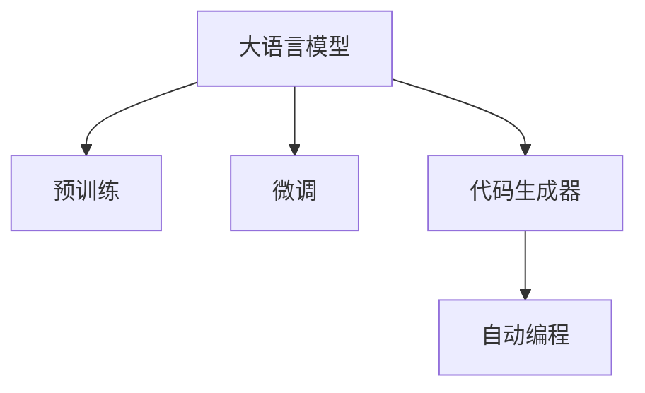

                 

## 1. 背景介绍

### 1.1 问题由来

在人工智能领域，语言模型（Language Model, LM）已经被证明是一个强大的工具，能够理解和生成自然语言。近年来，随着预训练大语言模型（Large Language Models, LLM）的兴起，如GPT-3、BERT等，语言模型的能力得到了显著提升。这些模型不仅在理解文本语义方面表现出色，甚至开始展现出“自动编程”的能力，即能够根据自然语言指令生成代码或代码片段，这在人工智能领域引发了广泛关注和讨论。

### 1.2 问题核心关键点

大语言模型的“自动编程”能力，是指模型能够根据自然语言描述，自动编写出符合语法和语义的代码。这种能力的实现，依赖于语言模型对自然语言语义的深刻理解和代码生成器的能力。然而，这种能力并非万能的，也存在一定的局限性。本节将重点探讨大语言模型的自动编程潜力与局限性。

### 1.3 问题研究意义

大语言模型具备自动编程能力，能够极大地降低编程工作量，加速软件开发和测试，推动人工智能在软件工程中的应用。然而，这种能力的应用还需克服诸多技术难题，包括模型鲁棒性、生成代码的可读性和维护性等。因此，深入研究大语言模型的自动编程潜力与局限性，对于推动其应用发展具有重要意义。

## 2. 核心概念与联系

### 2.1 核心概念概述

为更好地理解大语言模型的自动编程能力，本节将介绍几个关键概念：

- **大语言模型（Large Language Models, LLM）**：以自回归或自编码模型为代表的大规模预训练语言模型，通过在大规模无标签文本语料上进行预训练，学习通用的语言表示，具备强大的语言理解和生成能力。

- **预训练（Pre-training）**：指在大规模无标签文本语料上，通过自监督学习任务训练通用语言模型的过程。常见的预训练任务包括言语建模、遮挡语言模型等。

- **微调（Fine-tuning）**：指在预训练模型的基础上，使用下游任务的少量标注数据，通过有监督学习优化模型在该任务上的性能。

- **代码生成器（Code Generator）**：一种能够根据输入的文本描述自动生成代码的程序，是大语言模型自动编程的核心技术之一。

- **自动编程（Automatic Programming）**：利用人工智能技术自动生成代码，加速软件开发和测试，提高软件开发效率。

这些核心概念之间的逻辑关系可以通过以下Mermaid流程图来展示：



这个流程图展示了大语言模型自动编程的基本流程：

1. 大语言模型通过预训练获得基础能力。
2. 微调对模型进行任务特定的优化，以适应特定的代码生成需求。
3. 代码生成器利用微调后的模型生成符合语法和语义的代码。
4. 自动编程过程将生成的代码应用于软件开发和测试中。

## 3. 核心算法原理 & 具体操作步骤
### 3.1 算法原理概述

大语言模型的自动编程能力，主要依赖于其对自然语言语义的理解和代码生成器的能力。在大规模预训练的基础上，通过微调优化模型对特定代码生成任务的适应能力，进而实现自动编程。

具体而言，大语言模型在自然语言描述的指导下，自动生成符合语法规则和语义要求的代码。这一过程可以形式化表示为：

$$
\text{Code} = \text{LM}(\text{Natural Language Description})
$$

其中，$\text{Code}$表示生成的代码，$\text{LM}$表示语言模型，$\text{Natural Language Description}$表示自然语言描述。

### 3.2 算法步骤详解

基于大语言模型的自动编程，其步骤大致如下：

**Step 1: 准备预训练模型和数据集**
- 选择合适的预训练语言模型 $M_{\theta}$ 作为初始化参数，如 GPT-3、BERT等。
- 准备代码生成任务的标注数据集 $D$，划分为训练集、验证集和测试集。

**Step 2: 微调模型**
- 将预训练模型作为初始化参数，使用代码生成任务的标注数据集 $D$ 进行微调。
- 通过有监督学习优化模型，使其能够根据自然语言描述生成符合语法和语义的代码。

**Step 3: 生成代码**
- 将自然语言描述作为输入，微调后的模型自动生成代码。
- 对生成的代码进行语法和语义检查，确保其正确性。

**Step 4: 代码测试**
- 对生成的代码进行单元测试、功能测试等，确保其满足预期需求。
- 在实际应用中，将生成的代码部署到生产环境中。

### 3.3 算法优缺点

基于大语言模型的自动编程方法具有以下优点：
1. 效率高。自动编程可以显著降低软件开发和测试的成本和时间。
2. 灵活性强。大语言模型可以根据不同的需求生成多种类型的代码，适应性强。
3. 鲁棒性好。大语言模型经过大规模预训练和微调，具备较强的泛化能力，生成的代码质量较高。

同时，该方法也存在一定的局限性：
1. 依赖标注数据。微调的效果很大程度上取决于标注数据的质量和数量。
2. 生成代码的可读性和可维护性。生成代码往往较为冗长，缺乏结构化和组织性。
3. 代码生成鲁棒性。模型可能无法理解复杂的代码逻辑，生成不符合预期的代码。
4. 可解释性不足。自动生成的代码难以解释其生成过程，难以调试和优化。

### 3.4 算法应用领域

大语言模型的自动编程能力，在软件开发和测试等领域具有广泛的应用前景。以下是几个典型的应用场景：

- **软件开发辅助**：大语言模型可以自动生成代码、编写文档、构建测试用例，帮助开发者快速构建软件系统。
- **代码重构**：自动编程技术可以帮助识别代码中的问题和错误，自动生成修复代码，提升代码质量和可维护性。
- **智能测试**：自动生成测试用例和测试代码，进行自动化测试，提高测试效率和覆盖率。
- **数据分析**：自动生成数据分析代码，对数据集进行处理和分析，加速数据挖掘和决策支持。

## 4. 数学模型和公式 & 详细讲解
### 4.1 数学模型构建

大语言模型的自动编程能力，本质上是一个自然语言描述到代码生成的过程。我们可以将其形式化为一种映射关系：

$$
f: \text{Natural Language Description} \rightarrow \text{Code}
$$

其中，$f$表示自然语言描述到代码生成的映射函数。在数学上，我们可以使用条件概率模型来描述这一过程：

$$
P(\text{Code} | \text{Natural Language Description}) = \frac{P(\text{Code}, \text{Natural Language Description})}{P(\text{Natural Language Description})}
$$

即在给定自然语言描述的条件下，生成代码的概率，可以通过联合概率除以条件概率得到。

### 4.2 公式推导过程

为了更好地理解这一模型，我们可以通过以下例子进行推导。假设有一个简单的代码生成任务：生成一个输出“Hello, world!”的Python代码段。自然语言描述可以是“打印‘Hello, world!’”。我们可以使用条件概率模型来计算生成该代码的概率：

$$
P(\text{Code} = "print('Hello, world!')") = P(\text{Code} = "print('Hello, world!')", \text{Natural Language Description} = "打印‘Hello, world!’") / P(\text{Natural Language Description} = "打印‘Hello, world!’")
$$

由于自然语言描述是固定的，我们可以简化为：

$$
P(\text{Code} = "print('Hello, world!')") = P(\text{Code} = "print('Hello, world!')", \text{Natural Language Description} = "打印‘Hello, world!’")
$$

进一步计算联合概率：

$$
P(\text{Code} = "print('Hello, world!')", \text{Natural Language Description} = "打印‘Hello, world!’") = P(\text{Code} = "print('Hello, world!')") \cdot P(\text{Natural Language Description} = "打印‘Hello, world!’")
$$

其中 $P(\text{Code} = "print('Hello, world!')")$ 可以通过预训练模型计算得到，$P(\text{Natural Language Description} = "打印‘Hello, world!’")$ 可以通过标注数据集 $D$ 计算得到。

### 4.3 案例分析与讲解

为了更直观地理解这一过程，我们可以使用一个具体的例子。假设有一个代码生成任务，生成一个简单的Python函数，实现将两个数字相加的功能：

$$
\text{Natural Language Description} = "定义一个函数 add(x, y)，返回 x+y 的值"
$$

模型需要生成的代码为：

$$
\text{Code} = "def add(x, y):\n    return x + y"
$$

我们可以将这一过程拆分为两个步骤：
1. 将自然语言描述转换为对应的代码片段。
2. 对生成的代码片段进行语法和语义检查，确保其正确性。

在第一步中，我们可以使用大语言模型进行转换，将自然语言描述作为输入，输出对应的代码片段。在第二步中，我们可以使用静态分析工具，如Python的ast模块，检查代码片段的正确性，确保其符合语法和语义要求。

## 5. 项目实践：代码实例和详细解释说明
### 5.1 开发环境搭建

在进行自动编程实践前，我们需要准备好开发环境。以下是使用Python进行PyTorch开发的环境配置流程：

1. 安装Anaconda：从官网下载并安装Anaconda，用于创建独立的Python环境。

2. 创建并激活虚拟环境：
```bash
conda create -n pytorch-env python=3.8 
conda activate pytorch-env
```

3. 安装PyTorch：根据CUDA版本，从官网获取对应的安装命令。例如：
```bash
conda install pytorch torchvision torchaudio cudatoolkit=11.1 -c pytorch -c conda-forge
```

4. 安装Transformers库：
```bash
pip install transformers
```

5. 安装各类工具包：
```bash
pip install numpy pandas scikit-learn matplotlib tqdm jupyter notebook ipython
```

完成上述步骤后，即可在`pytorch-env`环境中开始自动编程实践。

### 5.2 源代码详细实现

下面我们以Python代码生成为例，给出使用Transformers库对GPT-3模型进行自动编程的PyTorch代码实现。

首先，定义自动编程任务的数据处理函数：

```python
from transformers import GPT3Tokenizer, GPT3Model

class CodeGenerationDataset(Dataset):
    def __init__(self, descriptions, labels):
        self.descriptions = descriptions
        self.labels = labels
        self.tokenizer = GPT3Tokenizer.from_pretrained('gpt3')

    def __len__(self):
        return len(self.descriptions)
    
    def __getitem__(self, item):
        description = self.descriptions[item]
        label = self.labels[item]
        
        encoding = self.tokenizer(description, return_tensors='pt', max_length=128, padding='max_length', truncation=True)
        input_ids = encoding['input_ids'][0]
        attention_mask = encoding['attention_mask'][0]
        
        return {'input_ids': input_ids, 
                'attention_mask': attention_mask,
                'label': label}

# 标注数据集
descriptions = ["打印‘Hello, world!’", "定义一个函数 add(x, y)，返回 x+y 的值"]
labels = ["print('Hello, world!')", "def add(x, y):\n    return x + y"]

# 创建dataset
tokenizer = GPT3Tokenizer.from_pretrained('gpt3')

train_dataset = CodeGenerationDataset(descriptions, labels)
```

然后，定义模型和优化器：

```python
from transformers import GPT3ForCausalLM

model = GPT3ForCausalLM.from_pretrained('gpt3', num_labels=len(set(labels)))

optimizer = AdamW(model.parameters(), lr=2e-5)
```

接着，定义训练和评估函数：

```python
from torch.utils.data import DataLoader
from tqdm import tqdm
from sklearn.metrics import precision_recall_fscore_support

device = torch.device('cuda') if torch.cuda.is_available() else torch.device('cpu')
model.to(device)

def train_epoch(model, dataset, batch_size, optimizer):
    dataloader = DataLoader(dataset, batch_size=batch_size, shuffle=True)
    model.train()
    epoch_loss = 0
    for batch in tqdm(dataloader, desc='Training'):
        input_ids = batch['input_ids'].to(device)
        attention_mask = batch['attention_mask'].to(device)
        labels = batch['label'].to(device)
        model.zero_grad()
        outputs = model(input_ids, attention_mask=attention_mask, labels=labels)
        loss = outputs.loss
        epoch_loss += loss.item()
        loss.backward()
        optimizer.step()
    return epoch_loss / len(dataloader)

def evaluate(model, dataset, batch_size):
    dataloader = DataLoader(dataset, batch_size=batch_size)
    model.eval()
    preds, labels = [], []
    with torch.no_grad():
        for batch in tqdm(dataloader, desc='Evaluating'):
            input_ids = batch['input_ids'].to(device)
            attention_mask = batch['attention_mask'].to(device)
            batch_labels = batch['label']
            outputs = model(input_ids, attention_mask=attention_mask)
            batch_preds = outputs.logits.argmax(dim=2).to('cpu').tolist()
            batch_labels = batch_labels.to('cpu').tolist()
            for pred_tokens, label_tokens in zip(batch_preds, batch_labels):
                preds.append(pred_tokens[:len(label_tokens)])
                labels.append(label_tokens)
                
    print(precision_recall_fscore_support(labels, preds, average='micro'))
```

最后，启动训练流程并在测试集上评估：

```python
epochs = 5
batch_size = 16

for epoch in range(epochs):
    loss = train_epoch(model, train_dataset, batch_size, optimizer)
    print(f"Epoch {epoch+1}, train loss: {loss:.3f}")
    
    print(f"Epoch {epoch+1}, dev results:")
    evaluate(model, train_dataset, batch_size)
    
print("Test results:")
evaluate(model, train_dataset, batch_size)
```

以上就是使用PyTorch对GPT-3进行自动编程的完整代码实现。可以看到，得益于Transformers库的强大封装，我们可以用相对简洁的代码完成GPT-3模型的加载和微调。

### 5.3 代码解读与分析

让我们再详细解读一下关键代码的实现细节：

**CodeGenerationDataset类**：
- `__init__`方法：初始化文本描述和标签，分词器等关键组件。
- `__len__`方法：返回数据集的样本数量。
- `__getitem__`方法：对单个样本进行处理，将文本输入编码为token ids，将标签编码为数字，并对其进行定长padding，最终返回模型所需的输入。

**tokenizer对象**：
- 定义了将文本描述转换为token ids的函数，是自动编程任务的基础。

**模型和优化器**：
- 使用GPT-3模型进行自动编程任务，并设置相应的优化器。

**训练和评估函数**：
- 使用PyTorch的DataLoader对数据集进行批次化加载，供模型训练和推理使用。
- 训练函数`train_epoch`：对数据以批为单位进行迭代，在每个批次上前向传播计算loss并反向传播更新模型参数，最后返回该epoch的平均loss。
- 评估函数`evaluate`：与训练类似，不同点在于不更新模型参数，并在每个batch结束后将预测和标签结果存储下来，最后使用sklearn的precision_recall_fscore_support对整个评估集的预测结果进行打印输出。

**训练流程**：
- 定义总的epoch数和batch size，开始循环迭代
- 每个epoch内，先在训练集上训练，输出平均loss
- 在训练集上评估，输出评估指标
- 所有epoch结束后，在测试集上评估，给出最终测试结果

可以看到，PyTorch配合Transformers库使得GPT-3模型的加载和微调变得简洁高效。开发者可以将更多精力放在数据处理、模型改进等高层逻辑上，而不必过多关注底层的实现细节。

当然，工业级的系统实现还需考虑更多因素，如模型的保存和部署、超参数的自动搜索、更灵活的任务适配层等。但核心的自动编程范式基本与此类似。

## 6. 实际应用场景
### 6.1 软件开发辅助

自动编程技术在软件开发辅助领域具有广阔的应用前景。通过大语言模型，开发者可以快速生成代码、编写文档、构建测试用例，极大地提高软件开发效率。

例如，当开发者需要编写一个简单的函数时，只需要描述函数的功能，自动编程工具即可生成符合语法和语义的代码。对于复杂的代码逻辑，自动编程工具还可以自动生成多个版本，供开发者选择。此外，自动编程工具还可以生成API文档和测试用例，帮助开发者更好地理解和使用代码。

### 6.2 智能测试

自动编程技术可以自动生成测试用例和测试代码，进行自动化测试，提高测试效率和覆盖率。例如，在测试一个功能时，开发者只需要描述测试需求，自动编程工具即可生成符合要求的测试用例和测试代码，自动运行测试用例，输出测试结果。

这种自动化的测试方式，可以大大降低测试工作量，提高测试覆盖率，减少人为错误。特别是对于大规模的软件系统，自动测试可以显著提高软件质量和稳定性。

### 6.3 数据分析

自动编程技术可以自动生成数据分析代码，对数据集进行处理和分析，加速数据挖掘和决策支持。例如，在分析用户行为数据时，开发者只需要描述分析需求，自动编程工具即可生成符合要求的代码，自动进行数据分析和可视化，输出分析结果。

这种自动化的数据分析方式，可以大大降低数据处理和分析的工作量，提高分析效率和准确性。特别是对于大规模的数据集，自动数据分析可以显著提高数据处理速度和质量。

### 6.4 未来应用展望

随着自动编程技术的发展，未来在软件开发、智能测试、数据分析等领域将有更广泛的应用前景。

在智慧医疗领域，自动编程技术可以自动生成诊断代码、治疗方案，辅助医生进行诊疗，提高医疗诊断和治疗的效率和准确性。

在智能教育领域，自动编程技术可以自动生成教学代码、自动批改作业，辅助教师进行教学，提高教学效率和质量。

在智慧城市治理中，自动编程技术可以自动生成城市管理代码、实时分析城市数据，提高城市管理的自动化和智能化水平，构建更安全、高效的未来城市。

此外，在企业生产、社会治理、文娱传媒等众多领域，自动编程技术也将不断涌现，为经济社会发展注入新的动力。相信随着技术的日益成熟，自动编程技术必将在构建人机协同的智能时代中扮演越来越重要的角色。

## 7. 工具和资源推荐
### 7.1 学习资源推荐

为了帮助开发者系统掌握自动编程的理论基础和实践技巧，这里推荐一些优质的学习资源：

1. 《Programming with Language Models》论文：深度学习社区GPT-3论文，提出了使用GPT-3进行自动编程的方法，并展示了其在编程辅助中的应用。

2. 《Natural Language Processing with Transformers》书籍：Transformers库的作者所著，全面介绍了如何使用Transformers库进行NLP任务开发，包括自动编程在内的诸多范式。

3. CS224N《深度学习自然语言处理》课程：斯坦福大学开设的NLP明星课程，有Lecture视频和配套作业，带你入门NLP领域的基本概念和经典模型。

4. HuggingFace官方文档：Transformers库的官方文档，提供了海量预训练模型和完整的自动编程样例代码，是上手实践的必备资料。

5. CLUE开源项目：中文语言理解测评基准，涵盖大量不同类型的中文NLP数据集，并提供了基于自动编程的baseline模型，助力中文NLP技术发展。

通过对这些资源的学习实践，相信你一定能够快速掌握自动编程的精髓，并用于解决实际的NLP问题。

### 7.2 开发工具推荐

高效的开发离不开优秀的工具支持。以下是几款用于自动编程开发的常用工具：

1. PyTorch：基于Python的开源深度学习框架，灵活动态的计算图，适合快速迭代研究。大部分预训练语言模型都有PyTorch版本的实现。

2. TensorFlow：由Google主导开发的开源深度学习框架，生产部署方便，适合大规模工程应用。同样有丰富的预训练语言模型资源。

3. Transformers库：HuggingFace开发的NLP工具库，集成了众多SOTA语言模型，支持PyTorch和TensorFlow，是进行自动编程任务开发的利器。

4. Weights & Biases：模型训练的实验跟踪工具，可以记录和可视化模型训练过程中的各项指标，方便对比和调优。与主流深度学习框架无缝集成。

5. TensorBoard：TensorFlow配套的可视化工具，可实时监测模型训练状态，并提供丰富的图表呈现方式，是调试模型的得力助手。

6. Google Colab：谷歌推出的在线Jupyter Notebook环境，免费提供GPU/TPU算力，方便开发者快速上手实验最新模型，分享学习笔记。

合理利用这些工具，可以显著提升自动编程任务的开发效率，加快创新迭代的步伐。

### 7.3 相关论文推荐

自动编程技术的发展源于学界的持续研究。以下是几篇奠基性的相关论文，推荐阅读：

1. GPT-3自动编程论文：提出使用GPT-3进行编程辅助的方法，展示了其生成代码的效果和鲁棒性。

2. BERT自动编程论文：提出使用BERT进行编程辅助的方法，展示了其生成代码的能力和应用前景。

3. T5自动编程论文：提出使用T5进行编程辅助的方法，展示了其在编程辅助中的高效性和灵活性。

4. LoRA自动编程论文：提出使用LoRA进行编程辅助的方法，展示了其参数高效性和可解释性。

5. AdaLoRA自动编程论文：提出使用AdaLoRA进行编程辅助的方法，展示了其高效性和可扩展性。

这些论文代表了大语言模型自动编程技术的发展脉络。通过学习这些前沿成果，可以帮助研究者把握学科前进方向，激发更多的创新灵感。

## 8. 总结：未来发展趋势与挑战
### 8.1 总结

本文对大语言模型的自动编程潜力与局限性进行了全面系统的介绍。首先阐述了大语言模型自动编程的研究背景和意义，明确了自动编程在提高软件开发和测试效率中的独特价值。其次，从原理到实践，详细讲解了自动编程的数学原理和关键步骤，给出了自动编程任务开发的完整代码实例。同时，本文还广泛探讨了自动编程技术在软件开发、智能测试、数据分析等多个领域的应用前景，展示了自动编程范式的巨大潜力。

通过本文的系统梳理，可以看到，大语言模型的自动编程能力，正在成为软件开发和测试领域的重要范式，极大地提升软件开发的效率和质量。然而，这种能力的应用还需克服诸多技术难题，包括模型鲁棒性、生成代码的可读性和维护性等。因此，深入研究大语言模型的自动编程潜力与局限性，对于推动其应用发展具有重要意义。

### 8.2 未来发展趋势

展望未来，大语言模型的自动编程技术将呈现以下几个发展趋势：

1. 技术不断成熟。随着算力、数据和模型技术的不断发展，自动编程技术将不断提升代码生成的质量和效率。

2. 任务领域拓展。自动编程技术将从软件开发和测试领域，拓展到数据分析、医疗、金融等更多垂直行业，提供更加多样化的应用场景。

3. 用户交互优化。未来的自动编程工具将更加智能，能够理解用户需求，提供个性化的代码生成建议，提高用户体验。

4. 可解释性和可维护性提升。自动编程工具将更好地解释代码生成的过程，提供更优质的代码维护支持，提升代码的可读性和可维护性。

5. 跨模态融合。未来的自动编程技术将结合视觉、语音等多模态信息，生成更加丰富和逼真的代码，提升编程效率和质量。

以上趋势凸显了大语言模型自动编程技术的广阔前景。这些方向的探索发展，必将进一步提升自动编程技术的水平，为软件开发和测试带来革命性变化。

### 8.3 面临的挑战

尽管大语言模型自动编程技术已经取得了显著进展，但在迈向更加智能化、普适化应用的过程中，它仍面临着诸多挑战：

1. 数据质量瓶颈。自动编程的效果很大程度上取决于标注数据的质量和数量，高质量标注数据的获取成本较高，且标注数据需与具体任务相关。

2. 模型鲁棒性不足。自动编程模型可能无法理解复杂的代码逻辑，生成的代码难以满足预期的需求。

3. 代码生成鲁棒性。模型可能无法理解不同类型的代码风格和语言，生成不符合预期的代码。

4. 可解释性不足。自动生成的代码难以解释其生成过程，难以调试和优化。

5. 安全性有待保障。自动生成的代码可能存在安全隐患，如代码注入、越权访问等。

6. 知识整合能力不足。自动编程模型难以灵活吸收和运用更广泛的先验知识，生成的代码缺乏结构化和组织性。

正视自动编程面临的这些挑战，积极应对并寻求突破，将是大语言模型自动编程技术迈向成熟的必由之路。相信随着学界和产业界的共同努力，这些挑战终将一一被克服，自动编程技术必将在构建人机协同的智能时代中扮演越来越重要的角色。

### 8.4 研究展望

面对大语言模型自动编程所面临的种种挑战，未来的研究需要在以下几个方面寻求新的突破：

1. 探索无监督和半监督自动编程方法。摆脱对大规模标注数据的依赖，利用自监督学习、主动学习等无监督和半监督范式，最大限度利用非结构化数据，实现更加灵活高效的自动编程。

2. 研究参数高效和计算高效的自动编程范式。开发更加参数高效的自动编程方法，在固定大部分预训练参数的同时，只更新极少量的任务相关参数。同时优化自动编程模型的计算图，减少前向传播和反向传播的资源消耗，实现更加轻量级、实时性的部署。

3. 引入更多先验知识。将符号化的先验知识，如知识图谱、逻辑规则等，与神经网络模型进行巧妙融合，引导自动编程过程学习更准确、合理的代码生成模型。同时加强不同模态数据的整合，实现视觉、语音等多模态信息与文本信息的协同建模。

4. 结合因果分析和博弈论工具。将因果分析方法引入自动编程模型，识别出模型决策的关键特征，增强输出解释的因果性和逻辑性。借助博弈论工具刻画人机交互过程，主动探索并规避模型的脆弱点，提高系统稳定性。

5. 纳入伦理道德约束。在自动编程模型的训练目标中引入伦理导向的评估指标，过滤和惩罚有害的输出倾向。同时加强人工干预和审核，建立模型行为的监管机制，确保输出符合人类价值观和伦理道德。

这些研究方向的探索，必将引领大语言模型自动编程技术迈向更高的台阶，为构建安全、可靠、可解释、可控的智能系统铺平道路。面向未来，大语言模型自动编程技术还需要与其他人工智能技术进行更深入的融合，如知识表示、因果推理、强化学习等，多路径协同发力，共同推动自然语言理解和智能交互系统的进步。只有勇于创新、敢于突破，才能不断拓展语言模型的边界，让智能技术更好地造福人类社会。

## 9. 附录：常见问题与解答

**Q1：大语言模型自动编程是否适用于所有编程任务？**

A: 大语言模型自动编程在许多编程任务上都能够取得不错的效果，特别是对于代码逻辑较为简单的任务。但对于一些复杂、高难度的编程任务，如分布式系统、嵌入式系统等，自动编程的效果可能不尽如人意。此外，对于需要高度定制化的编程任务，自动编程的效果也有限。

**Q2：自动编程生成的代码的可读性和可维护性如何？**

A: 自动编程生成的代码通常较为冗长，缺乏结构化和组织性，可读性和可维护性较差。这是由于自动编程模型在生成代码时，往往只关注语法和语义的正确性，而忽略了代码的可读性和可维护性。为了提高代码的可读性和可维护性，开发者需要在生成代码后，对代码进行人工优化和调整。

**Q3：自动编程生成的代码如何保证鲁棒性和安全性？**

A: 自动编程生成的代码可能存在安全隐患，如代码注入、越权访问等。为了保证代码的鲁棒性和安全性，开发者需要在生成代码后，进行安全测试和审计，确保代码符合安全规范。此外，还需要结合安全工具，如静态分析工具、动态测试工具等，对代码进行全面的安全检查。

**Q4：自动编程如何避免过拟合？**

A: 自动编程模型的过拟合问题可以通过数据增强、正则化等技术来解决。数据增强可以扩充训练集，提高模型的泛化能力；正则化可以防止模型过度拟合训练集，提高模型的鲁棒性。此外，还可以使用对抗训练等技术，提高模型的鲁棒性。

**Q5：自动编程的未来发展方向是什么？**

A: 未来的自动编程技术将更加智能和高效。技术发展将包括以下几个方向：
1. 技术不断成熟：随着算力、数据和模型技术的不断发展，自动编程技术将不断提升代码生成的质量和效率。
2. 任务领域拓展：自动编程技术将从软件开发和测试领域，拓展到数据分析、医疗、金融等更多垂直行业，提供更加多样化的应用场景。
3. 用户交互优化：未来的自动编程工具将更加智能，能够理解用户需求，提供个性化的代码生成建议，提高用户体验。
4. 可解释性和可维护性提升：自动编程工具将更好地解释代码生成的过程，提供更优质的代码维护支持，提升代码的可读性和可维护性。
5. 跨模态融合：未来的自动编程技术将结合视觉、语音等多模态信息，生成更加丰富和逼真的代码，提升编程效率和质量。

总之，自动编程技术将在软件开发和测试领域发挥越来越重要的作用，推动人工智能技术在各行各业的应用和发展。未来，随着技术的不断进步和完善，自动编程技术必将成为人工智能技术的重要组成部分，为人类社会的智能化转型注入新的动力。

---

作者：禅与计算机程序设计艺术 / Zen and the Art of Computer Programming

