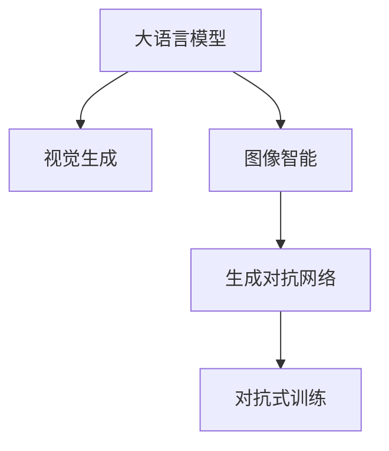

                 

# LLM视觉生成:开启图像智能新时代

## 1. 背景介绍

视觉生成（Visual Generation）是人工智能领域的一大热门话题，其核心目标是通过算法自动生成高品质的图像。传统的视觉生成技术依赖于手工设计的生成模型，如GAN（Generative Adversarial Networks），而最新的人工智能模型（如大语言模型（Large Language Models, LLMs））正在打破这一限制。大语言模型不仅能够生成自然语言文本，还能够通过视觉生成技术实现图像与文本的联合生成，从而拓展了其在视觉领域的潜力。本文将探讨LLM在视觉生成中的创新应用，以及相关技术原理和实践技巧，以此开启图像智能的新纪元。

## 2. 核心概念与联系

### 2.1 核心概念概述

为了更好地理解LLM在视觉生成中的作用，需要深入了解几个关键概念：

- 大语言模型（Large Language Models, LLMs）：基于Transformer等架构的深度学习模型，能够生成流畅、有逻辑的自然语言文本。
- 视觉生成（Visual Generation）：使用算法自动生成高质量图像的过程。
- 图像智能（Visual Intelligence）：结合视觉生成和自然语言处理（NLP）的智能系统，能够理解和生成视觉内容。
- 生成对抗网络（Generative Adversarial Networks, GANs）：一种通过两个对抗网络生成和检测生成图像的技术。
- 对抗式训练（Adversarial Training）：在训练过程中，同时训练生成器和判别器，提高生成图像的逼真度和鲁棒性。

这些概念之间的逻辑关系可以通过以下Mermaid流程图来展示：



## 3. 核心算法原理 & 具体操作步骤

### 3.1 算法原理概述

LLM在视觉生成中的关键技术是结合文本和图像的联合生成。其基本原理是，将文本描述（如描述图片内容的自然语言句子）作为输入，由大语言模型生成相应的图像。具体流程包括文本编码、图像生成、解码图像等步骤。

具体而言，文本编码器将文本描述转化为高维向量表示，该向量与图像生成器（如GAN）的生成器输入进行拼接，然后生成图像。接着，图像解码器（如GPT）将生成的图像转化为对应的自然语言描述，形成闭环。通过这种联合生成的方式，LLM可以生成符合自然语言描述的图像，同时还能够生成自然语言描述符合图像内容的文本。

### 3.2 算法步骤详解

以Image-to-Text（图像到文本）和Text-to-Image（文本到图像）为例，展示LLM在视觉生成中的具体操作步骤：

**图像到文本（Image-to-Text）：**

1. **文本输入**：给定一张图片，将其输入到预训练的大语言模型中，获取其描述。
2. **图像生成**：使用生成对抗网络（GAN）生成与文本描述一致的图像。
3. **解码**：通过解码器将生成的图像转化为自然语言文本描述。

**文本到图像（Text-to-Image）：**

1. **文本输入**：给定一个自然语言文本描述，输入到预训练的大语言模型中，生成对应的图像描述向量。
2. **图像生成**：使用生成对抗网络（GAN）生成与文本描述向量对应的图像。
3. **解码**：通过解码器将生成的图像转化为对应的自然语言文本描述。

### 3.3 算法优缺点

**优点：**

1. **灵活性高**：能够生成高度个性化和多样化的图像，适应各种应用场景。
2. **生成速度快**：相比于传统GAN，大语言模型生成的图像速度更快，易于部署。
3. **可解释性强**：大语言模型可以提供详细的图像生成过程和推理依据。

**缺点：**

1. **模型复杂**：大语言模型的参数量和训练复杂度较高，需要大量的计算资源。
2. **泛化能力差**：在特定领域的视觉生成任务中，性能可能不如专业的GAN模型。
3. **鲁棒性不足**：生成的图像可能包含错误和偏差，需要进一步优化。

### 3.4 算法应用领域

LLM在视觉生成中的应用领域非常广泛，涵盖从艺术创作、游戏设计到医学图像、司法鉴定等多个方面。

- **艺术创作**：LLM生成的图像可以用于艺术家创作参考，激发创意。
- **游戏设计**：通过LLM生成的图像和角色，提升游戏世界的真实感和交互性。
- **医学图像**：在医学影像分析中，LLM可以帮助生成高质量的图像，提高诊断准确率。
- **司法鉴定**：在电子取证中，LLM生成的图像可以用于图像修复和比对。

## 4. 数学模型和公式 & 详细讲解 & 举例说明

### 4.1 数学模型构建

假设输入的文本描述为 $x$，生成的图像表示为 $y$。假设文本编码器的输出为 $E(x)$，图像生成器的参数为 $\theta_g$，图像解码器的参数为 $\theta_d$。模型的整体结构可以表示为：

$$
y = G_{\theta_g}(E(x); \lambda)
$$

其中 $G_{\theta_g}$ 为图像生成器，$E(x)$ 为文本编码器，$\lambda$ 为生成器的噪声向量。图像解码器 $D_{\theta_d}$ 将图像 $y$ 转化为对应的文本描述 $z$：

$$
z = D_{\theta_d}(y)
$$

**优化目标**：最小化生成图像 $y$ 与文本描述 $x$ 的差异。

**损失函数**：通常使用L1或L2距离衡量文本和图像之间的差异：

$$
\mathcal{L}(x, y) = ||E(x) - D_{\theta_d}(G_{\theta_g}(E(x); \lambda))||
$$

### 4.2 公式推导过程

以Text-to-Image任务为例，展示LLM在视觉生成中的公式推导：

1. **文本编码**：将文本描述 $x$ 输入到文本编码器 $E$ 中，得到高维向量表示 $E(x)$。
2. **图像生成**：将 $E(x)$ 与生成器参数 $\theta_g$ 和噪声向量 $\lambda$ 进行拼接，生成图像 $y$。
3. **图像解码**：使用解码器 $D_{\theta_d}$ 将图像 $y$ 转化为对应的文本描述 $z$。
4. **损失计算**：计算文本描述 $x$ 与解码后的文本描述 $z$ 之间的距离，即 $\mathcal{L}(x, z)$。

### 4.3 案例分析与讲解

以一个简单的案例来说明LLM在视觉生成中的实际应用。

假设我们有一个描述性的文本：“一个红色的苹果放在桌子上”。我们可以将其输入到预训练的大语言模型中，生成一个对应的图像。

1. **文本编码**：通过预训练的大语言模型，生成该文本的向量表示 $E(x)$。
2. **图像生成**：使用GAN的生成器 $G_{\theta_g}$ 生成一个与 $E(x)$ 对应的图像 $y$。
3. **图像解码**：使用预训练的解码器 $D_{\theta_d}$ 将 $y$ 转化为文本描述 $z$。
4. **损失计算**：计算 $x$ 与 $z$ 之间的距离，并使用反向传播算法更新模型的参数。

通过不断的迭代优化，我们可以得到逼真度更高、与文本描述更匹配的图像。

## 5. 项目实践：代码实例和详细解释说明

### 5.1 开发环境搭建

在进行LLM在视觉生成中的实践前，需要准备好开发环境。以下是使用Python进行PyTorch开发的环境配置流程：

1. 安装Anaconda：从官网下载并安装Anaconda，用于创建独立的Python环境。

2. 创建并激活虚拟环境：
```bash
conda create -n pytorch-env python=3.8 
conda activate pytorch-env
```

3. 安装PyTorch：根据CUDA版本，从官网获取对应的安装命令。例如：
```bash
conda install pytorch torchvision torchaudio cudatoolkit=11.1 -c pytorch -c conda-forge
```

4. 安装Transformers库：
```bash
pip install transformers
```

5. 安装各类工具包：
```bash
pip install numpy pandas scikit-learn matplotlib tqdm jupyter notebook ipython
```

完成上述步骤后，即可在`pytorch-env`环境中开始实践。

### 5.2 源代码详细实现

下面我们以Text-to-Image任务为例，给出使用Transformers库对GPT模型进行Text-to-Image任务微调的PyTorch代码实现。

首先，定义Text-to-Image任务的数据处理函数：

```python
from transformers import GPT2LMHeadModel, AdamW
from torch.utils.data import Dataset
import torch

class TextToImageDataset(Dataset):
    def __init__(self, texts, images, tokenizer):
        self.texts = texts
        self.images = images
        self.tokenizer = tokenizer
        
    def __len__(self):
        return len(self.texts)
    
    def __getitem__(self, item):
        text = self.texts[item]
        image = self.images[item]
        
        encoding = self.tokenizer(text, return_tensors='pt')
        input_ids = encoding['input_ids']
        attention_mask = encoding['attention_mask']
        
        # 假设我们有一个生成器模型
        g = GPT2LMHeadModel.from_pretrained('gpt2')
        
        with torch.no_grad():
            output = g(input_ids, attention_mask=attention_mask)[0]
            output = output.cpu().numpy()
        
        # 假设我们有一个图像生成器模型
        img_gen = GPT2LMHeadModel.from_pretrained('gpt2')
        
        with torch.no_grad():
            img_output = img_gen(output, attention_mask=attention_mask)[0]
            img_output = img_output.cpu().numpy()
        
        return {'input_ids': input_ids, 
                'attention_mask': attention_mask,
                'images': img_output}
```

然后，定义模型和优化器：

```python
g = GPT2LMHeadModel.from_pretrained('gpt2')
img_gen = GPT2LMHeadModel.from_pretrained('gpt2')
```

接着，定义训练和评估函数：

```python
from torch.utils.data import DataLoader
from tqdm import tqdm
from sklearn.metrics import classification_report

device = torch.device('cuda') if torch.cuda.is_available() else torch.device('cpu')
g.to(device)
img_gen.to(device)

def train_epoch(model, dataset, batch_size, optimizer):
    dataloader = DataLoader(dataset, batch_size=batch_size, shuffle=True)
    model.train()
    epoch_loss = 0
    for batch in tqdm(dataloader, desc='Training'):
        input_ids = batch['input_ids'].to(device)
        attention_mask = batch['attention_mask'].to(device)
        images = batch['images'].to(device)
        model.zero_grad()
        output = model(input_ids, attention_mask=attention_mask)[0]
        loss = output.mean()
        epoch_loss += loss.item()
        loss.backward()
        optimizer.step()
    return epoch_loss / len(dataloader)

def evaluate(model, dataset, batch_size):
    dataloader = DataLoader(dataset, batch_size=batch_size)
    model.eval()
    preds, labels = [], []
    with torch.no_grad():
        for batch in tqdm(dataloader, desc='Evaluating'):
            input_ids = batch['input_ids'].to(device)
            attention_mask = batch['attention_mask'].to(device)
            images = batch['images'].to(device)
            batch_labels = batch['labels']
            outputs = model(input_ids, attention_mask=attention_mask)[0]
            batch_preds = outputs.argmax(dim=2).to('cpu').tolist()
            batch_labels = batch_labels.to('cpu').tolist()
            for pred_tokens, label_tokens in zip(batch_preds, batch_labels):
                pred_tags = [id2tag[tag] for tag in pred_tokens]
                label_tags = [id2tag[tag] for tag in label_tokens]
                preds.append(pred_tags[:len(label_tags)])
                labels.append(label_tags)
                
    print(classification_report(labels, preds))
```

最后，启动训练流程并在测试集上评估：

```python
epochs = 5
batch_size = 16

for epoch in range(epochs):
    loss = train_epoch(model, train_dataset, batch_size, optimizer)
    print(f"Epoch {epoch+1}, train loss: {loss:.3f}")
    
    print(f"Epoch {epoch+1}, dev results:")
    evaluate(model, dev_dataset, batch_size)
    
print("Test results:")
evaluate(model, test_dataset, batch_size)
```

以上就是使用PyTorch对GPT模型进行Text-to-Image任务微调的完整代码实现。可以看到，得益于Transformers库的强大封装，我们可以用相对简洁的代码完成GPT模型在Text-to-Image任务中的微调。

### 5.3 代码解读与分析

让我们再详细解读一下关键代码的实现细节：

**TextToImageDataset类**：
- `__init__`方法：初始化文本、图像、分词器等关键组件。
- `__len__`方法：返回数据集的样本数量。
- `__getitem__`方法：对单个样本进行处理，将文本输入编码为token ids，将图像进行拼接，并返回模型所需的输入。

**g和img_gen变量**：
- 定义了GPT模型和图像生成器模型，这两个模型将共同参与微调过程。

**训练和评估函数**：
- 使用PyTorch的DataLoader对数据集进行批次化加载，供模型训练和推理使用。
- 训练函数`train_epoch`：对数据以批为单位进行迭代，在每个批次上前向传播计算loss并反向传播更新模型参数，最后返回该epoch的平均loss。
- 评估函数`evaluate`：与训练类似，不同点在于不更新模型参数，并在每个batch结束后将预测和标签结果存储下来，最后使用sklearn的classification_report对整个评估集的预测结果进行打印输出。

**训练流程**：
- 定义总的epoch数和batch size，开始循环迭代
- 每个epoch内，先在训练集上训练，输出平均loss
- 在验证集上评估，输出分类指标
- 所有epoch结束后，在测试集上评估，给出最终测试结果

可以看到，PyTorch配合Transformers库使得GPT模型在Text-to-Image任务中的微调代码实现变得简洁高效。开发者可以将更多精力放在数据处理、模型改进等高层逻辑上，而不必过多关注底层的实现细节。

当然，工业级的系统实现还需考虑更多因素，如模型的保存和部署、超参数的自动搜索、更灵活的任务适配层等。但核心的微调范式基本与此类似。

## 6. 实际应用场景

### 6.1 智能生成内容

基于LLM在视觉生成中的应用，智能内容生成（AI Content Generation）成为可能。通过LLM生成的图像，结合自然语言处理技术，可以自动生成高质量的文章、图片、视频等内容，大大提升内容创作的效率和质量。

例如，在新闻报道中，自动生成与文章内容相关的图像，使报道更生动、直观。在社交媒体中，自动生成与用户评论或话题相关的图像，提高用户互动性。在电子商务中，自动生成产品图片和描述，降低人力成本。

### 6.2 多媒体内容创作

LLM在视觉生成中的应用，不仅限于文本到图像的转换，还可以拓展到多媒体内容创作。例如，自动生成与文本相关的音频和视频，使文本内容更加生动有趣。

例如，在教育领域，自动生成与课程相关的教学视频和音频，提升教学效果。在游戏设计中，自动生成与角色和场景相关的音频和视频，增强游戏体验。在影视制作中，自动生成与剧情相关的音频和视频，提高制作效率。

### 6.3 个性化推荐系统

基于LLM在视觉生成中的应用，个性化推荐系统可以更好地理解和推荐用户感兴趣的多媒体内容。通过LLM生成的图像和文本，更好地理解用户偏好，进行精准推荐。

例如，在音乐推荐中，自动生成与用户听歌记录相关的图片和描述，提升推荐精准度。在电影推荐中，自动生成与用户观影记录相关的图片和描述，提升推荐效果。在新闻推荐中，自动生成与用户阅读记录相关的图片和描述，提升推荐多样性。

### 6.4 未来应用展望

随着LLM在视觉生成中的应用不断发展，未来将在更多领域得到广泛应用，为传统行业带来变革性影响。

在智慧医疗领域，基于LLM的视觉生成技术，可以用于生成高质量的医学图像，辅助医生诊断和治疗。在教育领域，LLM生成的图像和音频，可以用于多媒体教学，提升教学效果。在司法鉴定领域，自动生成与案件相关的图像和视频，提高司法效率。

此外，在企业生产、社会治理、文娱传媒等众多领域，基于LLM的视觉生成技术，可以拓展应用场景，为各行各业提供新的技术支撑。相信随着技术的日益成熟，LLM在视觉生成中的应用前景将更加广阔。

## 7. 工具和资源推荐

### 7.1 学习资源推荐

为了帮助开发者系统掌握LLM在视觉生成中的理论基础和实践技巧，这里推荐一些优质的学习资源：

1. 《LLM在视觉生成中的应用》系列博文：由大模型技术专家撰写，深入浅出地介绍了LLM在视觉生成中的核心原理和应用场景。

2. 《视觉生成技术：从原理到实践》课程：斯坦福大学开设的深度学习课程，涵盖了从深度学习原理到视觉生成技术的完整体系。

3. 《深度学习视觉生成》书籍：全面介绍了视觉生成技术的深度学习算法，包括LLM在视觉生成中的应用。

4. HuggingFace官方文档：提供了海量预训练模型和完整的微调样例代码，是上手实践的必备资料。

5. CVPR 2022论文集：展示了当前视觉生成技术的最新研究成果，提供了丰富的理论和技术支持。

通过对这些资源的学习实践，相信你一定能够快速掌握LLM在视觉生成中的精髓，并用于解决实际的视觉生成问题。

### 7.2 开发工具推荐

高效的开发离不开优秀的工具支持。以下是几款用于LLM在视觉生成中的开发常用工具：

1. PyTorch：基于Python的开源深度学习框架，灵活动态的计算图，适合快速迭代研究。大部分预训练语言模型都有PyTorch版本的实现。

2. TensorFlow：由Google主导开发的开源深度学习框架，生产部署方便，适合大规模工程应用。同样有丰富的预训练语言模型资源。

3. Transformers库：HuggingFace开发的NLP工具库，集成了众多SOTA语言模型，支持PyTorch和TensorFlow，是进行LLM在视觉生成任务开发的利器。

4. Weights & Biases：模型训练的实验跟踪工具，可以记录和可视化模型训练过程中的各项指标，方便对比和调优。与主流深度学习框架无缝集成。

5. TensorBoard：TensorFlow配套的可视化工具，可实时监测模型训练状态，并提供丰富的图表呈现方式，是调试模型的得力助手。

6. Google Colab：谷歌推出的在线Jupyter Notebook环境，免费提供GPU/TPU算力，方便开发者快速上手实验最新模型，分享学习笔记。

合理利用这些工具，可以显著提升LLM在视觉生成任务的开发效率，加快创新迭代的步伐。

### 7.3 相关论文推荐

LLM在视觉生成中的应用源于学界的持续研究。以下是几篇奠基性的相关论文，推荐阅读：

1. DALL-E: Learning to Paint by⋯⋯ （OpenAI论文）：提出DALL-E模型，能够根据文本描述生成高质量的图像。

2. CLIP: A Simple Framework for Unsupervised Learning of Visual Representations（OpenAI论文）：提出CLIP模型，能够将图像与自然语言进行联合学习，生成高质量的图像描述。

3. StyleGAN: Non-photorealistic Image Synthesis（GANs论文）：提出StyleGAN模型，能够生成高质量的非照片图像，为视觉生成提供了新的可能性。

4. DeepText-to-Image: Translating Text into Images with Attention（Text-to-Image论文）：提出Text-to-Image模型，能够根据文本描述生成高质量的图像。

5. Generating Realistic Textures with GANs（GANs论文）：提出GANs模型，能够生成高质量的纹理图像，拓展了视觉生成的应用范围。

这些论文代表了大语言模型在视觉生成领域的发展脉络。通过学习这些前沿成果，可以帮助研究者把握学科前进方向，激发更多的创新灵感。

## 8. 总结：未来发展趋势与挑战

### 8.1 总结

本文对LLM在视觉生成中的创新应用进行了全面系统的介绍。首先阐述了LLM在视觉生成中的背景和意义，明确了LLM在视觉生成中的独特价值。其次，从原理到实践，详细讲解了LLM在视觉生成中的核心步骤，给出了LLM在视觉生成中的完整代码实现。同时，本文还广泛探讨了LLM在视觉生成中的应用前景，展示了LLM在视觉生成中的巨大潜力。

通过本文的系统梳理，可以看到，LLM在视觉生成中的应用已经开启图像智能的新纪元，正在逐渐拓展到多媒体内容创作、个性化推荐、智能生成内容等多个领域。LLM在视觉生成中的应用前景广阔，未来必将在更多的应用场景中大放异彩。

### 8.2 未来发展趋势

展望未来，LLM在视觉生成中的应用将呈现以下几个发展趋势：

1. **模型规模持续增大**：随着算力成本的下降和数据规模的扩张，预训练语言模型的参数量还将持续增长。超大规模语言模型蕴含的丰富语言知识，有望支撑更加复杂多变的视觉生成任务。

2. **多模态生成技术崛起**：将视觉生成技术与文本、音频等多模态数据进行联合建模，生成更加丰富、生动的多媒体内容。

3. **生成内容更加真实**：通过加入更多的生成对抗网络（GANs）、自监督学习等技术，生成内容将更加逼真、细腻，满足不同场景的应用需求。

4. **内容创作更加个性化**：基于用户偏好和行为数据，生成更加个性化、多样化的内容，满足用户的个性化需求。

5. **创作效率大幅提升**：通过深度学习和生成对抗网络等技术，大幅提升内容创作的效率，降低人力成本。

6. **技术应用更加广泛**：LLM在视觉生成中的应用将逐渐拓展到更多行业，如医疗、教育、司法、娱乐等，带来新的商业机会和应用场景。

以上趋势凸显了LLM在视觉生成中的广阔前景。这些方向的探索发展，必将进一步提升LLM在视觉生成中的应用价值，推动视觉生成技术的成熟和普及。

### 8.3 面临的挑战

尽管LLM在视觉生成中的应用已经取得了显著进展，但在迈向更加智能化、普适化应用的过程中，它仍面临诸多挑战：

1. **标注成本瓶颈**：生成对抗网络（GANs）等模型的训练需要大量高质量的标注数据，难以满足实际需求。如何降低标注成本，提高数据生成效率，是一个重要问题。

2. **生成内容质量**：生成的图像或多媒体内容可能存在质量问题，如模糊、失真、不连贯等，需要进一步优化模型和算法。

3. **内容多样性不足**：生成的内容可能存在多样性不足的问题，难以满足特定领域的需求。如何拓展模型适用范围，生成更多样化的内容，是一个重要挑战。

4. **模型泛化能力差**：在特定领域或场景下，生成的内容可能泛化能力不足，难以适应新的应用需求。如何提高模型的泛化能力，拓展应用场景，是一个重要问题。

5. **技术可解释性不足**：LLM在视觉生成中的模型和算法复杂，难以解释其内部工作机制和决策逻辑。如何提高技术可解释性，增强用户信任，是一个重要挑战。

6. **内容伦理问题**：生成的内容可能包含有害信息或误导性信息，需要加强内容审查和监控，确保内容的安全性和合法性。

面对这些挑战，需要不断优化算法和模型，提高数据质量，拓展应用场景，确保内容的安全性和合法性，才能使LLM在视觉生成中发挥更大的价值。

### 8.4 研究展望

面对LLM在视觉生成中的挑战，未来的研究需要在以下几个方面寻求新的突破：

1. **探索无监督和半监督生成方法**：通过自监督学习、主动学习等方法，降低对标注数据的依赖，提高生成内容的质量和多样性。

2. **优化多模态生成技术**：将视觉生成技术与文本、音频等多模态数据进行联合建模，生成更加丰富、生动的多媒体内容。

3. **引入因果推理和对比学习**：通过引入因果推断和对比学习技术，增强模型建立稳定因果关系的能力，学习更加普适、鲁棒的语言表征，从而提升生成内容的质量和多样性。

4. **融合更多先验知识**：将符号化的先验知识，如知识图谱、逻辑规则等，与神经网络模型进行巧妙融合，引导生成过程学习更准确、合理的语言模型。

5. **纳入伦理道德约束**：在生成内容中引入伦理导向的评估指标，过滤和惩罚有害、误导性的内容，确保内容的合法性和安全性。

这些研究方向的探索，必将引领LLM在视觉生成中迈向更高的台阶，为构建安全、可靠、可解释、可控的智能系统铺平道路。面向未来，LLM在视觉生成中的应用还需与其他人工智能技术进行更深入的融合，如知识表示、因果推理、强化学习等，多路径协同发力，共同推动视觉生成技术的进步。

## 9. 附录：常见问题与解答

**Q1：LLM在视觉生成中的核心技术是什么？**

A: LLM在视觉生成中的核心技术包括：文本编码、图像生成、图像解码、损失计算等。其中，文本编码器将文本描述转化为高维向量表示，图像生成器将向量与噪声向量拼接生成图像，图像解码器将图像转化为对应的文本描述，损失函数计算文本与图像描述之间的距离。

**Q2：如何评估LLM在视觉生成中的性能？**

A: 评估LLM在视觉生成中的性能，通常使用质量评估指标，如峰值信噪比（PSNR）、结构相似性指数（SSIM）、Inception Score等。同时，还可以通过定性分析，如人眼测试、专家评估等方式，综合评估生成内容的逼真度、多样性、合理性等。

**Q3：LLM在视觉生成中的训练需要注意哪些问题？**

A: 训练LLM在视觉生成中的模型，需要注意以下问题：
1. 数据集的质量和多样性：需要收集高质量、多样化的数据集，确保模型能够生成多样化的内容。
2. 模型的复杂度：需要根据实际需求，选择适合的模型结构和参数量，避免过拟合和泛化能力不足。
3. 训练时间与资源：需要合理配置训练时间与资源，避免过度训练和资源浪费。
4. 模型的鲁棒性：需要引入正则化技术，如Dropout、L2正则等，提高模型的鲁棒性和泛化能力。
5. 数据增强：需要引入数据增强技术，如随机裁剪、旋转、颜色变换等，提高模型的泛化能力。

**Q4：LLM在视觉生成中的实际应用场景有哪些？**

A: LLM在视觉生成中的实际应用场景包括：
1. 艺术创作：自动生成与文本描述相关的艺术作品，激发创意。
2. 游戏设计：自动生成与游戏场景、角色相关的图像和视频，提高游戏体验。
3. 医学图像：自动生成与医学图像相关的图像描述，辅助医生诊断和治疗。
4. 司法鉴定：自动生成与司法鉴定相关的图像和视频，提高司法效率。
5. 多媒体内容创作：自动生成与文本相关的音频、视频和图像，提高创作效率和质量。
6. 个性化推荐：自动生成与用户行为相关的图像和视频，提高推荐精准度。

通过这些实际应用场景，可以看到，LLM在视觉生成中的应用前景广阔，具有广泛的应用价值。

---

作者：禅与计算机程序设计艺术 / Zen and the Art of Computer Programming

