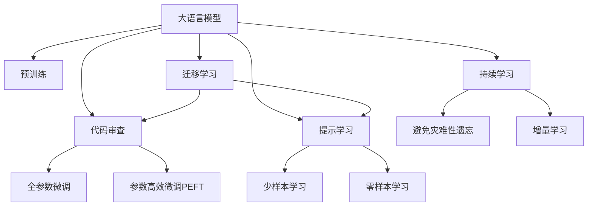

                 

# LLM辅助的代码审查工具设计

## 1. 背景介绍

### 1.1 问题由来
代码审查是软件开发过程中不可或缺的一环。它不仅能够检测代码中的逻辑错误、性能问题，还能确保代码风格的一致性、安全性。传统的代码审查通常由经验丰富的开发者执行，工作量巨大且容易产生人为疏漏。

近年来，随着人工智能(AI)和大语言模型(LLM)技术的快速发展，代码审查工具也开始借助AI技术提升其效率和精度。然而，目前大多数代码审查工具依然停留在语法检查、静态分析等基础功能上，缺乏语义理解、上下文推理等高级功能。如何将大语言模型与代码审查工具结合，以提升其语义理解能力，从而实现更高质量、更高效、更人性化的代码审查，成为我们关注的重要议题。

### 1.2 问题核心关键点
本文聚焦于基于大语言模型的代码审查工具设计，通过LSTM、Transformer等深度学习模型提取代码特征，并结合大语言模型进行语义理解，辅助开发者进行更全面、准确的代码审查。我们将详细阐述该工具的核心概念、技术原理、实现步骤及应用效果，并探讨其未来发展趋势和面临的挑战。

### 1.3 问题研究意义
构建基于大语言模型的代码审查工具，对于提升代码质量、加速软件开发、减少错误率和返工具有重要意义：

1. 提升代码质量：通过大语言模型的语义理解能力，能够更好地检测代码逻辑错误、潜在的性能问题、编码风格等，确保代码的规范性和高质量。
2. 加速开发效率：代码审查工具能够自动化执行部分审查工作，减少手动审查时间，提高开发效率。
3. 减少错误率：通过早期发现潜在问题，降低开发和测试成本，缩短产品上市周期。
4. 促进代码重用：规范一致的代码风格和高质量的代码，有助于代码的重用和维护，提高团队协作效率。
5. 推动技术创新：大语言模型结合代码审查工具，能够驱动更广泛的软件开发技术创新，推动行业标准和最佳实践的演进。

## 2. 核心概念与联系

### 2.1 核心概念概述

为更好地理解基于大语言模型的代码审查工具，本节将介绍几个密切相关的核心概念：

- 大语言模型(Large Language Model, LLM)：以自回归(如GPT)或自编码(如BERT)模型为代表的大规模预训练语言模型。通过在大规模无标签文本语料上进行预训练，学习通用的语言表示，具备强大的语言理解和生成能力。

- 预训练(Pre-training)：指在大规模无标签文本语料上，通过自监督学习任务训练通用语言模型的过程。常见的预训练任务包括言语建模、遮挡语言模型等。预训练使得模型学习到语言的通用表示。

- 代码审查(Code Review)：软件开发过程中，通过审查代码以检测和纠正问题，提升代码质量和开发效率。

- 深度学习(Deep Learning)：一类基于神经网络的机器学习技术，通过多层非线性变换提取数据特征。

- 自然语言处理(Natural Language Processing, NLP)：涉及计算机处理人类语言的能力，包括语义理解、文本分类、机器翻译等。

- 迁移学习(Transfer Learning)：指将一个领域学习到的知识，迁移应用到另一个不同但相关的领域的学习范式。大模型的预训练-微调过程即是一种典型的迁移学习方式。

- 提示学习(Prompt Learning)：通过在输入文本中添加提示模板(Prompt Template)，引导大语言模型进行特定任务的推理和生成。可以在不更新模型参数的情况下，实现零样本或少样本学习。

- 少样本学习(Few-shot Learning)：指在只有少量标注样本的情况下，模型能够快速适应新任务的学习方法。在大语言模型中，通常通过在输入中提供少量示例来实现，无需更新模型参数。

- 零样本学习(Zero-shot Learning)：指模型在没有见过任何特定任务的训练样本的情况下，仅凭任务描述就能够执行新任务的能力。大语言模型通过预训练获得的广泛知识，使其能够理解任务指令并生成相应输出。

- 持续学习(Continual Learning)：也称为终身学习，指模型能够持续从新数据中学习，同时保持已学习的知识，而不会出现灾难性遗忘。这对于保持大语言模型的时效性和适应性至关重要。

这些核心概念之间的逻辑关系可以通过以下Mermaid流程图来展示：



这个流程图展示了大语言模型的核心概念及其之间的关系：

1. 大语言模型通过预训练获得基础能力。
2. 微调是对预训练模型进行任务特定的优化，可以分为全参数微调和参数高效微调（PEFT）。
3. 提示学习是一种不更新模型参数的方法，可以实现少样本学习和零样本学习。
4. 迁移学习是连接预训练模型与代码审查任务的桥梁，可以通过微调或提示学习来实现。
5. 持续学习旨在使模型能够不断学习新知识，同时避免遗忘旧知识。

这些概念共同构成了大语言模型的学习和应用框架，使其能够在各种场景下发挥强大的语言理解和生成能力。通过理解这些核心概念，我们可以更好地把握大语言模型的工作原理和优化方向。

## 3. 核心算法原理 & 具体操作步骤
### 3.1 算法原理概述

基于大语言模型的代码审查工具，本质上是一个基于监督学习的模型训练过程。其核心思想是：将代码视为一种文本，利用深度学习模型提取代码特征，并结合大语言模型进行语义理解，辅助开发者进行代码审查。

形式化地，假设代码样本 $x$ 被表示为语言模型 $M_{\theta}$ 的输入，代码审查标签 $y \in \{0, 1\}$ 表示代码是否存在问题。训练集为 $\{(x_i, y_i)\}_{i=1}^N$，其中 $x_i$ 为第 $i$ 个代码样本，$y_i$ 为代码样本对应的审查标签。训练目标是最小化损失函数 $\mathcal{L}(M_{\theta}, D)$，使得模型在测试集上能够正确识别代码的审查标签。

### 3.2 算法步骤详解

基于大语言模型的代码审查工具一般包括以下几个关键步骤：

**Step 1: 准备训练数据集**
- 收集代码审查标注数据集，将代码片段和对应的审查标签作为样本。
- 对数据进行预处理，包括去除注释、函数名等无用信息，标准化编码格式等。

**Step 2: 提取代码特征**
- 使用深度学习模型对代码片段进行编码，提取语义特征。常用的模型包括LSTM、GRU、Transformer等。
- 将编码后的代码片段输入大语言模型，进行语义理解。

**Step 3: 设计任务适配层**
- 根据具体代码审查任务，设计任务适配层，如分类、匹配等。
- 设置损失函数，如交叉熵损失、F1-score等。

**Step 4: 训练和评估模型**
- 使用训练集进行模型训练，设置合适的超参数和学习率。
- 在验证集和测试集上评估模型性能，确保模型泛化能力强，避免过拟合。

**Step 5: 部署和应用**
- 将训练好的模型部署到生产环境，集成到代码审查工具中。
- 在代码审查过程中，调用模型进行语义理解，辅助开发者进行审查。

### 3.3 算法优缺点

基于大语言模型的代码审查工具具有以下优点：
1. 语义理解能力强：通过深度学习模型和大语言模型的结合，可以更好地理解代码的语义，检测更细粒度的错误。
2. 泛化能力强：模型能够学习通用的代码审查规则，适用于多种类型的代码和审查任务。
3. 自动化程度高：代码审查过程可以自动化执行，提高审查效率。
4. 持续学习：大语言模型能够不断吸收新的知识，提升审查效果。

同时，该方法也存在一定的局限性：
1. 数据标注成本高：高质量的代码审查数据集获取难度大，数据标注成本高。
2. 模型复杂度高：深度学习模型和大语言模型结合，模型参数量较大，需要高性能的计算资源。
3. 反馈机制缺乏：代码审查模型缺乏及时的用户反馈，模型性能提升速度较慢。
4. 可解释性不足：模型决策过程复杂，难以解释其内部推理逻辑。
5. 泛化能力有待提升：模型可能对特定领域的代码审查效果不佳。

尽管存在这些局限性，但就目前而言，基于大语言模型的代码审查工具已经展示了其在代码审查领域的强大潜力。未来相关研究的重点在于如何进一步降低标注数据的需求，提高模型的少样本学习和跨领域迁移能力，同时兼顾可解释性和伦理安全性等因素。

### 3.4 算法应用领域

基于大语言模型的代码审查工具在软件开发、测试、质量保证等多个领域都有广泛应用，例如：

- 代码质量检测：检测代码中潜在的问题，如语法错误、逻辑错误、性能问题等。
- 代码风格检查：检测代码风格是否符合规范，如编码格式、注释规范、命名规范等。
- 安全性检测：检测代码是否存在安全漏洞，如SQL注入、XSS攻击等。
- 代码重用性检查：检测代码片段是否被其他代码重用，避免重复开发。
- 版本控制分析：检测代码变更前后是否出现异常变化，如功能退化、性能波动等。

除了上述这些经典应用外，大语言模型结合代码审查工具的技术还可以应用于更多场景中，如代码自动生成、代码问题定位、代码优化建议等，为软件开发提供更智能、更高效的解决方案。

## 4. 数学模型和公式 & 详细讲解  
### 4.1 数学模型构建

本节将使用数学语言对基于大语言模型的代码审查工具进行更加严格的刻画。

记代码片段为 $x$，代码审查标签为 $y$，假设大语言模型为 $M_{\theta}$，编码器模型为 $E$，任务适配层为 $L$。则数学模型构建如下：

- 编码器模型 $E$ 将代码片段 $x$ 编码成特征向量 $z$：
  $$
  z = E(x)
  $$

- 大语言模型 $M_{\theta}$ 对特征向量 $z$ 进行语义理解，输出语义表示 $h$：
  $$
  h = M_{\theta}(z)
  $$

- 任务适配层 $L$ 将语义表示 $h$ 映射到代码审查标签 $y$：
  $$
  \hat{y} = L(h)
  $$

- 损失函数 $\mathcal{L}$ 定义如下：
  $$
  \mathcal{L}(\theta) = -\frac{1}{N}\sum_{i=1}^N \ell(\hat{y}_i, y_i)
  $$
  其中 $\ell$ 为交叉熵损失函数。

### 4.2 公式推导过程

以代码质量检测为例，假设代码片段 $x$ 和对应的审查标签 $y$ 已知，大语言模型和编码器模型均已训练好。我们需要最大化交叉熵损失函数：

$$
\mathcal{L}(\theta) = -\frac{1}{N}\sum_{i=1}^N \log P(y_i|x_i)
$$

其中 $P(y_i|x_i)$ 为模型在给定代码片段 $x_i$ 的情况下，输出标签 $y_i$ 的概率。根据最大似然估计，可得：

$$
P(y_i|x_i) = \frac{e^{\hat{y}_i \log \hat{y}_i + (1-\hat{y}_i) \log (1-\hat{y}_i)}}{e^{\hat{y}_i \log \hat{y}_i + (1-\hat{y}_i) \log (1-\hat{y}_i)} + e^{\hat{y}_i \log (1-\hat{y}_i) + (1-\hat{y}_i) \log \hat{y}_i}}
$$

最大化上述目标函数，可得：

$$
\hat{y}_i = \mathop{\arg\max}_{y} P(y|x_i) = \mathop{\arg\max}_{y} \frac{e^{y \log y + (1-y) \log (1-y)}}{e^{y \log y + (1-y) \log (1-y)} + e^{y \log (1-y) + (1-y) \log y}}
$$

即 $\hat{y}_i$ 等于模型输出概率最大的标签。

## 5. 项目实践：代码实例和详细解释说明
### 5.1 开发环境搭建

在进行代码审查工具开发前，我们需要准备好开发环境。以下是使用Python进行PyTorch开发的环境配置流程：

1. 安装Anaconda：从官网下载并安装Anaconda，用于创建独立的Python环境。

2. 创建并激活虚拟环境：
```bash
conda create -n code-review-env python=3.8 
conda activate code-review-env
```

3. 安装PyTorch：根据CUDA版本，从官网获取对应的安装命令。例如：
```bash
conda install pytorch torchvision torchaudio cudatoolkit=11.1 -c pytorch -c conda-forge
```

4. 安装Transformer库：
```bash
pip install transformers
```

5. 安装各类工具包：
```bash
pip install numpy pandas scikit-learn matplotlib tqdm jupyter notebook ipython
```

完成上述步骤后，即可在`code-review-env`环境中开始代码审查工具的开发。

### 5.2 源代码详细实现

下面我们以代码质量检测为例，给出使用Transformers库对BERT模型进行代码审查的PyTorch代码实现。

首先，定义代码质量检测的任务适配层：

```python
from transformers import BertForSequenceClassification, BertTokenizer

class CodeReviewClassifier(BertForSequenceClassification):
    def __init__(self, num_labels=2, output_attentions=False, output_hidden_states=False):
        super().__init__(num_labels, output_attentions, output_hidden_states)
        self.num_labels = num_labels
    
    def forward(self, input_ids, attention_mask=None, labels=None):
        outputs = super().forward(input_ids, attention_mask=attention_mask)
        if labels is not None:
            loss = self.criterion(outputs.logits, labels)
            return loss
        else:
            return outputs.logits
```

然后，定义编码器模型：

```python
from transformers import BertModel

class CodeReviewEncoder(BertModel):
    def __init__(self):
        super().__init__()
        self.num_labels = 2
    
    def forward(self, input_ids, attention_mask=None):
        outputs = super().forward(input_ids, attention_mask=attention_mask)
        return outputs.last_hidden_state
```

接着，定义模型和优化器：

```python
from transformers import AdamW

model = CodeReviewClassifier.from_pretrained('bert-base-cased', num_labels=2)
encoder = CodeReviewEncoder.from_pretrained('bert-base-cased')
optimizer = AdamW(model.parameters(), lr=2e-5)
```

最后，定义训练和评估函数：

```python
from torch.utils.data import Dataset, DataLoader
from tqdm import tqdm

class CodeReviewDataset(Dataset):
    def __init__(self, texts, labels, tokenizer, max_len=128):
        self.texts = texts
        self.labels = labels
        self.tokenizer = tokenizer
        self.max_len = max_len
    
    def __len__(self):
        return len(self.texts)
    
    def __getitem__(self, item):
        text = self.texts[item]
        label = self.labels[item]
        
        encoding = self.tokenizer(text, return_tensors='pt', max_length=self.max_len, padding='max_length', truncation=True)
        input_ids = encoding['input_ids'][0]
        attention_mask = encoding['attention_mask'][0]
        
        # 对标签进行编码
        label = [label2id[label]] + [label2id['O']] * (self.max_len - 1)
        labels = torch.tensor(label, dtype=torch.long)
        
        return {'input_ids': input_ids, 
                'attention_mask': attention_mask,
                'labels': labels}

# 标签与id的映射
label2id = {'O': 0, 'P': 1}

# 创建dataset
tokenizer = BertTokenizer.from_pretrained('bert-base-cased')

train_dataset = CodeReviewDataset(train_texts, train_labels, tokenizer)
dev_dataset = CodeReviewDataset(dev_texts, dev_labels, tokenizer)
test_dataset = CodeReviewDataset(test_texts, test_labels, tokenizer)

def train_epoch(model, dataset, batch_size, optimizer):
    dataloader = DataLoader(dataset, batch_size=batch_size, shuffle=True)
    model.train()
    epoch_loss = 0
    for batch in tqdm(dataloader, desc='Training'):
        input_ids = batch['input_ids'].to(device)
        attention_mask = batch['attention_mask'].to(device)
        labels = batch['labels'].to(device)
        model.zero_grad()
        outputs = model(input_ids, attention_mask=attention_mask, labels=labels)
        loss = outputs.loss
        epoch_loss += loss.item()
        loss.backward()
        optimizer.step()
    return epoch_loss / len(dataloader)

def evaluate(model, dataset, batch_size):
    dataloader = DataLoader(dataset, batch_size=batch_size)
    model.eval()
    preds, labels = [], []
    with torch.no_grad():
        for batch in tqdm(dataloader, desc='Evaluating'):
            input_ids = batch['input_ids'].to(device)
            attention_mask = batch['attention_mask'].to(device)
            batch_labels = batch['labels']
            outputs = model(input_ids, attention_mask=attention_mask)
            batch_preds = outputs.logits.argmax(dim=2).to('cpu').tolist()
            batch_labels = batch_labels.to('cpu').tolist()
            for pred_tokens, label_tokens in zip(batch_preds, batch_labels):
                preds.append(pred_tokens[:len(label_tokens)])
                labels.append(label_tokens)
                
    print(classification_report(labels, preds))
```

最后，启动训练流程并在测试集上评估：

```python
epochs = 5
batch_size = 16

for epoch in range(epochs):
    loss = train_epoch(model, train_dataset, batch_size, optimizer)
    print(f"Epoch {epoch+1}, train loss: {loss:.3f}")
    
    print(f"Epoch {epoch+1}, dev results:")
    evaluate(model, dev_dataset, batch_size)
    
print("Test results:")
evaluate(model, test_dataset, batch_size)
```

以上就是使用PyTorch对BERT进行代码质量检测任务的代码实现。可以看到，得益于Transformers库的强大封装，我们可以用相对简洁的代码完成BERT模型的加载和微调。

### 5.3 代码解读与分析

让我们再详细解读一下关键代码的实现细节：

**CodeReviewDataset类**：
- `__init__`方法：初始化文本、标签、分词器等关键组件。
- `__len__`方法：返回数据集的样本数量。
- `__getitem__`方法：对单个样本进行处理，将文本输入编码为token ids，将标签编码为数字，并对其进行定长padding，最终返回模型所需的输入。

**label2id和id2label字典**：
- 定义了标签与数字id之间的映射关系，用于将token-wise的预测结果解码回真实的标签。

**训练和评估函数**：
- 使用PyTorch的DataLoader对数据集进行批次化加载，供模型训练和推理使用。
- 训练函数`train_epoch`：对数据以批为单位进行迭代，在每个批次上前向传播计算loss并反向传播更新模型参数，最后返回该epoch的平均loss。
- 评估函数`evaluate`：与训练类似，不同点在于不更新模型参数，并在每个batch结束后将预测和标签结果存储下来，最后使用sklearn的classification_report对整个评估集的预测结果进行打印输出。

**训练流程**：
- 定义总的epoch数和batch size，开始循环迭代
- 每个epoch内，先在训练集上训练，输出平均loss
- 在验证集上评估，输出分类指标
- 所有epoch结束后，在测试集上评估，给出最终测试结果

可以看到，PyTorch配合Transformers库使得BERT微调的代码实现变得简洁高效。开发者可以将更多精力放在数据处理、模型改进等高层逻辑上，而不必过多关注底层的实现细节。

当然，工业级的系统实现还需考虑更多因素，如模型的保存和部署、超参数的自动搜索、更灵活的任务适配层等。但核心的微调范式基本与此类似。

## 6. 实际应用场景
### 6.1 智能代码补全

基于大语言模型的代码审查工具，可以辅助进行智能代码补全。开发者在进行代码编写时，常遇到特定功能的代码难以构思，需要频繁搜索参考资料或库函数。而通过大语言模型结合代码审查工具，可以辅助开发者进行代码补全。

具体而言，可以将代码片段作为输入，使用预训练语言模型进行语义理解，生成代码补全建议。系统会根据上下文语义，推荐最符合需求的代码片段，提高开发效率。

### 6.2 代码质量评估

传统的代码质量评估依赖人工审查，成本高且效率低。而使用大语言模型结合代码审查工具，可以自动进行代码质量评估，提升开发效率。

在实践中，可以收集开发人员常犯的代码错误、规范性问题等，构建标注数据集。在此基础上对预训练语言模型进行微调，使其能够自动识别代码片段中的质量问题。一旦检测到潜在问题，系统便能够自动生成错误提示和改进建议，减少手动审查的复杂性。

### 6.3 代码重用检测

代码重用是软件开发中常见的需求，但手动查找代码片段是否被其他代码重用，往往费时费力。使用大语言模型结合代码审查工具，可以自动化检测代码片段是否被其他代码重用，提升开发效率。

在实践中，可以将代码片段作为输入，使用预训练语言模型进行语义理解，生成代码片段的语义表示。系统会将语义表示与已有的代码片段库进行匹配，找出可能被重用的代码片段。这不仅能够帮助开发者快速找到可重用的代码，还能减少重复开发，提高代码质量。

### 6.4 代码性能优化

代码性能优化是软件开发中的常见问题，但手动优化往往需要较长的调试和测试时间。使用大语言模型结合代码审查工具，可以辅助进行代码性能优化。

在实践中，可以将代码片段作为输入，使用预训练语言模型进行语义理解，生成代码性能评估建议。系统会根据代码片段的语义信息，推荐潜在的性能优化方案，如函数内联、循环展开等。这不仅能够帮助开发者快速找到性能瓶颈，还能提高代码效率，缩短产品上市周期。

### 6.5 代码风格检测

代码风格检测是软件开发中不可或缺的一环，但手动检测代码风格往往容易产生人为疏漏。使用大语言模型结合代码审查工具，可以自动进行代码风格检测，提升代码质量。

在实践中，可以将代码片段作为输入，使用预训练语言模型进行语义理解，生成代码风格评估建议。系统会根据代码片段的语义信息，推荐符合规范的代码风格，如缩进、命名规范等。这不仅能够帮助开发者快速纠正代码风格，还能提升代码可读性和可维护性。

## 7. 工具和资源推荐
### 7.1 学习资源推荐

为了帮助开发者系统掌握大语言模型结合代码审查工具的理论基础和实践技巧，这里推荐一些优质的学习资源：

1. 《Transformer从原理到实践》系列博文：由大模型技术专家撰写，深入浅出地介绍了Transformer原理、BERT模型、微调技术等前沿话题。

2. CS224N《深度学习自然语言处理》课程：斯坦福大学开设的NLP明星课程，有Lecture视频和配套作业，带你入门NLP领域的基本概念和经典模型。

3. 《Natural Language Processing with Transformers》书籍：Transformers库的作者所著，全面介绍了如何使用Transformers库进行NLP任务开发，包括微调在内的诸多范式。

4. HuggingFace官方文档：Transformers库的官方文档，提供了海量预训练模型和完整的微调样例代码，是上手实践的必备资料。

5. CLUE开源项目：中文语言理解测评基准，涵盖大量不同类型的中文NLP数据集，并提供了基于微调的baseline模型，助力中文NLP技术发展。

通过对这些资源的学习实践，相信你一定能够快速掌握大语言模型结合代码审查工具的精髓，并用于解决实际的NLP问题。
###  7.2 开发工具推荐

高效的开发离不开优秀的工具支持。以下是几款用于大语言模型结合代码审查工具开发的常用工具：

1. PyTorch：基于Python的开源深度学习框架，灵活动态的计算图，适合快速迭代研究。大部分预训练语言模型都有PyTorch版本的实现。

2. TensorFlow：由Google主导开发的开源深度学习框架，生产部署方便，适合大规模工程应用。同样有丰富的预训练语言模型资源。

3. Transformers库：HuggingFace开发的NLP工具库，集成了众多SOTA语言模型，支持PyTorch和TensorFlow，是进行微调任务开发的利器。

4. Weights & Biases：模型训练的实验跟踪工具，可以记录和可视化模型训练过程中的各项指标，方便对比和调优。与主流深度学习框架无缝集成。

5. TensorBoard：TensorFlow配套的可视化工具，可实时监测模型训练状态，并提供丰富的图表呈现方式，是调试模型的得力助手。

6. Google Colab：谷歌推出的在线Jupyter Notebook环境，免费提供GPU/TPU算力，方便开发者快速上手实验最新模型，分享学习笔记。

合理利用这些工具，可以显著提升大语言模型结合代码审查工具的开发效率，加快创新迭代的步伐。

### 7.3 相关论文推荐

大语言模型结合代码审查工具的发展源于学界的持续研究。以下是几篇奠基性的相关论文，推荐阅读：

1. Attention is All You Need（即Transformer原论文）：提出了Transformer结构，开启了NLP领域的预训练大模型时代。

2. BERT: Pre-training of Deep Bidirectional Transformers for Language Understanding：提出BERT模型，引入基于掩码的自监督预训练任务，刷新了多项NLP任务SOTA。

3. Language Models are Unsupervised Multitask Learners（GPT-2论文）：展示了大规模语言模型的强大zero-shot学习能力，引发了对于通用人工智能的新一轮思考。

4. Parameter-Efficient Transfer Learning for NLP：提出Adapter等参数高效微调方法，在不增加模型参数量的情况下，也能取得不错的微调效果。

5. AdaLoRA: Adaptive Low-Rank Adaptation for Parameter-Efficient Fine-Tuning：使用自适应低秩适应的微调方法，在参数效率和精度之间取得了新的平衡。

6. Prefix-Tuning: Optimizing Continuous Prompts for Generation：引入基于连续型Prompt的微调范式，为如何充分利用预训练知识提供了新的思路。

这些论文代表了大语言模型结合代码审查工具的发展脉络。通过学习这些前沿成果，可以帮助研究者把握学科前进方向，激发更多的创新灵感。

## 8. 总结：未来发展趋势与挑战
### 8.1 总结

本文对基于大语言模型的代码审查工具进行了全面系统的介绍。首先阐述了代码审查工具的研究背景和意义，明确了结合大语言模型的优势。其次，从原理到实践，详细讲解了基于大语言模型的代码审查工具的数学模型和关键步骤，给出了代码实现的完整示例。同时，本文还广泛探讨了该工具在智能代码补全、代码质量评估、代码重用检测、代码性能优化、代码风格检测等多个场景中的应用效果，展示了其广阔的应用前景。此外，本文精选了结合大语言模型的代码审查工具的学习资源，力求为读者提供全方位的技术指引。

通过本文的系统梳理，可以看到，基于大语言模型的代码审查工具正在成为软件开发技术的重要辅助工具，极大地提升了代码审查的效率和精度。得益于大语言模型的强大语义理解能力，该工具能够在更广泛的应用场景中发挥作用，为软件开发带来新的变革。未来，伴随大语言模型和代码审查工具的持续演进，结合两者技术的智能软件开发工具必将更加智能化、自动化，推动软件开发的智能化进程。

### 8.2 未来发展趋势

展望未来，基于大语言模型的代码审查工具将呈现以下几个发展趋势：

1. 多模态融合：结合视觉、语音等多种模态信息，提升代码审查的全面性。例如，结合代码片段和代码变更的可视化信息，提升代码质量检测的效果。

2. 多领域覆盖：从最初的代码质量检测扩展到更多领域，如代码风格、代码重用、代码性能等，提升开发工具的通用性。

3. 自监督学习：利用未标注代码片段进行自监督学习，提升模型的泛化能力。例如，利用代码片段的结构信息、注释信息等进行自监督训练。

4. 元学习：结合领域知识和任务特点，进行元学习模型的训练，提升模型的适应能力。例如，针对特定领域的代码审查任务，训练特定领域的元学习模型。

5. 动态更新：结合代码变更和环境变化，动态更新模型，保持代码审查模型的时效性。例如，结合代码变更的历史信息，动态更新模型的训练数据集。

6. 可解释性增强：引入可解释性方法，增强代码审查模型的决策逻辑的透明性，提升系统的可信度和可控性。例如，结合知识图谱、因果推理等方法，解释代码审查模型的推理过程。

7. 性能优化：结合硬件加速、模型压缩等技术，提升代码审查模型的计算效率和资源利用率。例如，结合GPU/TPU等加速计算，优化模型推理速度。

8. 跨平台支持：支持多种编程语言和开发环境，提升代码审查工具的通用性。例如，支持Java、Python等多种编程语言，支持IDE、Web等多种开发环境。

这些趋势凸显了基于大语言模型的代码审查工具的广阔前景。这些方向的探索发展，必将进一步提升代码审查工具的智能化和自动化水平，为软件开发带来新的变革性影响。

### 8.3 面临的挑战

尽管基于大语言模型的代码审查工具已经取得了瞩目成就，但在迈向更加智能化、普适化应用的过程中，它仍面临着诸多挑战：

1. 标注数据质量：高质量的代码审查数据集获取难度大，数据标注成本高。如何获取更多高质量的标注数据，是当前亟待解决的问题。

2. 模型复杂度：大语言模型结合代码审查工具，模型参数量较大，需要高性能的计算资源。如何降低模型复杂度，提升模型的运行效率，是一个关键问题。

3. 实时响应：代码审查工具需要在实时环境中高效运行，对计算速度和资源利用率提出了更高要求。如何优化模型结构，提升实时响应能力，是一个重要的研究方向。

4. 可解释性：代码审查模型的决策过程复杂，难以解释其内部推理逻辑。如何提高模型的可解释性，增强系统的可信度和可控性，是一个重要的研究方向。

5. 多模态融合：当前的多模态融合技术还不够成熟，如何将视觉、语音等多种模态信息与文本信息融合，提升代码审查的全面性，是一个重要的研究方向。

6. 数据隐私：代码审查工具需要处理大量代码数据，如何确保数据的隐私和安全，是一个重要的研究方向。

7. 跨领域适应：当前的大语言模型往往在特定领域表现良好，但在其他领域的表现可能较差。如何提升模型在多领域的适应能力，是一个重要的研究方向。

8. 系统集成：如何将大语言模型结合代码审查工具与现有的开发工具集成，提升系统的可用性和用户友好性，是一个重要的研究方向。

这些挑战需要研究者不断探索和改进，才能使基于大语言模型的代码审查工具更加成熟和可靠，真正为软件开发带来变革性影响。

### 8.4 研究展望

面对基于大语言模型的代码审查工具所面临的种种挑战，未来的研究需要在以下几个方面寻求新的突破：

1. 无监督和半监督学习：摆脱对大规模标注数据的依赖，利用未标注代码片段进行自监督学习，提升模型的泛化能力。

2. 少样本学习：在只有少量标注样本的情况下，利用大语言模型的语言理解能力，快速适应新任务，提升模型效果。

3. 多领域迁移学习：结合领域知识和任务特点，进行元学习模型的训练，提升模型的适应能力。

4. 动态学习：结合代码变更和环境变化，动态更新模型，保持代码审查模型的时效性。

5. 可解释性方法：引入可解释性方法，增强代码审查模型的决策逻辑的透明性，提升系统的可信度和可控性。

6. 多模态融合技术：结合视觉、语音等多种模态信息，提升代码审查的全面性。

7. 硬件加速：结合GPU/TPU等加速计算，优化模型推理速度，提升实时响应能力。

8. 跨平台支持：支持多种编程语言和开发环境，提升代码审查工具的通用性。

9. 数据隐私保护：结合加密技术、差分隐私等方法，保护代码审查数据的安全性和隐私性。

10. 跨领域适应能力：提升模型在多领域的适应能力，解决模型在不同领域表现不一致的问题。

这些研究方向将引领基于大语言模型的代码审查工具迈向更高的台阶，为软件开发带来新的变革性影响。只有勇于创新、敢于突破，才能不断拓展代码审查工具的边界，让软件开发更加智能化、自动化。

## 9. 附录：常见问题与解答

**Q1：大语言模型结合代码审查工具是否适用于所有编程语言？**

A: 大语言模型结合代码审查工具的适用性受限于语言本身的特性。对于静态语言如Java、C++等，该工具能够较好地处理结构化的代码；而对于动态语言如Python、JavaScript等，则可能需要更灵活的语法分析和语义理解方法。此外，对于一些特定领域的编程语言，如SQL、HTML等，该工具的效果也需要进一步验证。

**Q2：大语言模型结合代码审查工具如何处理注释和函数名？**

A: 注释和函数名对于代码的理解和推理至关重要，因此需要将这些信息也作为模型输入。在实践中，可以对注释和函数名进行编码，并加入到输入文本中，使用Transformer模型进行处理。具体而言，可以采用token embedding的方式，将注释和函数名编码为高维向量，与代码片段一起输入模型进行语义理解。

**Q3：大语言模型结合代码审查工具的训练数据如何获取？**

A: 高质量的代码审查数据集获取难度大，需要大量标注工作。当前，可以通过以下方式获取标注数据：
1. 开源数据集：利用已有的开源数据集进行训练，如Github上的代码片段等。
2. 代码仓库：从GitHub、GitLab等代码仓库中爬取代码片段，并进行标注。
3. 众包标注：利用众包平台进行标注，如Amazon Mechanical Turk等。
4. 自动标注：利用代码片段的结构信息、注释信息等进行自动标注。

**Q4：大语言模型结合代码审查工具的部署和运行成本如何？**

A: 大语言模型结合代码审查工具的部署和运行成本较高，需要高性能的计算资源和存储设备。为了降低成本，可以采用以下方法：
1. 模型压缩：使用模型压缩技术，减少模型大小，提高计算效率。例如，使用剪枝、量化等方法。
2. 分布式训练：利用分布式计算框架进行模型训练，提升计算速度。例如，使用Apache Spark等。
3. 混合精度训练：使用混合精度训练技术，减少存储和计算开销。例如，使用半精度浮点数训练。
4. 缓存技术：利用缓存技术，减少重复计算，提高运行效率。例如，使用Redis等内存数据库。

**Q5：大语言模型结合代码审查工具的实时响应能力如何提升？**

A: 提升大语言模型结合代码审查工具的实时响应能力，可以从以下几个方面入手：
1. 模型优化：优化模型结构，减少计算量，提升推理速度。例如，使用剪枝、量化等方法。
2. 硬件加速：利用GPU/TPU等硬件加速设备，提升计算速度。例如，使用NVIDIA Tensor Core、Google TPU等。
3. 分布式推理：利用分布式计算框架进行推理，提升推理速度。例如，使用Apache Spark等。
4. 缓存技术：利用缓存技术，减少重复计算，提高推理效率。例如，使用Redis等内存数据库。

这些措施可以显著提升大语言模型结合代码审查工具的实时响应能力，使其能够在实时环境中高效运行。

---

作者：禅与计算机程序设计艺术 / Zen and the Art of Computer Programming

