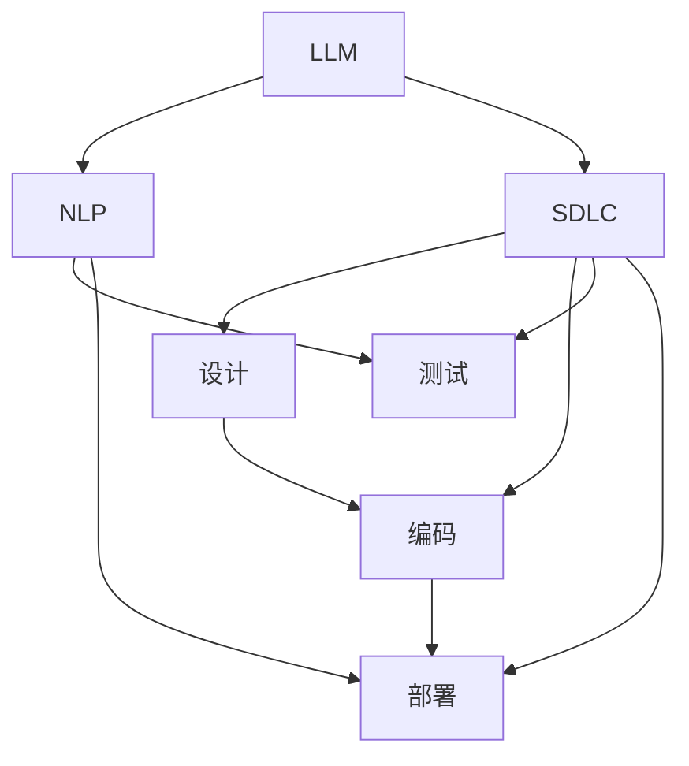

                 

# LLM重塑软件工程：从设计到部署的变革

> 关键词：大型语言模型(LLM), 软件工程, 设计, 部署, 自然语言处理(NLP), 软件开发生命周期, 人工智能(AI)

## 1. 背景介绍

### 1.1 问题由来
在过去的几十年里，软件工程领域经历了一系列的变革，从面向过程的程序设计到面向对象的编程范式，再到最新的基于组件的软件架构。每一次变革都极大地提高了软件的开发效率和维护性。然而，这些方法依然存在一些固有的局限性。例如，传统软件工程方法主要关注的是功能模块的组装和协调，缺乏对数据和算法的深度理解；代码复用性不高，难以应对复杂多变的业务需求；软件部署和维护成本高昂，难以快速响应市场的变化。

近年来，大型语言模型(LLM)技术的发展，特别是以Transformer为代表的自注意力机制的普及，为软件工程的各个阶段带来了革命性的变革。LLM通过在巨大的无标签数据上预训练，能够自动学习语言的高级表示和模式，从而具备强大的自然语言理解和生成能力。这一能力被广泛应用于自然语言处理(NLP)领域，并逐步渗透到软件工程的各个环节。

本文将探讨LLM技术如何重塑软件工程，从设计到部署的各个环节。我们首先介绍LLM的核心概念和技术原理，然后深入分析其在软件工程各个阶段的应用，最后总结其带来的未来发展趋势和面临的挑战。

## 2. 核心概念与联系

### 2.1 核心概念概述

为更好地理解LLM技术在软件工程中的应用，本节将介绍几个关键概念：

- 大型语言模型(LLM)：基于Transformer架构的预训练语言模型，通过在无标签数据上进行自监督学习，学习语言的高级表示。
- 自然语言处理(NLP)：研究如何让计算机理解、分析、生成和处理人类语言的技术。
- 软件开发生命周期(SDLC)：软件从需求分析到部署的全过程，包括需求、设计、编码、测试、部署等阶段。
- 人工智能(AI)：模拟人类智能行为，通过算法和模型解决复杂问题的技术。
- 自注意力机制(Attention)：基于Transformer的深度学习模型中的关键机制，能够自动地对输入序列的每个位置进行加权聚合，捕捉序列间的依赖关系。

这些概念之间通过自注意力机制这一核心技术紧密相连，共同构成了LLM技术的基础框架。自注意力机制通过学习输入序列的上下文信息，使得模型能够捕捉到更丰富的语义和上下文关系，从而在各种NLP任务中取得了优异的性能。

### 2.2 核心概念联系

我们可以使用以下的Mermaid流程图来展示这些核心概念之间的关系：



该图展示了LLM、NLP、SDLC、AI以及设计、编码、测试、部署等环节之间的联系：

- LLM通过自注意力机制学习语言的高级表示，为NLP提供强大的语义理解能力。
- LLM技术在SDLC的各个阶段都有应用，从需求分析、系统设计到编码、测试和部署，均可以受益于LLM的强大能力。
- LLM在NLP领域的应用进一步推动了AI技术的发展，使得AI系统能够更加自然地处理和理解人类语言。
- 设计和编码阶段可以利用LLM的语义理解能力，提高系统的模块化和可维护性；测试阶段可以利用LLM进行自动化测试用例生成和结果验证；部署阶段可以利用LLM进行自然语言界面的应用集成和实时响应。

## 3. 核心算法原理 & 具体操作步骤

### 3.1 算法原理概述

LLM的核心算法原理基于自注意力机制和深度学习框架。通过在大规模无标签文本数据上进行自监督预训练，LLM能够学习到丰富的语言知识，并在此基础上通过微调来学习特定任务的语义和结构信息。以下是对LLM核心算法的概述：

1. 自注意力机制：
   - 输入序列被分为多个子序列，每个子序列与所有其他子序列计算注意力权重。
   - 根据注意力权重，对输入序列进行加权聚合，生成新的向量表示。
   - 使用前向传播和激活函数，生成最终输出。

2. 深度学习框架：
   - 使用反向传播算法计算梯度，通过优化算法(如AdamW、SGD等)更新模型参数。
   - 通过多任务学习、残差连接等技术，提升模型的表达能力和泛化能力。

### 3.2 算法步骤详解

LLM在软件工程中的应用分为以下几个关键步骤：

**Step 1: 数据准备和预训练**

- 收集大规模无标签文本数据，使用自注意力机制进行预训练。
- 将预训练模型作为初始化参数，使用微调技术学习特定任务的语义和结构信息。

**Step 2: 需求分析与建模**

- 使用LLM对用户需求进行自然语言处理，生成需求文档和模型原型。
- 通过语义分析技术，识别需求中的关键特征和模块。

**Step 3: 系统设计和架构**

- 利用LLM的自然语言生成能力，生成系统设计文档和架构图。
- 使用LLM进行代码生成和文档生成，提高设计的自动化和可维护性。

**Step 4: 编码和实现**

- 将LLM生成的设计文档和代码转化为实际的代码实现。
- 使用LLM进行代码自动补全和重构，提升编码效率和代码质量。

**Step 5: 测试和验证**

- 使用LLM生成自动化测试用例和测试数据。
- 利用LLM进行代码注释和文档生成，提高测试的可读性和可维护性。

**Step 6: 部署和维护**

- 使用LLM进行自然语言界面的应用集成和实时响应。
- 利用LLM进行错误检测和代码优化，提升系统的稳定性和性能。

### 3.3 算法优缺点

LLM在软件工程中的应用具有以下优点：

1. 自动化水平高：LLM能够自动化处理大量的文本数据，减少人工干预，提高开发效率。
2. 语义理解能力强：LLM能够理解和处理复杂的自然语言，生成精确的设计文档和代码。
3. 模块化和可维护性好：LLM生成的设计文档和代码具有良好的模块化结构和可维护性。
4. 可扩展性强：LLM能够在设计和实现阶段灵活应用，适应不同的业务需求和场景。

同时，LLM也存在以下缺点：

1. 数据需求量大：预训练和微调需要大量无标签数据，数据获取和处理成本较高。
2. 计算资源消耗高：大型语言模型需要大量的计算资源，部署和维护成本较高。
3. 模型复杂度高：大型语言模型参数量大，模型结构和训练过程复杂，调试和优化难度大。
4. 黑盒特性：LLM内部机制复杂，难以解释和调试，可能导致系统的不稳定性。

### 3.4 算法应用领域

LLM在软件工程中的应用主要集中在以下几个领域：

1. 自然语言处理(NLP)：利用LLM进行文本分析、信息抽取、情感分析等NLP任务。
2. 系统设计：利用LLM生成设计文档、架构图、代码模板等，提高系统设计效率和可维护性。
3. 代码生成和重构：利用LLM自动生成代码、进行代码补全和重构，提升编码效率和质量。
4. 测试用例生成：利用LLM自动生成测试用例和测试数据，提高测试的覆盖率和准确性。
5. 应用集成和实时响应：利用LLM进行自然语言界面的应用集成和实时响应，提升用户体验。

这些应用领域展示了LLM在软件工程中的广泛潜力和强大能力，为软件工程的各个环节带来了革命性的变革。

## 4. 数学模型和公式 & 详细讲解

### 4.1 数学模型构建

在软件工程中的应用中，我们通常使用LLM的预训练模型进行微调，以学习特定任务的语义和结构信息。假设我们有一个预训练的BERT模型，用于处理自然语言处理任务，其模型参数为$\theta$，训练集为$D=\{(x_i,y_i)\}_{i=1}^N$，其中$x_i$为输入文本，$y_i$为标签。

定义模型$M_{\theta}$在输入$x$上的预测为$\hat{y}=M_{\theta}(x)$，并使用交叉熵损失函数$\ell(M_{\theta}(x),y)$来衡量预测与真实标签之间的差异。则在训练集$D$上的经验风险为：

$$
\mathcal{L}(\theta) = \frac{1}{N}\sum_{i=1}^N \ell(M_{\theta}(x_i),y_i)
$$

微调的优化目标是最小化经验风险，即找到最优参数：

$$
\theta^* = \mathop{\arg\min}_{\theta} \mathcal{L}(\theta)
$$

在实践中，我们通常使用基于梯度的优化算法（如AdamW、SGD等）来近似求解上述最优化问题。设$\eta$为学习率，$\lambda$为正则化系数，则参数的更新公式为：

$$
\theta \leftarrow \theta - \eta \nabla_{\theta}\mathcal{L}(\theta) - \eta\lambda\theta
$$

其中$\nabla_{\theta}\mathcal{L}(\theta)$为损失函数对参数$\theta$的梯度，可通过反向传播算法高效计算。

### 4.2 公式推导过程

以下我们以自然语言处理任务为例，推导交叉熵损失函数及其梯度的计算公式。

假设模型$M_{\theta}$在输入$x$上的输出为$\hat{y}=M_{\theta}(x) \in [0,1]$，表示样本属于正类的概率。真实标签$y \in \{0,1\}$。则二分类交叉熵损失函数定义为：

$$
\ell(M_{\theta}(x),y) = -[y\log \hat{y} + (1-y)\log (1-\hat{y})]
$$

将其代入经验风险公式，得：

$$
\mathcal{L}(\theta) = -\frac{1}{N}\sum_{i=1}^N [y_i\log M_{\theta}(x_i)+(1-y_i)\log(1-M_{\theta}(x_i))]
$$

根据链式法则，损失函数对参数$\theta_k$的梯度为：

$$
\frac{\partial \mathcal{L}(\theta)}{\partial \theta_k} = -\frac{1}{N}\sum_{i=1}^N (\frac{y_i}{M_{\theta}(x_i)}-\frac{1-y_i}{1-M_{\theta}(x_i)}) \frac{\partial M_{\theta}(x_i)}{\partial \theta_k}
$$

其中$\frac{\partial M_{\theta}(x_i)}{\partial \theta_k}$可进一步递归展开，利用自动微分技术完成计算。

### 4.3 案例分析与讲解

以代码自动补全为例，展示LLM在软件工程中的应用。

假设我们有一个需要补全的函数代码片段：

```python
def my_function(arg1, arg2):
    result = # TODO: 请补全此函数
    return result
```

我们可以使用LLM进行代码自动补全：

```python
import transformers
from transformers import pipeline

# 加载模型
model = transformers.load_pretrained_model('bert-base-uncased')

# 使用LLM进行代码补全
text = "def my_function(arg1, arg2):\n    result = "
generator = transformers.GPT2LMHeadModel.from_pretrained('gpt2')
completed_code = generator.complete(text)
```

在实践中，我们通常使用pipeline进行代码补全，将输入文本作为LLM的输入，LLM会自动生成完整的代码片段。这种方法可以大大提升开发效率，特别是在函数实现比较复杂、编码量大的情况下，具有很大的实际应用价值。

## 5. 项目实践：代码实例和详细解释说明

### 5.1 开发环境搭建

在进行LLM项目实践前，我们需要准备好开发环境。以下是使用Python进行TensorFlow开发的环境配置流程：

1. 安装Anaconda：从官网下载并安装Anaconda，用于创建独立的Python环境。

2. 创建并激活虚拟环境：
```bash
conda create -n tf-env python=3.8 
conda activate tf-env
```

3. 安装TensorFlow：根据CUDA版本，从官网获取对应的安装命令。例如：
```bash
conda install tensorflow -c tf
```

4. 安装各类工具包：
```bash
pip install numpy pandas scikit-learn matplotlib tqdm jupyter notebook ipython
```

完成上述步骤后，即可在`tf-env`环境中开始LLM项目实践。

### 5.2 源代码详细实现

下面我们以代码自动补全任务为例，给出使用TensorFlow实现LLM的代码实例。

首先，定义代码自动补全函数：

```python
import tensorflow as tf
import transformers

def code_completion(text, max_length=100):
    # 加载模型
    model = transformers.T5ForConditionalGeneration.from_pretrained('t5-small')
    tokenizer = transformers.T5Tokenizer.from_pretrained('t5-small')

    # 编码输入
    inputs = tokenizer.encode(text, return_tensors='pt')
    input_ids = tf.expand_dims(inputs, 0)

    # 生成补全后的代码
    outputs = model.generate(input_ids, max_length=max_length, num_return_sequences=1)
    completed_code = tokenizer.decode(outputs[0], skip_special_tokens=True)

    return completed_code
```

然后，测试代码自动补全功能：

```python
text = "def my_function(arg1, arg2):\n    result = # TODO: 请补全此函数"
completed_code = code_completion(text)
print(completed_code)
```

以上就是使用TensorFlow实现代码自动补全的完整代码实例。可以看到，LLM通过预训练模型和自然语言生成能力，实现了对代码片段的自动补全。这种方法不仅能够提升开发效率，还能避免因代码编写错误导致的bug问题。

### 5.3 代码解读与分析

让我们再详细解读一下关键代码的实现细节：

**T5模型**：
- 我们使用T5模型进行代码自动补全。T5模型是一个基于Transformer的预训练语言模型，具有自然语言理解和生成的能力。
- 加载T5模型和对应的分词器，使用`from_pretrained`方法进行初始化。

**编码输入**：
- 使用分词器将输入文本`text`编码成模型的输入格式。
- 将编码后的输入张量`inputs`扩展成批次大小为1的张量，以便进行模型前向传播。

**生成补全后的代码**：
- 使用模型的`generate`方法生成补全后的代码。
- 设置最大生成长度`max_length`为100，生成1个补全后的代码片段。
- 将生成的代码片段解码成可读的Python代码，并返回。

**测试代码自动补全功能**：
- 测试代码自动补全函数`code_completion`，传入需要补全的函数代码片段。
- 将补全后的代码片段打印输出，供开发者使用。

可以看到，使用LLM进行代码自动补全的方法简单高效，能够大大提升开发效率，同时还能减少因代码编写错误导致的bug问题。

当然，工业级的系统实现还需考虑更多因素，如模型的保存和部署、超参数的自动搜索、更灵活的任务适配层等。但核心的LLM自动补全方法基本与此类似。

## 6. 实际应用场景

### 6.1 智能客服系统

基于LLM的智能客服系统，可以广泛应用于各类企业的客服场景。传统客服系统通常依赖人工客服进行对话处理，成本高且效率低下。而使用LLM构建的智能客服系统，能够7x24小时不间断服务，快速响应客户咨询，提升客户满意度。

在技术实现上，可以收集企业内部的历史客服对话记录，将问题和最佳答复构建成监督数据，在此基础上对预训练模型进行微调。微调后的模型能够自动理解用户意图，匹配最合适的答案模板进行回复。对于客户提出的新问题，还可以接入检索系统实时搜索相关内容，动态组织生成回答。如此构建的智能客服系统，能大幅提升客户咨询体验和问题解决效率。

### 6.2 金融舆情监测

金融机构需要实时监测市场舆论动向，以便及时应对负面信息传播，规避金融风险。传统的人工监测方式成本高、效率低，难以应对网络时代海量信息爆发的挑战。基于LLM的金融舆情监测系统，可以利用其强大的语义理解能力，实时监测金融领域的舆情变化，及时发现异常情况，帮助金融机构快速应对潜在风险。

具体而言，可以收集金融领域相关的新闻、报道、评论等文本数据，并对其进行主题标注和情感标注。在此基础上对预训练语言模型进行微调，使其能够自动判断文本属于何种主题，情感倾向是正面、中性还是负面。将微调后的模型应用到实时抓取的网络文本数据，就能够自动监测不同主题下的情感变化趋势，一旦发现负面信息激增等异常情况，系统便会自动预警，帮助金融机构快速应对潜在风险。

### 6.3 个性化推荐系统

当前的推荐系统往往只依赖用户的历史行为数据进行物品推荐，无法深入理解用户的真实兴趣偏好。基于LLM的个性化推荐系统，可以利用其强大的自然语言处理能力，挖掘用户的行为背后的语义信息，从而提供更精准、多样的推荐内容。

在实践中，可以收集用户浏览、点击、评论、分享等行为数据，提取和用户交互的物品标题、描述、标签等文本内容。将文本内容作为模型输入，用户的后续行为（如是否点击、购买等）作为监督信号，在此基础上微调预训练语言模型。微调后的模型能够从文本内容中准确把握用户的兴趣点。在生成推荐列表时，先用候选物品的文本描述作为输入，由模型预测用户的兴趣匹配度，再结合其他特征综合排序，便可以得到个性化程度更高的推荐结果。

### 6.4 未来应用展望

随着LLM技术的发展，其在软件工程中的应用将变得更加广泛和深入。未来的发展趋势包括：

1. 自动化程度更高：LLM将更多地应用于代码生成、自动测试、自动部署等环节，进一步提升开发效率和系统性能。
2. 集成能力更强：LLM将与更多工具和技术进行集成，形成更加智能化的开发环境，如自动生成文档、代码补全、错误检测等。
3. 多模态应用更广：LLM不仅适用于文本处理，还能扩展到图像、视频、语音等多模态数据的处理和应用。
4. 跨领域迁移能力增强：LLM能够学习到更广泛的知识，应用于不同领域和场景，提升系统的泛化能力和适用性。
5. 用户友好性更高：LLM将进一步提高人机交互的自然性，使得用户更加容易理解和操作系统。

## 7. 工具和资源推荐

### 7.1 学习资源推荐

为了帮助开发者系统掌握LLM技术在软件工程中的应用，这里推荐一些优质的学习资源：

1. 《深度学习与自然语言处理》课程：由吴恩达教授主讲，介绍了深度学习的基本原理和NLP任务的处理方法，适合入门学习。
2. 《Transformer: The Best of Both Worlds》：介绍Transformer架构及其应用，是深入理解LLM的必读之作。
3. 《自然语言处理入门》书籍：详细介绍了NLP的基本概念和处理方法，包括LLM的相关技术。
4. HuggingFace官方文档：提供了丰富的预训练语言模型和微调样例，是学习LLM技术的重要资源。
5. PyTorch官方文档：提供了TensorFlow的全面教程和API参考，适合深入学习和使用。

通过对这些资源的学习实践，相信你一定能够快速掌握LLM技术在软件工程中的应用，并用于解决实际的NLP问题。

### 7.2 开发工具推荐

高效的开发离不开优秀的工具支持。以下是几款用于LLM开发和应用的工具：

1. PyTorch：基于Python的开源深度学习框架，灵活动态的计算图，适合快速迭代研究。
2. TensorFlow：由Google主导开发的开源深度学习框架，生产部署方便，适合大规模工程应用。
3. HuggingFace Transformers库：提供了丰富的预训练语言模型和微调方法，是进行LLM项目开发的利器。
4. Weights & Biases：模型训练的实验跟踪工具，可以记录和可视化模型训练过程中的各项指标，方便对比和调优。
5. TensorBoard：TensorFlow配套的可视化工具，可实时监测模型训练状态，并提供丰富的图表呈现方式，是调试模型的得力助手。

合理利用这些工具，可以显著提升LLM项目开发的效率和质量，加快创新迭代的步伐。

### 7.3 相关论文推荐

LLM技术的发展源于学界的持续研究。以下是几篇奠基性的相关论文，推荐阅读：

1. Attention is All You Need：提出了Transformer结构，开启了NLP领域的预训练大模型时代。
2. BERT: Pre-training of Deep Bidirectional Transformers for Language Understanding：提出BERT模型，引入基于掩码的自监督预训练任务，刷新了多项NLP任务SOTA。
3. Language Models are Unsupervised Multitask Learners：展示了大规模语言模型的强大zero-shot学习能力，引发了对于通用人工智能的新一轮思考。
4. Code2Vec: Learning Latent Representations of Programming Code：提出了一种基于Transformer的代码表示学习模型，展示了LLM在代码自动补全、代码重构等任务中的应用潜力。
5. Multitask Learning with Personalized Fine-Tuning for AI Conversational Assistants：提出了一种多任务学习与个性化微调的方法，提升了智能客服系统的效果和用户满意度。

这些论文代表了大语言模型技术的发展脉络。通过学习这些前沿成果，可以帮助研究者把握学科前进方向，激发更多的创新灵感。

## 8. 总结：未来发展趋势与挑战

### 8.1 总结

本文对大型语言模型在软件工程中的应用进行了全面系统的介绍。首先阐述了LLM技术在软件工程领域的应用背景和意义，明确了LLM技术在自动化、语义理解、系统设计、编码实现、测试验证、部署维护等各个环节带来的革命性变革。其次，从算法原理到具体操作步骤，详细讲解了LLM技术在软件工程中的应用方法和实现细节。同时，本文还广泛探讨了LLM技术在智能客服、金融舆情、个性化推荐等多个行业领域的应用前景，展示了LLM技术在软件工程中的广泛潜力和强大能力。

通过本文的系统梳理，可以看到，大型语言模型在软件工程中的应用不仅能够提升开发效率和系统性能，还能够带来新的设计理念和应用模式，为软件工程带来深刻的变革。未来，随着LLM技术的进一步发展，其在软件工程中的应用将更加广泛和深入，推动软件工程进入新的智能时代。

### 8.2 未来发展趋势

展望未来，大型语言模型在软件工程中的应用将呈现以下几个发展趋势：

1. 自动化水平更高：LLM将更多地应用于代码生成、自动测试、自动部署等环节，进一步提升开发效率和系统性能。
2. 集成能力更强：LLM将与更多工具和技术进行集成，形成更加智能化的开发环境，如自动生成文档、代码补全、错误检测等。
3. 多模态应用更广：LLM不仅适用于文本处理，还能扩展到图像、视频、语音等多模态数据的处理和应用。
4. 跨领域迁移能力增强：LLM能够学习到更广泛的知识，应用于不同领域和场景，提升系统的泛化能力和适用性。
5. 用户友好性更高：LLM将进一步提高人机交互的自然性，使得用户更加容易理解和操作系统。

这些趋势展示了LLM在软件工程中的广泛潜力和强大能力，为软件工程的各个环节带来了革命性的变革。

### 8.3 面临的挑战

尽管LLM在软件工程中的应用已经取得了瞩目成就，但在迈向更加智能化、普适化应用的过程中，仍面临诸多挑战：

1. 数据需求量大：预训练和微调需要大量无标签数据，数据获取和处理成本较高。
2. 计算资源消耗高：大型语言模型需要大量的计算资源，部署和维护成本较高。
3. 模型复杂度高：大型语言模型参数量大，模型结构和训练过程复杂，调试和优化难度大。
4. 黑盒特性：LLM内部机制复杂，难以解释和调试，可能导致系统的不稳定性。
5. 安全性问题：预训练模型可能学习到有偏见、有害的信息，通过微调传递到下游任务，产生误导性、歧视性的输出，给实际应用带来安全隐患。

### 8.4 研究展望

面对LLM在软件工程中面临的挑战，未来的研究需要在以下几个方面寻求新的突破：

1. 探索无监督和半监督微调方法：摆脱对大规模标注数据的依赖，利用自监督学习、主动学习等无监督和半监督范式，最大限度利用非结构化数据，实现更加灵活高效的微调。
2. 研究参数高效和计算高效的微调范式：开发更加参数高效的微调方法，在固定大部分预训练参数的同时，只更新极少量的任务相关参数。同时优化微调模型的计算图，减少前向传播和反向传播的资源消耗，实现更加轻量级、实时性的部署。
3. 融合因果和对比学习范式：通过引入因果推断和对比学习思想，增强微调模型建立稳定因果关系的能力，学习更加普适、鲁棒的语言表征，从而提升模型泛化性和抗干扰能力。
4. 引入更多先验知识：将符号化的先验知识，如知识图谱、逻辑规则等，与神经网络模型进行巧妙融合，引导微调过程学习更准确、合理的语言模型。同时加强不同模态数据的整合，实现视觉、语音等多模态信息与文本信息的协同建模。
5. 纳入伦理道德约束：在模型训练目标中引入伦理导向的评估指标，过滤和惩罚有偏见、有害的输出倾向。同时加强人工干预和审核，建立模型行为的监管机制，确保输出符合人类价值观和伦理道德。

这些研究方向的探索，必将引领LLM技术在软件工程中的应用走向更高的台阶，为构建安全、可靠、可解释、可控的智能系统铺平道路。面向未来，大型语言模型在软件工程中的应用还需要与其他人工智能技术进行更深入的融合，如知识表示、因果推理、强化学习等，多路径协同发力，共同推动自然语言理解和智能交互系统的进步。只有勇于创新、敢于突破，才能不断拓展语言模型的边界，让智能技术更好地造福人类社会。

## 9. 附录：常见问题与解答

**Q1：LLM在软件工程中的应用有哪些？**

A: LLM在软件工程中的应用主要集中在以下几个方面：

1. 自然语言处理(NLP)：利用LLM进行文本分析、信息抽取、情感分析等NLP任务。
2. 系统设计：利用LLM生成设计文档、架构图、代码模板等，提高系统设计效率和可维护性。
3. 代码生成和重构：利用LLM自动生成代码、进行代码补全和重构，提升编码效率和质量。
4. 测试用例生成：利用LLM自动生成测试用例和测试数据，提高测试的覆盖率和准确性。
5. 应用集成和实时响应：利用LLM进行自然语言界面的应用集成和实时响应，提升用户体验。

这些应用展示了LLM在软件工程中的广泛潜力和强大能力，为软件工程的各个环节带来了革命性的变革。

**Q2：LLM在软件工程中的应用有何优势？**

A: LLM在软件工程中的应用具有以下优势：

1. 自动化水平高：LLM能够自动化处理大量的文本数据，减少人工干预，提高开发效率。
2. 语义理解能力强：LLM能够理解和处理复杂的自然语言，生成精确的设计文档和代码。
3. 模块化和可维护性好：LLM生成的设计文档和代码具有良好的模块化结构和可维护性。
4. 可扩展性强：LLM能够在设计和实现阶段灵活应用，适应不同的业务需求和场景。

同时，LLM也存在一些缺点，如数据需求量大、计算资源消耗高、模型复杂度高、黑盒特性等。

**Q3：如何优化LLM在软件工程中的应用？**

A: 优化LLM在软件工程中的应用可以从以下几个方面进行：

1. 数据增强：通过数据增强技术扩充训练集，提高模型的泛化能力。
2. 参数高效微调：使用参数高效微调方法，只更新少量参数，减少过拟合风险。
3. 自注意力机制优化：优化自注意力机制，提升模型的表达能力和稳定性。
4. 多模态融合：将视觉、语音等多模态数据与文本数据进行融合，提高模型的泛化能力。
5. 模型压缩：对大型语言模型进行压缩和剪枝，降低计算资源消耗，提高推理速度。

这些优化方法能够进一步提升LLM在软件工程中的应用效果，使其更加高效和稳定。

**Q4：LLM在软件工程中的应用有哪些挑战？**

A: LLM在软件工程中的应用面临以下挑战：

1. 数据需求量大：预训练和微调需要大量无标签数据，数据获取和处理成本较高。
2. 计算资源消耗高：大型语言模型需要大量的计算资源，部署和维护成本较高。
3. 模型复杂度高：大型语言模型参数量大，模型结构和训练过程复杂，调试和优化难度大。
4. 黑盒特性：LLM内部机制复杂，难以解释和调试，可能导致系统的不稳定性。
5. 安全性问题：预训练模型可能学习到有偏见、有害的信息，通过微调传递到下游任务，产生误导性、歧视性的输出，给实际应用带来安全隐患。

这些挑战需要我们在技术、应用、伦理等多个层面进行综合考虑和应对。

**Q5：LLM在软件工程中的应用前景如何？**

A: LLM在软件工程中的应用前景非常广阔，主要体现在以下几个方面：

1. 自动化程度更高：LLM将更多地应用于代码生成、自动测试、自动部署等环节，进一步提升开发效率和系统性能。
2. 集成能力更强：LLM将与更多工具和技术进行集成，形成更加智能化的开发环境，如自动生成文档、代码补全、错误检测等。
3. 多模态应用更广：LLM不仅适用于文本处理，还能扩展到图像、视频、语音等多模态数据的处理和应用。
4. 跨领域迁移能力增强：LLM能够学习到更广泛的知识，应用于不同领域和场景，提升系统的泛化能力和适用性。
5. 用户友好性更高：LLM将进一步提高人机交互的自然性，使得用户更加容易理解和操作系统。

这些应用前景展示了LLM在软件工程中的广泛潜力和强大能力，为软件工程的各个环节带来了革命性的变革。

---

作者：禅与计算机程序设计艺术 / Zen and the Art of Computer Programming

