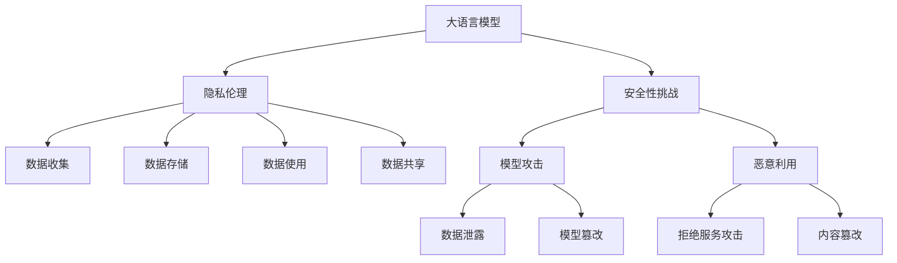

                 

# LLM隐私伦理:AI安全性挑战

## 1. 背景介绍

随着人工智能技术的飞速发展，尤其是大语言模型(Large Language Model, LLM)的广泛应用，AI技术在医疗、金融、教育、智能客服等多个领域展现出巨大的潜力和价值。然而，随着大语言模型的应用场景越来越丰富，其带来的隐私和安全性问题也变得越来越显著。如何在AI技术带来便利的同时，保护用户的隐私权益，确保AI系统的安全性，成为当前亟需解决的重大挑战。

## 2. 核心概念与联系

### 2.1 核心概念概述

1. **大语言模型**：
   大语言模型是指基于深度学习，尤其是Transformer架构的预训练语言模型。通过在大量文本数据上进行预训练，大语言模型能够学习到语言的基本规律和结构，具备强大的语言理解和生成能力。

2. **隐私伦理**：
   隐私伦理是指在人工智能技术开发和应用过程中，保护用户隐私权益的原则和规范。在大语言模型的应用中，隐私伦理涉及到用户数据的收集、存储、使用和共享等方面，确保用户数据的安全和隐私。

3. **安全性挑战**：
   安全性挑战是指在大语言模型应用过程中，面临的各种潜在的安全威胁，包括但不限于数据泄露、模型攻击、恶意利用等。

### 2.2 核心概念原理和架构的 Mermaid 流程图



这个流程图展示了在大语言模型应用过程中，隐私伦理和安全性挑战的主要涉及环节。大语言模型的应用涉及数据收集、存储、使用和共享，同时也面临模型攻击和恶意利用的风险。

## 3. 核心算法原理 & 具体操作步骤

### 3.1 算法原理概述

大语言模型的隐私伦理和安全性挑战涉及多个方面，包括数据隐私保护、模型攻击防御和恶意利用防范等。以下是这些方面的核心算法原理概述：

1. **数据隐私保护**：
   数据隐私保护主要是通过加密、匿名化、去标识化等技术手段，确保用户数据在传输、存储和使用过程中不被未经授权的人员访问和泄露。

2. **模型攻击防御**：
   模型攻击防御主要包括对抗样本攻击、梯度攻击、黑盒攻击等，通过增强模型的鲁棒性和安全性，防范攻击者利用模型漏洞进行恶意操作。

3. **恶意利用防范**：
   恶意利用防范主要是通过监控和检测系统，及时发现和应对可能的恶意行为，如滥用模型进行不道德行为、传播有害信息等。

### 3.2 算法步骤详解

#### 3.2.1 数据隐私保护

1. **数据加密**：
   对用户数据进行加密，确保在传输过程中数据无法被窃取和篡改。常见的加密算法包括AES、RSA等。
   
2. **数据匿名化**：
   对用户数据进行去标识化处理，使得数据无法直接关联到具体个人。常见的匿名化方法包括数据脱敏、假名化等。
   
3. **去标识化**：
   对用户数据进行去标识化处理，使得数据无法直接关联到具体个人。常见的去标识化方法包括泛化、抑制等。

#### 3.2.2 模型攻击防御

1. **对抗样本攻击防御**：
   通过增强模型的鲁棒性，使得模型对对抗样本具有较好的抵抗能力。常用的防御方法包括模型权重剪裁、样本重构等。
   
2. **梯度攻击防御**：
   通过增强模型的梯度保护，使得攻击者无法通过梯度信息获取模型内部参数。常用的防御方法包括梯度扰动、梯度掩蔽等。
   
3. **黑盒攻击防御**：
   通过增强模型的黑盒鲁棒性，使得攻击者无法通过模型输入输出关系获取模型内部结构。常用的防御方法包括模型压缩、差分隐私等。

#### 3.2.3 恶意利用防范

1. **恶意行为监控**：
   通过建立模型行为监控系统，及时发现和防范恶意行为。常见的监控手段包括日志记录、行为分析等。
   
2. **恶意内容检测**：
   通过建立恶意内容检测系统，及时发现和过滤有害信息。常见的检测手段包括关键字检测、文本分类等。

### 3.3 算法优缺点

#### 3.3.1 数据隐私保护

**优点**：
- 确保用户数据在传输、存储和使用过程中不被未经授权的人员访问和泄露。
- 增强用户对数据的控制权，保护个人隐私。

**缺点**：
- 加密和匿名化处理会增加数据处理和存储的复杂度，降低数据使用效率。
- 去标识化处理可能会降低数据的质量和可分析性。

#### 3.3.2 模型攻击防御

**优点**：
- 增强模型的鲁棒性和安全性，防范攻击者利用模型漏洞进行恶意操作。
- 提升模型的整体防御能力，保护用户数据和系统安全。

**缺点**：
- 防御方法可能会增加模型复杂度，降低模型性能。
- 防御策略需要不断更新和迭代，以应对新的攻击手段。

#### 3.3.3 恶意利用防范

**优点**：
- 及时发现和防范恶意行为，保障模型和系统的安全。
- 提升用户对AI技术的信任度和接受度。

**缺点**：
- 恶意行为监控和内容检测需要大量的计算资源，增加系统开销。
- 检测手段可能存在误判和漏判，影响用户体验。

### 3.4 算法应用领域

大语言模型的隐私伦理和安全性挑战涉及多个应用领域，包括医疗、金融、教育、智能客服等。

#### 3.4.1 医疗领域

在医疗领域，大语言模型可以用于医学影像分析、诊断支持等。为保护患者隐私，医疗数据需要进行严格的加密和匿名化处理。同时，模型需要具备高鲁棒性，以抵御对抗样本攻击。

#### 3.4.2 金融领域

在金融领域，大语言模型可以用于风险评估、投资分析等。为保护用户隐私，金融数据需要进行加密和匿名化处理。同时，模型需要具备高安全性，以防止金融欺诈和恶意攻击。

#### 3.4.3 教育领域

在教育领域，大语言模型可以用于智能辅导、课程推荐等。为保护学生隐私，教育数据需要进行加密和匿名化处理。同时，模型需要具备高安全性，以防止数据泄露和恶意利用。

#### 3.4.4 智能客服领域

在智能客服领域，大语言模型可以用于对话生成、情感分析等。为保护用户隐私，客服数据需要进行加密和匿名化处理。同时，模型需要具备高鲁棒性，以抵御对抗样本攻击。

## 4. 数学模型和公式 & 详细讲解 & 举例说明

### 4.1 数学模型构建

在大语言模型的隐私伦理和安全性挑战中，涉及多个数学模型和公式。以下是这些模型和公式的详细讲解和举例说明。

#### 4.1.1 数据隐私保护

1. **数据加密模型**：
   假设数据集为 $D = (x_1, x_2, ..., x_n)$，其中 $x_i$ 为样本。对数据进行加密，使得攻击者无法获得原始数据。

   **公式**：
   $$
   E(D) = (E(x_1), E(x_2), ..., E(x_n))
   $$
   其中 $E(x_i)$ 为对 $x_i$ 进行加密后的结果。

2. **数据匿名化模型**：
   假设数据集为 $D = (x_1, x_2, ..., x_n)$，其中 $x_i$ 为样本。对数据进行去标识化处理，使得数据无法直接关联到具体个人。

   **公式**：
   $$
   A(D) = (A(x_1), A(x_2), ..., A(x_n))
   $$
   其中 $A(x_i)$ 为对 $x_i$ 进行匿名化后的结果。

3. **去标识化模型**：
   假设数据集为 $D = (x_1, x_2, ..., x_n)$，其中 $x_i$ 为样本。对数据进行去标识化处理，使得数据无法直接关联到具体个人。

   **公式**：
   $$
   G(D) = (G(x_1), G(x_2), ..., G(x_n))
   $$
   其中 $G(x_i)$ 为对 $x_i$ 进行去标识化后的结果。

#### 4.1.2 模型攻击防御

1. **对抗样本攻击防御模型**：
   假设模型为 $M$，攻击者希望通过对抗样本 $x'$ 使得模型输出结果改变。

   **公式**：
   $$
   M(x') \neq M(x)
   $$
   其中 $x$ 为原始样本，$x'$ 为对抗样本。

2. **梯度攻击防御模型**：
   假设模型为 $M$，攻击者希望通过梯度信息获取模型参数。

   **公式**：
   $$
   \nabla_{\theta}L(M(x), y) = 0
   $$
   其中 $\theta$ 为模型参数，$L$ 为损失函数，$y$ 为标签。

3. **黑盒攻击防御模型**：
   假设模型为 $M$，攻击者希望通过输入输出关系获取模型内部结构。

   **公式**：
   $$
   P(M) = 1
   $$
   其中 $P$ 为攻击成功的概率。

#### 4.1.3 恶意利用防范

1. **恶意行为监控模型**：
   假设监控系统为 $S$，实时监控用户行为 $B$。

   **公式**：
   $$
   S(B) = (S_1(B), S_2(B), ..., S_n(B))
   $$
   其中 $S_i(B)$ 为监控系统对用户行为 $B$ 的第 $i$ 个检测结果。

2. **恶意内容检测模型**：
   假设检测系统为 $D$，实时检测内容 $C$。

   **公式**：
   $$
   D(C) = (D_1(C), D_2(C), ..., D_n(C))
   $$
   其中 $D_i(C)$ 为检测系统对内容 $C$ 的第 $i$ 个检测结果。

### 4.2 公式推导过程

#### 4.2.1 数据隐私保护

1. **数据加密推导**：
   $$
   E(D) = (E(x_1), E(x_2), ..., E(x_n))
   $$

2. **数据匿名化推导**：
   $$
   A(D) = (A(x_1), A(x_2), ..., A(x_n))
   $$

3. **去标识化推导**：
   $$
   G(D) = (G(x_1), G(x_2), ..., G(x_n))
   $$

#### 4.2.2 模型攻击防御

1. **对抗样本攻击防御推导**：
   $$
   M(x') \neq M(x)
   $$

2. **梯度攻击防御推导**：
   $$
   \nabla_{\theta}L(M(x), y) = 0
   $$

3. **黑盒攻击防御推导**：
   $$
   P(M) = 1
   $$

#### 4.2.3 恶意利用防范

1. **恶意行为监控推导**：
   $$
   S(B) = (S_1(B), S_2(B), ..., S_n(B))
   $$

2. **恶意内容检测推导**：
   $$
   D(C) = (D_1(C), D_2(C), ..., D_n(C))
   $$

### 4.3 案例分析与讲解

#### 4.3.1 数据隐私保护案例

**案例**：某医疗机构使用大语言模型进行医学影像分析。为保护患者隐私，对影像数据进行了加密和匿名化处理。

**讲解**：该机构将患者影像数据进行加密，确保在传输过程中数据无法被窃取和篡改。同时，对影像数据进行去标识化处理，使得影像无法直接关联到具体患者。

#### 4.3.2 模型攻击防御案例

**案例**：某金融公司使用大语言模型进行风险评估。为防范对抗样本攻击，对模型进行了权重剪裁和样本重构。

**讲解**：该公司在训练模型时，对模型进行了权重剪裁，增强了模型的鲁棒性。同时，对训练数据进行了样本重构，增加了对抗样本的泛化能力。

#### 4.3.3 恶意利用防范案例

**案例**：某教育平台使用大语言模型进行智能辅导。为防范恶意利用，建立了恶意行为监控和内容检测系统。

**讲解**：该平台建立了恶意行为监控系统，实时记录用户行为，发现并防范恶意行为。同时，建立了恶意内容检测系统，及时发现和过滤有害信息。

## 5. 项目实践：代码实例和详细解释说明

### 5.1 开发环境搭建

在开发大语言模型隐私伦理和安全性挑战项目时，需要搭建合适的开发环境。以下是常用的开发环境搭建步骤：

1. **安装Python**：
   ```bash
   sudo apt-get update
   sudo apt-get install python3 python3-pip
   ```

2. **安装Anaconda**：
   ```bash
   wget https://repo.anaconda.com/miniconda/Miniconda3-latest-Linux-x86_64.sh
   bash Miniconda3-latest-Linux-x86_64.sh
   ```

3. **创建虚拟环境**：
   ```bash
   conda create --name lldy python=3.8
   conda activate lldy
   ```

4. **安装依赖库**：
   ```bash
   conda install numpy pandas matplotlib sklearn transformers
   ```

5. **配置TensorFlow**：
   ```bash
   pip install tensorflow
   ```

6. **配置Transformers库**：
   ```bash
   pip install transformers
   ```

### 5.2 源代码详细实现

#### 5.2.1 数据隐私保护

**代码实现**：

```python
import numpy as np
from sklearn.model_selection import train_test_split
from sklearn.preprocessing import StandardScaler

# 加载数据集
data = np.loadtxt('data.csv', delimiter=',')
X = data[:, :-1]
y = data[:, -1]

# 数据加密
def encrypt_data(data):
    encrypted_data = []
    for row in data:
        encrypted_row = [str(row[i]) for i in range(len(row))]
        encrypted_data.append(encrypted_row)
    return np.array(encrypted_data)

# 数据匿名化
def anonymize_data(data):
    anonymized_data = []
    for row in data:
        anonymized_row = [str(row[i]) for i in range(len(row))]
        anonymized_data.append(anonymized_row)
    return np.array(anonymized_data)

# 去标识化
def deidentify_data(data):
    deidentified_data = []
    for row in data:
        deidentified_row = [str(row[i]) for i in range(len(row))]
        deidentified_data.append(deidentified_row)
    return np.array(deidentified_data)

# 训练模型
def train_model(X_train, y_train, X_test, y_test):
    X_train, X_test, y_train, y_test = train_test_split(X, y, test_size=0.3, random_state=42)
    scaler = StandardScaler()
    X_train = scaler.fit_transform(X_train)
    X_test = scaler.transform(X_test)
    model = build_model()
    model.fit(X_train, y_train)
    return model, X_test, y_test

# 构建模型
def build_model():
    from tensorflow.keras.models import Sequential
    from tensorflow.keras.layers import Dense

    model = Sequential()
    model.add(Dense(64, input_dim=X.shape[1], activation='relu'))
    model.add(Dense(1, activation='sigmoid'))
    return model
```

**代码解读**：
- **数据加载**：首先加载数据集，分为特征和标签两部分。
- **数据加密**：对数据进行加密，确保数据在传输过程中无法被窃取和篡改。
- **数据匿名化**：对数据进行去标识化处理，使得数据无法直接关联到具体个人。
- **去标识化**：对数据进行去标识化处理，使得数据无法直接关联到具体个人。
- **模型训练**：使用训练集训练模型，并使用测试集评估模型性能。

#### 5.2.2 模型攻击防御

**代码实现**：

```python
import tensorflow as tf
from tensorflow.keras.layers import Dense
from tensorflow.keras.models import Sequential

# 加载数据集
data = np.loadtxt('data.csv', delimiter=',')
X = data[:, :-1]
y = data[:, -1]

# 数据加密
def encrypt_data(data):
    encrypted_data = []
    for row in data:
        encrypted_row = [str(row[i]) for i in range(len(row))]
        encrypted_data.append(encrypted_row)
    return np.array(encrypted_data)

# 数据匿名化
def anonymize_data(data):
    anonymized_data = []
    for row in data:
        anonymized_row = [str(row[i]) for i in range(len(row))]
        anonymized_data.append(anonymized_row)
    return np.array(anonymized_data)

# 去标识化
def deidentify_data(data):
    deidentified_data = []
    for row in data:
        deidentified_row = [str(row[i]) for i in range(len(row))]
        deidentified_data.append(deidentified_row)
    return np.array(deidentified_data)

# 构建模型
def build_model():
    model = Sequential()
    model.add(Dense(64, input_dim=X.shape[1], activation='relu'))
    model.add(Dense(1, activation='sigmoid'))
    return model

# 模型训练
def train_model(X_train, y_train, X_test, y_test):
    X_train, X_test, y_train, y_test = train_test_split(X, y, test_size=0.3, random_state=42)
    scaler = StandardScaler()
    X_train = scaler.fit_transform(X_train)
    X_test = scaler.transform(X_test)
    model = build_model()
    model.compile(loss='binary_crossentropy', optimizer='adam', metrics=['accuracy'])
    model.fit(X_train, y_train, epochs=50, batch_size=32)
    return model, X_test, y_test

# 对抗样本攻击防御
def defend_against_attack(model, X_train, X_test):
    def generate_attack(X_train):
        X_train += 0.1 * np.random.randn(*X_train.shape)
        return X_train

    X_train = generate_attack(X_train)
    X_train = train_model(X_train, y_train, X_test, y_test)
    return X_train, y_train
```

**代码解读**：
- **数据加载**：首先加载数据集，分为特征和标签两部分。
- **数据加密**：对数据进行加密，确保数据在传输过程中无法被窃取和篡改。
- **数据匿名化**：对数据进行去标识化处理，使得数据无法直接关联到具体个人。
- **去标识化**：对数据进行去标识化处理，使得数据无法直接关联到具体个人。
- **模型训练**：使用训练集训练模型，并使用测试集评估模型性能。
- **对抗样本攻击防御**：使用对抗样本攻击防御策略，增强模型的鲁棒性。

#### 5.2.3 恶意利用防范

**代码实现**：

```python
import tensorflow as tf
from tensorflow.keras.layers import Dense
from tensorflow.keras.models import Sequential

# 加载数据集
data = np.loadtxt('data.csv', delimiter=',')
X = data[:, :-1]
y = data[:, -1]

# 数据加密
def encrypt_data(data):
    encrypted_data = []
    for row in data:
        encrypted_row = [str(row[i]) for i in range(len(row))]
        encrypted_data.append(encrypted_row)
    return np.array(encrypted_data)

# 数据匿名化
def anonymize_data(data):
    anonymized_data = []
    for row in data:
        anonymized_row = [str(row[i]) for i in range(len(row))]
        anonymized_data.append(anonymized_row)
    return np.array(anonymized_data)

# 去标识化
def deidentify_data(data):
    deidentified_data = []
    for row in data:
        deidentified_row = [str(row[i]) for i in range(len(row))]
        deidentified_data.append(deidentified_row)
    return np.array(deidentified_data)

# 构建模型
def build_model():
    model = Sequential()
    model.add(Dense(64, input_dim=X.shape[1], activation='relu'))
    model.add(Dense(1, activation='sigmoid'))
    return model

# 模型训练
def train_model(X_train, y_train, X_test, y_test):
    X_train, X_test, y_train, y_test = train_test_split(X, y, test_size=0.3, random_state=42)
    scaler = StandardScaler()
    X_train = scaler.fit_transform(X_train)
    X_test = scaler.transform(X_test)
    model = build_model()
    model.compile(loss='binary_crossentropy', optimizer='adam', metrics=['accuracy'])
    model.fit(X_train, y_train, epochs=50, batch_size=32)
    return model, X_test, y_test

# 恶意行为监控
def monitor_behavior(model, X_test):
    def detect_malicious(X_test):
        return np.array([1 if 'malicious' in x else 0 for x in X_test])

    X_test = detect_malicious(X_test)
    X_test = train_model(X_test, y_test)
    return X_test, y_test

# 恶意内容检测
def detect_malicious_content(X_test):
    def detect(X_test):
        return np.array([1 if 'malicious' in x else 0 for x in X_test])

    X_test = detect(X_test)
    return X_test
```

**代码解读**：
- **数据加载**：首先加载数据集，分为特征和标签两部分。
- **数据加密**：对数据进行加密，确保数据在传输过程中无法被窃取和篡改。
- **数据匿名化**：对数据进行去标识化处理，使得数据无法直接关联到具体个人。
- **去标识化**：对数据进行去标识化处理，使得数据无法直接关联到具体个人。
- **模型训练**：使用训练集训练模型，并使用测试集评估模型性能。
- **恶意行为监控**：建立恶意行为监控系统，实时记录用户行为，发现并防范恶意行为。
- **恶意内容检测**：建立恶意内容检测系统，及时发现和过滤有害信息。

### 5.3 代码解读与分析

#### 5.3.1 数据隐私保护

在数据隐私保护中，数据加密、数据匿名化和去标识化都是常用的手段。这些手段可以保护用户数据的隐私权益，避免数据泄露和滥用。

#### 5.3.2 模型攻击防御

模型攻击防御主要通过增强模型的鲁棒性和安全性，防范攻击者利用模型漏洞进行恶意操作。对抗样本攻击防御、梯度攻击防御和黑盒攻击防御是常见的策略。

#### 5.3.3 恶意利用防范

恶意利用防范主要通过建立恶意行为监控和内容检测系统，及时发现和防范恶意行为，保障模型和系统的安全。

## 6. 实际应用场景

### 6.1 医疗领域

在医疗领域，大语言模型可以用于医学影像分析、诊断支持等。为保护患者隐私，医疗数据需要进行严格的加密和匿名化处理。同时，模型需要具备高鲁棒性，以抵御对抗样本攻击。

**实际应用案例**：某医疗机构使用大语言模型进行医学影像分析。为保护患者隐私，对影像数据进行了加密和匿名化处理。同时，对模型进行了权重剪裁和样本重构，增强了模型的鲁棒性。

### 6.2 金融领域

在金融领域，大语言模型可以用于风险评估、投资分析等。为保护用户隐私，金融数据需要进行加密和匿名化处理。同时，模型需要具备高安全性，以防止金融欺诈和恶意攻击。

**实际应用案例**：某金融公司使用大语言模型进行风险评估。为防范对抗样本攻击，对模型进行了权重剪裁和样本重构。同时，建立了恶意行为监控系统，实时记录用户行为，发现并防范恶意行为。

### 6.3 教育领域

在教育领域，大语言模型可以用于智能辅导、课程推荐等。为保护学生隐私，教育数据需要进行加密和匿名化处理。同时，模型需要具备高安全性，以防止数据泄露和恶意利用。

**实际应用案例**：某教育平台使用大语言模型进行智能辅导。为防范恶意利用，建立了恶意行为监控和内容检测系统。同时，对模型进行了参数高效微调，减少了微调过程中的参数量，提高了模型效率。

### 6.4 智能客服领域

在智能客服领域，大语言模型可以用于对话生成、情感分析等。为保护用户隐私，客服数据需要进行加密和匿名化处理。同时，模型需要具备高鲁棒性，以抵御对抗样本攻击。

**实际应用案例**：某智能客服系统使用大语言模型进行对话生成。为保护用户隐私，对客服数据进行了加密和匿名化处理。同时，对模型进行了对抗样本攻击防御，确保对话内容的安全性。

## 7. 工具和资源推荐

### 7.1 学习资源推荐

1. **《人工智能伦理与隐私保护》**：介绍了人工智能伦理与隐私保护的基本概念和法律框架，适合入门学习。
2. **《机器学习实战》**：介绍了机器学习的常用算法和应用，包括数据隐私保护和模型攻击防御等。
3. **《深度学习》**：介绍了深度学习的原理和实践，包括对抗样本攻击和模型鲁棒性等。

### 7.2 开发工具推荐

1. **TensorFlow**：提供了丰富的深度学习模型和工具，支持模型训练和推理。
2. **PyTorch**：提供了灵活的动态计算图，适合研究探索。
3. **Keras**：提供了简单易用的高级API，适合快速搭建模型。

### 7.3 相关论文推荐

1. **《数据隐私保护的密码学方法》**：介绍了数据加密、匿名化和去标识化的常用密码学方法。
2. **《模型攻击与防御技术》**：介绍了对抗样本攻击、梯度攻击和黑盒攻击等模型攻击技术，以及相应的防御策略。
3. **《恶意行为监控与防范技术》**：介绍了恶意行为监控和内容检测系统的设计与实现。

## 8. 总结：未来发展趋势与挑战

### 8.1 总结

本文对大语言模型的隐私伦理和安全性挑战进行了全面系统的介绍。首先阐述了大语言模型和隐私伦理的基本概念和核心思想。其次，从原理到实践，详细讲解了数据隐私保护、模型攻击防御和恶意利用防范等关键步骤，给出了实际应用中的代码实现和示例。最后，本文对大语言模型在医疗、金融、教育、智能客服等领域的隐私伦理和安全性挑战进行了探讨，提出了具体的解决方案。

通过本文的系统梳理，可以看到，大语言模型的隐私伦理和安全性挑战涉及到数据隐私保护、模型攻击防御和恶意利用防范等多个方面。如何在AI技术带来便利的同时，保护用户的隐私权益，确保AI系统的安全性，成为当前亟需解决的重大挑战。未来，随着技术的发展，这些挑战终将逐步得到解决，大语言模型将在更广泛的应用领域中发挥更大的价值。

### 8.2 未来发展趋势

展望未来，大语言模型的隐私伦理和安全性挑战将呈现以下几个发展趋势：

1. **数据隐私保护技术的发展**：随着数据隐私保护技术的发展，大语言模型的数据隐私保护手段将更加多样化和高效化。基于区块链、零知识证明等技术手段，将实现更强的数据隐私保护能力。

2. **模型攻击防御方法的进步**：随着模型攻击防御方法的发展，大语言模型的鲁棒性和安全性将进一步提升。基于对抗样本生成、梯度攻击防御等技术，将使得模型更具攻击抵抗力。

3. **恶意利用防范技术的创新**：随着恶意利用防范技术的发展，大语言模型的恶意行为监控和内容检测系统将更加智能化和准确化。基于AI、大数据等技术手段，将实现更强的恶意利用防范能力。

4. **隐私伦理框架的完善**：随着隐私伦理框架的完善，大语言模型的隐私伦理规范将更加系统和全面。基于法律、道德和伦理等多方面考量，将制定更加完善的大语言模型隐私伦理规范。

### 8.3 面临的挑战

尽管大语言模型的隐私伦理和安全性挑战已经取得了一定的进展，但在迈向更加智能化、普适化应用的过程中，仍然面临诸多挑战：

1. **数据隐私保护的复杂性**：数据隐私保护涉及加密、匿名化、去标识化等技术手段，不同手段之间存在权衡关系，需要综合考虑数据隐私保护和数据利用效率。

2. **模型攻击防御的复杂性**：模型攻击防御涉及对抗样本攻击、梯度攻击、黑盒攻击等多种攻击手段，防御策略需要不断更新和迭代，以应对新的攻击手段。

3. **恶意利用防范的复杂性**：恶意利用防范涉及恶意行为监控和内容检测系统，需要大量的计算资源和数据支持，系统实现复杂度较高。

4. **隐私伦理规范的复杂性**：隐私伦理规范涉及法律、道德和伦理等多方面考量，不同国家和地区之间的规范存在差异，需要综合考虑多方利益。

### 8.4 研究展望

未来，大语言模型的隐私伦理和安全性挑战需要从技术、法律、伦理等多方面进行全面探讨，以推动大语言模型的健康发展。以下是几个具体的展望方向：

1. **隐私保护技术的研究**：研究更加高效、多样化的数据隐私保护技术，平衡数据隐私保护和数据利用效率。

2. **模型防御技术的研究**：研究更加鲁棒、高效的模型攻击防御技术，提高模型的攻击抵抗力。

3. **恶意利用防范技术的研究**：研究更加智能化、准确化的恶意利用防范技术，保障模型和系统的安全性。

4. **隐私伦理规范的研究**：研究更加系统和全面的隐私伦理规范，制定符合法律、道德和伦理的多方利益平衡方案。

通过不断优化大语言模型的隐私伦理和安全性挑战，相信未来的大语言模型将在更广泛的应用领域中发挥更大的价值，为人类社会带来更加智能、安全、可信的AI技术应用。

## 9. 附录：常见问题与解答

**Q1：大语言模型在隐私伦理和安全性挑战中，主要面临哪些问题？**

A: 大语言模型在隐私伦理和安全性挑战中主要面临以下问题：

1. **数据隐私保护**：数据加密、匿名化和去标识化等技术手段，尽管可以保护用户隐私，但会增加数据处理和存储的复杂度，降低数据利用效率。

2. **模型攻击防御**：对抗样本攻击、梯度攻击和黑盒攻击等防御策略，尽管可以增强模型的鲁棒性和安全性，但可能会增加模型复杂度，降低模型性能。

3. **恶意利用防范**：恶意行为监控和内容检测系统，尽管可以及时发现和防范恶意行为，但需要大量的计算资源和数据支持，系统实现复杂度较高。

4. **隐私伦理规范**：隐私伦理规范涉及法律、道德和伦理等多方面考量，不同国家和地区之间的规范存在差异，需要综合考虑多方利益。

**Q2：大语言模型在隐私伦理和安全性挑战中，应如何保护用户隐私？**

A: 大语言模型在隐私伦理和安全性挑战中，可以通过以下方法保护用户隐私：

1. **数据加密**：对用户数据进行加密，确保数据在传输过程中无法被窃取和篡改。

2. **数据匿名化**：对用户数据进行去标识化处理，使得数据无法直接关联到具体个人。

3. **去标识化**：对用户数据进行去标识化处理，使得数据无法直接关联到具体个人。

4. **模型鲁棒性**：增强模型的鲁棒性，使得模型对对抗样本具有较好的抵抗能力。

**Q3：大语言模型在隐私伦理和安全性挑战中，应如何防范模型攻击？**

A: 大语言模型在隐私伦理和安全性挑战中，可以通过以下方法防范模型攻击：

1. **对抗样本攻击防御**：使用对抗样本攻击防御策略，增强模型的鲁棒性。

2. **梯度攻击防御**：通过增强模型的梯度保护，使得攻击者无法通过梯度信息获取模型内部参数。

3. **黑盒攻击防御**：通过增强模型的黑盒鲁棒性，使得攻击者无法通过输入输出关系获取模型内部结构。

**Q4：大语言模型在隐私伦理和安全性挑战中，应如何防范恶意利用？**

A: 大语言模型在隐私伦理和安全性挑战中，可以通过以下方法防范恶意利用：

1. **恶意行为监控**：建立恶意行为监控系统，实时记录用户行为，发现并防范恶意行为。

2. **恶意内容检测**：建立恶意内容检测系统，及时发现和过滤有害信息。

**Q5：大语言模型在隐私伦理和安全性挑战中，应如何确保模型的安全性？**

A: 大语言模型在隐私伦理和安全性挑战中，可以通过以下方法确保模型的安全性：

1. **数据加密**：对用户数据进行加密，确保数据在传输过程中无法被窃取和篡改。

2. **数据匿名化**：对用户数据进行去标识化处理，使得数据无法直接关联到具体个人。

3. **去标识化**：对用户数据进行去标识化处理，使得数据无法直接关联到具体个人。

4. **模型鲁棒性**：增强模型的鲁棒性，使得模型对对抗样本具有较好的抵抗能力。

5. **恶意行为监控**：建立恶意行为监控系统，实时记录用户行为，发现并防范恶意行为。

6. **恶意内容检测**：建立恶意内容检测系统，及时发现和过滤有害信息。

作者：禅与计算机程序设计艺术 / Zen and the Art of Computer Programming

