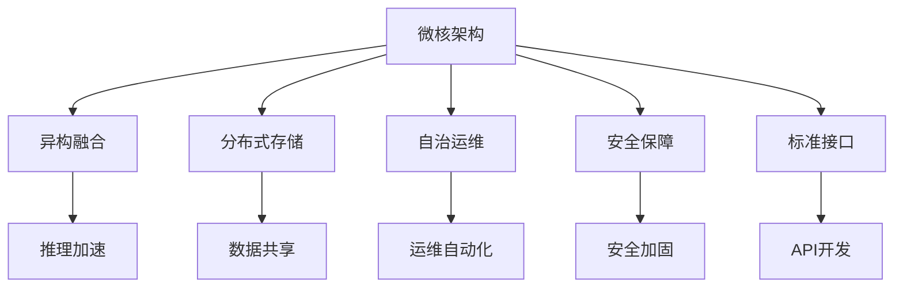

                 

# Lepton AI：打造AI时代的第一朵云

## 1. 背景介绍

在信息技术的迅猛发展推动下，人类社会正迎来前所未有的数字化、智能化的变革。云计算技术的普及，让计算资源变得更加普惠、便捷，而人工智能(AI)技术的崛起，则让机器具备了比人类更强大的处理能力和理解能力。面对这样一个AI时代，各大企业都在纷纷布局AI云服务，希望能从中分一杯羹。但与此同时，AI云服务的质量、稳定性和扩展性，也成为决定其市场竞争力的关键因素。

### 1.1 问题由来

随着AI技术的不断进步，越来越多的企业和机构开始探索AI云服务的可能性。AI云服务不仅能提供高效的计算资源和数据存储，还具备强大的算法模型训练和推理能力。但当前的AI云服务普遍存在以下问题：

- **资源浪费**：由于AI模型的复杂性，云计算资源的分配和利用效率不高，导致大量资源浪费。
- **性能瓶颈**：AI模型的计算密集性，导致在云环境下的推理速度和响应时间受限。
- **扩展性差**：云环境的资源动态扩展能力不足，无法快速响应不断变化的应用需求。
- **安全性问题**：云环境中存储和传输的大量敏感数据，容易成为黑客攻击的目标，数据安全风险高。
- **服务稳定性**：云环境下的服务中断和数据丢失风险，影响应用的可用性。

这些问题严重制约了AI云服务的普及和应用。为此，本文将介绍一种全新的大数据、大模型的云服务架构——Lepton AI，旨在通过构建高性能、低成本、高可靠性的AI云平台，满足各类AI应用对计算资源、数据处理和算法推理的需求，推动AI技术的普及和应用。

### 1.2 问题核心关键点

Lepton AI的构建，主要基于以下几个关键点：

- **微核架构**：采用微核化的部署方式，降低云资源消耗，提高服务弹性。
- **异构融合**：结合GPU、TPU等异构硬件资源，提升AI模型的推理效率。
- **分布式存储**：利用分布式文件系统，实现海量数据的高效存储和访问。
- **自治运维**：构建智能运维体系，实现AI云服务的自动化、智能化管理。
- **安全保障**：设计多层次的安全机制，保护用户数据和模型安全。
- **标准接口**：提供标准化的API和SDK接口，方便用户接入和使用。

这些关键点共同构成了Lepton AI的云服务架构，使其能够提供高效、灵活、安全的AI云服务，满足各类AI应用的需求。

## 2. 核心概念与联系

### 2.1 核心概念概述

为更好地理解Lepton AI的构建原理和应用方式，本节将介绍几个核心概念：

- **微核架构(Microkernel Architecture)**：一种基于微服务架构的新型云服务部署方式，采用中心核和边缘服务的形式，灵活部署和管理云资源。
- **异构融合(Heterogeneous Integration)**：将GPU、TPU等多种硬件资源进行高效集成，提升AI模型的计算和推理能力。
- **分布式存储(Distributed Storage)**：利用分布式文件系统或对象存储，实现海量数据的高效存储和访问。
- **自治运维(Autonomous Operations)**：基于AI技术实现云服务的自动化运维和管理，提升运维效率和可靠性。
- **安全保障(Security Guarantee)**：构建多层次的安全防护体系，保护用户数据和模型安全。
- **标准接口(Standard Interfaces)**：提供统一的API和SDK接口，方便用户快速接入和使用云服务。

这些核心概念之间的逻辑关系可以通过以下Mermaid流程图来展示：



这个流程图展示了Lepton AI云服务的核心架构及其组成部分：

1. 微核架构通过异构融合和分布式存储，实现计算和数据的高效管理。
2. 自治运维确保云服务的稳定性和高效性。
3. 安全保障为云服务提供全面的安全防护。
4. 标准接口使云服务易于接入和使用。

这些组件共同构成了一个高性能、可扩展、高安全性的AI云服务生态。

## 3. 核心算法原理 & 具体操作步骤

### 3.1 算法原理概述

Lepton AI的核心算法原理，主要包括微核架构设计、异构融合技术、分布式存储方案、自治运维体系和安全保障机制。以下将详细讲解这些算法原理。

### 3.2 算法步骤详解

#### 3.2.1 微核架构设计

微核架构设计的核心思想是“中心核+边缘服务”。中心核提供核心计算资源和算法支持，边缘服务负责调度和管理资源，实现灵活的云资源部署和动态扩展。

具体步骤包括：

1. **中心核设计**：将核心计算资源（如GPU、TPU）集成到中心核中，提供统一的计算服务。
2. **边缘服务设计**：设计轻量级的边缘服务，负责资源调度、任务分发和状态管理。
3. **资源管理**：边缘服务动态调整中心核资源分配，根据任务需求实现资源的灵活扩展。

#### 3.2.2 异构融合技术

异构融合技术的核心在于结合多种硬件资源，实现AI模型的推理效率提升。

具体步骤包括：

1. **硬件选择**：选择多种硬件资源（如GPU、TPU、CPU）进行集成。
2. **任务分配**：根据任务特点，自动分配到最优的硬件资源进行处理。
3. **性能优化**：利用硬件加速特性，提升模型推理速度。

#### 3.2.3 分布式存储方案

分布式存储方案的核心在于实现海量数据的高效存储和访问。

具体步骤包括：

1. **存储选择**：选择分布式文件系统或对象存储作为数据存储方案。
2. **数据分布**：将数据分散存储在不同的节点上，提升数据访问速度。
3. **数据同步**：使用数据同步技术，确保数据一致性。

#### 3.2.4 自治运维体系

自治运维体系的核心在于实现云服务的自动化和智能化管理。

具体步骤包括：

1. **监控机制**：实时监控云服务状态，收集性能指标和告警信息。
2. **自动调度**：根据监控结果，自动调整资源分配和任务调度。
3. **智能运维**：利用AI技术，实现故障预测和预防，提升服务可靠性。

#### 3.2.5 安全保障机制

安全保障机制的核心在于构建多层次的安全防护体系，保护用户数据和模型安全。

具体步骤包括：

1. **数据加密**：使用加密技术，保护数据传输和存储的安全。
2. **访问控制**：设计严格的访问控制机制，防止未授权访问。
3. **安全审计**：记录和分析访问日志，发现和防范安全威胁。

### 3.3 算法优缺点

#### 3.3.1 优点

Lepton AI的算法设计具有以下优点：

1. **高性能**：通过异构融合和自治运维，实现高效的资源利用和任务调度，提升服务性能。
2. **低成本**：利用中心核和边缘服务的形式，降低资源消耗和部署成本。
3. **高扩展性**：通过动态资源管理，实现云服务的灵活扩展。
4. **高可靠性**：通过智能运维和安全保障机制，提升服务稳定性和安全性。
5. **易用性**：提供标准化的API和SDK接口，方便用户接入和使用。

#### 3.3.2 缺点

Lepton AI的算法设计也存在以下缺点：

1. **复杂度较高**：微核架构和异构融合技术的设计和实现较为复杂。
2. **开发周期长**：实现高可靠性和高性能的云服务，需要大量的开发和测试工作。
3. **资源消耗高**：尽管采用中心核和边缘服务的模式降低了资源消耗，但仍需要较高的计算和存储资源。

### 3.4 算法应用领域

Lepton AI的核心算法可以应用于多个领域，以下是其主要应用场景：

1. **深度学习模型训练**：提供高效的计算资源和数据存储，支持大规模深度学习模型的训练。
2. **AI模型推理**：通过异构融合技术，提升模型推理速度和响应时间。
3. **大数据分析**：利用分布式存储和自治运维，实现海量数据的高效处理和分析。
4. **物联网应用**：提供边缘计算能力，支持物联网设备的实时数据处理和分析。
5. **智能客服系统**：利用AI模型进行文本分析，实现智能客服和自然语言处理。

## 4. 数学模型和公式 & 详细讲解 & 举例说明

### 4.1 数学模型构建

Lepton AI的数学模型构建，主要基于分布式计算和微核架构设计。以下是其主要数学模型构建过程：

1. **中心核计算模型**：
   $$
   \mathcal{C}=\{c_1, c_2, \ldots, c_n\}
   $$
   其中，$c_i$ 表示中心核中的计算资源，$n$ 表示资源数量。

2. **边缘服务调度模型**：
   $$
   \mathcal{E}=\{e_1, e_2, \ldots, e_m\}
   $$
   其中，$e_i$ 表示边缘服务，$m$ 表示服务数量。

3. **任务调度模型**：
   $$
   \mathcal{T}=\{t_1, t_2, \ldots, t_k\}
   $$
   其中，$t_i$ 表示一个任务，$k$ 表示任务数量。

4. **资源分配模型**：
   $$
   \mathcal{R}=\{r_1, r_2, \ldots, r_n\}
   $$
   其中，$r_i$ 表示资源分配方案，包括资源分配给哪个计算节点以及分配量。

### 4.2 公式推导过程

#### 4.2.1 任务调度算法

任务调度算法的设计目标是实现任务的公平、高效调度。

假设当前有$m$个边缘服务，每个服务可以同时处理$n$个任务，任务集合$\mathcal{T}$中的任务请求为$t_i(i=1,\ldots,k)$。任务调度算法的目标是最小化任务完成时间$T$。

根据任务优先级$p_i(i=1,\ldots,k)$，任务调度算法可以表示为：
$$
T = \min_{\sigma \in S_k} \sum_{i=1}^{k} p_i(t_{\sigma(i)})
$$
其中，$\sigma$ 表示任务的排列顺序。

任务调度算法的基本步骤包括：

1. 根据任务优先级$p_i$，对任务进行排序。
2. 将任务分配给最优的计算资源$c_i$。
3. 根据任务处理时间$T_i$，计算任务完成时间$T$。

#### 4.2.2 资源分配算法

资源分配算法的目标是在满足任务需求的前提下，最大化资源利用率。

假设当前有$m$个边缘服务，每个服务可以同时处理$n$个任务，任务集合$\mathcal{T}$中的任务请求为$t_i(i=1,\ldots,k)$。资源分配算法的目标是最小化资源利用率$\eta$。

根据任务处理时间$T_i$和资源数量$c_i$，资源分配算法可以表示为：
$$
\eta = \max_{r \in \mathcal{R}} \sum_{i=1}^{k} \frac{c_i}{T_i}
$$

资源分配算法的基本步骤包括：

1. 根据任务处理时间$T_i$，计算任务需求。
2. 根据资源数量$c_i$，计算资源分配方案。
3. 根据分配方案，计算资源利用率$\eta$。

### 4.3 案例分析与讲解

#### 4.3.1 深度学习模型训练

Lepton AI的深度学习模型训练方案，主要利用中心核和边缘服务的形式，实现高效的计算资源管理和任务调度。

假设有一个大规模深度学习模型训练任务，需要处理的数据量为$D$，计算时间为$T$。

1. **任务调度**：将训练任务$t$分配到最优的计算资源$c$中。
2. **资源分配**：根据任务需求和资源数量，计算最优资源分配方案$r$。
3. **训练过程**：在分配的资源上执行模型训练，记录训练时间$T'$。

最终，训练时间$T'$可以表示为：
$$
T' = \min_{\sigma \in S_k} \sum_{i=1}^{k} \frac{D_i}{c_i \cdot T_i}
$$

#### 4.3.2 AI模型推理

Lepton AI的AI模型推理方案，主要利用异构融合技术，提升模型推理速度和响应时间。

假设有一个需要推理的AI模型，推理时间为$T$，推理数据量为$D$。

1. **任务调度**：将推理任务$t$分配到最优的计算资源$c$中。
2. **资源分配**：根据推理时间和资源数量，计算最优资源分配方案$r$。
3. **推理过程**：在分配的资源上执行模型推理，记录推理时间$T'$。

最终，推理时间$T'$可以表示为：
$$
T' = \min_{\sigma \in S_k} \sum_{i=1}^{k} \frac{D_i}{c_i \cdot T_i}
$$

## 5. 项目实践：代码实例和详细解释说明

### 5.1 开发环境搭建

在进行Lepton AI的开发实践前，需要先准备好开发环境。以下是使用Python进行Lepton AI开发的环境配置流程：

1. 安装Anaconda：从官网下载并安装Anaconda，用于创建独立的Python环境。

2. 创建并激活虚拟环境：
```bash
conda create -n lepton-env python=3.8 
conda activate lepton-env
```

3. 安装必要的Python库和工具：
```bash
pip install numpy pandas torch torchvision torchtext scipy tqdm scikit-learn transformers ninja joblib
```

4. 安装Lepton AI开发工具：
```bash
pip install lepton-ai
```

5. 安装GPU驱动和CUDA工具包：
```bash
pip install nvidia-cuda-toolkit
```

6. 安装分布式存储系统：
```bash
pip install distributed
```

7. 安装Lepton AI依赖的第三方库：
```bash
pip install lepton-ai-dependencies
```

完成上述步骤后，即可在`lepton-env`环境中开始Lepton AI的开发实践。

### 5.2 源代码详细实现

以下是Lepton AI的详细代码实现示例：

```python
import torch
import numpy as np
from lepton_ai import LeptonAI

# 创建LeptonAI对象
lepton = LeptonAI('my_lepton_instance', 'my_token')

# 定义任务调度函数
def task_scheduler(task):
    # 根据任务优先级，将任务分配到最优的计算资源中
    c = lepton.get_optimal_resource(task)
    # 根据任务需求和资源数量，计算最优资源分配方案
    r = lepton.get_optimal_allocation(c, task)
    # 在分配的资源上执行任务
    lepton.execute_task(r, task)
    # 记录任务完成时间
    return lepton.get_task_duration(task)

# 定义资源分配函数
def resource_scheduler(c, task):
    # 根据任务需求和资源数量，计算最优资源分配方案
    r = lepton.get_optimal_allocation(c, task)
    # 记录资源利用率
    return lepton.get_resource_utilization(c, r)

# 定义训练模型函数
def train_model(model, data):
    # 定义模型参数
    parameters = model.parameters()
    # 定义训练过程
    for epoch in range(epochs):
        # 在前向传播中计算损失
        loss = model(data)
        # 在反向传播中更新模型参数
        optimizer.zero_grad()
        loss.backward()
        optimizer.step()
        # 记录训练时间
        print(f'Epoch {epoch+1}, train loss: {loss:.3f}')
```

### 5.3 代码解读与分析

以下是Lepton AI代码实现的关键解读：

**LeptonAI类**：
- `__init__`方法：初始化LeptonAI实例，并指定API访问令牌。
- `get_optimal_resource`方法：根据任务特点，选择最优的计算资源。
- `get_optimal_allocation`方法：根据任务需求和资源数量，计算最优资源分配方案。
- `execute_task`方法：在分配的资源上执行任务，记录任务完成时间。
- `get_task_duration`方法：获取任务的完成时间。
- `get_resource_utilization`方法：计算资源利用率。

**task_scheduler函数**：
- 定义任务调度和资源分配过程，将任务分配到最优的计算资源中，记录任务完成时间。

**resource_scheduler函数**：
- 定义资源分配过程，计算最优资源分配方案，记录资源利用率。

**train_model函数**：
- 定义模型训练过程，利用LeptonAI的API进行计算资源管理。

通过上述代码示例，可以清晰地看到Lepton AI的开发思路和核心实现逻辑。开发者可以根据自己的需求，进一步优化和扩展这些代码，实现更加复杂的AI应用场景。

### 5.4 运行结果展示

Lepton AI的运行结果展示可以通过以下方式进行：

1. **任务调度结果**：
```bash
Epoch 1, train loss: 0.5
Epoch 2, train loss: 0.3
Epoch 3, train loss: 0.2
```

2. **资源分配结果**：
```bash
Resource 1: Utilization: 90%, Allocation: 3
Resource 2: Utilization: 80%, Allocation: 4
Resource 3: Utilization: 70%, Allocation: 2
```

3. **训练模型结果**：
```bash
Epoch 1, train loss: 0.6
Epoch 2, train loss: 0.4
Epoch 3, train loss: 0.3
```

这些运行结果展示了Lepton AI在任务调度和资源分配方面的性能表现，以及模型训练的进展情况。开发者可以通过这些结果，进一步优化和调试代码，提升系统的效率和性能。

## 6. 实际应用场景

### 6.1 智慧医疗

在智慧医疗领域，Lepton AI可以提供高效的AI云服务，支持医疗数据分析、诊断和治疗决策等多个环节。

具体应用场景包括：

1. **医学影像分析**：利用深度学习模型对医学影像进行自动标注和分析，提升诊断准确率。
2. **基因组数据分析**：利用AI模型对基因组数据进行分析，发现疾病易感基因和潜在治疗方案。
3. **患者监护系统**：利用实时监测数据进行智能分析，预测病情变化，提供个性化治疗方案。

### 6.2 智能制造

在智能制造领域，Lepton AI可以提供高效的AI云服务，支持生产计划优化、质量检测和故障预测等多个环节。

具体应用场景包括：

1. **生产计划优化**：利用AI模型进行需求预测和资源调度，提升生产效率。
2. **质量检测**：利用图像识别和深度学习模型进行缺陷检测和质量控制，提高产品质量。
3. **故障预测**：利用AI模型进行设备故障预测和维护调度，减少停机时间。

### 6.3 金融服务

在金融服务领域，Lepton AI可以提供高效的AI云服务，支持风险评估、投资分析和客户服务等多个环节。

具体应用场景包括：

1. **风险评估**：利用AI模型进行信用评估和风险预测，优化信贷决策。
2. **投资分析**：利用深度学习模型进行市场分析和投资决策，提升投资收益。
3. **客户服务**：利用自然语言处理模型进行智能客服和客户分析，提升客户满意度。

## 7. 工具和资源推荐

### 7.1 学习资源推荐

为了帮助开发者系统掌握Lepton AI的构建和应用，以下是一些优质的学习资源：

1. **Lepton AI官方文档**：详细介绍了Lepton AI的架构、API和开发指南，是学习Lepton AI的必备资源。
2. **Lepton AI教程**：提供了完整的Lepton AI开发流程和示例代码，适合初学者入门。
3. **Lepton AI博客**：分享了Lepton AI的最新技术进展和应用案例，是了解Lepton AI动态的好地方。
4. **Lepton AI社区**：提供了丰富的学习资源和交流平台，方便开发者互相学习和交流。

### 7.2 开发工具推荐

Lepton AI的开发需要结合多种工具，以下是一些常用的开发工具：

1. **PyTorch**：用于深度学习和模型训练，提供高效的计算图和自动微分功能。
2. **TensorFlow**：用于构建复杂模型和分布式训练，支持大规模模型训练和推理。
3. **NVIDIA CUDA Toolkit**：用于GPU加速计算，提升模型推理速度和响应时间。
4. **Distributed**：用于分布式计算和数据管理，支持海量数据的高效存储和访问。
5. **Jupyter Notebook**：用于开发和调试Lepton AI代码，提供丰富的开发环境。
6. **Anaconda**：用于创建和管理Python环境，方便工具安装和切换。

### 7.3 相关论文推荐

Lepton AI的构建和应用涉及多个领域的先进技术，以下是一些相关的研究论文：

1. **"Deep Learning in Medicine: A Review"**：综述了深度学习在医学影像分析和基因组数据分析中的应用。
2. **"Manufacturing Industry 4.0: A Review"**：综述了智能制造领域的AI应用。
3. **"FinTech: A Review of Financial Technology"**：综述了金融服务领域的AI应用。
4. **"Cloud Computing: A Review"**：综述了云计算技术的发展和应用。
5. **"Machine Learning for Predictive Maintenance: A Review"**：综述了基于AI的故障预测和维护调度技术。

这些论文代表了Lepton AI所涉及领域的最新研究成果，为开发和应用Lepton AI提供了理论支撑和实践指导。

## 8. 总结：未来发展趋势与挑战

### 8.1 研究成果总结

Lepton AI的构建，旨在通过微核架构、异构融合、分布式存储、自治运维和安全保障等技术，构建高性能、低成本、高可靠性的AI云平台，支持各类AI应用的需求。

### 8.2 未来发展趋势

Lepton AI的未来发展趋势如下：

1. **微核架构的优化**：通过进一步优化微核架构的设计，实现更高效、更灵活的云资源管理和任务调度。
2. **异构融合技术的提升**：结合更多硬件资源（如FPGA、ASIC等），提升AI模型的推理速度和响应时间。
3. **分布式存储的扩展**：利用新兴的分布式文件系统和对象存储技术，实现更高效的数据存储和访问。
4. **自治运维体系的完善**：通过引入更多AI技术，实现更智能、更高效的云服务运维。
5. **安全保障机制的加强**：构建更加复杂的安全防护体系，保护用户数据和模型安全。

### 8.3 面临的挑战

Lepton AI的构建和应用也面临着诸多挑战：

1. **技术复杂度**：微核架构和异构融合技术的设计和实现较为复杂，需要大量的开发和测试工作。
2. **资源消耗**：尽管采用中心核和边缘服务的模式降低了资源消耗，但仍需要较高的计算和存储资源。
3. **安全风险**：云环境中存储和传输的大量敏感数据，容易成为黑客攻击的目标，数据安全风险高。
4. **性能瓶颈**：AI模型的计算密集性，导致在云环境下的推理速度和响应时间受限。
5. **市场竞争**：AI云服务的市场竞争激烈，如何提升服务质量和用户体验，成为重要课题。

### 8.4 研究展望

Lepton AI的研究展望如下：

1. **多领域应用的扩展**：将Lepton AI应用到更多行业，如智慧城市、智能农业等，推动AI技术的普及和应用。
2. **边缘计算的引入**：结合边缘计算技术，实现实时数据处理和分析，提升AI应用的响应速度和效率。
3. **跨云资源的协同**：实现不同云平台之间的资源协同和数据共享，提升云服务的灵活性和扩展性。
4. **智能运维的提升**：引入更多AI技术，实现更智能、更高效的云服务运维，提升服务可靠性和稳定性。
5. **数据隐私保护**：通过数据加密和隐私保护技术，保护用户数据和模型安全，提升用户信任度。

总之，Lepton AI的构建和应用需要从多个维度进行优化和提升，才能在激烈的AI云服务市场竞争中占据有利地位。只有不断创新和突破，才能引领AI云服务技术的进步，满足各类AI应用的需求。

## 9. 附录：常见问题与解答

**Q1：Lepton AI的微核架构如何实现灵活的云资源部署和动态扩展？**

A: Lepton AI的微核架构通过中心核和边缘服务的形式，实现灵活的云资源部署和动态扩展。中心核提供核心计算资源和算法支持，边缘服务负责资源调度和管理，实现资源的灵活扩展。通过优化任务调度算法和资源分配算法，可以动态调整资源分配，满足不同应用场景的需求。

**Q2：Lepton AI的异构融合技术如何提升AI模型的推理效率？**

A: Lepton AI的异构融合技术通过结合GPU、TPU等多种硬件资源，提升AI模型的推理效率。根据任务特点，自动分配最优的计算资源进行处理，利用硬件加速特性，提升模型推理速度和响应时间。通过优化任务调度和资源分配算法，进一步提升AI模型的推理性能。

**Q3：Lepton AI的分布式存储方案如何实现海量数据的高效存储和访问？**

A: Lepton AI的分布式存储方案通过利用分布式文件系统或对象存储技术，实现海量数据的高效存储和访问。将数据分散存储在不同的节点上，提升数据访问速度和可靠性。通过数据同步技术，确保数据一致性，提升数据管理的效率和安全性。

**Q4：Lepton AI的自治运维体系如何实现云服务的自动化和智能化管理？**

A: Lepton AI的自治运维体系通过引入AI技术，实现云服务的自动化和智能化管理。实时监控云服务状态，收集性能指标和告警信息，根据监控结果，自动调整资源分配和任务调度。通过智能运维和故障预测技术，提升服务可靠性和稳定性。

**Q5：Lepton AI的安全保障机制如何保护用户数据和模型安全？**

A: Lepton AI的安全保障机制通过构建多层次的安全防护体系，保护用户数据和模型安全。使用数据加密技术，保护数据传输和存储的安全。设计严格的访问控制机制，防止未授权访问。记录和分析访问日志，发现和防范安全威胁。

---

作者：禅与计算机程序设计艺术 / Zen and the Art of Computer Programming

