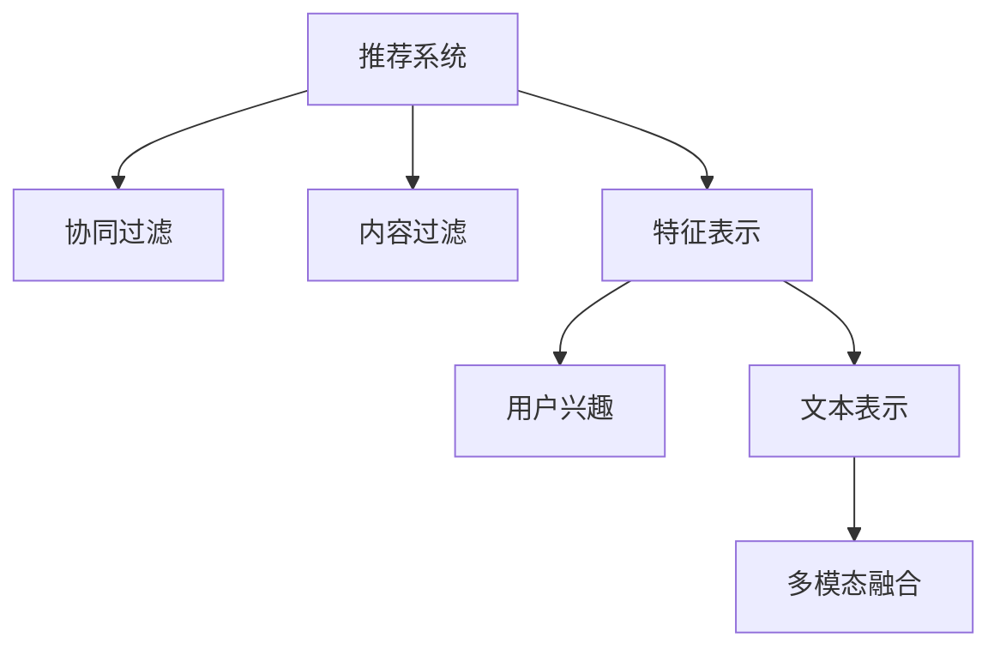

                 

# NLP技术进步：大模型在推荐系统的应用

> 关键词：大模型,推荐系统,自然语言处理(NLP),深度学习,协同过滤,内容过滤,特征表示,用户兴趣,文本表示,多模态融合

## 1. 背景介绍

推荐系统在电商、媒体、社交等互联网应用中无处不在，通过挖掘用户行为和物品特征，为用户推荐感兴趣的物品，提升用户体验和业务收入。传统推荐系统基于用户行为数据，通过协同过滤、内容过滤等方法，构建用户-物品交互矩阵，进行相似度计算，推荐相关物品。但随着数据量和用户行为多样性的增加，推荐精度和个性化需求不断提升，传统推荐系统面临诸多挑战：

1. **数据稀疏性**：新物品和老物品的交互矩阵非常稀疏，难以全面反映用户兴趣。
2. **冷启动问题**：新用户和新物品缺乏历史交互数据，难以进行推荐。
3. **长尾问题**：大量长尾物品在传统推荐系统中难以被有效识别和推荐。
4. **特征维度高**：用户行为和物品特征的高维稀疏数据，对推荐算法提出了较高要求。
5. **动态变化**：用户兴趣和物品特征会随时间动态变化，推荐模型需要持续更新以应对变化。

近年来，基于深度学习的大模型推荐技术逐渐崭露头角，利用预训练语言模型获取丰富的语义表示，通过微调适配特定推荐任务，显著提升了推荐系统的精度和个性化。本文将从核心概念、算法原理、代码实践等方面，全面探讨大模型在推荐系统中的应用。

## 2. 核心概念与联系

### 2.1 核心概念概述

为更好地理解大模型在推荐系统中的应用，本节将介绍几个密切相关的核心概念：

- 推荐系统(Recommendation System)：通过分析用户行为数据，预测用户对物品的兴趣，为用户推荐相关物品的智能系统。
- 大模型(Large Model)：以深度学习模型为代表，具有亿量级参数的大规模预训练模型。通过在海量无标签文本数据上进行预训练，学习到丰富的语义表示，具备强大的语言理解和生成能力。
- 协同过滤(Collaborative Filtering)：基于用户-物品交互矩阵，通过计算用户和物品的相似度，进行推荐。
- 内容过滤(Content-Based Filtering)：通过物品的特征向量，预测用户对物品的兴趣，进行推荐。
- 特征表示(Feature Representation)：将用户行为和物品特征转换为向量表示，用于模型计算。
- 用户兴趣(User Interest)：用户对不同物品的偏好程度，是推荐系统的关键输入。
- 文本表示(Text Representation)：将文本数据转换为向量表示，用于自然语言处理任务。
- 多模态融合(Multi-modal Fusion)：将多种数据源融合到推荐模型中，提升推荐精度和泛化能力。

这些核心概念之间的逻辑关系可以通过以下Mermaid流程图来展示：



这个流程图展示了大模型推荐系统的主要组成部分及其之间的关系：

1. 推荐系统通过协同过滤和内容过滤方法，挖掘用户兴趣。
2. 特征表示将用户行为和物品特征转换为向量表示。
3. 文本表示将用户行为文本化，获取语义信息。
4. 多模态融合将多种数据源融合到推荐模型中。
5. 大模型用于构建文本表示和特征表示，提升推荐精度。

这些核心概念共同构成了大模型在推荐系统中的应用框架，使得大模型能够更好地理解和表达用户与物品之间的关系，从而提升推荐系统的性能和效果。

## 3. 核心算法原理 & 具体操作步骤
### 3.1 算法原理概述

大模型在推荐系统中的应用，本质上是利用预训练语言模型的语义表示能力，对用户行为数据和物品特征进行理解和转换，从而提升推荐精度和个性化。其核心思想是：将预训练语言模型作为特征提取器，通过微调适配特定推荐任务，学习到用户-物品之间的关联关系。

形式化地，假设预训练语言模型为 $M_{\theta}$，其中 $\theta$ 为预训练得到的模型参数。给定推荐系统 $S$ 的训练集 $D=\{(x_i,y_i)\}_{i=1}^N$，其中 $x_i$ 为用户行为数据，$y_i$ 为用户对物品的评分。微调的目标是找到新的模型参数 $\hat{\theta}$，使得：

$$
\hat{\theta}=\mathop{\arg\min}_{\theta} \mathcal{L}(M_{\theta},D)
$$

其中 $\mathcal{L}$ 为推荐系统的损失函数，用于衡量模型预测评分与真实评分之间的差异。常见的损失函数包括均方误差损失、交叉熵损失等。

通过梯度下降等优化算法，微调过程不断更新模型参数 $\theta$，最小化损失函数 $\mathcal{L}$，使得模型预测评分逼近真实评分。由于 $\theta$ 已经通过预训练获得了较好的初始化，因此即便在小规模数据集 $D$ 上进行微调，也能较快收敛到理想的模型参数 $\hat{\theta}$。

### 3.2 算法步骤详解

基于深度学习的大模型推荐系统，一般包括以下几个关键步骤：

**Step 1: 准备预训练模型和数据集**
- 选择合适的预训练语言模型 $M_{\theta}$ 作为初始化参数，如BERT、GPT等。
- 准备推荐系统的训练集 $D$，包含用户行为数据和物品评分。

**Step 2: 构建推荐模型**
- 根据推荐任务类型，设计合适的推荐模型结构，如双向LSTM、自编码器、注意力机制等。
- 在推荐模型中引入预训练语言模型作为特征提取器，提取用户行为和物品特征的向量表示。
- 设计合适的损失函数，用于衡量模型预测评分与真实评分之间的差异。

**Step 3: 设置微调超参数**
- 选择合适的优化算法及其参数，如Adam、SGD等，设置学习率、批大小、迭代轮数等。
- 设置正则化技术及强度，包括权重衰减、Dropout、Early Stopping等。
- 确定冻结预训练参数的策略，如仅微调顶层，或全部参数都参与微调。

**Step 4: 执行梯度训练**
- 将训练集数据分批次输入模型，前向传播计算损失函数。
- 反向传播计算参数梯度，根据设定的优化算法和学习率更新模型参数。
- 周期性在验证集上评估模型性能，根据性能指标决定是否触发 Early Stopping。
- 重复上述步骤直到满足预设的迭代轮数或 Early Stopping 条件。

**Step 5: 测试和部署**
- 在测试集上评估微调后模型的性能，对比微调前后的评分精度提升。
- 使用微调后的模型对新样本进行评分预测，集成到推荐系统中。
- 持续收集新的数据，定期重新微调模型，以适应数据分布的变化。

以上是基于深度学习的大模型推荐系统的基本流程。在实际应用中，还需要针对具体推荐任务的特点，对微调过程的各个环节进行优化设计，如改进推荐模型的损失函数，引入更多的正则化技术，搜索最优的超参数组合等，以进一步提升模型性能。

### 3.3 算法优缺点

大模型在推荐系统中的应用，具有以下优点：
1. 语义表示能力强：预训练语言模型能够捕捉到文本数据的深层次语义信息，提升推荐系统对用户兴趣的理解能力。
2. 特征提取效果好：大模型作为特征提取器，能够将高维稀疏的用户行为和物品特征转换为低维稠密的向量表示，简化推荐模型的输入。
3. 模型精度高：利用大模型的语义表示能力和特征提取能力，推荐系统能够更准确地预测用户对物品的评分。
4. 泛化能力强：大模型在大规模无标签文本数据上进行预训练，具备较强的泛化能力，能够应对新的数据和任务。

同时，该方法也存在一定的局限性：
1. 数据依赖性强：推荐系统的推荐效果很大程度上取决于训练数据的数量和质量，数据收集和标注成本较高。
2. 模型复杂度高：大模型推荐系统通常比传统推荐系统更复杂，训练和推理的计算资源消耗更大。
3. 模型理解能力有限：尽管大模型具有强大的语义表示能力，但推荐系统的理解能力仍然受到输入数据的影响，难以完全脱离用户行为数据进行推荐。
4. 应用场景局限性：大模型推荐系统更多应用于产品推荐、内容推荐等场景，对于复杂的社会交互和决策问题，其推荐效果有限。

尽管存在这些局限性，但就目前而言，基于大模型的推荐系统在推荐精度和个性化方面已经取得了显著进展，是推荐系统发展的重要方向之一。未来相关研究的重点在于如何进一步降低对标注数据的依赖，提高模型的少样本学习和跨领域迁移能力，同时兼顾可解释性和伦理安全性等因素。

### 3.4 算法应用领域

基于大模型的推荐系统，已经在电商、媒体、社交等多个领域得到广泛应用，具体包括：

1. **电商平台推荐**：利用大模型提取用户行为和商品特征的语义信息，通过微调适配推荐任务，提升商品推荐精度和个性化。
2. **内容推荐系统**：对文章、视频、音乐等文本内容进行特征提取，通过微调预测用户对内容的兴趣，提升内容推荐效果。
3. **个性化广告推荐**：提取用户行为和广告特征的语义信息，通过微调适配推荐任务，提升广告点击率和转化率。
4. **社交媒体推荐**：利用大模型提取用户兴趣和帖子特征，通过微调预测用户对帖子的兴趣，提升社交媒体内容推荐效果。
5. **新闻推荐系统**：通过微调大模型对新闻内容进行特征提取，预测用户对新闻的兴趣，提升新闻推荐效果。

除了上述这些经典应用外，大模型推荐系统还被创新性地应用于更多场景中，如视频推荐、音乐推荐、电商搜索等，为推荐系统带来了全新的突破。随着预训练语言模型的不断进步，大模型推荐系统的应用范围将进一步拓展，为互联网推荐业务带来革命性影响。

## 4. 数学模型和公式 & 详细讲解  
### 4.1 数学模型构建

本节将使用数学语言对基于深度学习的大模型推荐系统进行更加严格的刻画。

记预训练语言模型为 $M_{\theta}$，其中 $\theta$ 为预训练得到的模型参数。假设推荐系统的训练集为 $D=\{(x_i,y_i)\}_{i=1}^N, x_i \in \mathbb{R}^d, y_i \in \mathbb{R}$。

定义模型 $M_{\theta}$ 在输入 $x_i$ 上的输出为 $z_i=M_{\theta}(x_i) \in \mathbb{R}^d$，表示用户行为或物品特征的向量表示。

推荐系统的损失函数定义为均方误差损失：

$$
\mathcal{L}(\theta) = \frac{1}{N} \sum_{i=1}^N (y_i - f(z_i; \theta))^2
$$

其中 $f$ 为推荐模型的预测函数，$z_i$ 为模型输出，$\theta$ 为模型参数。通过梯度下降等优化算法，微调过程不断更新模型参数 $\theta$，最小化损失函数 $\mathcal{L}$，使得模型预测评分逼近真实评分。

### 4.2 公式推导过程

以下我们以双向LSTM推荐模型为例，推导推荐系统的均方误差损失函数及其梯度的计算公式。

假设推荐模型为双向LSTM模型，其中 $M_{\theta}$ 为预训练语言模型，$z_i$ 为模型输出。推荐模型的预测函数定义为：

$$
f(z_i; \theta) = \text{softmax}(W \cdot \tanh(U z_i + V \cdot y))
$$

其中 $W$ 和 $V$ 为推荐模型的参数，$y$ 为用户评分，$\text{softmax}$ 函数将输出映射到 $[0,1]$ 区间，表示模型对物品评分的预测概率。

将预测函数代入均方误差损失函数，得：

$$
\mathcal{L}(\theta) = \frac{1}{N} \sum_{i=1}^N (y_i - f(z_i; \theta))^2
$$

根据链式法则，损失函数对模型参数 $\theta$ 的梯度为：

$$
\frac{\partial \mathcal{L}(\theta)}{\partial \theta} = -\frac{2}{N} \sum_{i=1}^N (y_i - f(z_i; \theta)) \cdot f'(z_i; \theta) \cdot \frac{\partial z_i}{\partial \theta}
$$

其中 $f'(z_i; \theta)$ 为 $f(z_i; \theta)$ 对 $z_i$ 的梯度，可以通过反向传播算法高效计算。

在得到损失函数的梯度后，即可带入参数更新公式，完成模型的迭代优化。重复上述过程直至收敛，最终得到适配推荐任务的最优模型参数 $\theta^*$。

## 5. 项目实践：代码实例和详细解释说明
### 5.1 开发环境搭建

在进行推荐系统开发前，我们需要准备好开发环境。以下是使用Python进行TensorFlow开发的环境配置流程：

1. 安装Anaconda：从官网下载并安装Anaconda，用于创建独立的Python环境。

2. 创建并激活虚拟环境：
```bash
conda create -n tf-env python=3.8 
conda activate tf-env
```

3. 安装TensorFlow：根据CUDA版本，从官网获取对应的安装命令。例如：
```bash
pip install tensorflow==2.5
```

4. 安装TensorBoard：
```bash
pip install tensorboard
```

5. 安装各类工具包：
```bash
pip install numpy pandas scikit-learn matplotlib tqdm jupyter notebook ipython
```

完成上述步骤后，即可在`tf-env`环境中开始推荐系统开发。

### 5.2 源代码详细实现

下面我们以电商推荐系统为例，给出使用TensorFlow对预训练语言模型进行推荐系统微调的代码实现。

首先，定义推荐系统的数据处理函数：

```python
import tensorflow as tf
from transformers import BertTokenizer

class RecommendationDataset(tf.data.Dataset):
    def __init__(self, texts, ratings, tokenizer, max_len=128):
        self.texts = texts
        self.ratings = ratings
        self.tokenizer = tokenizer
        self.max_len = max_len
        
    def __len__(self):
        return len(self.texts)
    
    def __getitem__(self, item):
        text = self.texts[item]
        rating = self.ratings[item]
        
        encoding = self.tokenizer(text, return_tensors='tf', max_length=self.max_len, padding='max_length', truncation=True)
        input_ids = encoding['input_ids']
        attention_mask = encoding['attention_mask']
        
        # 对label进行编码
        encoded_rating = [rating]
        encoded_rating.extend([0.0] * (self.max_len - len(encoded_rating)))
        labels = tf.constant(encoded_rating, dtype=tf.float32)
        
        return {'input_ids': input_ids, 
                'attention_mask': attention_mask,
                'labels': labels}

# 初始化分词器和tokenizer
tokenizer = BertTokenizer.from_pretrained('bert-base-cased')

# 创建dataset
train_dataset = RecommendationDataset(train_texts, train_ratings, tokenizer)
dev_dataset = RecommendationDataset(dev_texts, dev_ratings, tokenizer)
test_dataset = RecommendationDataset(test_texts, test_ratings, tokenizer)
```

然后，定义模型和优化器：

```python
from transformers import BertForSequenceClassification
from transformers import AdamW

model = BertForSequenceClassification.from_pretrained('bert-base-cased', num_labels=1)

optimizer = AdamW(model.parameters(), lr=2e-5)
```

接着，定义训练和评估函数：

```python
import numpy as np
import tensorflow as tf

def train_epoch(model, dataset, batch_size, optimizer):
    dataloader = tf.data.Dataset.from_generator(lambda: tf.data.Dataset.from_tensor_slices(dataset), 
                                              output_signature=tf.TensorSpec(shape=(None, None), dtype=tf.int32))
    dataloader = dataloader.batch(batch_size)
    
    model.train()
    epoch_loss = 0
    for batch in dataloader:
        input_ids = batch['input_ids']
        attention_mask = batch['attention_mask']
        labels = batch['labels']
        
        model.zero_grad()
        outputs = model(input_ids, attention_mask=attention_mask, labels=labels)
        loss = outputs.loss
        epoch_loss += loss.numpy().item()
        loss.backward()
        optimizer.step()
        
    return epoch_loss / len(dataloader)

def evaluate(model, dataset, batch_size):
    dataloader = tf.data.Dataset.from_generator(lambda: tf.data.Dataset.from_tensor_slices(dataset), 
                                              output_signature=tf.TensorSpec(shape=(None, None), dtype=tf.int32))
    dataloader = dataloader.batch(batch_size)
    
    model.eval()
    preds, labels = [], []
    with tf.GradientTape() as tape:
        for batch in dataloader:
            input_ids = batch['input_ids']
            attention_mask = batch['attention_mask']
            batch_labels = batch['labels']
            outputs = model(input_ids, attention_mask=attention_mask, labels=batch_labels)
            batch_preds = outputs.logits.numpy()[:, 0]
            batch_labels = batch_labels.numpy()
            for pred, label in zip(batch_preds, batch_labels):
                preds.append(pred)
                labels.append(label)
                
    print(tf.keras.metrics.mean_absolute_error(labels, preds).numpy())
```

最后，启动训练流程并在测试集上评估：

```python
epochs = 5
batch_size = 16

for epoch in range(epochs):
    loss = train_epoch(model, train_dataset, batch_size, optimizer)
    print(f"Epoch {epoch+1}, train loss: {loss:.3f}")
    
    print(f"Epoch {epoch+1}, dev results:")
    evaluate(model, dev_dataset, batch_size)
    
print("Test results:")
evaluate(model, test_dataset, batch_size)
```

以上就是使用TensorFlow对预训练语言模型进行电商推荐系统微调的完整代码实现。可以看到，得益于TensorFlow和Transformers库的强大封装，我们可以用相对简洁的代码完成推荐系统的开发。

### 5.3 代码解读与分析

让我们再详细解读一下关键代码的实现细节：

**RecommendationDataset类**：
- `__init__`方法：初始化文本、评分、分词器等关键组件。
- `__len__`方法：返回数据集的样本数量。
- `__getitem__`方法：对单个样本进行处理，将文本输入编码为token ids，将评分编码为数字，并对其进行定长padding，最终返回模型所需的输入。

**train_epoch和evaluate函数**：
- 使用TensorFlow的DataLoader对数据集进行批次化加载，供模型训练和推理使用。
- 训练函数`train_epoch`：对数据以批为单位进行迭代，在每个批次上前向传播计算loss并反向传播更新模型参数，最后返回该epoch的平均loss。
- 评估函数`evaluate`：与训练类似，不同点在于不更新模型参数，并在每个batch结束后将预测和标签结果存储下来，最后使用tf.keras.metrics.mean_absolute_error对整个评估集的预测结果进行打印输出。

**训练流程**：
- 定义总的epoch数和batch size，开始循环迭代
- 每个epoch内，先在训练集上训练，输出平均loss
- 在验证集上评估，输出平均绝对误差
- 所有epoch结束后，在测试集上评估，给出最终测试结果

可以看到，TensorFlow配合Transformers库使得电商推荐系统的代码实现变得简洁高效。开发者可以将更多精力放在数据处理、模型改进等高层逻辑上，而不必过多关注底层的实现细节。

当然，工业级的系统实现还需考虑更多因素，如模型的保存和部署、超参数的自动搜索、更灵活的任务适配层等。但核心的微调范式基本与此类似。

## 6. 实际应用场景
### 6.1 电商推荐系统

基于预训练语言模型的电商推荐系统，可以有效解决推荐精度、个性化推荐和长尾推荐等问题，为电商平台的推荐业务带来革命性改变。

在技术实现上，可以收集用户浏览、点击、评论、购买等行为数据，提取和用户交互的物品标题、描述、标签等文本内容。将文本内容作为模型输入，用户的后续行为（如是否点击、购买等）作为监督信号，在此基础上微调预训练语言模型。微调后的模型能够从文本内容中准确把握用户的兴趣点。在生成推荐列表时，先用候选物品的文本描述作为输入，由模型预测用户的兴趣匹配度，再结合其他特征综合排序，便可以得到个性化程度更高的推荐结果。

### 6.2 内容推荐系统

内容推荐系统是对文本、图片、视频等媒体内容进行推荐的重要工具。通过微调大模型，可以对内容进行语义理解，提取关键特征，预测用户对内容的兴趣，提升内容推荐效果。

在实现上，可以定义内容推荐系统的任务为文本分类和情感分析。将内容标题、描述、标签等文本信息作为模型输入，将用户对内容的评分作为监督信号，通过微调预训练语言模型，学习到内容的语义表示。微调后的模型能够对内容进行分类和情感分析，预测用户对内容的兴趣，生成推荐列表。

### 6.3 个性化广告推荐

个性化广告推荐是对用户进行精准广告投放的关键技术。通过微调大模型，可以更好地理解用户兴趣，提高广告点击率和转化率。

在实现上，可以收集用户浏览、点击、搜索等行为数据，提取和用户交互的广告标题、描述、标签等文本内容。将文本内容作为模型输入，用户的点击行为作为监督信号，通过微调预训练语言模型，学习到广告的语义表示。微调后的模型能够对广告进行分类和情感分析，预测用户对广告的兴趣，生成推荐列表。

### 6.4 社交媒体推荐

社交媒体推荐系统是对用户内容进行推荐的重要工具。通过微调大模型，可以更好地理解用户兴趣，提升社交媒体内容推荐效果。

在实现上，可以收集用户互动、点赞、评论等行为数据，提取和用户交互的帖子文本信息。将文本内容作为模型输入，用户的互动行为作为监督信号，通过微调预训练语言模型，学习到帖子的语义表示。微调后的模型能够对帖子进行分类和情感分析，预测用户对帖子的兴趣，生成推荐列表。

### 6.5 新闻推荐系统

新闻推荐系统是对新闻内容进行推荐的重要工具。通过微调大模型，可以更好地理解新闻内容，提升新闻推荐效果。

在实现上，可以定义新闻推荐系统的任务为文本分类和情感分析。将新闻标题、描述、标签等文本信息作为模型输入，用户的点击行为作为监督信号，通过微调预训练语言模型，学习到新闻的语义表示。微调后的模型能够对新闻进行分类和情感分析，预测用户对新闻的兴趣，生成推荐列表。

## 7. 工具和资源推荐
### 7.1 学习资源推荐

为了帮助开发者系统掌握大模型推荐技术的基础和进阶内容，这里推荐一些优质的学习资源：

1. 《深度学习推荐系统：理论与算法》书籍：详细介绍了推荐系统的基础理论和深度学习推荐算法，是推荐系统学习的入门经典。

2. 《推荐系统实践》博客：推荐系统专家徐超的博客，深入浅出地介绍了推荐系统的原理、算法和实现。

3. CS285《强化学习》课程：斯坦福大学开设的强化学习课程，涵盖深度学习推荐系统的基本内容，适合深度学习推荐系统研究。

4. Kaggle推荐系统竞赛：参加Kaggle推荐系统竞赛，锻炼推荐系统的实战能力，了解最新的推荐系统技术。

5. Weights & Biases：模型训练的实验跟踪工具，可以记录和可视化模型训练过程中的各项指标，方便对比和调优。与主流深度学习框架无缝集成。

6. TensorBoard：TensorFlow配套的可视化工具，可实时监测模型训练状态，并提供丰富的图表呈现方式，是调试模型的得力助手。

通过对这些资源的学习实践，相信你一定能够快速掌握大模型推荐技术的基本框架和进阶内容，并用于解决实际的推荐问题。

### 7.2 开发工具推荐

高效的开发离不开优秀的工具支持。以下是几款用于推荐系统开发的关键工具：

1. TensorFlow：基于Python的开源深度学习框架，灵活动态的计算图，适合快速迭代研究。主流深度学习推荐系统大多使用TensorFlow进行开发。

2. PyTorch：基于Python的开源深度学习框架，动态图机制，灵活性较高，适合深度学习推荐系统的研究。

3. Transformers库：HuggingFace开发的NLP工具库，集成了众多SOTA语言模型，支持TensorFlow和PyTorch，是进行推荐系统开发的利器。

4. Weights & Biases：模型训练的实验跟踪工具，可以记录和可视化模型训练过程中的各项指标，方便对比和调优。与主流深度学习框架无缝集成。

5. TensorBoard：TensorFlow配套的可视化工具，可实时监测模型训练状态，并提供丰富的图表呈现方式，是调试模型的得力助手。

6. Jupyter Notebook：交互式开发环境，便于快速迭代和实验。

合理利用这些工具，可以显著提升推荐系统的开发效率，加快创新迭代的步伐。

### 7.3 相关论文推荐

大模型推荐技术的发展源于学界的持续研究。以下是几篇奠基性的相关论文，推荐阅读：

1. Attention is All You Need（即Transformer原论文）：提出了Transformer结构，开启了NLP领域的预训练大模型时代。

2. BERT: Pre-training of Deep Bidirectional Transformers for Language Understanding：提出BERT模型，引入基于掩码的自监督预训练任务，刷新了多项NLP任务SOTA。

3. Deep Representation Learning for Recommendation System：介绍深度学习推荐系统的基本框架，提出了基于协同过滤和内容过滤的推荐方法。

4. Multi-view Feature Fusion for Recommendation System：介绍多模态融合方法，提升推荐系统的特征表示能力。

5. A Recurrent Neural Network Model for Multi-channel E-commerce Recommendation System：介绍基于LSTM的推荐系统模型，通过时间序列学习提升推荐精度。

6. Recommender Systems with Deep Causal Learning：介绍因果推断方法在推荐系统中的应用，提升推荐系统的因果鲁棒性。

这些论文代表了大模型推荐技术的发展脉络。通过学习这些前沿成果，可以帮助研究者把握学科前进方向，激发更多的创新灵感。

## 8. 总结：未来发展趋势与挑战

### 8.1 总结

本文对基于深度学习的大模型在推荐系统中的应用进行了全面系统的介绍。首先阐述了大模型推荐系统的发展背景和应用意义，明确了推荐系统在电商、媒体、社交等互联网应用中的重要价值。其次，从核心概念到算法原理，详细讲解了大模型推荐系统的基本框架，给出了推荐系统开发的完整代码实例。同时，本文还广泛探讨了大模型在电商推荐、内容推荐、个性化广告推荐、社交媒体推荐等推荐系统的应用前景，展示了大模型推荐系统的巨大潜力。最后，本文精选了推荐系统相关的学习资源，力求为读者提供全方位的技术指引。

通过本文的系统梳理，可以看到，大模型推荐系统在推荐精度和个性化方面已经取得了显著进展，成为推荐系统发展的重要方向之一。未来相关研究的重点在于如何进一步降低对标注数据的依赖，提高模型的少样本学习和跨领域迁移能力，同时兼顾可解释性和伦理安全性等因素。

### 8.2 未来发展趋势

展望未来，大模型推荐系统将呈现以下几个发展趋势：

1. 模型规模持续增大。随着算力成本的下降和数据规模的扩张，预训练语言模型的参数量还将持续增长。超大规模语言模型蕴含的丰富语义表示，有望支撑更加复杂多变的推荐任务。

2. 推荐算法多样化。除了传统的协同过滤和内容过滤外，未来将涌现更多推荐算法，如基于图神经网络的推荐、基于注意力机制的推荐等。

3. 个性化推荐提升。大模型推荐系统能够更好地理解用户兴趣和物品特征，推荐算法也将更加关注个性化推荐，提高用户满意度。

4. 跨领域迁移能力增强。大模型推荐系统能够迁移学习到不同领域推荐任务的知识，提升推荐系统的泛化能力。

5. 数据多样性增强。推荐系统将更关注多模态数据的融合，提升推荐系统的综合表现。

6. 实时推荐系统构建。推荐系统将更多地结合实时数据，构建实时推荐系统，提高推荐的时效性。

以上趋势凸显了大模型推荐系统的广阔前景。这些方向的探索发展，必将进一步提升推荐系统的性能和效果，为互联网推荐业务带来革命性影响。

### 8.3 面临的挑战

尽管大模型推荐系统已经取得了瞩目成就，但在迈向更加智能化、普适化应用的过程中，它仍面临着诸多挑战：

1. 标注成本瓶颈。推荐系统的推荐效果很大程度上取决于训练数据的数量和质量，数据收集和标注成本较高。如何进一步降低推荐系统对标注数据的依赖，将是一大难题。

2. 推荐效果波动。尽管大模型推荐系统具备较强的泛化能力，但在数据分布发生变化时，推荐效果仍有可能波动。如何在模型迭代过程中保持稳定的推荐效果，还需要更多的研究和优化。

3. 推荐系统的可解释性。尽管大模型推荐系统具备强大的语义表示能力，但其推荐过程仍较为黑盒，缺乏可解释性。如何提高推荐系统的可解释性，增强用户信任，还需要更多的探索和优化。

4. 推荐系统的安全性。大模型推荐系统可能学习到有害信息，如欺诈信息、虚假广告等。如何在推荐过程中避免有害信息的传播，确保系统的安全性，还需要更多的研究和改进。

5. 推荐系统的实时性。大模型推荐系统通常计算复杂，难以实时响应用户请求。如何在保证推荐精度的情况下，提高推荐系统的实时性，还需要更多的优化和改进。

这些挑战凸显了大模型推荐系统的不足和改进方向，相信随着学界和产业界的共同努力，这些挑战终将一一被克服，大模型推荐系统必将在推荐系统领域取得更大的突破。

### 8.4 研究展望

面对大模型推荐系统所面临的种种挑战，未来的研究需要在以下几个方面寻求新的突破：

1. 探索无监督和半监督推荐方法。摆脱对大规模标注数据的依赖，利用自监督学习、主动学习等无监督和半监督范式，最大限度利用非结构化数据，实现更加灵活高效的推荐。

2. 研究参数高效和计算高效的推荐范式。开发更加参数高效的推荐方法，在固定大部分预训练参数的同时，只更新极少量的任务相关参数。同时优化推荐模型的计算图，减少前向传播和反向传播的资源消耗，实现更加轻量级、实时性的部署。

3. 引入因果推断和强化学习。通过引入因果推断和强化学习思想，增强推荐系统的建立稳定因果关系的能力，学习更加普适、鲁棒的用户兴趣表示，从而提升推荐系统的泛化性和抗干扰能力。

4. 融合多模态数据。将视觉、听觉、文本等多种数据源融合到推荐模型中，提升推荐系统的综合表现。

5. 结合因果分析和博弈论工具。将因果分析方法引入推荐系统，识别出推荐决策的关键特征，增强推荐过程的因果性和逻辑性。借助博弈论工具刻画人机交互过程，主动探索并规避推荐系统的脆弱点，提高系统的稳定性。

6. 纳入伦理道德约束。在推荐系统训练目标中引入伦理导向的评估指标，过滤和惩罚有害的推荐结果，确保推荐系统的安全性。

这些研究方向的探索，必将引领大模型推荐系统迈向更高的台阶，为推荐系统带来更加智能、普适、安全的应用。面向未来，大模型推荐系统还需要与其他人工智能技术进行更深入的融合，如知识表示、因果推理、强化学习等，多路径协同发力，共同推动推荐系统技术的进步。只有勇于创新、敢于突破，才能不断拓展推荐系统的边界，让智能推荐系统更好地造福用户。

## 9. 附录：常见问题与解答

**Q1：大模型推荐系统是否适用于所有推荐任务？**

A: 大模型推荐系统在大多数推荐任务上都能取得不错的效果，特别是对于数据量较小的任务。但对于一些特定领域的推荐任务，如医学、法律等，仅仅依靠通用语料预训练的模型可能难以很好地适应。此时需要在特定领域语料上进一步预训练，再进行微调，才能获得理想效果。此外，对于一些需要时效性、个性化很强的任务，如对话推荐、个性化搜索等，大模型推荐系统也需要针对性的改进优化。

**Q2：大模型推荐系统的计算资源消耗如何？**

A: 大模型推荐系统通常比传统推荐系统更复杂，训练和推理的计算资源消耗更大。预训练语言模型的参数量通常以亿计，对GPU/TPU等高性能设备提出了较高要求。此外，大模型推荐系统还需要处理高维稀疏的输入数据，计算复杂度较高，难以实时响应用户请求。因此，需要采用一些资源优化技术，如梯度累积、混合精度训练、模型并行等，来突破硬件瓶颈。同时，推荐系统的实时性要求较高，需要采用流式学习、增量学习等方法，提升推荐系统的实时响应能力。

**Q3：大模型推荐系统如何避免过拟合？**

A: 大模型推荐系统面临的过拟合问题主要来自于训练数据的稀疏性和多样性。为缓解过拟合，可以采用以下策略：
1. 数据增强：通过回译、近义替换等方式扩充训练集。
2. 正则化：使用L2正则、Dropout、Early Stopping等技术，防止模型过度适应小规模训练集。
3. 对抗训练：加入对抗样本，提高模型鲁棒性。
4. 参数高效微调：只调整少量参数，固定大部分预训练参数不变，以提高微调效率，避免过拟合。
5. 多模型集成：训练多个推荐模型，取平均输出，抑制过拟合。

这些策略往往需要根据具体任务和数据特点进行灵活组合。只有在数据、模型、训练、推理等各环节进行全面优化，才能最大限度地发挥大模型推荐系统的优势。

**Q4：大模型推荐系统如何在多领域推广应用？**

A: 大模型推荐系统在多领域推广应用时，需要针对不同领域的特征和数据特点，进行相应的预训练和微调。以下是一个大致的推广步骤：
1. 收集目标领域的语料和用户行为数据，进行预处理和清洗。
2. 在目标领域语料上进行预训练，生成预训练语言模型。
3. 基于预训练语言模型，针对目标推荐任务进行微调，生成推荐模型。
4. 在目标领域的数据集上进行测试评估，验证推荐模型效果。
5. 根据评估结果，调整推荐模型参数，进行进一步微调。
6. 部署推荐模型，进行实时推荐服务。

需要注意的是，预训练语言模型和微调模型需要针对不同领域进行适应性调整，以获得更好的推荐效果。此外，还需要结合领域特定的业务规则和知识库，进行模型优化和迭代。

**Q5：大模型推荐系统如何提高推荐效率？**

A: 提高大模型推荐系统的推荐效率，可以从以下几个方面进行优化：
1. 模型裁剪：去除不必要的层和参数，减小模型尺寸，加快推理速度。
2. 量化加速：将浮点模型转为定点模型，压缩存储空间，提高计算效率。
3. 模型并行：采用模型并行技术，加速模型的推理和计算。
4. 流式学习：采用流式学习技术，实时更新模型参数，提升推荐系统实时性。
5. 增量学习：采用增量学习技术，动态更新模型，适应数据分布变化。

这些优化措施可以显著提升大模型推荐系统的计算效率和实时性，使其能够更好地应对大规模用户请求和高频实时推荐的需求。

通过本文的系统梳理，可以看到，大模型推荐系统在推荐精度和个性化方面已经取得了显著进展，是推荐系统发展的重要方向之一。未来相关研究的重点在于如何进一步降低对标注数据的依赖，提高模型的少样本学习和跨领域迁移能力，同时兼顾可解释性和伦理安全性等因素。相信随着学界和产业界的共同努力，这些挑战终将一一被克服，大模型推荐系统必将在推荐系统领域取得更大的突破。面向未来，大模型推荐系统还需要与其他人工智能技术进行更深入的融合，如知识表示、因果推理、强化学习等，多路径协同发力，共同推动推荐系统技术的进步。只有勇于创新、敢于突破，才能不断拓展推荐系统的边界，让智能推荐系统更好地造福用户。

---

作者：禅与计算机程序设计艺术 / Zen and the Art of Computer Programming

