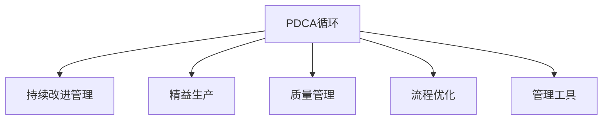

                 

# PDCA循环与持续改进管理

> 关键词：PDCA循环,持续改进管理,精益生产,质量管理,流程优化,管理工具

## 1. 背景介绍

### 1.1 问题由来
在快速变化的市场环境中，企业需要不断优化其业务流程和产品质量，以保持竞争力。传统的静态管理和一次性改进已经无法满足这些需求。为了适应市场变化和提升整体管理效率，PDCA循环（Plan-Do-Check-Act，计划-执行-检查-改进）应运而生，作为一种系统化、循环化的管理方法，通过不断循环反馈来持续改进，使得管理质量不断提升。

### 1.2 问题核心关键点
PDCA循环的核心在于其循环迭代的特性。通过连续的计划（Plan）、执行（Do）、检查（Check）和改进（Act）四个步骤，企业能够不断调整和优化其业务流程和管理方法，以适应外部环境变化和内部资源配置。PDCA循环的精髓在于通过持续的反馈和改进，将错误和不足转化为学习和提升的机会，从而实现管理质量和效率的持续提升。

### 1.3 问题研究意义
PDCA循环不仅适用于制造业等传统行业，同样适用于软件开发、服务业、科学研究等领域。通过持续改进，企业可以提升产品质量，优化业务流程，提高效率，增强客户满意度，从而在激烈的市场竞争中取得优势。同时，PDCA循环也为企业的创新和变革提供了科学的管理方法，推动企业向更高层次的管理水平迈进。

## 2. 核心概念与联系

### 2.1 核心概念概述

为了更好地理解PDCA循环，本节将介绍几个密切相关的核心概念：

- PDCA循环：一种系统化的管理方法，通过连续的计划、执行、检查和改进四个步骤，实现持续改进。
- 持续改进管理：一种注重过程优化和持续反馈的管理理念，通过PDCA循环不断提升管理质量。
- 精益生产：一种以消除浪费为目标的生产管理方法，强调效率和质量。
- 质量管理：以确保产品和服务符合客户需求和标准为核心的管理过程。
- 流程优化：通过科学方法和工具对业务流程进行重新设计，以提高效率和质量。
- 管理工具：如看板、流程地图、六西格玛（Six Sigma）等，辅助PDCA循环实施。

这些概念之间的逻辑关系可以通过以下Mermaid流程图来展示：



这个流程图展示了一系列相关概念之间的联系：

1. PDCA循环是持续改进管理的基础，通过循环迭代的四个步骤实现管理提升。
2. 精益生产、质量管理和流程优化都是PDCA循环在特定管理领域的体现。
3. 管理工具是实施PDCA循环的工具，辅助企业进行科学管理。

这些概念共同构成了企业管理的整体框架，使得企业在不同的管理层面能够实现全方位的提升。

## 3. 核心算法原理 & 具体操作步骤

### 3.1 算法原理概述

PDCA循环是一种结构化的管理方法，通过四个步骤的循环进行管理过程的持续改进。其核心思想是：在计划阶段明确目标，执行阶段实现目标，检查阶段评估结果，改进阶段根据评估结果进行调整和优化。

形式化地，PDCA循环的过程可以表示为：

$$
\text{PDCA} = \underbrace{\text{Plan}}_{P} \rightarrow \underbrace{\text{Do}}_{D} \rightarrow \underbrace{\text{Check}}_{C} \rightarrow \underbrace{\text{Act}}_{A}
$$

其中，每个步骤的输出成为下一个步骤的输入，形成一个闭环，不断迭代优化。

### 3.2 算法步骤详解

PDCA循环的四个步骤可以详细解释如下：

#### 3.2.1 计划阶段（Plan）

计划阶段是PDCA循环的起始步骤，目的是明确目标和制定行动方案。其主要步骤包括：

1. **目标设定**：明确业务改进的目标，包括质量提升、效率提高、成本降低等。目标应具体、可量化、可实现。
2. **现状分析**：分析当前业务流程或管理状态，识别问题点、瓶颈和改进空间。
3. **改进措施**：基于现状分析和目标设定，制定具体的改进措施和行动计划。
4. **资源分配**：确定需要的资源，包括人力、物力、财力等，并进行分配和准备。

#### 3.2.2 执行阶段（Do）

执行阶段是将计划付诸实施的过程。其主要步骤包括：

1. **实施改进措施**：按照制定的计划，实施改进措施。
2. **数据收集**：在实施过程中收集相关数据和信息，用于后续的评估和改进。
3. **人员培训**：如果改进措施涉及人员技能或知识提升，需要进行培训。
4. **资源调整**：根据执行情况，调整资源分配，确保改进措施能够顺利实施。

#### 3.2.3 检查阶段（Check）

检查阶段是对执行结果的评估和反馈过程。其主要步骤包括：

1. **结果评估**：通过比较实施前后的数据，评估改进措施的效果。
2. **问题识别**：识别实施过程中出现的问题和不足。
3. **原因分析**：分析问题的根本原因，找出改进措施未能达到预期效果的原因。
4. **反馈机制**：建立反馈机制，将评估结果和问题反馈给相关人员和部门。

#### 3.2.4 改进阶段（Act）

改进阶段是根据检查结果进行调整和优化。其主要步骤包括：

1. **调整措施**：根据检查结果，对不合理的改进措施进行调整。
2. **标准化**：将有效的改进措施纳入标准化流程，避免问题反复出现。
3. **推广应用**：将改进措施在组织内部推广应用，提升整体管理水平。
4. **持续改进**：将PDCA循环不断循环应用，持续提升管理质量和效率。

### 3.3 算法优缺点

PDCA循环作为一种管理方法，具有以下优点：

1. 系统化：通过四个步骤的闭环管理，确保管理过程的系统性和连续性。
2. 可操作性强：每个步骤都有明确的操作流程，便于实施和管理。
3. 反馈机制完善：通过检查和改进步骤，能够及时发现和解决问题。
4. 持续改进：通过不断循环，使得管理水平不断提升。

同时，PDCA循环也存在以下缺点：

1. 时间成本高：每个循环周期需要一定时间，对于一些快速变化的市场环境可能不够及时。
2. 复杂度高：对于一些复杂的业务流程，实施PDCA循环可能较为繁琐。
3. 过度依赖人为因素：如果执行不力或反馈机制不完善，可能导致改进效果不佳。
4. 难以量化评估：对于一些难以量化的管理指标，PDCA循环的评估可能不够准确。

尽管存在这些局限性，但就目前而言，PDCA循环仍是一种较为成熟和有效的管理方法，被广泛应用于各行各业。

### 3.4 算法应用领域

PDCA循环不仅适用于制造业，还广泛应用于软件开发、服务业、科学研究等领域。以下是几个典型的应用场景：

- **软件开发**：通过PDCA循环，可以不断优化代码质量、提升开发效率、降低错误率。例如，在开发新功能时，计划阶段确定需求、设计方案，执行阶段编写代码、测试，检查阶段进行代码审查、性能测试，改进阶段优化代码、修复漏洞。
- **服务业**：通过PDCA循环，可以不断提升服务质量、优化客户体验。例如，在服务流程改进时，计划阶段分析客户需求和痛点，执行阶段实施改进措施，检查阶段收集客户反馈，改进阶段优化服务流程。
- **科学研究**：通过PDCA循环，可以不断提升科研效率、提高研究成果的质量。例如，在科研项目中，计划阶段确定研究方向和实验方案，执行阶段实施实验，检查阶段评估实验结果，改进阶段优化实验设计和分析方法。

此外，PDCA循环在项目管理、质量管理、供应链管理等领域也有广泛应用，为不同行业的管理提升提供了科学的方法论。

## 4. 数学模型和公式 & 详细讲解 & 举例说明

### 4.1 数学模型构建

PDCA循环的每个步骤都可以通过数学模型来表示。以软件开发中的PDCA循环为例，我们可以构建以下数学模型：

**目标设定**：设目标为$T$，为最大化软件质量、效率和稳定性。目标$T$可以表示为：

$$
T = Q + E + S
$$

其中$Q$表示软件质量，$E$表示开发效率，$S$表示软件稳定性。

**现状分析**：设当前状态为$S_0$，通过分析当前代码、流程、人员等现状，可以得到当前状态$S_0$的表示。

**改进措施**：设改进措施为$M$，可以表示为：

$$
M = (S_1 - S_0) + (C - Q) + (T - E)
$$

其中$S_1$表示改进后的状态，$C$表示改进的资源，$T$表示目标。

**资源分配**：设资源分配为$R$，可以表示为：

$$
R = \frac{M}{E}
$$

其中$E$表示资源效率。

**实施改进措施**：设实施改进措施后的状态为$S_2$，可以表示为：

$$
S_2 = S_1 - M
$$

**数据收集**：设收集到的数据为$D$，可以表示为：

$$
D = f(S_2)
$$

其中$f$表示数据收集函数。

**结果评估**：设结果评估结果为$E_1$，可以表示为：

$$
E_1 = Q(S_2) - T
$$

**问题识别**：设识别到的问题为$P$，可以表示为：

$$
P = f(D, E_1)
$$

**原因分析**：设问题原因分析结果为$C_1$，可以表示为：

$$
C_1 = g(P)
$$

**反馈机制**：设反馈机制结果为$F$，可以表示为：

$$
F = h(C_1, S_2)
$$

**调整措施**：设调整措施为$M'$，可以表示为：

$$
M' = M - C_1
$$

**标准化**：设标准化措施为$S_3$，可以表示为：

$$
S_3 = S_2 + M'
$$

**推广应用**：设推广应用结果为$E_2$，可以表示为：

$$
E_2 = \frac{S_3 - S_0}{E}
$$

**持续改进**：设持续改进后的状态为$S_4$，可以表示为：

$$
S_4 = S_3
$$

### 4.2 公式推导过程

以软件开发中的PDCA循环为例，我们来详细推导一下各个步骤的数学模型：

**目标设定**：

$$
T = Q + E + S
$$

**现状分析**：

$$
S_0 = f_{status}(S)
$$

**改进措施**：

$$
M = (S_1 - S_0) + (C - Q) + (T - E)
$$

**资源分配**：

$$
R = \frac{M}{E}
$$

**实施改进措施**：

$$
S_2 = S_1 - M
$$

**数据收集**：

$$
D = f_{data}(S_2)
$$

**结果评估**：

$$
E_1 = Q(S_2) - T
$$

**问题识别**：

$$
P = f_{problem}(D, E_1)
$$

**原因分析**：

$$
C_1 = g_{cause}(P)
$$

**反馈机制**：

$$
F = h_{feedback}(C_1, S_2)
$$

**调整措施**：

$$
M' = M - C_1
$$

**标准化**：

$$
S_3 = S_2 + M'
$$

**推广应用**：

$$
E_2 = \frac{S_3 - S_0}{E}
$$

**持续改进**：

$$
S_4 = S_3
$$

通过上述公式的推导，我们可以看到PDCA循环的数学模型是高度抽象和结构化的，每个步骤都有明确的输入和输出，便于进行科学管理和评估。

### 4.3 案例分析与讲解

以制造业中的PDCA循环为例，分析其应用。假设某制造企业希望提升产品质量，通过PDCA循环的步骤进行如下操作：

**计划阶段**：

- 目标设定：提升产品质量，减少次品率。
- 现状分析：通过统计分析，发现次品率为5%。
- 改进措施：引入质量控制流程，包括自检、互检、抽检等。
- 资源分配：分配专职质量检查员，提供必要的检查工具。

**执行阶段**：

- 实施改进措施：在生产线上实施质量控制流程。
- 数据收集：收集每个班组的次品率数据。
- 人员培训：对质量检查员进行培训。
- 资源调整：根据次品率情况调整检查频率和工具。

**检查阶段**：

- 结果评估：统计次品率数据，发现次品率下降至3%。
- 问题识别：发现质量检查员存在检查不严格的情况。
- 原因分析：分析发现质量检查员缺乏系统性检查方法。
- 反馈机制：将问题反馈给生产部门和质量检查员。

**改进阶段**：

- 调整措施：引入系统性检查方法，如SOP（标准操作程序）。
- 标准化：将新的检查方法纳入标准化流程。
- 推广应用：在全公司范围内推广新的检查方法。
- 持续改进：继续监控次品率，不断优化质量控制流程。

通过上述PDCA循环的步骤，该制造企业成功提升了产品质量，减少了次品率，实现了管理提升。

## 5. 项目实践：代码实例和详细解释说明

### 5.1 开发环境搭建

要进行PDCA循环的项目实践，首先需要搭建好开发环境。以下是使用Python进行PyTorch开发的环境配置流程：

1. 安装Anaconda：从官网下载并安装Anaconda，用于创建独立的Python环境。

2. 创建并激活虚拟环境：
```bash
conda create -n pdca-env python=3.8 
conda activate pdca-env
```

3. 安装PyTorch：根据CUDA版本，从官网获取对应的安装命令。例如：
```bash
conda install pytorch torchvision torchaudio cudatoolkit=11.1 -c pytorch -c conda-forge
```

4. 安装相关库：
```bash
pip install pandas numpy matplotlib jupyter notebook
```

完成上述步骤后，即可在`pdca-env`环境中开始PDCA循环的项目实践。

### 5.2 源代码详细实现

这里我们以制造业中的PDCA循环为例，给出使用PyTorch进行PDCA循环的代码实现。

首先，定义PDCA循环的状态类：

```python
from enum import Enum

class PDCAState(Enum):
    PLAN = 1
    DO = 2
    CHECK = 3
    ACT = 4
```

然后，定义PDCA循环的状态转换函数：

```python
def transition(state, action):
    if state == PDCAState.PLAN:
        return PDCAState.DO
    elif state == PDCAState.DO:
        return PDCAState.CHECK
    elif state == PDCAState.CHECK:
        return PDCAState.ACT
    elif state == PDCAState.ACT:
        return PDCAState.PLAN
    else:
        raise ValueError("Invalid state")
```

接着，定义PDCA循环的实施过程：

```python
class PDCA:
    def __init__(self):
        self.state = PDCAState.PLAN
        self.data = []
    
    def plan(self, plan_data):
        self.data.append(plan_data)
        self.state = PDCAState.DO
    
    def do(self, do_data):
        self.data.append(do_data)
        self.state = PDCAState.CHECK
    
    def check(self, check_data):
        self.data.append(check_data)
        self.state = PDCAState.ACT
    
    def act(self, act_data):
        self.data.append(act_data)
        self.state = PDCAState.PLAN
    
    def get_data(self):
        return self.data
```

最后，启动PDCA循环：

```python
pdca = PDCA()

# 计划阶段
plan_data = {'objective': '提升产品质量', 'current_state': '次品率5%'}
pdca.plan(plan_data)

# 执行阶段
do_data = {'action': '引入质量控制流程', 'resources': '专职质量检查员'}
pdca.do(do_data)

# 检查阶段
check_data = {'result': '次品率下降至3%', 'problem': '质量检查员检查不严格'}
pdca.check(check_data)

# 改进阶段
act_data = {'solution': '引入系统性检查方法', 'standardize': '纳入标准化流程'}
pdca.act(act_data)

# 获取数据
data = pdca.get_data()
print(data)
```

以上就是使用PyTorch进行PDCA循环的完整代码实现。可以看到，通过定义状态和状态转换函数，我们能够方便地实现PDCA循环的各个步骤。同时，利用列表存储数据，便于对PDCA循环的各个步骤进行记录和分析。

### 5.3 代码解读与分析

让我们再详细解读一下关键代码的实现细节：

**PDCAState类**：
- `PDCAState`枚举类：定义了PDCA循环的四个状态，方便进行状态管理和状态转换。

**transition函数**：
- `transition`函数：实现了状态之间的转换，通过判断当前状态和执行的操作，返回下一个状态。

**PDCA类**：
- `PDCA`类：封装了PDCA循环的核心操作，包括计划、执行、检查和改进四个步骤。
- `plan`方法：模拟计划阶段，将目标和当前状态数据添加到列表中，并将状态转换为执行状态。
- `do`方法：模拟执行阶段，将措施和资源数据添加到列表中，并将状态转换为检查状态。
- `check`方法：模拟检查阶段，将结果和问题数据添加到列表中，并将状态转换为改进状态。
- `act`方法：模拟改进阶段，将解决方案和标准化数据添加到列表中，并将状态转换为计划状态。
- `get_data`方法：获取PDCA循环的所有数据。

**启动PDCA循环**：
- `pdca`对象：通过定义PDCA循环的各个步骤，启动PDCA循环。
- 在每个步骤中，我们模拟了数据收集和状态转换，并最终输出了PDCA循环的所有数据。

通过上述代码，我们可以清晰地看到PDCA循环的各个步骤，并且能够灵活地进行管理和优化。这为实际项目管理提供了有益的参考。

## 6. 实际应用场景

### 6.1 智能制造

在智能制造领域，PDCA循环被广泛应用于生产流程的优化和质量控制。传统制造业往往依赖人工检查和经验管理，容易出现质量不稳定、生产效率低等问题。通过PDCA循环，企业可以实现生产流程的持续改进，提升产品质量和生产效率。

例如，某汽车制造企业通过PDCA循环，逐步优化了其生产流程，实现了以下几点改进：

- 在计划阶段，企业通过分析生产数据，发现了质量问题集中于某一工序。
- 在执行阶段，企业引入了先进的自动化检测设备和质量控制流程，提升了检测效率和准确性。
- 在检查阶段，企业收集了检测数据，发现设备仍存在一定的误检率。
- 在改进阶段，企业调整了检测设备的参数，优化了检测算法，提高了检测精度。

通过PDCA循环的不断循环，该企业成功提升了生产效率和产品质量，实现了智能化制造的目标。

### 6.2 软件开发

在软件开发领域，PDCA循环同样发挥着重要作用。软件开发过程中，需求变化快、代码量大、错误率高，需要持续改进以保持软件质量和效率。

例如，某软件开发团队通过PDCA循环，逐步优化了其开发流程，实现了以下几点改进：

- 在计划阶段，团队分析了项目需求和现有代码质量，确定了改进目标。
- 在执行阶段，团队引入了代码审查、自动化测试等措施，提升代码质量和测试效率。
- 在检查阶段，团队收集了代码审查和测试数据，发现一些代码模块存在性能瓶颈。
- 在改进阶段，团队优化了代码结构和算法，提高了代码性能和可维护性。

通过PDCA循环的不断循环，该团队成功提升了软件质量和开发效率，增强了客户满意度。

### 6.3 医疗健康

在医疗健康领域，PDCA循环被应用于病患管理和医疗流程优化。传统医疗管理依赖手工记录和经验判断，容易出现误诊、漏诊等问题。通过PDCA循环，医疗机构可以实现病患管理和医疗流程的持续改进，提升医疗质量和效率。

例如，某医院通过PDCA循环，逐步优化了其病患管理流程，实现了以下几点改进：

- 在计划阶段，医院分析了现有病患管理流程，发现了患者入院登记和诊断效率低的问题。
- 在执行阶段，医院引入了电子病历系统和自动化诊断工具，提升了病患管理和诊断效率。
- 在检查阶段，医院收集了病患数据，发现仍有部分病患未能及时诊断和入院。
- 在改进阶段，医院优化了病患入院登记流程，加强了诊断设备的维护和更新，提高了诊断准确性和入院效率。

通过PDCA循环的不断循环，该医院成功提升了病患管理和医疗质量，提高了患者满意度和医院效率。

### 6.4 未来应用展望

随着数字化转型的加速，PDCA循环在各行业的应用将更加广泛。未来，PDCA循环将进一步拓展到以下领域：

- 智能城市：通过PDCA循环，优化城市管理流程，提升公共服务质量和效率。
- 智慧物流：通过PDCA循环，优化物流流程，提升货物运输效率和准确性。
- 电子商务：通过PDCA循环，优化电商流程，提升用户购物体验和商家运营效率。
- 金融服务：通过PDCA循环，优化金融流程，提升风险管理和客户服务质量。

PDCA循环的持续改进理念，将为各行各业的管理提升提供强大的工具支持，推动企业向更高层次的管理水平迈进。

## 7. 工具和资源推荐

### 7.1 学习资源推荐

为了帮助开发者系统掌握PDCA循环的理论基础和实践技巧，这里推荐一些优质的学习资源：

1. 《精益生产》系列书籍：介绍了精益生产的核心理念和方法，通过实际案例讲解PDCA循环的应用。
2. 《PDCA循环实用指南》：详细讲解了PDCA循环的各个步骤和应用场景，提供了大量的实践案例。
3. 《质量管理》课程：结合PDCA循环，讲解质量管理的理论和方法，适合企业管理人员学习。
4. 《PDCA循环工具集》：介绍了PDCA循环的管理工具，如看板、流程地图、六西格玛等，提供详细的使用指南。
5. 《持续改进管理》在线课程：通过实际项目案例，讲解PDCA循环在各行业的应用。

通过对这些资源的学习实践，相信你一定能够系统掌握PDCA循环的理论基础和实践技巧，并用于解决实际的管理问题。

### 7.2 开发工具推荐

高效的开发离不开优秀的工具支持。以下是几款用于PDCA循环开发的常用工具：

1. Jira：项目管理工具，支持PDCA循环的各个步骤的跟踪和记录，适合企业进行系统化管理。
2. Asana：任务管理工具，提供灵活的看板视图，方便PDCA循环的实施和管理。
3. Microsoft Excel：数据分析工具，支持图表和统计分析，方便PDCA循环的数据处理和评估。
4. GitHub：版本控制工具，支持项目协作和代码版本管理，方便PDCA循环的迭代和优化。
5. Trello：看板工具，支持PDCA循环的可视化和状态管理，适合小型团队进行协作。

合理利用这些工具，可以显著提升PDCA循环的实施效率，加快创新迭代的步伐。

### 7.3 相关论文推荐

PDCA循环作为一种经典的管理方法，其理论基础和实践应用已经在学术界和工业界得到了广泛研究。以下是几篇奠基性的相关论文，推荐阅读：

1. Womack, J. P., Jones, D. T., & Roos, D. E. (1990). The Goal: A Process of Ongoing Improvement. MIT Press.
2. Deming, W. E. (1950). On the Theory of Product Quality and the Influence of Productivity on It. The Journal of Applied Psychology, 24(4), 215-219.
3. Ishikawa, K. (1976). The Uncontrolled Chart, A Tool for Improving Quality. The Journal of Quality Technology, 8(1), 25-29.
4. Toyota, E. (1995). The Toyota Production System: Beyond Large-Scale Production. MIT Press.
5. Six Sigma (1999). Six Sigma Quality Control Methodology. American Society for Quality.

这些论文代表了大语言模型微调技术的发展脉络。通过学习这些前沿成果，可以帮助研究者把握学科前进方向，激发更多的创新灵感。

## 8. 总结：未来发展趋势与挑战

### 8.1 研究成果总结

本文对PDCA循环进行了全面系统的介绍。首先阐述了PDCA循环的研究背景和意义，明确了PDCA循环在企业管理中的重要作用。其次，从原理到实践，详细讲解了PDCA循环的四个步骤和各个步骤的操作流程，给出了PDCA循环的代码实现示例。同时，本文还广泛探讨了PDCA循环在制造业、软件开发、医疗健康等多个领域的应用场景，展示了PDCA循环的广泛适用性和重要价值。最后，本文精选了PDCA循环的学习资源、开发工具和相关论文，力求为读者提供全方位的技术指引。

通过本文的系统梳理，可以看到，PDCA循环是一种系统化、循环化的管理方法，通过不断循环反馈，实现管理质量的持续提升。PDCA循环不仅适用于制造业，还广泛应用于软件开发、服务业、科学研究等领域。通过持续改进，企业可以提升产品质量，优化业务流程，提高效率，增强客户满意度，从而在激烈的市场竞争中取得优势。

### 8.2 未来发展趋势

展望未来，PDCA循环将呈现以下几个发展趋势：

1. 数字化转型：随着数字化转型的加速，PDCA循环在各行业的应用将更加广泛，通过数字化工具和平台支持PDCA循环的实施。
2. 自动化管理：通过引入AI和大数据分析技术，PDCA循环将实现自动化管理，提升管理效率和效果。
3. 跨部门协作：PDCA循环将突破传统的部门界限，实现跨部门协作和信息共享，提升整体管理水平。
4. 数据驱动决策：通过数据驱动的PDCA循环，企业能够实现科学决策，优化资源配置。
5. 全球化应用：随着企业全球化的推进，PDCA循环将应用于国际市场，提升全球管理水平。

这些趋势将使PDCA循环在更多领域发挥其管理优势，推动企业向更高层次的管理水平迈进。

### 8.3 面临的挑战

尽管PDCA循环具有诸多优势，但在实施过程中仍然面临一些挑战：

1. 数据质量问题：PDCA循环的数据收集和分析环节，需要高质量的数据支持。数据缺失、不准确等问题可能导致管理决策失准。
2. 资源调配困难：PDCA循环的实施需要大量的资源支持，包括人力、物力、财力等。资源的调配和管理是PDCA循环实施的一大难点。
3. 组织变革阻力：PDCA循环需要企业进行全面的组织变革，可能遭遇员工抵触、管理层支持不足等问题。
4. 文化差异问题：不同组织的企业文化和管理理念不同，PDCA循环的实施需要克服文化差异，实现统一的管理思想。
5. 持续改进难度：PDCA循环需要不断循环改进，但一些企业管理层和员工可能缺乏持续改进的动力和能力。

尽管这些挑战存在，但通过科学的方法和管理手段，这些挑战是可以逐步克服的。

### 8.4 研究展望

未来，PDCA循环的研究需要在以下几个方面寻求新的突破：

1. 数据驱动的PDCA：通过大数据和人工智能技术，实现数据驱动的PDCA循环，提升管理决策的科学性和准确性。
2. 自动化PDCA工具：开发自动化PDCA循环工具，支持PDCA循环的快速实施和管理。
3. 跨部门协作机制：建立跨部门协作机制，打破部门壁垒，实现信息共享和协同管理。
4. 全球化管理方法：研究适用于全球化的PDCA循环管理方法，提升全球化管理水平。
5. 可扩展PDCA框架：研究可扩展的PDCA框架，支持企业在不同规模和层次的管理场景中使用PDCA循环。

这些研究方向的探索，必将推动PDCA循环的进一步发展和应用，为企业提供更加科学、高效的管理工具，推动企业的持续改进和创新。

## 9. 附录：常见问题与解答

**Q1：PDCA循环是否适用于所有企业？**

A: PDCA循环适用于大多数企业，特别是那些需要进行持续改进和优化管理的企业。但需要注意的是，对于某些特别复杂或独特的业务场景，可能需要结合其他管理方法或工具进行优化。

**Q2：如何确保PDCA循环的顺利实施？**

A: 确保PDCA循环顺利实施的关键在于：
1. 明确目标：设定清晰、可量化的目标，确保每个步骤都有明确的任务和指标。
2. 全员参与：让所有相关人员参与PDCA循环的实施，确保信息透明和协作顺畅。
3. 持续沟通：建立良好的沟通机制，确保各步骤的进展和问题能够及时反馈和解决。
4. 资源支持：确保PDCA循环的实施有足够的资源支持，包括人力、物力、财力等。
5. 定期评估：定期评估PDCA循环的实施效果，及时调整和优化管理策略。

**Q3：PDCA循环的实施成本高吗？**

A: PDCA循环的实施成本确实较高，需要大量的资源投入和人员培训。但通过持续改进，PDCA循环能够带来显著的管理效益和业务提升，从长期来看，其投资回报率是显著的。

**Q4：PDCA循环在实施过程中如何避免资源浪费？**

A: 在实施PDCA循环时，可以通过以下几点避免资源浪费：
1. 资源规划：在计划阶段，进行详细的资源规划和分配，确保资源得到合理利用。
2. 流程优化：通过流程优化，消除不必要的步骤和环节，减少资源消耗。
3. 自动化管理：引入自动化工具和管理系统，提高资源利用效率。
4. 数据驱动：通过数据驱动的管理决策，确保资源分配和使用的科学性和合理性。

**Q5：PDCA循环是否适用于小型企业？**

A: PDCA循环同样适用于小型企业，通过PDCA循环，小型企业也可以实现持续改进和管理优化。但在实施PDCA循环时，需要根据企业规模和特点，灵活调整和优化管理方法和步骤。

通过上述问题的解答，相信你能够更好地理解和实施PDCA循环，将其应用于实际的管理中，提升企业的管理水平和业务效益。

---

作者：禅与计算机程序设计艺术 / Zen and the Art of Computer Programming

