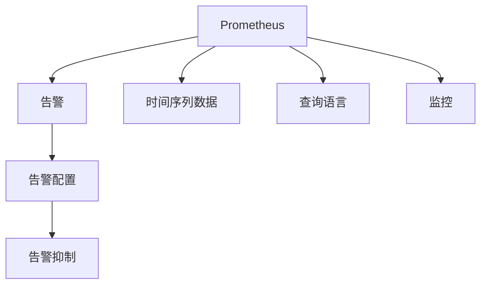

                 

# Prometheus监控告警配置优化

> 关键词：Prometheus, 监控告警, 配置优化, 高效告警, 告警抑制, 时间序列数据

## 1. 背景介绍

在现代信息技术迅猛发展的背景下，监控系统已成为保证企业IT基础设施稳定运行的关键组成部分。Prometheus作为开源的云监控系统，凭借其灵活、高性能和易于扩展的特性，成为很多企业的首选监控解决方案。然而，随着监控系统的日趋复杂，告警配置的优化变得越来越重要。本文章将系统介绍Prometheus的告警配置优化方法，结合实际案例，帮助读者构建高效、精确的监控告警系统。

## 2. 核心概念与联系

### 2.1 核心概念概述

**Prometheus**：开源的云监控系统，支持分布式架构，支持水平扩展，能处理大规模的时间序列数据。

**告警**：通过监控系统的数据处理和分析，在出现异常情况时发出的警告信息，以帮助管理员快速定位问题。

**告警配置**：告警系统中的参数设置，包括阈值、过滤条件、通知方式等，这些设置直接影响告警的准确性和效率。

**告警抑制**：避免因告警规则冲突而导致的告警洪流，通过聚合或过滤告警，提高告警系统效能。

**时间序列数据**：在监控系统中，时间序列数据是最基本的数据类型，表示按照时间顺序排列的观测值序列。

**查询语言**：Prometheus支持灵活的查询语言，通过指定查询条件和聚合函数，能对时间序列数据进行高效的聚合和分析。

这些概念在Prometheus告警系统中的联系可以通过以下Mermaid流程图来展示：



在这个流程图中，我们可以看到，告警配置和告警抑制是告警系统的重要组成部分，它们通过有效的配置和处理，保证监控告警系统的准确性和高效性。而时间序列数据和查询语言是Prometheus监控系统的核心技术，通过灵活的查询语言，我们可以高效地处理和分析时间序列数据。

## 3. 核心算法原理 & 具体操作步骤

### 3.1 算法原理概述

Prometheus的告警系统基于时间序列数据，通过预设的规则和配置，对监控系统中的异常进行识别和处理。告警配置的优化，主要包括阈值设定、告警聚合、告警过滤和告警抑制等方面。以下是对这些算法的详细讲解：

### 3.2 算法步骤详解

#### 3.2.1 阈值设定

阈值是告警系统中最基本的配置，它决定了哪些数据点会被认为是异常。在Prometheus中，可以通过查询语言和警戒规则文件（Alerting Rule File）来设置阈值。

**示例**：

```yaml
groups:
  - name: example
    rules:
      - alert: ExampleRule
        expr: 30m avg(uptime) < 95
        for: 5m
        labels:
          severity: warning
```

在上面的例子中，我们使用`uptime`指标的30分钟平均数据，如果低于95%，就会触发警报，持续5分钟后该警报将被重置。

#### 3.2.2 告警聚合

为了更好地识别异常，Prometheus支持告警的聚合功能。通过聚合，可以将多个告警合并成一个，从而减少告警洪流，提高告警系统的效率。

**示例**：

```yaml
groups:
  - name: example
    rules:
      - alert: ExampleRule
        expr: 30m avg(uptime) < 95
        for: 5m
        labels:
          severity: warning
        record: ExampleRule
        at: 10m
```

在上面的例子中，我们使用了`record`标签和`at`标签，将告警记录在`ExampleRule`，并在10分钟后进行一次聚合。

#### 3.2.3 告警过滤

在告警系统中，可能会收到大量的无用告警，因此需要加入过滤规则，过滤掉一些不必要的信息，从而提升告警系统的准确性。

**示例**：

```yaml
groups:
  - name: example
    rules:
      - alert: ExampleRule
        expr: 30m avg(uptime) < 95
        for: 5m
        labels:
          severity: warning
        record: ExampleRule
        at: 10m
        evaluation_interval: 10m
        labels:
          environment: production
        record: ExampleRule
        at: 10m
```

在上面的例子中，我们通过`environment`标签过滤了生产环境的告警。

#### 3.2.4 告警抑制

告警抑制是指在告警系统中，对告警规则进行聚合或过滤，避免因告警规则冲突而导致的告警洪流。Prometheus支持多种告警抑制策略，包括`LabelSelector`, `GroupLabels`等。

**示例**：

```yaml
groups:
  - name: example
    rules:
      - alert: ExampleRule
        expr: 30m avg(uptime) < 95
        for: 5m
        labels:
          severity: warning
        record: ExampleRule
        at: 10m
        evaluation_interval: 10m
        labels:
          environment: production
        record: ExampleRule
        at: 10m
        labels:
          environment: test
```

在上面的例子中，我们使用了`labels`标签来过滤不同环境的告警，以避免告警冲突。

### 3.3 算法优缺点

#### 3.3.1 优点

1. **灵活性**：Prometheus的告警系统支持灵活的查询语言和警戒规则文件，可以根据不同的业务需求进行灵活配置。

2. **高效性**：通过告警聚合和抑制，可以减少告警洪流，提高告警系统的效率。

3. **准确性**：通过告警过滤和阈值设定，可以减少无用告警，提高告警系统的准确性。

#### 3.3.2 缺点

1. **复杂性**：告警配置的优化需要深入理解Prometheus的查询语言和警戒规则，具有一定的学习成本。

2. **维护成本**：告警配置的优化需要持续维护和调整，以适应业务的变化。

## 4. 数学模型和公式 & 详细讲解 & 举例说明

### 4.1 数学模型构建

Prometheus的告警系统基于时间序列数据，其数学模型可以表示为：

$$ TSD(t) = \sum_{i=1}^{n} A_i(t) $$

其中 $TSD(t)$ 表示时间序列数据，$A_i(t)$ 表示第 $i$ 个数据点。

### 4.2 公式推导过程

在Prometheus中，我们通过查询语言对时间序列数据进行查询和分析。以下是一些常用的查询语言公式：

1. `avg()`: 计算时间序列的平均值。
2. `min()`: 计算时间序列的最小值。
3. `max()`: 计算时间序列的最大值。
4. `sum()`: 计算时间序列的总和。

例如，我们想要计算`uptime`指标的30分钟平均值，可以使用以下查询语言：

```promql
avg(uptime[30m])
```

### 4.3 案例分析与讲解

以下是一个具体的告警配置案例：

**问题描述**：
在生产环境中，服务器CPU使用率超过90%。

**配置方案**：

```yaml
groups:
  - name: example
    rules:
      - alert: CPUUsageAlarm
        expr: 1m avg(container_cpu_usage_total{namespace="default", pod!="prometheus"}) > 90
        for: 5m
        labels:
          severity: warning
        record: CPUUsageAlarm
        at: 10m
```

在上面的配置中，我们使用了`avg()`函数计算了每个容器CPU使用率的总和，并设置了阈值为90%。如果超过了90%，就会触发告警，并记录在`CPUUsageAlarm`中。

## 5. 项目实践：代码实例和详细解释说明

### 5.1 开发环境搭建

在开始Prometheus告警配置优化实践之前，需要先搭建好开发环境。以下是一个基本的Prometheus搭建过程：

1. 安装Prometheus：可以从官方网站下载最新版本的Prometheus二进制包，解压并安装。

2. 安装Prometheus Node Exporter：这是Prometheus用于收集操作系统和应用程序数据的代理，可以获取系统资源信息。

3. 配置Prometheus：编辑`prometheus.yml`配置文件，配置数据源、告警规则等。

4. 启动Prometheus：在终端运行`./prometheus`命令，启动Prometheus服务。

### 5.2 源代码详细实现

以下是一个示例的告警配置文件：

```yaml
groups:
  - name: example
    rules:
      - alert: CPUUsageAlarm
        expr: 1m avg(container_cpu_usage_total{namespace="default", pod!="prometheus"}) > 90
        for: 5m
        labels:
          severity: warning
        record: CPUUsageAlarm
        at: 10m
```

在上面的配置文件中，我们定义了一个名为`CPUUsageAlarm`的告警，条件为`1m avg(container_cpu_usage_total{namespace="default", pod!="prometheus"}) > 90`，即容器CPU使用率超过90%。告警触发后，会在10分钟内发送通知。

### 5.3 代码解读与分析

在这个告警配置文件中，我们使用了`avg()`函数来计算容器CPU使用率，并设置了一个阈值。其中，`container_cpu_usage_total`是Prometheus内置的指标，可以用于获取容器CPU使用率。

### 5.4 运行结果展示

运行上面的配置文件，Prometheus会按照指定的规则进行告警检测。如果检测到容器CPU使用率超过90%，就会触发告警，并发送通知。

## 6. 实际应用场景

### 6.1 网络监控

在网络监控中，Prometheus可以用于监控网络流量、网络延迟等关键指标。通过告警配置优化，可以及时发现网络异常，保障网络稳定性。

### 6.2 数据库监控

在数据库监控中，Prometheus可以用于监控数据库的读写性能、连接数等关键指标。通过告警配置优化，可以及时发现数据库性能瓶颈，避免数据丢失或损坏。

### 6.3 应用程序监控

在应用程序监控中，Prometheus可以用于监控应用程序的请求响应时间、错误率等关键指标。通过告警配置优化，可以及时发现应用程序的性能问题，保障系统稳定运行。

## 7. 工具和资源推荐

### 7.1 学习资源推荐

1. Prometheus官方文档：包含丰富的查询语言和告警配置指南，适合初学者学习。

2. Prometheus官方博客：提供最新的Prometheus动态和技术分享，帮助用户了解Prometheus的最新进展。

3. Prometheus社区论坛：用户可以在这里交流经验，解决常见问题。

4. YouTube频道：提供丰富的Prometheus教学视频，适合动手实践。

### 7.2 开发工具推荐

1. Grafana：Prometheus数据可视化工具，可以将查询结果展示为图表，帮助用户更直观地理解数据。

2. Alertmanager：告警系统，可以接收Prometheus发来的告警，并进行聚合和抑制。

3. Kibana：日志管理工具，可以将告警日志展示为仪表盘，帮助用户更好地监控告警。

4. WeChat：为了方便用户交流和分享经验，可以使用WeChat组建学习群。

### 7.3 相关论文推荐

1. "Prometheus: A Time Series Database for Cloud Systems"：原作者谈Prometheus的设计和实现。

2. "Prometheus Alerting: An Operational Example"：讲解了如何使用Prometheus的告警系统。

3. "The Evolution of Prometheus and Its Impact on IT Operations"：介绍了Prometheus的演变和应用效果。

## 8. 总结：未来发展趋势与挑战

### 8.1 研究成果总结

Prometheus告警系统基于时间序列数据，通过灵活的查询语言和告警配置，可以实现高效、精确的告警检测和处理。告警配置优化是Prometheus告警系统的关键，通过阈值设定、告警聚合、告警过滤和告警抑制等方法，可以提高告警系统的效率和准确性。

### 8.2 未来发展趋势

1. **自动化告警配置**：未来的告警配置优化将更加自动化，利用机器学习等技术，自动调整告警规则，以适应业务的变化。

2. **智能告警分析**：通过引入机器学习、自然语言处理等技术，可以更好地分析告警信息，预测未来的告警趋势，提高告警系统的预警能力。

3. **多云环境支持**：未来的告警系统将支持多云环境，自动在不同云平台之间进行告警信息的聚合和处理。

### 8.3 面临的挑战

1. **数据量大**：随着业务的发展，时间序列数据的量将不断增大，如何高效处理和分析这些数据是一个挑战。

2. **告警系统复杂性**：告警系统的配置和管理需要持续优化和维护，增加了运维的复杂性。

### 8.4 研究展望

未来的告警系统需要结合机器学习、自然语言处理、多云环境等前沿技术，实现更高效、更智能的告警检测和处理。同时，需要持续优化告警配置，提高告警系统的可维护性，保障系统的稳定运行。

## 9. 附录：常见问题与解答

**Q1：什么是Prometheus？**

A: Prometheus是一款开源的云监控系统，支持分布式架构，支持水平扩展，能处理大规模的时间序列数据。

**Q2：如何配置Prometheus告警？**

A: 通过编写警戒规则文件，配置告警条件和通知方式。可以在规则文件中使用查询语言，对时间序列数据进行聚合和分析。

**Q3：如何提高告警系统的效率？**

A: 可以通过告警聚合和抑制，减少告警洪流。此外，还可以使用机器学习等技术，自动调整告警规则，以适应业务的变化。

**Q4：如何处理告警系统的复杂性？**

A: 需要持续优化告警配置，并使用自动化工具，简化告警系统的管理。

**Q5：未来的告警系统将有哪些趋势？**

A: 未来的告警系统将更加自动化、智能化，并支持多云环境。通过机器学习、自然语言处理等技术，可以更好地分析告警信息，预测未来的告警趋势。

---

作者：禅与计算机程序设计艺术 / Zen and the Art of Computer Programming

