                 

# Python 还是 C++：聊天机器人开发语言选择

> 关键词：聊天机器人,语言选择,开发效率,性能优化,框架对比

## 1. 背景介绍

### 1.1 问题由来

在人工智能领域，聊天机器人作为一种常见的自然语言处理(NLP)应用，已得到广泛应用。其发展历程经历了从规则驱动到数据驱动，再到深度学习驱动的演变。其中，语言的选择是构建聊天机器人时的一个重要决策点，影响着开发效率、性能、易用性等多个方面。

当前，聊天机器人开发语言主要分为两大阵营：Python和C++。Python以其简洁易读、生态丰富、开发效率高等优势，成为了NLP领域开发的首选语言；而C++则以其高性能、低资源占用等优点，在需要极致性能的场景中占有一席之地。本文将对比这两种语言在聊天机器人开发中的优缺点，帮助开发者根据具体需求选择合适的语言。

### 1.2 问题核心关键点

- 开发效率：语言的易用性和开发速度对项目进度有直接影响。
- 性能表现：程序在特定硬件上的执行效率。
- 框架选择：如TensorFlow、PyTorch、ONNX等，这些框架在NLP领域均有应用。
- 社区支持：语言的生态和社区活跃度，对代码复用和问题解决有重要影响。
- 未来趋势：考虑长期技术演进对语言选择的潜在影响。

这些关键点构成了聊天机器人开发语言选择的主要维度，需要综合考虑。

## 2. 核心概念与联系

### 2.1 核心概念概述

- 聊天机器人：一种可以自动回复用户输入的自然语言处理应用，常用于客户服务、在线咨询等领域。
- Python：一种高级编程语言，以其简洁易读、开发效率高著称，在科学计算、数据处理等领域广泛应用。
- C++：一种高性能编程语言，以其编译速度、内存管理高效著称，广泛应用于系统开发、游戏开发等领域。
- 框架选择：选择适合的框架可以大幅提升开发效率和程序性能，如TensorFlow、PyTorch等。

### 2.2 核心概念原理和架构的 Mermaid 流程图

```mermaid
graph TB
    A[Python] --> B[开发者友好]
    A --> C[开发效率高]
    A --> D[丰富的库和框架]
    A --> E[解释执行]
    A --> F[动态类型]
    A --> G[解释器]
    
    B --> H[易用性]
    B --> I[快速迭代]
    B --> J[开源社区活跃]
    
    C --> K[开发周期短]
    C --> L[问题解决快]
    
    D --> M[丰富的NLP库]
    D --> N[易于使用]
    D --> O[快速迭代]
    
    E --> P[执行速度]
    E --> Q[动态类型]
    E --> R[内存管理]
    
    F --> S[开发灵活性]
    F --> T[动态类型]
    F --> U[易用性]
    
    G --> V[执行效率]
    G --> W[内存管理]
    G --> X[性能优化]
    
    H --> Y[用户体验]
    H --> Z[快速迭代]
    H --> AA[开发效率]
    
    K --> AB[开发周期]
    K --> AC[问题解决]
    
    M --> AD[丰富的NLP库]
    M --> AE[快速迭代]
    M --> AF[开发效率]
    
    P --> AG[执行效率]
    P --> AH[动态类型]
    P --> AI[内存管理]
    
    S --> AJ[开发灵活性]
    S --> AK[动态类型]
    S --> AL[易用性]
    
    V --> AM[执行效率]
    V --> AN[内存管理]
    V --> AO[性能优化]
    
    H --> BA[用户体验]
    H --> BB[快速迭代]
    H --> BC[开发效率]
    
    K --> BD[开发周期]
    K --> BE[问题解决]
    
    M --> BF[丰富的NLP库]
    M --> BG[快速迭代]
    M --> BH[开发效率]
    
    P --> BI[执行效率]
    P --> BJ[动态类型]
    P --> BK[内存管理]
    
    S --> BL[开发灵活性]
    S --> BM[动态类型]
    S --> BN[易用性]
    
    V --> BO[执行效率]
    V --> BP[内存管理]
    V --> BQ[性能优化]
```



此图展示了Python和C++在开发效率、性能、易用性、社区支持等方面的联系和区别。开发者需要根据具体需求，综合考虑这些因素，做出最合适的语言选择。

## 3. 核心算法原理 & 具体操作步骤

### 3.1 算法原理概述

聊天机器人的核心算法主要涉及NLP和深度学习两个领域。语言选择将直接影响到NLP框架和深度学习库的选型。Python和C++在NLP和深度学习领域的库和工具各有特色，开发者需要根据项目需求选择合适的语言和框架。

- Python：以其丰富的NLP库（如NLTK、spaCy、TextBlob等）和深度学习框架（如TensorFlow、PyTorch）著称，易于开发和迭代。
- C++：在性能和资源占用方面有明显优势，但NLP和深度学习库相对较少。

### 3.2 算法步骤详解

聊天机器人的开发主要包括以下几个步骤：

1. 需求分析：确定机器人功能和业务场景，如客户服务、智能客服等。
2. 数据准备：收集和预处理训练数据，用于模型训练和对话生成。
3. 模型训练：选择合适的NLP模型和深度学习框架，进行模型训练和调优。
4. 对话生成：构建对话管理模块，实现自然语言理解与生成。
5. 集成部署：将训练好的模型集成到应用系统中，进行上线和测试。
6. 持续优化：根据用户反馈和实际运行数据，不断优化模型和对话策略。

### 3.3 算法优缺点

Python：

- **优点**：
  - **易用性**：语言简洁，代码可读性强，开发效率高。
  - **生态丰富**：拥有丰富的NLP库和深度学习框架，便于快速迭代。
  - **社区支持**：庞大的开发者社区，问题解决快速。

- **缺点**：
  - **性能瓶颈**：在处理大规模数据时，可能面临性能瓶颈。
  - **资源占用**：Python解释器的性能略逊于C++，在需要极致性能的场景下表现不佳。

C++：

- **优点**：
  - **高性能**：编译型语言，执行效率高，资源占用少。
  - **低内存占用**：内存管理高效，适合处理大规模数据。
  - **丰富的库**：C++社区也有丰富的NLP库和深度学习库。

- **缺点**：
  - **开发难度**：语言复杂，开发效率相对较低。
  - **调试困难**：编译型语言的调试难度较大。

### 3.4 算法应用领域

- Python：适合初期的项目开发和快速迭代，特别是在数据量较大、功能较复杂的场景中。
- C++：适合对性能有极致要求的场景，如实时处理、高并发系统等。

## 4. 数学模型和公式 & 详细讲解 & 举例说明

### 4.1 数学模型构建

聊天机器人涉及的核心数学模型包括：

- 自然语言处理：如文本分词、词向量表示、句法分析等。
- 深度学习：如循环神经网络(RNN)、长短期记忆网络(LSTM)、Transformer等。

以Transformer模型为例，其数学模型如下：

$$
\text{Transformer}(x, y) = M_{\text{encoder}} (x) \cdot M_{\text{decoder}} (y)
$$

其中 $M_{\text{encoder}}$ 和 $M_{\text{decoder}}$ 分别表示编码器和解码器，$x$ 和 $y$ 分别表示输入和输出。

### 4.2 公式推导过程

Transformer模型的核心推导过程包括以下几个步骤：

1. **输入编码**：将输入序列 $x$ 转换为向量表示 $x_v$。
2. **自注意力机制**：计算输入序列中每个位置的向量与所有位置的向量的注意力得分，得到加权和表示 $z_v$。
3. **多头自注意力**：将 $z_v$ 通过多个头进行线性变换和归一化，得到表示 $z_v^{h}$。
4. **前向神经网络**：通过前向神经网络得到表示 $h_v$。
5. **输出解码**：将 $h_v$ 通过解码器得到输出序列 $y_v$。

公式如下：

$$
z_v = \text{Attention}(x_v)
$$

$$
z_v^{h} = \text{Linear}(z_v)
$$

$$
h_v = \text{FFN}(z_v^{h})
$$

$$
y_v = \text{Decoder}(h_v)
$$

### 4.3 案例分析与讲解

以TensorFlow框架为例，使用Python和C++分别实现Transformer模型，并对比性能。

```python
import tensorflow as tf

# 构建Transformer模型
class Transformer(tf.keras.Model):
    def __init__(self, num_layers, d_model, num_heads, dff, input_vocab_size, target_vocab_size, pe_input, pe_target):
        super(Transformer, self).__init__()
        # encoder和decoder中的各层组件
        self.encoder = Encoder(num_layers, d_model, num_heads, dff, input_vocab_size, pe_input)
        self.decoder = Decoder(num_layers, d_model, num_heads, dff, target_vocab_size, pe_target)
        self.final_layer = tf.keras.layers.Dense(target_vocab_size)

    def call(self, inputs, targets, training=False):
        # encoder层
        enc_padding_mask = self.create_padding_mask(inputs)
        enc_output = self.encoder(inputs, enc_padding_mask)
        # decoder层
        dec_padding_mask = self.create_padding_mask(targets)
        declookup_mask = self.create_lookahead_mask(len(targets))
        dec_output, mask = self.decoder(targets, enc_output, enc_padding_mask, dec_padding_mask, declookup_mask)
        # final层
        final_output = self.final_layer(dec_output[:, -1, :])
        return final_output
```

```cpp
#include <tensorflow/core/framework/op.h>
#include <tensorflow/core/framework/shape_inference.h>
#include <tensorflow/core/framework/tensor_shape.h>
#include <tensorflow/core/lib/core/status.h>
#include <tensorflow/core/platform/logging.h>
#include <tensorflow/core/platform/macros.h>
#include <tensorflow/core/util/overflow.h>

#include "transformer.h"

namespace tensorflow {
using namespace ::tensorflow::ops;

using tensorflow::DT_INT32;
using tensorflow::DT_INT64;
using tensorflow::DT_FLOAT;
using tensorflow::DT_DOUBLE;
using tensorflow::DT_BOOL;

class Transformer : public Node {
 public:
  explicit Transformer(OpKernelConstruction* context) : Node(context) {}

  void Compute(OpKernelContext* context) override {
    // 获取输入张量
    auto inputs = context->input(0);
    auto targets = context->input(1);
    // 构建Transformer模型
    auto final_output = tf::ops::Transformer(inputs, targets, context);
    // 设置输出张量
    context->set_output(0, final_output);
  }
};

REGISTER_KERNEL_BUILDER(Name("Transformer").Device(DEVICE_CPU), Transformer);
}  // namespace tensorflow
```

通过对比这两种语言实现的Transformer模型，可以看出Python的代码简洁易懂，易于开发和维护，而C++则表现出更好的性能和资源占用。

## 5. 项目实践：代码实例和详细解释说明

### 5.1 开发环境搭建

#### 5.1.1 Python开发环境

1. **安装Python**：选择Python 3.x版本，推荐3.6或以上版本，下载并安装。
2. **安装Anaconda**：Anaconda是Python的发行版，包含大量科学计算和数据处理库，方便快速搭建开发环境。
3. **创建虚拟环境**：使用Conda创建虚拟环境，隔离不同项目的依赖。

```bash
conda create --name py38 python=3.8
conda activate py38
```

4. **安装依赖库**：安装NLP和深度学习框架等依赖库。

```bash
conda install torch torchvision torchaudio transformers
```

5. **环境配置**：配置编辑器，如Jupyter Notebook，方便开发和调试。

#### 5.1.2 C++开发环境

1. **安装TensorFlow**：选择最新的TensorFlow版本，下载并安装。
2. **配置Bazel**：TensorFlow使用Bazel进行构建，安装Bazel并配置环境变量。
3. **创建项目**：创建C++项目，并编写Transformer模型代码。
4. **编译运行**：使用make命令编译项目，并运行测试代码。

```bash
bazel build :transformer
bazel-bin/transformer --input_data=path/to/input_data --output_data=path/to/output_data
```

### 5.2 源代码详细实现

#### Python实现

以下是一个简单的聊天机器人示例，使用Python和TensorFlow实现。

```python
import tensorflow as tf
import numpy as np

class ChatBot(tf.keras.Model):
    def __init__(self, num_words, max_length, hidden_units=64):
        super().__init__()
        self.encoder = tf.keras.layers.Embedding(num_words, hidden_units)
        self.rnn = tf.keras.layers.LSTM(hidden_units)
        self.decoder = tf.keras.layers.Dense(num_words)
    
    def call(self, x, y=None):
        x = self.encoder(x)
        x = self.rnn(x)
        y_pred = self.decoder(x)
        return y_pred

# 定义模型参数
num_words = 10000
max_length = 50
bot = ChatBot(num_words, max_length)
```

#### C++实现

以下是一个使用C++和TensorFlow实现的聊天机器人示例。

```cpp
#include <tensorflow/core/framework/tensor.h>
#include <tensorflow/core/framework/tensor_shape.h>
#include <tensorflow/core/framework/op_kernel.h>
#include <tensorflow/core/framework/types.h>

using namespace tensorflow;

class ChatBot : public Node {
 public:
  explicit ChatBot(OpKernelConstruction* context) : Node(context) {}

  void Compute(OpKernelContext* context) override {
    // 获取输入张量
    auto inputs = context->input(0);
    // 构建ChatBot模型
    auto final_output = tf::ops::ChatBot(inputs, context);
    // 设置输出张量
    context->set_output(0, final_output);
  }
};

REGISTER_KERNEL_BUILDER(Name("ChatBot").Device(DEVICE_CPU), ChatBot);
```

### 5.3 代码解读与分析

#### Python解读

1. **模型定义**：定义聊天机器人模型，包含输入编码、RNN层和输出解码。
2. **模型训练**：使用训练数据对模型进行训练和优化。
3. **对话生成**：通过对话管理模块，生成自然语言回复。

#### C++解读

1. **模型定义**：定义聊天机器人模型，包含输入编码、RNN层和输出解码。
2. **模型训练**：使用训练数据对模型进行训练和优化。
3. **对话生成**：通过对话管理模块，生成自然语言回复。

通过对比两种语言的代码实现，可以看出Python更注重代码的可读性和开发效率，而C++更注重程序的执行效率和资源占用。

### 5.4 运行结果展示

通过对比两种语言实现的聊天机器人模型，可以看出Python更易于开发和调试，而C++在性能和资源占用方面表现更好。

## 6. 实际应用场景

### 6.1 智能客服

智能客服系统是聊天机器人应用的典型场景之一。Python和C++均在该场景中得到广泛应用。Python的优势在于其开发效率高，便于快速迭代，而C++则适合处理高并发和高负载的系统。

### 6.2 在线咨询

在线咨询系统通常需要实时处理用户输入，并快速生成回复。Python的易用性和开发效率使其成为首选，而C++则适合处理大量并发请求。

### 6.3 社交媒体

社交媒体平台需要处理大规模数据，并进行实时分析和回复。C++的高性能和低资源占用使其在社交媒体应用中得到广泛应用。

### 6.4 未来应用展望

未来，随着NLP技术的发展，聊天机器人的应用场景将进一步拓展。Python和C++在NLP和深度学习领域均有广泛应用，开发者需要根据具体需求选择最合适的语言和框架。

## 7. 工具和资源推荐

### 7.1 学习资源推荐

1. **TensorFlow官方文档**：详细介绍了TensorFlow的使用方法和最佳实践，是学习TensorFlow的重要资源。
2. **PyTorch官方文档**：提供了PyTorch的详细使用指南和API文档，是学习PyTorch的重要资源。
3. **C++参考手册**：提供了C++语言的详细语法和标准库介绍，是学习C++的重要资源。

### 7.2 开发工具推荐

1. **PyCharm**：一款优秀的Python IDE，支持Python开发的全生命周期，包括代码调试、版本控制等。
2. **Visual Studio**：一款优秀的C++ IDE，支持C++开发的全生命周期，包括代码调试、版本控制等。
3. **Jupyter Notebook**：一款轻量级的开发工具，支持Python、C++等多种语言，方便开发和调试。

### 7.3 相关论文推荐

1. **Python与C++在NLP中的应用**：讨论了Python和C++在NLP领域的优缺点及应用场景。
2. **TensorFlow与PyTorch的对比**：详细对比了TensorFlow和PyTorch在深度学习领域的应用及性能。
3. **聊天机器人的技术演进**：介绍了聊天机器人技术的发展历程及未来趋势。

## 8. 总结：未来发展趋势与挑战

### 8.1 研究成果总结

本文介绍了Python和C++在聊天机器人开发中的优缺点和应用场景，对比了两种语言在NLP和深度学习领域的应用。Python以其易用性和开发效率高著称，适合快速迭代和原型开发；C++则以其高性能和低资源占用著称，适合高并发和高负载的系统。开发者需要根据具体需求，选择最合适的语言和框架。

### 8.2 未来发展趋势

未来，随着NLP技术的发展，聊天机器人的应用场景将进一步拓展。Python和C++在NLP和深度学习领域均有广泛应用，开发者需要根据具体需求选择最合适的语言和框架。同时，NLP和深度学习技术的不断发展也将推动聊天机器人技术不断进步。

### 8.3 面临的挑战

尽管Python和C++在聊天机器人开发中各具优势，但在实际应用中也面临诸多挑战。Python的开发效率高，但性能稍逊于C++；C++的性能和资源占用优势明显，但开发难度较大。开发者需要根据实际需求，综合考虑这些因素，选择最合适的开发语言和框架。

### 8.4 研究展望

未来，NLP和深度学习技术的不断发展将为聊天机器人开发带来新的突破。Python和C++在NLP和深度学习领域均有广泛应用，开发者需要根据具体需求选择最合适的语言和框架。同时，NLP和深度学习技术的不断发展也将推动聊天机器人技术不断进步。

## 9. 附录：常见问题与解答

**Q1：Python和C++在聊天机器人开发中的优缺点是什么？**

A: Python以其易用性和开发效率高著称，适合快速迭代和原型开发；C++则以其高性能和低资源占用著称，适合高并发和高负载的系统。开发者需要根据具体需求，选择最合适的语言和框架。

**Q2：在聊天机器人开发中，如何选择最合适的语言和框架？**

A: 根据项目需求，综合考虑开发效率、性能、易用性、社区支持等因素，选择最合适的语言和框架。Python适合快速迭代和原型开发，C++适合处理高并发和高负载的系统。

**Q3：Python和C++在NLP和深度学习领域的应用有哪些？**

A: Python在NLP和深度学习领域拥有丰富的库和框架，如NLTK、spaCy、TensorFlow、PyTorch等，适合快速迭代和原型开发；C++也有丰富的NLP和深度学习库，适合高性能计算和资源优化。

**Q4：未来NLP和深度学习技术的发展趋势是什么？**

A: 未来，NLP和深度学习技术将进一步发展，推动聊天机器人技术不断进步。Python和C++在NLP和深度学习领域均有广泛应用，开发者需要根据具体需求选择最合适的语言和框架。

**Q5：在聊天机器人开发中，如何避免过拟合问题？**

A: 避免过拟合问题需要综合考虑数据增强、正则化、超参数调优等策略。数据增强可以通过回译、近义替换等方式扩充训练集；正则化可以通过L2正则、Dropout等方式避免过拟合；超参数调优可以通过网格搜索、随机搜索等方法找到最优参数组合。

---

作者：禅与计算机程序设计艺术 / Zen and the Art of Computer Programming

