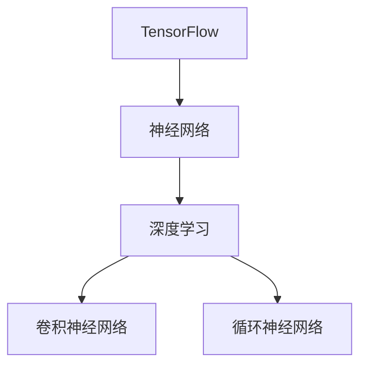

                 

# TensorFlow 入门：构建神经网络

> 关键词：TensorFlow, 神经网络, 深度学习, 卷积神经网络, 循环神经网络, 模型训练, 模型优化

## 1. 背景介绍

### 1.1 问题由来
随着人工智能技术的迅猛发展，深度学习在计算机视觉、自然语言处理、语音识别等领域取得了显著的成就。其中，神经网络作为深度学习的基本单元，其理论和实践得到了广泛的研究和应用。本文将详细探讨如何使用 TensorFlow 构建和训练神经网络，旨在帮助读者快速掌握这一关键技术。

### 1.2 问题核心关键点
构建神经网络的核心在于理解其基本结构和工作原理。神经网络由一系列的人工神经元组成，通过连接权重的调整，实现对复杂数据模式的抽象和表达。TensorFlow 提供了丰富的工具和库，支持从简单到复杂的神经网络构建和训练，满足不同任务的需求。

## 2. 核心概念与联系

### 2.1 核心概念概述

为了更好地理解 TensorFlow 中的神经网络构建，本节将介绍几个关键概念：

- TensorFlow：Google 开发的一款开源深度学习框架，支持多种编程语言和平台，具有灵活的计算图和高效的张量操作。
- 神经网络：由多个神经元组成的网络结构，通过前向传播和反向传播实现数据的映射和参数优化。
- 深度学习：利用多层神经网络进行特征提取和模式识别的技术，广泛应用于图像、语音、自然语言等任务。
- 卷积神经网络（CNN）：一种特殊类型的神经网络，用于处理具有网格结构的数据，如图像和视频。
- 循环神经网络（RNN）：一种能够处理序列数据的神经网络，如文本和音频。

这些核心概念之间的逻辑关系可以通过以下 Mermaid 流程图来展示：



这个流程图展示了 TensorFlow 框架中神经网络及相关技术的关系，帮助我们理解构建和训练神经网络的基本步骤和方法。

## 3. 核心算法原理 & 具体操作步骤

### 3.1 算法原理概述

TensorFlow 中的神经网络构建和训练主要涉及以下几个核心概念：

- Tensor：表示张量的多维数组，是 TensorFlow 中最基本的计算单位。
- 变量（Variable）：可更新的 Tensor，用于存储模型参数。
- 计算图（Computation Graph）：描述数据流向的图形结构，由一系列的节点和边组成。
- 前向传播（Forward Propagation）：将输入数据通过神经网络，得到输出结果的过程。
- 反向传播（Backward Propagation）：根据输出结果与真实标签之间的误差，反向调整神经网络中的权重和偏置，以优化模型性能。

TensorFlow 提供了高效的计算图机制，使得神经网络的构建和训练变得简单和高效。

### 3.2 算法步骤详解

构建和训练神经网络通常包括以下几个关键步骤：

**Step 1: 定义计算图**

首先，需要定义神经网络的计算图，包括输入、隐藏层和输出层的节点及其连接权重。

```python
import tensorflow as tf

# 定义输入占位符
input_placeholder = tf.placeholder(tf.float32, [None, input_size])

# 定义隐藏层权重和偏置
hidden_weights = tf.Variable(tf.random_normal([input_size, hidden_size]))
hidden_bias = tf.Variable(tf.zeros([hidden_size]))

# 定义输出权重和偏置
output_weights = tf.Variable(tf.random_normal([hidden_size, output_size]))
output_bias = tf.Variable(tf.zeros([output_size]))

# 定义模型结构
hidden_layer = tf.matmul(input_placeholder, hidden_weights) + hidden_bias
output_layer = tf.matmul(hidden_layer, output_weights) + output_bias

# 定义损失函数和优化器
output_placeholder = tf.placeholder(tf.float32, [None, output_size])
cross_entropy_loss = tf.reduce_mean(tf.nn.softmax_cross_entropy_with_logits(logits=output_layer, labels=output_placeholder))
train_step = tf.train.GradientDescentOptimizer(learning_rate).minimize(cross_entropy_loss)
```

**Step 2: 初始化变量**

在构建计算图后，需要初始化变量，以便开始训练。

```python
sess = tf.Session()
sess.run(tf.global_variables_initializer())
```

**Step 3: 训练模型**

在定义了计算图和初始化了变量后，可以开始进行模型的训练。

```python
for i in range(num_epochs):
    _, loss = sess.run([train_step, cross_entropy_loss], feed_dict={input_placeholder: train_data, output_placeholder: train_labels})
    if i % 100 == 0:
        print(f"Epoch {i+1}, loss: {loss:.4f}")
```

**Step 4: 评估模型**

在训练完成后，可以评估模型的性能。

```python
test_predictions = sess.run(output_layer, feed_dict={input_placeholder: test_data})
test_accuracy = tf.reduce_mean(tf.cast(tf.equal(tf.argmax(test_predictions, 1), tf.argmax(test_labels, 1)), tf.float32))
print(f"Test accuracy: {test_accuracy.eval():.4f}")
```

### 3.3 算法优缺点

TensorFlow 的神经网络构建和训练方法具有以下优点：

- 灵活性高：支持多种神经网络结构，如全连接神经网络、卷积神经网络、循环神经网络等。
- 高效计算：利用计算图机制，可以高效地进行参数更新和计算，支持分布式训练。
- 易于扩展：支持 GPU 和 TPU 加速，适用于大规模数据和复杂模型。

同时，TensorFlow 也有一些缺点：

- 学习曲线陡峭：需要掌握复杂的计算图和张量操作，初学者可能感觉困难。
- 代码冗长：构建和训练过程需要大量的代码编写，可能影响开发效率。
- 性能调优复杂：需要精细的超参数调整和模型优化，否则可能导致性能不佳。

尽管存在这些缺点，TensorFlow 仍然是深度学习领域最为流行的框架之一，其强大的功能和丰富的资源支持，使其成为构建和训练神经网络的首选工具。

### 3.4 算法应用领域

TensorFlow 中的神经网络构建和训练方法在多个领域得到了广泛应用：

- 计算机视觉：用于图像分类、目标检测、图像生成等任务。
- 自然语言处理：用于文本分类、机器翻译、情感分析等任务。
- 语音识别：用于语音识别、语音合成等任务。
- 游戏开发：用于游戏角色的智能决策、路径规划等任务。
- 医疗诊断：用于医学影像分析、疾病预测等任务。

## 4. 数学模型和公式 & 详细讲解

### 4.1 数学模型构建

神经网络的数学模型主要基于前向传播和反向传播的原理。以下以简单的全连接神经网络为例，详细讲解其数学模型构建过程。

**输入层：** 设输入层为 $x \in \mathbb{R}^{n \times 1}$，其中 $n$ 为输入数据的维度。

**隐藏层：** 设隐藏层为 $h \in \mathbb{R}^{m \times 1}$，其中 $m$ 为隐藏层的维度。隐藏层的计算公式为：

$$
h = \sigma(W_h x + b_h)
$$

其中，$W_h \in \mathbb{R}^{m \times n}$ 为权重矩阵，$b_h \in \mathbb{R}^{m \times 1}$ 为偏置向量，$\sigma$ 为激活函数。

**输出层：** 设输出层为 $y \in \mathbb{R}^{k \times 1}$，其中 $k$ 为输出数据的维度。输出层的计算公式为：

$$
y = \sigma(W_y h + b_y)
$$

其中，$W_y \in \mathbb{R}^{k \times m}$ 为权重矩阵，$b_y \in \mathbb{R}^{k \times 1}$ 为偏置向量，$\sigma$ 为激活函数。

**损失函数：** 常见的损失函数包括均方误差（MSE）、交叉熵（CE）等。以交叉熵为例，损失函数计算公式为：

$$
L = -\frac{1}{N} \sum_{i=1}^N \sum_{j=1}^k y_{ij} \log p_{ij}
$$

其中，$y_{ij}$ 为真实标签，$p_{ij}$ 为模型预测概率。

### 4.2 公式推导过程

以下以交叉熵损失函数为例，推导其梯度计算公式。

设损失函数为 $L$，其对参数 $w$ 的梯度为 $\frac{\partial L}{\partial w}$。根据链式法则，可以得到：

$$
\frac{\partial L}{\partial w} = -\frac{1}{N} \sum_{i=1}^N \sum_{j=1}^k \frac{\partial L}{\partial p_{ij}} \frac{\partial p_{ij}}{\partial w}
$$

其中，$\frac{\partial p_{ij}}{\partial w}$ 为输出层的偏导数。根据输出层的计算公式，有：

$$
\frac{\partial p_{ij}}{\partial w} = \frac{\partial \sigma(W_y h + b_y)}{\partial w} \frac{\partial \sigma(W_h x + b_h)}{\partial h} \frac{\partial h}{\partial w}
$$

其中，$\frac{\partial \sigma(W_y h + b_y)}{\partial w}$ 为输出层的激活函数导数，$\frac{\partial \sigma(W_h x + b_h)}{\partial h}$ 为隐藏层的激活函数导数，$\frac{\partial h}{\partial w}$ 为隐藏层的偏导数。

### 4.3 案例分析与讲解

以图像分类任务为例，通过卷积神经网络（CNN）来分析其实现过程。

**卷积层：** CNN 中的卷积层通过滑动卷积核进行特征提取，计算公式为：

$$
c_{i,j}^{l+1} = f_{l+1}(\sum_{m=0}^{f_l-1} \sum_{n=0}^{f_l-1} W_{l+1, m, n} c_{i-m, j-n}^l + b_{l+1})
$$

其中，$c_{i,j}^l$ 为卷积层 $l$ 的输出特征图，$W_{l+1, m, n}$ 为卷积核权重，$f_l$ 为卷积核大小，$b_{l+1}$ 为偏置项，$f_{l+1}$ 为激活函数。

**池化层：** 池化层通过对特征图进行降维和特征提取，常见的方法包括最大池化和平均池化。最大池化的计算公式为：

$$
p_{i,j} = \max_{m,n} c_{i+m, j+n}^l
$$

其中，$p_{i,j}$ 为池化层的输出特征图，$c_{i+m, j+n}^l$ 为卷积层 $l$ 的特征图。

**全连接层：** 全连接层将卷积层和池化层的特征图进行展平，再通过线性变换和激活函数进行分类。计算公式为：

$$
y = \sigma(W y + b)
$$

其中，$y$ 为输出向量，$W$ 为权重矩阵，$b$ 为偏置向量，$\sigma$ 为激活函数。

## 5. 项目实践：代码实例和详细解释说明

### 5.1 开发环境搭建

在使用 TensorFlow 进行神经网络开发前，需要先搭建开发环境。以下是使用 Python 和 Anaconda 进行环境配置的流程：

1. 安装 Anaconda：从官网下载并安装 Anaconda，用于创建独立的 Python 环境。

2. 创建并激活虚拟环境：
```bash
conda create -n tf-env python=3.8 
conda activate tf-env
```

3. 安装 TensorFlow：根据操作系统和 GPU 支持，从官网获取对应的安装命令。例如：
```bash
pip install tensorflow==2.7
```

4. 安装必要的工具包：
```bash
pip install numpy pandas scikit-learn matplotlib
```

完成上述步骤后，即可在 `tf-env` 环境中开始 TensorFlow 开发。

### 5.2 源代码详细实现

接下来，以手写数字识别任务为例，展示如何使用 TensorFlow 构建和训练神经网络。

首先，准备 MNIST 数据集：

```python
from tensorflow.keras.datasets import mnist
from tensorflow.keras.utils import to_categorical

(train_images, train_labels), (test_images, test_labels) = mnist.load_data()
train_images = train_images.reshape((-1, 28, 28, 1)).astype('float32') / 255.0
test_images = test_images.reshape((-1, 28, 28, 1)).astype('float32') / 255.0
train_labels = to_categorical(train_labels, 10)
test_labels = to_categorical(test_labels, 10)
```

然后，构建卷积神经网络模型：

```python
from tensorflow.keras import layers, models

model = models.Sequential([
    layers.Conv2D(32, (3, 3), activation='relu', input_shape=(28, 28, 1)),
    layers.MaxPooling2D((2, 2)),
    layers.Conv2D(64, (3, 3), activation='relu'),
    layers.MaxPooling2D((2, 2)),
    layers.Flatten(),
    layers.Dense(64, activation='relu'),
    layers.Dense(10, activation='softmax')
])
```

接着，定义优化器和损失函数：

```python
model.compile(optimizer='adam', loss='categorical_crossentropy', metrics=['accuracy'])
```

最后，进行模型训练和评估：

```python
model.fit(train_images, train_labels, epochs=10, batch_size=32, validation_data=(test_images, test_labels))
test_loss, test_acc = model.evaluate(test_images, test_labels)
print(f'Test accuracy: {test_acc:.4f}')
```

以上就是使用 TensorFlow 进行手写数字识别任务神经网络构建和训练的完整代码实现。可以看到，TensorFlow 提供了丰富的 API 和工具，使得神经网络的构建和训练变得非常简单和高效。

### 5.3 代码解读与分析

让我们再详细解读一下关键代码的实现细节：

**MNIST 数据集加载：**
- 使用 Keras 的数据集加载函数，加载 MNIST 数据集。
- 对图像数据进行展平，并归一化到 [0,1] 范围内。
- 对标签进行 one-hot 编码，转换为多分类任务。

**模型构建：**
- 使用 Sequential 模型，依次添加卷积层、池化层、全连接层。
- 卷积层使用 ReLU 激活函数，池化层使用 MaxPooling2D 函数。
- 全连接层使用 ReLU 激活函数，输出层使用 softmax 激活函数。

**优化器和损失函数：**
- 使用 Adam 优化器，设置交叉熵损失函数。
- 定义评估指标为准确率。

**模型训练和评估：**
- 使用 fit 方法进行模型训练，设置训练轮数和批次大小。
- 使用 evaluate 方法在测试集上评估模型性能。

可以看到，TensorFlow 的 Keras API 提供了简单易用的接口，使得神经网络的构建和训练变得非常简单。开发者可以专注于模型的设计和优化，而不必过多关注底层实现细节。

## 6. 实际应用场景

### 6.1 计算机视觉

卷积神经网络（CNN）在计算机视觉领域具有广泛应用，如图像分类、目标检测、图像生成等任务。

- **图像分类：** 使用卷积层提取图像特征，通过全连接层进行分类。常见的模型包括 AlexNet、VGG、ResNet 等。
- **目标检测：** 使用 R-CNN、Fast R-CNN、Faster R-CNN 等模型进行目标定位和分类。
- **图像生成：** 使用 Generative Adversarial Networks (GANs) 进行图像生成和修复。

### 6.2 自然语言处理

循环神经网络（RNN）和长短时记忆网络（LSTM）在自然语言处理领域具有广泛应用，如文本分类、机器翻译、情感分析等任务。

- **文本分类：** 使用 RNN 或 LSTM 对文本进行建模，通过全连接层进行分类。
- **机器翻译：** 使用编码器-解码器框架进行序列到序列（seq2seq）的建模。
- **情感分析：** 使用 RNN 或 LSTM 对文本进行情感分类。

### 6.3 语音识别

深度学习在语音识别领域也取得了显著成果，如自动语音识别（ASR）、语音合成（TTS）等任务。

- **自动语音识别：** 使用卷积神经网络（CNN）或循环神经网络（RNN）进行语音特征提取和分类。
- **语音合成：** 使用生成对抗网络（GANs）进行语音生成和合成。

## 7. 工具和资源推荐

### 7.1 学习资源推荐

为了帮助开发者系统掌握 TensorFlow 的神经网络构建和训练，这里推荐一些优质的学习资源：

1. TensorFlow 官方文档：提供了完整的 API 文档和教程，覆盖了从基础到高级的各种内容。
2. Deep Learning Specialization（深度学习专项课程）：由 Andrew Ng 教授主讲，涵盖了深度学习的基本原理和 TensorFlow 的应用实践。
3. TensorFlow 实战指南：一本详细介绍 TensorFlow 的实战指南，涵盖模型构建、训练、优化等环节。
4. TensorFlow 入门与实战：一本适合初学者的 TensorFlow 入门书籍，讲解了 TensorFlow 的基本概念和实战案例。
5. TensorFlow 视频教程：包括官方 YouTube 频道和其他平台上的 TensorFlow 视频教程，覆盖了 TensorFlow 的各个方面。

通过对这些资源的学习实践，相信你一定能够快速掌握 TensorFlow 的神经网络构建和训练方法，并应用于实际问题中。

### 7.2 开发工具推荐

高效的开发离不开优秀的工具支持。以下是几款用于 TensorFlow 神经网络开发和训练的常用工具：

1. Jupyter Notebook：交互式的 Python 编程环境，支持代码编写、执行和结果展示。
2. TensorBoard：TensorFlow 的可视化工具，可以实时监测模型训练状态，提供丰富的图表和指标。
3. Keras：基于 TensorFlow 的高级 API，提供了简单易用的接口，方便模型构建和训练。
4. PyCharm：流行的 Python IDE，支持 TensorFlow 和其他深度学习框架的开发和调试。
5. Anaconda：Python 的发行管理工具，方便创建和管理虚拟环境，支持 Python 及其依赖库的安装和更新。

合理利用这些工具，可以显著提升 TensorFlow 神经网络的开发效率，加快创新迭代的步伐。

### 7.3 相关论文推荐

TensorFlow 的神经网络构建和训练方法得益于学界的持续研究。以下是几篇奠基性的相关论文，推荐阅读：

1. AlexNet: One Million Training Examples for Image Recognition: 介绍 AlexNet 模型的设计及其在 ImageNet 数据集上的应用。
2. Google's War Against Noise in Deep Learning: 介绍 GANs 在图像生成和图像修复中的应用。
3. Attention is All You Need: 介绍 Transformer 模型及其在自然语言处理中的应用。
4. Hierarchical Attention Networks for Document Classification: 介绍使用 RNN 和注意力机制进行文本分类的模型。
5. Neural Machine Translation by Jointly Learning to Align and Translate: 介绍使用 seq2seq 模型进行机器翻译。

这些论文代表了大规模神经网络模型的发展和应用，为 TensorFlow 的神经网络构建和训练提供了理论和实践的基础。

## 8. 总结：未来发展趋势与挑战

### 8.1 总结

本文对 TensorFlow 中的神经网络构建和训练进行了全面系统的介绍。首先阐述了神经网络的基本原理和 TensorFlow 的基本概念，明确了神经网络在深度学习中的应用场景。其次，从原理到实践，详细讲解了神经网络的构建和训练过程，给出了 TensorFlow 的代码实例。同时，本文还广泛探讨了神经网络在计算机视觉、自然语言处理、语音识别等领域的实际应用，展示了其广阔的应用前景。最后，本文精选了 TensorFlow 的学习资源、开发工具和相关论文，力求为读者提供全方位的技术指引。

通过本文的系统梳理，可以看到，TensorFlow 的神经网络构建和训练方法在深度学习领域具有广泛的应用，是实现复杂人工智能任务的重要工具。未来，伴随深度学习技术的不断发展，神经网络在更多领域的落地应用将带来巨大的创新和变革。

### 8.2 未来发展趋势

展望未来，TensorFlow 的神经网络构建和训练技术将呈现以下几个发展趋势：

1. 自动化模型构建：随着模型结构的不断复杂化，自动模型设计（AutoML）和自动化模型构建（AutoML）技术将得到更广泛的应用，使得模型构建变得更加高效和智能化。
2. 分布式训练：随着数据量的不断增大，分布式训练技术将得到更深入的发展，支持更大规模的数据集和更复杂的模型训练。
3. 混合精度训练：通过混合精度训练（Mixed-Precision Training）技术，可以显著提升模型训练速度和效率，满足大规模数据和复杂模型的训练需求。
4. 预训练模型：基于大规模数据和计算资源的预训练模型将得到更广泛的应用，提升模型性能和泛化能力。
5. 超参数优化：基于自动化和自动化的超参数优化技术将得到更深入的发展，帮助开发者快速找到最优超参数组合。
6. 端到端训练：将模型构建、训练、评估、部署等环节整合在一起，实现端到端（E2E）的自动模型构建和训练。

以上趋势凸显了 TensorFlow 神经网络构建和训练技术的不断进步，将使得深度学习模型的构建和训练变得更加高效和智能化。

### 8.3 面临的挑战

尽管 TensorFlow 的神经网络构建和训练技术已经取得了显著成就，但在迈向更加智能化、普适化应用的过程中，仍面临诸多挑战：

1. 超参数调优困难：神经网络的超参数设置对模型性能影响巨大，但如何进行有效的超参数调优仍然是一个难题。
2. 计算资源消耗大：大规模神经网络模型的训练和推理需要大量的计算资源，如何提高计算效率和资源利用率仍然是一个挑战。
3. 模型泛化能力有限：神经网络模型的泛化能力受数据质量和模型结构的影响，如何在不同领域和数据集上取得更好的泛化效果仍然是一个挑战。
4. 模型可解释性不足：神经网络模型的决策过程复杂，如何提供可解释性和可解释性强的输出仍然是一个挑战。
5. 模型鲁棒性不足：神经网络模型在面对对抗样本和噪声数据时，鲁棒性仍然是一个问题。

尽管存在这些挑战，TensorFlow 仍然是深度学习领域最为流行的框架之一，其强大的功能和丰富的资源支持，使其成为构建和训练神经网络的首选工具。

### 8.4 研究展望

面向未来，TensorFlow 的神经网络构建和训练技术需要在以下几个方面寻求新的突破：

1. 探索自监督学习：自监督学习（Self-Supervised Learning）方法可以大幅降低标注数据的需求，提升模型性能和泛化能力。
2. 研究模型压缩和优化：通过模型压缩（Model Compression）和优化（Model Optimization）技术，可以显著提高模型计算效率和资源利用率。
3. 引入先验知识：将符号化的先验知识与神经网络模型进行融合，提升模型的推理能力和泛化能力。
4. 加强可解释性和鲁棒性：通过可解释性技术（Explainability）和鲁棒性技术（Robustness）的研究，增强神经网络模型的可解释性和鲁棒性。
5. 探索新算法和模型架构：研究新的深度学习算法和模型架构，如 Transformer、GNNs 等，提升神经网络模型的性能和泛化能力。

这些研究方向的探索，必将引领 TensorFlow 神经网络构建和训练技术迈向更高的台阶，为构建安全、可靠、可解释、可控的智能系统铺平道路。面向未来，TensorFlow 神经网络构建和训练技术还需要与其他人工智能技术进行更深入的融合，如知识表示、因果推理、强化学习等，多路径协同发力，共同推动深度学习技术的发展和应用。

## 9. 附录：常见问题与解答

**Q1: TensorFlow 中的卷积层和池化层分别有什么作用？**

A: 卷积层主要用于提取输入数据的特征，通过滑动卷积核进行特征的局部感知和组合，产生更高级别的特征表示。池化层则用于对卷积层输出的特征图进行降维和特征提取，减少计算量并保留重要特征。

**Q2: 什么是 TensorFlow 中的反向传播算法？**

A: 反向传播算法（Backpropagation）是用于计算神经网络模型参数梯度的算法，通过链式法则将损失函数对输出层的误差传播到输入层，更新模型参数。反向传播算法是训练神经网络模型的核心算法，通过不断迭代优化模型参数，使得模型能够更好地拟合训练数据。

**Q3: 在 TensorFlow 中如何进行数据增强？**

A: 数据增强（Data Augmentation）是用于提升神经网络模型泛化能力的技术，通过随机变换训练数据，扩充数据集并提高模型的鲁棒性。在 TensorFlow 中，可以使用 Keras 中的数据增强函数，如 `ImageDataGenerator` 等，对图像数据进行随机裁剪、翻转、旋转等操作，生成更多的训练数据。

**Q4: 在 TensorFlow 中如何进行模型的保存和加载？**

A: 在 TensorFlow 中，可以使用 `tf.train.Saver` 类进行模型的保存和加载。具体步骤如下：
1. 定义模型结构，训练模型并保存模型参数。
2. 创建 `Saver` 对象，并调用 `save` 方法保存模型。
3. 在后续训练中，使用 `Saver` 对象调用 `restore` 方法加载模型参数。

通过这些操作，可以方便地保存和加载模型，实现模型的复用和微调。

**Q5: 在 TensorFlow 中如何进行模型的评估和验证？**

A: 在 TensorFlow 中，可以使用 `tf.keras.metrics` 模块中的函数进行模型的评估和验证。具体步骤如下：
1. 定义模型结构，并编译模型。
2. 在训练过程中，使用 `model.evaluate` 方法在验证集上评估模型性能。
3. 在测试过程中，使用 `model.evaluate` 方法在测试集上评估模型性能。

通过这些操作，可以方便地进行模型的评估和验证，及时发现模型的问题并进行优化。

---

作者：禅与计算机程序设计艺术 / Zen and the Art of Computer Programming

