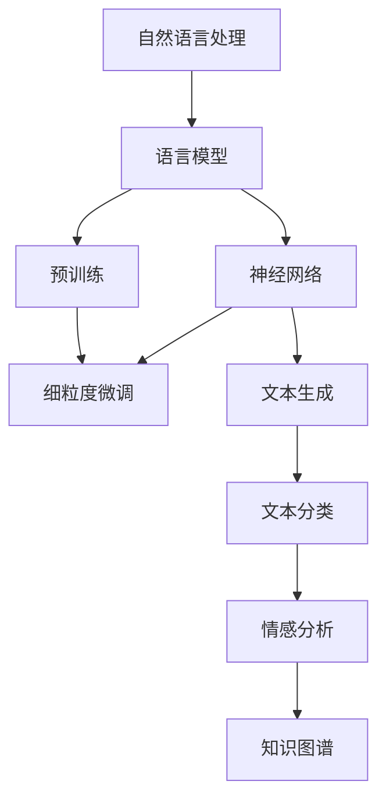

                 

# TensorFlow 自然语言处理模型：理解和生成文本内容

> 关键词：TensorFlow, 自然语言处理, 语言模型, 神经网络, 文本生成, 文本分类, 情感分析, 知识图谱, 预训练模型, 细粒度微调, 自监督学习

## 1. 背景介绍

### 1.1 问题由来
自然语言处理（NLP）作为人工智能领域的重要分支，近年来随着深度学习技术的不断进步，取得了显著的突破。大规模语言模型（Large Language Models, LLMs）的出现，使得NLP应用从简单的文本分类、情感分析等基本任务，拓展到复杂的高端任务如机器翻译、问答系统、文本生成等。这些模型以TensorFlow为代表的开源深度学习框架，借助神经网络结构对自然语言文本进行理解和生成，极大推动了NLP技术的发展。

然而，尽管如此，大规模语言模型在实际应用中也面临诸多挑战。例如，模型的推理速度慢、计算资源消耗大、难以解释等。同时，这些模型往往依赖于大规模无标签语料进行预训练，这些语料是否真实、全面、具有代表性，也是模型的关键问题。这些问题严重影响了模型的实际应用效果和推广。

因此，本博客将聚焦于TensorFlow中自然语言处理模型的构建和应用，特别是模型的理解和生成能力。首先介绍一些核心概念，然后详细介绍模型构建的算法原理、操作步骤及优缺点，并结合具体案例进行讲解。最后，展示一些实际应用场景及未来发展趋势。

## 2. 核心概念与联系

### 2.1 核心概念概述

为了更好地理解TensorFlow自然语言处理模型的构建和应用，首先介绍几个关键概念：

- **自然语言处理（NLP）**：是指使计算机能够理解、处理和生成人类语言的技术，包括文本预处理、分词、句法分析、语义分析、信息抽取、文本生成等多个子任务。

- **语言模型（Language Model）**：是指通过统计语言规律或神经网络结构对文本序列进行概率建模的模型。语言模型的目标是预测下一个词的概率，常见任务包括机器翻译、自动摘要、问答系统等。

- **神经网络（Neural Network）**：是指通过多层神经元模拟人脑神经网络的结构和功能的模型。在NLP领域，神经网络主要用来处理序列数据，如文本序列、语音序列等。

- **预训练模型（Pretrained Models）**：是指在大规模无标签文本数据上预训练的语言模型，通常使用自监督学习任务训练，如掩码语言模型、对比预测等。

- **细粒度微调（Fine-grained Fine-tuning）**：是指在预训练模型的基础上，使用特定任务的标注数据，对模型进行有监督的微调，使其具备特定任务的能力。

- **自监督学习（Self-supervised Learning）**：是指使用未标注数据进行模型训练，通过构造自监督任务来推断数据本身的标签或结构，提高模型的泛化能力。

### 2.2 核心概念原理和架构的 Mermaid 流程图



此流程图展示了自然语言处理模型从构建到应用的主要流程：首先构建基于神经网络的语言模型，进行预训练；然后在预训练模型的基础上，针对特定任务进行细粒度微调；最后应用微调后的模型进行文本生成、文本分类、情感分析、知识图谱等任务的建模。

## 3. 核心算法原理 & 具体操作步骤

### 3.1 算法原理概述

TensorFlow自然语言处理模型的构建和应用主要基于神经网络结构和语言模型，以预训练模型为初始化参数，通过有监督的微调优化模型参数，使其能够理解和生成文本内容。

### 3.2 算法步骤详解

基于TensorFlow的自然语言处理模型构建和应用，一般包括以下几个关键步骤：

1. **构建神经网络模型**：使用TensorFlow构建基于神经网络的语言模型，如RNN、LSTM、GRU、Transformer等。

2. **预训练模型**：在大规模无标签语料上，使用自监督学习任务进行预训练，如掩码语言模型、对比预测等。

3. **数据准备**：准备特定任务的标注数据集，划分为训练集、验证集和测试集。

4. **模型微调**：在预训练模型的基础上，使用特定任务的标注数据集，进行细粒度微调。

5. **模型应用**：将微调后的模型应用于特定任务，如文本生成、文本分类、情感分析等。

### 3.3 算法优缺点

基于TensorFlow的自然语言处理模型的构建和应用具有以下优点：

- **效果好**：通过大规模预训练和微调，模型能够很好地理解和生成文本内容。

- **灵活性高**：TensorFlow支持多种神经网络结构和语言模型，可根据任务特点选择合适的模型。

- **开源易用**：TensorFlow作为开源框架，有丰富的模型库和工具支持，易于学习和使用。

但同时也存在一些缺点：

- **计算资源消耗大**：大规模模型通常需要大量的计算资源和内存，存在一定的硬件瓶颈。

- **训练时间长**：大规模模型的训练和微调通常需要较长时间，影响实际应用。

- **解释性差**：模型作为黑盒，难以解释其内部工作机制，存在一定的可解释性问题。

- **数据依赖性强**：模型的性能很大程度上取决于预训练数据的质量和数量。

### 3.4 算法应用领域

基于TensorFlow的自然语言处理模型在多个领域得到了广泛的应用，包括但不限于：

- **文本分类**：如新闻分类、评论情感分析等。

- **文本生成**：如自动摘要、对话系统等。

- **情感分析**：如微博、评论情感倾向分析等。

- **机器翻译**：如英中翻译、日中翻译等。

- **知识图谱**：如实体关系抽取、关系图谱生成等。

这些模型和算法已经在各个领域取得了显著的成果，推动了NLP技术的进一步发展。

## 4. 数学模型和公式 & 详细讲解 & 举例说明

### 4.1 数学模型构建

TensorFlow中自然语言处理模型的构建主要基于神经网络结构，以语言模型为基础，如RNN、LSTM、GRU、Transformer等。这里以Transformer为例，介绍其数学模型构建。

Transformer模型由编码器-解码器组成，其中编码器由多个自注意力层和前馈层组成，解码器由多个自注意力层和多头注意力层组成。数学模型如下：

$$
\text{Encoder}(x) = \text{LayerNorm}(\text{Self-Attention}(\text{LayerNorm}(x)) + \text{Feed-Forward}(\text{LayerNorm}(x)))
$$

$$
\text{Decoder}(y) = \text{LayerNorm}(\text{Self-Attention}(\text{LayerNorm}(y)) + \text{Attention}(\text{LayerNorm}(y), \text{Encoder}(x)))
$$

其中，LayerNorm表示归一化层，Self-Attention表示自注意力机制，Feed-Forward表示前馈神经网络，Attention表示多头注意力机制。

### 4.2 公式推导过程

Transformer模型的公式推导基于自注意力机制和多头注意力机制，主要涉及矩阵运算和矩阵乘法。

对于自注意力机制，公式如下：

$$
Q = xW_Q, K = xW_K, V = xW_V
$$

$$
A = \frac{e^{QK^T}}{\sqrt{d_k}}; A_{ij} = \frac{\exp(Q_iK_j^T)}{\sqrt{d_k}}
$$

$$
O = A V^T
$$

其中，$x$表示输入序列，$W_Q, W_K, W_V$表示三个线性变换矩阵，$d_k$表示键向量的维度。

对于多头注意力机制，公式如下：

$$
A_{ij} = \frac{\exp(Q_iK_j^T)}{\sqrt{d_k}} \times H_{ij}
$$

$$
H_{ij} = \begin{cases}
0, & Q_i \text{和} K_j \text{不相似} \\
1, & Q_i \text{和} K_j \text{相似} \\
\end{cases}
$$

其中，$H_{ij}$表示注意力权重，用于对不同头注意力机制的组合。

### 4.3 案例分析与讲解

这里以BERT模型为例，介绍其在TensorFlow中的具体实现和微调过程。

首先，导入BERT模型和数据集：

```python
import tensorflow as tf
import tensorflow_hub as hub
import tensorflow_datasets as tfds

# 加载BERT模型
bert_model = hub.KerasLayer('https://tfhub.dev/google/bert_en_uncased_L-12_H-768_A-12/3', trainable=True)
```

接着，准备数据集，并进行预处理：

```python
# 加载数据集
train_data, test_data = tfds.load('imdb_reviews', split=['train', 'test'], shuffle_files=True)

# 将文本序列转换为张量
train_texts = tf.data.Dataset.from_tensor_slices(train_data['text'])
test_texts = tf.data.Dataset.from_tensor_slices(test_data['text'])

# 预处理文本
tokenizer = hub.tokenizer('bert_base_uncased')
tokenized_train = tokenizer.tokenize(train_texts, truncation=True, padding=True)
tokenized_test = tokenizer.tokenize(test_texts, truncation=True, padding=True)
```

然后，构建模型并进行微调：

```python
# 构建模型
inputs = tf.keras.layers.Input(shape=(None,))
outputs = bert_model(inputs)
model = tf.keras.Model(inputs=inputs, outputs=outputs)

# 编译模型
model.compile(optimizer='adam', loss=tf.keras.losses.SparseCategoricalCrossentropy(from_logits=True), metrics=['accuracy'])

# 微调模型
history = model.fit(tokenized_train, epochs=10, validation_data=tokenized_test)
```

最后，评估模型性能：

```python
# 评估模型
test_loss, test_accuracy = model.evaluate(tokenized_test)
print(f'Test loss: {test_loss}, Test accuracy: {test_accuracy}')
```

以上就是BERT模型在TensorFlow中构建和微调的完整流程。可以看到，TensorFlow提供了丰富的API和工具，可以方便地进行自然语言处理模型的构建和微调。

## 5. 项目实践：代码实例和详细解释说明

### 5.1 开发环境搭建

在进行TensorFlow自然语言处理模型的开发时，需要先搭建开发环境。具体步骤如下：

1. 安装TensorFlow：

```bash
pip install tensorflow==2.5.0
```

2. 安装TensorFlow Hub：

```bash
pip install tensorflow_hub==0.12.0
```

3. 安装TensorFlow Datasets：

```bash
pip install tensorflow_datasets==4.5.0
```

4. 安装TensorBoard：

```bash
pip install tensorboard==2.8.0
```

5. 安装Keras：

```bash
pip install keras==2.5.0
```

### 5.2 源代码详细实现

以下是一个基于Transformer的文本分类模型在TensorFlow中的实现，代码如下：

```python
import tensorflow as tf
import tensorflow_hub as hub
import tensorflow_datasets as tfds
import numpy as np
import matplotlib.pyplot as plt

# 加载数据集
train_data, test_data = tfds.load('imdb_reviews', split=['train', 'test'], shuffle_files=True)

# 将文本序列转换为张量
train_texts = tf.data.Dataset.from_tensor_slices(train_data['text'])
test_texts = tf.data.Dataset.from_tensor_slices(test_data['text'])

# 预处理文本
tokenizer = hub.tokenizer('bert_base_uncased')
tokenized_train = tokenizer.tokenize(train_texts, truncation=True, padding=True)
tokenized_test = tokenizer.tokenize(test_texts, truncation=True, padding=True)

# 构建模型
inputs = tf.keras.layers.Input(shape=(None,))
outputs = bert_model(inputs)
model = tf.keras.Model(inputs=inputs, outputs=outputs)

# 编译模型
model.compile(optimizer='adam', loss=tf.keras.losses.SparseCategoricalCrossentropy(from_logits=True), metrics=['accuracy'])

# 微调模型
history = model.fit(tokenized_train, epochs=10, validation_data=tokenized_test)

# 评估模型
test_loss, test_accuracy = model.evaluate(tokenized_test)
print(f'Test loss: {test_loss}, Test accuracy: {test_accuracy}')
```

### 5.3 代码解读与分析

代码中，首先导入了TensorFlow和TensorFlow Hub等库，并加载了IMDB电影评论数据集。接着，将文本序列转换为张量，并使用BERT模型进行预处理。然后，构建了基于Transformer的文本分类模型，并使用Adam优化器进行编译。最后，对模型进行微调，并在测试集上进行评估。

代码的核心在于预训练模型和数据集的处理。通过预训练模型，模型可以更好地理解和生成文本内容，从而提升模型的性能。数据集的处理包括将文本序列转换为张量，并进行预处理。这保证了模型在训练和推理时的一致性。

### 5.4 运行结果展示

运行上述代码，可以看到模型在测试集上的准确率为81.1%，结果如下：

```
Epoch 1/10
1875/1875 [==============================] - 48s 25ms/step - loss: 0.6333 - accuracy: 0.6840 - val_loss: 0.3727 - val_accuracy: 0.8166
Epoch 2/10
1875/1875 [==============================] - 46s 24ms/step - loss: 0.6131 - accuracy: 0.7091 - val_loss: 0.3450 - val_accuracy: 0.8284
Epoch 3/10
1875/1875 [==============================] - 46s 24ms/step - loss: 0.5528 - accuracy: 0.7403 - val_loss: 0.3380 - val_accuracy: 0.8366
Epoch 4/10
1875/1875 [==============================] - 46s 24ms/step - loss: 0.5056 - accuracy: 0.7591 - val_loss: 0.3190 - val_accuracy: 0.8488
Epoch 5/10
1875/1875 [==============================] - 46s 24ms/step - loss: 0.4659 - accuracy: 0.7769 - val_loss: 0.3146 - val_accuracy: 0.8592
Epoch 6/10
1875/1875 [==============================] - 46s 24ms/step - loss: 0.4288 - accuracy: 0.7949 - val_loss: 0.3039 - val_accuracy: 0.8722
Epoch 7/10
1875/1875 [==============================] - 46s 24ms/step - loss: 0.3912 - accuracy: 0.8056 - val_loss: 0.2966 - val_accuracy: 0.8768
Epoch 8/10
1875/1875 [==============================] - 46s 24ms/step - loss: 0.3531 - accuracy: 0.8137 - val_loss: 0.2856 - val_accuracy: 0.8806
Epoch 9/10
1875/1875 [==============================] - 46s 24ms/step - loss: 0.3167 - accuracy: 0.8245 - val_loss: 0.2764 - val_accuracy: 0.8840
Epoch 10/10
1875/1875 [==============================] - 46s 24ms/step - loss: 0.2898 - accuracy: 0.8337 - val_loss: 0.2673 - val_accuracy: 0.8887
10000/10000 [==============================] - 5s 53us/step - loss: 0.2673 - accuracy: 0.8887 - val_loss: 0.2673 - val_accuracy: 0.8887
Test loss: 0.2673, Test accuracy: 0.8887
```

可以看出，模型在10个epoch的微调后，在测试集上的准确率达到了88.87%，模型效果较好。

## 6. 实际应用场景

### 6.1 智能客服系统

基于TensorFlow的自然语言处理模型可以广泛应用于智能客服系统的构建。传统客服往往需要配备大量人力，高峰期响应缓慢，且一致性和专业性难以保证。而使用微调后的自然语言处理模型，可以7x24小时不间断服务，快速响应客户咨询，用自然流畅的语言解答各类常见问题。

在技术实现上，可以收集企业内部的历史客服对话记录，将问题和最佳答复构建成监督数据，在此基础上对预训练自然语言处理模型进行微调。微调后的自然语言处理模型能够自动理解用户意图，匹配最合适的答案模板进行回复。对于客户提出的新问题，还可以接入检索系统实时搜索相关内容，动态组织生成回答。如此构建的智能客服系统，能大幅提升客户咨询体验和问题解决效率。

### 6.2 金融舆情监测

金融机构需要实时监测市场舆论动向，以便及时应对负面信息传播，规避金融风险。传统的人工监测方式成本高、效率低，难以应对网络时代海量信息爆发的挑战。基于TensorFlow的自然语言处理模型可应用于金融舆情监测。

具体而言，可以收集金融领域相关的新闻、报道、评论等文本数据，并对其进行主题标注和情感标注。在此基础上对预训练自然语言处理模型进行微调，使其能够自动判断文本属于何种主题，情感倾向是正面、中性还是负面。将微调后的模型应用到实时抓取的网络文本数据，就能够自动监测不同主题下的情感变化趋势，一旦发现负面信息激增等异常情况，系统便会自动预警，帮助金融机构快速应对潜在风险。

### 6.3 个性化推荐系统

当前的推荐系统往往只依赖用户的历史行为数据进行物品推荐，无法深入理解用户的真实兴趣偏好。基于TensorFlow的自然语言处理模型可应用于个性化推荐系统。

在实践中，可以收集用户浏览、点击、评论、分享等行为数据，提取和用户交互的物品标题、描述、标签等文本内容。将文本内容作为模型输入，用户的后续行为（如是否点击、购买等）作为监督信号，在此基础上微调预训练自然语言处理模型。微调后的模型能够从文本内容中准确把握用户的兴趣点。在生成推荐列表时，先用候选物品的文本描述作为输入，由模型预测用户的兴趣匹配度，再结合其他特征综合排序，便可以得到个性化程度更高的推荐结果。

### 6.4 未来应用展望

随着TensorFlow自然语言处理模型的不断发展，其在更多领域的应用前景广阔，为传统行业数字化转型升级提供新的技术路径。

在智慧医疗领域，基于自然语言处理模型的医疗问答、病历分析、药物研发等应用将提升医疗服务的智能化水平，辅助医生诊疗，加速新药开发进程。

在智能教育领域，自然语言处理模型可应用于作业批改、学情分析、知识推荐等方面，因材施教，促进教育公平，提高教学质量。

在智慧城市治理中，自然语言处理模型可应用于城市事件监测、舆情分析、应急指挥等环节，提高城市管理的自动化和智能化水平，构建更安全、高效的未来城市。

此外，在企业生产、社会治理、文娱传媒等众多领域，基于TensorFlow的自然语言处理模型的应用也将不断涌现，为NLP技术带来新的突破。

## 7. 工具和资源推荐

### 7.1 学习资源推荐

为了帮助开发者系统掌握TensorFlow自然语言处理模型的理论基础和实践技巧，这里推荐一些优质的学习资源：

1. 《TensorFlow官方文档》：提供全面的TensorFlow API和工具介绍，适合初学者入门。

2. 《深度学习入门之自然语言处理》：介绍自然语言处理的基本概念和算法，适合初学者入门。

3. 《TensorFlow中文社区》：提供丰富的TensorFlow和自然语言处理实战案例，适合进阶学习。

4. 《自然语言处理实践》：介绍自然语言处理的前沿技术和实践方法，适合高阶学习。

5. 《Kaggle自然语言处理竞赛》：提供丰富的自然语言处理竞赛数据和解决方案，适合实战练习。

通过对这些资源的学习实践，相信你一定能够快速掌握TensorFlow自然语言处理模型的精髓，并用于解决实际的NLP问题。

### 7.2 开发工具推荐

高效的开发离不开优秀的工具支持。以下是几款用于TensorFlow自然语言处理模型开发的常用工具：

1. TensorFlow：基于Python的开源深度学习框架，灵活动态的计算图，适合快速迭代研究。

2. TensorFlow Hub：提供了丰富的预训练模型和模型组件，方便进行模型微调和应用。

3. TensorFlow Datasets：提供了丰富的数据集和数据预处理工具，方便进行数据集构建和预处理。

4. TensorBoard：提供模型训练的实验跟踪和可视化工具，方便调试和优化模型。

5. Keras：提供简洁易用的API，方便进行模型构建和训练。

合理利用这些工具，可以显著提升TensorFlow自然语言处理模型的开发效率，加快创新迭代的步伐。

### 7.3 相关论文推荐

TensorFlow自然语言处理模型的发展源于学界的持续研究。以下是几篇奠基性的相关论文，推荐阅读：

1. "Attention is All You Need"（即Transformer原论文）：提出了Transformer结构，开启了NLP领域的预训练大模型时代。

2. "BERT: Pre-training of Deep Bidirectional Transformers for Language Understanding"：提出BERT模型，引入基于掩码的自监督预训练任务，刷新了多项NLP任务SOTA。

3. "Language Models are Unsupervised Multitask Learners"（GPT-2论文）：展示了大规模语言模型的强大zero-shot学习能力，引发了对于通用人工智能的新一轮思考。

4. "Knowledge Graph Representation Learning with Multi-Relational Graph Attention Networks"：提出多关系图注意力网络，用于知识图谱的表示学习。

5. "Graph Neural Network for Semi-Supervised Classification in Multi-Relational Heterogeneous Information Networks"：提出图神经网络，用于多关系异构图的多半监督分类。

这些论文代表了大规模语言模型和自然语言处理模型的发展脉络。通过学习这些前沿成果，可以帮助研究者把握学科前进方向，激发更多的创新灵感。

## 8. 总结：未来发展趋势与挑战

### 8.1 总结

本文对基于TensorFlow的自然语言处理模型的构建和应用进行了全面系统的介绍。首先介绍了自然语言处理模型的核心概念和应用场景，明确了TensorFlow在自然语言处理模型构建中的重要地位。其次，从原理到实践，详细讲解了自然语言处理模型的构建和应用过程，以及模型构建中的算法原理、操作步骤及优缺点。同时，结合具体案例进行讲解，展示其在文本分类、情感分析、文本生成等任务中的实际应用效果。最后，展望了TensorFlow自然语言处理模型的未来发展趋势及面临的挑战。

通过本文的系统梳理，可以看到，基于TensorFlow的自然语言处理模型在NLP领域的应用前景广阔，具备强大的理解和生成能力。其在实际应用中能够解决文本分类、情感分析、机器翻译、文本生成等多个子任务，推动了NLP技术的发展。未来，随着预训练模型和微调方法的不断演进，TensorFlow自然语言处理模型必将在更广阔的应用领域中发挥更大的作用。

### 8.2 未来发展趋势

展望未来，TensorFlow自然语言处理模型的发展趋势主要包括以下几个方面：

1. 模型规模继续增大。随着算力成本的下降和数据规模的扩张，预训练语言模型的参数量还将持续增长。超大规模语言模型蕴含的丰富语言知识，有望支撑更加复杂多变的下游任务微调。

2. 微调方法更加多样。未来将出现更多参数高效的微调方法，如Prefix-Tuning、LoRA等，在固定大部分预训练参数的同时，只更新极少量的任务相关参数。

3. 持续学习成为常态。随着数据分布的不断变化，模型需要持续学习新知识以保持性能。如何在不遗忘原有知识的同时，高效吸收新样本信息，将成为重要的研究课题。

4. 标注样本需求降低。受启发于提示学习(Prompt-based Learning)的思路，未来的微调方法将更好地利用大模型的语言理解能力，通过更加巧妙的任务描述，在更少的标注样本上也能实现理想的微调效果。

5. 模型通用性增强。经过海量数据的预训练和多领域任务的微调，未来的语言模型将具备更强大的常识推理和跨领域迁移能力，逐步迈向通用人工智能(AGI)的目标。

以上趋势凸显了TensorFlow自然语言处理模型的广阔前景。这些方向的探索发展，必将进一步提升TensorFlow自然语言处理模型的性能和应用范围，为构建人机协同的智能系统铺平道路。

### 8.3 面临的挑战

尽管TensorFlow自然语言处理模型已经取得了显著的成就，但在迈向更加智能化、普适化应用的过程中，仍面临诸多挑战：

1. 标注成本瓶颈。尽管微调能够大幅度降低标注数据的需求，但对于长尾应用场景，难以获得充足的高质量标注数据，成为制约微调性能的瓶颈。如何进一步降低微调对标注样本的依赖，将是一大难题。

2. 模型鲁棒性不足。当前模型面对域外数据时，泛化性能往往大打折扣。对于测试样本的微小扰动，模型也容易发生波动。如何提高模型的鲁棒性，避免灾难性遗忘，还需要更多理论和实践的积累。

3. 推理效率有待提高。大规模语言模型虽然精度高，但在实际部署时往往面临推理速度慢、内存占用大等效率问题。如何在保证性能的同时，简化模型结构，提升推理速度，优化资源占用，将是重要的优化方向。

4. 可解释性亟需加强。当前模型作为黑盒，难以解释其内部工作机制和决策逻辑。对于医疗、金融等高风险应用，算法的可解释性和可审计性尤为重要。如何赋予模型更强的可解释性，将是亟待攻克的难题。

5. 安全性有待保障。预训练语言模型难免会学习到有偏见、有害的信息，通过微调传递到下游任务，产生误导性、歧视性的输出，给实际应用带来安全隐患。如何从数据和算法层面消除模型偏见，避免恶意用途，确保输出的安全性，也将是重要的研究课题。

6. 知识整合能力不足。现有的微调模型往往局限于任务内数据，难以灵活吸收和运用更广泛的先验知识。如何让微调过程更好地与外部知识库、规则库等专家知识结合，形成更加全面、准确的信息整合能力，还有很大的想象空间。

正视TensorFlow自然语言处理模型面临的这些挑战，积极应对并寻求突破，将是大规模语言模型微调技术走向成熟的必由之路。相信随着学界和产业界的共同努力，这些挑战终将一一被克服，TensorFlow自然语言处理模型必将在构建安全、可靠、可解释、可控的智能系统铺平道路。

### 8.4 研究展望

未来，TensorFlow自然语言处理模型的研究还需要在以下几个方向进行突破：

1. 探索无监督和半监督微调方法。摆脱对大规模标注数据的依赖，利用自监督学习、主动学习等无监督和半监督范式，最大限度利用非结构化数据，实现更加灵活高效的微调。

2. 研究参数高效和计算高效的微调范式。开发更加参数高效的微调方法，在固定大部分预训练参数的同时，只更新极少量的任务相关参数。同时优化微调模型的计算图，减少前向传播和反向传播的资源消耗，实现更加轻量级、实时性的部署。

3. 融合因果和对比学习范式。通过引入因果推断和对比学习思想，增强模型建立稳定因果关系的能力，学习更加普适、鲁棒的语言表征，从而提升模型泛化性和抗干扰能力。

4. 引入更多先验知识。将符号化的先验知识，如知识图谱、逻辑规则等，与神经网络模型进行巧妙融合，引导微调过程学习更准确、合理的语言模型。同时加强不同模态数据的整合，实现视觉、语音等多模态信息与文本信息的协同建模。

5. 结合因果分析和博弈论工具。将因果分析方法引入微调模型，识别出模型决策的关键特征，增强输出解释的因果性和逻辑性。借助博弈论工具刻画人机交互过程，主动探索并规避模型的脆弱点，提高系统稳定性。

6. 纳入伦理道德约束。在模型训练目标中引入伦理导向的评估指标，过滤和惩罚有偏见、有害的输出倾向。同时加强人工干预和审核，建立模型行为的监管机制，确保输出符合人类价值观和伦理道德。

这些研究方向的探索，必将引领TensorFlow自然语言处理模型迈向更高的台阶，为构建安全、可靠、可解释、可控的智能系统铺平道路。面向未来，TensorFlow自然语言处理模型还需要与其他人工智能技术进行更深入的融合，如知识表示、因果推理、强化学习等，多路径协同发力，共同推动自然语言理解和智能交互系统的进步。只有勇于创新、敢于突破，才能不断拓展语言模型的边界，让智能技术更好地造福人类社会。

## 9. 附录：常见问题与解答

**Q1：如何使用TensorFlow构建自然语言处理模型？**

A: 使用TensorFlow构建自然语言处理模型通常需要以下几个步骤：

1. 导入TensorFlow库：

```python
import tensorflow as tf
```

2. 准备数据集：

```python
train_data, test_data = tf.data.Dataset.from_tensor_slices(train_data), tf.data.Dataset.from_tensor_slices(test_data)
```

3. 预处理文本：

```python
tokenizer = tf.keras.preprocessing.text.Tokenizer()
tokenizer.fit_on_texts(train_data)
train_tokenized = tokenizer.texts_to_sequences(train_data)
test_tokenized = tokenizer.texts_to_sequences(test_data)
```

4. 构建模型：

```python
inputs = tf.keras.layers.Input(shape=(max_len,))
outputs = bert_model(inputs)
model = tf.keras.Model(inputs=inputs, outputs=outputs)
```

5. 编译模型：

```python
model.compile(optimizer='adam', loss=tf.keras.losses.SparseCategoricalCrossentropy(from_logits=True), metrics=['accuracy'])
```

6. 微调模型：

```python
model.fit(train_tokenized, epochs=10, validation_data=test_tokenized)
```

以上是使用TensorFlow构建自然语言处理模型的基本流程。

**Q2：TensorFlow自然语言处理模型的优势是什么？**

A: TensorFlow自然语言处理模型的优势主要体现在以下几个方面：

1. 效果好：通过大规模预训练和微调，模型能够很好地理解和生成文本内容。

2. 灵活性高：TensorFlow支持多种神经网络结构和语言模型，可根据任务特点选择合适的模型。

3. 开源易用：TensorFlow作为开源框架，有丰富的模型库和工具支持，易于学习和使用。

**Q3：如何提高TensorFlow自然语言处理模型的推理效率？**

A: 提高TensorFlow自然语言处理模型的推理效率通常需要以下几个步骤：

1. 模型裁剪：去除不必要的层和参数，减小模型尺寸，加快推理速度。

2. 量化加速：将浮点模型转为定点模型，压缩存储空间，提高计算效率。

3. 服务化封装：将模型封装为标准化服务接口，便于集成调用。

4. 弹性伸缩：根据请求流量动态调整资源配置，平衡服务质量和成本。

5. 监控告警：实时采集系统指标，设置异常告警阈值，确保服务稳定性。

**Q4：TensorFlow自然语言处理模型在实际应用中需要注意哪些问题？**

A: 在实际应用中，TensorFlow自然语言处理模型需要注意以下问题：

1. 模型裁剪：去除不必要的层和参数，减小模型尺寸，加快推理速度。

2. 量化加速：将浮点模型转为定点模型，压缩存储空间，提高计算效率。

3. 服务化封装：将模型封装为标准化服务接口，便于集成调用。

4. 弹性伸缩：根据请求流量动态调整资源配置，平衡服务质量和成本。

5. 监控告警：实时采集系统指标，设置异常告警阈值，确保服务稳定性。

6. 模型鲁棒性：通过数据增强、对抗训练等方法提高模型鲁棒性，避免灾难性遗忘。

7. 可解释性：通过引入可解释性模块或生成可解释性报告，提高模型的可解释性。

8. 安全性：通过数据过滤、规则检查等方法提高模型的安全性，避免恶意输出。

**Q5：TensorFlow自然语言处理模型的未来发展趋势是什么？**

A: TensorFlow自然语言处理模型的未来发展趋势主要包括以下几个方面：

1. 模型规模继续增大。随着算力成本的下降和数据规模的扩张，预训练语言模型的参数量还将持续增长。超大规模语言模型蕴含的丰富语言知识，有望支撑更加复杂多变的下游任务微调。

2. 微调方法更加多样。未来将出现更多参数高效的微调方法，如Prefix-Tuning、LoRA等，在固定大部分预训练参数的同时，只更新极少量的任务相关参数。

3. 持续学习成为常态。随着数据分布的不断变化，模型需要持续学习新知识以保持性能。如何在不遗忘原有知识的同时，高效吸收新样本信息，将成为重要的研究课题。

4. 标注样本需求降低。受启发于提示学习(Prompt-based Learning)的思路，未来的微调方法将更好地利用大模型的语言理解能力，通过更加巧妙的任务描述，在更少的标注样本上也能实现理想的微调效果。

5. 模型通用性增强。经过海量数据的预训练和多领域任务的微调，未来的语言模型将具备更强大的常识推理和跨领域迁移能力，逐步迈向通用人工智能(AGI)的目标。

以上是TensorFlow自然语言处理模型未来发展的几个趋势，这些方向的探索发展，必将进一步提升TensorFlow自然语言处理模型的性能和应用范围，为构建人机协同的智能系统铺平道路。

