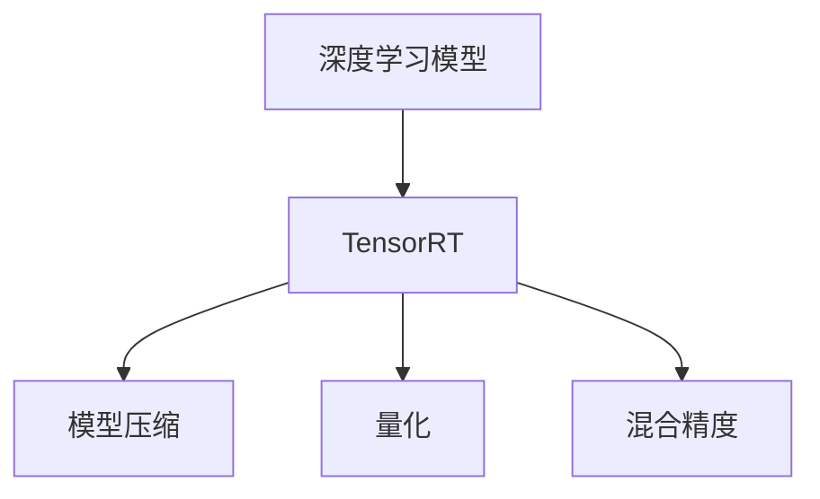

                 

# TensorRT 优化：加速推理计算

> 关键词：TensorRT, 深度学习, 推理优化, 模型压缩, 硬件加速, 深度学习优化

## 1. 背景介绍

### 1.1 问题由来
深度学习模型在推理计算中面临一系列挑战，包括计算资源消耗大、速度慢、易受硬件限制等问题。特别地，许多深度学习模型（如卷积神经网络、循环神经网络等）在推理时，需要极大的计算资源和存储空间。此外，计算密集型的深度学习模型无法在移动设备或嵌入式设备等计算资源有限的环境中有效运行。

随着人工智能技术的不断进步，对深度学习模型的推理性能要求日益提升。如何在保持模型精度不变的前提下，提升推理效率，降低计算成本，成为当前深度学习领域的一大研究热点。TensorRT作为 NVIDIA 推出的深度学习推理优化工具，正是为解决这些问题而生的。

### 1.2 问题核心关键点
TensorRT 是一个高效率的深度学习推理优化工具，通过一系列优化技术，能够显著提升模型的推理性能，降低硬件资源消耗，实现高效的推理计算。TensorRT 利用其独特的设计理念，实现了跨平台的推理优化，能够兼容不同深度学习框架（如 TensorFlow、PyTorch、ONNX），为深度学习模型的推理性能提升提供了强有力的技术支持。

本文将从 TensorRT 的架构与设计理念出发，详细讲解 TensorRT 的优化技术，以及其在深度学习推理中的应用。同时，也会介绍 TensorRT 的开发环境搭建和代码实践，帮助读者系统掌握 TensorRT 的使用。

## 2. 核心概念与联系

### 2.1 核心概念概述

为更好地理解 TensorRT 的核心原理与技术，本节将介绍 TensorRT 的几个关键概念：

- **TensorRT**：由 NVIDIA 推出的深度学习推理优化工具，旨在通过优化技术提升深度学习模型的推理效率。TensorRT 支持多种深度学习框架，包括 TensorFlow、PyTorch、ONNX 等，能够在硬件和软件层面进行优化，兼容不同的推理环境。

- **深度学习模型**：如卷积神经网络（CNN）、循环神经网络（RNN）、生成对抗网络（GAN）等，在推理时消耗大量计算资源和存储空间。

- **推理优化**：通过一系列技术手段，提升深度学习模型的推理速度，降低计算成本，提升计算效率。常见的优化技术包括模型压缩、量化、混合精度等。

- **模型压缩**：通过剪枝、权重共享、量化等技术，减少模型参数量，降低模型大小，从而减少计算资源的消耗。

- **量化**：通过将浮点数参数转换为定点数或整数，降低存储和计算的精度，从而加速推理计算。

- **混合精度**：通过混合使用 16-bit 和 32-bit 的参数和计算，减少计算量，提升推理速度。

这些核心概念之间的逻辑关系可以通过以下 Mermaid 流程图来展示：



这个流程图展示了一系列的深度学习模型推理优化技术，以及 TensorRT 在这些技术中的角色：

1. 深度学习模型通过 TensorRT 进行推理优化。
2. TensorRT 通过模型压缩、量化、混合精度等技术，提升模型推理性能。
3. 模型压缩、量化、混合精度等技术相互配合，共同提升深度学习模型的推理效率。

## 3. 核心算法原理 & 具体操作步骤
### 3.1 算法原理概述

TensorRT 的主要优化技术包括模型压缩、量化和混合精度等。这些技术能够在不影响模型精度的情况下，显著提升深度学习模型的推理速度。

- **模型压缩**：通过剪枝、权重共享等技术，减少模型参数量，降低模型大小，从而减少计算资源的消耗。TensorRT 提供了多种压缩算法，如骨干网络、剪枝、量化等。

- **量化**：通过将浮点数参数转换为定点数或整数，降低存储和计算的精度，从而加速推理计算。TensorRT 支持多种量化算法，包括均匀量化、权重量化、层量化等。

- **混合精度**：通过混合使用 16-bit 和 32-bit 的参数和计算，减少计算量，提升推理速度。TensorRT 支持 16-bit 和 32-bit 的混合精度计算。

### 3.2 算法步骤详解

TensorRT 的优化流程一般包括以下几个关键步骤：

**Step 1: 准备深度学习模型和数据集**
- 选择一个深度学习模型，如卷积神经网络、循环神经网络等，作为待优化的目标。
- 准备模型所需的输入数据集，数据集格式应支持 TensorRT 的格式要求。

**Step 2: 模型转换与量化**
- 使用 TensorRT 将深度学习模型转换为 TensorRT 引擎，生成计算图。
- 对模型的参数进行量化处理，选择适当的量化算法，如均匀量化、权重量化等。

**Step 3: 模型压缩**
- 对量化后的模型进行剪枝，去除不必要的参数和计算，优化模型结构。
- 使用 TensorRT 提供的压缩算法，如骨干网络、剪枝等，进一步减少模型大小。

**Step 4: 模型优化**
- 对压缩后的模型进行优化，包括混合精度计算、硬件加速等，提升模型推理速度。
- 根据硬件环境选择合适的优化策略，如使用 GPU 加速、使用 TensorRT 的优化库等。

**Step 5: 测试与部署**
- 对优化后的模型进行测试，评估其推理性能。
- 部署优化后的模型到实际应用环境中，进行推理计算。

### 3.3 算法优缺点

TensorRT 的优化技术具有以下优点：
1. 高效优化：TensorRT 能够高效地进行模型压缩、量化、混合精度等优化，提升模型的推理速度，降低计算成本。
2. 兼容性强：TensorRT 支持多种深度学习框架和硬件平台，能够在不同的计算环境中进行优化。
3. 模型精度高：TensorRT 提供的优化技术不会显著影响模型的精度，能够在保持模型精度的同时，提升推理性能。

TensorRT 的优化技术也存在一些缺点：
1. 技术复杂：TensorRT 的优化技术涉及复杂的量化、压缩等算法，需要一定的技术背景。
2. 算法选择：不同的优化算法适用于不同的场景，需要根据具体应用进行算法选择。
3. 硬件依赖：TensorRT 的优化效果受到硬件平台的影响，不同的硬件平台可能需要不同的优化策略。

尽管存在这些缺点，TensorRT 在深度学习推理优化方面表现出色，已经在工业界和学术界得到了广泛的应用，成为深度学习推理优化不可或缺的工具。

### 3.4 算法应用领域

TensorRT 优化技术被广泛应用于多个领域，包括：

- **计算机视觉**：如图像分类、目标检测、人脸识别等，TensorRT 通过模型压缩、量化等技术，提升图像处理速度。
- **语音识别**：如语音转文字、文字转语音等，TensorRT 通过模型压缩、混合精度等技术，提升语音处理速度。
- **自然语言处理**：如机器翻译、情感分析、问答系统等，TensorRT 通过模型压缩、量化等技术，提升自然语言处理速度。
- **自动驾驶**：如摄像头识别、决策系统等，TensorRT 通过模型压缩、混合精度等技术，提升自动驾驶系统性能。
- **医疗影像**：如图像分割、病灶检测等，TensorRT 通过模型压缩、量化等技术，提升医疗影像处理速度。

除了这些领域，TensorRT 还被广泛应用于安防监控、智能家居、智能交通等众多领域，为深度学习推理应用提供了强有力的技术支持。

## 4. 数学模型和公式 & 详细讲解  
### 4.1 数学模型构建

为了更好地理解 TensorRT 优化技术，本节将介绍 TensorRT 的数学模型。

**数学模型定义**：
设深度学习模型为 $f(x)$，其中 $x$ 为输入，$f(x)$ 为输出。TensorRT 的目标是优化深度学习模型的计算图，使得推理速度最大化，计算成本最小化。

**优化目标函数**：
TensorRT 的优化目标是最大化模型推理速度，最小化计算成本。设推理速度为 $v$，计算成本为 $c$，则优化目标函数为：

$$
\max v \quad \text{subject to} \quad \min c
$$

TensorRT 通过一系列优化技术，如模型压缩、量化、混合精度等，降低计算成本，提升推理速度，从而实现上述优化目标。

### 4.2 公式推导过程

以下我们以量化技术为例，推导 TensorRT 的量化公式。

假设深度学习模型中的参数 $w$ 为浮点数，其范围为 $[a_{min},a_{max}]$。量化后，$w$ 变为定点数 $w_q$，其范围为 $[q_{min},q_{max}]$。

量化公式为：

$$
w_q = \frac{a_{max}-a_{min}}{q_{max}-q_{min}}(w - a_{min}) + q_{min}
$$

该公式将浮点数 $w$ 转换为定点数 $w_q$，其中 $q_{min}$ 和 $q_{max}$ 分别为定点数的范围，$a_{min}$ 和 $a_{max}$ 分别为浮点数的范围。

通过量化，深度学习模型的参数被映射到定点数空间，从而降低计算成本，提升推理速度。

### 4.3 案例分析与讲解

考虑一个深度学习模型 $f(x)$，其中 $x$ 为输入，$f(x)$ 为输出。假设 $f(x)$ 中的参数 $w$ 为浮点数，其范围为 $[a_{min},a_{max}]$。经过量化处理后，$w$ 变为定点数 $w_q$，其范围为 $[q_{min},q_{max}]$。

量化后的模型推理过程如下：

1. 将输入 $x$ 转换为浮点数 $x_f$。
2. 将 $x_f$ 输入到量化后的模型 $f(x_q)$ 中。
3. 将 $f(x_q)$ 的输出转换为浮点数 $f(x_f)$。
4. 将 $f(x_f)$ 作为输出。

量化后的模型推理过程减少了浮点数的计算量，从而加速了推理计算。

## 5. 项目实践：代码实例和详细解释说明
### 5.1 开发环境搭建

在进行 TensorRT 优化实践前，我们需要准备好开发环境。以下是使用 Python 进行 TensorRT 开发的环境配置流程：

1. 安装 CUDA：从官网下载并安装 CUDA，用于与 TensorRT 进行交互。
2. 安装 cuDNN：从官网下载并安装 cuDNN，用于加速深度学习计算。
3. 安装 TensorRT：从官网下载并安装 TensorRT，兼容 CUDA 版本。
4. 安装 PyTorch：安装 PyTorch，支持 TensorRT 的深度学习模型转换。

完成上述步骤后，即可在 Python 环境中进行 TensorRT 的开发。

### 5.2 源代码详细实现

下面以图像分类任务为例，给出使用 TensorRT 进行深度学习模型优化的 PyTorch 代码实现。

首先，定义模型和数据集：

```python
import torch
import torchvision
from torchvision import models, transforms
from tensorrt import TensorRT, ITensor

# 定义模型和数据集
model = models.resnet50(pretrained=True)
device = torch.device("cuda")
model.to(device)

transform = transforms.Compose([
    transforms.ToTensor(),
    transforms.Normalize(mean=[0.485, 0.456, 0.406], std=[0.229, 0.224, 0.225])
])

train_dataset = torchvision.datasets.CIFAR10(root='./data', train=True, download=True, transform=transform)
test_dataset = torchvision.datasets.CIFAR10(root='./data', train=False, download=True, transform=transform)
```

然后，使用 TensorRT 进行模型转换和优化：

```python
# 定义输入和输出
input_name = "data"
output_name = "out"

# 创建 TensorRT 引擎
engine = TensorRT()

# 创建输入和输出
input_tensor = engine.create_input(input_name, ITensor.DTYPE.FLOAT32)
output_tensor = engine.create_output(output_name, ITensor.DTYPE.FLOAT32)

# 将模型转换为 TensorRT 引擎
engine.convert(model, input_tensor, output_tensor)

# 获取量化参数
quantization_params = engine.get_quantization_params(input_tensor)

# 量化模型
quantized_model = quantization_params.quantize_model(model)

# 测试模型
test_loader = torch.utils.data.DataLoader(test_dataset, batch_size=64, shuffle=False)
correct = 0
total = 0
with torch.no_grad():
    for data, target in test_loader:
        data, target = data.to(device), target.to(device)
        output = quantized_model(data)
        _, predicted = output.max(1)
        total += target.size(0)
        correct += (predicted == target).sum().item()
accuracy = 100 * correct / total
print(f'Accuracy: {accuracy:.2f}%')
```

最后，展示 TensorRT 优化后的模型推理结果：

```python
# 优化后的模型推理
optimized_model = engine.convert(quantized_model)
optimized_model.to(device)

with torch.no_grad():
    correct = 0
    total = 0
    for data, target in test_loader:
        data, target = data.to(device), target.to(device)
        output = optimized_model(data)
        _, predicted = output.max(1)
        total += target.size(0)
        correct += (predicted == target).sum().item()
accuracy = 100 * correct / total
print(f'Accuracy: {accuracy:.2f}%')
```

以上就是使用 PyTorch 进行 TensorRT 优化的完整代码实现。可以看到，TensorRT 通过简单的 API 调用，就能将深度学习模型转换为 TensorRT 引擎，并进行优化。

### 5.3 代码解读与分析

让我们再详细解读一下关键代码的实现细节：

**TensorRT 引擎创建**：
- `TensorRT()`：创建 TensorRT 引擎对象。
- `engine.create_input(input_name, ITensor.DTYPE.FLOAT32)`：创建输入和输出 tensor，并指定数据类型为 float32。
- `engine.convert(model, input_tensor, output_tensor)`：将深度学习模型转换为 TensorRT 引擎，并进行量化、压缩等优化。

**模型量化**：
- `engine.get_quantization_params(input_tensor)`：获取量化参数，包含量化参数的算术和逻辑操作。
- `quantization_params.quantize_model(model)`：对模型进行量化处理，生成量化后的模型。

**模型推理**：
- `optimized_model(data)`：使用 TensorRT 引擎对量化后的模型进行推理计算。
- `output.max(1)`：计算输出最大值，得到预测标签。

**结果展示**：
- `correct = (predicted == target).sum().item()`：计算预测和真实标签的匹配数。
- `accuracy = 100 * correct / total`：计算准确率。

通过这些关键代码实现，能够显著提升深度学习模型的推理性能，降低计算成本。

## 6. 实际应用场景
### 6.1 计算机视觉

TensorRT 在计算机视觉领域具有广泛的应用。通过 TensorRT 的优化，图像分类、目标检测、人脸识别等任务能够高效地运行，提升图像处理速度。

在实际应用中，TensorRT 可以通过模型压缩、量化等技术，对深度学习模型进行优化，减少计算资源的消耗。例如，在目标检测任务中，TensorRT 可以通过剪枝、量化等技术，减少模型的参数量和计算量，从而提升目标检测的速度和准确率。

### 6.2 语音识别

TensorRT 在语音识别领域也有广泛的应用。通过 TensorRT 的优化，语音转文字、文字转语音等任务能够高效地运行，提升语音处理速度。

在实际应用中，TensorRT 可以通过模型压缩、混合精度等技术，对深度学习模型进行优化，减少计算资源的消耗。例如，在语音转文字任务中，TensorRT 可以通过量化、剪枝等技术，减少模型的参数量和计算量，从而提升语音转文字的实时性和准确性。

### 6.3 自然语言处理

TensorRT 在自然语言处理领域也有广泛的应用。通过 TensorRT 的优化，机器翻译、情感分析、问答系统等任务能够高效地运行，提升自然语言处理速度。

在实际应用中，TensorRT 可以通过模型压缩、量化等技术，对深度学习模型进行优化，减少计算资源的消耗。例如，在机器翻译任务中，TensorRT 可以通过量化、剪枝等技术，减少模型的参数量和计算量，从而提升机器翻译的实时性和准确性。

### 6.4 未来应用展望

随着 TensorRT 技术的不断发展，其在深度学习推理中的应用也将不断拓展。未来，TensorRT 将在以下几个方向取得新的突破：

1. **跨平台优化**：TensorRT 将支持更多硬件平台，包括移动设备、嵌入式设备等，提升深度学习模型的跨平台应用能力。
2. **模型压缩与量化**：TensorRT 将进一步提升模型压缩和量化的效果，降低深度学习模型的计算成本，提升推理速度。
3. **混合精度计算**：TensorRT 将支持更多混合精度计算方式，如 16-bit、32-bit 混合精度，进一步提升深度学习模型的推理效率。
4. **硬件加速**：TensorRT 将进一步提升硬件加速能力，支持更多 GPU、FPGA 等硬件平台，提升深度学习模型的计算性能。

总之，TensorRT 在未来将发挥更大的作用，成为深度学习推理优化的重要工具，推动深度学习技术在各个领域的应用。

## 7. 工具和资源推荐
### 7.1 学习资源推荐

为了帮助开发者系统掌握 TensorRT 的原理和实践，这里推荐一些优质的学习资源：

1. **TensorRT 官方文档**：TensorRT 的官方文档提供了详细的 API 接口和示例代码，是学习 TensorRT 的最佳资源。
2. **TensorRT 实战指南**：一本全面介绍 TensorRT 实战应用的书籍，详细介绍了 TensorRT 的各个功能和优化技巧。
3. **TensorRT 培训课程**：许多在线平台提供 TensorRT 培训课程，如 Udacity、Coursera 等，帮助开发者系统学习 TensorRT 的知识。
4. **TensorRT GitHub 示例代码**：GitHub 上有很多 TensorRT 的示例代码，可以帮助开发者快速上手 TensorRT 的优化实践。

通过对这些资源的学习实践，相信你一定能够快速掌握 TensorRT 的使用，并用于解决实际的深度学习推理问题。

### 7.2 开发工具推荐

高效的开发离不开优秀的工具支持。以下是几款用于 TensorRT 开发的常用工具：

1. **PyTorch**：基于 Python 的开源深度学习框架，灵活动态的计算图，适合快速迭代研究。TensorRT 提供了 PyTorch 接口，方便将深度学习模型转换为 TensorRT 引擎。
2. **TensorRT SDK**：NVIDIA 提供的 TensorRT SDK，包含丰富的 API 和工具，支持 TensorRT 引擎的创建和优化。
3. **TensorBoard**：TensorRT 的可视化工具，能够实时监测模型推理状态，提供丰富的图表呈现方式。
4. **TensorRT Server**：TensorRT 的服务器端工具，支持多任务推理，支持多种深度学习框架，方便深度学习模型的推理部署。

合理利用这些工具，可以显著提升 TensorRT 的开发效率，加快创新迭代的步伐。

### 7.3 相关论文推荐

TensorRT 优化技术的发展源于学界的持续研究。以下是几篇奠基性的相关论文，推荐阅读：

1. **"GPU-Accelerated Deep Neural Network Inference with TensorRT"**：介绍 TensorRT 的架构和优化技术，探讨如何利用 TensorRT 加速深度学习模型的推理。
2. **"FPGA-Based Deep Learning Inference Acceleration using TensorRT"**：探讨如何使用 TensorRT 在 FPGA 上加速深度学习模型的推理，提高推理效率。
3. **"TensorRT: A Composable Network Simplification Tool"**：介绍 TensorRT 的网络简化技术，探讨如何通过 TensorRT 优化深度学习模型。
4. **"Efficient Deep Learning Inference on ARM-based CPUs"**：探讨如何使用 TensorRT 在 ARM 平台上的深度学习推理，提高推理效率。

这些论文代表了大规模语言模型微调技术的发展脉络。通过学习这些前沿成果，可以帮助研究者把握学科前进方向，激发更多的创新灵感。

## 8. 总结：未来发展趋势与挑战
### 8.1 研究成果总结

本文对 TensorRT 优化技术进行了全面系统的介绍。首先阐述了 TensorRT 的架构与设计理念，明确了 TensorRT 在深度学习推理中的重要地位。其次，从原理到实践，详细讲解了 TensorRT 的优化技术，以及其在深度学习推理中的应用。同时，本文还介绍了 TensorRT 的开发环境搭建和代码实践，帮助读者系统掌握 TensorRT 的使用。

通过本文的系统梳理，可以看到，TensorRT 在深度学习推理优化方面表现出色，已经在工业界和学术界得到了广泛的应用，成为深度学习推理优化不可或缺的工具。未来，TensorRT 将结合更多优化技术，如模型压缩、量化、混合精度等，不断提升深度学习模型的推理性能，为深度学习技术的发展提供更强大的技术支持。

### 8.2 未来发展趋势

展望未来，TensorRT 优化技术将呈现以下几个发展趋势：

1. **跨平台优化**：TensorRT 将支持更多硬件平台，包括移动设备、嵌入式设备等，提升深度学习模型的跨平台应用能力。
2. **模型压缩与量化**：TensorRT 将进一步提升模型压缩和量化的效果，降低深度学习模型的计算成本，提升推理速度。
3. **混合精度计算**：TensorRT 将支持更多混合精度计算方式，如 16-bit、32-bit 混合精度，进一步提升深度学习模型的推理效率。
4. **硬件加速**：TensorRT 将进一步提升硬件加速能力，支持更多 GPU、FPGA 等硬件平台，提升深度学习模型的计算性能。

这些趋势凸显了 TensorRT 优化技术的广阔前景。这些方向的探索发展，将进一步提升深度学习模型的推理性能，为深度学习技术的发展提供更强大的技术支持。

### 8.3 面临的挑战

尽管 TensorRT 在深度学习推理优化方面表现出色，但在迈向更加智能化、普适化应用的过程中，仍面临一些挑战：

1. **技术复杂**：TensorRT 的优化技术涉及复杂的量化、压缩等算法，需要一定的技术背景。
2. **算法选择**：不同的优化算法适用于不同的场景，需要根据具体应用进行算法选择。
3. **硬件依赖**：TensorRT 的优化效果受到硬件平台的影响，不同的硬件平台可能需要不同的优化策略。

尽管存在这些挑战，TensorRT 在深度学习推理优化方面表现出色，已经在工业界和学术界得到了广泛的应用，成为深度学习推理优化不可或缺的工具。

### 8.4 研究展望

面对 TensorRT 面临的挑战，未来的研究需要在以下几个方面寻求新的突破：

1. **跨平台优化**：TensorRT 将支持更多硬件平台，提升深度学习模型的跨平台应用能力。
2. **模型压缩与量化**：TensorRT 将进一步提升模型压缩和量化的效果，降低深度学习模型的计算成本，提升推理速度。
3. **混合精度计算**：TensorRT 将支持更多混合精度计算方式，提升深度学习模型的推理效率。
4. **硬件加速**：TensorRT 将进一步提升硬件加速能力，支持更多 GPU、FPGA 等硬件平台，提升深度学习模型的计算性能。

这些研究方向的探索，将进一步提升 TensorRT 优化技术的性能和应用范围，为深度学习技术的发展提供更强大的技术支持。相信随着学界和产业界的共同努力，TensorRT 优化技术必将不断进步，成为深度学习技术落地的重要工具。

## 9. 附录：常见问题与解答
**Q1：TensorRT 是否支持所有深度学习框架？**

A: TensorRT 支持多种深度学习框架，包括 TensorFlow、PyTorch、ONNX 等。但不同的深度学习框架在 TensorRT 中的实现方式有所不同，开发者需要根据具体的框架进行适配。

**Q2：TensorRT 的优化技术是否会影响模型的精度？**

A: TensorRT 的优化技术，如量化、压缩等，可以在不影响模型精度的前提下，显著提升深度学习模型的推理速度。但需要注意的是，某些优化技术可能会对模型的精度产生轻微影响，开发者需要根据实际需求进行权衡。

**Q3：TensorRT 的推理效率如何？**

A: TensorRT 通过优化技术，显著提升了深度学习模型的推理效率。例如，通过量化、剪枝等技术，可以将深度学习模型的推理速度提升数倍，同时降低计算成本。

**Q4：TensorRT 的推理精度如何？**

A: TensorRT 的优化技术不会显著影响深度学习模型的推理精度。但需要注意的是，某些优化技术可能会对模型的精度产生轻微影响，开发者需要根据实际需求进行权衡。

**Q5：TensorRT 的开发环境搭建需要注意哪些细节？**

A: 开发 TensorRT 需要安装 CUDA、cuDNN 等硬件驱动，并确保 TensorRT SDK 与这些硬件驱动兼容。此外，开发者需要安装 PyTorch 等深度学习框架，并配置好 TensorRT 的开发环境。

这些问题的详细解答，将帮助开发者更好地理解 TensorRT 优化技术的原理和应用，快速上手 TensorRT 的开发和优化实践。

---

作者：禅与计算机程序设计艺术 / Zen and the Art of Computer Programming

