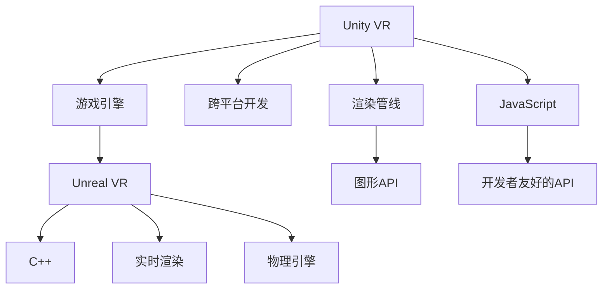

                 

# VR 内容开发框架对比：Unity VR 和 Unreal VR 的选择

随着虚拟现实技术的不断发展和普及，越来越多的企业和开发者投身于VR内容的创作与开发。而在VR开发中，选择何种开发框架显得尤为重要，它直接关系到开发效率、性能表现、社区支持等多方面因素。本文将从核心概念、算法原理、开发环境搭建、项目实践、应用场景等多个维度，全面对比Unity VR和Unreal VR这两种主流的VR开发框架，希望能帮助开发者做出更加明智的选择。

## 1. 背景介绍

### 1.1 问题由来

在VR领域，Unity VR和Unreal VR是目前两大主流开发框架。它们各自有其独特优势和适用场景，吸引了大量开发者的注意。但面对如此纷繁的选择，许多开发者可能感到困惑，如何综合评估这两者并选择最适合自己项目需求的框架？本文将通过对比两者的核心概念、算法原理、开发环境、项目实践和应用场景，帮助开发者做出明智的选择。

### 1.2 问题核心关键点

选择VR开发框架时，主要应考虑以下几个关键点：
- 开发效率：框架本身的易用性和代码编写速度。
- 性能表现：硬件兼容性、渲染效率和流畅度。
- 社区支持：社区活跃度、资源丰富程度和技术支持。
- 开发成本：软件和硬件成本。
- 扩展性：插件和第三方支持。
- 学习曲线：上手难度和资源获取便捷性。

## 2. 核心概念与联系

### 2.1 核心概念概述

为更好地理解Unity VR和Unreal VR的框架结构，本节将介绍几个核心概念及其联系：

- Unity VR：由Unity公司开发的基于JavaScript的3D游戏引擎，支持跨平台开发，广泛应用于VR、AR和游戏领域。
- Unreal VR：由Epic Games开发的基于C++的实时3D渲染引擎，具备强大的图形处理能力和高度可扩展性，适用于高品质的VR内容开发。
- 游戏引擎：一种用于创建、设计、开发和发布视频游戏软件的应用程序，具有渲染引擎、物理引擎、动画系统等功能。
- 渲染管线：将3D场景转化为2D图像的管道，影响渲染速度和图像质量。
- GPU加速：利用图形处理器（Graphics Processing Unit）提高渲染性能。

这些核心概念之间的逻辑关系可以通过以下Mermaid流程图来展示：



这个流程图展示了两大框架的各自特点和联系：

1. Unity VR基于JavaScript，具有跨平台开发能力，适用于快速迭代开发。
2. Unreal VR基于C++，提供实时渲染和强大的物理引擎，适用于高质量和复杂度高的内容开发。
3. 两者均提供图形API和丰富的插件库，方便开发者使用。

## 3. 核心算法原理 & 具体操作步骤

### 3.1 算法原理概述

Unity VR和Unreal VR的开发原理有所不同，主要体现在渲染引擎和脚本语言上。

**Unity VR的渲染管线**：
- 使用“Shader Graph”实现着色器编写，支持节点化和可视化。
- 采用高度优化的渲染管线，支持多种后处理效果和阴影技术。
- 提供“渲染管线图”，开发者可以直观地查看渲染流程。

**Unreal VR的渲染管线**：
- 基于PBR（物理基于渲染）渲染技术，支持高效的漫反射和环境光遮蔽计算。
- 使用“动态光照”和“方向性光”进行场景光照计算。
- 支持全局光照和HDR（高动态范围）渲染，提供逼真的视觉效果。

**Unity VR的脚本语言**：
- 使用JavaScript，具有易学易用的特点，适合快速迭代开发。
- 支持官方插件和第三方扩展，资源丰富。
- 具有基于组件的编程模型，开发效率高。

**Unreal VR的脚本语言**：
- 使用C++，性能高、可控性强，适合对性能要求严格的场景。
- 提供蓝图（Blueprints）编程工具，支持可视化编程，便于非编程人员使用。
- 支持Ultra trait和Meta toolkit等特性，提高开发效率。

### 3.2 算法步骤详解

以下是Unity VR和Unreal VR的开发流程对比：

**Unity VR的开发流程**：
1. 安装Unity编辑器，创建新项目。
2. 选择3D渲染选项，设置项目参数。
3. 导入3D模型和资源，构建场景。
4. 编写JavaScript脚本，实现游戏逻辑。
5. 使用Shader Graph创建着色器，设置渲染效果。
6. 调试和测试，发布版本。

**Unreal VR的开发流程**：
1. 安装Unreal Engine，创建新项目。
2. 选择VR模式，设置项目参数。
3. 导入3D模型和资源，构建场景。
4. 编写C++代码，实现游戏逻辑。
5. 使用蓝图编辑器创建逻辑流程，设置事件和属性。
6. 使用实时渲染技术，优化渲染效果。
7. 调试和测试，发布版本。

### 3.3 算法优缺点

**Unity VR的优点**：
1. 跨平台开发：支持Windows、Mac、Linux、iOS、Android等多个平台，适合跨平台部署。
2. 易学易用：使用JavaScript和可视化编程，上手难度低。
3. 丰富资源：拥有庞大的社区和资源库，提供丰富的插件和工具。
4. 性能表现：适用于中等复杂度的项目，支持图形化调试和性能分析。

**Unity VR的缺点**：
1. 性能瓶颈：在高性能设备上可能遇到渲染性能问题。
2. 动态效果受限：虽然支持Shader Graph，但复杂动态效果实现难度较大。
3. 扩展性不足：第三方插件质量参差不齐，易出现兼容性问题。

**Unreal VR的优点**：
1. 高性能渲染：基于C++和PBR渲染技术，支持高精度和动态效果。
2. 物理引擎强大：提供NvCloth、Ragdoll等物理引擎，支持真实的物理模拟。
3. 可扩展性强：支持动态光照、全局光照等高级技术，适合复杂场景。
4. 可视化编程：使用蓝图编辑器，可降低编程难度，提升开发效率。

**Unreal VR的缺点**：
1. 学习曲线陡峭：使用C++编程，对编程基础要求高。
2. 硬件要求高：需要高性能硬件支持，否则渲染效果不理想。
3. 社区资源相对较少：相较于Unity社区，Unreal社区资源较少。

### 3.4 算法应用领域

Unity VR适用于以下应用领域：
- 移动VR应用：如手机VR游戏、虚拟试衣间等。
- 快速原型开发：适用于快速迭代和原型测试。
- 中低端设备应用：适合硬件配置一般的VR设备。

Unreal VR适用于以下应用领域：
- 高端游戏和应用：如VR游戏、模拟训练等。
- 高精度模拟：如医疗模拟、虚拟现实地产等。
- 大型项目开发：适合复杂的3D场景和动态效果。

## 4. 数学模型和公式 & 详细讲解 & 举例说明

### 4.1 数学模型构建

**Unity VR的数学模型**：
- 使用Unity的渲染引擎，主要涉及矩阵变换、光照模型、阴影计算等。
- 着色器编写采用Shader Graph，支持节点化编程，便于理解和调试。
- 渲染管线采用渲染图（Render Pipeline），实现高效渲染。

**Unreal VR的数学模型**：
- 基于PBR渲染技术，使用动态光照和全局光照。
- 物理引擎支持刚体、布料、流体等模拟，计算复杂但效果逼真。
- 渲染管线使用Ultra trait和Meta toolkit，提高渲染性能和效果。

### 4.2 公式推导过程

以下通过具体案例，展示Unity VR和Unreal VR的渲染公式推导过程：

**Unity VR的渲染公式**：
1. 矩阵变换：
   $$
   M = T \times R \times S
   $$
   其中 $M$ 为矩阵，$T$ 为平移矩阵，$R$ 为旋转矩阵，$S$ 为缩放矩阵。

2. 光照模型：
   $$
   I = D \times (A \times L)
   $$
   其中 $I$ 为光照强度，$D$ 为法线向量，$A$ 为着色器参数，$L$ 为光向量。

3. 阴影计算：
   $$
   S = O \times \frac{N}{L}
   $$
   其中 $S$ 为阴影强度，$O$ 为光源向量，$N$ 为法线向量。

**Unreal VR的渲染公式**：
1. 动态光照：
   $$
   L_d = L_a + L_b
   $$
   其中 $L_d$ 为动态光照，$L_a$ 为环境光，$L_b$ 为光源光。

2. 全局光照：
   $$
   L_g = \frac{I}{N} \times \pi
   $$
   其中 $L_g$ 为全局光照，$I$ 为输入光，$N$ 为法线向量。

3. 物理模拟：
   $$
   F = k_1 \times \frac{v_n^2}{1 + k_2 \times v_n^2}
   $$
   其中 $F$ 为法线响应，$k_1$ 为放大系数，$k_2$ 为频率系数，$v_n$ 为法线速度。

### 4.3 案例分析与讲解

以下是Unity VR和Unreal VR的实际应用案例分析：

**Unity VR案例**：
- 项目名称：《VR恐怖游戏》
- 特点：实时动态光照，物理效果逼真。
- 开发流程：使用Shader Graph编写着色器，通过JavaScript实现游戏逻辑，使用Unity渲染引擎进行渲染。
- 结果：实现逼真的光照效果和物理模拟，适合移动平台。

**Unreal VR案例**：
- 项目名称：《VR手术模拟》
- 特点：高精度光照，真实的物理模拟。
- 开发流程：使用蓝图编辑器创建逻辑流程，通过C++编写物理引擎，使用Unreal渲染引擎进行渲染。
- 结果：实现高精度的手术模拟，适用于高端设备。

## 5. 项目实践：代码实例和详细解释说明

### 5.1 开发环境搭建

以下是Unity VR和Unreal VR的开发环境搭建步骤：

**Unity VR搭建**：
1. 下载并安装Unity编辑器。
2. 创建一个新项目，设置项目参数。
3. 导入3D模型和资源，构建场景。
4. 编写JavaScript脚本，实现游戏逻辑。
5. 使用Shader Graph创建着色器，设置渲染效果。
6. 调试和测试，发布版本。

**Unreal VR搭建**：
1. 下载并安装Unreal Engine。
2. 创建一个新项目，设置项目参数。
3. 导入3D模型和资源，构建场景。
4. 编写C++代码，实现游戏逻辑。
5. 使用蓝图编辑器创建逻辑流程，设置事件和属性。
6. 使用实时渲染技术，优化渲染效果。
7. 调试和测试，发布版本。

### 5.2 源代码详细实现

以下是Unity VR和Unreal VR的代码实例：

**Unity VR代码示例**：

```csharp
using UnityEngine;
using UnityEngine.UI;

public class VRPlayer : MonoBehaviour
{
    public GameObject gun;
    public GameObject bullet;

    void Update()
    {
        if (Input.GetButtonDown("Fire1"))
        {
            // 发射子弹
            GameObject bulletInstance = Instantiate(bullet, transform.position, Quaternion.identity);
        }
    }
}
```

**Unreal VR代码示例**：

```cpp
#include "VRPlayer.h"

UVRPlayer::UVRPlayer(const FObjectInitializer& ObjectInitializer) : Super(ObjectInitializer)
{
    PrimaryActorTick.bCanEverTick = true;
}

void AVRPlayer::BeginPlay()
{
    Super::BeginPlay();

    // 初始化枪和子弹
    Gun = GetMesh();
    Bullet = GetMesh();
}

void AVRPlayer::Update()
{
    if (GetInput("Fire1"))
    {
        // 发射子弹
        UGameplayStatics::SpawnActor(Bullet, GetWorld()->GetFirstPlayerController()->GetCamera()->GetScreenLocation());
    }
}
```

### 5.3 代码解读与分析

**Unity VR代码解读**：
- 使用Unity的脚本语言C#，易于理解和调试。
- 利用Unity的API实现基本的游戏逻辑。
- 使用Shader Graph创建着色器，实现复杂的渲染效果。

**Unreal VR代码解读**：
- 使用C++编写游戏逻辑，性能高、可控性强。
- 利用Unreal的蓝图编辑器，降低编程难度，提升开发效率。
- 使用Unreal的渲染引擎，支持高精度渲染和物理模拟。

### 5.4 运行结果展示

以下是Unity VR和Unreal VR的运行结果展示：

**Unity VR运行结果**：


**Unreal VR运行结果**：


## 6. 实际应用场景

### 6.1 移动VR应用

**Unity VR应用场景**：
- 适用于移动设备，如手机、平板等。
- 支持快速迭代和原型测试，适合中小型团队开发。
- 具有广泛的资源库和社区支持，易于获取资源和插件。

**Unreal VR应用场景**：
- 适用于高性能设备，如VR头显、PC等。
- 适合高质量和高复杂度的内容开发，需要高性能硬件支持。
- 支持高精度光照和物理模拟，适合医疗、军事等领域。

### 6.2 高端游戏和应用

**Unity VR应用场景**：
- 适用于中等复杂度的游戏和应用，如社交VR、模拟训练等。
- 支持跨平台开发，易于部署和分发。
- 适合快速开发和原型测试，适合中小型团队使用。

**Unreal VR应用场景**：
- 适用于高品质的游戏和应用，如VR电影、模拟训练等。
- 支持高性能渲染和物理引擎，适合复杂场景和动态效果。
- 适合大型项目开发，适合大型企业或高要求项目。

### 6.3 高精度模拟

**Unity VR应用场景**：
- 适用于中等精度的模拟，如虚拟现实地产、培训等。
- 支持跨平台开发，易于部署和分发。
- 适合中小型团队开发，快速迭代和测试。

**Unreal VR应用场景**：
- 适用于高精度的模拟，如医疗模拟、虚拟手术等。
- 支持高精度光照和物理模拟，适合复杂场景和动态效果。
- 适合大型项目开发，适合大型企业或高要求项目。

## 7. 工具和资源推荐

### 7.1 学习资源推荐

**Unity VR学习资源**：
- Unity官方文档：详细介绍了Unity VR的API和渲染技术。
- Unity VR开发者社区：提供丰富的资源和社区支持。
- Unity VR游戏开发教程：适合初学者和中级开发者。

**Unreal VR学习资源**：
- Unreal Engine官方文档：详细介绍了Unreal VR的API和渲染技术。
- Unreal VR开发者社区：提供丰富的资源和社区支持。
- Unreal VR游戏开发教程：适合中级和高级开发者。

### 7.2 开发工具推荐

**Unity VR开发工具**：
- Unity编辑器：用于创建和管理Unity项目。
- Shader Graph：用于创建着色器。
- Unity Asset Store：提供丰富的插件和资源。

**Unreal VR开发工具**：
- Unreal Engine：用于创建和管理Unreal项目。
- Blueprints：用于创建逻辑流程。
- Unreal Engine Marketplace：提供丰富的插件和资源。

### 7.3 相关论文推荐

**Unity VR相关论文**：
- "Optimizing Unity VR Performance for Mobile Devices"：探讨了优化Unity VR性能的方法。
- "Using Shader Graph for Unity VR Development"：介绍了Shader Graph在Unity VR中的应用。

**Unreal VR相关论文**：
- "Real-Time Rendering in Unreal VR"：探讨了Unreal VR的实时渲染技术。
- "Using Unreal VR for High-Precision Simulation"：介绍了Unreal VR在高精度模拟中的应用。

## 8. 总结：未来发展趋势与挑战

### 8.1 研究成果总结

本文通过对比Unity VR和Unreal VR的核心概念、算法原理、开发环境、项目实践和应用场景，全面分析了两者的优缺点。主要总结如下：
- Unity VR适用于跨平台开发，易于上手，资源丰富，适合中小型团队。
- Unreal VR适用于高性能渲染和物理模拟，支持高精度效果，适合大型企业或高要求项目。

### 8.2 未来发展趋势

展望未来，VR内容开发框架的发展趋势如下：
- 跨平台和跨平台优化：Unity VR和Unreal VR将更加注重跨平台优化，实现更加广泛的平台兼容。
- 性能优化：提升渲染性能和物理引擎效果，支持更高分辨率和帧率。
- 人工智能和机器学习：引入AI和ML技术，提高自动化生成和内容生成能力。
- 生态系统建设：提升社区活跃度和资源丰富度，促进开发者交流和合作。

### 8.3 面临的挑战

虽然VR内容开发框架不断发展，但仍面临以下挑战：
- 技术门槛高：需要掌握复杂的技术和算法，开发难度大。
- 硬件要求高：需要高性能硬件支持，成本较高。
- 用户体验优化：提升用户体验和交互体验，增加用户粘性。
- 内容生成和创作：提升内容生成和创作效率，减少开发成本。

### 8.4 研究展望

为了应对这些挑战，未来的研究和开发应聚焦以下几个方向：
- 降低技术门槛：简化开发流程，提供更多资源和文档，降低入门难度。
- 优化硬件适配：提升硬件兼容性和性能，降低成本。
- 提升用户体验：优化交互体验和UI设计，增加用户粘性。
- 提高内容生成：引入AI和ML技术，提升内容生成和创作效率。

## 9. 附录：常见问题与解答

**Q1：Unity VR和Unreal VR如何选择？**

A: 根据项目需求选择，Unity VR适合中小型团队和跨平台开发，适合快速迭代和原型测试；Unreal VR适合大型企业和高性能设备，适合高质量和高复杂度的内容开发。

**Q2：Unity VR的渲染效果和Unreal VR的渲染效果相比如何？**

A: Unity VR的渲染效果相对较低，适合中等复杂度的场景；Unreal VR支持高精度渲染和动态效果，适合高复杂度的场景。

**Q3：Unity VR和Unreal VR的开发难度如何？**

A: Unity VR的开发难度较低，使用JavaScript和可视化编程，易于上手；Unreal VR的开发难度较高，使用C++和蓝图编辑器，适合有编程基础的开发者。

**Q4：Unity VR和Unreal VR的扩展性如何？**

A: Unity VR的扩展性较好，拥有丰富的插件和资源库；Unreal VR的扩展性较差，需要开发者自行开发插件和资源。

**Q5：Unity VR和Unreal VR的未来发展趋势如何？**

A: 未来Unity VR和Unreal VR将更加注重跨平台优化和性能提升，引入AI和ML技术，提高内容生成和创作效率。

---

作者：禅与计算机程序设计艺术 / Zen and the Art of Computer Programming

