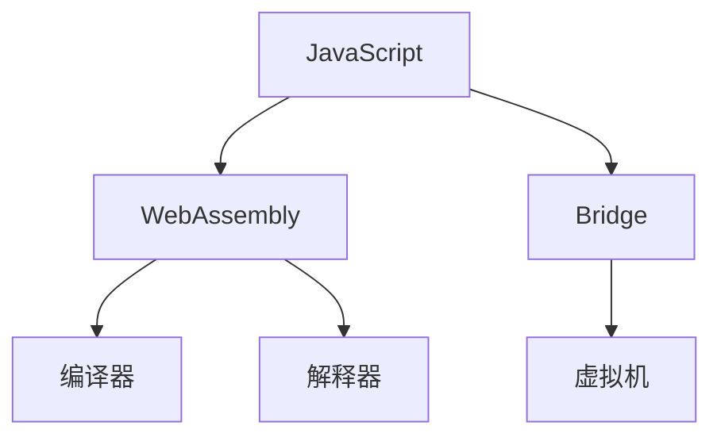
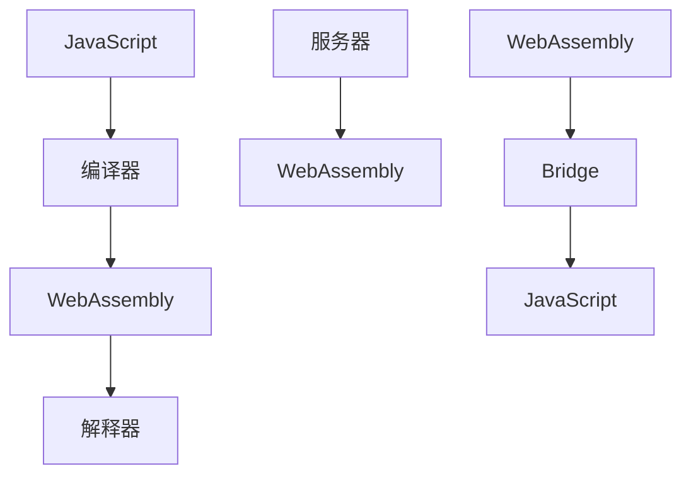

                 

## 1. 背景介绍

在Web平台演进的过程中，JavaScript长期以来作为唯一的脚本语言，扮演着核心角色。但随着应用场景的多样化和技术需求的升级，JavaScript在性能、安全性、跨平台性等方面的限制逐渐显现。为此，WebAssembly（简称Wasm）应运而生，成为Web平台的新一代编程语言。

### 1.1 WebAssembly的由来

WebAssembly的构想始于2011年，由Google、Mozilla、Microsoft、Intel等互联网和科技巨头联合提出。2015年，WebAssembly规范初稿完成，并逐步得到了主流浏览器和操作系统的支持。2017年，第一个稳定版本的WebAssembly规范发布。

### 1.2 发展现状

WebAssembly从提出到现在，经历了多年的发展和完善，已经逐渐在Web应用中发挥重要作用。不仅谷歌的Chrome、Firefox、Safari、Microsoft Edge等主流浏览器都原生支持WebAssembly，而且在Wasm3等工具的辅助下，WebAssembly已经成为了Web开发领域的新宠。

## 2. 核心概念与联系

### 2.1 核心概念概述

WebAssembly是一种低级字节码，它可以在浏览器、服务器端等多种环境中运行。Wasm不直接与Web开发者交互，而是通过一系列工具链，将高级语言编译成Wasm，最终运行在Web平台。

核心概念关系如下：



- **JavaScript**：Web开发的主要脚本语言。
- **WebAssembly**：一种低级字节码，支持高效的运行和操作。
- **编译器**：用于将高级语言（如C++）编译成Wasm的工具。
- **Bridge**：JavaScript与Wasm之间的桥接技术，如EMscripten。
- **解释器**：将Wasm字节码转换为实际执行指令的工具。
- **虚拟机**：在服务器端执行Wasm的程序。

### 2.2 核心概念原理和架构的 Mermaid 流程图



## 3. 核心算法原理 & 具体操作步骤

### 3.1 算法原理概述

WebAssembly的运行主要涉及两个阶段：编译和执行。编译器负责将高级语言代码编译成Wasm字节码，解释器负责将Wasm字节码转换为实际执行指令。

### 3.2 算法步骤详解

#### 3.2.1 编译阶段

1. **源代码编写**：使用C++、Rust、C#等高级语言编写源代码。
2. **编译工具链**：通过编译工具链将源代码编译成Wasm字节码。常用的编译工具包括LLVM、Clang等。

#### 3.2.2 执行阶段

1. **加载Wasm文件**：在JavaScript代码中加载Wasm文件。
2. **桥接技术**：使用桥接技术将Wasm文件与JavaScript代码进行连接，支持跨语言调用。
3. **执行Wasm代码**：通过解释器将Wasm字节码转换为实际执行指令，实现高效运行。

### 3.3 算法优缺点

#### 3.3.1 优点

- **高性能**：Wasm字节码可以直接在机器上运行，不需要解释和转译，执行效率高。
- **跨平台性**：Wasm字节码可以跨平台运行，支持Windows、macOS、Linux等多种操作系统。
- **安全性**：Wasm的运行环境更加安全，不容易出现恶意代码。
- **多语言支持**：支持C++、Rust、C#等高级语言的编译，提供了丰富的语言选择。

#### 3.3.2 缺点

- **学习曲线陡峭**：Wasm需要一定的低级编程知识，学习曲线较陡。
- **生态系统不完善**：Wasm的开发工具链和库支持相比JavaScript稍显不足。
- **兼容性问题**：不同浏览器和操作系统的Wasm版本可能存在兼容性问题。

### 3.4 算法应用领域

WebAssembly主要应用于以下领域：

- **高性能计算**：如科学计算、图形渲染、机器学习等。
- **游戏开发**：游戏引擎可以编译成Wasm，提高游戏运行效率。
- **Web应用**：在Web应用中集成Wasm，提升应用性能和安全性。
- **服务器端编程**：在服务器端编写Wasm代码，优化后端服务。

## 4. 数学模型和公式 & 详细讲解 & 举例说明

### 4.1 数学模型构建

Wasm指令系统基于冯·诺依曼结构，支持常见的算术、逻辑、控制、函数调用等操作。以下是Wasm的简单数学模型：

- **指令**：Wasm指令系统包括多种指令，如`add`、`sub`、`mul`、`div`等。
- **数据类型**：Wasm支持不同的数据类型，如`i32`、`i64`、`f32`、`f64`等。
- **函数**：Wasm支持函数定义和调用，函数可以有参数和返回值。
- **内存管理**：Wasm支持内存分配和释放，可以通过指针进行数据传递。

### 4.2 公式推导过程

Wasm的运行基于栈和内存，其运行过程可以用栈帧和寄存器模型来表示。例如，以下Wasm代码片段展示了两个数的加法运算：

```wasm
func @add(i32 $x, i32 $y) {
    stack.alloc(i32)
    stack.alloc(i32)
    stack.alloc(i32)
    i32.add(stack.alloc(i32), stack.alloc(i32), stack.alloc(i32))
    stack.alloc(i32)
    i32.add(stack.alloc(i32), stack.alloc(i32), stack.alloc(i32))
    return
}
```

### 4.3 案例分析与讲解

以下是一个简单的Wasm程序，实现两个整数相加并输出结果：

```wasm
(module 
  (func @main ($x i32, $y i32) (result i32)
    get_global i32 0
    i32.add $x, $y
    return
  )
  (export "main" @main)
)
```

该程序定义了一个名为`main`的函数，接受两个整数参数，并返回它们的和。

## 5. 项目实践：代码实例和详细解释说明

### 5.1 开发环境搭建

1. **安装Node.js**：
```bash
brew install node
```

2. **安装Emscripten**：
```bash
cd /usr/local
sudo make install
```

3. **创建项目目录**：
```bash
mkdir myproject
cd myproject
```

4. **初始化项目**：
```bash
npm init -y
```

### 5.2 源代码详细实现

创建一个C++文件，编写一个简单的函数：

```c++
#include <iostream>
#include <emscripten.h>

extern "C" {
    EMSCRIPTEN_KEEPALIVE int add(int x, int y) {
        return x + y;
    }
}
```

使用Emscripten编译该文件为Wasm模块：

```bash
emcc -s WASM=1 -s MODULARIZE=1 -o main.wasm main.cpp
```

在JavaScript代码中加载Wasm模块：

```javascript
// 加载Wasm模块
let wasmModule = await WebAssembly.instantiateStreaming(main.wasm);
let addFunction = wasmModule.getFunction("add");

// 调用Wasm函数
let result = await addFunction(3, 4);
console.log(result); // 输出7
```

### 5.3 代码解读与分析

上述代码实现了从C++到Wasm的编译和加载过程。使用`emcc`编译C++代码生成Wasm模块，然后通过`WebAssembly.instantiateStreaming`加载Wasm模块，并调用其中的函数。

## 6. 实际应用场景

### 6.1 高性能计算

Wasm在高性能计算领域有着广阔的应用前景。例如，在机器学习领域，可以使用Wasm编写高效的模型计算代码，提升模型训练和推理的速度。

### 6.2 游戏开发

Wasm在游戏开发中也有着重要的应用。通过将游戏引擎编译成Wasm，可以在Web平台上实现高性能的游戏运行。

### 6.3 Web应用

Wasm可以嵌入到Web应用中，提升应用的性能和安全性。例如，WebAssembly Text Editor使用Wasm实现了高效的文本处理算法，提升编辑速度。

### 6.4 服务器端编程

Wasm还可以用于服务器端编程，优化后端服务。例如，在分布式计算系统中，可以使用Wasm编写高效的分布式计算代码，提高系统的运行效率。

## 7. 工具和资源推荐

### 7.1 学习资源推荐

- **《WebAssembly编程与实践》**：详细介绍了WebAssembly的语法、架构和应用。
- **《Emscripten官方文档》**：提供了丰富的Emscripten工具链资料。
- **《WebAssembly实战》**：介绍了使用Wasm开发Web应用的实践经验。

### 7.2 开发工具推荐

- **WebAssembly Text Editor**：一款基于Wasm的文本编辑器，提供高效的文本处理算法。
- **Emscripten**：将C++、Rust等语言编译成Wasm的工具。
- **WasmEdge**：支持WebAssembly的应用服务器。

### 7.3 相关论文推荐

- **《WebAssembly: A Low-Level Bytecode for Just-In-Time Compilation on the Web》**：WebAssembly官方论文，详细介绍了WebAssembly的设计和实现。
- **《High Performance Computing with WebAssembly》**：介绍了Wasm在科学计算和机器学习中的应用。

## 8. 总结：未来发展趋势与挑战

### 8.1 未来发展趋势

- **生态系统完善**：随着Wasm生态系统的不断完善，更多的工具和库将支持Wasm，提高开发效率。
- **跨平台性提升**：Wasm的跨平台性将进一步提升，支持更多操作系统和硬件架构。
- **安全性改进**：Wasm的安全性将得到进一步提升，防止恶意代码和攻击。
- **性能优化**：随着硬件和编译器技术的进步，Wasm的执行性能将进一步优化。

### 8.2 面临的挑战

- **学习曲线陡峭**：Wasm需要一定的低级编程知识，学习曲线较陡。
- **生态系统不完善**：Wasm的开发工具链和库支持相比JavaScript稍显不足。
- **兼容性问题**：不同浏览器和操作系统的Wasm版本可能存在兼容性问题。

### 8.3 研究展望

未来，Wasm的发展方向包括：

- **多语言支持**：支持更多的高级语言编译成Wasm，提供丰富的编程选择。
- **跨平台优化**：优化Wasm的跨平台运行性能，提升在不同设备和操作系统上的兼容性。
- **安全性增强**：加强Wasm的安全性，防止恶意代码和攻击。

## 9. 附录：常见问题与解答

**Q1: 什么是WebAssembly？**

A: WebAssembly是一种低级字节码，支持高效的运行和操作，可以在浏览器、服务器端等多种环境中运行。

**Q2: WebAssembly的优缺点有哪些？**

A: 优点包括高性能、跨平台性、安全性、多语言支持等；缺点包括学习曲线陡峭、生态系统不完善、兼容性问题等。

**Q3: WebAssembly的应用场景有哪些？**

A: 高性能计算、游戏开发、Web应用、服务器端编程等。

**Q4: 如何使用WebAssembly进行开发？**

A: 使用C++、Rust等高级语言编写代码，通过编译工具链将代码编译成Wasm字节码，然后在JavaScript代码中加载Wasm模块并调用其中的函数。

---

作者：禅与计算机程序设计艺术 / Zen and the Art of Computer Programming

