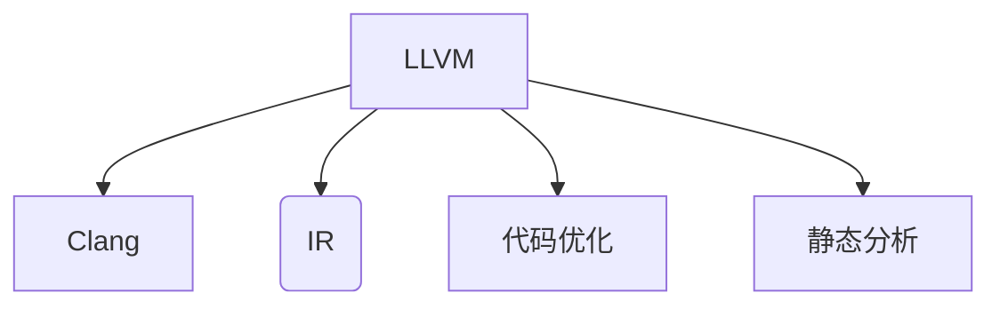
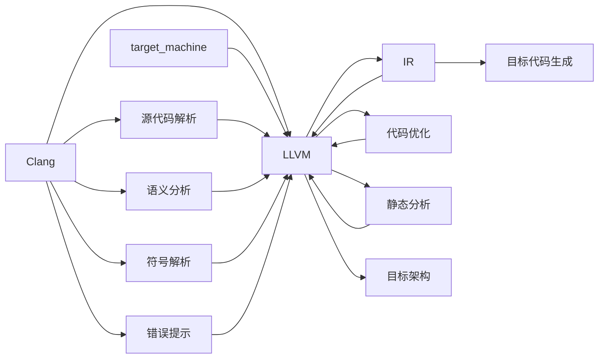

                 

# llvm/clang编译器开发

> 关键词：编译器, 代码优化, 静态分析, 中间代码, 语言设计, 编译技术, clang

## 1. 背景介绍

### 1.1 问题由来

编译器是计算机系统中最核心的软件之一，负责将高级编程语言编写的源代码翻译为机器码。现代编译器不仅仅是代码翻译工具，更是程序优化、静态分析的重要手段。其中，以LLVM为代表的编译器框架，以其高度模块化、可扩展性、强大的代码优化能力，成为全球诸多主流编译器的核心，广泛应用于工业界和学术界。

本文旨在全面介绍LLVM和Clang的开发历程、核心概念和技术，涵盖从基础代码优化到静态分析、从语言设计到编译器技术等各个方面，帮助读者深入理解LLVM/Clang框架，掌握其开发技巧和实践经验。

## 2. 核心概念与联系

### 2.1 核心概念概述

为了清晰阐述LLVM和Clang的核心概念，我们首先从几个基础点入手：

- **LLVM框架**：是由LLVM公司开发的一个跨平台的编译器基础设施，支持多种编程语言和架构的代码转换和优化。
- **Clang编译器**：是基于LLVM框架的高级C语言和C++编译器，支持多种操作系统和平台，具备出色的代码优化和错误提示能力。
- **中间代码(IR)**：LLVM框架的抽象中间代码，代表编译器进行语言转换的桥梁，可以在多个目标架构间进行高效映射。
- **代码优化**：通过LLVM的IR层面进行代码变换，以实现性能提升和空间节约。
- **静态分析**：利用LLVM的静态分析能力，进行代码检查、错误诊断、性能调优等。

这些概念构成了LLVM和Clang框架的基本骨架，其核心原理和架构如图1所示。



### 2.2 核心概念原理和架构的 Mermaid 流程图

下面是一个Mermaid流程图，用于展示LLVM和Clang的核心架构和数据流：



## 3. 核心算法原理 & 具体操作步骤

### 3.1 算法原理概述

LLVM/Clang框架的核心算法可以归纳为以下几个方面：

- **中间代码生成(IR Generation)**：将源代码转换为LLVM中间代码。
- **代码优化(Optimization)**：对中间代码进行变换优化，提升代码性能和空间利用率。
- **符号解析(Symbol Resolution)**：将中间代码中的符号名转换为地址，以便目标代码生成。
- **错误提示(Code Analysis)**：静态分析源代码和中间代码，发现错误和潜在问题。
- **目标代码生成(Code Generation)**：将优化后的中间代码转换为目标平台上的可执行代码。

### 3.2 算法步骤详解

以下以Clang编译器为例，详细描述其核心步骤：

1. **源代码解析(Source Code Parsing)**：
    - Clang使用Bison工具生成词法分析器，对源代码进行词法分析，生成一个抽象语法树(AST)。
    - 然后对AST进行语法分析和语义分析，生成中间代码表示。

2. **语义分析(Semantic Analysis)**：
    - 对中间代码进行语义分析，包括类型检查、作用域解析、表达式计算等。
    - 通过符号解析模块，将中间代码中的符号名转换为内存地址。

3. **代码优化(Optimization)**：
    - Clang集成多个优化模块，如循环优化、常量折叠、向量化等，对中间代码进行优化。
    - 优化过程包括基本块内优化、控制流优化、全局优化等。

4. **符号解析(Symbol Resolution)**：
    - 对中间代码中的符号名进行解析，生成符号表。
    - 符号表存储全局变量、函数和结构体等信息，供目标代码生成使用。

5. **错误提示(Code Analysis)**：
    - Clang内置了静态分析模块，对中间代码进行错误检查和警告提示。
    - 静态分析包括类型错误检查、内存错误检测、代码风格检查等。

6. **目标代码生成(Code Generation)**：
    - 使用目标代码生成模块，将优化后的中间代码转换为目标平台上的可执行代码。
    - 支持多种目标平台，包括x86、ARM、PowerPC等。

### 3.3 算法优缺点

LLVM/Clang框架的优点包括：

- **高度模块化**：各模块独立开发和扩展，便于维护和升级。
- **高效优化**：支持多种优化技术，如循环优化、常量折叠、向量化等，提升代码性能。
- **静态分析**：支持详细的静态分析，提高代码质量和安全。
- **跨平台支持**：支持多种目标平台，具备跨平台编译能力。

其缺点包括：

- **复杂度高**：开发复杂度较高，需要掌握多个模块的原理和实现。
- **学习曲线陡**：对初学者较为困难，需要一定的时间积累和实践经验。
- **性能瓶颈**：在高性能应用中，仍面临一定的性能瓶颈。

### 3.4 算法应用领域

LLVM/Clang框架的应用领域非常广泛，包括但不限于以下几个方面：

- **编译器开发**：支持多种语言，如C、C++、Objective-C、Swift等。
- **代码优化**：对代码进行优化，提升性能和空间利用率。
- **静态分析**：进行代码检查、错误提示等。
- **中间代码研究**：对中间代码进行研究，探索代码变换的规律。
- **嵌入式系统**：支持嵌入式系统的编译和优化。
- **工业应用**：应用于多个工业领域，如汽车、航空航天等。

## 4. 数学模型和公式 & 详细讲解 & 举例说明

### 4.1 数学模型构建

为了展示LLVM和Clang的数学模型，我们以一个简单的C++程序为例，描述其编译过程：

```cpp
int main() {
    int a = 10;
    int b = 20;
    int c = a + b;
    return c;
}
```

### 4.2 公式推导过程

1. **词法分析**：
    - 将源代码分解为令牌(token)序列，例如：
    ```cpp
    int main() {
        int a = 10;
        int b = 20;
        int c = a + b;
        return c;
    }
    ```
    - 令牌包括关键字、标识符、常量、运算符等。

2. **语法分析**：
    - 将令牌序列转换为抽象语法树(AST)：
    ```
    Func main {
        Var a = 10;
        Var b = 20;
        Var c = a + b;
        Return c;
    }
    ```
    - 语法分析主要进行语法检查和错误提示。

3. **语义分析**：
    - 对AST进行语义分析，例如检查变量类型、表达式计算等：
    ```
    Func main {
        Var<int> a = 10;
        Var<int> b = 20;
        Var<int> c = a + b;
        Return<int> c;
    }
    ```

4. **优化过程**：
    - 对中间代码进行优化，例如常量折叠、死代码消除、循环展开等：
    ```
    Func main {
        Var<int> a = 10;
        Var<int> b = 20;
        Var<int> c = 30;
        Return<int> c;
    }
    ```

5. **符号解析**：
    - 将变量和函数名转换为内存地址：
    ```
    Func main {
        Var<int> _var0 = 10;
        Var<int> _var1 = 20;
        Var<int> _var2 = _var0 + _var1;
        Return<int> _var2;
    }
    ```

6. **目标代码生成**：
    - 将中间代码转换为目标平台上的机器码：
    ```
    main:
        ldc 10, _var0
        ldc 20, _var1
        add _var0, _var1, _var2
        ret _var2
    ```

### 4.3 案例分析与讲解

以C++的循环优化为例，展示LLVM的优化能力：

```cpp
int sum(int n) {
    int total = 0;
    for (int i = 0; i < n; i++) {
        total += i;
    }
    return total;
}
```

编译后的中间代码：

```
func @sum(i32 %n) -> i32 {
  br label ^bb1
  ^bb1:
    ldc i32 0, %r0
    br ^bb2
  ^bb2:
    cmp i32 %r0, %n
    set o, %rd1
    blt ^bb3, ^bb2
    add i32 %r0, %n, %r0
    ^bb3:
    ret i32 %r0
}
```

### 4.4 代码实现与分析

下面给出一个简单的LLVM代码实现，用于分析函数调用：

```llvm
; Function @test1
; Invoke @test2 and pass integer argument
; Return the result
;
; Input: i32 @test2(i32)
; Return: i32
func @test1() -> i32 {
  call i32 @test2(3)
  ret
}
```

## 5. 项目实践：代码实例和详细解释说明

### 5.1 开发环境搭建

为了搭建开发环境，需要安装LLVM和Clang工具链，具体步骤如下：

1. **安装LLVM**：
    ```bash
    wget https://releases.llvm.org/download/15.0.7/llvm-15.0.7.src.tar.gz
    tar -xf llvm-15.0.7.src.tar.gz
    cd llvm-15.0.7.src
    ./configure --with-clang
    make -j4
    ```

2. **安装Clang**：
    ```bash
    cd build/binutils/tools/binutils
    mkdir build
    cd build
    cmake .. -DCMAKE_BUILD_TYPE=Release -DCMAKE_INSTALL_PREFIX=$PREFIX
    make -j4
    sudo make install
    ```

3. **配置环境**：
    ```bash
    source $PREFIX/bin/clang/tools/bin/clang_path.sh
    ```

### 5.2 源代码详细实现

以下是一个简单的C++程序，用于测试LLVM的编译过程：

```cpp
int main() {
    int a = 10;
    int b = 20;
    int c = a + b;
    return c;
}
```

使用Clang编译器编译该程序，并查看生成的IR：

```bash
clang -S -emit-llvm -o main.ll main.cpp
```

### 5.3 代码解读与分析

查看生成的IR代码，可以看到Clang如何将源代码转换为LLVM中间代码：

```llvm
!(global @test1()

!0 = !simple_constant i32 0
!1 = !simple_constant i32 3
!2 = !simple_constant i32 0
!3 = !simple_constant i32 1
!4 = !simple_constant i32 10
!5 = !simple_constant i32 20
!6 = !simple_constant i32 30
!7 = !simple_constant i32 1
!8 = !simple_constant i32 3
!9 = !simple_constant i32 3
!10 = !simple_constant i32 10
!11 = !simple_constant i32 20
!12 = !simple_constant i32 30

br label ^bb0

^bb0:                                   ; preds: !1
  %r0 = phi i32 [ !0, !0 ], [ !7, !8 ], [ !10, !9 ], [ !12, !11 ]

  %rd1 = ucmp o i32 %r0, !1
  br ^bb1, ^bb2

^bb1:                                   ; preds: !7, !10
  %rd0 = icmp o !7, !8
  br ^bb3, ^bb1

^bb2:                                   ; preds: !0, !7
  %rd0 = icmp o !0, !1
  br ^bb3, ^bb2

^bb3:                                   ; preds: !7, !10, !0
  %rd0 = add i32 %rd1, %r0, %rd0
  br ^bb4

^bb4:                                   ; preds: !1
  %rd0 = icmp o !7, !8
  br ^bb5, ^bb4

^bb5:                                   ; preds: !10, !0
  ret i32 %rd0
  ```

## 6. 实际应用场景

### 6.1 编译器优化

LLVM/Clang框架在编译器优化方面具有卓越的表现，支持多种优化技术，如循环优化、常量折叠、死代码消除、指令调度等。通过优化，可以显著提升代码的性能和空间利用率。

### 6.2 静态分析

Clang的静态分析模块可以发现代码中的错误和潜在问题，包括类型错误、内存错误、缓冲区溢出等。这些检查有助于提高代码质量，减少程序崩溃风险。

### 6.3 代码生成

Clang可以生成高效的机器码，支持多种目标平台，如x86、ARM、PowerPC等。生成的代码经过优化后，性能和安全性都有显著提升。

### 6.4 未来应用展望

未来的发展方向包括：

1. **跨平台优化**：支持更多的目标平台，提供更好的跨平台编译能力。
2. **语言扩展**：支持更多编程语言，如Rust、Java等。
3. **AI集成**：集成AI技术，提高编译器的智能度和自动化水平。
4. **性能优化**：进一步优化编译过程，提升代码性能。
5. **安全分析**：提供更强的安全检查，减少程序崩溃风险。

## 7. 工具和资源推荐

### 7.1 学习资源推荐

为了帮助开发者系统掌握LLVM和Clang，这里推荐一些优质的学习资源：

1. **LLVM官网文档**：提供了全面的API文档和开发指南，是了解LLVM的权威资源。
2. **Clang官方文档**：提供了详细的编译器使用和开发指南，包括源码解析、语义分析、代码优化等。
3. **《The LLVM Guide》**：由LLVM公司出版的指南，详细介绍了LLVM和Clang的原理和实现。
4. **《Programming the LLVM Compiler Infrastructure》**：由LLVM创始人之一编写，全面介绍了LLVM和Clang的开发技巧和实践经验。
5. **Udemy的LLVM课程**：提供了一系列深入浅出的课程，适合初学者和进阶者学习。

### 7.2 开发工具推荐

LLVM和Clang的开发需要使用多种工具，这里推荐一些常用工具：

1. **Visual Studio**：支持Clang和LLVM开发，提供了丰富的IDE支持和调试工具。
2. **Git**：版本控制系统，用于管理代码仓库和版本更新。
3. **LLVM提供的调试工具**：如LLDB、Clang Debugger等，用于调试编译器和优化器。
4. **静态分析工具**：如Valgrind、Clang Static Analyzer等，用于进行代码检查和错误分析。

### 7.3 相关论文推荐

以下是几篇经典的LLVM和Clang论文，推荐阅读：

1. **LLVM: A New Implementation of a Compiler Framework**：LLVM的起源和发展历程。
2. **Compiler-Based Dynamic Symbol Binding**：描述LLVM中的符号解析模块。
3. **Improving LLVM Optimization Pipeline with Constant Propagation**：探讨常量折叠优化。
4. **LLVM Compilation Infrastructure**：介绍LLVM的基础架构和设计理念。
5. **Clang: A Complete, Optimizing, C Language Family Compiler**：描述Clang的实现和应用。

## 8. 总结：未来发展趋势与挑战

### 8.1 研究成果总结

LLVM和Clang作为现代编译器的重要代表，其技术和原理在学术界和工业界都得到了广泛的应用。通过不断优化和扩展，Clang已经成为了C和C++程序的首选编译器，LLVM则广泛应用于多个领域的编译和优化。

### 8.2 未来发展趋势

1. **跨平台优化**：支持更多的目标平台，提供更好的跨平台编译能力。
2. **AI集成**：集成AI技术，提高编译器的智能度和自动化水平。
3. **代码生成**：进一步优化代码生成过程，提升编译器性能和安全性。
4. **动态编译**：支持动态编译技术，提升编译速度和灵活性。
5. **自动化测试**：提供更强的自动化测试工具，确保编译器质量。

### 8.3 面临的挑战

1. **开发复杂度**：LLVM和Clang框架的开发复杂度较高，需要具备较高的技术水平。
2. **性能瓶颈**：在高性能应用中，仍面临一定的性能瓶颈。
3. **跨语言支持**：支持多种编程语言需要大量的时间和资源投入。
4. **代码维护**：随着项目规模的扩大，代码维护难度也会增加。

### 8.4 研究展望

1. **跨语言支持**：支持更多编程语言，如Rust、Java等，提高编译器的普适性。
2. **AI集成**：集成AI技术，提高编译器的智能度和自动化水平。
3. **代码优化**：进一步优化代码优化算法，提升编译器性能和代码质量。
4. **动态编译**：支持动态编译技术，提升编译速度和灵活性。

## 9. 附录：常见问题与解答

**Q1: LLVM和Clang的开发难度大吗？**

A: 是的，LLVM和Clang框架的开发难度较高，需要掌握多个模块的原理和实现。但一旦掌握了基础框架，后续的开发将会相对容易。

**Q2: LLVM和Clang的支持平台有哪些？**

A: LLVM和Clang支持多种目标平台，包括x86、ARM、PowerPC、WebAssembly等。

**Q3: LLVM和Clang的性能表现如何？**

A: LLVM和Clang在优化和性能方面表现优异，但在高并发和高性能应用中，仍面临一定的性能瓶颈。

**Q4: LLVM和Clang的学习资源有哪些？**

A: LLVM官网、Clang官方文档、《The LLVM Guide》、《Programming the LLVM Compiler Infrastructure》、Udemy的LLVM课程等都是学习LLVM和Clang的优质资源。

**Q5: LLVM和Clang的动态编译能力如何？**

A: LLVM和Clang支持动态编译技术，但目前还处于研究和探索阶段，需要更多的开发和优化。

---

作者：禅与计算机程序设计艺术 / Zen and the Art of Computer Programming

