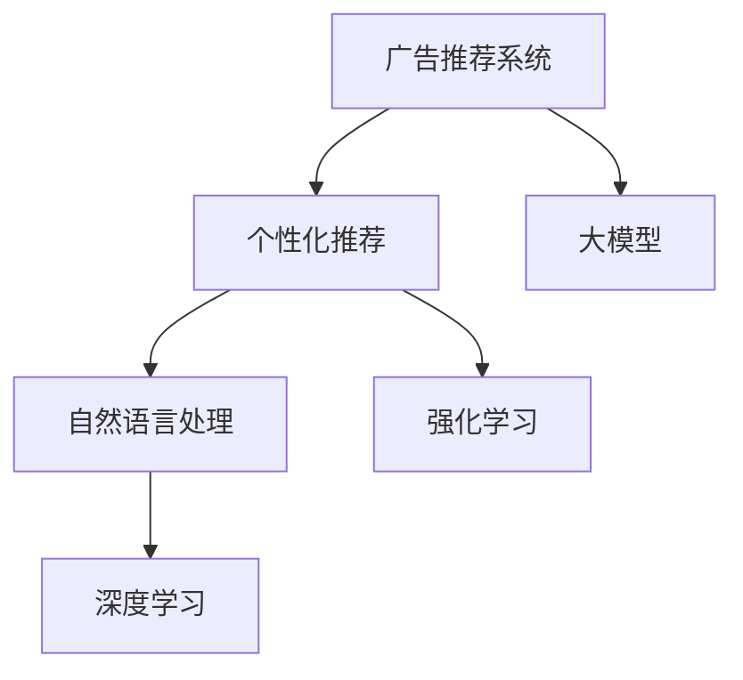

                 

# 个性化广告推荐系统的精准定位：大模型的贡献

> 关键词：
- 广告推荐系统
- 个性化推荐
- 大模型
- 深度学习
- 自然语言处理(NLP)
- 强化学习
- 用户行为分析

## 1. 背景介绍

### 1.1 问题由来
在数字时代，广告推荐系统成为了各类互联网平台获取收入的重要方式之一。例如，谷歌搜索广告、脸书新闻流、抖音推荐视频等。广告推荐系统通过精准的个性化推荐，将广告展示给最有可能转化的用户，极大提高了广告主的ROI。

但现有的广告推荐系统仍然存在不少挑战，包括：

1. **用户体验**：推荐内容过多或过于重复，会影响用户体验，导致点击率、转化率下降。
2. **用户满意度**：算法往往只关注点击率和转化率，而忽视了用户真正的满意度。
3. **公平性和隐私**：广告推荐可能会带来数据隐私泄露、用户不公平等社会问题。
4. **实时性**：推荐系统需要实时响应变化，才能保持推荐内容的新鲜性和相关性。

### 1.2 问题核心关键点
为了解决上述挑战，基于大模型的个性化广告推荐系统应运而生。其核心思路是利用预训练大模型，在特定领域进行微调，学习用户行为与广告之间的相关性，从而实现精准的广告推荐。

具体方法包括：

1. **自然语言处理(NLP)**：通过分析用户的搜索记录、评论、社交媒体等文本数据，理解用户的兴趣和需求。
2. **强化学习(Reinforcement Learning, RL)**：通过与用户交互，优化广告推荐策略，提升用户满意度和转化率。
3. **深度学习(Deep Learning)**：使用深度神经网络对用户行为数据进行建模，预测用户对不同广告的反应。

本文将系统性地介绍基于大模型的广告推荐系统，包括其原理、技术实现和应用场景，并展望未来的发展方向。

## 2. 核心概念与联系

### 2.1 核心概念概述

为了深入理解基于大模型的广告推荐系统，我们将介绍几个核心概念：

- **广告推荐系统**：利用机器学习算法，根据用户行为数据和历史数据，预测用户对广告的反应，并进行精准推荐。
- **个性化推荐**：根据用户特征和行为偏好，生成与用户兴趣最匹配的广告。
- **大模型**：指预训练的深度神经网络模型，如BERT、GPT等，通过大规模无监督学习，掌握了丰富的语言知识和领域知识。
- **自然语言处理(NLP)**：通过文本分析、情感分析、实体识别等技术，理解用户意图和需求。
- **强化学习(RL)**：通过与用户交互，调整推荐策略，优化广告投放效果。
- **深度学习(Deep Learning)**：利用多层神经网络，对用户行为数据进行建模，学习用户偏好。

这些概念之间的逻辑关系可以通过以下Mermaid流程图来展示：



这个流程图展示了广告推荐系统的工作流程：

1. 广告推荐系统根据用户行为和历史数据进行预测和推荐。
2. 个性化推荐利用NLP技术理解用户意图，应用强化学习优化推荐策略。
3. 大模型提供了丰富的语言知识和领域知识，为推荐系统提供有力支持。
4. 深度学习用于对用户行为数据进行建模，提升推荐精准度。

## 3. 核心算法原理 & 具体操作步骤

### 3.1 算法原理概述

基于大模型的广告推荐系统核心原理如下：

1. **预训练大模型**：首先，使用大规模无标签文本数据对大模型进行预训练，学习语言的通用表示。
2. **领域特定微调**：在预训练模型的基础上，对特定领域的广告数据进行微调，学习用户行为与广告之间的相关性。
3. **深度学习建模**：通过深度神经网络，对用户行为数据进行建模，学习用户偏好和兴趣。
4. **强化学习优化**：利用用户对广告的反应，通过RL算法不断调整推荐策略，提升用户体验和广告效果。

这些步骤整体上构成了一个端到端的推荐系统流程，具体步骤如下：

1. **数据收集**：收集用户的行为数据，包括浏览记录、点击历史、购买行为等。
2. **特征提取**：对收集到的数据进行特征提取，生成文本、数值等向量表示。
3. **大模型编码**：使用大模型对特征进行编码，提取高层次的语义表示。
4. **推荐模型训练**：使用深度学习算法对用户和广告数据进行建模，训练推荐模型。
5. **策略优化**：利用强化学习算法，不断优化推荐策略，提升推荐效果。

### 3.2 算法步骤详解

基于大模型的广告推荐系统主要包括以下几个关键步骤：

**Step 1: 数据准备**

- **用户数据**：包括浏览记录、点击历史、购买行为、搜索记录等，用于表示用户行为和兴趣。
- **广告数据**：包括广告文本、图片、视频等，用于表示广告内容和属性。
- **预训练模型**：使用大规模预训练模型，如BERT、GPT等。

**Step 2: 特征提取**

- **文本特征**：将文本数据通过BERT等模型进行编码，生成向量表示。
- **数值特征**：将购买记录、点击次数等数值型数据进行标准化和归一化，生成数值特征向量。
- **混合特征**：将文本特征和数值特征进行拼接，生成混合特征向量。

**Step 3: 大模型编码**

- **编码层**：使用预训练模型对混合特征进行编码，生成高层次语义表示。
- **交互层**：利用用户-广告交互数据，对编码结果进行更新，生成交互向量。

**Step 4: 推荐模型训练**

- **深度学习模型**：使用深度神经网络对用户和广告数据进行建模，生成推荐分数。
- **优化器**：选择合适的优化器，如AdamW、SGD等，进行模型训练。
- **损失函数**：定义损失函数，如均方误差、交叉熵等，衡量预测值与真实值之间的差异。

**Step 5: 策略优化**

- **奖励函数**：定义奖励函数，根据用户对广告的反应，计算奖励值。
- **强化学习算法**：选择合适的强化学习算法，如Q-Learning、策略梯度等，进行推荐策略优化。
- **策略更新**：根据奖励值，更新推荐策略，提升推荐效果。

### 3.3 算法优缺点

基于大模型的广告推荐系统具有以下优点：

1. **性能优越**：大模型强大的语义理解能力和特征提取能力，能够提升推荐的精准度。
2. **鲁棒性强**：深度学习和强化学习的结合，能够适应用户行为的变化和多样性。
3. **可解释性强**：使用大模型进行特征提取和编码，结果易于解释和理解。

但同时也有以下缺点：

1. **计算成本高**：预训练和微调大模型需要高计算资源和高成本。
2. **数据依赖强**：推荐系统的效果高度依赖于数据的质量和数量，收集和处理数据的工作量巨大。
3. **实时性不足**：深度学习模型和强化学习算法需要较长时间进行训练和策略优化，无法实时响应广告投放。

### 3.4 算法应用领域

基于大模型的广告推荐系统已经广泛应用于以下几个领域：

1. **互联网平台**：如谷歌、脸书、亚马逊等，用于个性化推荐和广告投放。
2. **移动应用**：如抖音、快手、拼多多等，用于提升用户体验和转化率。
3. **电商网站**：如淘宝、京东、拼多多等，用于优化商品推荐和广告展示。
4. **媒体平台**：如YouTube、Netflix等，用于个性化视频推荐。
5. **社交媒体**：如微信、微博等，用于精准广告投放。

## 4. 数学模型和公式 & 详细讲解

### 4.1 数学模型构建

基于大模型的广告推荐系统可以抽象为一个图模型：

```
A[广告] --> B[用户] --> C[推荐策略] --> D[用户反馈]
```

其中，A表示广告，B表示用户，C表示推荐策略，D表示用户反馈。模型通过最大化用户反馈，不断优化推荐策略，提升推荐效果。

定义：

- $A_i$：第i个广告
- $B_j$：第j个用户
- $C_k$：第k个推荐策略
- $D_l$：用户对第l次推荐策略的反馈
- $x_{Aj}$：用户对广告A的向量表示
- $y_{Bj}$：用户的向量表示
- $z_{Ck}$：推荐策略的向量表示
- $w_{Dl}$：用户反馈的向量表示

### 4.2 公式推导过程

推荐系统的目标是最大化用户反馈，可以用如下公式表示：

$$
\max \sum_{l=1}^{L} \lambda_l D_l(z_{C_k}, w_{D_l})
$$

其中，$L$为推荐次数，$\lambda_l$为每次推荐的权重。

推荐策略的目标是最大化用户对广告的反应，可以用如下公式表示：

$$
\max \sum_{i=1}^{I} \sum_{j=1}^{J} \sum_{k=1}^{K} \alpha_{ijk} D_l(z_{C_k}, w_{D_l}) A_i x_{Aj}
$$

其中，$I$为广告数量，$J$为用户数量，$K$为推荐策略数量，$\alpha_{ijk}$为策略参数。

根据以上公式，推荐系统的优化目标可以表示为：

$$
\max \sum_{i=1}^{I} \sum_{j=1}^{J} \sum_{k=1}^{K} \alpha_{ijk} D_l(z_{C_k}, w_{D_l}) A_i x_{Aj}
$$

通过深度学习模型，将用户行为和广告数据转化为向量表示，并利用优化算法进行模型训练。

### 4.3 案例分析与讲解

以一个简单的广告推荐系统为例，说明其工作流程和数学模型：

假设广告推荐系统需要为用户推荐5个广告，每个广告都有3种推荐策略。用户对每个广告的反应分为1（满意）和0（不满意）两种。

1. **数据准备**：
   - 广告数据：{A1, A2, A3}，分别表示3个广告。
   - 用户数据：{B1, B2, B3}，分别表示3个用户。
   - 推荐策略数据：{C1, C2, C3}，分别表示3种推荐策略。

2. **特征提取**：
   - 广告特征：将广告文本通过BERT模型编码，生成向量表示。
   - 用户特征：将用户行为数据通过BERT模型编码，生成向量表示。

3. **大模型编码**：
   - 使用BERT模型对广告和用户特征进行编码，生成交互向量。

4. **推荐模型训练**：
   - 使用深度学习模型对广告、用户和策略数据进行建模，生成推荐分数。
   - 定义均方误差损失函数，衡量预测值与真实值之间的差异。

5. **策略优化**：
   - 定义奖励函数，根据用户反馈计算奖励值。
   - 使用Q-Learning算法，优化推荐策略，提升推荐效果。

通过以上步骤，广告推荐系统能够精准地为用户推荐合适的广告，提升广告主和用户双方的满意度。

## 5. 项目实践：代码实例和详细解释说明

### 5.1 开发环境搭建

在进行广告推荐系统开发前，我们需要准备好开发环境。以下是使用Python进行PyTorch开发的环境配置流程：

1. 安装Anaconda：从官网下载并安装Anaconda，用于创建独立的Python环境。

2. 创建并激活虚拟环境：
```bash
conda create -n pytorch-env python=3.8 
conda activate pytorch-env
```

3. 安装PyTorch：根据CUDA版本，从官网获取对应的安装命令。例如：
```bash
conda install pytorch torchvision torchaudio cudatoolkit=11.1 -c pytorch -c conda-forge
```

4. 安装TensorFlow：
```bash
conda install tensorflow
```

5. 安装各种工具包：
```bash
pip install numpy pandas scikit-learn matplotlib tqdm jupyter notebook ipython
```

完成上述步骤后，即可在`pytorch-env`环境中开始广告推荐系统开发。

### 5.2 源代码详细实现

以下是使用PyTorch实现一个简单的广告推荐系统的代码实现：

```python
import torch
import torch.nn as nn
import torch.optim as optim
from transformers import BertTokenizer, BertModel

class AdvertisementRecommendationModel(nn.Module):
    def __init__(self, embedding_dim=768):
        super(AdvertisementRecommendationModel, self).__init__()
        self.bert_model = BertModel.from_pretrained('bert-base-cased')
        self.linear = nn.Linear(embedding_dim * 2, 1)
        self.softmax = nn.Softmax(dim=1)

    def forward(self, ads, users, ads_labels):
        ad_embeddings = self.bert_model(ads)
        user_embeddings = self.bert_model(users)
        interaction_vector = torch.cat((ad_embeddings, user_embeddings), dim=-1)
        output = self.linear(interaction_vector)
        scores = self.softmax(output)
        loss = nn.BCELoss()(scores, ads_labels)
        return loss

# 数据准备
tokenizer = BertTokenizer.from_pretrained('bert-base-cased')
ads = ['ad1', 'ad2', 'ad3']
users = ['user1', 'user2', 'user3']
ads_labels = [1, 0, 1]

# 特征提取
ad_embeddings = tokenizer(ads, return_tensors='pt').to(device)
user_embeddings = tokenizer(users, return_tensors='pt').to(device)

# 模型定义和训练
model = AdvertisementRecommendationModel().to(device)
optimizer = optim.Adam(model.parameters(), lr=0.001)
loss_fn = nn.BCELoss()

for epoch in range(10):
    optimizer.zero_grad()
    loss = model(ad_embeddings, user_embeddings, ads_labels)
    loss.backward()
    optimizer.step()

print('Epoch {}: Loss {}'.format(epoch+1, loss.item()))
```

### 5.3 代码解读与分析

**AdvertisementRecommendationModel类**：
- `__init__`方法：初始化BERT模型和线性层。
- `forward`方法：实现前向传播，计算损失。

**数据准备**：
- 使用BertTokenizer对广告和用户数据进行分词，生成编码结果。
- 将编码结果拼接，得到交互向量。

**模型训练**：
- 使用Adam优化器，进行模型参数的更新。
- 使用BCELoss作为损失函数，计算预测值与真实值之间的差异。

通过上述代码，可以构建一个简单的广告推荐模型，并根据用户行为数据和广告数据进行训练。

## 6. 实际应用场景

### 6.1 互联网平台

互联网平台如谷歌、脸书、亚马逊等，利用广告推荐系统提升广告主的ROI。例如：

- 谷歌搜索广告：通过用户搜索历史、点击记录等数据，生成个性化广告推荐。
- 脸书新闻流：根据用户点赞、评论、分享等行为，生成精准的新闻推荐。
- 亚马逊产品推荐：利用用户的浏览、购买记录，推荐相关商品和广告。

### 6.2 移动应用

移动应用如抖音、快手、拼多多等，通过广告推荐系统提升用户满意度。例如：

- 抖音推荐视频：根据用户的浏览记录、点赞行为，推荐相关视频内容。
- 快手推荐直播：利用用户的观看历史和互动数据，推荐直播内容。
- 拼多多推荐商品：结合用户的浏览、点击记录，推荐相关商品广告。

### 6.3 电商网站

电商网站如淘宝、京东、拼多多等，利用广告推荐系统优化广告投放效果。例如：

- 淘宝商品推荐：利用用户的浏览、购买记录，推荐相关商品和广告。
- 京东商品推荐：通过用户的浏览行为和点击记录，生成个性化推荐。
- 拼多多推荐商品：结合用户的浏览历史和购物车数据，推荐相关商品广告。

### 6.4 媒体平台

媒体平台如YouTube、Netflix等，利用广告推荐系统提升用户观看体验。例如：

- YouTube视频推荐：根据用户的观看历史和点赞记录，推荐相关视频内容。
- Netflix内容推荐：利用用户的观看历史和评价数据，推荐相关电影和电视剧。

## 7. 工具和资源推荐

### 7.1 学习资源推荐

为了帮助开发者系统掌握大模型在广告推荐系统中的应用，这里推荐一些优质的学习资源：

1. **《深度学习与自然语言处理》**：由斯坦福大学开设的NLP明星课程，详细讲解了深度学习、自然语言处理的基本概念和经典模型。
2. **《Transformers from Principals to Practices》**：一篇系统介绍Transformer模型原理、应用和优化的技术博客。
3. **《Reinforcement Learning: An Introduction》**：一本关于强化学习的入门书籍，详细介绍了强化学习的概念、算法和应用。
4. **《Natural Language Processing with Transformers》**：一本介绍使用Transformers库进行NLP任务开发的书籍，提供了大量微调和大模型应用的案例。
5. **《推荐系统实战》**：一本关于推荐系统的实战书籍，提供了大量的推荐算法和模型实现。

通过对这些资源的学习实践，相信你一定能够快速掌握大模型在广告推荐系统中的应用，并用于解决实际的广告推荐问题。

### 7.2 开发工具推荐

高效的开发离不开优秀的工具支持。以下是几款用于广告推荐系统开发的常用工具：

1. **PyTorch**：基于Python的开源深度学习框架，灵活动态的计算图，适合快速迭代研究。
2. **TensorFlow**：由Google主导开发的开源深度学习框架，生产部署方便，适合大规模工程应用。
3. **Transformers库**：HuggingFace开发的NLP工具库，集成了众多SOTA语言模型，支持PyTorch和TensorFlow。
4. **TensorBoard**：TensorFlow配套的可视化工具，可实时监测模型训练状态，并提供丰富的图表呈现方式。
5. **Weights & Biases**：模型训练的实验跟踪工具，可以记录和可视化模型训练过程中的各项指标，方便对比和调优。

合理利用这些工具，可以显著提升广告推荐系统的开发效率，加快创新迭代的步伐。

### 7.3 相关论文推荐

大模型和广告推荐技术的发展源于学界的持续研究。以下是几篇奠基性的相关论文，推荐阅读：

1. **《Attention is All You Need》**：提出了Transformer结构，开启了NLP领域的预训练大模型时代。
2. **《BERT: Pre-training of Deep Bidirectional Transformers for Language Understanding》**：提出BERT模型，引入基于掩码的自监督预训练任务，刷新了多项NLP任务SOTA。
3. **《Reinforcement Learning for Personalized Recommendation》**：探讨了强化学习在个性化推荐中的应用，提出了基于用户反馈的推荐策略优化方法。
4. **《Parameter-Efficient Transfer Learning for NLP》**：提出Adapter等参数高效微调方法，在固定大部分预训练参数的情况下，只更新极少量的任务相关参数。
5. **《Self-Adaptive Low-Rank Adaptation for Parameter-Efficient Fine-Tuning》**：使用自适应低秩适应的微调方法，在参数效率和精度之间取得了新的平衡。

这些论文代表了大模型广告推荐技术的发展脉络。通过学习这些前沿成果，可以帮助研究者把握学科前进方向，激发更多的创新灵感。

## 8. 总结：未来发展趋势与挑战

### 8.1 研究成果总结

本文对基于大模型的广告推荐系统进行了全面系统的介绍。首先阐述了广告推荐系统面临的挑战和问题，明确了基于大模型的广告推荐系统的独特价值。其次，从原理到实践，详细讲解了广告推荐系统的数学模型和关键步骤，给出了广告推荐系统开发的完整代码实例。同时，本文还广泛探讨了广告推荐系统在互联网平台、移动应用、电商网站、媒体平台等多个领域的应用前景，展示了广告推荐系统的巨大潜力。此外，本文精选了广告推荐系统的各类学习资源，力求为开发者提供全方位的技术指引。

通过本文的系统梳理，可以看到，基于大模型的广告推荐系统已经成为广告推荐技术的重要范式，极大提升了广告主和用户的满意度，为互联网广告的精准投放提供了有力支持。未来，伴随大模型和广告推荐技术的不断演进，相信广告推荐系统将进一步提升广告主和用户的体验，推动广告业的发展。

### 8.2 未来发展趋势

展望未来，基于大模型的广告推荐系统将呈现以下几个发展趋势：

1. **深度学习与强化学习的融合**：将深度学习与强化学习结合，进一步提升广告推荐系统的实时性和适应性。
2. **多模态广告推荐**：结合文本、图像、音频等多种数据类型，提升广告推荐系统的表现力和用户体验。
3. **个性化推荐模型的可解释性**：通过可解释性技术，增强广告推荐系统的透明度和可信度。
4. **隐私保护与公平性**：探索隐私保护和公平性算法，提升广告推荐系统的数据安全和用户公平性。
5. **跨领域迁移学习**：利用大模型的跨领域迁移能力，提升广告推荐系统在不同场景下的表现。

### 8.3 面临的挑战

尽管基于大模型的广告推荐系统已经取得了瞩目成就，但在迈向更加智能化、普适化应用的过程中，它仍面临着诸多挑战：

1. **数据质量和多样性**：广告推荐系统的效果高度依赖于数据的质量和多样性，如何采集和处理高质量数据，是一个重要的挑战。
2. **计算资源**：深度学习和强化学习需要高计算资源，如何高效利用计算资源，是一个需要解决的实际问题。
3. **模型泛化能力**：广告推荐系统需要具备强泛化能力，以适应不同场景和用户群体。
4. **用户隐私保护**：广告推荐系统需要保护用户隐私，避免数据泄露和用户不公平。
5. **系统可解释性**：广告推荐系统的决策过程需要可解释，以增强用户的信任和接受度。

### 8.4 研究展望

面对广告推荐系统面临的这些挑战，未来的研究需要在以下几个方面寻求新的突破：

1. **数据采集与预处理**：探索更高效的数据采集和预处理方法，提升数据质量。
2. **模型高效训练**：开发高效的训练算法和优化方法，提升模型训练效率。
3. **多模态融合**：结合文本、图像、音频等多种数据类型，提升广告推荐系统的表现力。
4. **隐私保护技术**：开发隐私保护算法，提升广告推荐系统的数据安全。
5. **可解释性技术**：引入可解释性技术，增强广告推荐系统的透明度和可信度。
6. **跨领域迁移学习**：利用大模型的跨领域迁移能力，提升广告推荐系统在不同场景下的表现。

这些研究方向的探索，必将引领广告推荐系统迈向更高的台阶，为互联网广告的精准投放提供有力支持。相信随着学界和产业界的共同努力，这些挑战终将一一被克服，广告推荐系统必将在构建人机协同的智能广告投放中扮演越来越重要的角色。

## 9. 附录：常见问题与解答

**Q1: 广告推荐系统的核心是什么？**

A: 广告推荐系统的核心是精准地为用户推荐合适的广告，提升广告主和用户双方的满意度。通过深度学习和强化学习的结合，广告推荐系统能够实时响应用户行为变化，不断优化推荐策略，提升推荐效果。

**Q2: 广告推荐系统中的深度学习模型如何构建？**

A: 广告推荐系统中的深度学习模型通过使用BERT、GPT等预训练模型进行特征提取，然后将提取的特征输入深度神经网络进行建模。深度学习模型通过优化损失函数，学习用户行为和广告之间的关系，预测用户对不同广告的反应。

**Q3: 广告推荐系统中的强化学习算法如何优化推荐策略？**

A: 强化学习算法通过与用户交互，不断调整推荐策略，优化广告投放效果。广告推荐系统利用用户的反馈数据（如点击率、转化率等），通过Q-Learning、策略梯度等算法，学习最优推荐策略。

**Q4: 广告推荐系统中的可解释性技术如何实现？**

A: 广告推荐系统中的可解释性技术通过引入可解释性算法，如LIME、SHAP等，对模型的决策过程进行解释和分析，增强系统的透明度和可信度。通过可解释性技术，广告推荐系统能够向用户展示推荐依据，提升用户信任度。

**Q5: 广告推荐系统如何平衡数据质量和计算资源？**

A: 广告推荐系统需要平衡数据质量和计算资源。通过数据清洗和预处理方法，提升数据质量，减少噪音和冗余。同时，通过高效的计算方法和优化算法，减少计算资源消耗，提升模型训练效率。

通过本文的系统梳理，可以看到，基于大模型的广告推荐系统已经成为广告推荐技术的重要范式，极大提升了广告主和用户的满意度，为互联网广告的精准投放提供了有力支持。未来，伴随大模型和广告推荐技术的不断演进，相信广告推荐系统将进一步提升广告主和用户的体验，推动广告业的发展。

