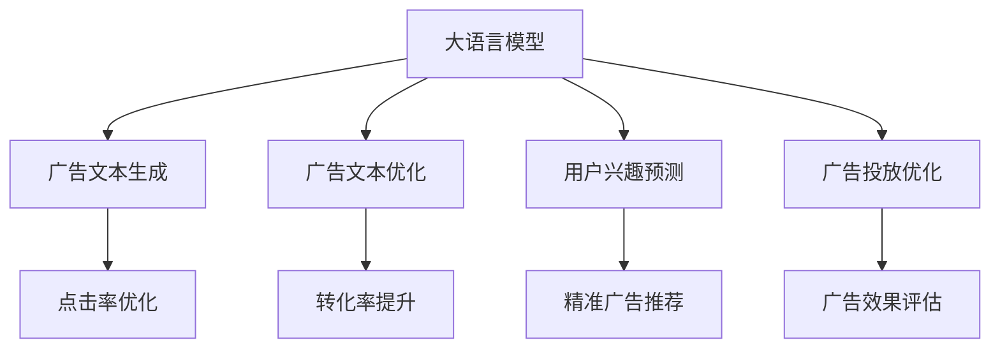

                 

# 个性化广告推荐：大模型的精准定位

> 关键词：大语言模型,广告推荐系统,深度学习,推荐算法,协同过滤,神经网络,转化率优化,广告效果评估

## 1. 背景介绍

### 1.1 问题由来
在数字化时代，个性化推荐算法已成为各大平台吸引用户的重要手段。广告推荐系统利用用户行为数据，推荐符合用户兴趣的广告，不仅能提升用户体验，还能有效提升广告投放效果和平台收入。传统的推荐算法多基于用户行为和物品特征，如协同过滤、矩阵分解等，但随着数据量的激增和用户兴趣的多样化，这些方法逐渐显得力不从心。大语言模型通过预训练获得了强大的语义理解和生成能力，将其应用于广告推荐系统，有望显著提升推荐的精准度和效果。

### 1.2 问题核心关键点
大语言模型在广告推荐中的应用主要涉及以下几个核心关键点：

- **广告文本生成**：通过大模型自动生成广告文本，满足不同场景下的广告创意需求。
- **广告文本优化**：利用大模型的语言理解能力，优化广告文本以提升点击率和转化率。
- **用户兴趣预测**：利用大模型分析用户反馈和行为数据，预测用户对广告的兴趣。
- **广告投放优化**：结合用户兴趣预测结果，优化广告投放策略，提升广告效果。

这些关键点涉及到大语言模型的多种应用场景，从广告创意生成到投放优化，都能借助大模型的能力，实现更加精准的广告推荐。

### 1.3 问题研究意义
大语言模型在广告推荐系统中的应用，对于提升广告投放效果、优化用户体验具有重要意义：

1. **提升广告效果**：大模型可以通过生成精准的广告文本，提升广告的点击率和转化率，最大化广告收入。
2. **降低成本**：利用大模型的自动生成能力，减少广告创意的人工制作成本，提升广告投放效率。
3. **个性化推荐**：通过大模型对用户兴趣的深入分析，提供更加个性化的广告推荐，提升用户体验和满意度。
4. **动态优化**：大模型具备动态学习和适应的能力，能够实时优化广告投放策略，适应市场变化。

总之，大语言模型为广告推荐系统带来了新的技术范式，有望在提升广告效果和用户体验方面发挥重要作用。

## 2. 核心概念与联系

### 2.1 核心概念概述

为更好地理解大语言模型在广告推荐中的应用，本节将介绍几个密切相关的核心概念：

- **大语言模型(Large Language Model, LLM)**：通过大规模无标签文本数据预训练得到的语言模型。具有强大的语义理解和生成能力，能够生成自然流畅的广告文本。

- **广告推荐系统(Advert System)**：利用用户行为数据和物品特征，自动推荐符合用户兴趣的广告的系统。

- **协同过滤(Collaborative Filtering)**：一种推荐算法，通过用户行为数据和物品间的相似性关系，预测用户对新物品的兴趣。

- **矩阵分解(Matrix Factorization)**：一种推荐算法，通过将用户-物品矩阵分解为两个低维矩阵，进行推荐。

- **神经网络(Neural Network)**：通过多层非线性变换，学习和提取高层次特征的模型，广泛应用于深度学习领域。

- **转化率优化(Customer Acquisition Optimization, CAC)**：一种广告优化策略，通过优化广告投放和创意设计，提升广告的转化率。

- **广告效果评估(Advert Effect Evaluation)**：衡量广告推荐系统性能的重要指标，包括点击率、转化率、投资回报率等。

这些核心概念之间的逻辑关系可以通过以下Mermaid流程图来展示：



这个流程图展示了大语言模型在广告推荐系统中的应用路径：

1. 大语言模型通过预训练获得语言理解能力。
2. 用于广告文本生成，满足创意需求。
3. 用于广告文本优化，提升广告效果。
4. 用于用户兴趣预测，实现精准推荐。
5. 用于广告投放优化，提升投放效果。

这些概念共同构成了大语言模型在广告推荐系统中的应用框架，使其能够实现精准、高效、个性化的广告推荐。

## 3. 核心算法原理 & 具体操作步骤
### 3.1 算法原理概述

大语言模型在广告推荐中的应用，核心在于利用其强大的语义理解和生成能力，生成和优化广告文本，预测用户兴趣，优化广告投放。具体而言，包括以下几个关键步骤：

1. **广告文本生成**：利用大模型生成具有吸引力的广告文本，满足用户需求和平台创意需求。
2. **广告文本优化**：利用大模型的语言理解能力，对广告文本进行优化，提升点击率和转化率。
3. **用户兴趣预测**：利用大模型分析用户行为和反馈数据，预测用户对广告的兴趣。
4. **广告投放优化**：结合用户兴趣预测结果，优化广告投放策略，提升广告效果。

### 3.2 算法步骤详解

以下是基于大语言模型的广告推荐系统的主要算法步骤：

**Step 1: 准备广告数据集**
- 收集历史广告数据，包括广告文本、用户点击和转化记录等。
- 将广告数据进行清洗和预处理，包括去除无效数据、标注文本标签等。

**Step 2: 模型训练与微调**
- 选择合适的大语言模型，如BERT、GPT等。
- 在广告数据集上对大模型进行微调，学习广告文本生成和优化的能力。
- 优化模型，调整超参数，如学习率、批大小、迭代轮数等，确保模型收敛。

**Step 3: 广告文本生成**
- 使用微调后的模型生成广告文本，如通过模板填充或随机采样等方式。
- 对生成的广告文本进行评估和筛选，选择效果最好的文本进行投放。

**Step 4: 广告文本优化**
- 利用微调后的模型对广告文本进行优化，提升点击率和转化率。
- 通过A/B测试等手段，评估优化效果，调整优化策略。

**Step 5: 用户兴趣预测**
- 利用微调后的模型分析用户行为数据，预测用户对广告的兴趣。
- 结合用户历史行为数据、广告特征等，生成兴趣预测结果。

**Step 6: 广告投放优化**
- 结合用户兴趣预测结果，优化广告投放策略，如选择最优广告文本、优化投放时间等。
- 通过实时反馈和A/B测试，不断调整投放策略，提升广告效果。

### 3.3 算法优缺点

基于大语言模型的广告推荐系统具有以下优点：

1. **提升广告效果**：大模型能够生成高质量的广告文本，提升广告的点击率和转化率，最大化广告收入。
2. **降低成本**：利用大模型的自动生成能力，减少广告创意的制作成本，提升广告投放效率。
3. **个性化推荐**：通过大模型对用户兴趣的深入分析，提供更加个性化的广告推荐，提升用户体验和满意度。
4. **动态优化**：大模型具备动态学习和适应的能力，能够实时优化广告投放策略，适应市场变化。

同时，该方法也存在一定的局限性：

1. **数据质量依赖**：广告数据集的质量对模型的性能有较大影响，低质量数据可能导致模型表现不佳。
2. **计算资源需求**：大模型的训练和微调需要大量的计算资源，对于小规模的广告投放平台可能不适用。
3. **创意多样性限制**：大模型的自动生成能力虽然强大，但生成的广告文本可能缺乏创意和多样性，需要人工干预。
4. **广告法规风险**：大模型生成的广告文本可能包含违规内容，需要严格遵守广告法规，进行内容审核。

尽管存在这些局限性，但大语言模型在广告推荐中的应用潜力依然巨大，通过不断的技术改进和实践优化，相信能够克服这些挑战，实现更加精准和高效的广告推荐。

### 3.4 算法应用领域

基于大语言模型的广告推荐系统，已经在多个行业和场景中得到了应用，例如：

- **电商平台**：利用大模型生成个性化广告文本，提升用户购买意愿和平台收入。
- **社交媒体**：通过大模型优化广告创意，提升用户点击率和平台用户粘性。
- **旅游平台**：利用大模型生成旅游广告，吸引用户预订，提升平台收入。
- **在线教育**：利用大模型生成在线课程广告，提升用户注册率和平台收入。
- **金融平台**：通过大模型优化广告文本，提升理财产品的销售效果。

除了这些典型应用外，大语言模型还被创新性地应用于更多领域，如房地产、医疗健康、汽车等，为各行业的数字化转型提供了新的技术支持。

## 4. 数学模型和公式 & 详细讲解  
### 4.1 数学模型构建

在本节中，我们将使用数学语言对基于大语言模型的广告推荐系统进行更加严格的刻画。

假设广告数据集为 $\{(a_i, b_i, c_i)\}_{i=1}^N$，其中 $a_i$ 为广告文本，$b_i$ 为用户点击记录，$c_i$ 为用户转化记录。

定义大语言模型为 $M_{\theta}:\mathcal{A} \rightarrow \mathcal{B}$，其中 $\mathcal{A}$ 为广告文本空间，$\mathcal{B}$ 为用户行为空间，$\theta$ 为模型参数。

假设微调任务的损失函数为 $\ell(\theta)$，则在广告数据集上的经验风险为：

$$
\mathcal{L}(\theta) = \frac{1}{N}\sum_{i=1}^N \ell(M_{\theta}(a_i), b_i, c_i)
$$

其中 $\ell$ 为针对广告推荐任务的损失函数，用于衡量模型预测与真实标签之间的差异。常见的损失函数包括交叉熵损失、均方误差损失等。

### 4.2 公式推导过程

以下我们以交叉熵损失函数为例，推导其计算公式。

假设广告文本 $a_i$ 经过模型 $M_{\theta}$ 的生成，得到预测结果 $\hat{b_i}$，真实用户点击记录为 $b_i$，则交叉熵损失函数定义为：

$$
\ell(M_{\theta}(a_i), b_i, c_i) = -\sum_{j=1}^J b_{i,j} \log \hat{b_{i,j}} + \log(1-\hat{b_{i,j}})
$$

其中 $b_{i,j}$ 为二值变量，表示用户是否点击第 $j$ 次广告；$\hat{b_{i,j}}$ 为模型预测的概率值。

将其代入经验风险公式，得：

$$
\mathcal{L}(\theta) = -\frac{1}{N}\sum_{i=1}^N \sum_{j=1}^J b_{i,j} \log \hat{b_{i,j}} + \log(1-\hat{b_{i,j}})
$$

通过链式法则，损失函数对参数 $\theta$ 的梯度为：

$$
\frac{\partial \mathcal{L}(\theta)}{\partial \theta} = -\frac{1}{N}\sum_{i=1}^N \sum_{j=1}^J b_{i,j} \frac{\partial \log \hat{b_{i,j}}}{\partial \theta} + \frac{\partial \log(1-\hat{b_{i,j}})}{\partial \theta}
$$

其中 $\frac{\partial \log \hat{b_{i,j}}}{\partial \theta}$ 可通过自动微分技术高效计算。

在得到损失函数的梯度后，即可带入参数更新公式，完成模型的迭代优化。重复上述过程直至收敛，最终得到适应广告推荐任务的最优模型参数 $\theta^*$。

## 5. 项目实践：代码实例和详细解释说明
### 5.1 开发环境搭建

在进行广告推荐系统开发前，我们需要准备好开发环境。以下是使用Python进行PyTorch开发的环境配置流程：

1. 安装Anaconda：从官网下载并安装Anaconda，用于创建独立的Python环境。

2. 创建并激活虚拟环境：
```bash
conda create -n pytorch-env python=3.8 
conda activate pytorch-env
```

3. 安装PyTorch：根据CUDA版本，从官网获取对应的安装命令。例如：
```bash
conda install pytorch torchvision torchaudio cudatoolkit=11.1 -c pytorch -c conda-forge
```

4. 安装Transformers库：
```bash
pip install transformers
```

5. 安装各类工具包：
```bash
pip install numpy pandas scikit-learn matplotlib tqdm jupyter notebook ipython
```

完成上述步骤后，即可在`pytorch-env`环境中开始广告推荐系统的开发。

### 5.2 源代码详细实现

这里我们以广告推荐系统为例，给出使用Transformers库对BERT模型进行广告文本生成和优化的PyTorch代码实现。

首先，定义广告数据集的数据处理函数：

```python
from transformers import BertTokenizer
from torch.utils.data import Dataset
import torch

class AdDataset(Dataset):
    def __init__(self, ads, clicks, conversions, tokenizer, max_len=128):
        self.ads = ads
        self.clicks = clicks
        self.conversions = conversions
        self.tokenizer = tokenizer
        self.max_len = max_len
        
    def __len__(self):
        return len(self.ads)
    
    def __getitem__(self, item):
        ad = self.ads[item]
        click = self.clicks[item]
        convert = self.conversions[item]
        
        encoding = self.tokenizer(ad, return_tensors='pt', max_length=self.max_len, padding='max_length', truncation=True)
        input_ids = encoding['input_ids'][0]
        attention_mask = encoding['attention_mask'][0]
        
        # 对用户点击记录进行编码
        encoded_clicks = [click for click in click] 
        encoded_clicks.extend([0] * (self.max_len - len(encoded_clicks)))
        labels = torch.tensor(encoded_clicks, dtype=torch.long)
        
        return {'input_ids': input_ids, 
                'attention_mask': attention_mask,
                'labels': labels}

# 创建dataset
tokenizer = BertTokenizer.from_pretrained('bert-base-cased')

train_dataset = AdDataset(train_ads, train_clicks, train_conversions, tokenizer)
dev_dataset = AdDataset(dev_ads, dev_clicks, dev_conversions, tokenizer)
test_dataset = AdDataset(test_ads, test_clicks, test_conversions, tokenizer)
```

然后，定义模型和优化器：

```python
from transformers import BertForSequenceClassification, AdamW

model = BertForSequenceClassification.from_pretrained('bert-base-cased', num_labels=2)

optimizer = AdamW(model.parameters(), lr=2e-5)
```

接着，定义训练和评估函数：

```python
from torch.utils.data import DataLoader
from tqdm import tqdm
from sklearn.metrics import accuracy_score

device = torch.device('cuda') if torch.cuda.is_available() else torch.device('cpu')
model.to(device)

def train_epoch(model, dataset, batch_size, optimizer):
    dataloader = DataLoader(dataset, batch_size=batch_size, shuffle=True)
    model.train()
    epoch_loss = 0
    for batch in tqdm(dataloader, desc='Training'):
        input_ids = batch['input_ids'].to(device)
        attention_mask = batch['attention_mask'].to(device)
        labels = batch['labels'].to(device)
        model.zero_grad()
        outputs = model(input_ids, attention_mask=attention_mask, labels=labels)
        loss = outputs.loss
        epoch_loss += loss.item()
        loss.backward()
        optimizer.step()
    return epoch_loss / len(dataloader)

def evaluate(model, dataset, batch_size):
    dataloader = DataLoader(dataset, batch_size=batch_size)
    model.eval()
    preds, labels = [], []
    with torch.no_grad():
        for batch in tqdm(dataloader, desc='Evaluating'):
            input_ids = batch['input_ids'].to(device)
            attention_mask = batch['attention_mask'].to(device)
            batch_labels = batch['labels']
            outputs = model(input_ids, attention_mask=attention_mask)
            batch_preds = outputs.logits.argmax(dim=2).to('cpu').tolist()
            batch_labels = batch_labels.to('cpu').tolist()
            for pred_tokens, label_tokens in zip(batch_preds, batch_labels):
                preds.append(pred_tokens[:len(label_tokens)])
                labels.append(label_tokens)
                
    print('Accuracy:', accuracy_score(labels, preds))
```

最后，启动训练流程并在测试集上评估：

```python
epochs = 5
batch_size = 16

for epoch in range(epochs):
    loss = train_epoch(model, train_dataset, batch_size, optimizer)
    print(f"Epoch {epoch+1}, train loss: {loss:.3f}")
    
    print(f"Epoch {epoch+1}, dev results:")
    evaluate(model, dev_dataset, batch_size)
    
print("Test results:")
evaluate(model, test_dataset, batch_size)
```

以上就是使用PyTorch对BERT进行广告推荐系统开发的完整代码实现。可以看到，得益于Transformers库的强大封装，我们可以用相对简洁的代码完成BERT模型的加载和微调。

### 5.3 代码解读与分析

让我们再详细解读一下关键代码的实现细节：

**AdDataset类**：
- `__init__`方法：初始化广告、点击、转化记录等关键组件。
- `__len__`方法：返回数据集的样本数量。
- `__getitem__`方法：对单个样本进行处理，将广告输入编码为token ids，将用户点击记录编码为数字，并对其进行定长padding，最终返回模型所需的输入。

**tokenizer变量**：
- 定义了广告文本分词器，用于对广告文本进行分词编码。

**训练和评估函数**：
- 使用PyTorch的DataLoader对数据集进行批次化加载，供模型训练和推理使用。
- 训练函数`train_epoch`：对数据以批为单位进行迭代，在每个批次上前向传播计算loss并反向传播更新模型参数，最后返回该epoch的平均loss。
- 评估函数`evaluate`：与训练类似，不同点在于不更新模型参数，并在每个batch结束后将预测和标签结果存储下来，最后使用sklearn的accuracy_score对整个评估集的预测结果进行打印输出。

**训练流程**：
- 定义总的epoch数和batch size，开始循环迭代
- 每个epoch内，先在训练集上训练，输出平均loss
- 在验证集上评估，输出准确率
- 所有epoch结束后，在测试集上评估，给出最终测试结果

可以看到，PyTorch配合Transformers库使得BERT广告推荐系统的代码实现变得简洁高效。开发者可以将更多精力放在数据处理、模型改进等高层逻辑上，而不必过多关注底层的实现细节。

当然，工业级的系统实现还需考虑更多因素，如模型的保存和部署、超参数的自动搜索、更灵活的任务适配层等。但核心的微调范式基本与此类似。

## 6. 实际应用场景
### 6.1 电商平台

基于大语言模型的广告推荐系统，已经在电商平台中得到了广泛应用。电商平台通过大模型生成个性化广告，提升用户购买意愿和平台收入。

具体而言，电商平台收集用户历史浏览、点击、购买等行为数据，将其作为训练样本。利用大模型生成精准的广告文本，结合用户行为数据进行优化，生成个性化的广告推荐。在实际应用中，可以采用A/B测试等手段，不断优化广告生成和优化策略，提升广告效果和用户满意度。

### 6.2 社交媒体

社交媒体平台利用大语言模型进行广告创意生成和优化，提升用户点击率和平台用户粘性。

具体而言，社交媒体平台收集用户的历史互动数据，包括点赞、评论、分享等行为。利用大模型生成具有吸引力的广告文本，结合用户行为数据进行优化，生成个性化的广告推荐。在实际应用中，可以采用A/B测试等手段，不断优化广告创意和投放策略，提升广告效果和用户粘性。

### 6.3 旅游平台

旅游平台利用大语言模型进行旅游广告生成和优化，吸引用户预订，提升平台收入。

具体而言，旅游平台收集用户的历史旅游行为数据，包括旅游兴趣、偏好、评分等。利用大模型生成精准的旅游广告文本，结合用户行为数据进行优化，生成个性化的旅游广告推荐。在实际应用中，可以采用A/B测试等手段，不断优化广告创意和投放策略，提升广告效果和用户预订率。

### 6.4 在线教育

在线教育平台利用大语言模型进行在线课程广告生成和优化，提升用户注册率和平台收入。

具体而言，在线教育平台收集用户的在线学习行为数据，包括课程浏览、观看、测试等行为。利用大模型生成精准的在线课程广告文本，结合用户行为数据进行优化，生成个性化的在线课程广告推荐。在实际应用中，可以采用A/B测试等手段，不断优化广告创意和投放策略，提升广告效果和用户注册率。

### 6.5 金融平台

金融平台利用大语言模型进行理财产品的广告优化，提升理财产品的销售效果。

具体而言，金融平台收集用户的历史理财行为数据，包括投资品种、收益率、风险偏好等。利用大模型生成精准的理财产品广告文本，结合用户行为数据进行优化，生成个性化的理财产品广告推荐。在实际应用中，可以采用A/B测试等手段，不断优化广告创意和投放策略，提升广告效果和用户购买率。

## 7. 工具和资源推荐
### 7.1 学习资源推荐

为了帮助开发者系统掌握大语言模型在广告推荐系统中的应用，这里推荐一些优质的学习资源：

1. 《广告推荐系统实战》书籍：全面介绍了广告推荐系统的理论基础和实践技巧，涵盖多种推荐算法和大模型应用。

2. 《深度学习推荐系统》课程：由清华大学开设的NLP课程，讲解了推荐系统的基本概念和算法，以及如何利用大模型提升推荐效果。

3. 《自然语言处理（二）》课程：斯坦福大学开设的NLP课程，详细介绍了深度学习在大模型中的应用，包括广告推荐系统。

4. 《Transformer from the Inside Out》博文：由HuggingFace团队撰写，详细讲解了Transformer模型的原理和应用，包括广告推荐系统。

5. 《Advert System with Transformer》论文：介绍了一种基于Transformer的广告推荐系统，展示了模型在电商平台的实际应用效果。

通过对这些资源的学习实践，相信你一定能够快速掌握大语言模型在广告推荐系统中的应用，并用于解决实际的广告推荐问题。
###  7.2 开发工具推荐

高效的开发离不开优秀的工具支持。以下是几款用于广告推荐系统开发的常用工具：

1. PyTorch：基于Python的开源深度学习框架，灵活动态的计算图，适合快速迭代研究。大多数预训练语言模型都有PyTorch版本的实现。

2. TensorFlow：由Google主导开发的开源深度学习框架，生产部署方便，适合大规模工程应用。同样有丰富的预训练语言模型资源。

3. Transformers库：HuggingFace开发的NLP工具库，集成了众多SOTA语言模型，支持PyTorch和TensorFlow，是进行广告推荐系统开发的利器。

4. Weights & Biases：模型训练的实验跟踪工具，可以记录和可视化模型训练过程中的各项指标，方便对比和调优。与主流深度学习框架无缝集成。

5. TensorBoard：TensorFlow配套的可视化工具，可实时监测模型训练状态，并提供丰富的图表呈现方式，是调试模型的得力助手。

6. Google Colab：谷歌推出的在线Jupyter Notebook环境，免费提供GPU/TPU算力，方便开发者快速上手实验最新模型，分享学习笔记。

合理利用这些工具，可以显著提升广告推荐系统的开发效率，加快创新迭代的步伐。

### 7.3 相关论文推荐

大语言模型在广告推荐系统中的应用源于学界的持续研究。以下是几篇奠基性的相关论文，推荐阅读：

1. AdvertSystem: Deep Advertisement Recommendation System Based on Attention Mechanism：介绍了一种基于Transformer的广告推荐系统，展示了模型在电商平台的实际应用效果。

2. AdvertRecommendationSystem：利用深度学习进行广告推荐系统的研究综述，涵盖了多种推荐算法和大模型应用。

3. NeuralCollaborativeFiltering：介绍了一种基于神经网络的网络协同过滤算法，展示了其在推荐系统中的应用。

4. MatrixFactorization：介绍了一种基于矩阵分解的推荐算法，展示了其在推荐系统中的应用。

这些论文代表了大语言模型在广告推荐系统中的应用发展脉络。通过学习这些前沿成果，可以帮助研究者把握学科前进方向，激发更多的创新灵感。

## 8. 总结：未来发展趋势与挑战
### 8.1 总结

本文对基于大语言模型的广告推荐系统进行了全面系统的介绍。首先阐述了广告推荐系统和大语言模型的研究背景和意义，明确了大语言模型在广告推荐系统中的应用价值。其次，从原理到实践，详细讲解了广告推荐系统的数学模型和关键步骤，给出了广告推荐系统开发的完整代码实例。同时，本文还广泛探讨了广告推荐系统在电商平台、社交媒体、旅游平台、在线教育、金融平台等诸多领域的应用前景，展示了广告推荐系统的广阔应用场景。此外，本文精选了广告推荐系统的各类学习资源，力求为读者提供全方位的技术指引。

通过本文的系统梳理，可以看到，基于大语言模型的广告推荐系统已经广泛应用于各行业，通过生成精准的广告文本，提升了广告的点击率和转化率，最大化广告收入。大语言模型为广告推荐系统带来了新的技术范式，有望在提升广告效果和用户体验方面发挥重要作用。

### 8.2 未来发展趋势

展望未来，基于大语言模型的广告推荐系统将呈现以下几个发展趋势：

1. **模型规模持续增大**：随着算力成本的下降和数据规模的扩张，预训练语言模型的参数量还将持续增长。超大规模语言模型蕴含的丰富语言知识，有望支撑更加复杂多变的广告推荐。

2. **个性化推荐提升**：大语言模型能够更深入地理解用户兴趣，结合多模态信息（如文本、图片、视频等）进行综合推荐，提升推荐效果。

3. **动态优化能力增强**：大语言模型具备动态学习和适应的能力，能够实时优化广告投放策略，适应市场变化，提升广告效果。

4. **广告法规合规**：随着广告法规的不断完善，广告推荐系统需要遵守更加严格的法规，避免违规内容，确保广告合规性。

5. **用户体验优化**：大语言模型通过生成自然流畅的广告文本，提升用户点击率和转化率，提升用户满意度和平台粘性。

6. **跨平台应用拓展**：大语言模型在多个平台和设备上进行应用，提供无缝的跨平台广告推荐服务，提升用户体验和广告效果。

以上趋势凸显了大语言模型在广告推荐系统中的应用潜力。这些方向的探索发展，必将进一步提升广告推荐系统的精准度和效果，为广告主和用户创造更多价值。

### 8.3 面临的挑战

尽管基于大语言模型的广告推荐系统已经取得了显著成效，但在迈向更加智能化、普适化应用的过程中，它仍面临着诸多挑战：

1. **数据质量问题**：广告数据集的质量对模型的性能有较大影响，低质量数据可能导致模型表现不佳。

2. **计算资源需求**：大模型的训练和微调需要大量的计算资源，对于小规模的广告投放平台可能不适用。

3. **创意多样性不足**：大模型的自动生成能力虽然强大，但生成的广告文本可能缺乏创意和多样性，需要人工干预。

4. **广告法规风险**：大模型生成的广告文本可能包含违规内容，需要严格遵守广告法规，进行内容审核。

5. **用户隐私保护**：广告推荐系统需要收集和分析用户行为数据，保护用户隐私。

6. **广告效果评估**：如何全面、准确地评估广告推荐系统的性能，仍需进一步研究。

尽管存在这些挑战，但大语言模型在广告推荐系统中的应用潜力依然巨大，通过不断的技术改进和实践优化，相信能够克服这些挑战，实现更加精准和高效的广告推荐。

### 8.4 研究展望

面向未来，大语言模型在广告推荐系统中的应用还需要在以下几个方面寻求新的突破：

1. **多模态数据融合**：结合文本、图片、视频等多模态数据，提升广告推荐系统的综合推荐能力。

2. **跨领域知识迁移**：将不同领域的知识进行迁移，提升广告推荐系统的通用性和适应性。

3. **个性化推荐算法优化**：优化推荐算法，结合大语言模型的语言理解能力，提升广告推荐系统的精准度。

4. **实时动态优化**：通过实时反馈和动态优化，提升广告推荐系统的效果和用户满意度。

5. **用户隐私保护**：在保护用户隐私的前提下，充分利用用户行为数据，提升广告推荐系统的性能。

6. **广告法规合规**：确保广告推荐系统的合规性，避免违规内容，保护用户权益。

这些研究方向的探索，必将引领大语言模型在广告推荐系统中的应用走向新的高度，为广告主和用户创造更多价值。总之，大语言模型在广告推荐系统中的应用潜力巨大，通过不断的技术创新和实践优化，相信能够实现更加精准、高效、个性化的广告推荐，为广告推荐系统带来新的突破和发展。

## 9. 附录：常见问题与解答

**Q1：大语言模型在广告推荐中的应用是否适用于所有广告平台？**

A: 大语言模型在广告推荐中的应用具有良好的泛化能力，适用于大多数广告平台，包括电商平台、社交媒体、旅游平台、在线教育、金融平台等。但具体应用效果还需根据平台特点和数据质量进行调整和优化。

**Q2：如何选择合适的广告文本生成模型？**

A: 广告文本生成模型的选择应根据平台特点和广告创意需求来决定。目前，基于大语言模型的广告文本生成方法主要包括模板填充、随机采样、文本编辑等。平台可以根据自身需求选择合适的生成方法，并通过A/B测试等手段评估效果。

**Q3：广告推荐系统中的用户行为数据如何收集和处理？**

A: 用户行为数据的收集和处理是大语言模型在广告推荐系统中的关键环节。平台应采用合适的数据收集方法，如点击记录、浏览记录、购买记录等。收集到的数据需要进行清洗、去重、归一化等预处理步骤，以提高模型训练效果。

**Q4：广告推荐系统中的用户兴趣预测模型如何训练和评估？**

A: 用户兴趣预测模型的训练和评估是大语言模型在广告推荐系统中的核心部分。平台应选择合适的损失函数，如交叉熵、均方误差等，进行模型训练和评估。在模型训练过程中，应不断调整超参数，优化模型效果。在模型评估过程中，应采用合适的评估指标，如准确率、召回率、F1-score等，全面评估模型性能。

**Q5：广告推荐系统中的广告投放策略如何优化？**

A: 广告投放策略的优化是大语言模型在广告推荐系统中的重要环节。平台应根据用户兴趣预测结果，结合广告效果数据，不断调整广告投放策略。可以采用A/B测试等手段，优化广告创意、投放时间、投放位置等，提升广告效果。

总之，大语言模型在广告推荐系统中的应用前景广阔，通过不断的技术创新和实践优化，相信能够实现更加精准、高效、个性化的广告推荐，为广告推荐系统带来新的突破和发展。

---

作者：禅与计算机程序设计艺术 / Zen and the Art of Computer Programming

