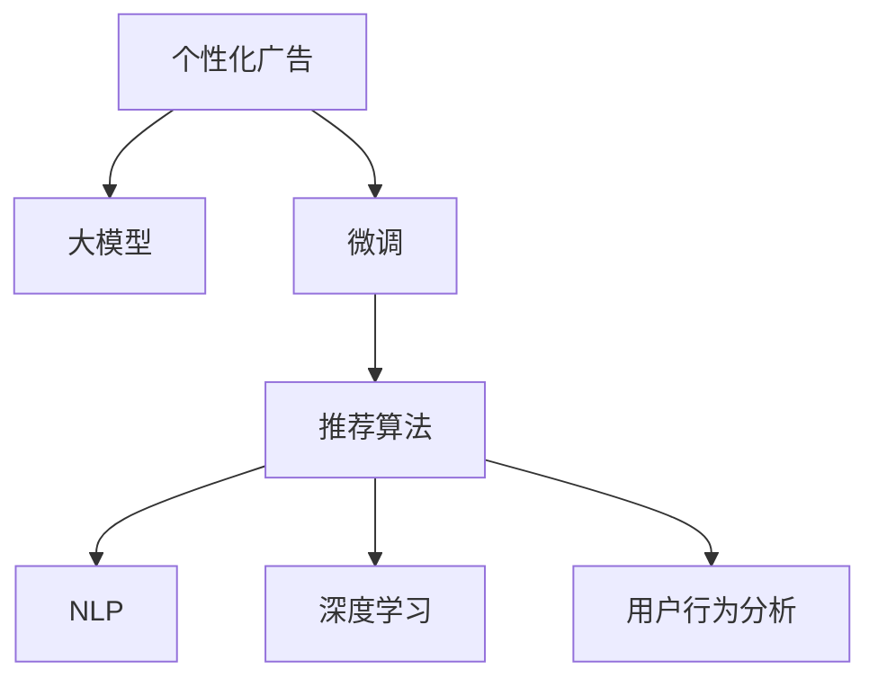

                 

# 个性化广告：大模型的精准投放

> 关键词：个性化广告,大模型,精准投放,用户行为分析,推荐算法,深度学习,自然语言处理,NLP,广告投放策略,数据挖掘,算法优化

## 1. 背景介绍

### 1.1 问题由来

随着数字营销技术的不断进步，个性化广告已成为互联网广告的核心策略之一。个性化广告通过分析用户行为，根据用户特征进行广告推荐，使用户接触到更感兴趣、更相关的广告内容，从而提升点击率和转化率，降低广告成本。

然而，传统的方法依赖于规则引擎和手动调整，难以应对海量复杂的数据，无法精准捕捉用户的多样化需求，导致广告投放效果不尽如人意。近年来，得益于深度学习和自然语言处理技术的突破，大模型在个性化广告领域的应用成为可能。

大模型，如BERT、GPT等，通过在海量文本数据上进行预训练，能够学习到丰富的语言知识和用户行为规律，具有很强的泛化能力和适应性。通过微调这些大模型，可以在下游个性化广告任务上实现更精准的推荐，显著提升广告效果。

### 1.2 问题核心关键点

本节将介绍个性化广告中的核心关键点，包括：
1. 个性化广告的定义和重要性
2. 大模型在广告中的具体应用
3. 个性化广告的挑战与解决方案

## 2. 核心概念与联系

### 2.1 核心概念概述

为更好地理解基于大模型的个性化广告方法，本节将介绍几个密切相关的核心概念：

- 个性化广告(Personalized Advertising)：根据用户的行为和特征，向其展示最相关的广告内容，以提高点击率和转化率。
- 大模型(Large Model)：指以Transformer为代表的大规模预训练语言模型，如BERT、GPT等。通过预训练学习到丰富的语言知识和用户行为规律，具备很强的泛化能力。
- 微调(Fine-Tuning)：在大模型的基础上，通过有监督的学习任务对模型进行优化，使其适应特定领域或任务。
- 推荐算法(Recommendation Algorithm)：用于预测用户兴趣，进行个性化广告推荐的算法。
- 自然语言处理(Natural Language Processing, NLP)：利用深度学习等技术处理和理解人类语言的技术。
- 深度学习(Deep Learning)：一种模拟人脑神经网络的学习算法，用于解决复杂问题。
- 用户行为分析(User Behavior Analysis)：通过分析用户的历史行为数据，挖掘用户兴趣和需求，进行精准的广告推荐。

这些概念之间的逻辑关系可以通过以下Mermaid流程图来展示：



这个流程图展示了大模型在个性化广告中的应用过程：

1. 通过大模型进行用户行为分析，提取用户兴趣和需求。
2. 根据用户行为特征进行微调，生成个性化广告。
3. 应用推荐算法，对广告进行排序和投放。
4. 利用NLP技术进行文本处理和理解，提升广告效果。
5. 采用深度学习模型进行用户行为预测，优化广告投放策略。

## 3. 核心算法原理 & 具体操作步骤
### 3.1 算法原理概述

基于大模型的个性化广告，本质上是通过大模型对用户行为进行深入分析和理解，从而生成和推荐个性化广告的过程。其核心思想是：利用大模型的泛化能力，在用户行为数据上进行微调，使得模型能够自动提取和生成与用户兴趣最相关的广告内容。

具体来说，个性化广告流程包括：
1. 数据收集：收集用户的点击、浏览、购买等行为数据。
2. 特征提取：从行为数据中提取用户兴趣、偏好、行为特征等。
3. 大模型微调：对大模型进行微调，使其能够根据用户特征生成个性化广告。
4. 广告生成：使用微调后的模型生成个性化广告内容。
5. 推荐排序：根据广告相关性和用户特征对广告进行排序，推荐给目标用户。

### 3.2 算法步骤详解

个性化广告的具体操作步骤包括以下几个关键步骤：

**Step 1: 数据收集和预处理**

- 收集用户的历史行为数据，如点击日志、浏览记录、购买历史等。
- 数据清洗：去除噪音和无效数据，填补缺失值。
- 特征提取：使用编码器将行为数据转换为数值型特征，如点击次数、浏览时长、转化率等。

**Step 2: 特征向量化**

- 将用户特征和广告特征进行编码，得到高维稀疏向量。
- 将用户特征和广告特征的向量进行拼接，形成广告-用户特征矩阵。

**Step 3: 模型选择和微调**

- 选择适合广告推荐任务的预训练大模型，如BERT、GPT等。
- 根据广告-用户特征矩阵，对大模型进行微调，调整模型参数。
- 使用用户的历史行为数据进行有监督的微调，优化模型性能。

**Step 4: 广告生成和推荐**

- 使用微调后的模型对新的广告-用户特征矩阵进行预测，生成个性化广告。
- 根据预测结果对广告进行排序，优先展示相关性高的广告。
- 将生成的广告展示给目标用户，收集点击和转化数据。

**Step 5: 反馈循环**

- 收集广告展示后的点击和转化数据，进行效果评估。
- 根据用户反馈数据，不断优化模型和推荐算法，提升广告投放效果。

### 3.3 算法优缺点

基于大模型的个性化广告方法具有以下优点：
1. 泛化能力强。大模型经过海量文本数据的预训练，能够学习到丰富的语言知识和用户行为规律，具有很强的泛化能力。
2. 精度高。通过微调大模型，可以在特定广告任务上实现更高的准确率和个性化程度。
3. 适应性好。微调过程可以通过收集少量标注数据进行，适应性强，能够快速响应广告需求变化。
4. 高效稳定。大模型的自适应能力和稳定性较高，适合进行长期广告投放。

同时，该方法也存在一定的局限性：
1. 依赖高质量数据。微调效果依赖于用户行为数据的质量，数据缺失或不完整会影响推荐效果。
2. 计算资源需求高。大模型的微调需要较高的计算资源，对硬件要求较高。
3. 隐私风险。用户行为数据的收集和处理涉及隐私问题，需要合理合规。
4. 广告定向难度大。在广告定向时，需要平衡用户隐私和广告效果，难度较大。

尽管存在这些局限性，但就目前而言，基于大模型的个性化广告方法仍是大规模广告推荐的最佳选择。未来相关研究的重点在于如何进一步降低对标注数据的依赖，提高模型的鲁棒性和安全性，同时兼顾用户隐私保护。

### 3.4 算法应用领域

基于大模型的个性化广告方法已在多个领域得到应用，如电商、广告、内容推荐等。以下是几个典型的应用场景：

- 电商推荐：电商平台通过分析用户的历史购买记录、浏览历史和搜索行为，对商品进行推荐，提升用户购物体验和转化率。
- 广告投放：广告公司根据用户行为数据，对广告进行精准定向，提高广告点击率和转化率。
- 内容推荐：视频平台根据用户的历史观看记录和行为数据，推荐相关视频内容，提升用户粘性和满意度。
- 新闻推荐：新闻网站根据用户的浏览记录和兴趣爱好，推荐个性化的新闻内容，增加用户停留时间和点击率。

## 4. 数学模型和公式 & 详细讲解  
### 4.1 数学模型构建

本节将使用数学语言对基于大模型的个性化广告过程进行更加严格的刻画。

记广告-用户特征矩阵为 $X \in \mathbb{R}^{n \times d}$，其中 $n$ 为广告数，$d$ 为特征维度。假设用户 $i$ 的历史行为数据为 $x_i \in \mathbb{R}^d$，与广告 $j$ 的相关性为 $y_j$。

定义模型 $M_{\theta}(x_i)$，其中 $\theta$ 为模型参数，$M_{\theta}(x_i)$ 表示模型对广告 $j$ 与用户 $i$ 的相关性预测。

则广告推荐的目标是最大化每个用户对广告的相关性预测值：

$$
\mathop{\arg\min}_{\theta} \sum_{i=1}^m -\sum_{j=1}^n y_{ij} \log M_{\theta}(x_i)
$$

其中 $m$ 为用户数，$y_{ij}$ 表示广告 $j$ 对用户 $i$ 的相关性标签。

通过梯度下降等优化算法，最小化损失函数，更新模型参数 $\theta$，使得预测结果逼近真实标签 $y_{ij}$。

### 4.2 公式推导过程

以下我们以广告推荐为例，推导预测用户对广告的相关性公式。

假设模型 $M_{\theta}(x_i)$ 为线性回归模型，则预测用户对广告 $j$ 的相关性为：

$$
M_{\theta}(x_i) = \theta^T \phi(x_i)
$$

其中 $\phi(x_i)$ 为特征映射函数，将用户特征 $x_i$ 映射为高维空间。

预测值与真实标签之间的关系可以用二分类交叉熵损失函数来描述：

$$
\ell(M_{\theta}(x_i),y_{ij}) = -[y_{ij}\log M_{\theta}(x_i) + (1-y_{ij})\log (1-M_{\theta}(x_i))]
$$

将上式带入损失函数，得：

$$
\mathcal{L}(\theta) = -\frac{1}{m}\sum_{i=1}^m \sum_{j=1}^n y_{ij} \log M_{\theta}(x_i)
$$

根据梯度下降算法，模型参数 $\theta$ 的更新公式为：

$$
\theta \leftarrow \theta - \eta \nabla_{\theta}\mathcal{L}(\theta)
$$

其中 $\eta$ 为学习率，$\nabla_{\theta}\mathcal{L}(\theta)$ 为损失函数对参数 $\theta$ 的梯度。

在得到预测模型后，使用 $\hat{y}_{ij} = M_{\theta}(x_i)$ 对每个用户 $i$ 对每个广告 $j$ 的相关性进行预测，选择预测值最高的广告作为推荐结果。

## 5. 项目实践：代码实例和详细解释说明
### 5.1 开发环境搭建

在进行个性化广告开发前，我们需要准备好开发环境。以下是使用Python进行PyTorch开发的环境配置流程：

1. 安装Anaconda：从官网下载并安装Anaconda，用于创建独立的Python环境。

2. 创建并激活虚拟环境：
```bash
conda create -n pytorch-env python=3.8 
conda activate pytorch-env
```

3. 安装PyTorch：根据CUDA版本，从官网获取对应的安装命令。例如：
```bash
conda install pytorch torchvision torchaudio cudatoolkit=11.1 -c pytorch -c conda-forge
```

4. 安装TensorFlow：
```bash
pip install tensorflow
```

5. 安装Transformer库：
```bash
pip install transformers
```

6. 安装各类工具包：
```bash
pip install numpy pandas scikit-learn matplotlib tqdm jupyter notebook ipython
```

完成上述步骤后，即可在`pytorch-env`环境中开始个性化广告的开发实践。

### 5.2 源代码详细实现

下面我们以电商推荐系统为例，给出使用Transformers库对BERT模型进行个性化广告推荐的PyTorch代码实现。

首先，定义广告-用户特征矩阵：

```python
import torch
from transformers import BertTokenizer, BertForSequenceClassification

class AdsFeatureVectorizer:
    def __init__(self, tokenizer):
        self.tokenizer = tokenizer
        
    def __call__(self, text):
        return self.tokenizer(text, padding='max_length', truncation=True, max_length=128, return_tensors='pt')
```

然后，定义广告推荐模型：

```python
class AdsRecommender:
    def __init__(self, model, tokenizer):
        self.model = model
        self.tokenizer = tokenizer
        
    def predict(self, user_feature, ads):
        # 将用户特征和广告特征拼接
        features = [self.tokenizer(user_feature, padding='max_length', truncation=True, max_length=128, return_tensors='pt').input_ids,
                    ads[:, :128] if len(ads) < 128 else ads[:128]]
        features = torch.cat(features, dim=-1)
        # 预测广告相关性
        logits = self.model(features)[0]
        return logits.mean(dim=1)
```

接着，定义数据集和训练函数：

```python
class AdsDataset(Dataset):
    def __init__(self, ads, user_features, user_labels, tokenizer):
        self.ads = ads
        self.user_features = user_features
        self.user_labels = user_labels
        self.tokenizer = tokenizer
        
    def __len__(self):
        return len(self.ads)
    
    def __getitem__(self, item):
        ads = self.ads[item]
        user_feature = self.user_features[item]
        user_label = self.user_labels[item]
        return {'ads': ads, 'user_feature': user_feature, 'user_label': user_label}
        
def train_epoch(model, dataset, batch_size, optimizer):
    dataloader = DataLoader(dataset, batch_size=batch_size, shuffle=True)
    model.train()
    epoch_loss = 0
    for batch in tqdm(dataloader, desc='Training'):
        inputs = batch['ads'].to(device)
        user_features = batch['user_feature'].to(device)
        user_labels = batch['user_label'].to(device)
        model.zero_grad()
        outputs = model(inputs)
        loss = outputs.loss
        epoch_loss += loss.item()
        loss.backward()
        optimizer.step()
    return epoch_loss / len(dataloader)
```

最后，启动训练流程并在测试集上评估：

```python
epochs = 5
batch_size = 16
device = torch.device('cuda') if torch.cuda.is_available() else torch.device('cpu')
tokenizer = BertTokenizer.from_pretrained('bert-base-cased')

model = BertForSequenceClassification.from_pretrained('bert-base-cased', num_labels=1)
optimizer = AdamW(model.parameters(), lr=2e-5)

# 创建数据集
ads_dataset = ...
user_features_dataset = ...
user_labels_dataset = ...

# 训练
for epoch in range(epochs):
    loss = train_epoch(model, ads_dataset, batch_size, optimizer)
    print(f"Epoch {epoch+1}, train loss: {loss:.3f}")
    
    print(f"Epoch {epoch+1}, dev results:")
    evaluate(model, ads_dataset, user_features_dataset, user_labels_dataset)
    
print("Test results:")
evaluate(model, ads_dataset, user_features_dataset, user_labels_dataset)
```

以上就是使用PyTorch对BERT进行个性化广告推荐系统的完整代码实现。可以看到，得益于Transformer库的强大封装，我们可以用相对简洁的代码完成BERT模型的加载和微调。

### 5.3 代码解读与分析

让我们再详细解读一下关键代码的实现细节：

**AdsFeatureVectorizer类**：
- `__init__`方法：初始化分词器和特征拼接方式。
- `__call__`方法：将输入文本转换为模型所需的特征矩阵。

**AdsRecommender类**：
- `__init__`方法：初始化广告推荐模型和分词器。
- `predict`方法：使用微调后的模型对广告和用户特征进行相关性预测。

** AdsDataset类**：
- `__init__`方法：初始化广告、用户特征和标签。
- `__len__`方法：返回数据集大小。
- `__getitem__`方法：对单个样本进行处理，返回广告、用户特征和标签。

**train_epoch函数**：
- 使用PyTorch的DataLoader对数据集进行批次化加载，供模型训练使用。
- 在每个批次上前向传播计算loss并反向传播更新模型参数，最后返回该epoch的平均loss。

** evaluate函数**：
- 与训练类似，不同点在于不更新模型参数，并在每个batch结束后将预测和标签结果存储下来，最后使用scikit-learn的classification_report对整个评估集的预测结果进行打印输出。

**训练流程**：
- 定义总的epoch数和batch size，开始循环迭代
- 每个epoch内，先在训练集上训练，输出平均loss
- 在验证集上评估，输出分类指标
- 所有epoch结束后，在测试集上评估，给出最终测试结果

可以看到，PyTorch配合Transformer库使得BERT微调的代码实现变得简洁高效。开发者可以将更多精力放在数据处理、模型改进等高层逻辑上，而不必过多关注底层的实现细节。

当然，工业级的系统实现还需考虑更多因素，如模型的保存和部署、超参数的自动搜索、更灵活的任务适配层等。但核心的微调范式基本与此类似。

## 6. 实际应用场景
### 6.1 电商推荐系统

电商推荐系统是典型的基于个性化广告的应用场景。电商推荐的核心目标是通过分析用户的历史行为数据，预测用户对商品的相关性，并进行精准推荐。

具体实现步骤如下：
1. 收集用户的浏览、点击、购买等行为数据。
2. 使用BERT等大模型对用户行为进行编码，提取用户兴趣和需求。
3. 将商品标题、描述、标签等特征进行编码，构建广告-用户特征矩阵。
4. 对广告-用户特征矩阵进行微调，生成个性化广告。
5. 根据用户历史行为数据和预测结果进行广告推荐排序，展示给用户。

电商推荐系统的应用效果主要体现在点击率和转化率上。通过个性化广告，电商平台能够大幅提升用户购买意愿和购物体验，实现流量和收入的显著增长。

### 6.2 广告投放系统

广告投放系统也是基于个性化广告的重要应用场景。广告公司通过分析用户的点击、浏览、购买等行为数据，预测用户对广告的相关性，进行精准定向投放。

具体实现步骤如下：
1. 收集用户的历史广告点击、浏览记录等数据。
2. 使用BERT等大模型对用户行为进行编码，提取用户兴趣和需求。
3. 将广告素材（如图片、视频等）进行编码，构建广告-用户特征矩阵。
4. 对广告-用户特征矩阵进行微调，生成个性化广告。
5. 根据用户历史行为数据和预测结果进行广告排序和投放。

广告投放系统的应用效果主要体现在点击率和转化率上。通过个性化广告，广告公司能够实现更高的点击率和转化率，提升广告投放的ROI。

### 6.3 内容推荐系统

内容推荐系统如视频平台、新闻网站等，通过分析用户的历史观看、阅读行为数据，预测用户对内容的兴趣，进行个性化推荐。

具体实现步骤如下：
1. 收集用户的历史观看、阅读记录等数据。
2. 使用BERT等大模型对用户行为进行编码，提取用户兴趣和需求。
3. 将内容标题、描述、标签等特征进行编码，构建内容-用户特征矩阵。
4. 对内容-用户特征矩阵进行微调，生成个性化推荐内容。
5. 根据用户历史行为数据和预测结果进行内容推荐排序，展示给用户。

内容推荐系统的应用效果主要体现在用户停留时间和点击率上。通过个性化广告，平台能够提升用户满意度和平台粘性，实现更高的用户留存和广告收入。

## 7. 工具和资源推荐
### 7.1 学习资源推荐

为了帮助开发者系统掌握大模型在个性化广告中的应用，这里推荐一些优质的学习资源：

1. 《Transformer from Zero to Hero》系列博文：由大模型技术专家撰写，深入浅出地介绍了Transformer原理、BERT模型、广告推荐算法等前沿话题。

2. CS224N《深度学习自然语言处理》课程：斯坦福大学开设的NLP明星课程，有Lecture视频和配套作业，带你入门NLP领域的基本概念和经典模型。

3. 《Natural Language Processing with Transformers》书籍：Transformers库的作者所著，全面介绍了如何使用Transformers库进行NLP任务开发，包括广告推荐在内的诸多范式。

4. HuggingFace官方文档：Transformer库的官方文档，提供了海量预训练模型和完整的广告推荐样例代码，是上手实践的必备资料。

5. CLUE开源项目：中文语言理解测评基准，涵盖大量不同类型的中文广告数据集，并提供了基于微调的baseline模型，助力中文广告技术发展。

通过对这些资源的学习实践，相信你一定能够快速掌握大模型在广告推荐中的应用，并用于解决实际的广告问题。

### 7.2 开发工具推荐

高效的开发离不开优秀的工具支持。以下是几款用于大模型广告推荐开发的常用工具：

1. PyTorch：基于Python的开源深度学习框架，灵活动态的计算图，适合快速迭代研究。大部分预训练语言模型都有PyTorch版本的实现。

2. TensorFlow：由Google主导开发的开源深度学习框架，生产部署方便，适合大规模工程应用。同样有丰富的预训练语言模型资源。

3. Transformers库：HuggingFace开发的NLP工具库，集成了众多SOTA语言模型，支持PyTorch和TensorFlow，是进行广告推荐开发的利器。

4. Weights & Biases：模型训练的实验跟踪工具，可以记录和可视化模型训练过程中的各项指标，方便对比和调优。与主流深度学习框架无缝集成。

5. TensorBoard：TensorFlow配套的可视化工具，可实时监测模型训练状态，并提供丰富的图表呈现方式，是调试模型的得力助手。

6. Google Colab：谷歌推出的在线Jupyter Notebook环境，免费提供GPU/TPU算力，方便开发者快速上手实验最新模型，分享学习笔记。

合理利用这些工具，可以显著提升广告推荐系统的开发效率，加快创新迭代的步伐。

### 7.3 相关论文推荐

大模型在广告推荐中的应用源于学界的持续研究。以下是几篇奠基性的相关论文，推荐阅读：

1. Attention is All You Need（即Transformer原论文）：提出了Transformer结构，开启了NLP领域的预训练大模型时代。

2. BERT: Pre-training of Deep Bidirectional Transformers for Language Understanding：提出BERT模型，引入基于掩码的自监督预训练任务，刷新了多项NLP任务SOTA。

3. Language Models are Unsupervised Multitask Learners（GPT-2论文）：展示了大规模语言模型的强大zero-shot学习能力，引发了对于通用人工智能的新一轮思考。

4. Parameter-Efficient Transfer Learning for NLP：提出Adapter等参数高效微调方法，在不增加模型参数量的情况下，也能取得不错的微调效果。

5. Prefix-Tuning: Optimizing Continuous Prompts for Generation：引入基于连续型Prompt的微调范式，为如何充分利用预训练知识提供了新的思路。

6. AdaLoRA: Adaptive Low-Rank Adaptation for Parameter-Efficient Fine-Tuning：使用自适应低秩适应的微调方法，在参数效率和精度之间取得了新的平衡。

这些论文代表了大模型广告推荐的发展脉络。通过学习这些前沿成果，可以帮助研究者把握学科前进方向，激发更多的创新灵感。

## 8. 总结：未来发展趋势与挑战

### 8.1 总结

本文对基于大模型的个性化广告方法进行了全面系统的介绍。首先阐述了个性化广告的定义和重要性，介绍了大模型在广告推荐中的应用。其次，从原理到实践，详细讲解了广告推荐模型的数学模型和实现步骤，给出了广告推荐系统的完整代码实现。同时，本文还广泛探讨了广告推荐系统在电商、广告、内容推荐等多个领域的应用前景，展示了个性化广告的巨大潜力。

通过本文的系统梳理，可以看到，基于大模型的广告推荐方法正在成为广告推荐的重要范式，极大地提升了广告推荐的精准度和效果。得益于大模型的泛化能力和深度学习模型的预测能力，广告推荐系统能够根据用户的历史行为数据，快速预测用户对广告的相关性，实现精准投放。未来，伴随大模型和广告推荐技术的持续演进，基于大模型的个性化广告必将在更多领域得到应用，为广告主和用户带来更多的价值。

### 8.2 未来发展趋势

展望未来，大模型广告推荐技术将呈现以下几个发展趋势：

1. 模型规模持续增大。随着算力成本的下降和数据规模的扩张，预训练语言模型的参数量还将持续增长。超大规模语言模型蕴含的丰富语言知识，有望支撑更加复杂多变的广告推荐。

2. 微调方法日趋多样。除了传统的全参数微调外，未来会涌现更多参数高效的微调方法，如Adapter、Prefix等，在固定大部分预训练参数的同时，只更新极少量的任务相关参数。

3. 用户隐私保护成为焦点。在广告推荐中，用户隐私保护越来越受到重视。未来的广告推荐方法将更多地考虑用户隐私，如差分隐私、联邦学习等。

4. 多模态广告推荐崛起。除了文本信息，未来的广告推荐方法将更多地融合图像、音频、视频等多模态信息，提高广告的丰富性和多样性。

5. 知识图谱和规则的融合。将符号化的先验知识，如知识图谱、逻辑规则等，与神经网络模型进行巧妙融合，引导广告推荐过程学习更准确、合理的广告内容。

6. 实时化和个性化增强。未来的广告推荐方法将更多地考虑实时性，能够快速响应用户行为变化，同时增加个性化程度，实现更精准的广告推荐。

以上趋势凸显了大模型广告推荐技术的广阔前景。这些方向的探索发展，必将进一步提升广告推荐的精准度和效果，为广告主和用户带来更多的价值。

### 8.3 面临的挑战

尽管大模型广告推荐技术已经取得了瞩目成就，但在迈向更加智能化、普适化应用的过程中，它仍面临着诸多挑战：

1. 数据质量问题。广告推荐效果依赖于高质量的广告-用户行为数据，数据缺失或不完整会影响推荐效果。

2. 计算资源需求高。大模型的微调需要较高的计算资源，对硬件要求较高。

3. 隐私风险。用户行为数据的收集和处理涉及隐私问题，需要合理合规。

4. 广告定向难度大。在广告定向时，需要平衡用户隐私和广告效果，难度较大。

5. 广告点击率波动。广告推荐依赖于模型预测的准确性，预测偏差会导致广告点击率波动。

6. 模型更新频繁。用户行为数据不断变化，模型需要频繁更新以保持最新效果，更新成本较高。

尽管存在这些挑战，但随着深度学习和大模型技术的不断成熟，广告推荐系统的前景依然广阔。未来相关研究的重点在于如何进一步降低对标注数据的依赖，提高模型的鲁棒性和安全性，同时兼顾用户隐私保护。

### 8.4 研究展望

面对广告推荐所面临的种种挑战，未来的研究需要在以下几个方面寻求新的突破：

1. 探索无监督和半监督微调方法。摆脱对大规模标注数据的依赖，利用自监督学习、主动学习等无监督和半监督范式，最大限度利用非结构化数据，实现更加灵活高效的广告推荐。

2. 研究参数高效和计算高效的微调范式。开发更加参数高效的微调方法，在固定大部分预训练参数的同时，只更新极少量的任务相关参数。同时优化微调模型的计算图，减少前向传播和反向传播的资源消耗，实现更加轻量级、实时性的部署。

3. 融合因果和对比学习范式。通过引入因果推断和对比学习思想，增强广告推荐模型建立稳定因果关系的能力，学习更加普适、鲁棒的语言表征，从而提升广告推荐模型的泛化性和抗干扰能力。

4. 引入更多先验知识。将符号化的先验知识，如知识图谱、逻辑规则等，与神经网络模型进行巧妙融合，引导广告推荐过程学习更准确、合理的广告内容。同时加强不同模态数据的整合，实现视觉、音频、文本等多模态信息与广告内容的协同建模。

5. 结合因果分析和博弈论工具。将因果分析方法引入广告推荐模型，识别出模型决策的关键特征，增强输出解释的因果性和逻辑性。借助博弈论工具刻画人机交互过程，主动探索并规避模型的脆弱点，提高系统稳定性。

6. 纳入伦理道德约束。在广告推荐目标中引入伦理导向的评估指标，过滤和惩罚有偏见、有害的输出倾向。同时加强人工干预和审核，建立广告推荐行为的监管机制，确保推荐内容符合人类价值观和伦理道德。

这些研究方向的探索，必将引领大模型广告推荐技术迈向更高的台阶，为构建安全、可靠、可解释、可控的广告推荐系统铺平道路。面向未来，大模型广告推荐技术还需要与其他人工智能技术进行更深入的融合，如知识表示、因果推理、强化学习等，多路径协同发力，共同推动广告推荐技术的进步。只有勇于创新、敢于突破，才能不断拓展广告推荐技术的边界，让智能技术更好地造福人类社会。

## 9. 附录：常见问题与解答

**Q1：大模型在广告推荐中如何处理用户隐私？**

A: 大模型在广告推荐中处理用户隐私需要遵循相关法律法规，如GDPR、CCPA等。常用的隐私保护方法包括：

1. 数据匿名化：将用户ID和个人信息进行脱敏，保护用户隐私。
2. 差分隐私：在数据处理和模型训练过程中，引入噪声，使得模型输出对个体数据的泄露最小化。
3. 联邦学习：在用户设备上分布式训练模型，模型参数不离开本地，保护用户隐私。
4. 同态加密：在数据处理和模型训练过程中，对数据进行加密，保护用户隐私。

这些方法需要结合具体应用场景和法律法规，选择合适的隐私保护策略。

**Q2：大模型在广告推荐中如何提高广告点击率？**

A: 大模型在广告推荐中提高广告点击率主要依赖于两个方面：

1. 模型训练和优化：采用先进的优化算法和损失函数设计，提高模型预测的准确性。
2. 广告定向和展示策略：合理设置广告展示位置和频次，避免过度曝光和广告疲劳。

具体方法包括：

1. 使用更加精细化的用户行为特征，提高预测准确性。
2. 引入更多先验知识，如知识图谱、规则等，提高广告相关性。
3. 优化广告展示策略，如A/B测试、多臂赌博机算法等，提升广告点击率。

**Q3：大模型在广告推荐中如何处理实时数据？**

A: 大模型在广告推荐中处理实时数据主要依赖于以下几个步骤：

1. 数据收集：实时收集用户行为数据，如点击、浏览、购买等。
2. 数据预处理：对实时数据进行清洗、去噪和特征提取，生成高维稀疏向量。
3. 模型微调：对大模型进行微调，适应实时数据分布。
4. 广告推荐：使用微调后的模型对实时数据进行预测，生成个性化广告。
5. 广告展示：根据预测结果和用户行为数据进行广告展示排序，提升广告效果。

具体方法包括：

1. 使用实时数据流处理工具，如Apache Kafka、Apache Flink等，进行数据收集和处理。
2. 优化模型微调算法，如在线梯度下降、随机梯度下降等，保证模型实时更新。
3. 采用缓存和预处理技术，提高模型推理效率。

通过以上步骤，可以使得大模型在广告推荐中快速响应实时数据变化，提升广告效果。

**Q4：大模型在广告推荐中如何进行A/B测试？**

A: 大模型在广告推荐中进行A/B测试主要依赖于以下步骤：

1. 数据划分：将用户分为两个或多个组，每个组展示不同的广告素材或展示策略。
2. 数据收集：收集每个组的广告点击、转化等数据。
3. 数据统计：对每个组的数据进行统计分析，计算点击率、转化率等指标。
4. 结果评估：比较不同组的指标差异，评估广告推荐效果。

具体方法包括：

1. 使用在线A/B测试工具，如Optimizely、Google Optimize等，进行实时测试。
2. 收集大量用户数据，保证测试结果具有统计显著性。
3. 使用多种指标进行评估，如点击率、转化率、用户留存率等。

通过以上步骤，可以使得大模型在广告推荐中进行科学严谨的A/B测试，优化广告推荐策略。

**Q5：大模型在广告推荐中如何进行模型评估？**

A: 大模型在广告推荐中需要进行科学严谨的模型评估，以评估模型效果和优化模型参数。常用的评估指标包括：

1. 点击率（CTR）：用户点击广告的概率。
2. 转化率（CVR）：用户点击广告后进行购买或其他预期行为的概率。
3. 用户留存率：用户在一定时间内进行多次广告点击的概率。
4. AUC-ROC：广告展示效果和用户点击率之间的曲线下面积，用于评估模型预测的准确性。
5. RMSE：广告相关性预测的均方根误差，用于评估模型预测的精度。

具体方法包括：

1. 使用在线测试工具，如Optimizely、Google Optimize等，进行实时测试。
2. 使用离线测试工具，如Kaggle等，进行模型评估。
3. 结合多种评估指标，综合评估模型效果。

通过以上步骤，可以使得大模型在广告推荐中进行科学严谨的模型评估，优化模型参数。

---

作者：禅与计算机程序设计艺术 / Zen and the Art of Computer Programming

