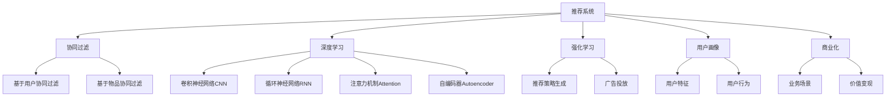

                 

# 个性化推荐创业：提升用户粘性的法宝

> 关键词：个性化推荐,用户粘性,机器学习,推荐系统,协同过滤,深度学习,商业化,开源社区

## 1. 背景介绍

在互联网时代，用户体验与粘性是企业竞争的核心所在。特别是在内容丰富的电商、视频、社交网络等行业，如何高效地将优质的内容推荐给用户，使用户获得满意的个性化服务，成为能否留住用户的关键。本文将从个性化推荐技术的研究背景出发，梳理推荐系统的核心算法，并从实际应用案例中剖析其市场价值与商业潜力。

## 2. 核心概念与联系

### 2.1 核心概念概述

为更好地理解个性化推荐技术，本节将介绍几个密切相关的核心概念：

- 推荐系统(Recommendation System)：旨在分析用户行为和偏好，为用户推荐合适内容的技术系统。广泛应用于电商、视频、音乐、新闻等领域。

- 协同过滤(Collaborative Filtering)：推荐系统的基本方法之一，基于用户行为相似性和物品相似性，推断用户对未知物品的偏好。分为基于用户的协同过滤和基于物品的协同过滤两种形式。

- 深度学习(Deep Learning)：利用多层神经网络进行特征提取和模式识别的技术。通过深度学习，推荐系统可以自动学习用户特征和物品属性，提升推荐的精度和多样性。

- 强化学习(Reinforcement Learning)：通过试错调整策略，使推荐系统在长期使用过程中不断优化推荐效果的技术。强化学习在个性化推荐中的应用如推荐策略生成、广告投放等。

- 用户画像(User Profile)：用于刻画用户属性和行为特征的综合性数据结构，是推荐系统个性化推荐的基础。

- 商业化(Commercialization)：将推荐系统应用到具体业务场景中，实现价值变现的实践活动。

这些核心概念之间的逻辑关系可以通过以下Mermaid流程图来展示：



这个流程图展示推荐系统的核心概念及其之间的关系：

1. 推荐系统通过协同过滤、深度学习、强化学习等方法，分析用户画像。
2. 协同过滤分为基于用户的协同过滤和基于物品的协同过滤，分别利用用户行为和物品属性进行推荐。
3. 深度学习通过卷积神经网络、循环神经网络、注意力机制、自编码器等技术，自动学习用户特征和物品属性，提升推荐精度。
4. 强化学习通过推荐策略生成、广告投放等形式，在长期使用过程中优化推荐效果。
5. 用户画像基于用户特征和行为，用于刻画用户属性和行为特征。
6. 商业化将推荐系统应用到电商、视频、社交网络等业务场景中，实现价值变现。

这些核心概念共同构成了推荐系统的核心工作原理，使其能够高效地为用户提供个性化推荐服务。

## 3. 核心算法原理 & 具体操作步骤

### 3.1 算法原理概述

个性化推荐算法基于用户行为和物品属性，通过构建用户画像和物品画像，使用协同过滤、深度学习等方法，预测用户对未知物品的偏好，从而进行推荐。其核心思想是：利用用户的历史行为和偏好，结合物品的特征属性，预测用户对物品的评分或概率，以推荐用户可能感兴趣的物品。

形式化地，假设推荐系统包含 $N$ 个用户 $U$ 和 $M$ 个物品 $I$，用户的偏好矩阵为 $P \in \mathbb{R}^{N \times M}$，物品的属性矩阵为 $F \in \mathbb{R}^{M \times D}$。其中 $D$ 表示物品的特征维度。推荐系统通过构建用户画像 $p_i$ 和物品画像 $f_j$，预测用户对物品 $j$ 的评分 $p_{i,j}$，实现个性化推荐。

推荐算法的目标是最小化预测误差，即最小化 $E(p_{i,j}^*,p_{i,j})$，其中 $p_{i,j}^*$ 表示真实评分，$E$ 为损失函数。

### 3.2 算法步骤详解

个性化推荐系统一般包括以下几个关键步骤：

**Step 1: 数据预处理与用户画像构建**
- 收集用户行为数据，如点击、浏览、购买、评分等，构建用户行为矩阵。
- 对用户行为数据进行预处理，包括去噪、缺失值填充、归一化等操作。
- 根据用户行为构建用户画像，通过统计、聚类等方法，提取用户特征。

**Step 2: 物品画像构建**
- 收集物品属性数据，如商品价格、描述、评分等，构建物品属性矩阵。
- 对物品属性数据进行预处理，包括特征提取、标准化等操作。
- 根据物品属性构建物品画像，通过统计、嵌入等方法，提取物品特征。

**Step 3: 推荐算法选择与模型训练**
- 选择合适的推荐算法，如协同过滤、深度学习等，设计推荐模型。
- 使用用户画像和物品画像，训练推荐模型，预测用户对未知物品的评分或概率。

**Step 4: 推荐结果排序与输出**
- 对预测结果进行排序，选择评分或概率最高的物品推荐给用户。
- 结合用户画像和物品画像，优化推荐结果，提升推荐多样性和相关性。
- 根据用户反馈，持续迭代优化模型。

**Step 5: 推荐效果评估与优化**
- 对推荐结果进行评估，如准确率、召回率、F1-score等指标。
- 根据评估结果，优化推荐算法和模型参数，提升推荐效果。
- 实时监测推荐系统性能，及时调整优化策略。

以上是推荐系统的基本流程。在实际应用中，还需要根据具体场景进行进一步优化和调整。

### 3.3 算法优缺点

个性化推荐算法具有以下优点：
1. 个性化强。能够根据用户历史行为和偏好，进行个性化推荐。
2. 推荐效果高。通过深度学习等技术，可以学习到丰富的用户特征和物品属性，提升推荐精度。
3. 灵活度高。能够根据不同业务场景和需求，灵活调整推荐算法和策略。
4. 用户粘性强。个性化推荐能够满足用户多样化需求，增加用户使用频率和粘性。

同时，该算法也存在一定的局限性：
1. 数据需求高。需要大量的用户行为数据和物品属性数据，获取成本较高。
2. 冷启动问题。新用户和物品缺乏足够数据，导致推荐效果较差。
3. 系统复杂度。推荐算法和模型较为复杂，开发和维护难度大。
4. 用户隐私问题。用户行为数据和物品属性数据可能包含隐私信息，需要设计合理的隐私保护机制。

尽管存在这些局限性，但就目前而言，个性化推荐算法仍然是推荐系统的主流技术，其核心思想和算法框架也在不断演进和优化。

### 3.4 算法应用领域

个性化推荐算法在电商、视频、社交网络、新闻媒体等诸多领域中都有广泛的应用，如：

- 电商推荐：根据用户浏览历史、购买记录、评分等数据，推荐商品或商品组合。
- 视频推荐：根据用户观看历史、评分、点赞等数据，推荐视频或视频组合。
- 社交网络推荐：根据用户好友关系、互动历史等数据，推荐内容或好友。
- 新闻媒体推荐：根据用户阅读历史、评论、点赞等数据，推荐新闻或文章。

除了这些经典应用外，个性化推荐算法也被应用于更多场景中，如广告投放、内容创作、营销分析等，为不同行业带来了新的用户粘性增长点。

## 4. 数学模型和公式 & 详细讲解 & 举例说明

### 4.1 数学模型构建

本节将使用数学语言对个性化推荐算法进行更加严格的刻画。

记用户画像为 $p_i \in \mathbb{R}^d$，物品画像为 $f_j \in \mathbb{R}^d$。推荐模型为 $M: \mathbb{R}^d \times \mathbb{R}^d \rightarrow \mathbb{R}$，输出用户对物品的评分或概率。推荐模型的目标是最小化预测误差，即：

$$
\min_{M} \sum_{i,j} (p_{i,j}^* - M(p_i,f_j))^2
$$

其中 $p_{i,j}^*$ 表示用户 $i$ 对物品 $j$ 的真实评分或概率，$M(p_i,f_j)$ 表示推荐模型预测的评分或概率。

### 4.2 公式推导过程

以协同过滤算法中的基于用户协同过滤为例，推导推荐模型的公式。

协同过滤算法的核心思想是：找到与目标用户 $i$ 行为相似的若干用户 $u_1,u_2,\cdots,u_k$，通过这些用户的评分加权平均来预测用户 $i$ 对物品 $j$ 的评分。形式化地，可以表示为：

$$
p_{i,j} = \frac{\sum_{k=1}^K w_{i,k} \times p_{u_k,j}}{\sum_{k=1}^K w_{i,k}}
$$

其中 $w_{i,k}$ 表示用户 $i$ 和用户 $u_k$ 的相似度，可以采用余弦相似度、皮尔逊相关系数等方法计算。

为了提高推荐效果，还可以引入用户画像和物品画像的特征。将用户画像 $p_i$ 和物品画像 $f_j$ 作为特征向量，输入推荐模型 $M$ 中，得到推荐结果：

$$
p_{i,j} = M(p_i,f_j)
$$

### 4.3 案例分析与讲解

考虑一个电商平台上的个性化推荐系统。该系统需要根据用户的历史浏览和购买记录，推荐可能感兴趣的商品。具体步骤包括：

1. 数据预处理：收集用户的历史浏览和购买记录，构建用户行为矩阵 $P$ 和物品属性矩阵 $F$。
2. 用户画像构建：通过统计、聚类等方法，提取用户特征，生成用户画像 $p_i$。
3. 物品画像构建：通过统计、嵌入等方法，提取物品特征，生成物品画像 $f_j$。
4. 推荐算法选择：选择协同过滤或深度学习算法，设计推荐模型。
5. 模型训练：使用用户画像和物品画像，训练推荐模型，预测用户对未知物品的评分或概率。
6. 推荐结果排序：对预测结果进行排序，选择评分或概率最高的物品推荐给用户。
7. 推荐效果评估：评估推荐系统的准确率、召回率、F1-score等指标，优化模型参数。

### 5. 项目实践：代码实例和详细解释说明

#### 5.1 开发环境搭建

在进行推荐系统开发前，我们需要准备好开发环境。以下是使用Python进行TensorFlow开发的环境配置流程：

1. 安装Anaconda：从官网下载并安装Anaconda，用于创建独立的Python环境。

2. 创建并激活虚拟环境：
```bash
conda create -n tf-env python=3.8 
conda activate tf-env
```

3. 安装TensorFlow：根据CUDA版本，从官网获取对应的安装命令。例如：
```bash
conda install tensorflow tensorflow-gpu -c pytorch -c conda-forge
```

4. 安装各类工具包：
```bash
pip install numpy pandas scikit-learn matplotlib tqdm jupyter notebook ipython
```

完成上述步骤后，即可在`tf-env`环境中开始推荐系统开发。

#### 5.2 源代码详细实现

下面我们以协同过滤算法为例，给出使用TensorFlow进行推荐系统开发的PyTorch代码实现。

首先，定义协同过滤推荐模型的类：

```python
import tensorflow as tf
from tensorflow.keras import layers

class CollaborativeFiltering(tf.keras.Model):
    def __init__(self, latent_factor=10, learning_rate=0.01):
        super(CollaborativeFiltering, self).__init__()
        self.latent_factor = latent_factor
        self.learning_rate = learning_rate
        
        self.u_embedding = tf.keras.layers.Embedding(input_dim=num_users, output_dim=latent_factor)
        self.i_embedding = tf.keras.layers.Embedding(input_dim=num_items, output_dim=latent_factor)
        self.sigmoid = tf.keras.layers.Activation('sigmoid')
        
    def call(self, user_embeddings, item_embeddings):
        user_hidden = self.u_embedding(user_embeddings)
        item_hidden = self.i_embedding(item_embeddings)
        
        dot_product = tf.reduce_sum(tf.multiply(user_hidden, item_hidden), axis=1)
        prediction = self.sigmoid(dot_product)
        return prediction
```

然后，定义模型训练和评估函数：

```python
@tf.function
def train_step(ground_truth, user_embeddings, item_embeddings):
    with tf.GradientTape() as tape:
        prediction = model(user_embeddings, item_embeddings)
        loss = tf.losses.mean_squared_error(ground_truth, prediction)
    gradients = tape.gradient(loss, model.trainable_variables)
    optimizer.apply_gradients(zip(gradients, model.trainable_variables))
    return loss

@tf.function
def evaluate_step(ground_truth, user_embeddings, item_embeddings):
    prediction = model(user_embeddings, item_embeddings)
    rmse = tf.sqrt(tf.reduce_mean(tf.square(ground_truth - prediction)))
    return rmse
```

接着，启动训练流程并在测试集上评估：

```python
num_epochs = 100
num_users = 1000
num_items = 1000
latent_factor = 10
learning_rate = 0.01
batch_size = 128

model = CollaborativeFiltering(latent_factor, learning_rate)

optimizer = tf.keras.optimizers.Adam(learning_rate=learning_rate)
# 数据加载器
train_loader = tf.data.Dataset.from_tensor_slices(train_data)
train_loader = train_loader.shuffle(buffer_size=1024).batch(batch_size)

# 训练
for epoch in range(num_epochs):
    epoch_loss = 0
    epoch_rmse = 0
    
    for user_ids, item_ids, ratings in train_loader:
        epoch_loss += train_step(ratings, user_ids, item_ids)
        
    epoch_rmse = evaluate_step(ratings, user_ids, item_ids)
    
    print(f"Epoch {epoch+1}, train loss: {epoch_loss/n_items:.3f}, test rmse: {epoch_rmse:.3f}")
```

以上就是使用TensorFlow进行协同过滤推荐系统开发的完整代码实现。可以看到，TensorFlow通过定义类和函数，简洁高效地实现了推荐模型和训练评估流程。

#### 5.3 代码解读与分析

让我们再详细解读一下关键代码的实现细节：

**CollaborativeFiltering类**：
- `__init__`方法：初始化协同过滤模型的超参数，包括隐层维度、学习率等。
- `call`方法：实现推荐模型的前向传播，将用户嵌入和物品嵌入相乘并加权平均，得到预测评分。

**train_step和evaluate_step函数**：
- `train_step`函数：计算损失函数，反向传播更新模型参数，返回训练集上的损失。
- `evaluate_step`函数：计算模型在测试集上的均方根误差(RMSE)。

**训练流程**：
- 定义训练轮数、用户数、物品数、隐层维度、学习率等超参数。
- 创建协同过滤模型实例和Adam优化器。
- 定义数据加载器，将训练数据划分为批次进行训练。
- 循环迭代训练，计算损失并评估模型性能。

可以看到，TensorFlow通过类和函数，使得推荐模型的开发和训练过程变得简洁高效。开发者可以将更多精力放在模型优化和数据处理上，而不必过多关注底层的实现细节。

当然，工业级的系统实现还需考虑更多因素，如模型的保存和部署、超参数的自动搜索、更灵活的任务适配层等。但核心的协同过滤算法基本与此类似。

## 6. 实际应用场景

### 6.1 电商推荐

电商平台的个性化推荐系统已经成为提升用户粘性的重要手段。以淘宝为例，通过推荐系统推荐用户感兴趣的商品，增加用户浏览和购买频次，提升转化率。推荐系统通过分析用户的浏览历史、购买记录、评分等数据，结合商品属性、热门标签等，进行个性化推荐。电商推荐系统为淘宝等电商平台带来了显著的用户增长和销售额提升。

### 6.2 视频推荐

视频平台如Netflix、YouTube等，也广泛应用了个性化推荐系统。用户可以通过历史观看记录、评分、点赞等数据，获取个性化视频推荐。推荐系统通过分析用户的观看习惯和视频特征，生成推荐列表。视频推荐系统帮助Netflix等平台提升用户留存率和满意度，同时也带动了平台的付费会员增长。

### 6.3 社交网络推荐

社交网络如Facebook、微信等，通过推荐系统向用户推荐好友、内容、活动等信息。推荐系统通过分析用户互动历史、好友关系等数据，生成个性化的内容推荐列表。社交网络推荐系统显著提升了用户活跃度和内容曝光率，增加了用户粘性。

### 6.4 未来应用展望

伴随推荐系统的持续演进，其应用场景还将进一步拓展，为更多垂直领域带来创新和价值。例如：

- 金融领域：通过推荐系统推荐金融产品、投资策略等，提升用户投资体验。
- 医疗领域：通过推荐系统推荐疾病信息、药品推荐等，提升用户健康意识和满意度。
- 教育领域：通过推荐系统推荐学习资源、教育课程等，提升用户学习效果和满意度。
- 旅游领域：通过推荐系统推荐旅游目的地、行程安排等，提升用户出行体验和满意度。

## 7. 工具和资源推荐

### 7.1 学习资源推荐

为了帮助开发者系统掌握个性化推荐技术，这里推荐一些优质的学习资源：

1. 《推荐系统实战》系列博文：深入浅出地介绍了推荐系统的工作原理、常用算法和实现细节，涵盖协同过滤、深度学习等主流技术。

2. Coursera《推荐系统》课程：由斯坦福大学开设的NLP明星课程，详细讲解推荐系统的理论和实践，是入门推荐系统的经典课程。

3. 《推荐系统基础与实践》书籍：系统介绍推荐系统的基本概念、算法和应用，适合深度学习背景的读者自学。

4. PyTorch官方文档：推荐系统的主流实现框架，提供丰富的工具和样例代码，是推荐系统开发的重要资源。

5. KDD'19最佳论文：推荐系统领域的经典论文，涵盖协同过滤、深度学习、强化学习等前沿技术，适合深入研究推荐系统的读者。

通过对这些资源的学习实践，相信你一定能够快速掌握个性化推荐技术的精髓，并用于解决实际的推荐问题。

### 7.2 开发工具推荐

高效的开发离不开优秀的工具支持。以下是几款用于个性化推荐系统开发的常用工具：

1. TensorFlow：基于Google的深度学习框架，灵活性强，支持多种推荐算法。

2. PyTorch：Facebook开源的深度学习框架，灵活度极高，适合深度学习背景的开发者。

3. Spark MLlib：Apache的机器学习库，支持分布式计算，适合大数据场景。

4. Hadoop：Apache的分布式计算框架，支持大规模数据处理。

5. Elasticsearch：Elastic公司开源的搜索和分析引擎，适合结构化数据存储和查询。

6. Hive：Apache的SQL-on-Hadoop框架，支持大规模数据处理。

合理利用这些工具，可以显著提升推荐系统的开发效率，加快创新迭代的步伐。

### 7.3 相关论文推荐

个性化推荐技术的研究始于20世纪末，历经数十年发展，已经形成较为完整的理论体系。以下是几篇奠基性的相关论文，推荐阅读：

1. BPR: Bayesian Personalized Ranking from Implicit Feedback（2007）：提出BPR算法，以贝叶斯方法改进协同过滤算法。

2. Matrix Factorization Techniques for Recommender Systems（2010）：综述矩阵分解算法在推荐系统中的应用。

3. The Bell-Katz Algorithm and Efficient Collaborative Filtering（2016）：提出Bell-Katz算法，提升协同过滤算法的效率和精度。

4. Deep Matrix Factorization for Recommender Systems（2018）：提出深度矩阵分解算法，将深度学习引入推荐系统。

5. Transfer Learning for Recommendation Systems（2020）：综述推荐系统的迁移学习应用，探讨如何通过迁移学习提升推荐效果。

这些论文代表了个性化推荐技术的发展脉络。通过学习这些前沿成果，可以帮助研究者把握学科前进方向，激发更多的创新灵感。

## 8. 总结：未来发展趋势与挑战

### 8.1 总结

本文对个性化推荐技术的研究背景、核心算法和实际应用进行了全面系统的介绍。首先阐述了推荐系统的工作原理和核心算法，梳理了协同过滤、深度学习等主流技术，并通过实际应用案例展示了推荐系统在电商、视频、社交网络等领域的巨大价值和商业潜力。最后，文章从学习资源、开发工具和相关论文等方面，推荐了系统掌握推荐技术的途径。

通过本文的系统梳理，可以看到，个性化推荐技术已经成为电商、视频、社交网络等领域的重要支柱，显著提升了用户粘性和满意度。未来，伴随推荐系统的持续演进，其应用场景还将进一步拓展，为更多垂直领域带来创新和价值。

### 8.2 未来发展趋势

展望未来，个性化推荐技术将呈现以下几个发展趋势：

1. 推荐系统自动化：通过强化学习等技术，自动设计推荐策略和算法，减少人工干预，提升推荐效果。

2. 推荐模型可解释：通过因果推断、规则学习等技术，提升推荐模型的可解释性，让用户理解推荐依据，增加信任度。

3. 推荐系统实时化：通过流式计算、分布式计算等技术，实现实时推荐，提升用户满意度。

4. 推荐系统个性化：通过用户画像、物品画像等技术，深度学习用户的兴趣偏好，实现更加精准的个性化推荐。

5. 推荐系统多样化：通过多模态数据融合、情感分析等技术，提升推荐内容的多样性和情感共鸣。

6. 推荐系统隐私保护：通过差分隐私、联邦学习等技术，保护用户隐私数据，增强推荐系统的可信度。

这些趋势凸显了个性化推荐技术的广阔前景。这些方向的探索发展，必将进一步提升推荐系统的性能和应用范围，为构建人机协同的智能系统铺平道路。面向未来，推荐系统需要在数据、算法、工程、业务等多个维度协同发力，才能真正实现智能化推荐。

### 8.3 面临的挑战

尽管个性化推荐技术已经取得了瞩目成就，但在迈向更加智能化、普适化应用的过程中，它仍面临诸多挑战：

1. 数据收集难度大。推荐系统需要大量的用户行为数据和物品属性数据，获取成本较高。

2. 数据质量差。用户行为数据和物品属性数据可能存在噪声、缺失、稀疏等问题，影响推荐效果。

3. 冷启动问题。新用户和物品缺乏足够数据，导致推荐效果较差。

4. 算法复杂度高。推荐系统涉及协同过滤、深度学习等多种算法，开发和维护难度大。

5. 推荐效果不稳定。推荐系统容易受到用户行为变化、物品属性变化等因素的影响，导致推荐效果不稳定。

6. 用户隐私问题。推荐系统需要收集大量的用户数据，用户隐私保护问题亟待解决。

7. 推荐模型公平性。推荐系统可能存在算法偏见，导致某些用户或物品被不公平对待。

8. 推荐系统鲁棒性。推荐系统容易受到恶意攻击，需要设计相应的防御策略。

这些挑战凸显了个性化推荐技术的复杂性和不确定性，需要研究者持续探索和创新，才能应对未来的应用挑战。

### 8.4 未来突破

面对个性化推荐技术面临的种种挑战，未来的研究需要在以下几个方面寻求新的突破：

1. 推荐系统自动化。通过强化学习等技术，自动设计推荐策略和算法，减少人工干预，提升推荐效果。

2. 推荐模型可解释。通过因果推断、规则学习等技术，提升推荐模型的可解释性，让用户理解推荐依据，增加信任度。

3. 推荐系统实时化。通过流式计算、分布式计算等技术，实现实时推荐，提升用户满意度。

4. 推荐系统多样化。通过多模态数据融合、情感分析等技术，提升推荐内容的多样性和情感共鸣。

5. 推荐系统隐私保护。通过差分隐私、联邦学习等技术，保护用户隐私数据，增强推荐系统的可信度。

6. 推荐系统公平性。通过算法优化和数据增强等技术，提升推荐系统的公平性，避免算法偏见。

7. 推荐系统鲁棒性。通过对抗训练、异常检测等技术，增强推荐系统的鲁棒性，抵御恶意攻击。

这些研究方向的探索，必将引领推荐系统技术迈向更高的台阶，为构建安全、可靠、可解释、可控的推荐系统铺平道路。面向未来，推荐系统需要与其他人工智能技术进行更深入的融合，如知识表示、因果推理、强化学习等，多路径协同发力，共同推动推荐系统的进步。

## 9. 附录：常见问题与解答

**Q1：推荐系统如何处理数据稀疏问题？**

A: 推荐系统通常面临数据稀疏问题，即用户行为数据和物品属性数据存在大量缺失。常见的处理方式包括：

1. 矩阵填充：利用平均值、中位数等填充缺失数据，减少数据稀疏度。

2. 模型预测：通过协同过滤等算法，预测缺失的评分或概率，提高数据完整性。

3. 稀疏矩阵分解：通过矩阵分解技术，将稀疏矩阵转化为稠密矩阵，便于计算。

4. 低秩矩阵分解：通过矩阵分解算法，将稀疏矩阵分解为低秩矩阵，减少数据稀疏度。

5. 数据增强：通过数据增强技术，扩充训练集，提高模型的泛化能力。

这些方法可以结合使用，根据具体场景选择适合的策略，有效应对数据稀疏问题。

**Q2：推荐系统如何处理冷启动问题？**

A: 冷启动问题是推荐系统面临的常见挑战，即新用户和物品缺乏足够数据。常见的处理方式包括：

1. 利用用户画像：通过构建用户画像，利用用户的历史行为数据和属性信息，进行推荐。

2. 利用物品画像：通过构建物品画像，利用物品的属性信息和热门标签，进行推荐。

3. 利用相似性：通过协同过滤等算法，找到与目标用户或物品相似的用户或物品，进行推荐。

4. 利用深度学习：通过深度学习模型，自动学习用户特征和物品属性，进行推荐。

5. 利用规则和启发式方法：通过规则和启发式方法，进行推荐。

这些方法可以结合使用，根据具体场景选择适合的策略，有效应对冷启动问题。

**Q3：推荐系统如何提升推荐多样性？**

A: 推荐系统需要平衡推荐多样性和相关性，常见的处理方式包括：

1. 多样性约束：在推荐算法中引入多样性约束，确保推荐结果包含多种不同类型的内容。

2. 多样化学习：在推荐模型中引入多样化学习，提升模型的多样性能力。

3. 多路径推荐：在推荐系统中选择多条不同的推荐路径，确保推荐结果的多样性。

4. 多样性调节：在推荐模型中调节多样性参数，控制推荐结果的多样性。

5. 多目标优化：在推荐模型中引入多目标优化，平衡推荐多样性和相关性。

这些方法可以结合使用，根据具体场景选择适合的策略，有效提升推荐多样性。

**Q4：推荐系统如何保护用户隐私？**

A: 推荐系统需要保护用户隐私数据，常见的处理方式包括：

1. 差分隐私：通过加入噪声，保护用户隐私数据，减少数据泄露风险。

2. 联邦学习：通过分布式计算，保护用户数据，减少数据集中存储的风险。

3. 匿名化：通过数据匿名化技术，保护用户隐私数据，防止数据泄露。

4. 加密存储：通过加密存储技术，保护用户数据，防止数据泄露。

5. 访问控制：通过访问控制技术，保护用户数据，防止未经授权的数据访问。

这些方法可以结合使用，根据具体场景选择适合的策略，有效保护用户隐私。

---

作者：禅与计算机程序设计艺术 / Zen and the Art of Computer Programming

