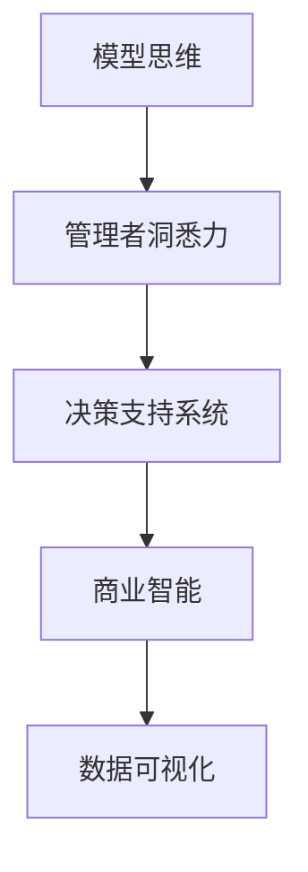

                 

# 丰富模型思维:增强管理者洞悉力

> 关键词：模型思维,管理者,洞悉力,决策支持,商业智能,数据可视化

## 1. 背景介绍

### 1.1 问题由来
随着信息技术的迅猛发展，企业面临的环境变得越来越复杂，市场竞争日益激烈，内部运营管理也愈发精细化。在这样的背景下，企业管理者需要具备更加精准、全面的决策支持能力。传统的基于直觉和经验的管理方式已无法满足现代企业的需求，需要引入更加科学、系统的方法来提升管理者的洞悉力，从而在激烈的市场竞争中保持优势。

### 1.2 问题核心关键点
如何通过数据驱动的方式，为管理者提供高效、准确、易懂的洞悉工具，使其在纷繁复杂的信息中快速把握关键点，做出明智的决策，是当前企业信息化研究的重要方向。

### 1.3 问题研究意义
提升管理者的洞悉力，对于企业的高效运营、战略制定和市场竞争具有重要意义：

1. **增强决策科学性**：通过数据驱动的洞悉工具，帮助管理者更科学地评估各种决策选项，避免依赖直觉或经验造成的决策失误。
2. **提升运营效率**：基于模型的洞悉工具可以实时监测企业运营数据，及时发现问题，优化流程，提高效率。
3. **增强市场竞争力**：精准的洞悉力可以帮助企业快速响应市场变化，灵活调整战略，抢占市场先机。
4. **优化客户体验**：通过数据分析，企业可以更好地理解客户需求，提升产品和服务质量，增强客户满意度。

## 2. 核心概念与联系

### 2.1 核心概念概述

为更好地理解模型思维如何增强管理者的洞悉力，本节将介绍几个密切相关的核心概念：

- **模型思维(Model Thinking)**：一种基于数据和模型驱动的决策支持方法，通过构建和应用模型来指导和管理决策过程。模型思维强调通过数学和统计方法建立模型，利用数据验证模型，最终以模型输出作为决策依据。
- **管理者洞悉力(Management Insight)**：指管理者在处理复杂业务问题时，能够快速、准确地获取关键信息，识别问题本质，并作出合理决策的能力。
- **决策支持系统(Decision Support System, DSS)**：一种利用计算机技术和数据分析工具，辅助管理者做出高质量决策的系统。DSS结合数据、模型和知识库，为管理者提供决策支持。
- **商业智能(Business Intelligence, BI)**：一种通过数据收集、分析和展示，帮助企业进行战略规划和运营优化的技术。BI强调数据驱动，通过可视化和分析工具，使管理者能够直观地理解数据背后的业务价值。
- **数据可视化(Data Visualization)**：一种通过图形、图表等可视化方式展示数据的方法，使数据更容易被理解和应用，提高决策效率。

这些核心概念之间的逻辑关系可以通过以下Mermaid流程图来展示：



这个流程图展示了几大核心概念之间的关联：

1. 模型思维为管理者提供基于数据的决策依据，帮助其洞悉问题本质。
2. 决策支持系统将模型思维与企业运营相结合，提供实时决策支持。
3. 商业智能通过数据分析工具，帮助管理者理解业务价值。
4. 数据可视化使数据更容易被理解和应用，提高管理者的洞悉力。

## 3. 核心算法原理 & 具体操作步骤
### 3.1 算法原理概述

模型思维的原理是通过建立数学模型，利用数据和计算工具，分析业务问题，最终提供决策支持。模型思维的实现通常包括以下几个步骤：

1. **问题定义**：明确业务问题，确定需要解决的目标。
2. **数据收集**：收集相关的业务数据，包括历史数据、实时数据等。
3. **模型构建**：选择合适的数学模型，建立计算公式，并进行模型训练。
4. **模型验证**：利用实际数据对模型进行验证，评估模型的准确性和可靠性。
5. **模型应用**：将训练好的模型应用于实际业务场景，提供决策支持。
6. **结果评估**：对模型应用的结果进行评估，不断优化模型。

### 3.2 算法步骤详解

以下是模型思维在增强管理者洞悉力方面的具体操作步骤：

**Step 1: 问题定义**
- 明确业务目标：例如，优化供应链管理，提升销售业绩等。
- 确定关键指标：例如，库存周转率、客户满意度等。

**Step 2: 数据收集**
- 数据来源：历史销售数据、客户反馈、市场调研等。
- 数据处理：清洗、转换和集成数据，确保数据质量。

**Step 3: 模型构建**
- 选择模型：如回归分析、时间序列预测、聚类分析等。
- 建立模型：根据模型选择和数据特点，建立计算公式和算法。
- 模型训练：利用历史数据进行模型训练，得到模型参数。

**Step 4: 模型验证**
- 数据验证：利用实际数据对模型进行验证，评估模型的准确性和可靠性。
- 结果分析：分析模型输出，确定模型性能。

**Step 5: 模型应用**
- 实时监测：利用实时数据输入模型，得到即时预测和分析结果。
- 决策支持：将模型输出作为决策依据，帮助管理者做出决策。

**Step 6: 结果评估**
- 结果监控：持续监控模型输出，确保其稳定性和准确性。
- 持续优化：根据实际结果，不断优化模型和数据。

### 3.3 算法优缺点

模型思维在增强管理者洞悉力方面的优势包括：

- **数据驱动**：通过数据和模型驱动的决策，减少了主观偏差，提高了决策的科学性和可靠性。
- **实时性**：模型可以在线实时计算，快速响应业务变化，提供及时决策支持。
- **可解释性**：模型的计算过程和输出结果可解释，便于管理者理解和应用。

同时，模型思维也存在一些局限性：

- **数据质量依赖**：模型的准确性和可靠性高度依赖于数据的质量和完整性，如果数据有偏差或不完整，模型的输出也会受到影响。
- **模型复杂度**：构建和维护复杂的数学模型需要较高的时间和资源投入。
- **业务知识要求**：模型的选择和优化需要具备一定的业务知识和数据分析能力。

### 3.4 算法应用领域

模型思维在多个领域得到了广泛应用，包括但不限于：

- **供应链管理**：通过建立库存优化模型，帮助企业提高库存周转率，降低成本。
- **销售预测**：利用时间序列预测模型，预测未来销售趋势，优化销售策略。
- **客户关系管理**：通过聚类分析和关联规则挖掘，识别高价值客户，提高客户满意度。
- **财务分析**：利用回归模型和财务指标，评估企业财务状况，优化投资决策。
- **市场分析**：利用回归模型和市场数据，预测市场变化，调整市场策略。

## 4. 数学模型和公式 & 详细讲解 & 举例说明

### 4.1 数学模型构建

本节将使用数学语言对模型思维在增强管理者洞悉力方面的实现过程进行严格刻画。

假设我们要优化供应链管理，目标是降低库存成本。首先定义模型思维的步骤：

1. **输入**：历史销售数据 $D=\{(x_i, y_i)\}_{i=1}^N$，其中 $x_i$ 为时间点，$y_i$ 为该时间点的库存水平。
2. **输出**：预测的库存水平 $\hat{y}_i$，以帮助管理者决策。
3. **损失函数**：均方误差损失函数 $L(y, \hat{y}) = \frac{1}{N} \sum_{i=1}^N (y_i - \hat{y}_i)^2$。

根据上述定义，模型的构建步骤如下：

1. **数据准备**：收集历史销售数据，进行预处理。
2. **模型选择**：选择时间序列预测模型，如ARIMA或LSTM。
3. **模型训练**：利用历史数据 $D$ 训练模型，得到模型参数 $\theta$。
4. **模型验证**：利用验证集 $D_v$ 验证模型，评估模型性能。
5. **模型应用**：利用实时数据 $D_t$ 预测未来库存水平 $\hat{y}_t$，支持决策。

### 4.2 公式推导过程

以下我们以时间序列预测模型为例，推导其预测公式和损失函数：

假设时间序列 $y_t$ 遵循ARIMA(p,d,q)模型：

$$ y_t = \phi_L(y_{t-L}) + \sum_{i=0}^{p-1} \theta_i y_{t-i} + \epsilon_t $$

其中 $\phi_L$ 为滞后算子，$\theta_i$ 为模型参数，$\epsilon_t$ 为误差项。

假设已知前 $p$ 个时间点的历史数据 $y_{t-1}, y_{t-2}, ..., y_{t-p}$，则预测公式为：

$$ \hat{y}_t = \phi_L(\hat{y}_{t-L}) + \sum_{i=0}^{p-1} \theta_i \hat{y}_{t-i} $$

损失函数为：

$$ L(y, \hat{y}) = \frac{1}{N} \sum_{i=1}^N (y_i - \hat{y}_i)^2 $$

通过最小化损失函数，可以优化模型参数，提升预测精度。

### 4.3 案例分析与讲解

以下以供应链优化为例，详细讲解模型思维在实际应用中的具体实现步骤：

**Step 1: 问题定义**
- 目标：降低库存成本
- 关键指标：库存周转率

**Step 2: 数据收集**
- 数据来源：历史销售数据、仓库管理数据
- 数据处理：清洗、整合数据，确保数据质量

**Step 3: 模型构建**
- 选择模型：ARIMA模型
- 建立模型：根据数据特点，建立ARIMA模型公式
- 模型训练：利用历史数据进行模型训练，得到模型参数

**Step 4: 模型验证**
- 数据验证：利用验证集验证模型，评估模型性能
- 结果分析：分析模型输出，确定模型精度

**Step 5: 模型应用**
- 实时监测：实时输入仓库数据，得到库存预测结果
- 决策支持：根据预测结果调整库存水平，优化库存管理

**Step 6: 结果评估**
- 结果监控：持续监控库存水平，确保库存管理优化效果
- 持续优化：根据实际结果，优化模型和数据

通过上述步骤，管理者可以基于模型思维，实时掌握库存水平，优化库存管理，降低成本。

## 5. 项目实践：代码实例和详细解释说明
### 5.1 开发环境搭建

在进行模型思维的实践前，我们需要准备好开发环境。以下是使用Python进行Pandas和Scikit-learn开发的开发环境配置流程：

1. 安装Anaconda：从官网下载并安装Anaconda，用于创建独立的Python环境。

2. 创建并激活虚拟环境：
```bash
conda create -n model-env python=3.8 
conda activate model-env
```

3. 安装Pandas和Scikit-learn：
```bash
conda install pandas scikit-learn
```

4. 安装各类工具包：
```bash
pip install numpy matplotlib jupyter notebook ipython
```

完成上述步骤后，即可在`model-env`环境中开始模型思维的实践。

### 5.2 源代码详细实现

下面我们以时间序列预测模型为例，给出使用Pandas和Scikit-learn进行供应链优化的Python代码实现。

首先，定义数据处理函数：

```python
import pandas as pd
from sklearn.model_selection import train_test_split

def load_data(file_path):
    data = pd.read_csv(file_path, index_col='date')
    data['y'] = data['quantity'] / 1000  # 将库存数据标准化
    return data

def preprocess_data(data):
    data['trend'] = data['y'] - data['y'].rolling(window=24).mean()  # 计算趋势
    data['season'] = data['y'].rolling(window=7).mean() - data['y'].rolling(window=24).mean()  # 计算季节性
    data['residual'] = data['y'] - data['trend'] - data['season']  # 计算残差
    data.drop(columns=['trend', 'season'], inplace=True)
    return data

def train_test_split(data, test_size=0.2):
    X = data.drop(columns=['y'])
    y = data['y']
    return train_test_split(X, y, test_size=test_size)
```

然后，定义模型训练函数：

```python
from statsmodels.tsa.arima_model import ARIMA
from sklearn.metrics import mean_squared_error

def train_model(X, y, order=(1, 1, 1)):
    model = ARIMA(y, order=order)
    model_fit = model.fit(disp=0)
    return model_fit

def evaluate_model(model_fit, X_test, y_test):
    y_pred = model_fit.forecast(steps=len(X_test))[0]
    mse = mean_squared_error(y_test, y_pred)
    return mse
```

最后，启动模型训练和验证流程：

```python
data = load_data('sales_data.csv')
X, y = train_test_split(data, test_size=0.2)
train_X, train_y = train_test_split(X, y, test_size=0.2)

model_fit = train_model(train_X, train_y)
mse_train = evaluate_model(model_fit, train_X, train_y)
mse_test = evaluate_model(model_fit, X_test, y_test)

print(f"Train MSE: {mse_train:.4f}, Test MSE: {mse_test:.4f}")
```

以上就是使用Pandas和Scikit-learn进行时间序列预测模型的完整代码实现。可以看到，利用Pandas和Scikit-learn，我们可以方便地进行数据预处理、模型训练和评估，进而快速构建决策支持系统。

### 5.3 代码解读与分析

让我们再详细解读一下关键代码的实现细节：

**load_data函数**：
- 加载CSV文件，将日期作为索引
- 标准化库存数据，便于模型训练

**preprocess_data函数**：
- 计算趋势和季节性
- 提取残差数据
- 删除趋势和季节性列，得到模型输入特征

**train_model函数**：
- 构建ARIMA模型
- 训练模型
- 返回训练好的模型

**evaluate_model函数**：
- 预测测试集
- 计算预测误差的均方误差

**train_test_split函数**：
- 划分数据集为训练集和测试集
- 确保数据集的随机性

通过上述函数，我们能够构建并验证ARIMA模型，评估其预测性能，从而支持供应链管理中的库存优化决策。

## 6. 实际应用场景
### 6.1 供应链管理

模型思维在供应链管理中的应用，可以显著提升库存管理效率，降低库存成本。通过时间序列预测模型，管理者可以实时掌握库存水平，动态调整采购和生产计划，优化库存管理。

以一家电子零售商为例，利用模型思维可以对每日销售数据进行预测，从而优化库存水平，避免库存过高或过低的风险。具体实现步骤如下：

1. 收集历史销售数据和库存数据。
2. 预处理数据，构建时间序列预测模型。
3. 利用模型对未来库存水平进行预测，生成预测曲线。
4. 根据预测结果调整库存水平，优化采购和生产计划。

通过模型思维的应用，企业可以更好地应对市场变化，降低库存成本，提高运营效率。

### 6.2 销售预测

销售预测是企业管理中的重要环节，利用模型思维可以对市场趋势进行预测，帮助管理者制定科学的销售策略。

以一家零售公司为例，利用模型思维可以预测未来的销售趋势，从而优化销售策略，提升销售业绩。具体实现步骤如下：

1. 收集历史销售数据和市场数据。
2. 预处理数据，构建时间序列预测模型。
3. 利用模型对未来销售趋势进行预测，生成预测曲线。
4. 根据预测结果调整销售策略，优化促销活动。

通过模型思维的应用，企业可以更科学地预测市场变化，制定合理的销售策略，提高销售业绩。

### 6.3 客户关系管理

客户关系管理是企业管理中的关键环节，利用模型思维可以深入分析客户行为，识别高价值客户，提高客户满意度。

以一家金融公司为例，利用模型思维可以分析客户的交易行为和投资偏好，从而识别高价值客户，制定个性化营销策略。具体实现步骤如下：

1. 收集客户交易数据和行为数据。
2. 预处理数据，构建聚类分析模型。
3. 利用模型对客户进行聚类，识别高价值客户。
4. 根据客户类型制定个性化营销策略，提高客户满意度。

通过模型思维的应用，企业可以更精准地了解客户需求，制定个性化营销策略，提高客户满意度。

### 6.4 财务分析

财务分析是企业管理中的重要环节，利用模型思维可以评估企业的财务状况，优化投资决策。

以一家制造业公司为例，利用模型思维可以评估企业的财务状况，制定合理的投资策略。具体实现步骤如下：

1. 收集历史财务数据和市场数据。
2. 预处理数据，构建回归分析模型。
3. 利用模型评估企业的财务状况。
4. 根据模型输出调整投资策略，优化投资决策。

通过模型思维的应用，企业可以更科学地评估财务状况，制定合理的投资策略，优化投资决策。

## 7. 工具和资源推荐
### 7.1 学习资源推荐

为了帮助开发者系统掌握模型思维的理论基础和实践技巧，这里推荐一些优质的学习资源：

1. 《Python数据分析》系列博文：由数据科学专家撰写，深入浅出地介绍了Python在数据分析中的应用，包括数据预处理、模型构建等。

2. 《商业智能与数据分析》课程：由知名大学开设的商业智能和数据分析课程，涵盖数据清洗、数据可视化、数据分析等基本概念和经典模型。

3. 《统计学习基础》书籍：由统计学专家所著，全面介绍了统计学习的基本原理和方法，适合初学者入门。

4. Kaggle竞赛平台：提供大量公开数据集和实际问题，帮助开发者通过实战提升模型思维能力。

5. GitHub开源项目：大量开源的模型思维项目，涵盖各种商业智能和数据分析任务，适合学习和实践。

通过对这些资源的学习实践，相信你一定能够快速掌握模型思维的精髓，并用于解决实际的商业问题。

### 7.2 开发工具推荐

高效的开发离不开优秀的工具支持。以下是几款用于模型思维开发的常用工具：

1. Python：基于Python的开源编程语言，适合快速迭代研究。大量预训练模型和库支持。

2. Pandas：Python数据处理库，提供高效的数据预处理和分析功能。

3. Scikit-learn：Python机器学习库，提供丰富的回归、分类、聚类等模型。

4. TensorFlow：Google主导的深度学习框架，适合大规模工程应用。

5. Tableau：商业智能和数据可视化工具，提供丰富的图表和分析功能。

6. Power BI：微软提供的商业智能和数据可视化工具，适合企业级应用。

合理利用这些工具，可以显著提升模型思维的开发效率，加快创新迭代的步伐。

### 7.3 相关论文推荐

模型思维在企业管理中的应用，源于学界的持续研究。以下是几篇奠基性的相关论文，推荐阅读：

1. "The Elements of Statistical Learning"：由统计学专家所著，全面介绍了统计学习的方法和应用。

2. "Time Series Analysis and Its Applications: With R Examples"：由时间序列分析专家所著，详细介绍了时间序列预测的方法和应用。

3. "Data Mining: Concepts and Techniques"：由数据挖掘专家所著，全面介绍了数据挖掘的方法和应用。

4. "Hands-On Statistics with R"：由统计学专家所著，通过实战案例介绍了统计学方法和应用。

5. "Business Intelligence in Action: How to Harness Technology and Deliver Data-Driven Value"：由商业智能专家所著，介绍了商业智能和数据可视化的实现方法。

这些论文代表了大数据和模型思维的研究方向，通过学习这些前沿成果，可以帮助研究者把握学科前进方向，激发更多的创新灵感。

## 8. 总结：未来发展趋势与挑战
### 8.1 总结

本文对模型思维在增强管理者洞悉力方面的方法进行了全面系统的介绍。首先阐述了模型思维的基本原理和实现步骤，明确了模型思维在提升管理者决策支持方面的独特价值。其次，从原理到实践，详细讲解了模型思维的数学模型和实际应用，给出了模型思维任务开发的完整代码实例。同时，本文还广泛探讨了模型思维在供应链管理、销售预测、客户关系管理等多个企业运营场景中的应用前景，展示了模型思维的广泛应用潜力。此外，本文精选了模型思维学习的各类资源，力求为读者提供全方位的技术指引。

通过本文的系统梳理，可以看到，模型思维作为一种基于数据和模型驱动的决策支持方法，已经在企业管理中得到了广泛应用，并成为提升管理者洞悉力的重要工具。未来，伴随技术的不断进步和应用场景的不断拓展，模型思维必将在更多领域发挥更大的作用，助力企业迈向智能化、高效化发展。

### 8.2 未来发展趋势

展望未来，模型思维在企业管理中的应用将呈现以下几个发展趋势：

1. **智能化决策支持**：随着人工智能技术的不断发展，模型思维将更多地引入机器学习、深度学习等先进技术，提升决策支持的智能化水平。

2. **实时化分析**：利用大数据技术和云计算平台，模型思维可以实时分析企业运营数据，提供动态决策支持。

3. **全域化应用**：模型思维将覆盖企业运营的各个环节，从销售、生产、财务到人力资源，形成全域化的数据驱动决策支持系统。

4. **数据可视化**：通过先进的可视化工具，模型思维可以更加直观地展示分析结果，提升管理者的洞悉力和决策效率。

5. **多模态融合**：利用文本、图像、视频等多模态数据，模型思维可以更好地理解和管理复杂业务问题。

6. **智能决策辅助**：模型思维将更多地结合自然语言处理、智能推荐等技术，提供更加智能化的决策支持。

以上趋势凸显了模型思维在企业管理中的应用前景。这些方向的探索发展，必将进一步提升企业决策的科学性和精确性，增强企业的市场竞争力和运营效率。

### 8.3 面临的挑战

尽管模型思维在企业管理中的应用取得了显著成效，但在迈向更加智能化、高效化应用的过程中，它仍面临着诸多挑战：

1. **数据质量问题**：数据质量直接影响模型的准确性和可靠性，如何获取高质量的数据，并进行有效的清洗和处理，是模型思维面临的重要挑战。

2. **模型复杂性**：模型的选择和优化需要具备一定的专业知识，对于复杂的业务问题，模型构建和优化难度较大。

3. **业务理解要求**：模型思维的实施需要管理者具备一定的业务理解能力，如何帮助管理者理解模型输出，提升决策支持效果，是模型思维应用中的关键问题。

4. **技术成本**：模型构建和优化需要较高的技术投入，如何平衡技术成本和业务收益，是模型思维应用中的重要挑战。

5. **数据隐私和安全**：模型思维的应用需要大量的数据，如何保护数据隐私和安全，避免数据泄露，是模型思维应用中的重要考虑因素。

6. **模型解释性**：模型思维的输出通常较为复杂，如何提高模型的可解释性，使其更加透明和可信，是模型思维应用中的重要问题。

### 8.4 研究展望

面对模型思维面临的挑战，未来的研究需要在以下几个方面寻求新的突破：

1. **自动化模型构建**：通过自动化工具和技术，简化模型的构建和优化过程，降低技术门槛。

2. **智能化决策支持**：引入机器学习、深度学习等先进技术，提升决策支持的智能化水平。

3. **数据融合和治理**：利用大数据技术，整合和管理多源数据，提升数据质量和可用性。

4. **隐私保护和数据安全**：采用先进的隐私保护和数据安全技术，保护数据隐私和安全。

5. **模型解释性增强**：引入可解释性技术，提高模型的透明度和可信度。

这些研究方向的探索，必将引领模型思维在企业管理中的应用走向更高的台阶，为构建数据驱动的智能决策支持系统铺平道路。面向未来，模型思维需要与其他人工智能技术进行更深入的融合，如知识表示、自然语言处理等，多路径协同发力，共同推动企业管理系统的进步。只有勇于创新、敢于突破，才能不断拓展模型思维的边界，让智能技术更好地服务于企业管理。

## 9. 附录：常见问题与解答

**Q1：模型思维是否可以应用于所有企业运营场景？**

A: 模型思维适用于需要大量数据支持的业务场景，如供应链管理、销售预测、客户关系管理等。对于一些需要高度依赖直觉和经验的决策场景，模型思维可能难以胜任。

**Q2：如何选择合适的模型和算法？**

A: 模型的选择应结合业务需求和数据特点。例如，时间序列预测问题适合选择ARIMA、LSTM等模型，分类问题适合选择决策树、随机森林等模型。算法的选择也应考虑模型的复杂度和计算资源，选择合适的优化算法和评估指标。

**Q3：模型思维如何应对数据质量问题？**

A: 数据质量是模型思维应用的重要前提。应通过数据清洗、异常检测等技术手段，提高数据质量。同时，建立数据质量监控机制，及时发现和纠正数据问题。

**Q4：如何提升模型解释性？**

A: 引入可解释性技术，如LIME、SHAP等，分析模型输出的特征贡献。还可以引入可视化工具，如Tableau、Power BI等，直观展示模型输出和结果。

**Q5：模型思维如何应对数据隐私和安全问题？**

A: 采用数据匿名化、差分隐私等技术，保护数据隐私。建立严格的数据访问控制和审计机制，确保数据安全。

通过这些问题的回答，可以帮助管理者更好地理解模型思维的应用场景和实施方法，从而提升企业运营管理的洞悉力和决策效率。

---

作者：禅与计算机程序设计艺术 / Zen and the Art of Computer Programming

