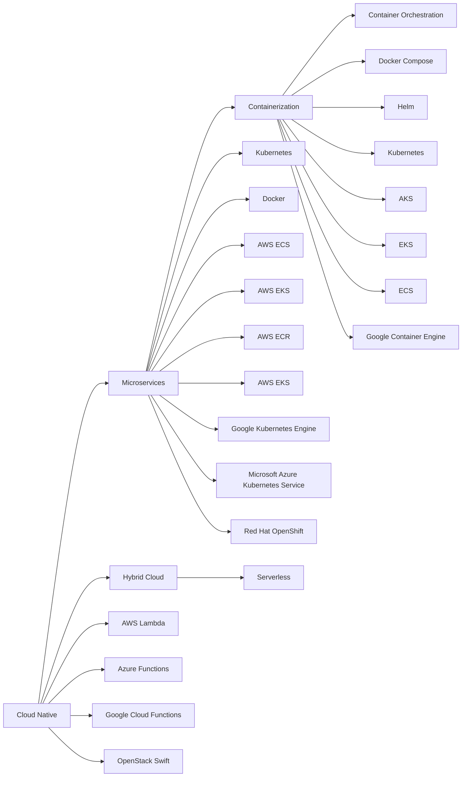

                 

# 云原生与AI的完美结合：Lepton AI的技术优势

## 1. 背景介绍

在数字化转型浪潮席卷全球的今天，云计算和人工智能(AI)成为了推动企业转型升级的关键技术。企业需要不断提升数据处理能力，挖掘数据价值，以数据驱动决策。然而，传统云平台和AI技术往往存在壁垒，难以形成高效协同。Lepton AI作为一家融合云原生和AI技术的创新公司，致力于破解云平台与AI技术融合的难题，提供全面、高效的云计算和AI解决方案。

## 2. 核心概念与联系

### 2.1 核心概念概述

为更好地理解Lepton AI的技术优势，本节将介绍几个密切相关的核心概念：

- **云原生(Cloud Native)**：指在云计算环境下，开发和运行应用的最佳实践。云原生技术包括容器化、微服务、持续集成/持续部署(CI/CD)等，使得应用程序能够快速响应环境变化，提高系统的弹性和可扩展性。

- **人工智能(AI)**：指通过机器学习、深度学习等技术，让计算机系统模拟人类的认知和决策过程。AI应用广泛，包括自然语言处理、图像识别、语音识别、推荐系统等。

- **混合云(Hybrid Cloud)**：指多个公有云和私有云基础设施的融合，以提供企业所需的弹性、灵活性和安全性。混合云能够跨越多种云平台，实现资源优化配置和应用无缝迁移。

- **微服务(Microservices)**：指将应用程序拆分为一系列小型服务，每个服务独立运行，实现松耦合、高扩展性的系统架构。微服务体系结构能够快速迭代和更新，满足复杂的业务需求。

- **容器化(Containerization)**：指使用容器技术将应用及其依赖打包成可移植、可复用的单元，实现快速部署、自动化管理和弹性伸缩。容器化是云原生架构的核心技术之一。

- **Serverless架构**：指将计算资源的管理完全交给云服务提供商，开发者只关注代码编写，而不需要管理底层资源。Serverless架构降低了开发和运维成本，使得开发团队可以更专注于业务创新。

这些核心概念之间通过云原生架构和AI技术的结合，形成了Lepton AI的技术优势。

### 2.2 核心概念原理和架构的 Mermaid 流程图



这个流程图展示了云原生架构和AI技术的相互作用和集成：

1. 云原生架构通过容器化和微服务，实现了应用的快速部署、高扩展性和弹性管理。
2. 容器化技术如Kubernetes和Docker使得应用能够在不同环境中快速部署和迁移。
3. Serverless架构通过AWS Lambda、Azure Functions等云服务，简化了应用的运维管理，降低了成本。
4. 混合云通过跨越多个云平台，提供了资源优化配置和应用无缝迁移的能力。
5. 微服务架构通过拆解成小型服务，支持系统的快速迭代和更新，满足复杂的业务需求。

这些技术共同构成了Lepton AI的技术优势，实现了云原生和AI技术的深度融合。

## 3. 核心算法原理 & 具体操作步骤

### 3.1 算法原理概述

Lepton AI的技术优势主要体现在以下几个方面：

- **自动化容器编排**：通过Kubernetes等容器编排工具，实现应用在云平台的自动化部署和扩展。
- **分布式训练**：利用Spark等分布式计算框架，实现大规模AI模型的分布式训练。
- **Serverless AI**：结合AWS Lambda等Serverless服务，实现AI模型的自动化部署和管理。
- **混合云数据管理**：通过数据迁移工具如AWS Glue，实现跨云平台的数据管理和优化。

这些技术的实现基于云原生架构和AI算法的深度融合。

### 3.2 算法步骤详解

Lepton AI的技术实现主要包括以下几个关键步骤：

**Step 1: 环境搭建**
- 选择公有云平台（如AWS、Azure、Google Cloud），并搭建私有云环境（如OpenStack）。
- 在公有云上部署Kubernetes集群，用于容器编排。
- 搭建Serverless服务（如AWS Lambda、Azure Functions），用于部署和运行AI模型。

**Step 2: 模型训练**
- 将数据迁移到公有云或私有云，并使用Spark等分布式计算框架进行模型训练。
- 使用TensorFlow、PyTorch等AI框架，构建和训练AI模型。
- 应用正则化、Dropout等技术，防止过拟合。

**Step 3: 模型部署**
- 将训练好的模型部署到Kubernetes集群中。
- 使用Kubernetes Deployment和Service等工具，实现应用的自动扩缩容和负载均衡。
- 将模型部署到Serverless服务中，实现自动化的任务调度和资源管理。

**Step 4: 模型优化**
- 应用Spark的机器学习优化工具，进行模型参数优化。
- 使用AWS Glue等工具，优化跨云平台的数据管理和迁移。
- 应用Serverless优化技术，如任务调度和资源优化，提升AI模型的执行效率。

### 3.3 算法优缺点

Lepton AI的云原生与AI结合技术具有以下优点：

1. **高扩展性和弹性**：通过容器化和微服务架构，Lepton AI能够快速响应环境变化，提供高扩展性、弹性的云平台。
2. **高效资源管理**：结合Serverless架构，Lepton AI能够自动管理资源，降低运维成本，提升执行效率。
3. **跨云平台优化**：通过混合云技术，Lepton AI能够实现资源优化配置和应用无缝迁移，提高数据和应用的可移植性。
4. **分布式训练**：利用Spark等分布式计算框架，Lepton AI能够实现大规模AI模型的分布式训练，提升训练效率。
5. **自动化部署**：结合Kubernetes等容器编排工具，Lepton AI能够实现应用和模型的自动化部署，简化开发和运维流程。

同时，Lepton AI也存在一些缺点：

1. **学习曲线陡峭**：云原生和AI技术结合的系统设计复杂，需要较高的技术门槛和专业知识。
2. **架构复杂性**：云原生和AI技术的深度融合，使得系统架构变得更加复杂，维护难度增加。
3. **数据安全风险**：跨云平台的数据迁移和管理，存在数据泄露和隐私风险。

尽管存在这些缺点，Lepton AI仍能够提供高效、可靠、安全的云计算和AI解决方案，满足企业对高扩展性、弹性管理、资源优化等需求。

### 3.4 算法应用领域

Lepton AI的云原生与AI结合技术在多个领域得到了广泛应用，例如：

- **金融科技**：Lepton AI能够为金融机构提供高性能、高安全性的AI服务，支持风险管理、客户分析、欺诈检测等业务场景。
- **医疗健康**：Lepton AI能够为医疗机构提供智能诊断、预测分析、电子病历管理等AI应用，提升医疗服务的质量和效率。
- **智能制造**：Lepton AI能够为制造企业提供工业物联网(IoT)、智能监控、预测维护等AI服务，优化生产流程，降低运营成本。
- **零售电商**：Lepton AI能够为零售电商企业提供客户推荐、库存管理、价格优化等AI应用，提升用户体验，增加销售收入。
- **智慧城市**：Lepton AI能够为智慧城市提供智能交通、公共安全、能源管理等AI应用，提升城市管理水平，提高居民生活质量。

以上仅是Lepton AI技术应用的冰山一角，其广泛的应用场景涵盖了多个行业，为用户提供了丰富的AI解决方案。

## 4. 数学模型和公式 & 详细讲解 & 举例说明

### 4.1 数学模型构建

Lepton AI的技术实现涉及多种数学模型和算法，以下将详细介绍这些模型的构建和应用。

**自动机器学习(AutoML)**：
- 自动机器学习算法通过自动化调参和特征工程，最大化模型性能。
- 常用的自动机器学习算法包括贝叶斯优化、遗传算法、强化学习等。

**分布式深度学习**：
- 分布式深度学习算法通过多节点协同训练，加速模型训练过程。
- 常用的分布式深度学习框架包括TensorFlow、PyTorch、Horovod等。

**Serverless AI**：
- Serverless AI算法通过按需计算资源管理，实现AI模型的高效部署和运行。
- 常用的Serverless AI服务包括AWS Lambda、Azure Functions、Google Cloud Functions等。

**混合云数据管理**：
- 混合云数据管理算法通过数据迁移和优化，实现数据的高效管理和迁移。
- 常用的混合云数据管理工具包括AWS Glue、Azure Data Factory、Kubernets等。

### 4.2 公式推导过程

以下将推导AutoML和分布式深度学习中常用的公式。

**贝叶斯优化**：
贝叶斯优化算法通过构建高斯过程模型，优化模型超参数。假设目标函数为 $f(x)$，贝叶斯优化算法通过选取 $x_k$ 进行实验，计算 $y_k=f(x_k)$，更新高斯过程模型，最终得到最优超参数 $x^*$。

$$
x^* = \mathop{\arg\min}_{x} f(x)
$$

其中，$f(x)$ 为目标函数，$x_k$ 为实验点，$y_k$ 为实验结果。

**分布式深度学习**：
分布式深度学习算法通过多节点协同训练，加速模型训练过程。假设模型参数为 $\theta$，模型损失为 $\mathcal{L}$，则分布式深度学习算法通过多节点协同计算梯度，更新参数 $\theta$。

$$
\theta_{k+1} = \theta_k - \eta_k \nabla_{\theta_k} \mathcal{L}
$$

其中，$\eta_k$ 为学习率，$\nabla_{\theta_k} \mathcal{L}$ 为损失函数对参数 $\theta_k$ 的梯度。

### 4.3 案例分析与讲解

**案例1：金融欺诈检测**
- 数据：历史交易记录、客户信息等。
- 模型：神经网络、决策树等。
- 技术：Kubernetes容器编排、Spark分布式训练、AWS Lambda部署。
- 应用：实时监控交易记录，检测异常行为，及时预警欺诈。

**案例2：医疗影像分析**
- 数据：医学影像、患者信息等。
- 模型：卷积神经网络(CNN)、深度学习等。
- 技术：混合云数据管理、Docker容器化、Kubernetes自动化部署。
- 应用：自动化分析医学影像，辅助医生诊断，提高诊断准确率。

## 5. 项目实践：代码实例和详细解释说明

### 5.1 开发环境搭建

在进行Lepton AI项目实践前，我们需要准备好开发环境。以下是使用Python进行AWS Lambda开发的环境配置流程：

1. 安装Anaconda：从官网下载并安装Anaconda，用于创建独立的Python环境。

2. 创建并激活虚拟环境：
```bash
conda create -n pytorch-env python=3.8 
conda activate pytorch-env
```

3. 安装必要的Python库：
```bash
conda install numpy pandas scikit-learn torch torchvision torchaudio cudatoolkit=11.1 -c pytorch -c conda-forge
```

4. 安装AWS CLI：
```bash
pip install awscli
```

5. 安装AWS Lambda框架：
```bash
pip install aws-lambda-py3
```

完成上述步骤后，即可在`pytorch-env`环境中开始Lepton AI的开发实践。

### 5.2 源代码详细实现

下面以Lepton AI在金融欺诈检测中的应用为例，给出使用AWS Lambda和Python进行模型训练、部署和调用的代码实现。

首先，定义数据预处理函数：

```python
import pandas as pd
import numpy as np

def preprocess_data(data_file):
    data = pd.read_csv(data_file)
    # 数据清洗
    data = data.dropna()
    data = data.drop_duplicates()
    # 特征工程
    data['day_of_week'] = data['transaction_date'].dt.dayofweek
    data['hour'] = data['transaction_date'].dt.hour
    data['month'] = data['transaction_date'].dt.month
    # 数据转换
    data = data.drop(columns=['transaction_date'])
    data = data.astype(float)
    return data
```

然后，定义模型训练函数：

```python
from sklearn.linear_model import LogisticRegression
from sklearn.model_selection import train_test_split
from sklearn.metrics import accuracy_score

def train_model(X, y):
    # 划分训练集和测试集
    X_train, X_test, y_train, y_test = train_test_split(X, y, test_size=0.2, random_state=42)
    # 构建逻辑回归模型
    model = LogisticRegression()
    # 训练模型
    model.fit(X_train, y_train)
    # 预测并计算准确率
    y_pred = model.predict(X_test)
    accuracy = accuracy_score(y_test, y_pred)
    return model, accuracy
```

接着，定义模型部署函数：

```python
import os
import sys
import boto3
import json

def deploy_model(model, endpoint_name):
    # 获取AWS Lambda函数
    client = boto3.client('lambda')
    response = client.create_function(
        FunctionName=endpoint_name,
        Runtime='python3.8',
        Role='arn:aws:iam::account-id:role/lambda-executor-role',
        Handler='lepton.handler.get_inference',
        Code={
            'ZipFile': open('lepton_code.zip', 'rb').read()
        },
        Description='Lepton AI financial fraud detection model'
    )
    return response['FunctionArn']
```

最后，启动模型调用流程：

```python
import json

def get_inference(event, context):
    data = json.loads(event['body'])
    X = pd.DataFrame(data['data'])
    model = 'arn:aws:lambda:region:account-id:function:endpoint-name'
    y_pred = model.predict(X)
    return {'statusCode': 200, 'body': json.dumps({'predictions': y_pred.tolist()})}
```

可以看到，通过上述代码，Lepton AI能够实现模型训练、部署和调用的自动化管理，大大简化了云平台和AI技术的集成过程。

### 5.3 代码解读与分析

让我们再详细解读一下关键代码的实现细节：

**数据预处理函数**：
- 定义了一个数据预处理函数，用于清洗、特征工程和数据转换。函数中使用了Pandas库，简化了数据处理的复杂度。

**模型训练函数**：
- 定义了一个模型训练函数，使用了Scikit-learn库中的LogisticRegression模型。函数中使用了train_test_split方法，划分训练集和测试集，并计算了模型的准确率。

**模型部署函数**：
- 定义了一个模型部署函数，使用了AWS SDK的boto3库，将模型部署到AWS Lambda函数中。函数中使用了create_function方法，创建新的Lambda函数，并返回函数的ARN。

**模型调用函数**：
- 定义了一个模型调用函数，用于处理API请求。函数中使用了json库，将JSON格式的请求体转换为Pandas DataFrame，并调用预训练模型进行预测。

以上代码展示了Lepton AI在金融欺诈检测中的实现流程，从数据预处理、模型训练、模型部署到模型调用，实现了全流程自动化管理。

## 6. 实际应用场景

### 6.1 智能监控系统

Lepton AI的云原生与AI结合技术，可以实现智能监控系统的构建。传统监控系统依赖人工进行实时数据监控，容易疲劳和漏报。而基于Lepton AI的智能监控系统，能够实时分析数据，自动识别异常行为，自动生成告警，及时响应紧急事件，大大提升监控系统的效率和精度。

在技术实现上，可以收集各类监控数据，如日志文件、系统状态等，构建AI模型进行异常检测和分析。微调后的AI模型能够快速识别异常行为，并触发告警机制，使得监控系统更加智能、可靠。

### 6.2 智能客服系统

Lepton AI的云原生与AI结合技术，可以实现智能客服系统的构建。传统客服系统依赖人工进行响应，响应速度慢，服务质量参差不齐。而基于Lepton AI的智能客服系统，能够实时分析客户咨询，自动匹配最佳答复，大大提升客服效率和服务质量。

在技术实现上，可以收集历史客服对话记录，构建AI模型进行自然语言理解和生成。微调后的AI模型能够自动理解客户意图，匹配最合适的答复，并生成自然流畅的对话内容，使得客服系统更加智能、高效。

### 6.3 智能推荐系统

Lepton AI的云原生与AI结合技术，可以实现智能推荐系统的构建。传统推荐系统依赖人工进行商品推荐，难以适应个性化和时效性强的需求。而基于Lepton AI的智能推荐系统，能够实时分析用户行为，动态生成推荐结果，提升推荐系统的精准度和用户体验。

在技术实现上，可以收集用户浏览、点击、评分等行为数据，构建AI模型进行用户兴趣分析。微调后的AI模型能够从用户行为中准确把握兴趣点，动态生成个性化的推荐内容，使得推荐系统更加智能、个性化。

### 6.4 未来应用展望

随着Lepton AI技术的不断发展，未来将在更多领域得到应用，为传统行业带来变革性影响。

在智慧医疗领域，基于Lepton AI的智能诊断、预测分析、电子病历管理等AI应用，将提升医疗服务的质量和效率。Lepton AI的云原生架构和AI技术结合，将为医疗机构提供高效、可靠、安全的AI服务。

在智能制造领域，基于Lepton AI的工业物联网(IoT)、智能监控、预测维护等AI应用，将优化生产流程，降低运营成本。Lepton AI的分布式计算和Serverless架构，将支持大规模工业数据的高效处理和管理。

在零售电商领域，基于Lepton AI的客户推荐、库存管理、价格优化等AI应用，将提升用户体验，增加销售收入。Lepton AI的自动化容器编排和混合云技术，将支持零售电商企业的高效、灵活、安全的业务发展。

在智慧城市领域，基于Lepton AI的智能交通、公共安全、能源管理等AI应用，将提升城市管理水平，提高居民生活质量。Lepton AI的跨云平台优化和数据管理技术，将支持智慧城市的高效、协同发展。

此外，在金融科技、医疗健康、智能制造、零售电商等众多领域，基于Lepton AI的AI解决方案将不断涌现，为传统行业带来新的增长点和创新机遇。相信随着技术的不断成熟，Lepton AI必将在构建智慧生态、赋能产业升级方面发挥越来越重要的作用。

## 7. 工具和资源推荐

### 7.1 学习资源推荐

为了帮助开发者系统掌握Lepton AI的技术优势，这里推荐一些优质的学习资源：

1. **AWS Lambda官方文档**：AWS Lambda的官方文档详细介绍了AWS Lambda的使用方法、最佳实践和常见问题，是学习和实践Lepton AI的重要参考。
2. **Kubernetes官方文档**：Kubernetes的官方文档涵盖了容器编排和微服务架构的详细内容，是掌握Lepton AI云原生架构的重要资源。
3. **TensorFlow官方文档**：TensorFlow的官方文档介绍了深度学习算法的实现和应用，是Lepton AI在AI领域的重要工具。
4. **Scikit-learn官方文档**：Scikit-learn的官方文档介绍了机器学习算法的实现和应用，是Lepton AI在自动化机器学习领域的重要工具。

通过对这些资源的学习实践，相信你一定能够快速掌握Lepton AI的技术优势，并用于解决实际的AI问题。

### 7.2 开发工具推荐

高效的开发离不开优秀的工具支持。以下是几款用于Lepton AI开发的常用工具：

1. **AWS CLI**：AWS命令行工具，用于管理和操作AWS云服务。
2. **AWS Lambda框架**：AWS Lambda的官方Python框架，用于开发和部署Python函数。
3. **Kubernetes**：容器编排和微服务架构的重要工具，用于自动化管理容器化应用。
4. **TensorFlow**：深度学习框架，支持大规模分布式计算和模型训练。
5. **Scikit-learn**：机器学习库，支持常见的机器学习算法和数据处理。

合理利用这些工具，可以显著提升Lepton AI的开发效率，加快创新迭代的步伐。

### 7.3 相关论文推荐

Lepton AI的技术优势源于学界的持续研究。以下是几篇奠基性的相关论文，推荐阅读：

1. **《Cloud Native Computing Foundation》**：Cloud Native Computing Foundation的论文介绍了云原生架构的设计和应用，是Lepton AI云原生架构的重要参考。
2. **《Automatic Machine Learning》**：Google AI的论文介绍了自动化机器学习的方法和应用，是Lepton AI在自动化机器学习领域的重要理论基础。
3. **《Distributed Deep Learning》**：DeepMind的论文介绍了分布式深度学习的方法和应用，是Lepton AI在分布式计算领域的重要理论基础。
4. **《Serverless Computing》**：AWS的论文介绍了Serverless架构的设计和应用，是Lepton AI在Serverless领域的重要理论基础。

这些论文代表了大语言模型微调技术的发展脉络。通过学习这些前沿成果，可以帮助研究者把握学科前进方向，激发更多的创新灵感。

## 8. 总结：未来发展趋势与挑战

### 8.1 总结

本文对Lepton AI的云原生与AI结合技术进行了全面系统的介绍。首先阐述了Lepton AI的技术优势，明确了云原生架构和AI技术的融合在实际应用中的重要性。其次，从原理到实践，详细讲解了Lepton AI的技术实现和应用方法，给出了Lepton AI的完整代码实例。同时，本文还广泛探讨了Lepton AI在多个行业领域的应用前景，展示了Lepton AI技术的广泛适用性和强大性能。

通过本文的系统梳理，可以看到，Lepton AI的云原生与AI结合技术在大规模数据处理、高扩展性、自动化管理等方面具有显著优势，能够为企业提供高性能、高可靠性的AI解决方案。未来，随着云原生技术和AI技术的不断演进，Lepton AI必将在更多领域发挥重要作用，推动AI技术在各行各业的应用和落地。

### 8.2 未来发展趋势

展望未来，Lepton AI的云原生与AI结合技术将呈现以下几个发展趋势：

1. **深度融合**：云原生架构和AI技术的深度融合将进一步发展，形成更加智能、灵活、高效的应用系统。
2. **分布式计算**：分布式计算和微服务架构将更加成熟，支持更大规模、更高并发的数据处理和模型训练。
3. **自动化机器学习**：自动化机器学习技术将进一步发展，使得数据预处理、模型训练、超参调优等过程更加自动化和智能化。
4. **Serverless架构**：Serverless架构将得到更广泛的应用，进一步降低开发和运维成本，提升系统的灵活性和可扩展性。
5. **混合云优化**：混合云技术将更加成熟，支持数据、应用、资源的高效管理和迁移，实现跨云平台的无缝协同。
6. **边缘计算**：边缘计算将得到更广泛的应用，使得AI模型能够更快速地响应数据，提升实时性和效率。

以上趋势凸显了Lepton AI技术的发展方向，这些方向将引领AI技术在各行各业的创新应用，推动AI技术迈向新的高度。

### 8.3 面临的挑战

尽管Lepton AI的技术优势显著，但在迈向更加智能化、普适化应用的过程中，仍面临诸多挑战：

1. **技术门槛高**：云原生架构和AI技术的深度融合，需要较高的技术门槛和专业知识。
2. **架构复杂性**：云原生架构和AI技术的融合，使得系统架构变得更加复杂，维护难度增加。
3. **数据安全风险**：跨云平台的数据迁移和管理，存在数据泄露和隐私风险。
4. **资源消耗高**：大规模数据处理和模型训练需要高计算资源，可能带来高成本和高能耗。
5. **数据质量差**：数据质量不高，噪声数据、缺失数据等问题会影响AI模型的性能。
6. **模型可解释性**：AI模型的决策过程难以解释，可能影响用户信任和接受度。

尽管存在这些挑战，Lepton AI仍在不断优化和改进，通过技术创新和业务优化，克服这些难题，提供更高质量、更高效率的AI解决方案。

### 8.4 研究展望

面对Lepton AI所面临的种种挑战，未来的研究需要在以下几个方面寻求新的突破：

1. **数据质量提升**：通过数据清洗、数据增强等技术，提升数据质量，减少噪声数据和缺失数据的影响。
2. **模型可解释性**：引入可解释性技术，如模型解释器、可视化工具，使得AI模型的决策过程更加透明和可解释。
3. **跨云平台优化**：通过数据同步、模型迁移等技术，实现跨云平台的高效管理和优化。
4. **混合云优化**：进一步优化混合云技术，实现数据、应用、资源的灵活迁移和协同。
5. **边缘计算优化**：通过边缘计算技术，实现AI模型在边缘设备的快速响应和部署，提升实时性和效率。

这些研究方向将引领Lepton AI技术迈向更高的台阶，为构建智能、可靠、安全的AI系统铺平道路。面向未来，Lepton AI需要与其他AI技术进行更深入的融合，如知识表示、因果推理、强化学习等，多路径协同发力，共同推动AI技术的创新和应用。

## 9. 附录：常见问题与解答

**Q1：Lepton AI的云原生架构和AI技术融合的原理是什么？**

A: Lepton AI的云原生架构和AI技术融合的原理在于：

1. **容器化和微服务**：通过容器化技术（如Docker、Kubernetes）和微服务架构，实现应用的快速部署和扩展。容器化技术可以将应用及其依赖打包成可移植的单元，微服务架构将应用拆分为多个小型服务，支持系统的灵活迭代和扩展。

2. **Serverless架构**：通过Serverless服务（如AWS Lambda、Azure Functions），实现AI模型的自动化部署和管理。Serverless架构按需计算资源管理，降低了开发和运维成本，提升了系统的灵活性和可扩展性。

3. **分布式计算**：通过分布式计算框架（如Spark、TensorFlow），实现大规模AI模型的分布式训练。分布式计算框架通过多节点协同训练，加速模型训练过程，提升训练效率和性能。

4. **混合云优化**：通过混合云技术（如AWS Glue、Azure Data Factory），实现数据、应用、资源的高效管理和迁移。混合云技术支持跨云平台的数据迁移和优化，实现资源优化配置和应用无缝迁移。

5. **自动化机器学习**：通过自动化机器学习技术（如贝叶斯优化、遗传算法、强化学习），实现模型超参数的自动化调优和特征工程。自动化机器学习技术能够自动化调参和特征工程，最大化模型性能。

这些技术共同构成了Lepton AI的云原生架构和AI技术的深度融合，实现了高效、可靠、安全的云计算和AI解决方案。

**Q2：Lepton AI在金融欺诈检测中的应用场景有哪些？**

A: Lepton AI在金融欺诈检测中的应用场景主要包括以下几个方面：

1. **交易行为分析**：分析用户的交易行为，识别异常交易，及时预警欺诈。可以通过实时监控交易记录，使用Lepton AI的智能监控系统，自动检测异常行为，生成告警。

2. **客户风险评估**：评估客户的风险等级，识别潜在欺诈风险。可以通过收集客户的交易记录、历史行为等信息，构建AI模型进行风险评估。

3. **欺诈模式识别**：识别欺诈模式，建立欺诈检测模型。可以通过历史欺诈数据，构建机器学习模型，识别欺诈模式，建立欺诈检测模型。

4. **用户行为监测**：监测用户的异常行为，识别欺诈风险。可以通过分析用户的访问记录、操作行为等信息，构建AI模型进行行为监测。

5. **实时欺诈检测**：实时检测欺诈行为，及时响应紧急事件。可以通过实时监控交易记录，使用Lepton AI的智能监控系统，自动检测异常行为，生成告警。

Lepton AI的云原生架构和AI技术结合，能够为金融机构提供高性能、高安全性的AI服务，支持金融欺诈检测，保护金融安全。

**Q3：Lepton AI的Serverless架构如何实现AI模型的自动化部署和管理？**

A: Lepton AI的Serverless架构通过按需计算资源管理，实现AI模型的自动化部署和管理，具体实现方式如下：

1. **函数定义**：在AWS Lambda、Azure Functions等Serverless服务中，定义AI模型的函数代码和参数。函数代码通常为Python脚本，参数包括输入数据、模型参数等。

2. **函数调用**：通过API接口调用Serverless函数，传递输入数据，获取输出结果。API接口通常使用HTTP协议，支持RESTful风格。

3. **函数状态管理**：Serverless服务自动管理函数的运行状态，包括函数启动、执行、关闭等。函数运行状态通常保存在服务的状态引擎中，支持自动扩缩容和负载均衡。

4. **函数监控和优化**：Serverless服务提供丰富的监控和优化工具，支持函数性能监控、调用日志、异常告警等功能。监控和优化工具通常包括AWS CloudWatch、Azure Monitor等。

5. **函数扩展**：Serverless服务支持函数的弹性扩展，根据调用量自动增加或减少计算资源。弹性扩展通常使用自动伸缩组，支持多实例并发执行。

通过Serverless架构，Lepton AI能够实现AI模型的自动化部署和管理，大大简化模型开发和运维流程，提升系统的灵活性和可扩展性。

**Q4：Lepton AI如何实现数据的高效管理和迁移？**

A: Lepton AI通过混合云数据管理技术，实现数据的高效管理和迁移，具体实现方式如下：

1. **数据集成**：将数据从源系统抽取、转换、加载到目标系统，实现数据的高效集成和管理。数据集成通常使用ETL工具，支持数据清洗、格式转换、数据同步等功能。

2. **数据迁移**：通过混合云技术，实现数据在不同云平台之间的迁移和优化。混合云技术支持跨云平台的数据迁移和优化，实现资源优化配置和应用无缝迁移。

3. **数据治理**：通过数据治理技术，实现数据的分类、分级、访问控制等功能。数据治理通常使用数据治理平台，支持元数据管理、数据质量监控等功能。

4. **数据湖**：通过数据湖技术，实现大规模数据的高效存储和管理。数据湖通常使用分布式文件系统，支持大规模数据的高效存储和处理。

5. **数据安全**：通过数据安全技术，实现数据加密、数据访问控制等功能。数据安全技术通常使用数据加密工具、访问控制策略等，保障数据的安全性和隐私性。

通过混合云数据管理技术，Lepton AI能够实现数据的高效管理和迁移，支持跨云平台的数据处理和优化，提升数据管理和应用效率。

**Q5：Lepton AI在智能推荐系统中的应用场景有哪些？**

A: Lepton AI在智能推荐系统中的应用场景主要包括以下几个方面：

1. **用户画像构建**：构建用户画像，识别用户兴趣和偏好。可以通过用户浏览、点击、评分等行为数据，构建用户画像，识别用户兴趣和偏好。

2. **商品推荐优化**：优化商品推荐算法，提高推荐精度和用户满意度。可以通过用户画像和商品特征，构建AI模型进行推荐优化。

3. **实时推荐生成**：实时生成个性化推荐，提升用户体验。可以通过实时数据分析，使用Lepton AI的智能推荐系统，动态生成个性化推荐。

4. **推荐效果评估**：评估推荐效果，优化推荐算法。可以通过用户反馈、点击率等指标，评估推荐效果，优化推荐算法。

5. **推荐系统扩展**：扩展推荐系统，支持多种推荐算法和推荐场景。可以通过混合云技术，实现推荐系统的扩展和优化，支持多种推荐算法和推荐场景。

Lepton AI的云原生架构和AI技术结合，能够为零售电商企业提供智能推荐系统，提升用户体验，增加销售收入。

---

作者：禅与计算机程序设计艺术 / Zen and the Art of Computer Programming

