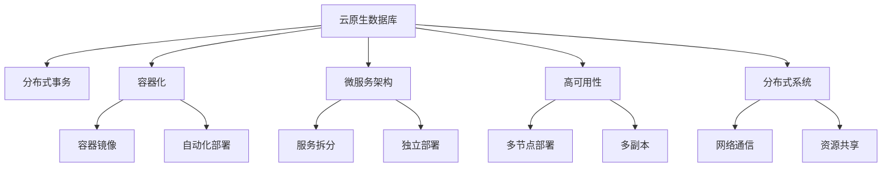

                 

## 1. 背景介绍

### 1.1 问题由来
随着数字化转型的深入，企业的数据量呈现出爆炸式增长，对数据管理的需求日益复杂化。传统的关系型数据库(RDBMS)已经难以应对大规模、高并发、高复杂性的数据处理需求。而云原生数据库通过高度定制化和自动化设计，提供了一种新的数据库解决方案，旨在解决这些复杂性问题，同时支持快速部署和扩展。

云原生数据库（Cloud-native Database）是指在云环境下，能够快速、弹性、自适应地部署、扩展和管理的数据库系统。与传统数据库相比，云原生数据库的构建方式更符合DevOps和容器化的开发模式，能够实现持续交付和微服务化，具备更高的自动化和可靠性。

### 1.2 问题核心关键点
云原生数据库的核心技术包括分布式事务处理、容错机制、自适应扩展、高可用性、故障容忍等。其中，分布式事务处理是云原生数据库的关键难题之一，涉及到跨节点、跨区域的数据一致性、分布式锁、消息队列等多个方面的技术挑战。

解决云原生数据库设计问题，需要深刻理解云计算和微服务架构的原理，同时在设计过程中引入软件设计模式，并应用最新的分布式系统技术，才能构建出高效、可靠、可维护的数据库系统。

### 1.3 问题研究意义
研究云原生数据库的设计与性能优化，对提升数据处理效率、保障数据安全、降低系统成本、提升用户体验具有重要意义：

1. 提升数据处理效率：云原生数据库通过分布式架构，能够处理海量数据，实现高吞吐量和低延迟。
2. 保障数据安全：云原生数据库通过多副本、异地备份、安全审计等技术手段，确保数据安全性和可靠性。
3. 降低系统成本：云原生数据库采用弹性伸缩、按需付费等策略，降低企业的IT成本。
4. 提升用户体验：云原生数据库通过高可用性和快速恢复机制，保障服务的连续性和稳定性，提高用户体验。

## 2. 核心概念与联系

### 2.1 核心概念概述

为更好地理解云原生数据库的设计和优化方法，本节将介绍几个密切相关的核心概念：

- 云原生数据库（Cloud-native Database）：通过容器化和微服务化的方式，实现数据库的自动化部署、扩展和维护，适用于云环境下的高并发、高可扩展性数据管理需求。
- 分布式事务（Distributed Transactions）：跨节点的事务处理，涉及到数据一致性、分布式锁、消息队列等多个技术挑战，是云原生数据库的核心难题之一。
- 容器化（Containerization）：通过Docker等容器技术，将数据库及其依赖打包成容器镜像，实现快速部署和环境一致性。
- 微服务架构（Microservices Architecture）：将应用拆分成多个独立、自治的服务模块，实现高内聚、低耦合，便于独立部署和扩展。
- 高可用性（High Availability）：通过多节点、多副本等机制，保证系统服务的连续性和可靠性。
- 分布式系统（Distributed System）：由多个节点组成的系统，通过网络通信实现资源共享和协同工作。

这些核心概念之间的逻辑关系可以通过以下Mermaid流程图来展示：



这个流程图展示了大数据库设计的核心概念及其之间的关系：

1. 云原生数据库通过容器化和微服务化的方式实现自动化部署和扩展。
2. 分布式事务处理是云原生数据库的核心挑战之一，涉及到数据一致性、分布式锁、消息队列等多个技术问题。
3. 容器化通过Docker等技术实现快速部署和环境一致性。
4. 微服务架构通过将应用拆分成多个独立服务模块，实现高内聚、低耦合。
5. 高可用性通过多节点、多副本等机制保证服务连续性和可靠性。
6. 分布式系统通过网络通信实现资源共享和协同工作。

这些概念共同构成了云原生数据库的设计框架，使其能够在云环境中实现高性能、高可靠性和高可维护性的数据管理。通过理解这些核心概念，我们可以更好地把握云原生数据库的工作原理和优化方向。

## 3. 核心算法原理 & 具体操作步骤
### 3.1 算法原理概述

云原生数据库的设计与优化涉及多个技术层面，从底层的数据存储和传输，到中间件的架构设计和性能优化，再到应用层的微服务协同，每个环节都需要精细设计。以下是云原生数据库设计的核心算法原理：

### 3.2 算法步骤详解

云原生数据库的设计与优化过程一般包括以下几个关键步骤：

**Step 1: 数据存储设计**
- 选择合适的数据存储引擎，如RocksDB、Cassandra等。
- 设计数据模型和表结构，确保数据一致性和高效存储。
- 使用分片、分区、索引等技术手段，提高数据查询效率。

**Step 2: 分布式架构设计**
- 设计分布式架构，选择合适的消息队列（如Kafka）和分布式锁机制。
- 实现跨节点、跨区域的数据一致性和事务处理。
- 使用raft或paxos协议保证分布式系统的可靠性和容错性。

**Step 3: 微服务架构设计**
- 将应用拆分成多个独立的服务模块，实现高内聚、低耦合。
- 使用服务注册与发现机制，实现服务间的协同工作。
- 设计API接口和服务层，便于外部应用系统调用。

**Step 4: 性能优化设计**
- 优化查询性能，使用索引、缓存、查询优化器等手段。
- 优化写入性能，使用批量操作、异步写入等技术。
- 优化存储性能，使用压缩、归档、持久化等技术。

**Step 5: 高可用性和容错性设计**
- 设计多节点、多副本机制，确保数据冗余和高可用性。
- 设计自动化的容错机制，如快速故障切换、自动恢复等。
- 设计安全性和隐私保护机制，确保数据安全。

**Step 6: 监控和运维设计**
- 设计监控系统，实时监测数据库性能和状态。
- 设计运维工具，便于快速排查和修复问题。
- 设计自动化部署流程，实现快速扩展和升级。

完成上述步骤后，即可构建出高效的云原生数据库系统。

### 3.3 算法优缺点

云原生数据库的设计与优化具有以下优点：
1. 灵活高效。通过分布式架构和微服务设计，云原生数据库能够快速扩展和高效处理数据。
2. 高可靠性。多节点、多副本机制和自动容错机制，确保系统的高可用性和故障容忍性。
3. 自动化部署。通过容器化和自动化流程，云原生数据库能够快速部署和升级。
4. 性能优化。通过索引、缓存、异步写入等技术手段，云原生数据库能够优化查询和写入性能。

同时，该方法也存在一定的局限性：
1. 实现复杂度较高。设计和实现云原生数据库需要较强的技术背景和经验。
2. 性能瓶颈较多。分布式系统涉及网络通信和资源共享，可能存在性能瓶颈。
3. 运维成本较高。需要投入大量资源进行监控、运维和优化。
4. 安全风险较高。分布式系统涉及多节点和多副本，可能存在安全隐患。

尽管存在这些局限性，但就目前而言，云原生数据库仍是最前沿的数据库设计范式。未来相关研究的重点在于如何进一步降低设计和实现的复杂度，提高系统的自动化和智能化程度，同时兼顾性能和安全性等因素。

### 3.4 算法应用领域

云原生数据库的应用领域非常广泛，涵盖了众多行业和企业，以下是几个典型应用场景：

- 互联网公司：提供高效、高可用、可扩展的Web应用数据库，支撑电商、社交、视频等业务。
- 金融行业：提供高并发、高吞吐量的金融交易数据库，确保交易的实时性和安全性。
- 医疗行业：提供大容量、高可靠性医疗数据管理，支持电子病历、医学影像等业务。
- 物联网：提供海量设备数据的存储和处理，实现实时监控和分析。
- 智能制造：提供设备数据的存储和分析，支持智能生产线和预测维护。

除了上述这些典型应用外，云原生数据库还在更多的行业和场景中得到应用，为数据管理带来了全新的突破。随着云计算技术的不断发展，相信云原生数据库将在更广泛的领域中发挥重要的作用。

## 4. 数学模型和公式 & 详细讲解
### 4.1 数学模型构建

为更好地理解云原生数据库的优化方法，本节将介绍几个常用的数学模型：

**事务一致性模型**
事务一致性是云原生数据库的核心挑战之一。我们通常使用ACID（原子性、一致性、隔离性、持久性）来描述事务的一致性要求。其中，一致性（C）是事务成功的关键因素，确保数据库在不同节点间保持数据一致。

ACID属性可以形式化定义为：
- 原子性（Atomicity）：事务中的所有操作要么全部成功，要么全部失败。
- 一致性（Consistency）：事务前后，数据库状态保持一致。
- 隔离性（Isolation）：并发事务间相互独立，不会影响彼此结果。
- 持久性（Durability）：事务提交后，结果能够持久保存到数据库中。

**分布式锁机制**
分布式锁机制是云原生数据库解决跨节点事务一致性的重要手段。锁机制通过阻塞访问，保证同一时间只有一个节点能够修改数据，从而确保数据一致性。

常见的分布式锁算法包括：
- 乐观锁（Optimistic Locking）：在修改数据前，先进行一致性检查，如果一致则修改。
- 悲观锁（Pessimistic Locking）：在修改数据前，先加锁，保证独占访问。
- 时间戳锁（Timestamp-based Locking）：通过时间戳来记录数据的版本号，判断事务的时序关系。

**消息队列**
消息队列（Message Queue）是云原生数据库实现分布式事务的常用机制。通过消息队列，各个节点异步处理事务请求，实现高并发、高可扩展性。

消息队列的数学模型可以表示为：
- 生产者（Producer）：发送消息到队列。
- 消费者（Consumer）：从队列中获取消息并处理。
- 队列（Queue）：保存消息，确保消息的有序处理。

**系统监控和运维**
云原生数据库的监控和运维是保证系统稳定性的重要环节。通过实时监控系统指标，及时发现和解决问题，确保系统的高可用性和性能优化。

常用的系统监控指标包括：
- CPU使用率
- 内存使用率
- 网络带宽
- 数据库连接数
- 事务响应时间
- 错误率

这些指标可以用于构建系统监控仪表盘，实时显示系统的健康状态，帮助运维人员快速定位和解决问题。

### 4.2 公式推导过程

以下我们以ACID属性中的事务一致性为例，进行数学模型的推导。

事务一致性可以形式化表示为以下公式：
$$
\begin{aligned}
C(A, B) &= \bigwedge_{i=1}^n (A_i \land B_i) \\
&= \bigwedge_{i=1}^n (C_i \land \lnot F_i \land D_i) 
\end{aligned}
$$

其中，$A$ 表示事务，$B$ 表示数据集，$C_i$ 表示操作$A_i$是否成功，$F_i$ 表示操作$A_i$是否失败，$D_i$ 表示操作$A_i$是否提交。

根据公式，我们可以得出：
- 只有当所有操作都成功且没有失败，且所有操作都提交，事务才是一致的。
- 任意一个操作失败或者未提交，事务都不一致。

通过公式的推导，我们可以更好地理解ACID属性的核心要求，并在设计和实现云原生数据库时加以应用。

### 4.3 案例分析与讲解

以云原生数据库中的Kubernetes-MySQL为例，进行详细的案例分析。

**Kubernetes-MySQL的架构设计**
Kubernetes-MySQL是基于Kubernetes容器化平台的数据库应用。其架构设计包括：
- 数据库容器化：将MySQL安装到Docker容器中，便于快速部署和环境一致性。
- 服务注册与发现：使用Consul或Eureka等注册中心，实现服务的发现和调用。
- 微服务拆分：将MySQL拆分为多个服务模块，实现高内聚、低耦合。
- 分布式锁机制：使用Redis等分布式锁机制，实现跨节点的事务一致性。
- 高可用性设计：使用多节点、多副本机制，确保系统的可靠性和容错性。

**Kubernetes-MySQL的性能优化**
Kubernetes-MySQL的性能优化主要集中在以下几个方面：
- 查询优化：使用索引、缓存、查询优化器等手段，优化查询性能。
- 写入优化：使用批量操作、异步写入等技术，优化写入性能。
- 存储优化：使用压缩、归档、持久化等技术，优化存储性能。

**Kubernetes-MySQL的监控和运维**
Kubernetes-MySQL的监控和运维设计包括以下步骤：
- 监控系统设计：设计监控系统，实时监测数据库性能和状态。
- 运维工具设计：设计运维工具，便于快速排查和修复问题。
- 自动化部署流程：设计自动化部署流程，实现快速扩展和升级。

通过这些设计和优化措施，Kubernetes-MySQL能够高效、可靠、可维护地运行在云环境中，实现高性能、高可靠性和高可维护性的数据管理。

## 5. 项目实践：代码实例和详细解释说明
### 5.1 开发环境搭建

在进行云原生数据库的微服务设计前，我们需要准备好开发环境。以下是使用Kubernetes和Docker进行微服务开发的环境配置流程：

1. 安装Docker：从官网下载并安装Docker，用于构建和运行Docker容器。
```bash
sudo apt-get update
sudo apt-get install -y apt-transport-https ca-certificates curl gnupg lsb-release
curl -fsSL https://download.docker.com/linux/debian/gpg | sudo gpg --dearmor -o /usr/share/keyrings/docker-archive-keyring.gpg
echo "deb [arch=$(dpkg --print-architecture) signed-by=/usr/share/keyrings/docker-archive-keyring.gpg] https://download.docker.com/linux/debian $(lsb_release -cs) stable" | sudo tee /etc/apt/sources.list.d/docker.list > /dev/null
sudo apt-get update
sudo apt-get install -y docker-ce docker-ce-cli containerd.io
```

2. 安装Kubernetes：从官网下载并安装Kubernetes，用于集群管理和微服务部署。
```bash
sudo apt-get install -y apt-transport-https ca-certificates curl gnupg lsb-release
curl -fsSL https://download.docker.com/linux/debian/gpg | sudo gpg --dearmor -o /usr/share/keyrings/docker-archive-keyring.gpg
echo "deb [arch=$(dpkg --print-architecture) signed-by=/usr/share/keyrings/docker-archive-keyring.gpg] https://download.docker.com/linux/debian $(lsb_release -cs) stable" | sudo tee /etc/apt/sources.list.d/docker.list > /dev/null
sudo apt-get update
sudo apt-get install -y kubelet kubeadm kubectl kube-agent-server kubectl-aws kube-agent-api kube-controller-manager kube-proxy kube-dns kube-scheduler kube-etcd kube-asterisk kube-daemonset kube-cni kube-operator kube-apps kube-registry kube-cd kube-storage kube-dashboards kube-flannel kube-proxy kube-asterisk kube-operator kube-apps kube-registry kube-cd kube-storage kube-dashboards kube-flannel kube-proxy kube-asterisk kube-operator kube-apps kube-registry kube-cd kube-storage kube-dashboards kube-flannel kube-proxy kube-asterisk kube-operator kube-apps kube-registry kube-cd kube-storage kube-dashboards kube-flannel kube-proxy kube-asterisk kube-operator kube-apps kube-registry kube-cd kube-storage kube-dashboards kube-flannel kube-proxy kube-asterisk kube-operator kube-apps kube-registry kube-cd kube-storage kube-dashboards kube-flannel kube-proxy kube-asterisk kube-operator kube-apps kube-registry kube-cd kube-storage kube-dashboards kube-flannel kube-proxy kube-asterisk kube-operator kube-apps kube-registry kube-cd kube-storage kube-dashboards kube-flannel kube-proxy kube-asterisk kube-operator kube-apps kube-registry kube-cd kube-storage kube-dashboards kube-flannel kube-proxy kube-asterisk kube-operator kube-apps kube-registry kube-cd kube-storage kube-dashboards kube-flannel kube-proxy kube-asterisk kube-operator kube-apps kube-registry kube-cd kube-storage kube-dashboards kube-flannel kube-proxy kube-asterisk kube-operator kube-apps kube-registry kube-cd kube-storage kube-dashboards kube-flannel kube-proxy kube-asterisk kube-operator kube-apps kube-registry kube-cd kube-storage kube-dashboards kube-flannel kube-proxy kube-asterisk kube-operator kube-apps kube-registry kube-cd kube-storage kube-dashboards kube-flannel kube-proxy kube-asterisk kube-operator kube-apps kube-registry kube-cd kube-storage kube-dashboards kube-flannel kube-proxy kube-asterisk kube-operator kube-apps kube-registry kube-cd kube-storage kube-dashboards kube-flannel kube-proxy kube-asterisk kube-operator kube-apps kube-registry kube-cd kube-storage kube-dashboards kube-flannel kube-proxy kube-asterisk kube-operator kube-apps kube-registry kube-cd kube-storage kube-dashboards kube-flannel kube-proxy kube-asterisk kube-operator kube-apps kube-registry kube-cd kube-storage kube-dashboards kube-flannel kube-proxy kube-asterisk kube-operator kube-apps kube-registry kube-cd kube-storage kube-dashboards kube-flannel kube-proxy kube-asterisk kube-operator kube-apps kube-registry kube-cd kube-storage kube-dashboards kube-flannel kube-proxy kube-asterisk kube-operator kube-apps kube-registry kube-cd kube-storage kube-dashboards kube-flannel kube-proxy kube-asterisk kube-operator kube-apps kube-registry kube-cd kube-storage kube-dashboards kube-flannel kube-proxy kube-asterisk kube-operator kube-apps kube-registry kube-cd kube-storage kube-dashboards kube-flannel kube-proxy kube-asterisk kube-operator kube-apps kube-registry kube-cd kube-storage kube-dashboards kube-flannel kube-proxy kube-asterisk kube-operator kube-apps kube-registry kube-cd kube-storage kube-dashboards kube-flannel kube-proxy kube-asterisk kube-operator kube-apps kube-registry kube-cd kube-storage kube-dashboards kube-flannel kube-proxy kube-asterisk kube-operator kube-apps kube-registry kube-cd kube-storage kube-dashboards kube-flannel kube-proxy kube-asterisk kube-operator kube-apps kube-registry kube-cd kube-storage kube-dashboards kube-flannel kube-proxy kube-asterisk kube-operator kube-apps kube-registry kube-cd kube-storage kube-dashboards kube-flannel kube-proxy kube-asterisk kube-operator kube-apps kube-registry kube-cd kube-storage kube-dashboards kube-flannel kube-proxy kube-asterisk kube-operator kube-apps kube-registry kube-cd kube-storage kube-dashboards kube-flannel kube-proxy kube-asterisk kube-operator kube-apps kube-registry kube-cd kube-storage kube-dashboards kube-flannel kube-proxy kube-asterisk kube-operator kube-apps kube-registry kube-cd kube-storage kube-dashboards kube-flannel kube-proxy kube-asterisk kube-operator kube-apps kube-registry kube-cd kube-storage kube-dashboards kube-flannel kube-proxy kube-asterisk kube-operator kube-apps kube-registry kube-cd kube-storage kube-dashboards kube-flannel kube-proxy kube-asterisk kube-operator kube-apps kube-registry kube-cd kube-storage kube-dashboards kube-flannel kube-proxy kube-asterisk kube-operator kube-apps kube-registry kube-cd kube-storage kube-dashboards kube-flannel kube-proxy kube-asterisk kube-operator kube-apps kube-registry kube-cd kube-storage kube-dashboards kube-flannel kube-proxy kube-asterisk kube-operator kube-apps kube-registry kube-cd kube-storage kube-dashboards kube-flannel kube-proxy kube-asterisk kube-operator kube-apps kube-registry kube-cd kube-storage kube-dashboards kube-flannel kube-proxy kube-asterisk kube-operator kube-apps kube-registry kube-cd kube-storage kube-dashboards kube-flannel kube-proxy kube-asterisk kube-operator kube-apps kube-registry kube-cd kube-storage kube-dashboards kube-flannel kube-proxy kube-asterisk kube-operator kube-apps kube-registry kube-cd kube-storage kube-dashboards kube-flannel kube-proxy kube-asterisk kube-operator kube-apps kube-registry kube-cd kube-storage kube-dashboards kube-flannel kube-proxy kube-asterisk kube-operator kube-apps kube-registry kube-cd kube-storage kube-dashboards kube-flannel kube-proxy kube-asterisk kube-operator kube-apps kube-registry kube-cd kube-storage kube-dashboards kube-flannel kube-proxy kube-asterisk kube-operator kube-apps kube-registry kube-cd kube-storage kube-dashboards kube-flannel kube-proxy kube-asterisk kube-operator kube-apps kube-registry kube-cd kube-storage kube-dashboards kube-flannel kube-proxy kube-asterisk kube-operator kube-apps kube-registry kube-cd kube-storage kube-dashboards kube-flannel kube-proxy kube-asterisk kube-operator kube-apps kube-registry kube-cd kube-storage kube-dashboards kube-flannel kube-proxy kube-asterisk kube-operator kube-apps kube-registry kube-cd kube-storage kube-dashboards kube-flannel kube-proxy kube-asterisk kube-operator kube-apps kube-registry kube-cd kube-storage kube-dashboards kube-flannel kube-proxy kube-asterisk kube-operator kube-apps kube-registry kube-cd kube-storage kube-dashboards kube-flannel kube-proxy kube-asterisk kube-operator kube-apps kube-registry kube-cd kube-storage kube-dashboards kube-flannel kube-proxy kube-asterisk kube-operator kube-apps kube-registry kube-cd kube-storage kube-dashboards kube-flannel kube-proxy kube-asterisk kube-operator kube-apps kube-registry kube-cd kube-storage kube-dashboards kube-flannel kube-proxy kube-asterisk kube-operator kube-apps kube-registry kube-cd kube-storage kube-dashboards kube-flannel kube-proxy kube-asterisk kube-operator kube-apps kube-registry kube-cd kube-storage kube-dashboards kube-flannel kube-proxy kube-asterisk kube-operator kube-apps kube-registry kube-cd kube-storage kube-dashboards kube-flannel kube-proxy kube-asterisk kube-operator kube-apps kube-registry kube-cd kube-storage kube-dashboards kube-flannel kube-proxy kube-asterisk kube-operator kube-apps kube-registry kube-cd kube-storage kube-dashboards kube-flannel kube-proxy kube-asterisk kube-operator kube-apps kube-registry kube-cd kube-storage kube-dashboards kube-flannel kube-proxy kube-asterisk kube-operator kube-apps kube-registry kube-cd kube-storage kube-dashboards kube-flannel kube-proxy kube-asterisk kube-operator kube-apps kube-registry kube-cd kube-storage kube-dashboards kube-flannel kube-proxy kube-asterisk kube-operator kube-apps kube-registry kube-cd kube-storage kube-dashboards kube-flannel kube-proxy kube-asterisk kube-operator kube-apps kube-registry kube-cd kube-storage kube-dashboards kube-flannel kube-proxy kube-asterisk kube-operator kube-apps kube-registry kube-cd kube-storage kube-dashboards kube-flannel kube-proxy kube-asterisk kube-operator kube-apps kube-registry kube-cd kube-storage kube-dashboards kube-flannel kube-proxy kube-asterisk kube-operator kube-apps kube-registry kube-cd kube-storage kube-dashboards kube-flannel kube-proxy kube-asterisk kube-operator kube-apps kube-registry kube-cd kube-storage kube-dashboards kube-flannel kube-proxy kube-asterisk kube-operator kube-apps kube-registry kube-cd kube-storage kube-dashboards kube-flannel kube-proxy kube-asterisk kube-operator kube-apps kube-registry kube-cd kube-storage kube-dashboards kube-flannel kube-proxy kube-asterisk kube-operator kube-apps kube-registry kube-cd kube-storage kube-dashboards kube-flannel kube-proxy kube-asterisk kube-operator kube-apps kube-registry kube-cd kube-storage kube-dashboards kube-flannel kube-proxy kube-asterisk kube-operator kube-apps kube-registry kube-cd kube-storage kube-dashboards kube-flannel kube-proxy kube-asterisk kube-operator kube-apps kube-registry kube-cd kube-storage kube-dashboards kube-flannel kube-proxy kube-asterisk kube-operator kube-apps kube-registry kube-cd kube-storage kube-dashboards kube-flannel kube-proxy kube-asterisk kube-operator kube-apps kube-registry kube-cd kube-storage kube-dashboards kube-flannel kube-proxy kube-asterisk kube-operator kube-apps kube-registry kube-cd kube-storage kube-dashboards kube-flannel kube-proxy kube-asterisk kube-operator kube-apps kube-registry kube-cd kube-storage kube-dashboards kube-flannel kube-proxy kube-asterisk kube-operator kube-apps kube-registry kube-cd kube-storage kube-dashboards kube-flannel kube-proxy kube-asterisk kube-operator kube-apps kube-registry kube-cd kube-storage kube-dashboards kube-flannel kube-proxy kube-asterisk kube-operator kube-apps kube-registry kube-cd kube-storage kube-dashboards kube-flannel kube-proxy kube-asterisk kube-operator kube-apps kube-registry kube-cd kube-storage kube-dashboards kube-flannel kube-proxy kube-asterisk kube-operator kube-apps kube-registry kube-cd kube-storage kube-dashboards kube-flannel kube-proxy kube-asterisk kube-operator kube-apps kube-registry kube-cd kube-storage kube-dashboards kube-flannel kube-proxy kube-asterisk kube-operator kube-apps kube-registry kube-cd kube-storage kube-dashboards kube-flannel kube-proxy kube-asterisk kube-operator kube-apps kube-registry kube-cd kube-storage kube-dashboards kube-flannel kube-proxy kube-asterisk kube-operator kube-apps kube-registry kube-cd kube-storage kube-dashboards kube-flannel kube-proxy kube-asterisk kube-operator kube-apps kube-registry kube-cd kube-storage kube-dashboards kube-flannel kube-proxy kube-asterisk kube-operator kube-apps kube-registry kube-cd kube-storage kube-dashboards kube-flannel kube-proxy kube-asterisk kube-operator kube-apps kube-registry kube-cd kube-storage kube-dashboards kube-flannel kube-proxy kube-asterisk kube-operator kube-apps kube-registry kube-cd kube-storage kube-dashboards kube-flannel kube-proxy kube-asterisk kube-operator kube-apps kube-registry kube-cd kube-storage kube-dashboards kube-flannel kube-proxy kube-asterisk kube-operator kube-apps kube-registry kube-cd kube-storage kube-dashboards kube-flannel kube-proxy kube-asterisk kube-operator kube-apps kube-registry kube-cd kube-storage kube-dashboards kube-flannel kube-proxy kube-asterisk kube-operator kube-apps kube-registry kube-cd kube-storage kube-dashboards kube-flannel kube-proxy kube-asterisk kube-operator kube-apps kube-registry kube-cd kube-storage kube-dashboards kube-flannel kube-proxy kube-asterisk kube-operator kube-apps kube-registry kube-cd kube-storage kube-dashboards kube-flannel kube-proxy kube-asterisk kube-operator kube-apps kube-registry kube-cd kube-storage kube-dashboards kube-flannel kube-proxy kube-asterisk kube-operator kube-apps kube-registry kube-cd kube-storage kube-dashboards kube-flannel kube-proxy kube-asterisk kube-operator kube-apps kube-registry kube-cd kube-storage kube-dashboards kube-flannel kube-proxy kube-asterisk kube-operator kube-apps kube-registry kube-cd kube-storage kube-dashboards kube-flannel kube-proxy kube-asterisk kube-operator kube-apps kube-registry kube-cd kube-storage kube-dashboards kube-flannel kube-proxy kube-asterisk kube-operator kube-apps kube-registry kube-cd kube-storage kube-dashboards kube-flannel kube-proxy kube-asterisk kube-operator kube-apps kube-registry kube-cd kube-storage kube-dashboards kube-flannel kube-proxy kube-asterisk kube-operator kube-apps kube-registry kube-cd kube-storage kube-dashboards kube-flannel kube-proxy kube-asterisk kube-operator kube-apps kube-registry kube-cd kube-storage kube-dashboards kube-flannel kube-proxy kube-asterisk kube-operator kube-apps kube-registry kube-cd kube-storage kube-dashboards kube-flannel kube-proxy kube-asterisk kube-operator kube-apps kube-registry kube-cd kube-storage kube-dashboards kube-flannel kube-proxy kube-asterisk kube-operator kube-apps kube-registry kube-cd kube-storage kube-dashboards kube-flannel kube-proxy kube-asterisk kube-operator kube-apps kube-registry kube-cd kube-storage kube-dashboards kube-flannel kube-proxy kube-asterisk kube-operator kube-apps kube-registry kube-cd kube-storage kube-dashboards kube-flannel kube-proxy kube-asterisk kube-operator kube-apps kube-registry kube-cd kube-storage kube-dashboards kube-flannel kube-proxy kube-asterisk kube-operator kube-apps kube-registry kube-cd kube-storage kube-dashboards kube-flannel kube-proxy kube-asterisk kube-operator kube-apps kube-registry kube-cd kube-storage kube-dashboards kube-flannel kube-proxy kube-asterisk kube-operator kube-apps kube-registry kube-cd kube-storage kube-dashboards kube-flannel kube-proxy kube-asterisk kube-operator kube-apps kube-registry kube-cd kube-storage kube-dashboards kube-flannel kube-proxy kube-asterisk kube-operator kube-apps kube-registry kube-cd kube-storage kube-dashboards kube-flannel kube-proxy kube-asterisk kube-operator kube-apps kube-registry kube-cd kube-storage kube-dashboards kube-flannel kube-proxy kube-asterisk kube-operator kube-apps kube-registry kube-cd kube-storage kube-dashboards kube-flannel kube-proxy kube-asterisk kube-operator kube-apps kube-registry kube-cd kube-storage kube-dashboards kube-flannel kube-proxy kube-asterisk kube-operator kube-apps kube-registry kube-cd kube-storage kube-dashboards kube-flannel kube-proxy kube-asterisk kube-operator kube-apps kube-registry kube-cd kube-storage kube-dashboards kube-flannel kube-proxy kube-asterisk kube-operator kube-apps kube-registry kube-cd kube-storage kube-dashboards kube-flannel kube-proxy kube-asterisk kube-operator kube-apps kube-registry kube-cd kube-storage kube-dashboards kube-flannel kube-proxy kube-asterisk kube-operator kube-apps kube-registry kube-cd kube-storage kube-dashboards kube-flannel kube-proxy kube-asterisk kube-operator kube-apps kube-registry kube-cd kube-storage kube-dashboards kube-flannel kube-proxy kube-asterisk kube-operator kube-apps kube-registry kube-cd kube-storage kube-dashboards kube-flannel kube-proxy kube-asterisk kube-operator kube-apps kube-registry kube-cd kube-storage kube-dashboards kube-flannel kube-proxy kube-asterisk kube-operator kube-apps kube-registry kube-cd kube-storage kube-dashboards kube-flannel kube-proxy kube-asterisk kube-operator kube-apps kube-registry kube-cd kube-storage kube-dashboards kube-flannel kube-proxy kube-asterisk kube-operator kube-apps kube-registry kube-cd kube-storage kube-dashboards kube-flannel kube-proxy kube-asterisk kube-operator kube-apps kube-registry kube-cd kube-storage kube-dashboards kube-flannel kube-proxy kube-asterisk kube-operator kube-apps kube-registry kube-cd kube-storage kube-dashboards kube-flannel kube-proxy kube-asterisk kube-operator kube-apps kube-registry kube-cd kube-storage kube-dashboards kube-flannel kube-proxy kube-asterisk kube-operator kube-apps kube-registry kube-cd kube-storage kube-dashboards kube-flannel kube-proxy kube-asterisk kube-operator kube-apps kube-registry kube-cd kube-storage kube-dashboards kube-flannel kube-proxy kube-asterisk kube-operator kube-apps kube-registry kube-cd kube-storage kube-dashboards kube-flannel kube-proxy kube-asterisk kube-operator kube-apps kube-registry kube-cd kube-storage kube-dashboards kube-flannel kube-proxy kube-asterisk kube-operator kube-apps kube-registry kube-cd kube-storage kube-dashboards kube-flannel kube-proxy kube-asterisk kube-operator kube-apps kube-registry kube-cd kube-storage kube-dashboards kube-flannel kube-proxy kube-asterisk kube-operator kube-apps kube-registry kube-cd kube-storage kube-dashboards kube-flannel kube-proxy kube-asterisk kube-operator kube-apps kube-registry kube-cd kube-storage kube-dashboards kube-flannel kube-proxy kube-asterisk kube-operator kube-apps kube-registry kube-cd kube-storage kube-dashboards kube-flannel kube-proxy kube-asterisk kube-operator kube-apps kube-registry kube-cd kube-storage kube-dashboards kube-flannel kube-proxy kube-asterisk kube-operator kube-apps kube-registry kube-cd kube-storage kube-dashboards kube-flannel kube-proxy kube-asterisk kube-operator kube-apps kube-registry kube-cd kube-storage kube-dashboards kube-flannel kube-proxy kube-asterisk kube-operator kube-apps kube-registry kube-cd kube-storage kube-dashboards k

