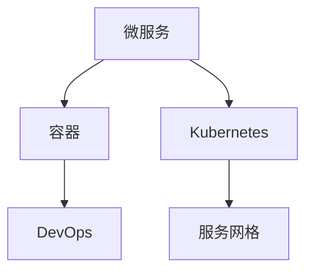

                 

# 云原生架构：微服务、容器与Kubernetes

> 关键词：云原生、微服务、容器、Kubernetes、DevOps、分布式系统、弹性伸缩、负载均衡、服务网格

## 1. 背景介绍

### 1.1 问题由来
随着云计算技术的迅速发展，企业对云平台的依赖日益加深。在云环境中部署应用时，传统单体应用架构面临着诸多挑战：维护成本高、升级部署困难、系统扩展性差、资源利用率低等。为解决这些问题，云原生架构应运而生，通过微服务、容器、Kubernetes等技术，构建出更加灵活、高效、可扩展的分布式系统。

云原生架构的核心理念是自动化、自我修复、自我服务。它通过微服务将大型应用拆解为多个独立的服务模块，实现松散耦合、高内聚，增强系统的扩展性和可靠性。同时，通过容器技术将服务打包为独立的镜像，使得部署和运维更加方便高效。Kubernetes作为云原生架构的核心组件，通过抽象容器生命周期，提供自动化的编排、扩展、监控等功能，实现分布式系统的自动化管理和弹性伸缩。

### 1.2 问题核心关键点
云原生架构的核心关键点包括以下几个方面：

- 微服务：通过将单体应用拆分成多个独立服务，增强应用的可扩展性和灵活性。
- 容器：通过容器技术将应用打包为独立的镜像，实现快速部署和一致性。
- Kubernetes：通过Kubernetes集群管理容器化应用，实现自动化部署、扩展、监控。
- DevOps：通过持续集成、持续部署、持续监控等DevOps实践，提升开发效率和系统可靠性。
- 服务网格：通过Istio等服务网格技术，实现微服务之间的负载均衡、流量控制、安全防护等功能，提高系统稳定性。

这些关键点共同构成了云原生架构的核心，使其在现代分布式系统构建中扮演着重要的角色。

## 2. 核心概念与联系

### 2.1 核心概念概述

为更好地理解云原生架构的构建，本节将介绍几个密切相关的核心概念：

- 微服务(Microservices)：将单体应用拆分为多个独立的服务模块，通过轻量级通信机制实现服务间的松耦合。
- 容器(Container)：通过Docker等容器技术将应用打包为独立的镜像，实现快速部署、环境一致性、资源隔离。
- Kubernetes(K8s)：通过Kubernetes集群管理容器化应用，实现自动化部署、扩展、监控。
- DevOps：通过持续集成、持续部署、持续监控等DevOps实践，提升开发效率和系统可靠性。
- 服务网格(Service Mesh)：通过Istio等服务网格技术，实现微服务之间的负载均衡、流量控制、安全防护等功能，提高系统稳定性。

这些核心概念之间的逻辑关系可以通过以下Mermaid流程图来展示：



这个流程图展示云原生架构的核心概念及其之间的关系：

1. 微服务是云原生架构的起点，通过拆分应用实现服务模块的独立部署和扩展。
2. 容器技术将微服务打包为独立的镜像，实现环境一致性和资源隔离。
3. Kubernetes通过集群管理容器化应用，实现自动化部署、扩展、监控。
4. DevOps通过持续集成、持续部署、持续监控等实践，提升开发效率和系统可靠性。
5. 服务网格通过流量控制、安全防护等功能，进一步增强系统的稳定性和可维护性。

这些概念共同构成了云原生架构的技术栈，使其在构建分布式系统时具备了极大的灵活性和可靠性。

## 3. 核心算法原理 & 具体操作步骤

### 3.1 算法原理概述

云原生架构的构建过程中，涉及多种算法和技术的协同工作。以微服务和容器为核心，通过Kubernetes进行编排和管理，DevOps保证持续交付，服务网格实现流量控制和安全防护。

- 微服务：采用API网关、服务注册中心等技术，实现服务发现和负载均衡。
- 容器：通过Docker等容器技术，实现应用打包和部署。
- Kubernetes：通过Pod、Service、Deployment等资源对象，实现应用的自动化部署、扩展、监控。
- DevOps：通过CI/CD管道，实现代码的持续集成、持续部署、持续监控。
- 服务网格：通过流量管理、负载均衡、安全防护等技术，提升微服务间的协同和可靠性。

这些技术和算法共同构成了云原生架构的核心算法，使其具备了高可用性、高性能、高扩展性等关键特征。

### 3.2 算法步骤详解

云原生架构的构建通常包括以下几个关键步骤：

**Step 1: 设计微服务架构**
- 分析应用需求，将单体应用拆分为多个独立的服务模块，定义清晰的服务接口和边界。
- 设计服务间通信协议，如HTTP、gRPC等，实现服务间的轻量级通信。
- 引入服务注册中心，如Consul、Eureka等，实现服务的动态发现和注册。

**Step 2: 实现微服务容器化**
- 将服务打包为Docker镜像，定义镜像构建脚本。
- 引入容器编排工具，如Kubernetes，定义容器化应用的部署脚本。
- 使用容器化工具，如Helm、Kube-sql等，实现应用的自动化部署和回滚。

**Step 3: 配置Kubernetes集群**
- 搭建Kubernetes集群，选择合适的节点和网络配置。
- 配置Kubernetes节点，安装Kubelet、Kube-proxy等组件。
- 配置Kubernetes服务，定义Service、Deployment、DaemonSet等资源对象。

**Step 4: 实现DevOps实践**
- 搭建CI/CD流水线，集成自动化测试、部署等环节。
- 引入监控工具，如Prometheus、Grafana等，实时监控应用性能。
- 配置自动化报警，设置系统异常阈值，及时处理故障。

**Step 5: 部署服务网格**
- 引入Istio等服务网格工具，实现流量管理、负载均衡、安全防护等功能。
- 配置路由规则、流量限制、熔断策略等，提高系统的稳定性和可靠性。
- 引入服务发现、身份认证、数据加密等组件，提升系统的安全性。

以上是云原生架构构建的一般流程。在实际应用中，还需要针对具体场景，对各环节进行优化设计，如改进微服务架构、优化容器部署策略、优化Kubernetes配置、优化DevOps流程等，以进一步提升系统的性能和可靠性。

### 3.3 算法优缺点

云原生架构的构建过程具有以下优点：
1. 高扩展性：通过微服务拆分，实现系统的按需扩展和弹性伸缩。
2. 高可靠性：通过服务注册中心、负载均衡等技术，实现服务的自动发现和故障恢复。
3. 高敏捷性：通过DevOps实践，实现快速交付和持续迭代。
4. 高可维护性：通过服务网格等技术，实现微服务间的细粒度管理。

同时，该方法也存在一些局限性：
1. 复杂性高：云原生架构涉及多种技术和组件，开发和运维成本较高。
2. 学习曲线陡：涉及多种工具和概念，新手入门需要时间和精力。
3. 资源消耗大：容器和Kubernetes等工具需要消耗更多资源，影响系统性能。
4. 安全风险高：涉及大量网络交互，容易受到攻击和漏洞影响。
5. 数据隔离难：微服务间通信复杂，数据隔离和一致性难以保证。

尽管存在这些局限性，但就目前而言，云原生架构仍是大规模分布式系统构建的主流范式。未来相关研究的重点在于如何进一步降低复杂性，提高性能和安全性，以及开发更多高效易用的工具和组件。

### 3.4 算法应用领域

云原生架构的应用范围非常广泛，涵盖了几乎所有大型分布式系统的构建：

- 互联网应用：如电商、社交、新闻等，通过微服务实现按需扩展和高可用性。
- 金融系统：如银行、证券、保险等，通过容器化实现快速部署和数据隔离。
- 医疗系统：如电子病历、医疗影像、健康管理等，通过Kubernetes实现高可靠性和高可用性。
- 政府服务：如政府门户、公共服务、电子政务等，通过DevOps实现快速交付和持续改进。
- 工业制造：如智能制造、物联网、工业互联网等，通过服务网格实现高效的设备管理和服务协同。

除了上述这些领域，云原生架构还在科学研究、教育培训、能源管理等多个行业得到了广泛应用，为各行各业带来了数字化转型的新机遇。

## 4. 数学模型和公式 & 详细讲解

### 4.1 数学模型构建

本节将使用数学语言对云原生架构的构建过程进行更加严格的刻画。

假设一个大型分布式系统由N个微服务构成，每个微服务的功能由F个函数实现。假设每个微服务的访问请求服从泊松分布，访问速率服从几何分布。假设系统的吞吐量和延迟时间分别为T和D，每个微服务的平均响应时间分别为F1、F2、...、FN。则系统的总吞吐量和总延迟时间分别为：

$$
T = N \sum_{i=1}^{N} F_i
$$

$$
D = N \sum_{i=1}^{N} \frac{F_i}{1 - e^{-F_i T}}
$$

在实际应用中，N和F的值可以根据具体场景进行调整，以实现系统的最优性能。

### 4.2 公式推导过程

根据上述数学模型，我们可以进一步推导云原生架构的优化策略：

- 微服务拆分：通过将单体应用拆分为多个独立服务，实现系统的并行处理和按需扩展。
- 容器化部署：通过容器技术将服务打包为独立的镜像，实现环境一致性和快速部署。
- Kubernetes编排：通过Kubernetes集群管理容器化应用，实现应用的自动化部署、扩展、监控。
- DevOps实践：通过持续集成、持续部署、持续监控等DevOps实践，提升开发效率和系统可靠性。
- 服务网格流量控制：通过服务网格技术实现微服务间的负载均衡和流量控制，提高系统稳定性。

通过这些优化策略，可以进一步提升云原生架构的性能和可靠性，满足大规模分布式系统的需求。

### 4.3 案例分析与讲解

以下我们以一个电商网站的构建为例，展示云原生架构的构建过程和关键技术应用。

假设一个电商网站由用户服务、商品服务、订单服务、支付服务等几个微服务构成。每个微服务的功能包括用户管理、商品管理、订单管理、支付管理等。系统采用微服务架构，通过Consul服务注册中心实现服务的动态发现和注册，通过Istio服务网格实现流量管理和安全防护，通过Kubernetes实现应用的自动化部署和扩展。

在微服务架构设计时，我们采用HTTP协议进行服务间通信，引入Kubernetes节点和Pod资源，定义Service、Deployment等资源对象，实现应用的自动化部署和扩展。在DevOps实践方面，搭建CI/CD流水线，集成自动化测试、部署等环节，引入Prometheus、Grafana等监控工具，实时监控应用性能。在服务网格方面，引入Istio流量管理、负载均衡、安全防护等功能，提升系统的稳定性和可靠性。

通过上述案例，可以看出云原生架构在构建大型分布式系统中的强大能力和灵活性。在实际应用中，还需要针对具体场景，进一步优化和调整架构设计，以实现系统的最优性能和可靠性。

## 5. 项目实践：代码实例和详细解释说明

### 5.1 开发环境搭建

在进行云原生架构的构建实践前，我们需要准备好开发环境。以下是使用Kubernetes搭建微服务架构的环境配置流程：

1. 安装Kubernetes集群：选择云平台或本地搭建Kubernetes集群，配置主节点和节点资源。
2. 安装Helm：安装Helm包管理器，方便微服务应用的快速部署和回滚。
3. 配置CI/CD管道：搭建Jenkins等持续集成工具，集成自动化测试、部署等环节。
4. 配置监控工具：安装Prometheus、Grafana等监控工具，实时监控应用性能。
5. 引入服务网格：安装Istio服务网格，实现微服务间的流量管理和安全防护。

完成上述步骤后，即可在Kubernetes集群中开始微服务架构的构建实践。

### 5.2 源代码详细实现

下面我们以一个微服务应用的构建为例，给出使用Kubernetes搭建微服务架构的PyTorch代码实现。

首先，定义微服务应用的部署配置文件：

```yaml
apiVersion: v1
kind: Deployment
metadata:
  name: user-service
spec:
  replicas: 3
  selector:
    matchLabels:
      app: user-service
  template:
    metadata:
      labels:
        app: user-service
    spec:
      containers:
      - name: user-service
        image: user-service:1.0.0
        ports:
        - containerPort: 8080
        env:
        - name: MYSQL_PASSWORD
          valueFrom:
            secretKeyRef:
              name: mysql-secret
              key: password
```

然后，定义服务注册配置文件：

```yaml
apiVersion: v1
kind: Service
metadata:
  name: user-service
spec:
  selector:
    app: user-service
  ports:
    - port: 8080
      targetPort: 8080
  type: ClusterIP
```

接着，在Kubernetes集群中创建部署和服务：

```bash
kubectl apply -f deployment.yaml
kubectl apply -f service.yaml
```

完成上述步骤后，即可在Kubernetes集群中搭建微服务架构。通过Helm工具，可以快速部署和回滚微服务应用，通过Prometheus和Grafana，实时监控应用性能，通过Istio服务网格，实现微服务间的流量管理和安全防护。

### 5.3 代码解读与分析

让我们再详细解读一下关键代码的实现细节：

**Deployment配置文件**：
- `apiVersion`：指定配置文件的API版本。
- `kind`：指定资源的类型。
- `metadata`：指定资源的元数据，如名称、标签等。
- `spec`：指定资源的具体配置，如副本数、选择器等。
- `template`：指定容器的配置，如容器镜像、环境变量等。

**Service配置文件**：
- `apiVersion`：指定配置文件的API版本。
- `kind`：指定资源的类型。
- `metadata`：指定资源的元数据，如名称、标签等。
- `spec`：指定资源的具体配置，如选择器、端口映射等。
- `type`：指定服务的类型，如ClusterIP、NodePort等。

这些配置文件定义了微服务应用的部署和服务配置，使得Kubernetes集群可以自动管理和扩展应用。在实际应用中，还需要根据具体场景，进一步优化和调整配置文件，以实现系统的最优性能和可靠性。

## 6. 实际应用场景

### 6.1 智能客服系统

云原生架构在智能客服系统的构建中发挥了重要作用。传统客服往往需要配备大量人力，高峰期响应缓慢，且一致性和专业性难以保证。通过云原生架构，可以实现7x24小时不间断服务，快速响应客户咨询，提升客户咨询体验。

在技术实现上，可以收集企业内部的历史客服对话记录，将问题和最佳答复构建成监督数据，在此基础上对微服务架构进行微调，使得系统能够自动理解用户意图，匹配最合适的答案模板进行回复。对于客户提出的新问题，还可以接入检索系统实时搜索相关内容，动态组织生成回答，提升系统的智能水平。

### 6.2 金融舆情监测

金融机构需要实时监测市场舆论动向，以便及时应对负面信息传播，规避金融风险。通过云原生架构，可以实现对金融舆情数据的实时采集和分析，构建智能舆情监测系统，提升金融风险管理的效率。

具体而言，可以搭建云原生架构，收集金融领域相关的新闻、报道、评论等文本数据，并对其进行主题标注和情感标注。在此基础上对微服务架构进行微调，使其能够自动判断文本属于何种主题，情感倾向是正面、中性还是负面。将微调后的架构应用到实时抓取的网络文本数据，就能够自动监测不同主题下的情感变化趋势，一旦发现负面信息激增等异常情况，系统便会自动预警，帮助金融机构快速应对潜在风险。

### 6.3 个性化推荐系统

当前的推荐系统往往只依赖用户的历史行为数据进行物品推荐，无法深入理解用户的真实兴趣偏好。通过云原生架构，可以实现对用户行为数据的实时分析和处理，构建个性化推荐系统，提升推荐效果。

在技术实现上，可以搭建云原生架构，收集用户浏览、点击、评论、分享等行为数据，提取和用户交互的物品标题、描述、标签等文本内容。将文本内容作为微服务架构的输入，用户的后续行为（如是否点击、购买等）作为监督信号，在此基础上对微服务架构进行微调，使得架构能够从文本内容中准确把握用户的兴趣点。在生成推荐列表时，先用候选物品的文本描述作为输入，由微服务架构预测用户的兴趣匹配度，再结合其他特征综合排序，便可以得到个性化程度更高的推荐结果。

### 6.4 未来应用展望

随着云原生架构和微服务技术的不断发展，未来将在更多领域得到应用，为各行各业带来变革性影响。

在智慧医疗领域，通过云原生架构，可以实现对电子病历、医疗影像、健康管理等数据的实时分析和处理，构建智慧医疗系统，提升医疗服务的智能化水平。在智能制造领域，通过云原生架构，可以实现对生产设备、物联网设备的实时监控和管控，提升生产效率和质量。在智能交通领域，通过云原生架构，可以实现对交通数据的实时分析和处理，构建智能交通系统，提升交通管理和服务的效率和安全性。

## 7. 工具和资源推荐

### 7.1 学习资源推荐

为帮助开发者系统掌握云原生架构的技术基础和实践技巧，这里推荐一些优质的学习资源：

1. Kubernetes官方文档：Kubernetes官方文档详细介绍了Kubernetes的各项功能，是学习Kubernetes的最佳资源。
2. Helm官方文档：Helm官方文档详细介绍了Helm的安装、使用和最佳实践，是学习微服务应用的必备资源。
3. Istio官方文档：Istio官方文档详细介绍了Istio的功能和配置，是学习服务网格的重要资源。
4. DevOps实践指南：《DevOps实践指南》一书详细介绍了DevOps的各项实践，是学习DevOps的最佳资源。
5. Kubernetes与云原生架构：《Kubernetes与云原生架构》一书详细介绍了云原生架构的概念和实践，是学习云原生架构的最佳资源。

通过对这些资源的学习实践，相信你一定能够快速掌握云原生架构的精髓，并用于解决实际的分布式系统问题。

### 7.2 开发工具推荐

高效的开发离不开优秀的工具支持。以下是几款用于云原生架构开发的常用工具：

1. Kubernetes：Kubernetes是一个开源容器编排系统，通过抽象容器生命周期，实现应用的自动化部署、扩展、监控。
2. Helm：Helm是一个包管理器，方便微服务应用的快速部署和回滚。
3. Istio：Istio是一个服务网格工具，实现微服务间的流量管理、负载均衡、安全防护等功能。
4. Jenkins：Jenkins是一个持续集成工具，集成自动化测试、部署等环节，提高开发效率。
5. Prometheus：Prometheus是一个监控工具，实时监控应用性能，提供丰富的图表呈现方式。
6. Grafana：Grafana是一个数据可视化工具，集成Prometheus数据，实现实时监控和报警。

合理利用这些工具，可以显著提升云原生架构的开发效率，加快创新迭代的步伐。

### 7.3 相关论文推荐

云原生架构和微服务技术的发展源于学界的持续研究。以下是几篇奠基性的相关论文，推荐阅读：

1. Microservices: A lightweight architecture for developing distributed systems：介绍微服务架构的设计理念和实践方法。
2. Containerization of cloud-native applications：介绍容器技术的原理和优势，探讨容器在云原生架构中的应用。
3. Kubernetes: an open platform for distributed systems：介绍Kubernetes的架构和功能，探讨Kubernetes在云原生架构中的应用。
4. Istio: a service mesh for microservices：介绍Istio服务网格的设计理念和实现方法，探讨服务网格在微服务架构中的应用。
5. DevOps: the intersection of people, process and technology：介绍DevOps的概念和实践，探讨DevOps在云原生架构中的应用。

这些论文代表云原生架构和微服务技术的发展脉络。通过学习这些前沿成果，可以帮助研究者把握学科前进方向，激发更多的创新灵感。

## 8. 总结：未来发展趋势与挑战

### 8.1 总结

本文对云原生架构的构建过程进行了全面系统的介绍。首先阐述了云原生架构的核心概念和关键技术，明确了微服务、容器、Kubernetes等技术在构建分布式系统中的重要地位。其次，从原理到实践，详细讲解了云原生架构的数学模型和关键步骤，给出了云原生架构构建的完整代码实例。同时，本文还广泛探讨了云原生架构在智能客服、金融舆情、个性化推荐等多个行业领域的应用前景，展示了云原生架构的巨大潜力。

通过本文的系统梳理，可以看到，云原生架构在构建分布式系统时具备了高扩展性、高可靠性、高敏捷性、高可维护性等关键特征，是现代分布式系统构建的主流范式。得益于容器化、服务网格、DevOps等技术的支持，云原生架构正在改变企业的数字化转型进程，推动各行业的智能化升级。

### 8.2 未来发展趋势

展望未来，云原生架构将呈现以下几个发展趋势：

1. 容器技术持续演进：随着Docker等容器技术的不断发展，容器化应用将变得更加轻量级、高效稳定，推动云原生架构的普及和应用。
2. Kubernetes持续优化：随着Kubernetes社区的不断壮大，Kubernetes集群管理和编排能力将进一步提升，实现更高效、更灵活的云原生架构部署。
3. DevOps实践深入应用：随着DevOps文化的普及，持续集成、持续部署、持续监控等实践将更加成熟，提升云原生架构的开发效率和系统可靠性。
4. 服务网格技术进步：随着Istio等服务网格技术的不断演进，服务间的流量管理、负载均衡、安全防护能力将进一步提升，增强微服务架构的稳定性和可维护性。
5. 多云平台支持：随着云原生架构的普及，多云平台支持将成为重要的发展方向，实现跨云平台的高效迁移和管理。

以上趋势凸显了云原生架构的广阔前景。这些方向的探索发展，必将进一步提升云原生架构的性能和可靠性，推动云原生架构在各行各业的应用和普及。

### 8.3 面临的挑战

尽管云原生架构已经取得了显著成果，但在迈向更加智能化、普适化应用的过程中，它仍面临着诸多挑战：

1. 复杂性高：云原生架构涉及多种技术和组件，开发和运维成本较高。
2. 学习曲线陡：涉及多种工具和概念，新手入门需要时间和精力。
3. 资源消耗大：容器和Kubernetes等工具需要消耗更多资源，影响系统性能。
4. 安全风险高：涉及大量网络交互，容易受到攻击和漏洞影响。
5. 数据隔离难：微服务间通信复杂，数据隔离和一致性难以保证。
6. 系统耦合度高：微服务架构容易形成内卷，服务间的依赖和交互复杂。

尽管存在这些挑战，但通过不断优化和改进，云原生架构的复杂性将逐步降低，性能将进一步提升，安全性将得到增强，数据隔离和一致性问题也将得到有效解决。未来云原生架构将在各行业领域得到更广泛的应用，成为推动数字化转型的重要技术手段。

### 8.4 研究展望

面对云原生架构面临的种种挑战，未来的研究需要在以下几个方面寻求新的突破：

1. 简化微服务架构：通过组件化、模块化等方式，降低微服务架构的复杂性，提高开发效率和系统可维护性。
2. 优化容器部署策略：通过资源优化、容器池化等技术，提高容器化应用的性能和稳定性。
3. 增强服务网格功能：通过引入更多流量管理、负载均衡、安全防护功能，提升服务网格的稳定性和可扩展性。
4. 优化DevOps实践：通过引入更多持续集成、持续部署、持续监控工具和实践，提升开发效率和系统可靠性。
5. 加强跨云平台支持：通过云平台间的互操作性，实现跨云平台的高效迁移和管理，增强云原生架构的普适性。
6. 提升数据隔离和一致性：通过引入更多数据管理工具和实践，提升微服务架构的数据隔离和一致性，增强系统的可靠性和稳定性。

这些研究方向的探索，必将引领云原生架构向更高的台阶，为构建高可用性、高性能、高扩展性的分布式系统提供更强的技术支持。面向未来，云原生架构需要与其他技术进行更深入的融合，如机器学习、人工智能、大数据等，共同推动数字化转型的深入发展。总之，云原生架构需要在不断改进和完善中，不断适应各行业领域的数字化需求，推动技术的进步和社会的发展。

## 9. 附录：常见问题与解答

**Q1：云原生架构和微服务有什么区别？**

A: 云原生架构是一种构建分布式系统的思想和方法，包括微服务、容器、Kubernetes、DevOps、服务网格等关键技术。微服务是云原生架构的核心，通过将单体应用拆分为多个独立的服务模块，实现系统的按需扩展和弹性伸缩。因此，微服务是云原生架构的重要组成部分。

**Q2：容器技术为什么能够提高部署效率？**

A: 容器技术通过将应用打包为独立的镜像，实现环境一致性和资源隔离。这使得应用的部署和运维变得更加快速和便捷，避免了环境不一致和资源浪费等问题。同时，容器化应用可以通过Helm等工具实现快速部署和回滚，进一步提高部署效率。

**Q3：Kubernetes有哪些主要功能？**

A: Kubernetes通过Pod、Service、Deployment等资源对象，实现应用的自动化部署、扩展、监控。具体功能包括：
1. 容器编排：通过抽象容器生命周期，实现应用的自动化部署、扩展、监控。
2. 服务发现：通过Service资源对象，实现服务的动态发现和注册。
3. 负载均衡：通过Pod和Service资源对象，实现服务的负载均衡和故障恢复。
4. 资源管理：通过节点资源和Pod资源，实现系统的资源管理。

**Q4：DevOps是如何提升开发效率的？**

A: DevOps通过持续集成、持续部署、持续监控等实践，实现快速交付和持续迭代。具体包括：
1. 持续集成：通过自动化测试工具，快速集成代码变更，减少人为错误。
2. 持续部署：通过自动化部署工具，快速部署代码变更，提高发布频率。
3. 持续监控：通过自动化监控工具，实时监控应用性能，及时处理故障。

这些实践使得开发和运维团队能够协同工作，提高系统开发效率和可靠性。

**Q5：服务网格如何实现流量管理和安全防护？**

A: 服务网格通过Istio等服务网格工具，实现微服务间的流量管理和安全防护。具体功能包括：
1. 流量管理：通过路由规则、负载均衡等技术，实现微服务间的流量控制。
2. 安全防护：通过身份认证、数据加密等技术，提升微服务间的安全性。
3. 弹性伸缩：通过服务发现、负载均衡等技术，实现系统的弹性伸缩。

这些功能使得服务网格能够增强微服务架构的稳定性和可维护性。

---

作者：禅与计算机程序设计艺术 / Zen and the Art of Computer Programming

