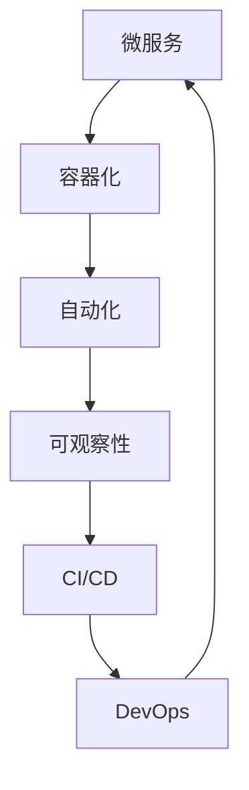

                 

# 云原生架构：构建可扩展的云端应用程序

在数字化转型加速的时代，企业需要快速响应市场变化，构建可扩展、弹性的云端应用程序，以满足日益增长的业务需求。云原生架构作为构建这些应用的基石，正变得越来越重要。本文将从背景介绍、核心概念、算法原理、项目实践、应用场景、工具资源和未来展望等多个维度，系统讲解云原生架构的构建原理与应用实践，助力企业在云时代构建高效、可扩展的云端应用程序。

## 1. 背景介绍

### 1.1 问题由来
随着云计算技术的普及，越来越多的企业开始将应用和数据迁移到云端。然而，传统单体应用架构在扩展性、弹性和运维上存在诸多问题：

- **扩展性**：单体应用难以水平扩展，升级和维护成本高。
- **弹性**：无法动态调整资源，无法适应业务突增。
- **运维**：运维复杂，故障恢复时间长。

云原生架构（Cloud Native Architecture）通过采用微服务、容器化、DevOps等技术，从根本上解决了这些挑战，为企业构建了更加灵活、可扩展、弹性的云端应用体系。

### 1.2 问题核心关键点
云原生架构的核心目标是通过微服务化、容器化、自动化等技术手段，使得应用具备高度的弹性、可扩展性和自管理能力，从而实现更高的可用性、可维护性和快速迭代能力。

### 1.3 问题研究意义
云原生架构的实践不仅有助于企业提升应用系统的稳定性和可靠性，还能显著降低开发和运维成本，提升业务响应速度和创新能力。随着数字化转型的深入，云原生架构将成为构建企业核心竞争力的关键技术。

## 2. 核心概念与联系

### 2.1 核心概念概述

云原生架构涵盖了多个核心技术概念，它们共同构成了构建可扩展、弹性应用的基础：

- **微服务**：将单体应用拆分为多个小型、自治的微服务，每个微服务负责单一职责，易于扩展和更新。
- **容器化**：通过容器技术（如Docker）将应用及其依赖打包为镜像，确保应用在不同环境中的一致性。
- **自动化**：通过CI/CD、DevOps等工具，自动化应用构建、部署、测试、运维等流程，提升效率和质量。
- **可观察性**：通过日志、监控、告警等技术，全面监控应用性能和运行状态，及时发现和解决问题。

### 2.2 核心概念原理和架构的 Mermaid 流程图



该图展示了云原生架构中的关键概念和技术之间的相互关系。微服务通过容器化部署，在自动化的CI/CD流程下进行构建和部署，通过可观察性技术进行监控和告警，最终在DevOps的协同下，形成了一个高效、可扩展、自管理的云端应用体系。

## 3. 核心算法原理 & 具体操作步骤

### 3.1 算法原理概述
云原生架构的核心算法原理包括微服务拆分、容器编排、弹性扩展和自管理等。这些原理通过技术手段实现了应用的可扩展性和自管理能力。

### 3.2 算法步骤详解
1. **微服务拆分**：将单体应用按业务功能拆分为多个微服务，每个微服务独立部署、独立扩展。
2. **容器编排**：使用容器编排工具（如Kubernetes）对微服务进行管理和调度，确保应用在不同环境中的一致性。
3. **弹性扩展**：根据负载情况动态调整资源，实现应用的弹性扩展。
4. **自管理**：通过自动化工具实现应用的自动部署、回滚、监控、告警等功能，提升运维效率和系统可靠性。

### 3.3 算法优缺点
云原生架构的优点包括：

- **高扩展性**：微服务拆分使得应用易于水平扩展，负载均衡器可以动态调整资源。
- **高可用性**：容器化和弹性扩展使得应用能够快速恢复故障，保证高可用性。
- **高自动化**：自动化工具大大降低了运维成本，提高了效率和质量。

缺点包括：

- **复杂性**：微服务拆分和容器编排增加了系统复杂性，需要更高的运维水平。
- **网络通信开销**：微服务之间需要通过网络通信，增加了通信开销。

### 3.4 算法应用领域
云原生架构广泛应用于金融、电商、物流、制造等各个行业，帮助企业构建高效、可扩展、弹性的云端应用程序，提升了业务响应速度和创新能力。

## 4. 数学模型和公式 & 详细讲解 & 举例说明

### 4.1 数学模型构建
云原生架构的数学模型主要涉及微服务的数量和资源分配、容器编排的调度算法、弹性扩展的负载均衡策略等。

假设系统中有$n$个微服务，每个微服务需要$m$个CPU资源。目标是最小化总资源成本，同时满足用户请求的要求。

设资源成本为$C$，每个CPU的成本为$c$。则总成本为$C = \sum_{i=1}^n m_ic$。

设第$i$个微服务的请求率为$r_i$，每个微服务的容量为$u_i$。则系统需要满足以下条件：

$$
\sum_{i=1}^n \frac{r_i}{u_i} \leq 1
$$

### 4.2 公式推导过程
基于上述模型，可以使用线性规划方法求解最小化总资源成本，同时满足用户请求的条件。设每个微服务的请求率为$r_i$，每个微服务的容量为$u_i$，求解目标函数和约束条件：

$$
\min_{m_i} \sum_{i=1}^n m_ic
$$

$$
\text{subject to} \quad \sum_{i=1}^n \frac{m_ir_i}{u_i} \leq 1
$$

$$
m_i \geq 0, \quad i=1,2,\cdots,n
$$

### 4.3 案例分析与讲解
假设系统中有两个微服务，一个微服务的请求率为$0.6$，容量为$2$；另一个微服务的请求率为$0.4$，容量为$1.5$。每个CPU的成本为$1$。求解最小化总资源成本，同时满足用户请求的要求。

设第一个微服务的CPU需求为$m_1$，第二个微服务的CPU需求为$m_2$。则有：

$$
\min_{m_1,m_2} \ m_1 + m_2
$$

$$
\text{subject to} \quad \frac{m_1 \cdot 0.6}{2} + \frac{m_2 \cdot 0.4}{1.5} \leq 1
$$

$$
m_1, m_2 \geq 0
$$

通过求解线性规划，得到$m_1=0.4, m_2=0.6$，最小化总资源成本$C = 1$。

## 5. 项目实践：代码实例和详细解释说明

### 5.1 开发环境搭建
要搭建云原生架构的开发环境，需要以下步骤：

1. 安装Docker：
```bash
sudo apt-get update
sudo apt-get install docker-ce
```

2. 安装Kubernetes：
```bash
sudo apt-get install kubectl
kubectl version
```

3. 安装Helm：
```bash
curl -s https://raw.githubusercontent.com/helm/helm/master/scripts/get-helm-3 | bash
```

4. 安装Nginx Ingress：
```bash
kubectl apply -f https://raw.githubusercontent.com/kubernetes/ingress-nginx/main/deploy/static/provider/kind/deploy.yaml
```

5. 安装Prometheus和Grafana：
```bash
kubectl apply -f https://github.com/prometheus-community/kube-prometheus/releases/download/2.22.0/kube-prometheus.yaml
kubectl apply -f https://github.com/grafana/grafana-kubecap-transformation/releases/download/v1.4.4/grafana-kubecap.yaml
```

### 5.2 源代码详细实现
假设我们正在开发一个电商平台的订单微服务，可以使用Docker容器化和Kubernetes编排：

1. 编写Dockerfile：
```Dockerfile
FROM python:3.7-slim
WORKDIR /app
COPY requirements.txt .
RUN pip install -r requirements.txt
COPY . .
CMD ["python", "app.py"]
```

2. 构建镜像：
```bash
docker build -t order-service .
```

3. 发布镜像：
```bash
docker push order-service:latest
```

4. 创建Kubernetes部署和Service：
```yaml
apiVersion: apps/v1
kind: Deployment
metadata:
  name: order-service
spec:
  replicas: 3
  selector:
    matchLabels:
      app: order-service
  template:
    metadata:
      labels:
        app: order-service
    spec:
      containers:
      - name: order-service
        image: order-service:latest
        ports:
        - containerPort: 8080

apiVersion: v1
kind: Service
metadata:
  name: order-service
spec:
  selector:
    app: order-service
  ports:
    - protocol: TCP
      port: 80
      targetPort: 8080
  type: LoadBalancer
```

### 5.3 代码解读与分析
通过上述代码，我们可以看到：

- **Dockerfile**：定义了应用的基本信息和构建步骤，确保应用在不同环境中的一致性。
- **Kubernetes部署和Service**：定义了微服务的副本数、标签、选择器、端口映射等，确保了应用的可靠性和可扩展性。

### 5.4 运行结果展示
通过Kubernetes部署后，可以通过以下命令查看应用状态：

```bash
kubectl get pods
kubectl get services
```

## 6. 实际应用场景

### 6.1 智能制造

云原生架构在智能制造中应用广泛。企业通过构建可扩展的微服务架构，实现生产线的自动化控制、设备监控、数据分析等功能。通过容器化和弹性扩展，系统能够快速应对生产线的变化和突发情况，提升生产效率和质量。

### 6.2 电商零售

电商零售平台通过云原生架构实现了订单处理、库存管理、物流跟踪等功能。微服务拆分使得应用易于扩展和更新，容器化保证了应用的稳定性和一致性，自动化运维大大降低了运维成本。

### 6.3 金融服务

金融服务行业通过云原生架构实现了交易系统、风控系统、客户服务等功能。通过微服务拆分和弹性扩展，系统能够快速应对业务波动和用户请求，保证了系统的可靠性和高效性。

## 7. 工具和资源推荐

### 7.1 学习资源推荐
- **Kubernetes官方文档**：学习Kubernetes的配置、部署和管理。
- **Helm官方文档**：学习Helm的包管理、部署和升级。
- **Prometheus官方文档**：学习Prometheus的监控和告警。
- **Grafana官方文档**：学习Grafana的数据可视化。

### 7.2 开发工具推荐
- **Kubernetes**：用于容器编排和管理。
- **Helm**：用于应用包管理和部署。
- **Prometheus**：用于监控和告警。
- **Grafana**：用于数据可视化。

### 7.3 相关论文推荐
- **《微服务架构：概念、模式、实践》**：介绍微服务架构的基本概念和设计模式。
- **《Kubernetes：生产实践与最佳实践》**：介绍Kubernetes的部署和管理实践。
- **《可观察性：监控、日志和追踪》**：介绍可观察性的基本概念和技术实现。

## 8. 总结：未来发展趋势与挑战

### 8.1 总结
云原生架构通过微服务、容器化、自动化等技术手段，实现了应用的高扩展性、高可用性和高效运维。该架构广泛应用于金融、电商、制造等多个行业，为企业的数字化转型提供了坚实的基础。

### 8.2 未来发展趋势
未来云原生架构将呈现以下几个发展趋势：

- **多云管理**：云原生架构将更多地应用于多云环境中，实现跨云平台的资源管理和应用迁移。
- **自动化运维**：自动化运维工具将进一步发展，实现更高效的自动化部署、测试、监控和故障恢复。
- **可观察性**：可观察性技术将进一步发展，实现更全面、精细的监控和告警。

### 8.3 面临的挑战
尽管云原生架构已经取得了显著进展，但仍面临以下挑战：

- **复杂性**：微服务拆分和容器编排增加了系统复杂性，需要更高的运维水平。
- **资源消耗**：容器化和弹性扩展增加了资源消耗，需要更高效的资源管理。
- **安全性和合规性**：云原生架构需要更高的安全性和合规性要求，需加强安全防护和合规管理。

### 8.4 研究展望
未来的研究需要围绕以下几个方向进行：

- **微服务治理**：研究微服务架构的治理模式，提升系统的可维护性和可靠性。
- **容器编排优化**：研究更高效的容器编排算法，优化资源利用率和应用性能。
- **可观察性增强**：研究更全面的可观察性技术，提升系统的监控和告警能力。

## 9. 附录：常见问题与解答

**Q1：什么是微服务？**

A: 微服务是一种架构风格，将单体应用拆分为多个小型、自治的微服务，每个微服务负责单一职责，易于扩展和更新。

**Q2：容器化如何提升应用性能？**

A: 容器化通过将应用及其依赖打包为镜像，确保应用在不同环境中的一致性，避免了环境差异带来的性能问题。同时，容器化使得应用部署和管理更加便捷高效。

**Q3：如何降低云原生架构的复杂性？**

A: 采用服务网格（如Istio）和配置管理工具（如Helm），可以显著降低云原生架构的复杂性，提升系统的可维护性。

**Q4：如何在多云环境中实现资源管理？**

A: 使用多云管理工具（如AWS CloudFormation、Azure Resource Manager）可以实现跨云平台的资源管理和应用迁移。同时，采用微服务治理模式，可以提升系统的弹性性和可扩展性。

**Q5：如何提升云原生架构的安全性？**

A: 采用网络安全策略（如RBAC、网络策略）和应用程序安全策略（如Kubernetes Security Context），可以有效提升云原生架构的安全性。

---

作者：禅与计算机程序设计艺术 / Zen and the Art of Computer Programming

