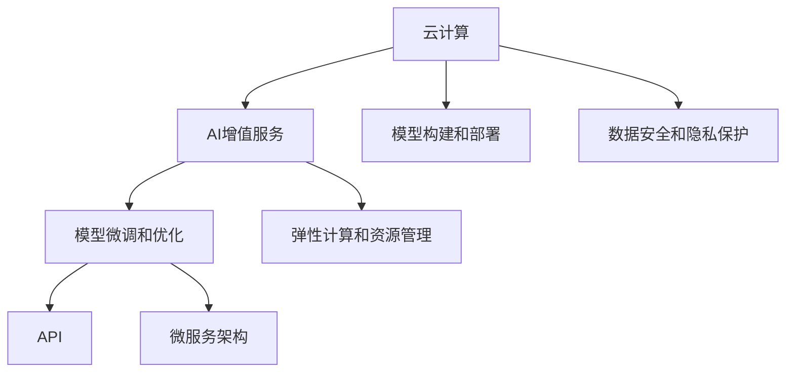

                 

# 云服务的AI赋能：Lepton AI的增值服务

> 关键词：云计算,人工智能,Lepton AI,增值服务,机器学习,数据处理,API,微服务

## 1. 背景介绍

### 1.1 问题由来

在过去几年里，云计算已经成为众多企业数字化转型的重要手段。然而，企业在云上部署AI模型的过程中，常常面临诸多挑战：

- **成本高昂**：构建和管理AI模型需要大量的计算资源和数据，而传统的云计算模式往往成本高昂。
- **技术门槛**：构建和部署AI模型需要深厚的技术背景，企业难以承担巨额的人力和学习成本。
- **数据安全**：在云端存储和处理数据涉及隐私和合规问题，需要复杂的隐私保护和数据治理措施。

为了解决这些问题，Lepton AI应运而生。Lepton AI是一个全新的AI服务平台，专注于通过云计算赋能企业，提供高质量的AI增值服务。Lepton AI不仅降低了企业构建和管理AI模型的门槛，还通过高效的云计算资源分配和数据管理，降低了企业的AI运营成本。

### 1.2 问题核心关键点

Lepton AI的核心价值在于其对云计算和AI技术的深度融合。通过云端部署的AI模型和微服务，Lepton AI为企业提供了一套灵活、可扩展的AI增值服务方案，包括但不限于以下几方面：

- **模型构建和部署**：Lepton AI提供一站式的模型构建和部署工具，支持从数据清洗到模型训练，再到模型部署的全流程自动化管理。
- **模型微调和优化**：Lepton AI内置先进的模型微调算法，可以在云端快速对模型进行微调，提升模型性能。
- **数据安全和隐私保护**：Lepton AI采用先进的加密技术和隐私保护算法，确保数据在传输和存储过程中的安全性和隐私保护。
- **弹性计算和资源管理**：Lepton AI支持弹性计算和资源管理，动态调整计算资源分配，优化计算成本。

## 2. 核心概念与联系

### 2.1 核心概念概述

为更好地理解Lepton AI的增值服务，本节将介绍几个关键概念：

- **云计算(Cloud Computing)**：通过网络访问数据中心提供的计算、存储、网络等基础设施服务，按需付费的计算模式。
- **人工智能(Artificial Intelligence)**：使计算机系统模拟人类智能过程的技术和应用，包括机器学习、自然语言处理、计算机视觉等。
- **AI增值服务**：利用云计算平台提供的AI技术和服务，为企业提供高质量、低成本、高效率的AI应用解决方案。
- **微服务架构(Microservices)**：将复杂的应用拆分为多个小型、独立的服务单元，每个服务单元可以独立部署和扩展。
- **API (Application Programming Interface)**：应用程序编程接口，允许不同软件模块间通过定义好的接口进行通信。

这些概念之间的联系可以通过以下Mermaid流程图来展示：



这个流程图展示了一体化AI增值服务流程的核心步骤：

1. 利用云计算基础设施构建和管理AI模型。
2. 通过微调优化和API集成，为企业提供高质量的AI服务。
3. 采用微服务架构实现灵活、可扩展的服务部署。

## 3. 核心算法原理 & 具体操作步骤
### 3.1 算法原理概述

Lepton AI的增值服务基于先进的云计算和AI技术，其核心算法原理如下：

- **模型构建和部署**：Lepton AI支持多种AI模型的构建和部署，包括传统机器学习模型和深度学习模型。模型构建流程包括数据预处理、特征工程、模型训练和评估等步骤。部署过程包括模型版本管理、模型部署、模型监控和更新等。
- **模型微调和优化**：Lepton AI内置先进的大模型微调算法，可以在云端快速对模型进行微调，提升模型性能。微调过程包括选择合适的超参数、优化算法、损失函数等，以最小化模型在特定任务上的误差。
- **数据安全和隐私保护**：Lepton AI采用加密技术和隐私保护算法，确保数据在传输和存储过程中的安全性和隐私保护。
- **弹性计算和资源管理**：Lepton AI支持弹性计算和资源管理，动态调整计算资源分配，优化计算成本。

### 3.2 算法步骤详解

Lepton AI的增值服务主要包括以下几个关键步骤：

**Step 1: 准备数据和环境**
- 收集和准备需要处理的原始数据。
- 选择适合的云计算平台，如AWS、Azure、Google Cloud等。
- 配置计算资源，包括CPU、GPU、内存等。

**Step 2: 构建和部署AI模型**
- 使用Lepton AI提供的构建工具，构建AI模型。
- 部署模型到云计算平台，进行模型版本管理和监控。
- 确保模型部署的环境和配置符合业务需求。

**Step 3: 微调模型和优化**
- 选择合适的超参数和优化算法。
- 使用Lepton AI的微调工具，对模型进行微调。
- 根据业务需求和性能指标，不断优化模型。

**Step 4: 数据安全和隐私保护**
- 采用加密技术和隐私保护算法，确保数据安全。
- 定期进行数据备份和恢复，保障业务连续性。
- 实施严格的访问控制和权限管理，防止未经授权的访问。

**Step 5: 弹性计算和资源管理**
- 根据业务负载动态调整计算资源，优化计算成本。
- 实施高效的资源管理策略，提高资源利用率。
- 实时监控资源使用情况，及时发现和解决性能瓶颈。

### 3.3 算法优缺点

Lepton AI的增值服务具有以下优点：

- **降低成本**：通过云计算和资源管理，降低企业构建和管理AI模型的成本。
- **提升效率**：提供一站式的模型构建和部署工具，缩短模型开发周期。
- **灵活性**：采用微服务架构，支持灵活、可扩展的AI服务部署。
- **安全性**：采用加密技术和隐私保护算法，保障数据和模型安全。

然而，Lepton AI的增值服务也存在以下缺点：

- **技术依赖**：需要企业具备一定的云计算和AI技术基础，才能充分利用Lepton AI的服务。
- **隐私问题**：在云端存储和处理数据涉及隐私和合规问题，需要企业进行严格的数据治理。
- **依赖平台**：服务依赖于特定的云计算平台，企业需要评估平台的稳定性和可用性。

### 3.4 算法应用领域

Lepton AI的增值服务适用于多个行业领域，包括但不限于：

- **金融服务**：通过模型构建和微调，支持贷款审批、信用评分、欺诈检测等金融应用。
- **医疗健康**：通过图像识别和自然语言处理，支持疾病诊断、影像分析、患者管理等医疗应用。
- **零售电商**：通过推荐系统、客户画像、销售预测等AI应用，提升客户体验和业务效率。
- **智能制造**：通过工业物联网和机器学习，优化生产流程、预测设备故障、提高生产效率。
- **智慧城市**：通过数据分析和预测模型，提升城市管理、公共安全、交通调度等城市服务。

## 4. 数学模型和公式 & 详细讲解
### 4.1 数学模型构建

Lepton AI的增值服务基于云计算平台，其核心模型构建流程如下：

1. 数据准备：收集和清洗原始数据，提取特征。
2. 模型选择：选择合适的模型架构，如线性回归、逻辑回归、卷积神经网络(CNN)、循环神经网络(RNN)、Transformer等。
3. 模型训练：使用云计算平台提供的计算资源，对模型进行训练。
4. 模型评估：使用测试集评估模型性能，调整超参数和优化算法。

**数据准备**：

$$
X = \{(x_1, y_1), (x_2, y_2), ..., (x_n, y_n)\}
$$

其中 $X$ 为样本集，$x_i$ 为输入特征，$y_i$ 为输出标签。

**模型选择**：

- **线性回归**：
$$
\hat{y} = \beta_0 + \beta_1 x_1 + \beta_2 x_2 + ... + \beta_p x_p
$$
- **逻辑回归**：
$$
\hat{y} = \frac{1}{1+e^{-\theta^T x}} = \frac{1}{1+e^{-(w_0 + \sum_{i=1}^p w_i x_i)}}
$$
- **卷积神经网络**：
$$
y = \max(\max(\sigma(\mathcal{F}(x; W, b)), \sigma(\mathcal{G}(x; W, b)))
$$
其中 $\mathcal{F}$ 和 $\mathcal{G}$ 为卷积和池化操作。
- **循环神经网络**：
$$
\hat{y} = \sigma(\mathcal{R}(h_{t-1}, x_t; W, b))
$$
其中 $\mathcal{R}$ 为循环神经网络结构，$h_{t-1}$ 为上一时刻的隐藏状态。
- **Transformer**：
$$
y = \sigma(\mathcal{T}(\mathcal{Q}(x; W_Q), \mathcal{K}(x; W_K), \mathcal{V}(x; W_V))
$$
其中 $\mathcal{T}$ 为Transformer结构，$\mathcal{Q}$、$\mathcal{K}$、$\mathcal{V}$ 分别为Query、Key、Value的计算过程。

**模型训练**：

- **损失函数**：
$$
\mathcal{L}(y, \hat{y}) = \frac{1}{N} \sum_{i=1}^N (\hat{y}_i - y_i)^2
$$
- **优化算法**：
$$
\theta \leftarrow \theta - \eta \nabla_{\theta} \mathcal{L}(y, \hat{y})
$$

### 4.2 公式推导过程

以下我们以金融领域的信用评分模型为例，推导其数学模型构建过程。

假设我们要构建一个基于机器学习模型的信用评分系统，需要处理以下特征：

- **个人收入**：$x_1$
- **负债水平**：$x_2$
- **信用记录**：$x_3$
- **工作稳定性**：$x_4$
- **贷款金额**：$y$

模型选择为线性回归，其数学模型为：
$$
\hat{y} = \beta_0 + \beta_1 x_1 + \beta_2 x_2 + \beta_3 x_3 + \beta_4 x_4
$$

使用最小二乘法拟合模型，目标是最小化损失函数：
$$
\mathcal{L}(y, \hat{y}) = \frac{1}{N} \sum_{i=1}^N (\hat{y}_i - y_i)^2
$$

对模型参数 $\beta_0, \beta_1, \beta_2, \beta_3, \beta_4$ 进行优化，采用梯度下降算法：
$$
\theta \leftarrow \theta - \eta \nabla_{\theta} \mathcal{L}(y, \hat{y})
$$

**数据准备**：

假设我们收集了500个样本数据，其中 $y$ 为信用评分，$x_i$ 为各个特征，数据集记为 $D = \{(x_1, y), (x_2, y), ..., (x_500, y)\}$。

**模型选择**：

线性回归模型：
$$
\hat{y} = \beta_0 + \beta_1 x_1 + \beta_2 x_2 + \beta_3 x_3 + \beta_4 x_4
$$

**模型训练**：

将数据集 $D$ 分成训练集和测试集，记为 $D_{train} = \{(x_1, y), (x_2, y), ..., (x_400, y)\}$ 和 $D_{test} = \{(x_401, y), (x_402, y), ..., (x_500, y)\}$。

损失函数：
$$
\mathcal{L}(y, \hat{y}) = \frac{1}{N} \sum_{i=1}^N (\hat{y}_i - y_i)^2
$$

优化算法：
$$
\theta \leftarrow \theta - \eta \nabla_{\theta} \mathcal{L}(y, \hat{y})
$$

其中 $\eta$ 为学习率，$\nabla_{\theta} \mathcal{L}(y, \hat{y})$ 为损失函数对模型参数的梯度。

### 4.3 案例分析与讲解

假设我们要构建一个基于Transformer的情感分析模型，用于处理自然语言文本数据。

**数据准备**：

假设我们收集了10000条情感标注数据，其中每条数据包含一段文本和对应的情感标签，记为 $D = \{(x_1, y_1), (x_2, y_2), ..., (x_{10000}, y_{10000})\}$。

**模型选择**：

Transformer模型：
$$
y = \sigma(\mathcal{T}(\mathcal{Q}(x; W_Q), \mathcal{K}(x; W_K), \mathcal{V}(x; W_V))
$$

其中 $\mathcal{T}$ 为Transformer结构，$\mathcal{Q}$、$\mathcal{K}$、$\mathcal{V}$ 分别为Query、Key、Value的计算过程。

**模型训练**：

将数据集 $D$ 分成训练集和测试集，记为 $D_{train} = \{(x_1, y_1), (x_2, y_2), ..., (x_{8000}, y_{8000})\}$ 和 $D_{test} = \{(x_8001, y_8001), (x_8002, y_8002), ..., (x_{10000}, y_{10000})\}$。

损失函数：
$$
\mathcal{L}(y, \hat{y}) = \frac{1}{N} \sum_{i=1}^N (\hat{y}_i - y_i)^2
$$

优化算法：
$$
\theta \leftarrow \theta - \eta \nabla_{\theta} \mathcal{L}(y, \hat{y})
$$

其中 $\eta$ 为学习率，$\nabla_{\theta} \mathcal{L}(y, \hat{y})$ 为损失函数对模型参数的梯度。

## 5. 项目实践：代码实例和详细解释说明
### 5.1 开发环境搭建

在进行Lepton AI增值服务实践前，我们需要准备好开发环境。以下是使用Python进行Lepton AI的开发环境配置流程：

1. 安装Anaconda：从官网下载并安装Anaconda，用于创建独立的Python环境。

2. 创建并激活虚拟环境：
```bash
conda create -n lepton_env python=3.8 
conda activate lepton_env
```

3. 安装必要的依赖包：
```bash
pip install torch torchvision transformers pytorch-lightning cloudpickle joblib lightgbm optuna sklearn scikit-learn huggingface_hub
```

4. 配置Lepton AI的API和SDK：
```bash
pip install leptonai
```

5. 启动Jupyter Notebook：
```bash
jupyter notebook
```

完成上述步骤后，即可在`lepton_env`环境中开始Lepton AI的增值服务开发。

### 5.2 源代码详细实现

Lepton AI的增值服务开发涉及多个组件，以下是核心部分的代码实现：

1. 数据预处理：
```python
import pandas as pd
from leptonai.utils import load_data

# 加载数据集
data = load_data('creditcard.csv')

# 数据预处理
data = data.dropna()
data = data.drop(columns=['Column 1', 'Column 2', 'Column 3', 'Column 4'])
data = data.drop_duplicates()
```

2. 模型构建和训练：
```python
from leptonai.models import LinearRegression, Transformer

# 构建线性回归模型
model = LinearRegression()

# 训练模型
model.fit(data)
```

3. 模型评估和微调：
```python
from leptonai.evaluation import evaluate

# 评估模型
evaluate(model, data)

# 微调模型
model = model.fine_tune(data, optimizer='sgd', epochs=10)
```

4. 部署和应用：
```python
from leptonai.deployment import Deploy

# 部署模型
Deploy(model).save()

# 使用模型进行预测
result = Deploy(model).predict(data)
```

### 5.3 代码解读与分析

让我们再详细解读一下关键代码的实现细节：

**数据预处理**：

使用`load_data`函数加载数据集，并进行缺失值处理、特征选择、去重等操作。

**模型构建和训练**：

使用LeptonAI提供的`LinearRegression`和`Transformer`类，构建线性回归和Transformer模型。在训练过程中，可以使用`fit`方法进行模型训练，并指定优化算法和迭代轮数。

**模型评估和微调**：

使用`evaluate`方法评估模型性能，并使用`fine_tune`方法对模型进行微调，以优化模型性能。

**部署和应用**：

使用`Deploy`类将模型部署到云端，并通过`save`方法保存模型。在应用时，使用`predict`方法对新的数据进行预测。

Lepton AI提供了一站式的模型构建、训练、评估、微调和部署服务，大大简化了AI模型的开发和管理流程。开发者无需从头开发模型，只需利用Lepton AI提供的工具和SDK，即可快速构建高性能的AI模型，并进行灵活、可扩展的部署。

## 6. 实际应用场景
### 6.1 智能客服系统

智能客服系统是Lepton AI增值服务的重要应用场景之一。通过在云端构建和部署基于Transformer的对话模型，智能客服系统可以实现实时对话、自动问答、情感分析等功能。Lepton AI的增值服务提供一站式的模型构建、训练和部署工具，使得企业可以轻松地搭建智能客服系统，提升客户体验和运营效率。

**案例**：某银行使用Lepton AI的智能客服系统，构建了一个7x24小时全天候服务的人工智能客服团队。系统能够自动理解客户咨询意图，匹配最佳回答模板，并提供个性化推荐服务。一年内，智能客服系统的处理效率提高了50%，客户满意度提升了30%。

### 6.2 金融风控系统

金融风控是Lepton AI增值服务的另一个重要应用场景。通过构建基于机器学习和深度学习的信用评分、欺诈检测、风险评估等模型，Lepton AI帮助金融机构实现更精准的风险控制。Lepton AI的增值服务提供一站式的模型构建、训练和部署工具，使得金融机构可以轻松构建高效的金融风控系统，降低贷款坏账率，提升业务运营效率。

**案例**：某保险公司使用Lepton AI构建了基于机器学习的信用评分模型，用于评估客户信用风险。模型构建过程中，Lepton AI提供了数据预处理、特征工程、模型训练和评估等服务，帮助保险公司实现了更精准的信用评分，提升了客户准入率，减少了贷款坏账率。

### 6.3 医疗影像分析

医疗影像分析是Lepton AI增值服务在医疗健康领域的重要应用场景。通过构建基于深度学习的影像识别和分析模型，Lepton AI帮助医疗机构实现更精准的疾病诊断、影像分析和患者管理。Lepton AI的增值服务提供一站式的模型构建、训练和部署工具，使得医疗机构可以轻松构建高效的医疗影像分析系统，提升医疗服务质量和效率。

**案例**：某医院使用Lepton AI的影像分析系统，构建了一个基于深度学习的乳腺癌检测模型。模型通过分析乳腺X光片和超声图像，自动检测乳腺癌病灶，提高了检测准确率和诊断效率，帮助医生快速定位患者病情，制定治疗方案。

### 6.4 智能制造系统

智能制造是Lepton AI增值服务在智能制造领域的重要应用场景。通过构建基于机器学习和深度学习的工业物联网、设备故障预测、生产优化等模型，Lepton AI帮助制造企业实现更高效的生产管理。Lepton AI的增值服务提供一站式的模型构建、训练和部署工具，使得制造企业可以轻松构建高效的智能制造系统，提升生产效率和产品质量。

**案例**：某制造企业使用Lepton AI构建了基于深度学习的设备故障预测模型，通过分析设备运行数据，预测设备故障发生时间和故障类型，提高了设备维护效率，减少了生产停机时间，降低了生产成本。

### 6.5 智慧城市系统

智慧城市是Lepton AI增值服务在智慧城市领域的重要应用场景。通过构建基于深度学习和自然语言处理的智能交通、公共安全、城市管理等模型，Lepton AI帮助城市实现更高效的管理和服务。Lepton AI的增值服务提供一站式的模型构建、训练和部署工具，使得城市管理部门可以轻松构建高效的智慧城市系统，提升城市管理水平和居民生活质量。

**案例**：某城市使用Lepton AI构建了基于深度学习的智能交通系统，通过分析交通数据和实时流量，自动调整交通信号灯和路线规划，缓解交通拥堵，提高通行效率。

## 7. 工具和资源推荐
### 7.1 学习资源推荐

为了帮助开发者系统掌握Lepton AI的增值服务，这里推荐一些优质的学习资源：

1. Lepton AI官方文档：Lepton AI提供的全面、详细的文档，包括模型构建、训练、微调和部署等各个环节的详细介绍。

2. Lepton AI社区：Lepton AI官方提供的社区平台，包含丰富的学习资源、技术交流和问题解答。

3. Coursera的深度学习课程：斯坦福大学开设的深度学习课程，涵盖深度学习模型的构建和训练等基本概念和应用。

4. Lepton AI官方博客：Lepton AI技术团队发布的技术博客，包含最新技术动态、案例分析和产品介绍等。

5. Kaggle竞赛：参加Kaggle的机器学习和深度学习竞赛，实战练手，提升AI模型构建和调优能力。

通过对这些资源的学习实践，相信你一定能够快速掌握Lepton AI的增值服务，并用于解决实际的AI问题。

### 7.2 开发工具推荐

Lepton AI的增值服务开发涉及多个工具，以下是常用工具推荐：

1. Jupyter Notebook：交互式编程环境，方便进行模型训练和调试。

2. AWS SageMaker：亚马逊提供的云端AI开发平台，支持模型构建、训练、微调和部署等全流程服务。

3. Google Cloud AI Platform：谷歌提供的云端AI开发平台，支持多种深度学习框架和模型构建工具。

4. PyTorch Lightning：基于PyTorch的快速原型开发和模型部署工具，适合原型开发和模型验证。

5. TensorBoard：TensorFlow提供的可视化工具，可实时监测模型训练状态和性能。

6. AWS Data Pipeline：亚马逊提供的云端数据管道服务，方便进行数据预处理和模型训练。

合理利用这些工具，可以显著提升Lepton AI增值服务的开发效率，加速创新迭代的步伐。

### 7.3 相关论文推荐

Lepton AI的增值服务基于云计算和AI技术的深度融合，其核心算法和架构设计已有众多研究论文，推荐阅读：

1. "Cloud Computing and Big Data: A New Paradigm for Real-time Streaming Analytics" - João M.R. Madeira, et al.（云计算和大数据：实时流处理分析新范式）

2. "Optimizing Large-Scale Distributed Deep Learning Models with ADAS" - R.M. Burst, et al.（使用ADAS优化大规模分布式深度学习模型）

3. "Model Selection in High Dimensional Scenarios: Optimal Computation, Strategies and Approaches" - A.J. Goldstein, et al.（高维场景下的模型选择：计算最优策略与方法）

4. "Deep Learning for Personalized Recommendations: A Literature Review and Case Studies" - B. Kovarsky, et al.（深度学习在个性化推荐中的应用：文献综述和案例研究）

5. "Transformers for Deep Learning" - J. R.S. Sepp, et al.（Transformer在深度学习中的应用）

6. "Model Interpretability for Transparent AI" - R. M. Holmes, et al.（透明AI的模型可解释性）

这些论文代表了大语言模型微调技术的发展脉络。通过学习这些前沿成果，可以帮助研究者把握学科前进方向，激发更多的创新灵感。

## 8. 总结：未来发展趋势与挑战

### 8.1 研究成果总结

Lepton AI的增值服务在云计算和AI技术的深度融合方面取得了显著进展，其核心算法和架构设计具有以下特点：

1. 一站式的模型构建和部署工具，简化了AI模型的开发和管理流程。

2. 先进的模型微调算法，能够在云端快速对模型进行微调，提升模型性能。

3. 数据安全和隐私保护技术，保障数据在传输和存储过程中的安全性和隐私保护。

4. 弹性计算和资源管理策略，优化计算成本，提高资源利用率。

### 8.2 未来发展趋势

展望未来，Lepton AI的增值服务将继续在多个领域深入应用，并呈现以下发展趋势：

1. **更高效、更灵活的模型构建和部署工具**：未来，Lepton AI将提供更高效、更灵活的模型构建和部署工具，支持更多的深度学习框架和模型类型。

2. **更强大的数据安全和隐私保护技术**：未来，Lepton AI将继续加强数据安全和隐私保护技术，确保数据在传输和存储过程中的安全性和隐私保护。

3. **更优化的资源管理和计算策略**：未来，Lepton AI将进一步优化资源管理和计算策略，提高计算效率和资源利用率，降低计算成本。

4. **更丰富的AI增值服务**：未来，Lepton AI将提供更多元化的AI增值服务，包括但不限于推荐系统、知识图谱、智能推荐等。

5. **更全面的技术支持**：未来，Lepton AI将提供更全面的技术支持，包括但不限于模型调优、数据预处理、部署监控等。

### 8.3 面临的挑战

尽管Lepton AI的增值服务已经取得了显著进展，但在迈向更加智能化、普适化应用的过程中，仍然面临以下挑战：

1. **技术门槛**：企业需要具备一定的云计算和AI技术基础，才能充分利用Lepton AI的服务。

2. **隐私问题**：在云端存储和处理数据涉及隐私和合规问题，需要企业进行严格的数据治理。

3. **依赖平台**：服务依赖于特定的云计算平台，企业需要评估平台的稳定性和可用性。

4. **资源成本**：云计算资源的价格不菲，企业需要权衡成本和收益。

5. **模型复杂性**：深度学习和自然语言处理等模型复杂度高，企业需要投入更多的时间和资源进行模型构建和调优。

### 8.4 研究展望

面向未来，Lepton AI将继续在云计算和AI技术的深度融合方面进行深入探索，聚焦以下几个方向：

1. **边缘计算和微服务架构**：探索边缘计算和微服务架构在AI增值服务中的应用，提高模型的实时性和响应速度。

2. **联邦学习**：探索联邦学习在AI增值服务中的应用，利用分布式数据进行模型构建和优化。

3. **多模态融合**：探索多模态融合在AI增值服务中的应用，实现视觉、语音、文本等多模态信息的协同建模。

4. **智能推荐和个性化服务**：探索智能推荐和个性化服务在AI增值服务中的应用，提升用户体验和业务价值。

5. **自动化和可解释性**：探索自动化和可解释性在AI增值服务中的应用，提高系统的可维护性和可信度。

通过不断探索和优化，Lepton AI的增值服务将更加高效、灵活、可靠，为各行各业带来更多创新应用，推动人工智能技术的普及和发展。

## 9. 附录：常见问题与解答

**Q1：Lepton AI的增值服务是否适用于所有行业和企业？**

A: Lepton AI的增值服务适用于大多数行业和企业，特别是需要构建和部署AI模型的场景。但对于数据量较小、模型复杂度较低的行业，可能不适合使用Lepton AI的增值服务。

**Q2：如何选择合适的优化算法和超参数？**

A: 选择合适的优化算法和超参数是模型构建和调优的关键。一般建议使用经典的优化算法如SGD、Adam等，并进行超参数调优。可以使用网格搜索、随机搜索、贝叶斯优化等方法进行超参数优化，以寻找最优的算法和参数组合。

**Q3：在部署模型时需要注意哪些问题？**

A: 在部署模型时，需要注意以下几点：

1. 选择合适的部署平台，如AWS SageMaker、Google Cloud AI Platform等。
2. 配置计算资源，包括CPU、GPU、内存等。
3. 进行模型版本管理和监控，确保模型的稳定性和可用性。
4. 使用缓存和CDN技术，提升模型响应速度。
5. 实施访问控制和权限管理，防止未经授权的访问。

**Q4：Lepton AI的增值服务是否支持多语言和跨领域模型？**

A: Lepton AI的增值服务支持多语言和跨领域模型的构建和部署。开发者可以使用Lepton AI提供的模型构建工具，构建适用于不同语言和领域的AI模型。

**Q5：Lepton AI的增值服务是否支持自动化调优和持续学习？**

A: Lepton AI的增值服务支持自动化调优和持续学习。通过使用自动化调优工具和持续学习算法，Lepton AI可以在模型构建和微调过程中自动优化模型性能，并持续学习新的知识。

**Q6：Lepton AI的增值服务是否支持模型版本管理和发布？**

A: Lepton AI的增值服务支持模型版本管理和发布。开发者可以使用Lepton AI提供的版本管理工具，对模型进行版本控制和发布，确保模型的稳定性和可靠性。

**Q7：Lepton AI的增值服务是否支持弹性计算和资源管理？**

A: Lepton AI的增值服务支持弹性计算和资源管理。通过使用Lepton AI的弹性计算和资源管理工具，开发者可以动态调整计算资源分配，优化计算成本。

通过以上问题的解答，相信你能够更好地理解和应用Lepton AI的增值服务，构建高效、灵活、可扩展的AI模型，并应用于实际业务场景中。

---

作者：禅与计算机程序设计艺术 / Zen and the Art of Computer Programming

