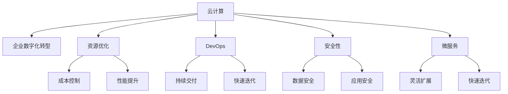

                 

# 云计算在企业数字化转型中的作用：灵活性与可扩展性

> 关键词：云计算,企业数字化转型,灵活性,可扩展性,资源优化,DevOps,安全性

## 1. 背景介绍

### 1.1 问题由来
随着数字化浪潮的席卷，传统企业面临着前所未有的转型挑战。如何在激烈的市场竞争中保持竞争优势，提升运营效率，成为了所有企业的头等大事。云计算技术的崛起，为企业提供了一种全新的IT基础设施建设和管理方式，让企业能够更加灵活、高效地应对数字化转型。

### 1.2 问题核心关键点
云计算的灵活性与可扩展性是其最核心的特点，也是帮助企业实现数字化转型的关键所在。具体来说，云计算通过弹性计算、按需计费、自动扩展等特性，让企业能够快速响应市场需求，灵活应对业务波动，提升系统性能和资源利用率。

云计算通过提供基础设施即服务（IaaS）、平台即服务（PaaS）和软件即服务（SaaS）三种模式，解决了企业在IT架构、应用开发、数据分析等方面的问题，使得企业能够专注于核心业务创新，加速数字化进程。

## 2. 核心概念与联系

### 2.1 核心概念概述

为了更好地理解云计算在企业数字化转型中的作用，本节将介绍几个密切相关的核心概念：

- **云计算**：一种基于互联网的计算模式，通过提供基础设施、平台和软件服务，使企业能够快速、灵活地部署和扩展应用。

- **企业数字化转型**：通过信息技术的应用，优化业务流程、提升运营效率、增强市场竞争力，推动企业向数字化方向发展。

- **资源优化**：通过自动化工具和算法，优化云资源的使用，实现成本控制和性能提升。

- **DevOps**：一种软件开发的文化和实践，强调协作、自动化和持续交付，加快软件开发和部署的速度和稳定性。

- **安全性**：指在云计算环境中保护数据和应用的安全性，包括数据加密、身份认证、访问控制、审计日志等措施。

- **微服务**：一种架构模式，将应用拆分成多个独立的服务，每个服务独立运行、独立部署，便于系统的灵活扩展和快速迭代。

这些核心概念之间的逻辑关系可以通过以下Mermaid流程图来展示：



这个流程图展示云计算的核心概念及其之间的关系：

1. 云计算通过提供IaaS、PaaS、SaaS等服务，支持企业的数字化转型。
2. 通过资源优化和DevOps，云计算可以帮助企业实现成本控制和性能提升，加快软件开发和部署的速度和稳定性。
3. DevOps通过持续交付和快速迭代，进一步提升云计算的灵活性和可扩展性。
4. 安全性是云计算环境的基础保障，通过数据加密、身份认证等措施，确保云计算应用的安全可靠。
5. 微服务架构模式使得云计算系统更加灵活，易于扩展和维护。

这些概念共同构成了云计算的业务框架，使得云计算能够为企业数字化转型提供强有力的支持。通过理解这些核心概念，我们可以更好地把握云计算在企业数字化转型中的作用。

## 3. 核心算法原理 & 具体操作步骤
### 3.1 算法原理概述

云计算的灵活性与可扩展性主要依赖于其弹性计算和按需计费的特点。云计算平台根据实际需求自动分配资源，根据负载自动扩展或缩减，确保系统在高峰期有足够的资源，低峰期不浪费资源。

假设一个企业的负载为 $L$，云计算平台会根据负载自动调整计算资源 $R$ 的分配，使得 $L = f(R)$。其中 $f$ 是一个函数，表示负载与计算资源的关系。在负载高峰时，云计算平台会自动增加计算资源 $R$，以满足负载需求；在负载低谷时，云计算平台会自动减少计算资源 $R$，避免资源浪费。

按需计费则是指企业根据实际使用资源的数量和时间，按比例支付费用，而不必一次性购买固定的硬件资源。这种按需计费模式可以让企业在需求增加时快速扩展资源，在需求减少时释放资源，实现资源的动态平衡。

### 3.2 算法步骤详解

云计算的灵活性与可扩展性主要通过以下几个步骤实现：

**Step 1: 资源规划与申请**
- 根据业务需求，估算未来的负载和资源需求，规划云计算资源的使用。
- 向云计算平台申请所需资源，包括虚拟机、存储、网络等基础设施。

**Step 2: 自动化部署与配置**
- 使用云计算平台提供的自动化工具和API，快速部署和配置应用环境。
- 设置应用的运行参数，如CPU、内存、存储等资源，确保应用能够稳定运行。

**Step 3: 弹性扩展与缩减**
- 在负载高峰期，云计算平台会自动增加资源，满足业务需求。
- 在负载低谷期，云计算平台会自动释放资源，避免浪费。

**Step 4: 按需计费与监控**
- 按实际使用资源的数量和时间计费，避免过度消耗资源。
- 实时监控系统负载和资源使用情况，根据需求动态调整资源分配。

**Step 5: 应用优化与性能调优**
- 优化应用的架构和算法，提高系统的响应速度和处理能力。
- 使用缓存、负载均衡、CDN等技术，提升系统的性能和可用性。

### 3.3 算法优缺点

云计算的灵活性与可扩展性具有以下优点：
1. 快速响应需求：根据负载自动调整资源，快速应对业务波动。
2. 成本优化：按需计费模式，避免资源浪费，降低成本。
3. 高可靠性：云计算平台提供冗余备份和故障转移机制，保障系统高可用性。
4. 易于维护：自动化的部署和配置，简化运维工作，降低运维成本。

同时，云计算也存在一些局限性：
1. 数据安全：云计算环境中的数据需要加密存储和传输，确保安全性。
2. 迁移成本：将数据和应用迁移到云平台，需要花费一定的时间和成本。
3. 管理复杂性：企业需要具备云计算管理经验，才能充分利用云计算的灵活性。

尽管存在这些局限性，但云计算的灵活性与可扩展性在企业数字化转型中仍具有不可替代的作用。未来相关研究的重点在于如何进一步降低迁移成本，提高数据安全，同时优化管理平台，提升用户体验。

### 3.4 算法应用领域

云计算的灵活性与可扩展性在多个领域中得到了广泛的应用，例如：

- **电子商务**：通过云平台搭建高效的电商交易系统，快速应对高峰期流量，提升用户体验。
- **金融服务**：搭建云原生金融交易系统，提高系统的高可用性和弹性，保障交易安全。
- **医疗健康**：构建云医疗平台，支持远程医疗、电子病历等应用，提升医疗服务质量。
- **教育培训**：搭建云教育平台，提供大规模在线教育服务，提升教学资源的可访问性和灵活性。
- **娱乐媒体**：搭建云游戏和流媒体平台，支持海量用户同时在线，提升用户体验。
- **物流运输**：搭建云物流平台，提供实时运输监控和优化服务，提升运输效率。

除了这些经典应用外，云计算在更多行业领域中也得到了创新性地应用，如智能制造、智慧城市、物联网等，为各行各业带来了新的发展机遇。

## 4. 数学模型和公式 & 详细讲解  
### 4.1 数学模型构建

本节将使用数学语言对云计算的灵活性与可扩展性进行更加严格的刻画。

假设云计算平台有 $n$ 种资源类型，每种资源类型 $i$ 的单价为 $p_i$，总负载为 $L$，资源分配策略为 $\alpha$，则云计算的资源优化目标为：

$$
\min_{\alpha} \sum_{i=1}^n p_i \times \alpha_i \times f_i(L)
$$

其中 $f_i(L)$ 表示第 $i$ 种资源类型的函数。在负载高峰时，云计算平台会自动增加第 $i$ 种资源 $\alpha_i$ 的使用量，以满足负载需求；在负载低谷时，云计算平台会自动减少 $\alpha_i$ 的使用量，避免资源浪费。

通过上述模型，可以优化云计算资源的分配策略，最大化资源利用率，降低成本。

### 4.2 公式推导过程

以下我们以虚拟机资源优化为例，推导云计算的资源优化公式。

假设一个企业需要部署一个应用，负载为 $L$，虚拟机类型为 $VM_i$，每种类型的单价为 $p_i$，初始资源分配策略为 $\alpha_i$。则总成本为：

$$
C = \sum_{i=1}^n p_i \times \alpha_i \times f_i(L)
$$

其中 $f_i(L)$ 表示第 $i$ 种虚拟机类型的负载函数。

假设负载函数为 $f_i(L) = L / c_i$，其中 $c_i$ 为虚拟机类型的计算能力。则总成本为：

$$
C = \sum_{i=1}^n p_i \times \alpha_i \times L / c_i
$$

为了最小化成本，需要找到最优的资源分配策略 $\alpha_i$。令梯度为零，得到：

$$
\frac{\partial C}{\partial \alpha_i} = - \frac{L}{c_i} p_i + \frac{p_i L}{c_i} \frac{\partial f_i(L)}{\partial \alpha_i} = 0
$$

解上述方程，得到：

$$
\alpha_i = \frac{c_i}{p_i} \frac{\partial f_i(L)}{\partial \alpha_i}
$$

代入负载函数，得到：

$$
\alpha_i = \frac{c_i}{p_i} \frac{L}{c_i}
$$

因此，最优的资源分配策略 $\alpha_i$ 为：

$$
\alpha_i = \frac{L}{p_i}
$$

即按照资源单价和计算能力进行资源分配，最大化资源利用率，最小化成本。

### 4.3 案例分析与讲解

以云游戏平台为例，探讨云计算的灵活性与可扩展性如何发挥作用。

假设一个云游戏平台需要提供每秒10万次的游戏计算能力，高峰期同时在线用户数为1000，低谷期同时在线用户数为200。根据负载函数 $f(L) = L^2$，计算所需资源 $R$ 为：

$$
R = \sqrt{1000^2} = 1000
$$

在高峰期，云计算平台自动增加资源到1000，满足用户需求；在低谷期，云计算平台自动减少资源到200，避免资源浪费。

通过云计算平台的自动扩展和缩减，云游戏平台可以灵活应对用户高峰期的需求，保持稳定的游戏体验。同时，按需计费模式使得平台只需在高峰期支付实际使用的资源，降低运营成本。

## 5. 项目实践：代码实例和详细解释说明
### 5.1 开发环境搭建

在进行云计算项目实践前，我们需要准备好开发环境。以下是使用AWS的开发环境配置流程：

1. 注册AWS账号：访问https://aws.amazon.com/，注册并开通AWS服务。

2. 安装AWS CLI：在Linux或Mac上，使用`brew`安装AWS CLI，或在Windows上下载并运行安装程序。

3. 配置AWS CLI：在命令行中运行`aws configure`，按照提示输入AWS账号、Region等信息。

4. 创建EC2实例：使用AWS Management Console创建Linux或Windows EC2实例，配置SSH密钥、安全组等参数。

5. 安装开发环境：在EC2实例中安装开发所需的工具，如Python、JDK、Maven等。

6. 安装AWS SDKs：安装AWS SDKs，使用AWS SDKs编写和管理云资源。

完成上述步骤后，即可在AWS上进行云计算项目的开发和部署。

### 5.2 源代码详细实现

下面我们以云存储服务为例，给出使用AWS SDKs对S3进行开发的PyTorch代码实现。

首先，定义S3服务的配置信息：

```python
import boto3

aws_access_key_id = 'YOUR_ACCESS_KEY_ID'
aws_secret_access_key = 'YOUR_SECRET_ACCESS_KEY'
aws_region_name = 'us-west-2'

s3 = boto3.client('s3', aws_access_key_id=aws_access_key_id,
                 aws_secret_access_key=aws_secret_access_key,
                 aws_session_token='SESSION_TOKEN', # 可选，如需使用会话令牌
                 region_name=aws_region_name)
```

然后，定义S3对象的上传和下载函数：

```python
import io

def upload_file_to_bucket(bucket_name, file_path, key):
    with open(file_path, 'rb') as f:
        data = f.read()
    
    s3.upload_fileobj(io.BytesIO(data), bucket_name, key)
    
def download_file_from_bucket(bucket_name, key, file_path):
    with open(file_path, 'wb') as f:
        data = s3.get_object(Bucket=bucket_name, Key=key)['Body'].read()
        f.write(data)
```

接着，定义S3对象的列表和删除函数：

```python
def list_files_in_bucket(bucket_name):
    response = s3.list_objects_v2(Bucket=bucket_name)
    for obj in response['Contents']:
        print(obj['Key'])
        
def delete_file_from_bucket(bucket_name, key):
    s3.delete_object(Bucket=bucket_name, Key=key)
```

最后，启动上传、下载、删除等操作：

```python
bucket_name = 'YOUR_BUCKET_NAME'
file_path = 'YOUR_FILE_PATH'
key = 'KEY_NAME'
upload_file_to_bucket(bucket_name, file_path, key)
download_file_from_bucket(bucket_name, key, 'DOWNSLOAD_PATH')
list_files_in_bucket(bucket_name)
delete_file_from_bucket(bucket_name, key)
```

以上就是使用AWS SDKs对S3进行云存储服务开发的完整代码实现。可以看到，AWS SDKs提供了丰富的API接口，方便开发者快速实现云资源的部署和管理。

### 5.3 代码解读与分析

让我们再详细解读一下关键代码的实现细节：

**AWS CLI和SDKs**：
- `aws configure`命令用于配置AWS CLI，提供必要的访问凭证，包括AWS账号、Region、安全令牌等。
- AWS SDKs提供了丰富的API接口，方便开发者实现云资源的管理，包括文件上传、下载、列表、删除等操作。

**S3服务**：
- 使用`boto3.client`创建S3服务客户端，指定访问凭证和Region。
- 使用`s3.upload_fileobj`方法上传文件，通过`io.BytesIO`实现内存文件的读写。
- 使用`s3.get_object`方法下载文件，通过`Body`属性获取文件内容。
- 使用`s3.list_objects_v2`方法列出S3桶中的文件列表。
- 使用`s3.delete_object`方法删除S3桶中的文件。

这些代码实现了云存储服务的基本操作，展示了AWS SDKs的强大功能和易用性。AWS SDKs提供的标准API接口，使得云资源的开发和管理更加简便高效。

## 6. 实际应用场景
### 6.1 智能客服系统

云计算的灵活性与可扩展性在智能客服系统中得到了广泛的应用。传统客服系统往往需要配备大量人力，高峰期响应缓慢，且一致性和专业性难以保证。云计算平台可以搭建高可用性的智能客服系统，快速响应客户咨询，用自然流畅的语言解答各类常见问题。

在技术实现上，可以使用AWS等云平台搭建智能客服系统，通过自动扩展和缩减，快速应对业务高峰期，保持系统的稳定性和响应速度。同时，按需计费模式使得系统只需在高峰期支付实际使用的资源，降低运营成本。

### 6.2 金融舆情监测

云计算平台可以帮助金融机构实时监测市场舆论动向，构建高可用性的金融舆情监测系统。传统的人工监测方式成本高、效率低，难以应对网络时代海量信息爆发的挑战。云计算平台可以构建高可用的舆情监测系统，自动采集和分析市场信息，及时预警负面舆情，帮助金融机构快速应对潜在风险。

在技术实现上，可以使用AWS等云平台搭建金融舆情监测系统，通过自动扩展和缩减，快速应对业务高峰期，保持系统的稳定性和响应速度。同时，按需计费模式使得系统只需在高峰期支付实际使用的资源，降低运营成本。

### 6.3 个性化推荐系统

云计算平台可以帮助电商企业构建个性化推荐系统，提升用户的购物体验。传统的推荐系统往往只依赖用户的历史行为数据进行物品推荐，无法深入理解用户的真实兴趣偏好。云计算平台可以构建高可用的个性化推荐系统，通过自动扩展和缩减，快速应对业务高峰期，保持系统的稳定性和响应速度。同时，按需计费模式使得系统只需在高峰期支付实际使用的资源，降低运营成本。

在技术实现上，可以使用AWS等云平台搭建个性化推荐系统，通过自动扩展和缩减，快速应对业务高峰期，保持系统的稳定性和响应速度。同时，按需计费模式使得系统只需在高峰期支付实际使用的资源，降低运营成本。

### 6.4 未来应用展望

随着云计算技术的发展，未来的云计算平台将具备更强的灵活性和可扩展性。以下是一些未来云计算的发展趋势：

1. **边缘计算**：云计算将逐渐向边缘计算方向发展，提供更接近用户端的计算资源，降低网络延迟，提升响应速度。

2. **混合云**：企业将更加灵活地选择云平台，构建混合云架构，实现资源的最优分配和调度。

3. **区块链技术**：云计算将引入区块链技术，提升数据的安全性和可信度，保障用户隐私和数据安全。

4. **AI与云计算结合**：云计算平台将与人工智能技术深度融合，提升系统的智能化水平，提供更优质的服务和产品。

5. **自动化运维**：云计算平台将提供更加自动化的运维工具，简化运维工作，降低运维成本。

6. **弹性计算**：云计算平台将进一步优化弹性计算，提供更高的资源利用率和更低的成本。

这些趋势将使得云计算平台更加强大、灵活、可靠，为企业数字化转型提供更强大的支持。

## 7. 工具和资源推荐
### 7.1 学习资源推荐

为了帮助开发者系统掌握云计算的灵活性与可扩展性的理论和实践，这里推荐一些优质的学习资源：

1. **《云计算技术原理》**：一本详细介绍云计算技术的原理和应用的经典教材，涵盖IaaS、PaaS、SaaS等基本概念。

2. **AWS官方文档**：AWS提供丰富的官方文档，包括AWS SDKs、AWS CLI、AWS Management Console等工具的详细使用指南。

3. **阿里云ECS官方文档**：阿里云提供详细的ECS云服务器使用文档，涵盖云服务器的搭建、配置、管理等方面。

4. **Google Cloud Platform官方文档**：Google Cloud提供丰富的云服务文档，涵盖云存储、云函数、云SQL等服务的详细介绍。

5. **Microsoft Azure官方文档**：Microsoft Azure提供详细的云服务文档，涵盖Azure虚拟机、Azure存储、Azure数据工厂等服务的详细介绍。

通过这些资源的学习，相信你一定能够快速掌握云计算的灵活性与可扩展性的精髓，并用于解决实际的云计算问题。

### 7.2 开发工具推荐

高效的开发离不开优秀的工具支持。以下是几款用于云计算项目开发的常用工具：

1. **AWS CLI**：AWS官方提供的命令行工具，方便用户通过命令行管理AWS云资源。

2. **AWS SDKs**：AWS提供的Python、Java、Ruby等编程语言的SDK，方便开发者使用AWS API进行云资源的管理。

3. **AWS Management Console**：AWS提供的云资源管理界面，方便用户通过图形化界面管理AWS云资源。

4. **Google Cloud SDK**：Google Cloud提供的命令行工具和SDK，方便用户通过命令行管理Google Cloud云资源。

5. **Microsoft Azure SDK**：Microsoft Azure提供的.NET、Python、Java等编程语言的SDK，方便开发者使用Azure API进行云资源的管理。

6. **阿里云ECS管理控制台**：阿里云提供的云服务器管理界面，方便用户通过图形化界面管理阿里云云服务器资源。

合理利用这些工具，可以显著提升云计算项目开发的效率，加快创新迭代的步伐。

### 7.3 相关论文推荐

云计算的灵活性与可扩展性已经成为研究的热点。以下是几篇具有代表性的相关论文，推荐阅读：

1. **《云计算的灵活性与可扩展性研究》**：分析了云计算灵活性与可扩展性的基本概念和实现原理，探讨了云资源的优化和管理方法。

2. **《弹性计算在云计算中的应用》**：介绍了弹性计算的实现原理和应用场景，探讨了如何通过弹性计算提升云计算的灵活性和可扩展性。

3. **《DevOps与云计算的结合》**：探讨了DevOps和云计算的结合方法，提出了基于DevOps的云计算运维和管理策略。

4. **《微服务架构与云计算》**：分析了微服务架构和云计算的关系，探讨了如何在云计算平台上实现微服务架构。

5. **《区块链技术在云计算中的应用》**：介绍了区块链技术在云计算中的应用，探讨了如何利用区块链技术提升云计算的安全性和可信度。

这些论文代表了大规模计算和云服务的研究方向，为云计算的实践提供了理论基础和实践指导。

## 8. 总结：未来发展趋势与挑战
### 8.1 研究成果总结

本文对云计算在企业数字化转型中的灵活性与可扩展性进行了全面系统的介绍。首先阐述了云计算在数字化转型中的核心地位和作用，明确了云计算在提升业务灵活性、优化资源利用率、降低运维成本等方面的独特价值。其次，从原理到实践，详细讲解了云计算的资源优化和弹性扩展的数学模型和操作步骤，给出了云计算项目开发的完整代码实现。同时，本文还广泛探讨了云计算在智能客服、金融舆情、个性化推荐等多个行业领域的应用前景，展示了云计算的强大潜力。

通过本文的系统梳理，可以看到，云计算的灵活性与可扩展性已经成为企业数字化转型的重要推动力，为企业的快速响应、灵活扩展提供了有力保障。未来，随着云计算技术的不断演进，云计算在企业数字化转型中的作用将更加显著。

### 8.2 未来发展趋势

展望未来，云计算的灵活性与可扩展性将呈现以下几个发展趋势：

1. **边缘计算的兴起**：云计算将逐渐向边缘计算方向发展，提供更接近用户端的计算资源，降低网络延迟，提升响应速度。

2. **混合云的普及**：企业将更加灵活地选择云平台，构建混合云架构，实现资源的最优分配和调度。

3. **AI与云计算的结合**：云计算平台将与人工智能技术深度融合，提升系统的智能化水平，提供更优质的服务和产品。

4. **区块链技术的应用**：云计算将引入区块链技术，提升数据的安全性和可信度，保障用户隐私和数据安全。

5. **自动化运维的普及**：云计算平台将提供更加自动化的运维工具，简化运维工作，降低运维成本。

6. **弹性计算的优化**：云计算平台将进一步优化弹性计算，提供更高的资源利用率和更低的成本。

这些趋势将使得云计算平台更加强大、灵活、可靠，为企业数字化转型提供更强大的支持。

### 8.3 面临的挑战

尽管云计算的灵活性与可扩展性已经取得了显著进展，但在迈向更加智能化、普适化应用的过程中，它仍面临着诸多挑战：

1. **数据安全**：云计算环境中的数据需要加密存储和传输，确保安全性。如何保护用户隐私和数据安全，将是云计算发展的重要课题。

2. **迁移成本**：将数据和应用迁移到云平台，需要花费一定的时间和成本。如何降低迁移成本，提高迁移效率，将是一个重要的研究方向。

3. **管理复杂性**：企业需要具备云计算管理经验，才能充分利用云计算的灵活性。如何简化管理复杂性，降低管理门槛，将是一个重要的研究方向。

4. **资源利用率**：云计算平台在高峰期需要提供足够的资源，在低谷期需要避免资源浪费，如何优化资源利用率，将是一个重要的研究方向。

5. **稳定性保障**：云计算平台需要提供高可靠性和高可用性的保障，如何提高系统的稳定性和可靠性，将是一个重要的研究方向。

6. **成本控制**：云计算平台需要提供合理的价格策略，如何优化成本控制，降低用户使用成本，将是一个重要的研究方向。

正视云计算面临的这些挑战，积极应对并寻求突破，将是大规模计算和云服务向成熟迈进的必由之路。相信随着技术的发展，云计算的挑战终将一一被克服，云计算在企业数字化转型中的作用将更加显著。

### 8.4 研究展望

未来，云计算的研究将在以下几个方向进行深入探索：

1. **边缘计算的研究**：探索如何构建高效、可靠的边缘计算系统，提升云服务的响应速度和可扩展性。

2. **混合云的研究**：研究如何构建混合云架构，实现云平台之间的无缝集成和优化调度。

3. **AI与云计算结合的研究**：研究如何利用AI技术提升云服务的智能化水平，提供更优质的服务和产品。

4. **区块链技术的研究**：研究如何利用区块链技术提升云服务的安全性和可信度，保障用户隐私和数据安全。

5. **自动化运维的研究**：研究如何构建自动化的运维系统，简化运维工作，降低运维成本。

6. **弹性计算的研究**：研究如何优化弹性计算，提供更高的资源利用率和更低的成本。

这些研究方向将引领云计算技术的发展，为云计算的落地应用提供更多创新和突破。

## 9. 附录：常见问题与解答

**Q1：云计算和传统IT基础设施有何区别？**

A: 云计算是一种基于互联网的计算模式，用户可以通过互联网访问云计算资源，无需购买和管理物理硬件设施。而传统IT基础设施需要企业自己购买和管理物理硬件，如服务器、存储设备等。云计算提供了更灵活、更便捷的IT基础设施建设和管理方式，可以按需计费、弹性扩展，降低企业的IT成本和运维难度。

**Q2：云计算的弹性计算如何实现？**

A: 云计算的弹性计算通过自动扩展和缩减实现。当负载增加时，云计算平台会自动增加计算资源，满足业务需求；当负载减少时，云计算平台会自动减少计算资源，避免资源浪费。这通过云平台的资源池管理和调度算法实现，使得云计算系统能够根据实际负载动态调整资源，实现弹性计算。

**Q3：云计算的安全性如何保障？**

A: 云计算的安全性主要通过数据加密、身份认证、访问控制、审计日志等措施保障。数据在传输和存储过程中使用加密算法进行保护，确保数据的安全性。身份认证和访问控制机制保障用户和管理员只能访问授权的资源，防止未经授权的访问。审计日志记录用户的操作行为，方便追踪和排查问题。

**Q4：云计算如何支持高可用性？**

A: 云计算平台通过冗余备份和故障转移机制保障系统的可用性。例如，AWS的EC2服务提供了高可用的自动扩展功能，支持容错和自动故障转移。Google Cloud的Cloud SQL服务提供了高可用性的多节点数据库实例，支持数据备份和恢复。Microsoft Azure的Azure SQL Database服务提供了高可用性的自动备份和故障转移机制，确保数据的可靠性和可用性。

**Q5：如何优化云计算的成本？**

A: 优化云计算的成本可以通过以下几个方面实现：

1. 选择适当的云平台和计算资源，根据业务需求选择合适的云平台和计算资源类型，避免过度购买或资源不足。

2. 使用弹性计算，根据业务需求动态调整资源，避免资源浪费。

3. 使用自动化运维工具，简化运维工作，降低运维成本。

4. 优化应用程序架构，使用缓存、负载均衡、CDN等技术，提升系统的响应速度和处理能力，降低云资源的使用成本。

5. 定期评估和优化云资源的配置和部署，提高资源利用率和系统性能。

通过这些措施，可以最大限度地降低云计算的成本，提高系统的效率和稳定性。

---

作者：禅与计算机程序设计艺术 / Zen and the Art of Computer Programming

