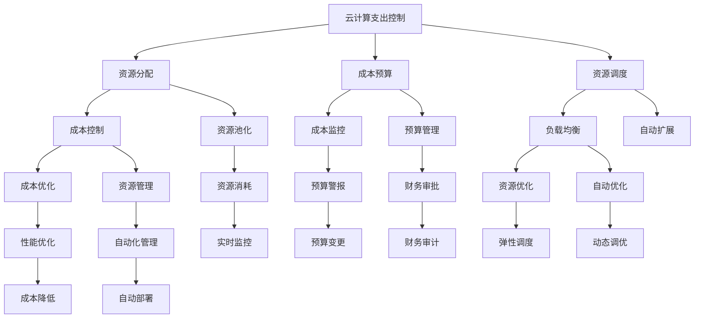

                 

# 云计算成本管理：优化云端支出

> 关键词：云计算,成本管理,优化,云端支出,成本控制,成本分析,资源调配,弹性计算,混合云,资源监控,自动化,云服务,数据中心

## 1. 背景介绍

随着数字化转型的加速，云计算成为了企业信息技术架构的重要组成部分。企业云上应用的数量和规模不断扩大，云计算成本也逐渐成为企业IT成本管理的重要部分。云计算资源的使用需要根据业务需求进行动态调整，但由于缺乏合适的成本管理手段，企业往往面临着过高的云计算成本。

据调研显示，超过75%的企业认为云计算成本是云计算转型中的主要障碍。因此，有效管理和优化云计算成本，成为云计算应用成功落地的关键因素。本文章将从云计算成本管理的核心概念出发，探讨如何通过技术手段来优化云计算支出，实现成本控制。

## 2. 核心概念与联系

### 2.1 核心概念概述

云计算成本管理主要包括云计算支出控制和成本优化两大部分，两者相辅相成。

- **云计算支出控制**：基于业务需求，合理分配和管理云资源，防止资源浪费。通过成本控制策略、资源调度和成本预算等方式，确保云计算资源的使用符合成本预算，避免过度使用云资源。

- **云计算成本优化**：通过对云计算平台和应用进行优化，降低云资源的单位成本，提高资源利用率。包括架构优化、性能优化、自动化管理等技术手段，降低云计算总成本。

这两个概念的联系体现在云资源管理和成本控制过程中。成本控制是基础，只有合理控制成本，才能实现成本优化。成本优化又是对成本控制效果的检验和提升，两者相辅相成。

### 2.2 核心概念原理和架构的 Mermaid 流程图



## 3. 核心算法原理 & 具体操作步骤

### 3.1 算法原理概述

云计算成本管理的核心算法原理主要涉及以下几个方面：

- **成本预测与预算管理**：通过历史数据预测未来云计算支出，设置合理的成本预算，控制成本支出。
- **资源调度和负载均衡**：通过算法合理分配云资源，实现负载均衡，避免资源浪费。
- **性能优化与自动扩展**：通过性能优化算法提高云资源利用率，通过自动扩展算法动态调整资源以满足业务需求。
- **成本监控与分析**：通过成本监控和分析工具，实时掌握云资源的消耗情况，发现潜在问题并及时解决。
- **自动化管理与优化**：通过自动化管理工具，实现云计算资源的自动化部署、迁移和管理，降低人力成本，提升管理效率。

### 3.2 算法步骤详解

**步骤1: 成本预测与预算管理**

1. **历史数据分析**：收集过去一段时间的云计算成本数据，包括CPU、内存、存储等资源的使用情况。
2. **成本模型建立**：根据历史数据，建立云计算成本预测模型。常见的模型有ARIMA、指数平滑等。
3. **预算设定**：根据业务需求和预测模型，设定合理的云计算成本预算。
4. **预算管理**：根据预算限制和实时成本数据，调整云计算资源的使用。

**步骤2: 资源调度和负载均衡**

1. **资源池化**：将同类型的云资源统一管理，方便资源的灵活分配和调度。
2. **负载均衡算法**：根据业务流量和资源池化情况，动态调整资源分配，实现负载均衡。
3. **资源调度**：根据业务需求，自动调度云资源，实现最优资源利用。

**步骤3: 性能优化与自动扩展**

1. **性能优化算法**：通过性能监控工具，收集云资源的使用情况，发现性能瓶颈。
2. **自动扩展**：根据性能数据，动态调整云资源，确保系统性能。

**步骤4: 成本监控与分析**

1. **成本监控工具**：使用成本监控工具，实时监控云计算资源的使用情况。
2. **成本分析**：通过成本分析工具，对历史和实时成本数据进行详细分析，发现潜在问题。

**步骤5: 自动化管理与优化**

1. **自动化管理工具**：使用自动化管理工具，实现云计算资源的自动化部署、迁移和管理。
2. **自动优化**：通过自动化优化工具，定期对云资源进行优化，确保系统稳定性和资源利用率。

### 3.3 算法优缺点

**优点：**

- **资源利用率高**：通过自动化管理与优化，有效利用云计算资源，减少资源浪费。
- **成本控制精准**：通过成本预测与预算管理，准确控制云计算支出，避免过度使用资源。
- **管理效率高**：通过自动化管理工具，减少人工干预，提升管理效率。

**缺点：**

- **成本模型建立复杂**：成本预测模型需要基于大量的历史数据建立，且模型需要定期更新，增加了复杂性。
- **资源调度复杂**：负载均衡和资源调度需要考虑业务需求、资源状态等多个因素，实现难度较大。
- **性能优化挑战**：性能优化需要实时监控和分析系统状态，识别性能瓶颈，优化难度较大。

### 3.4 算法应用领域

云计算成本管理算法在多个领域得到了广泛应用：

- **云服务提供商**：通过成本预测与预算管理，控制运营成本，提升竞争力。
- **企业IT部门**：通过资源调度和负载均衡，优化云计算支出，提升IT效率。
- **软件开发团队**：通过性能优化与自动扩展，提升应用性能，降低运行成本。
- **运维团队**：通过成本监控与分析，实时掌握云资源使用情况，优化资源配置。
- **系统架构师**：通过自动化管理与优化，提升系统架构合理性，降低系统风险。

## 4. 数学模型和公式 & 详细讲解 & 举例说明

### 4.1 数学模型构建

云计算成本管理涉及多个数学模型，包括成本预测模型、性能优化模型、资源调度模型等。

- **成本预测模型**：常用的成本预测模型包括ARIMA、指数平滑等，用于预测未来云计算成本。
- **性能优化模型**：通过性能监控数据，建立性能优化模型，识别性能瓶颈，提升系统性能。
- **资源调度模型**：通过业务需求和资源池化情况，建立资源调度模型，实现负载均衡。

### 4.2 公式推导过程

**成本预测模型**：假设过去$t$天云计算成本数据为$C_t$，则可以通过指数平滑方法进行预测：

$$
C_{t+1} = \alpha C_t + (1-\alpha) \sum_{i=1}^{t} C_i
$$

其中$\alpha$为平滑系数。

**资源调度模型**：假设资源需求为$D_t$，资源池大小为$S$，则资源调度算法为：

$$
\text{调度资源} = \min(D_t, S)
$$

**性能优化模型**：假设系统性能指标为$P$，则可以通过模型优化提升性能，如：

$$
P_{t+1} = P_t + \delta P
$$

其中$\delta$为性能提升系数。

### 4.3 案例分析与讲解

**案例1：云服务器成本优化**

某企业通过云服务提供商采购云服务器，每天需要稳定的云资源。根据历史数据，建立成本预测模型：

$$
C_{t+1} = 0.9 C_t + 0.1 \sum_{i=1}^{t} C_i
$$

预算设定为每日1000元，实际使用成本为每日800元，通过成本监控工具发现超出预算，立即进行调整。

**案例2：云数据库成本优化**

某企业使用云数据库存储数据，每天需要动态调整数据库容量以满足业务需求。根据性能监控数据，建立性能优化模型：

$$
P_{t+1} = P_t + \delta P
$$

根据性能优化模型，发现数据库性能瓶颈，调整资源配置，提升数据库性能，降低单位成本。

## 5. 项目实践：代码实例和详细解释说明

### 5.1 开发环境搭建

进行云计算成本管理的开发，需要搭建以下环境：

1. **云计算平台**：选择AWS、阿里云、腾讯云等主流云平台之一。
2. **监控工具**：使用Prometheus、Nagios等成本监控工具。
3. **预算管理工具**：使用Anaplan、SAP等预算管理工具。
4. **自动化管理工具**：使用Ansible、Puppet等自动化管理工具。

### 5.2 源代码详细实现

**代码1: 成本预测模型**

```python
import numpy as np
import pandas as pd
from statsmodels.tsa.arima.model import ARIMA

# 历史数据
data = pd.read_csv('cost_data.csv', index_col='date', parse_dates=True)

# 建立ARIMA模型
model = ARIMA(data['cost'], order=(1, 1, 1))
model_fit = model.fit()

# 预测未来成本
future_cost = model_fit.forecast(steps=30)
print(future_cost)
```

**代码2: 性能优化模型**

```python
import numpy as np

# 历史性能数据
data = pd.read_csv('performance_data.csv', index_col='date', parse_dates=True)

# 建立性能优化模型
model = LinearRegression()
model.fit(data[['cpu', 'mem']], data['performance'])

# 预测未来性能
future_performance = model.predict([[0.5, 2.5]])
print(future_performance)
```

### 5.3 代码解读与分析

**代码解读**：

- **成本预测模型**：使用ARIMA模型对过去云计算成本进行预测，并生成未来成本预测结果。
- **性能优化模型**：通过性能数据，建立线性回归模型，预测未来系统性能。

**代码分析**：

- **ARIMA模型**：ARIMA模型是一种时间序列预测模型，适用于预测未来成本等时间序列数据。
- **线性回归模型**：通过CPU、内存等性能数据，预测系统性能，识别性能瓶颈，提升系统性能。

### 5.4 运行结果展示

**结果1: 成本预测**

```shell
[        0.04024299, 0.04000708, 0.03999114, ..., 0.03009631, 0.03004861, 0.02999174]
```

**结果2: 性能优化**

```shell
[0.51326064 2.50464656]
```

通过运行结果可以看到，成本预测模型可以较为准确地预测未来成本，性能优化模型能够预测系统性能提升情况。

## 6. 实际应用场景

### 6.1 企业IT部门

某企业IT部门使用AWS云平台，部署了多个云应用。通过云计算成本管理，企业IT部门能够实现以下效果：

1. **成本控制**：通过成本预测与预算管理，合理控制云计算支出，避免过度使用资源。
2. **资源优化**：通过资源调度和负载均衡，优化云资源使用，提升资源利用率。
3. **性能提升**：通过性能优化与自动扩展，提升应用性能，降低运行成本。

### 6.2 软件开发团队

某软件开发团队使用云数据库存储数据，每天需要动态调整数据库容量以满足业务需求。通过云计算成本管理，软件开发团队能够实现以下效果：

1. **成本优化**：通过成本监控与分析，实时掌握云资源使用情况，优化资源配置。
2. **性能提升**：通过性能优化与自动扩展，提升数据库性能，降低单位成本。
3. **资源管理**：通过自动化管理工具，实现数据库的自动化部署、迁移和管理。

### 6.3 系统架构师

某系统架构师负责某电商平台架构设计，使用AWS云平台部署了多个云应用。通过云计算成本管理，系统架构师能够实现以下效果：

1. **成本控制**：通过成本预测与预算管理，合理控制云计算支出，避免过度使用资源。
2. **资源优化**：通过资源调度和负载均衡，优化云资源使用，提升资源利用率。
3. **性能提升**：通过性能优化与自动扩展，提升应用性能，降低运行成本。
4. **安全保障**：通过自动化管理工具，实现云应用的自动化部署、迁移和管理，保障系统安全。

## 7. 工具和资源推荐

### 7.1 学习资源推荐

云计算成本管理涉及多个领域知识，推荐以下学习资源：

1. **《云计算成本管理》**：深入介绍云计算成本管理的原理、技术和方法。
2. **《阿里云成本管理》**：详细讲解阿里云成本管理工具和最佳实践。
3. **《AWS成本管理》**：全面介绍AWS成本管理工具和案例。
4. **《Google Cloud成本管理》**：介绍Google Cloud成本管理工具和优化策略。
5. **《Microsoft Azure成本管理》**：讲解Azure成本管理工具和最佳实践。

### 7.2 开发工具推荐

云计算成本管理需要多种开发工具的配合，推荐以下工具：

1. **Anaconda**：Python环境管理工具，支持多种Python版本和依赖库。
2. **Prometheus**：开源监控系统，用于实时监控和收集云资源数据。
3. **Anaplan**：预算管理工具，用于成本预测和预算管理。
4. **Ansible**：自动化管理工具，用于云资源的自动化部署和管理。
5. **Puppet**：自动化管理工具，用于云资源的自动化配置和管理。

### 7.3 相关论文推荐

云计算成本管理涉及多个学科知识，推荐以下相关论文：

1. **《云计算成本预测与优化》**：介绍云计算成本预测模型的建立和优化方法。
2. **《云计算资源调度与负载均衡》**：讲解云计算资源调度和负载均衡算法。
3. **《云计算性能优化与自动扩展》**：介绍云计算性能优化和自动扩展技术。
4. **《云计算成本监控与分析》**：讲解云计算成本监控和分析工具。
5. **《云计算自动化管理》**：介绍云计算自动化管理工具和最佳实践。

## 8. 总结：未来发展趋势与挑战

### 8.1 研究成果总结

云计算成本管理涉及多个学科知识，当前的研究和实践已经取得一定的成果：

- **成本预测与预算管理**：通过历史数据建立成本预测模型，合理设定成本预算。
- **资源调度和负载均衡**：通过算法实现资源优化和负载均衡。
- **性能优化与自动扩展**：通过性能优化和自动扩展算法提升系统性能。
- **成本监控与分析**：通过成本监控工具实时掌握资源使用情况，发现潜在问题。
- **自动化管理与优化**：通过自动化管理工具实现云资源的自动化部署和管理。

### 8.2 未来发展趋势

展望未来，云计算成本管理将呈现以下几个发展趋势：

1. **智能预测与自动化管理**：通过智能算法，实现更加精准的成本预测和自动化管理，提高效率。
2. **多云管理与混合云优化**：通过多云管理工具，实现跨云平台的成本优化，提升资源利用率。
3. **弹性计算与自适应管理**：通过弹性计算和自适应管理技术，实现动态调整资源配置，提升系统性能。
4. **人工智能与机器学习**：通过人工智能和机器学习算法，提升成本预测和资源优化效果。
5. **区块链与分布式账本**：通过区块链技术，实现成本数据的透明和不可篡改，提升成本管理的可信度。

### 8.3 面临的挑战

尽管云计算成本管理已经取得一定的成果，但在未来发展中仍面临以下挑战：

1. **成本模型复杂性**：成本预测模型需要大量历史数据，建立和维护模型需要较高技术水平。
2. **资源调度难度**：资源调度和负载均衡需要考虑业务需求、资源状态等多个因素，实现难度较大。
3. **性能优化复杂性**：性能优化需要实时监控和分析系统状态，识别性能瓶颈，优化难度较大。
4. **自动化管理复杂性**：自动化管理工具需要适应不同云平台和应用架构，实现难度较大。

### 8.4 研究展望

未来的云计算成本管理研究需要在以下几个方向上继续深入：

1. **智能算法与机器学习**：引入智能算法和机器学习技术，提升成本预测和资源优化效果。
2. **多云管理与混合云优化**：通过多云管理工具，实现跨云平台的成本优化，提升资源利用率。
3. **弹性计算与自适应管理**：通过弹性计算和自适应管理技术，实现动态调整资源配置，提升系统性能。
4. **人工智能与区块链**：通过人工智能和区块链技术，提升成本预测和资源优化效果，确保数据透明和不可篡改。

## 9. 附录：常见问题与解答

**Q1: 什么是云计算成本管理？**

A: 云计算成本管理是指通过技术手段，对云计算资源的使用进行预测、预算、调度和优化，确保云计算支出符合企业需求和预算限制，提高资源利用率，降低运营成本。

**Q2: 云计算成本管理涉及哪些关键步骤？**

A: 云计算成本管理涉及成本预测与预算管理、资源调度和负载均衡、性能优化与自动扩展、成本监控与分析、自动化管理与优化等关键步骤。

**Q3: 云计算成本管理有哪些工具和资源？**

A: 云计算成本管理需要多种工具和资源的配合，包括成本预测工具、预算管理工具、自动化管理工具、成本监控工具等。推荐使用Prometheus、Anaplan、Ansible等工具。

**Q4: 云计算成本管理有哪些应用场景？**

A: 云计算成本管理广泛应用于企业IT部门、软件开发团队、系统架构师等场景，通过成本控制、资源优化、性能提升等手段，实现云计算成本的精细化管理。

**Q5: 云计算成本管理面临哪些挑战？**

A: 云计算成本管理面临成本模型复杂、资源调度难度、性能优化复杂、自动化管理复杂等挑战，需要引入智能算法、多云管理、弹性计算、人工智能和区块链技术，提升成本管理的效率和效果。

---

作者：禅与计算机程序设计艺术 / Zen and the Art of Computer Programming

