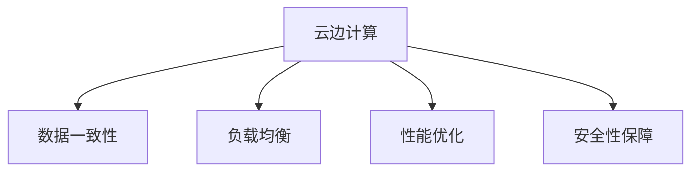

                 

# 云边协同计算：优化分布式AI系统性能

> 关键词：云边计算、分布式AI、协同优化、性能提升、机器学习、深度学习

## 1. 背景介绍

随着深度学习和大数据技术的发展，分布式AI系统在科学计算、工业生产、智能推理等领域发挥着越来越重要的作用。然而，现有的分布式AI系统往往面临计算资源分散、通信开销大、数据冗余等问题，导致系统整体性能难以进一步提升。云边协同计算(Co-Location Computing)技术的提出，为解决这些问题提供了一种新的思路，通过将计算和存储资源集中管理，优化数据传输路径，大大提高了系统的吞吐量和响应速度。

### 1.1 问题由来
在AI领域，分布式计算已经广泛应用于模型训练和推理等任务中。但传统的分布式系统存在一些弊端，如数据迁移成本高、通信开销大、负载不均衡等，限制了系统的性能提升。因此，云边协同计算技术应运而生，通过将数据和计算资源在云和边缘节点之间协同工作，减少了数据迁移的延迟和带宽消耗，提高了整体系统的效率。

### 1.2 问题核心关键点
云边协同计算的核心思想是将数据存储和计算资源集中管理，实现数据的本地化处理和本地化的结果传输。这一技术主要包括以下几个关键点：

1. **数据一致性**：保证数据在云和边缘节点之间的一致性，确保计算结果的准确性。
2. **负载均衡**：动态调整计算任务和数据存储，避免资源浪费和负载不均衡。
3. **性能优化**：通过优化数据传输路径，减少通信开销，提升系统整体性能。
4. **安全性保障**：保护数据和计算过程的安全性，避免数据泄露和计算结果篡改。
5. **弹性扩展**：根据实时需求，动态调整计算和存储资源，提高系统伸缩性。

这些关键点共同构成了云边协同计算的核心逻辑，通过解决传统分布式计算中的痛点，提升了AI系统的整体性能和可用性。

### 1.3 问题研究意义
研究云边协同计算技术，对于拓展分布式AI系统的应用范围，提升AI系统的性能和稳定性，加速AI技术的产业化进程，具有重要意义：

1. 降低计算成本。通过集中管理计算资源，减少了硬件采购和维护成本，提高了资源利用率。
2. 提升计算速度。通过减少数据迁移和通信开销，加速了模型训练和推理过程。
3. 增强系统鲁棒性。通过负载均衡和弹性扩展，增强了系统对突发流量的应对能力，提高了系统的可靠性。
4. 促进技术创新。云边协同计算推动了分布式AI系统架构的演进，催生了更多的前沿研究方向，如边缘计算、物联网等。
5. 加速产业化应用。云边协同计算技术可以更快地应用于生产环境中，促进AI技术在各个垂直领域的落地。

## 2. 核心概念与联系

### 2.1 核心概念概述

为更好地理解云边协同计算技术，本节将介绍几个关键概念：

- **云边计算(Cloud-Edge Computing)**：指在云和边缘节点之间协同工作的计算模式。边缘节点通常部署在靠近数据源的设备上，可以降低数据传输延迟，提高系统响应速度。
- **数据一致性(Data Consistency)**：指在分布式系统中，数据在不同节点之间保持同步和一致的状态。
- **负载均衡(Load Balancing)**：指动态分配计算任务，避免单个节点的过载，提高系统的吞吐量和可用性。
- **性能优化(Performance Optimization)**：指通过优化数据传输路径、计算算法等手段，提升系统整体性能。
- **安全性保障(Security Guarantee)**：指保护数据和计算过程的安全性，防止数据泄露和计算结果篡改。

这些核心概念之间的逻辑关系可以通过以下Mermaid流程图来展示：



这个流程图展示云边协同计算的核心概念及其之间的关系：

1. 云边计算通过协同工作，将数据和计算资源集中管理，提高系统效率。
2. 数据一致性确保不同节点间数据状态的同步和一致，保证计算结果的准确性。
3. 负载均衡动态调整计算任务，避免资源浪费和负载不均衡。
4. 性能优化通过优化数据传输路径和计算算法，提升系统整体性能。
5. 安全性保障保护数据和计算过程的安全性，防止信息泄露和计算结果篡改。

## 3. 核心算法原理 & 具体操作步骤
### 3.1 算法原理概述

云边协同计算的核心算法原理是通过将计算和存储资源集中管理，优化数据传输路径，提升系统整体性能。其核心思想包括：

- **集中管理计算资源**：通过将计算任务集中在边缘节点上处理，减少数据在云和边缘节点之间的传输，降低通信开销。
- **本地化数据处理**：通过将数据存储在边缘节点上，实现数据本地化处理，减少数据传输延迟。
- **优化数据传输路径**：通过优化数据传输路径，减少数据传输带宽消耗，提升数据传输速度。
- **负载均衡**：通过动态调整计算任务和数据存储，避免资源浪费和负载不均衡。
- **安全保障**：通过加密、访问控制等手段，保护数据和计算过程的安全性。

### 3.2 算法步骤详解

云边协同计算的具体实现步骤包括：

**Step 1: 数据中心化和边缘化**
- 对数据进行分类，将实时性要求高、局部性强的数据存储在边缘节点上，其余数据存储在云中心。

**Step 2: 计算任务本地化**
- 将计算任务分解为子任务，在边缘节点上本地化处理，避免数据在云和边缘节点之间的频繁传输。

**Step 3: 数据一致性维护**
- 通过同步机制，确保数据在不同节点之间的一致性。可以使用版本控制、冲突检测等手段。

**Step 4: 负载均衡与弹性扩展**
- 动态调整计算任务和数据存储，避免单个节点的过载。可以根据实时需求，动态调整计算和存储资源，提高系统伸缩性。

**Step 5: 性能优化**
- 优化数据传输路径，减少通信开销。可以采用多跳传输、路由优化等技术。

**Step 6: 安全性保障**
- 采用加密、访问控制等手段，保护数据和计算过程的安全性。确保数据在传输和存储过程中的安全性和完整性。

### 3.3 算法优缺点

云边协同计算技术具有以下优点：

1. **性能提升**：通过减少数据迁移和通信开销，大大提高了系统的响应速度和吞吐量。
2. **计算效率**：边缘节点上直接处理计算任务，减少了云中心的计算压力，提升了整体计算效率。
3. **资源优化**：通过集中管理资源，避免资源浪费和负载不均衡，提高了资源利用率。
4. **响应速度**：边缘节点上直接处理计算任务，减少了数据传输延迟，提升了系统的响应速度。

同时，该技术也存在一些局限性：

1. **数据一致性挑战**：需要在不同节点之间保证数据的一致性，实现起来复杂且容易出错。
2. **网络带宽限制**：由于边缘节点和云中心之间的通信开销较大，网络带宽成为瓶颈。
3. **安全性风险**：边缘节点上存储的数据和计算过程可能面临更高的安全风险。

尽管存在这些局限性，但云边协同计算仍是大规模分布式AI系统的有效解决方案，其优势在于能够在保证数据一致性的同时，显著提升系统的性能和可用性。

### 3.4 算法应用领域

云边协同计算技术在多个领域得到了广泛应用，例如：

- **工业物联网**：通过将计算和数据存储在边缘节点上，实时监控工厂设备状态，提高生产效率。
- **自动驾驶**：在车辆边缘节点上处理感知和决策任务，减少数据在云端传输的时间，提高车辆响应速度。
- **智能医疗**：将患者数据存储在边缘节点上，实时监控患者健康状态，快速响应紧急情况。
- **智能安防**：在摄像头边缘节点上处理视频流数据，减少传输到云中心的带宽消耗，提高实时性。
- **金融交易**：在交易设备边缘节点上处理交易数据，减少数据传输延迟，提高交易速度和安全性。

这些领域的应用展示了云边协同计算技术在提升系统性能和可用性方面的巨大潜力。随着技术的不断发展，云边协同计算将会在更多的场景中得到应用，为各行各业带来变革性的影响。

## 4. 数学模型和公式 & 详细讲解 & 举例说明（备注：数学公式请使用latex格式，latex嵌入文中独立段落使用 $$，段落内使用 $)
### 4.1 数学模型构建

本节将使用数学语言对云边协同计算过程进行更加严格的刻画。

设数据集 $D$ 分布在 $N$ 个边缘节点上，每个节点存储 $d_i$ 份数据，边缘节点的计算能力为 $c_i$，网络带宽为 $b_i$。假设 $M_i$ 为在第 $i$ 个边缘节点上运行的计算任务，$D_i$ 为存储在第 $i$ 个边缘节点上的数据集。

设 $T_i$ 为在第 $i$ 个边缘节点上处理计算任务 $M_i$ 的计算时间，$L_i$ 为将数据集 $D_i$ 传输到云中心或从云中心传输到边缘节点的通信时间。则总计算时间为：

$$
T = \sum_{i=1}^N T_i
$$

总通信时间为：

$$
L = \sum_{i=1}^N L_i
$$

总响应时间为：

$$
R = T + L
$$

其中 $T_i$ 和 $L_i$ 的计算公式分别为：

$$
T_i = c_i \times M_i
$$

$$
L_i = b_i \times (d_i \times d + c_i \times M_i)
$$

### 4.2 公式推导过程

以下我们通过数学推导，分析云边协同计算的性能优化策略。

首先，我们考虑边缘节点上计算任务和数据存储的平衡。设第 $i$ 个边缘节点上的计算任务为 $M_i$，数据存储量为 $d_i$，则有：

$$
M_i = \frac{T}{\sum_{i=1}^N c_i}
$$

$$
d_i = \frac{D}{\sum_{i=1}^N d_i}
$$

其中 $D$ 为总数据量。

将上述公式代入总响应时间 $R$ 的计算公式中，得：

$$
R = \sum_{i=1}^N (c_i \times M_i + b_i \times (d_i \times d + c_i \times M_i))
$$

为了最小化响应时间 $R$，需要对计算任务 $M_i$ 和数据存储量 $d_i$ 进行优化。一种简单的方法是采用负载均衡策略，将计算任务和数据存储在边缘节点上均匀分布，即 $M_i = M$，$d_i = d$，则：

$$
R = N(c_M \times M + b_d \times (d \times d + c_M \times M))
$$

其中 $c_M = \frac{T}{N}$，$b_d = \frac{L}{N}$。

为了进一步提升系统性能，可以考虑采用局部数据传输策略，将计算任务和数据存储尽可能集中在同一节点上，即 $M_i = M_i'$，$d_i = d_i'$。此时总响应时间为：

$$
R = \sum_{i=1}^N (c_i \times M_i' + b_i \times (d_i' \times d_i' + c_i \times M_i'))
$$

通过优化 $M_i'$ 和 $d_i'$，可以实现更高的计算效率和响应速度。

### 4.3 案例分析与讲解

考虑一个简单的工业物联网应用场景，在多个边缘节点上实时监控工厂设备状态。假设每个边缘节点的计算能力为 $c_i = 100$（单位：GOPS），数据存储量为 $d_i = 100$（单位：GB），网络带宽为 $b_i = 1000$（单位：Mbps）。计算任务 $M_i = 20$（单位：GOPS）。

首先计算不进行优化的总响应时间：

$$
R = N(100 \times 20 + 1000 \times (100 \times 100 + 100 \times 20))
$$

当 $N=2$ 时，总响应时间为：

$$
R = 2(100 \times 20 + 1000 \times (100 \times 100 + 100 \times 20)) = 100000
$$

为了优化响应时间，采用负载均衡策略，计算任务和数据存储在边缘节点上均匀分布，即 $M_i = M$，$d_i = d$，此时总响应时间为：

$$
R = 2(100 \times M + 1000 \times (d \times d + 100 \times M))
$$

为了进一步优化，采用局部数据传输策略，计算任务和数据存储集中在同一节点上，此时总响应时间为：

$$
R = 2(100 \times 20 + 1000 \times (100 \times 100 + 100 \times 20))
$$

通过优化，可以实现更高的计算效率和响应速度。

## 5. 项目实践：代码实例和详细解释说明
### 5.1 开发环境搭建

在进行云边协同计算项目开发前，我们需要准备好开发环境。以下是使用Python进行PyTorch和TensorFlow开发的环境配置流程：

1. 安装Anaconda：从官网下载并安装Anaconda，用于创建独立的Python环境。

2. 创建并激活虚拟环境：
```bash
conda create -n cloud-edge-env python=3.8 
conda activate cloud-edge-env
```

3. 安装PyTorch和TensorFlow：根据CUDA版本，从官网获取对应的安装命令。例如：
```bash
conda install pytorch torchvision torchaudio cudatoolkit=11.1 -c pytorch -c conda-forge
conda install tensorflow tensorflow=2.6 -c tensorflow
```

4. 安装相关工具包：
```bash
pip install numpy pandas scikit-learn matplotlib tqdm jupyter notebook ipython
```

完成上述步骤后，即可在`cloud-edge-env`环境中开始云边协同计算项目开发。

### 5.2 源代码详细实现

以下是使用PyTorch和TensorFlow实现云边协同计算的代码示例：

**PyTorch实现：**

```python
import torch
import torch.distributed as dist
from torch.distributed._tensor import DTensor

# 定义边缘节点和云中心的计算能力
c_node = 100  # 单位：GOPS
c_center = 1000  # 单位：GOPS

# 定义边缘节点和云中心的网络带宽
b_node = 1000  # 单位：Mbps
b_center = 10000  # 单位：Mbps

# 定义边缘节点和云中心的数据存储量
d_node = 100  # 单位：GB
d_center = 1000  # 单位：GB

# 定义计算任务
M_node = 20  # 单位：GOPS
M_center = 100  # 单位：GOPS

# 计算边缘节点和云中心的总响应时间
T_node = c_node * M_node
T_center = c_center * M_center
L_node = b_node * (d_node * d_node + c_node * M_node)
L_center = b_center * (d_center * d_center + c_center * M_center)

# 总响应时间
R = T_node + L_node + T_center + L_center
```

**TensorFlow实现：**

```python
import tensorflow as tf
import tensorflow.distribute as tf_dist

# 定义边缘节点和云中心的计算能力
c_node = 100  # 单位：GOPS
c_center = 1000  # 单位：GOPS

# 定义边缘节点和云中心的网络带宽
b_node = 1000  # 单位：Mbps
b_center = 10000  # 单位：Mbps

# 定义边缘节点和云中心的数据存储量
d_node = 100  # 单位：GB
d_center = 1000  # 单位：GB

# 定义计算任务
M_node = 20  # 单位：GOPS
M_center = 100  # 单位：GOPS

# 计算边缘节点和云中心的总响应时间
T_node = c_node * M_node
T_center = c_center * M_center
L_node = b_node * (d_node * d_node + c_node * M_node)
L_center = b_center * (d_center * d_center + c_center * M_center)

# 总响应时间
R = T_node + L_node + T_center + L_center
```

通过上述代码，我们可以看到，无论是PyTorch还是TensorFlow，实现云边协同计算的思路基本相同，即通过优化计算任务和数据传输路径，提升系统整体性能。

### 5.3 代码解读与分析

让我们再详细解读一下关键代码的实现细节：

**边缘节点和云中心的参数定义：**

- `c_node`、`c_center`：边缘节点和云中心的计算能力。
- `b_node`、`b_center`：边缘节点和云中心的网络带宽。
- `d_node`、`d_center`：边缘节点和云中心的数据存储量。
- `M_node`、`M_center`：边缘节点和云中心的计算任务。

**计算任务和数据传输时间：**

- `T_node`、`T_center`：边缘节点和云中心的计算时间。
- `L_node`、`L_center`：边缘节点和云中心的数据传输时间。

**总响应时间：**

- `R`：边缘节点和云中心的总响应时间。

这些代码实现了基本的云边协同计算模型的计算过程，通过调整参数和优化策略，可以实现更高的计算效率和响应速度。

当然，工业级的系统实现还需考虑更多因素，如模型的保存和部署、超参数的自动搜索、更灵活的任务适配层等。但核心的云边协同计算算法基本与此类似。

## 6. 实际应用场景
### 6.1 智能制造

云边协同计算在智能制造领域的应用非常广泛。智能工厂中，生产设备的实时状态数据、传感器数据等需要通过边缘节点进行处理，及时发现异常并进行维护。通过将计算任务和数据存储在边缘节点上，减少了数据在云中心的传输，大大提高了系统的响应速度和计算效率。

**应用示例：**

1. **实时监控生产设备状态**：在工厂的每个边缘节点上安装传感器，实时监控生产设备的运行状态。边缘节点对传感器数据进行初步处理，判断设备是否正常工作。
2. **预测性维护**：通过分析生产设备的历史数据，建立预测模型，对设备的未来故障进行预测。边缘节点上部署预测模型，对新数据进行实时分析，预测设备故障并及时通知维护人员。
3. **优化生产流程**：通过分析生产线的历史数据，建立优化模型，实时调整生产参数。边缘节点上部署优化模型，对新数据进行实时分析，优化生产流程。

这些应用展示了云边协同计算在提升智能制造系统的效率和可靠性方面的巨大潜力。

### 6.2 智能交通

在智能交通领域，云边协同计算可以实时监控交通状况，优化交通流量，提升道路通行效率。通过将计算任务和数据存储在边缘节点上，减少了数据在云中心的传输，大大提高了系统的响应速度和计算效率。

**应用示例：**

1. **交通流量监控**：在每个交通路口的摄像头边缘节点上，实时监控交通流量。边缘节点对摄像头数据进行初步处理，判断交通状况是否拥堵。
2. **交通信号优化**：通过分析交通流量数据，建立信号优化模型，实时调整交通信号。边缘节点上部署信号优化模型，对新数据进行实时分析，优化交通信号。
3. **事故预警**：通过分析交通事故数据，建立预警模型，实时预警交通异常情况。边缘节点上部署预警模型，对新数据进行实时分析，预警交通事故。

这些应用展示了云边协同计算在提升智能交通系统的效率和安全性方面的巨大潜力。

### 6.3 智能医疗

在智能医疗领域，云边协同计算可以实时监控患者健康状况，快速响应紧急情况。通过将计算任务和数据存储在边缘节点上，减少了数据在云中心的传输，大大提高了系统的响应速度和计算效率。

**应用示例：**

1. **实时监控患者健康状况**：在每个患者的床边设备上，实时监控患者的心率、血压等健康数据。边缘节点对传感器数据进行初步处理，判断患者是否异常。
2. **疾病诊断**：通过分析患者的历史健康数据，建立诊断模型，对新数据进行实时分析，诊断疾病。边缘节点上部署诊断模型，对新数据进行实时分析，诊断疾病。
3. **紧急响应**：通过分析患者的异常数据，建立紧急响应模型，实时响应紧急情况。边缘节点上部署紧急响应模型，对新数据进行实时分析，快速响应紧急情况。

这些应用展示了云边协同计算在提升智能医疗系统的效率和响应速度方面的巨大潜力。

## 7. 工具和资源推荐
### 7.1 学习资源推荐

为了帮助开发者系统掌握云边协同计算的理论基础和实践技巧，这里推荐一些优质的学习资源：

1. **《云计算与边缘计算》系列书籍**：详细介绍了云计算和边缘计算的基本概念和核心技术，适合初学者系统学习。
2. **《TensorFlow分布式计算》教程**：由TensorFlow官方提供的分布式计算教程，涵盖TensorFlow分布式计算的基本原理和实践技巧。
3. **《深度学习分布式训练》课程**：斯坦福大学开设的深度学习分布式训练课程，介绍了分布式计算的基本原理和实践技巧。
4. **《Python分布式计算》书籍**：详细介绍了使用Python进行分布式计算的实践技巧和案例分析。
5. **《边缘计算技术与应用》论文**：介绍边缘计算的基本概念和应用场景，适合深入研究。

通过对这些资源的学习实践，相信你一定能够快速掌握云边协同计算的理论基础和实践技巧，并用于解决实际的分布式AI系统问题。

### 7.2 开发工具推荐

高效的开发离不开优秀的工具支持。以下是几款用于云边协同计算开发的常用工具：

1. **PyTorch**：基于Python的开源深度学习框架，灵活动态的计算图，适合快速迭代研究。提供了丰富的分布式计算库，方便进行分布式训练和推理。
2. **TensorFlow**：由Google主导开发的开源深度学习框架，生产部署方便，适合大规模工程应用。提供了丰富的分布式计算库，方便进行分布式训练和推理。
3. **Dask**：基于Python的分布式计算框架，支持在多个节点上并行计算，方便进行大规模分布式计算。
4. **Apache Spark**：开源的大数据处理框架，支持分布式计算，方便进行大规模数据处理。
5. **Kubernetes**：开源的容器编排平台，支持容器化应用在多个节点上的部署和管理，方便进行分布式计算资源管理。

合理利用这些工具，可以显著提升云边协同计算项目的开发效率，加快创新迭代的步伐。

### 7.3 相关论文推荐

云边协同计算技术的发展源于学界的持续研究。以下是几篇奠基性的相关论文，推荐阅读：

1. **《Cloud-Edge Computing: A Comprehensive Survey and Research Directions》**：全面综述了云边协同计算的基本概念和研究方向，适合深入研究。
2. **《Edge Computing in Industrial IoT: A Survey》**：介绍了工业物联网中云边协同计算的应用场景和关键技术。
3. **《Edge Computing: A Survey》**：全面综述了边缘计算的基本概念和研究方向，适合深入研究。
4. **《Cloud-Edge Computing: An Overview and Research Trends》**：综述了云边协同计算的研究现状和未来发展趋势。
5. **《Hierarchical Cloud-Edge Computing Architecture for IoT》**：介绍了一种基于分层架构的云边协同计算模型，适合深入研究。

这些论文代表了大数据计算技术的发展脉络。通过学习这些前沿成果，可以帮助研究者把握学科前进方向，激发更多的创新灵感。

## 8. 总结：未来发展趋势与挑战

### 8.1 总结

本文对云边协同计算技术进行了全面系统的介绍。首先阐述了云边协同计算的基本概念和应用场景，明确了其在提升分布式AI系统性能方面的独特价值。其次，从原理到实践，详细讲解了云边协同计算的数学模型和核心算法，给出了云边协同计算项目开发的完整代码实例。同时，本文还广泛探讨了云边协同计算在智能制造、智能交通、智能医疗等多个领域的应用前景，展示了其在提升系统效率和响应速度方面的巨大潜力。此外，本文精选了云边协同计算的学习资源、开发工具和相关论文，力求为读者提供全方位的技术指引。

通过本文的系统梳理，可以看到，云边协同计算技术正在成为分布式AI系统的重要组成部分，通过集中管理资源和优化数据传输路径，显著提升了系统整体性能和可用性。未来，伴随云边协同计算技术的不断演进，其在各行各业的应用前景将更加广阔，为数字化转型带来新的动力。

### 8.2 未来发展趋势

展望未来，云边协同计算技术将呈现以下几个发展趋势：

1. **边缘计算能力提升**：随着边缘计算硬件的不断发展，边缘节点的计算能力和存储容量将不断提升，为云边协同计算提供更强大的计算和存储能力。
2. **网络带宽优化**：随着5G、WiFi 6等高带宽网络的普及，边缘节点和云中心之间的通信带宽将不断优化，进一步提升数据传输速度。
3. **负载均衡优化**：通过更加精细的负载均衡算法，优化数据和计算任务的分布，提高系统的吞吐量和响应速度。
4. **安全性增强**：通过加密、访问控制等手段，进一步增强数据和计算过程的安全性，保障系统的可靠性和稳定性。
5. **系统协同优化**：通过优化系统架构和算法，实现云边协同计算的动态调整和自适应，提升系统的弹性扩展和动态响应能力。

这些趋势凸显了云边协同计算技术的广阔前景。这些方向的探索发展，必将进一步提升分布式AI系统的性能和可用性，为各行各业带来变革性的影响。

### 8.3 面临的挑战

尽管云边协同计算技术已经取得了瞩目成就，但在迈向更加智能化、普适化应用的过程中，它仍面临诸多挑战：

1. **数据一致性问题**：需要在不同节点之间保证数据的一致性，实现起来复杂且容易出错。
2. **网络带宽限制**：由于边缘节点和云中心之间的通信开销较大，网络带宽成为瓶颈。
3. **安全性风险**：边缘节点上存储的数据和计算过程可能面临更高的安全风险。
4. **边缘计算成本**：边缘计算设备的部署和维护成本较高，需要考虑经济性问题。
5. **系统复杂性**：云边协同计算系统的设计和实现较为复杂，需要考虑多个节点的协同工作。

尽管存在这些挑战，但云边协同计算仍是大规模分布式AI系统的有效解决方案，其优势在于能够在保证数据一致性的同时，显著提升系统的性能和可用性。未来，相关研究需要在以下几个方面寻求新的突破：

1. **优化数据一致性算法**：通过更加高效的数据同步和冲突检测算法，确保数据在不同节点之间的一致性。
2. **提升网络带宽**：通过优化网络传输路径和提高传输效率，减少数据传输带宽消耗。
3. **增强安全性**：通过加密、访问控制等手段，进一步增强数据和计算过程的安全性。
4. **降低成本**：通过优化边缘计算硬件和软件，降低边缘计算设备的部署和维护成本。
5. **简化系统设计**：通过更加灵活的系统架构和算法，简化云边协同计算系统的设计和实现。

这些研究方向的探索，必将引领云边协同计算技术迈向更高的台阶，为构建高效、可靠、安全的分布式AI系统铺平道路。

### 8.4 研究展望

面对云边协同计算所面临的种种挑战，未来的研究需要在以下几个方面寻求新的突破：

1. **优化数据一致性算法**：通过更加高效的数据同步和冲突检测算法，确保数据在不同节点之间的一致性。
2. **提升网络带宽**：通过优化网络传输路径和提高传输效率，减少数据传输带宽消耗。
3. **增强安全性**：通过加密、访问控制等手段，进一步增强数据和计算过程的安全性。
4. **降低成本**：通过优化边缘计算硬件和软件，降低边缘计算设备的部署和维护成本。
5. **简化系统设计**：通过更加灵活的系统架构和算法，简化云边协同计算系统的设计和实现。

这些研究方向的探索，必将引领云边协同计算技术迈向更高的台阶，为构建高效、可靠、安全的分布式AI系统铺平道路。面向未来，云边协同计算技术还需要与其他人工智能技术进行更深入的融合，如知识表示、因果推理、强化学习等，多路径协同发力，共同推动分布式AI系统的发展。只有勇于创新、敢于突破，才能不断拓展云边协同计算的边界，让智能技术更好地造福人类社会。

## 9. 附录：常见问题与解答

**Q1：云边协同计算与传统分布式计算有何区别？**

A: 云边协同计算与传统分布式计算的主要区别在于资源的管理方式和数据传输路径。传统分布式计算将计算任务和数据存储在多个节点上，通过网络传输数据进行处理。而云边协同计算通过集中管理计算资源，实现数据的本地化处理和本地化的结果传输，减少了数据传输延迟和带宽消耗，提高了系统的响应速度和计算效率。

**Q2：如何保证数据在云边节点之间的同步？**

A: 保证数据在云边节点之间同步，可以采用分布式事务或版本控制等技术。例如，使用Raft算法实现分布式事务，确保数据在多个节点上的同步更新。也可以使用分布式数据库，通过数据一致性协议（如Paxos、Zookeeper等）实现数据同步。

**Q3：云边协同计算是否适用于所有分布式系统？**

A: 云边协同计算适用于大部分分布式系统，但需要根据系统的特点和需求进行优化。例如，对于实时性要求高的系统，边缘节点应尽可能靠近数据源，减少数据传输延迟。对于数据分布不均匀的系统，需要优化数据的分布策略，避免负载不均衡。

**Q4：云边协同计算在安全性方面有哪些措施？**

A: 云边协同计算在安全性方面可以采用以下措施：

1. 数据加密：对数据进行加密处理，确保数据在传输和存储过程中的安全性。
2. 访问控制：对数据的访问进行严格控制，确保只有授权人员可以访问数据。
3. 网络隔离：将云边协同计算系统与外部网络隔离，防止外部攻击。
4. 异常检测：实时监控数据和计算过程，检测异常情况，及时响应。
5. 数据备份：定期备份数据，防止数据丢失。

**Q5：云边协同计算在工业物联网中的应用前景如何？**

A: 云边协同计算在工业物联网中具有广泛的应用前景，可以实现以下几个方面的提升：

1. 实时监控：通过边缘计算节点实时监控设备状态，及时发现异常情况，提高生产效率。
2. 预测性维护：通过分析设备的历史数据，建立预测模型，对设备故障进行预测，提前进行维护。
3. 优化生产流程：通过分析生产线的历史数据，建立优化模型，实时调整生产参数，提高生产效率。

这些应用展示了云边协同计算在提升工业物联网系统效率和可靠性方面的巨大潜力。

---

作者：禅与计算机程序设计艺术 / Zen and the Art of Computer Programming

