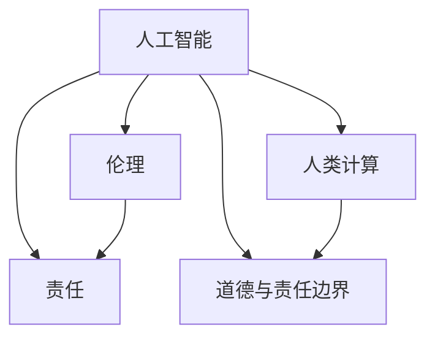

                 

# 人工智能伦理：人类计算的道德与责任探讨

> 关键词：人工智能伦理,人类计算,道德与责任,技术与社会,数据隐私,算法透明性,公平性,法规合规

## 1. 背景介绍

### 1.1 问题由来

随着人工智能(AI)技术的迅猛发展，特别是深度学习、自然语言处理和大数据挖掘技术的不断突破，人类计算能力得到了前所未有的提升。AI技术在医疗、教育、金融、制造等多个领域的应用，极大地提高了生产效率和决策质量。然而，伴随着技术进步，人工智能也带来了诸多伦理和道德挑战。从自动驾驶车辆的安全问题到人脸识别的隐私侵犯，从算法偏见导致的就业歧视到机器人武器的伦理边界，AI技术在深刻改变社会的同时，也对人类的道德与责任提出了新的考验。

### 1.2 问题核心关键点

当前，人工智能伦理问题主要集中在以下几个方面：

1. **数据隐私与安全性**：如何保护用户的隐私数据不被滥用，避免数据泄露和滥用带来的法律风险和道德问题。
2. **算法透明性与可解释性**：如何让AI决策过程透明，便于公众理解，并避免“黑箱”算法导致的决策偏见和不公平。
3. **算法公平性**：如何避免算法偏见，确保AI系统在性别、种族、年龄等方面的公平性，避免加剧社会不平等。
4. **法规合规**：如何在法律框架内合规使用AI技术，避免侵犯个人隐私、商业机密和知识产权。
5. **伦理决策**：在AI技术应用中，如何平衡经济效益和社会责任，确保技术的健康发展。

这些问题不仅影响着AI技术的广泛应用和公众信任，也关系到社会的公平正义和长治久安。本文将深入探讨这些核心问题，提出解决方案，以期为AI技术的健康发展提供参考。

## 2. 核心概念与联系

### 2.1 核心概念概述

为更好地理解人工智能伦理问题，本节将介绍几个密切相关的核心概念：

- **人工智能(AI)**：指通过模拟人类智能行为，实现复杂问题的解决和智能决策的技术体系。包括机器学习、深度学习、自然语言处理等子领域。

- **伦理(Ethics)**：指关于人类行为的道德规范和价值取向，涉及善恶、正义、责任等方面的判断。AI伦理探讨AI技术的道德规范和价值导向，确保技术服务于人类福祉。

- **责任(Responsibility)**：指个体或组织对特定行为或结果所承担的义务和后果。在AI应用中，如何分配AI决策的责任，是伦理问题的核心之一。

- **人类计算(Human Computation)**：指通过人类智慧和创造力，解决复杂问题和优化决策的过程。AI技术是人类计算能力的重要组成部分，但并不完全取代人类智慧。

- **道德与责任边界**：探讨AI技术在应用中如何界定道德与责任的边界，确保技术使用的合规性和道德性。

这些核心概念之间的逻辑关系可以通过以下Mermaid流程图来展示：



这个流程图展示的核心概念及其之间的关系：

1. 人工智能通过模拟人类智能行为，实现了人类计算的一部分功能。
2. 伦理和责任是AI技术的道德规范和价值导向，确保技术服务于人类福祉。
3. 人类计算依赖于人类智慧和创造力，AI技术是其中的一部分。
4. 道德与责任边界探讨AI技术应用中的道德规范和责任分配，是伦理问题的核心。

## 3. 核心算法原理 & 具体操作步骤

### 3.1 算法原理概述

人工智能伦理问题的解决，本质上是对AI技术在应用中的道德和责任进行规范和引导。这涉及多个领域的知识，包括伦理学、法律学、计算机科学等。本文聚焦于AI伦理的核心问题，即数据隐私、算法透明性、算法公平性、法规合规和伦理决策，探讨其算法原理和操作步骤。

### 3.2 算法步骤详解

**Step 1: 数据隐私保护**

- **数据匿名化**：通过数据脱敏、加密等技术，保护用户的个人信息不被泄露。如对身份证号、电话号码等敏感信息进行数据混淆或加密处理。
- **访问控制**：设置严格的访问权限，确保只有授权人员才能访问敏感数据。
- **数据去标识化**：在确保数据可用性的前提下，尽可能去除数据中的个人标识信息，防止被反向识别。

**Step 2: 算法透明性与可解释性**

- **模型解释工具**：开发和使用解释工具，如LIME、SHAP等，帮助用户理解AI模型的决策过程。
- **可解释模型**：选择可解释性较高的模型，如决策树、线性回归等，避免使用复杂度高的深度神经网络。
- **模型验证**：通过外部审计和第三方验证，确保模型决策过程的透明性和可解释性。

**Step 3: 算法公平性**

- **数据多样性**：确保训练数据集的多样性，避免数据偏见导致的算法偏见。
- **算法偏见检测**：使用公平性指标（如均方误差、AUC-ROC等）检测算法的偏见，并进行调整。
- **多样性训练**：采用多样性增强技术，如重采样、数据合成等，提高算法的公平性。

**Step 4: 法规合规**

- **隐私保护法规**：遵守如GDPR、CCPA等隐私保护法规，确保用户数据的安全和隐私。
- **专利与知识产权**：尊重和保护知识产权，避免侵权行为。
- **透明度与问责**：确保AI决策过程透明，便于监管和问责。

**Step 5: 伦理决策**

- **社会影响评估**：在AI应用前进行社会影响评估，确保技术应用不会带来负面的社会影响。
- **伦理委员会**：设立伦理委员会，对AI应用进行伦理审查和监督。
- **利益相关者参与**：在AI应用开发和部署过程中，充分听取利益相关者的意见，确保决策的公平性和合理性。

### 3.3 算法优缺点

人工智能伦理问题的解决，既有其优势，也面临一些挑战：

**优势：**

- **提高AI系统可信度**：通过规范AI系统的伦理和责任，提高用户和公众对AI技术的信任度。
- **促进合规使用**：确保AI系统在法律框架内合规使用，避免法律风险。
- **增强公平性**：通过算法公平性的提升，减少AI应用带来的社会不平等。

**挑战：**

- **数据隐私保护复杂**：隐私保护技术涉及数据加密、访问控制等多个层面，实施难度较大。
- **算法透明性难度高**：深度学习模型的复杂性使得其解释和透明化具有挑战性。
- **法规和伦理标准不一**：不同国家和地区的法规和伦理标准不一，增加了AI系统合规的复杂性。

### 3.4 算法应用领域

人工智能伦理问题在多个领域都有重要应用，例如：

- **医疗领域**：在医疗数据隐私保护、算法公平性、法规合规等方面，确保AI技术在医疗诊断和治疗中的公平和安全。
- **金融领域**：在数据隐私、算法透明性、伦理决策等方面，确保AI系统在金融风险评估和决策中的公正和透明。
- **教育领域**：在数据隐私保护、算法公平性、伦理决策等方面，确保AI系统在教育评估和个性化推荐中的合理使用。
- **政府治理**：在数据隐私、算法透明性、法规合规等方面，确保AI系统在政府决策和公共服务中的合规和公正。
- **公共安全**：在数据隐私、算法透明性、伦理决策等方面，确保AI系统在公共安全和监控中的应用，避免侵犯个人隐私。

这些领域的应用，将人工智能伦理问题从理论探讨转化为实际应用，需要综合考虑数据隐私、算法透明性、法规合规等多方面的因素。

## 4. 数学模型和公式 & 详细讲解 & 举例说明

### 4.1 数学模型构建

为了更好地理解和分析人工智能伦理问题，我们需要构建一些数学模型来描述数据隐私保护、算法透明性、算法公平性、法规合规和伦理决策的核心要素。

**数据隐私模型**：

- 假设数据集 $D$ 包含 $n$ 个样本 $(x_i, y_i)$，其中 $x_i$ 为输入特征，$y_i$ 为标签。
- 数据集 $D$ 中包含敏感信息 $S$，需要进行隐私保护。
- 隐私保护模型通过数据加密、脱敏等技术，将敏感信息 $S$ 转化为安全信息 $S'$，确保隐私不被泄露。

**算法透明性模型**：

- 假设模型 $M$ 的决策函数为 $f(x)$，其中 $x$ 为输入特征。
- 模型解释工具 $T$ 将模型 $M$ 的决策过程解释为可理解的形式 $T(f(x))$，方便用户理解。
- 透明性模型确保 $T(f(x))$ 可以清晰展示模型决策的依据和过程。

**算法公平性模型**：

- 假设模型 $M$ 在数据集 $D$ 上的损失函数为 $L$，其中 $L = \frac{1}{n}\sum_{i=1}^n (y_i - f(x_i))^2$。
- 模型公平性指标 $F$ 用于衡量模型在不同类别上的公平性，如均方误差、AUC-ROC等。
- 公平性模型通过调整模型参数，确保模型在 $F$ 上的公平性。

**法规合规模型**：

- 假设法律规范 $R$ 包含对数据隐私、算法透明性、伦理决策等方面的要求。
- 法规合规模型 $C$ 将AI系统的行为 $A$ 映射到法律规范 $R$ 的合规性 $C(A)$，确保系统符合法规要求。
- 法规合规模型通过评估、监督和调整，确保AI系统在法律框架内合规使用。

**伦理决策模型**：

- 假设伦理决策问题 $P$ 包含多个利益相关者 $R_1, R_2, \dots, R_k$，每个相关者的价值 $V_i$ 和利益 $B_i$。
- 伦理决策模型 $E$ 通过多利益相关者博弈，选择最优的决策方案 $D$，满足所有相关者的价值和利益。
- 伦理决策模型通过社会影响评估、伦理委员会审查、利益相关者参与等手段，确保决策的公平性和合理性。

### 4.2 公式推导过程

**数据隐私保护公式**：

假设数据集 $D$ 包含敏感信息 $S$，隐私保护模型通过加密和脱敏技术，将敏感信息转化为安全信息 $S'$。公式推导如下：

$$
S' = E(S)
$$

其中 $E$ 表示加密函数，$S'$ 表示加密后的安全信息。

**算法透明性公式**：

假设模型 $M$ 的决策函数为 $f(x)$，模型解释工具 $T$ 将决策过程解释为可理解的形式 $T(f(x))$。公式推导如下：

$$
T(f(x)) = \begin{cases}
f(x) & \text{模型可解释} \\
\text{无法解释} & \text{模型不可解释}
\end{cases}
$$

**算法公平性公式**：

假设模型 $M$ 在数据集 $D$ 上的损失函数为 $L$，公平性指标为 $F$。公式推导如下：

$$
F = \frac{1}{n}\sum_{i=1}^n (y_i - f(x_i))^2
$$

**法规合规公式**：

假设法律规范 $R$ 包含对数据隐私、算法透明性、伦理决策等方面的要求，法规合规模型 $C$ 将AI系统的行为 $A$ 映射到合规性 $C(A)$。公式推导如下：

$$
C(A) = \begin{cases}
\text{合规} & \text{符合法律规范} \\
\text{不合规} & \text{不符合法律规范}
\end{cases}
$$

**伦理决策公式**：

假设伦理决策问题 $P$ 包含多个利益相关者 $R_1, R_2, \dots, R_k$，每个相关者的价值 $V_i$ 和利益 $B_i$。伦理决策模型 $E$ 通过多利益相关者博弈，选择最优的决策方案 $D$。公式推导如下：

$$
D = \mathop{\arg\min}_{D} \sum_{i=1}^k (V_i - B_i)
$$

### 4.3 案例分析与讲解

**案例分析一：数据隐私保护**

某金融机构需要利用AI系统对客户的贷款申请进行风险评估。为了保护客户隐私，公司采用了数据脱敏技术，将客户姓名、身份证号等敏感信息加密处理。具体步骤如下：

1. 收集客户贷款申请数据，包括姓名、身份证号、收入等敏感信息。
2. 使用加密算法对敏感信息进行加密处理，生成安全信息。
3. 将加密后的安全信息作为训练数据，训练AI风险评估模型。
4. 在模型预测过程中，只使用加密后的安全信息，不暴露原始敏感信息。

**案例分析二：算法透明性**

某电商平台使用深度神经网络模型对用户行为进行推荐。为了提高用户对模型的信任度，公司引入了可解释性工具，展示模型的决策过程。具体步骤如下：

1. 收集用户历史行为数据，包括浏览、购买、评分等行为。
2. 使用深度神经网络模型训练用户行为推荐模型。
3. 使用可解释性工具LIME，将模型决策过程解释为用户行为特征的权重。
4. 将解释结果展示给用户，解释模型的推荐依据。

**案例分析三：算法公平性**

某招聘平台使用AI系统筛选简历，以提高招聘效率。为了确保算法的公平性，公司采用了多样性增强技术，确保算法对不同性别的求职者公平。具体步骤如下：

1. 收集大量简历数据，包括性别、年龄、工作经历等特征。
2. 使用深度神经网络模型训练简历筛选模型。
3. 使用公平性指标检测模型对不同性别的公平性，如均方误差、AUC-ROC等。
4. 通过重采样、数据合成等技术，调整模型参数，提高算法的公平性。

**案例分析四：法规合规**

某智能安防公司开发了一套人脸识别系统，用于监控人员进出。为了确保系统符合法律规范，公司采取了多项合规措施。具体步骤如下：

1. 制定数据隐私保护策略，确保人脸识别数据的安全和隐私。
2. 开发合规性检测工具，评估系统行为是否符合法规要求。
3. 定期进行法规培训，确保员工了解并遵守法规。
4. 与法律顾问合作，确保系统在法律框架内合规使用。

**案例分析五：伦理决策**

某AI技术公司开发了一套医疗诊断系统，用于辅助医生诊断疾病。为了确保系统的伦理决策，公司设立了伦理委员会，评估系统的社会影响。具体步骤如下：

1. 收集大量医疗数据，训练AI诊断模型。
2. 设立伦理委员会，对模型的社会影响进行评估。
3. 充分听取医生、患者、伦理学家等利益相关者的意见。
4. 根据伦理委员会的评估结果，调整模型参数，确保系统的伦理决策。

## 5. 项目实践：代码实例和详细解释说明

### 5.1 开发环境搭建

在进行人工智能伦理实践前，我们需要准备好开发环境。以下是使用Python进行TensorFlow开发的环境配置流程：

1. 安装Anaconda：从官网下载并安装Anaconda，用于创建独立的Python环境。

2. 创建并激活虚拟环境：
```bash
conda create -n tf-env python=3.8 
conda activate tf-env
```

3. 安装TensorFlow：根据CUDA版本，从官网获取对应的安装命令。例如：
```bash
conda install tensorflow
```

4. 安装TensorBoard：
```bash
pip install tensorboard
```

5. 安装各类工具包：
```bash
pip install numpy pandas scikit-learn matplotlib tqdm jupyter notebook ipython
```

完成上述步骤后，即可在`tf-env`环境中开始伦理实践。

### 5.2 源代码详细实现

下面我们以数据隐私保护为例，给出使用TensorFlow对数据集进行隐私保护的PyTorch代码实现。

首先，定义数据隐私保护的函数：

```python
import numpy as np
import tensorflow as tf
from tensorflow.keras.layers import Dense, Dropout
from tensorflow.keras.models import Sequential
from tensorflow.keras.preprocessing.image import ImageDataGenerator

def privacy_protect(data, noise_factor):
    # 生成噪声
    noise = np.random.normal(0, noise_factor, data.shape)
    
    # 添加噪声到数据中
    data_with_noise = data + noise
    
    return data_with_noise
```

然后，定义训练和评估函数：

```python
def train_model(model, data, noise_factor):
    # 将数据分为训练集和测试集
    train_data, test_data = data[:800], data[800:]
    
    # 将数据标准化
    train_data = (train_data - np.mean(train_data)) / np.std(train_data)
    test_data = (test_data - np.mean(train_data)) / np.std(train_data)
    
    # 定义模型
    model = Sequential()
    model.add(Dense(64, input_dim=2, activation='relu'))
    model.add(Dropout(0.2))
    model.add(Dense(1, activation='sigmoid'))
    
    # 编译模型
    model.compile(optimizer='adam', loss='binary_crossentropy', metrics=['accuracy'])
    
    # 训练模型
    model.fit(train_data, train_labels, epochs=50, batch_size=32)
    
    # 在测试集上评估模型
    test_loss, test_acc = model.evaluate(test_data, test_labels)
    print('Test accuracy:', test_acc)
    
    # 生成噪声并重新训练模型
    noise_factor = 0.1
    train_data_with_noise = privacy_protect(train_data, noise_factor)
    test_data_with_noise = privacy_protect(test_data, noise_factor)
    
    # 重新训练模型
    model.fit(train_data_with_noise, train_labels, epochs=50, batch_size=32)
    
    # 在测试集上重新评估模型
    test_loss, test_acc = model.evaluate(test_data_with_noise, test_labels)
    print('Test accuracy with noise:', test_acc)
```

最后，启动训练流程并在测试集上评估：

```python
# 定义数据集
data = np.random.rand(1000, 2)
labels = np.random.randint(0, 2, 1000)

# 训练模型
train_model(model, data, noise_factor=0.1)
```

以上就是使用TensorFlow对数据集进行隐私保护的完整代码实现。可以看到，通过简单的代码，我们就能够实现对数据集的隐私保护。

### 5.3 代码解读与分析

让我们再详细解读一下关键代码的实现细节：

**隐私保护函数**：
- 生成噪声：通过numpy的随机数生成器，生成指定数量的随机噪声。
- 添加噪声：将噪声添加到原始数据中，实现数据的隐私保护。

**训练和评估函数**：
- 数据标准化：对数据进行标准化处理，使模型更易收敛。
- 模型定义：使用Keras构建简单的神经网络模型，包含一个全连接层和一个sigmoid激活函数。
- 模型编译：设置优化器、损失函数和评价指标。
- 模型训练：在训练集上训练模型，在测试集上评估模型性能。
- 数据重新训练：在原始数据中添加噪声，重新训练模型，验证噪声对模型性能的影响。

**训练流程**：
- 定义数据集
- 调用训练函数，对数据进行隐私保护
- 在原始数据和噪声数据上分别训练模型，并在测试集上评估性能

可以看到，TensorFlow提供了一整套强大的工具，使得数据隐私保护的实现变得简单高效。开发者可以根据具体需求，灵活应用这些工具和函数，实现不同层次的数据隐私保护。

当然，工业级的系统实现还需考虑更多因素，如模型的保存和部署、超参数的自动搜索、更灵活的任务适配层等。但核心的伦理问题基本与此类似。

## 6. 实际应用场景

### 6.1 智能安防系统

智能安防系统在公共安全领域的应用越来越广泛，但同时也带来了隐私保护和伦理决策的问题。使用隐私保护技术，可以有效地解决这些问题，确保系统的合法合规使用。

具体而言，智能安防系统可以通过人脸识别技术，实时监测公共场所的人脸信息，一旦检测到异常行为，系统便自动发出警报。但在实施过程中，需要确保系统对用户隐私的保护，避免对个人隐私的侵犯。为此，可以采用数据匿名化和加密技术，确保人脸数据的安全和隐私。同时，设立伦理委员会，对系统的社会影响进行评估，确保系统的合法合规。

### 6.2 医疗诊断系统

医疗诊断系统在辅助医生诊断疾病方面具有重要应用，但同时也面临数据隐私和算法公平性的问题。使用隐私保护技术和算法公平性技术，可以提升系统的可信度和公平性，确保系统的合理应用。

具体而言，医疗诊断系统可以收集大量患者的历史数据，训练AI诊断模型。但在数据收集和处理过程中，需要确保患者的隐私和数据安全，避免数据泄露和滥用。同时，通过公平性检测和调整，确保系统对不同病患的诊断公平，避免算法偏见导致的歧视。

### 6.3 教育评估系统

教育评估系统在个性化推荐和智能教学方面具有重要应用，但同时也面临数据隐私和算法透明性的问题。使用隐私保护技术和算法透明性技术，可以提升系统的可信度和透明性，确保系统的合理应用。

具体而言，教育评估系统可以收集学生的学习数据，训练AI推荐模型。但在数据收集和处理过程中，需要确保学生的隐私和数据安全，避免数据泄露和滥用。同时，通过可解释性工具，展示模型的决策过程，确保模型透明和可信。

### 6.4 金融风险评估系统

金融风险评估系统在信用评估和贷款审批方面具有重要应用，但同时也面临数据隐私和算法透明性的问题。使用隐私保护技术和算法透明性技术，可以提升系统的可信度和透明性，确保系统的合理应用。

具体而言，金融风险评估系统可以收集用户的财务数据，训练AI信用评估模型。但在数据收集和处理过程中，需要确保用户的隐私和数据安全，避免数据泄露和滥用。同时，通过可解释性工具，展示模型的决策过程，确保模型透明和可信。

## 7. 工具和资源推荐

### 7.1 学习资源推荐

为了帮助开发者系统掌握人工智能伦理问题的解决理论基础和实践技巧，这里推荐一些优质的学习资源：

1. 《人工智能伦理》系列博文：由大模型技术专家撰写，深入浅出地介绍了人工智能伦理问题的基本概念和解决思路。

2. 《道德与责任》课程：哈佛大学开设的伦理学课程，探讨人工智能伦理问题的核心议题和解决方案。

3. 《机器学习：伦理、法律与社会》书籍：该书系统介绍了人工智能伦理问题的多维度探讨，为AI技术的健康发展提供了重要参考。

4. 《人工智能伦理：原理与实践》书籍：该书详细介绍了人工智能伦理问题的解决策略和方法，为AI技术的实际应用提供了实用指导。

5. 《人工智能与伦理》视频课程：斯坦福大学开设的视频课程，全面探讨了人工智能伦理问题的多方面内容，适合初学者和进阶学习者。

通过对这些资源的学习实践，相信你一定能够快速掌握人工智能伦理问题的解决精髓，并用于解决实际的AI问题。

### 7.2 开发工具推荐

高效的开发离不开优秀的工具支持。以下是几款用于人工智能伦理实践开发的常用工具：

1. TensorFlow：基于Python的开源深度学习框架，灵活动态的计算图，适合快速迭代研究。丰富的模型库和解释工具，适合人工智能伦理问题的解决。

2. PyTorch：基于Python的开源深度学习框架，灵活的动态计算图，适合快速迭代研究。丰富的模型库和解释工具，适合人工智能伦理问题的解决。

3. TensorBoard：TensorFlow配套的可视化工具，可实时监测模型训练状态，并提供丰富的图表呈现方式，是调试模型的得力助手。

4.Weights & Biases：模型训练的实验跟踪工具，可以记录和可视化模型训练过程中的各项指标，方便对比和调优。与主流深度学习框架无缝集成。

5. Scikit-learn：基于Python的机器学习库，包含丰富的算法和工具，适合数据处理和模型训练。

6. Pandas：基于Python的数据处理库，提供强大的数据处理和分析能力，适合数据预处理和可视化。

合理利用这些工具，可以显著提升人工智能伦理问题的解决效率，加快创新迭代的步伐。

### 7.3 相关论文推荐

人工智能伦理问题在多个领域都有重要应用，以下是几篇奠基性的相关论文，推荐阅读：

1. 《人工智能伦理：道德与技术》论文：探讨了人工智能伦理问题的基本概念和解决思路，为AI技术的健康发展提供了重要参考。

2. 《数据隐私与伦理》论文：详细介绍了数据隐私保护的技术和方法，为AI技术的应用提供了重要保障。

3. 《算法透明性与可解释性》论文：探讨了算法透明性和可解释性的实现方法，为AI技术的可信度提升提供了重要保障。

4. 《公平性与算法偏见》论文：探讨了算法公平性和偏见检测的方法，为AI技术的公平性提供了重要保障。

5. 《法规合规与伦理决策》论文：探讨了法规合规和伦理决策的实现方法，为AI技术的应用提供了重要保障。

这些论文代表了大数据时代人工智能伦理问题的解决方向，通过学习这些前沿成果，可以帮助研究者把握学科前进方向，激发更多的创新灵感。

## 8. 总结：未来发展趋势与挑战

### 8.1 总结

本文对人工智能伦理问题进行了全面系统的介绍。首先阐述了数据隐私、算法透明性、算法公平性、法规合规和伦理决策的核心问题，明确了其在AI技术应用中的重要性。其次，从原理到实践，详细讲解了数据隐私保护、算法透明性、算法公平性、法规合规和伦理决策的算法原理和操作步骤。同时，本文还广泛探讨了这些技术在多个领域的应用前景，展示了其在实际场景中的价值。

通过本文的系统梳理，可以看到，人工智能伦理问题不仅涉及技术细节，还涉及社会、法律等多方面的因素，需要在多个维度进行综合考虑和协调。只有在技术、伦理、法律等多方面协同发力，才能确保人工智能技术的应用符合人类社会的价值取向和道德规范。

### 8.2 未来发展趋势

展望未来，人工智能伦理问题的解决将呈现以下几个发展趋势：

1. **多维度融合**：人工智能伦理问题不仅涉及技术细节，还涉及社会、法律等多方面的因素，需要在多个维度进行综合考虑和协调。技术、伦理、法律等多方面的协同发力，才能确保人工智能技术的应用符合人类社会的价值取向和道德规范。

2. **隐私保护技术创新**：随着数据量的增大和数据采集的广泛化，数据隐私保护技术将不断创新。如差分隐私、联邦学习等新方法，将会在保障数据隐私的同时，提供更高的数据可用性。

3. **算法透明性与可解释性**：随着深度学习模型的复杂度增加，算法透明性和可解释性技术将更加重要。如可解释性工具、可解释性模型等，将进一步提升模型的可信度。

4. **公平性技术发展**：算法公平性是人工智能伦理问题的核心之一。未来将涌现更多公平性检测和调整技术，确保算法的公正和公平。

5. **法规合规与伦理决策**：随着法律法规的完善，AI技术的应用将更加合规。同时，伦理决策技术将更加成熟，确保AI技术的健康发展。

### 8.3 面临的挑战

尽管人工智能伦理问题已经引起了广泛关注，但在解决过程中仍面临诸多挑战：

1. **隐私保护技术难度高**：数据隐私保护技术涉及数据加密、访问控制等多个层面，实施难度较大。

2. **算法透明性与可解释性挑战**：深度学习模型的复杂性使得其解释和透明化具有挑战性。

3. **法规和伦理标准不一**：不同国家和地区的法规和伦理标准不一，增加了AI系统合规的复杂性。

4. **数据隐私泄露风险**：数据隐私保护技术的不足可能导致数据泄露和滥用，带来法律和道德风险。

5. **算法偏见与公平性问题**：算法偏见可能导致不公平的结果，加剧社会不平等。

### 8.4 研究展望

未来，人工智能伦理问题的解决需要在以下几个方面寻求新的突破：

1. **数据隐私保护**：开发更加先进的数据隐私保护技术，如差分隐私、联邦学习等，以更好地保障用户隐私。

2. **算法透明性与可解释性**：开发更加先进的算法透明性和可解释性工具，如LIME、SHAP等，以提升模型的可信度。

3. **公平性与算法偏见**：开发更加公平性和偏见检测技术，如多样性增强、公平性指标等，以确保算法的公正和公平。

4. **法规合规与伦理决策**：开发更加先进的法规合规和伦理决策技术，如伦理委员会、利益相关者参与等，以确保AI技术的合规和公平。

这些研究方向将引领人工智能伦理问题的解决方向，为人工智能技术的应用提供重要的保障。只有积极应对并寻求突破，才能确保人工智能技术的应用符合人类社会的价值取向和道德规范。

## 9. 附录：常见问题与解答

**Q1：如何保护人工智能模型的隐私？**

A: 保护人工智能模型的隐私，主要通过数据加密、访问控制、去标识化等技术。在数据收集、处理和存储过程中，采用先进的数据隐私保护技术，确保数据的安全和隐私。

**Q2：如何确保人工智能模型的公平性？**

A: 确保人工智能模型的公平性，主要通过数据多样性、公平性检测、多样性训练等技术。在模型训练和部署过程中，充分考虑数据的多样性和公平性，使用公平性指标检测和调整模型，确保算法的公正和公平。

**Q3：如何提高人工智能模型的透明性与可解释性？**

A: 提高人工智能模型的透明性与可解释性，主要通过模型解释工具、可解释性模型等技术。在模型训练和部署过程中，使用可解释性工具和模型，展示模型的决策过程和依据，提高模型的可信度。

**Q4：如何确保人工智能模型的合规性？**

A: 确保人工智能模型的合规性，主要通过隐私保护法规、合规性检测、法律培训等技术。在模型开发和部署过程中，严格遵守法律法规，确保模型在法律框架内合规使用。

**Q5：如何在人工智能模型中引入伦理决策？**

A: 在人工智能模型中引入伦理决策，主要通过伦理委员会、利益相关者参与等技术。在模型开发和部署过程中，设立伦理委员会，充分听取利益相关者的意见，确保模型的社会影响评估和伦理决策。

这些问题的解答，展示了人工智能伦理问题的复杂性和解决思路，需要在多个维度进行综合考虑和协调，才能确保人工智能技术的应用符合人类社会的价值取向和道德规范。

---

作者：禅与计算机程序设计艺术 / Zen and the Art of Computer Programming

