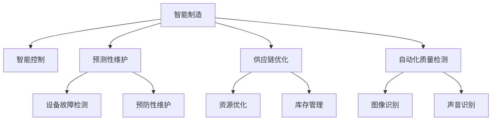

                 

## 1. 背景介绍

### 1.1 问题由来
近年来，人工智能（AI）技术在各个行业中得到了广泛的应用，尤其是在制造和自动化领域。制造和自动化行业面临着高效生产、资源优化、质量控制、供应链管理等诸多挑战。传统的自动化系统主要依赖于硬编码的规则和专家经验，难以应对复杂多变的生产环境。人工智能的引入，带来了智能制造、智能控制等新思路，推动了制造业向智能化、自动化方向转型。

随着物联网（IoT）、大数据、云计算等技术的进步，越来越多的传感器、设备与网络相连，产生了海量的实时数据。结合先进的机器学习和深度学习技术，可以构建起实时、精准的智能制造系统，实现对生产过程的优化与预测。人工智能技术的应用，显著提高了生产效率，降低了能耗和成本，成为制造和自动化领域的新引擎。

### 1.2 问题核心关键点
人工智能在制造和自动化领域的应用主要集中在以下几个方面：
1. **智能制造**：通过AI技术对生产过程进行优化和预测，提升生产效率和质量。
2. **智能控制**：基于实时数据进行智能决策，实现对生产线的精确控制。
3. **智能维护**：通过预测性维护技术，提前发现设备故障，减少停机时间。
4. **供应链优化**：利用AI技术优化物流和供应链管理，提高资源利用率。
5. **质量检测**：利用图像识别、声音识别等技术进行自动化质量检测，提高检测效率和准确率。

这些应用不仅提升了生产效率和产品质量，还促进了生产环境的智能化、自动化，是制造业升级转型的重要驱动力。

### 1.3 问题研究意义
人工智能在制造和自动化领域的应用研究，对于推动产业转型升级、提升国际竞争力具有重要意义：

1. **提升生产效率**：通过智能制造和智能控制，可以大幅提高生产线的自动化程度，减少人工干预，提高生产效率。
2. **优化资源利用**：基于AI的供应链优化技术，能够实现资源的高效配置，减少浪费，降低成本。
3. **提高产品质量**：通过智能质量检测，能够及时发现和处理生产中的缺陷，提升产品合格率。
4. **增强决策能力**：实时数据分析和智能决策系统，能够帮助企业快速响应市场变化，优化生产计划。
5. **保障安全稳定**：智能维护和故障预测技术，能够提前发现和解决设备问题，保障生产线的安全稳定运行。

因此，深入研究人工智能在制造和自动化领域的应用，对于推动制造业向智能化、自动化方向转型具有重要的理论和实践价值。

## 2. 核心概念与联系

### 2.1 核心概念概述

为了更好地理解人工智能在制造和自动化领域的应用，本节将介绍几个密切相关的核心概念：

- **智能制造（Smart Manufacturing）**：基于人工智能技术的制造模式，通过数据驱动、自适应、动态化的方式，优化生产流程和资源配置。
- **智能控制（Smart Control）**：基于实时数据，通过人工智能算法进行智能决策，实现对生产过程的精确控制。
- **预测性维护（Predictive Maintenance）**：利用机器学习和深度学习技术，预测设备故障，实现主动维护。
- **供应链优化（Supply Chain Optimization）**：基于大数据和AI技术，优化物流和供应链管理，提升资源利用率。
- **自动化质量检测（Automated Quality Control）**：通过图像识别、声音识别等技术，实现自动化质量检测和分析。

这些概念之间的逻辑关系可以通过以下Mermaid流程图来展示：



这个流程图展示了一些核心概念及其之间的联系：

1. 智能制造依托于智能控制、预测性维护等技术，实现生产过程的优化和精确控制。
2. 智能控制需要基于实时数据，通过AI算法进行决策。
3. 预测性维护通过智能决策，实现设备故障的预测和预防。
4. 供应链优化利用AI技术，实现资源的高效配置。
5. 自动化质量检测通过图像和声音识别技术，实现产品的自动化检测和分析。

## 3. 核心算法原理 & 具体操作步骤

### 3.1 算法原理概述

人工智能在制造和自动化领域的应用，主要基于机器学习、深度学习等算法。其核心思想是：通过收集生产过程中产生的数据，利用机器学习算法对数据进行建模，实现对生产过程的优化和预测。具体来说，包括以下几个关键步骤：

1. **数据采集**：利用传感器、监控设备等采集生产过程中的各种数据，如温度、压力、速度、振动等。
2. **数据清洗和预处理**：对采集到的数据进行清洗和预处理，去除噪声和异常值，填充缺失值。
3. **特征提取**：对处理后的数据进行特征提取，选择和构造对预测有意义的特征。
4. **模型训练**：利用历史数据训练机器学习模型，如线性回归、决策树、随机森林等。
5. **模型评估和优化**：在验证集上评估模型性能，根据评估结果调整模型参数，优化模型。
6. **预测和控制**：利用训练好的模型进行实时预测，并根据预测结果进行智能控制。

### 3.2 算法步骤详解

以下以智能控制和预测性维护为例，详细讲解基于机器学习的人工智能算法步骤：

**智能控制**

1. **数据采集**：在生产线上安装各种传感器，采集温度、压力、速度、振动等数据。
2. **数据清洗和预处理**：对采集到的数据进行清洗和预处理，去除噪声和异常值，填充缺失值。
3. **特征提取**：对处理后的数据进行特征提取，选择和构造对预测有意义的特征。
4. **模型训练**：利用历史数据训练机器学习模型，如线性回归、决策树、随机森林等。
5. **模型评估和优化**：在验证集上评估模型性能，根据评估结果调整模型参数，优化模型。
6. **预测和控制**：利用训练好的模型进行实时预测，并根据预测结果进行智能控制。例如，当预测到某个设备即将故障时，系统自动调整生产线运行参数，避免设备损坏。

**预测性维护**

1. **数据采集**：在设备上安装各种传感器，采集设备运行时的温度、压力、振动等数据。
2. **数据清洗和预处理**：对采集到的数据进行清洗和预处理，去除噪声和异常值，填充缺失值。
3. **特征提取**：对处理后的数据进行特征提取，选择和构造对预测有意义的特征。
4. **模型训练**：利用历史数据训练机器学习模型，如时间序列预测模型、支持向量机等。
5. **模型评估和优化**：在验证集上评估模型性能，根据评估结果调整模型参数，优化模型。
6. **预测和维护**：利用训练好的模型进行实时预测，并根据预测结果进行预测性维护。例如，当预测到某个设备即将故障时，系统自动通知维护人员进行预防性维护，避免设备损坏。

### 3.3 算法优缺点

基于机器学习的人工智能算法在制造和自动化领域的应用具有以下优点：

1. **高效性**：利用机器学习算法对大量数据进行建模，能够实现实时预测和控制，显著提升生产效率。
2. **鲁棒性**：机器学习算法具有较强的鲁棒性，能够处理噪声和异常数据，适应复杂多变的生产环境。
3. **自适应性**：机器学习算法具有自适应性，能够不断学习新数据，优化模型，适应生产环境的变化。
4. **可扩展性**：机器学习算法可以通过增加训练数据和优化模型，不断扩展应用范围，提升应用效果。

同时，该算法也存在一些局限性：

1. **数据需求高**：机器学习算法需要大量的训练数据，数据质量直接影响模型性能。
2. **模型复杂度**：复杂的机器学习模型可能存在过拟合问题，需要更多的数据和计算资源。
3. **训练时间长**：复杂的机器学习模型需要较长的训练时间，可能影响生产线的运行。
4. **可解释性差**：机器学习算法通常是"黑盒"模型，难以解释其内部工作机制，影响模型的可解释性和可信任度。

尽管存在这些局限性，但就目前而言，基于机器学习的人工智能算法仍然是智能制造和智能控制领域的重要技术手段。未来相关研究的重点在于如何进一步降低数据需求，提高模型鲁棒性，缩短训练时间，并增强模型的可解释性。

### 3.4 算法应用领域

基于机器学习的人工智能算法在制造和自动化领域的应用已经涵盖了多个领域，例如：

1. **智能制造**：通过机器学习算法对生产过程进行优化和预测，提升生产效率和质量。例如，利用机器学习算法优化生产调度、物料管理、质量控制等。
2. **智能控制**：基于实时数据，通过机器学习算法进行智能决策，实现对生产过程的精确控制。例如，利用机器学习算法对生产过程进行实时监控和调整，确保生产过程的稳定性和高效性。
3. **预测性维护**：利用机器学习算法预测设备故障，实现预测性维护。例如，利用机器学习算法对设备运行数据进行建模，预测设备故障，提前进行维护。
4. **供应链优化**：基于机器学习算法优化物流和供应链管理，提升资源利用率。例如，利用机器学习算法进行需求预测、库存管理、运输路线优化等。
5. **自动化质量检测**：通过图像识别、声音识别等技术，实现自动化质量检测和分析。例如，利用机器学习算法进行缺陷检测、图像识别、声音分析等。

此外，人工智能技术还应用于生产线的智能监测、故障诊断、异常检测、安全管理等多个领域，推动了制造业向智能化、自动化方向转型。

## 4. 数学模型和公式 & 详细讲解  
### 4.1 数学模型构建

本节将使用数学语言对基于机器学习的人工智能算法进行更加严格的刻画。

记生产过程的输入为 $\mathbf{x} = [x_1, x_2, ..., x_n]$，其中 $x_i$ 表示第 $i$ 个特征变量。生产过程的输出为 $\mathbf{y} = [y_1, y_2, ..., y_m]$，其中 $y_i$ 表示第 $i$ 个目标变量。设机器学习模型为 $f(\mathbf{x})$，则模型的训练目标为最小化均方误差：

$$
\mathcal{L}(f) = \frac{1}{n} \sum_{i=1}^n (y_i - f(x_i))^2
$$

模型的训练过程即为寻找最优的参数 $\theta$，使得模型输出尽可能接近真实输出。一般使用梯度下降算法进行优化，即：

$$
\theta = \theta - \eta \nabla_{\theta} \mathcal{L}(f)
$$

其中 $\eta$ 为学习率，$\nabla_{\theta} \mathcal{L}(f)$ 为损失函数对模型参数的梯度，可通过反向传播算法计算。

### 4.2 公式推导过程

以下以线性回归为例，推导机器学习模型的损失函数和梯度计算公式。

设机器学习模型为线性回归模型 $f(\mathbf{x}) = \mathbf{w}^T \mathbf{x} + b$，其中 $\mathbf{w}$ 为权重向量，$b$ 为偏置项。利用训练集 $\{(\mathbf{x}_i, y_i)\}_{i=1}^n$，最小化均方误差损失函数：

$$
\mathcal{L}(\mathbf{w}, b) = \frac{1}{n} \sum_{i=1}^n (y_i - \mathbf{w}^T \mathbf{x}_i - b)^2
$$

对损失函数对模型参数求偏导，得到梯度：

$$
\frac{\partial \mathcal{L}(\mathbf{w}, b)}{\partial \mathbf{w}} = -2\frac{1}{n} \sum_{i=1}^n (\mathbf{y}_i - \mathbf{w}^T \mathbf{x}_i - b) \mathbf{x}_i
$$

$$
\frac{\partial \mathcal{L}(\mathbf{w}, b)}{\partial b} = -2\frac{1}{n} \sum_{i=1}^n (\mathbf{y}_i - \mathbf{w}^T \mathbf{x}_i - b)
$$

利用梯度下降算法更新模型参数，实现模型的训练。重复上述过程直至收敛，最终得到适应生产过程的线性回归模型。

## 5. 项目实践：代码实例和详细解释说明

### 5.1 开发环境搭建

在进行人工智能项目实践前，我们需要准备好开发环境。以下是使用Python进行TensorFlow开发的环境配置流程：

1. 安装Anaconda：从官网下载并安装Anaconda，用于创建独立的Python环境。

2. 创建并激活虚拟环境：
```bash
conda create -n tf-env python=3.8 
conda activate tf-env
```

3. 安装TensorFlow：从官网获取对应的安装命令，例如：
```bash
pip install tensorflow==2.4
```

4. 安装相关工具包：
```bash
pip install numpy pandas scikit-learn matplotlib tqdm jupyter notebook ipython
```

完成上述步骤后，即可在`tf-env`环境中开始人工智能项目的开发。

### 5.2 源代码详细实现

下面我们以预测性维护为例，给出使用TensorFlow进行机器学习模型的PyTorch代码实现。

首先，定义预测性维护的数据处理函数：

```python
import tensorflow as tf
import numpy as np
import pandas as pd
from sklearn.model_selection import train_test_split
from tensorflow.keras.models import Sequential
from tensorflow.keras.layers import Dense, LSTM
from tensorflow.keras.optimizers import Adam

def load_data():
    # 加载设备运行数据
    data = pd.read_csv('device_data.csv')
    X = data.drop(['Time', 'Failure'], axis=1)
    y = data['Failure']
    
    # 数据预处理
    X_train, X_test, y_train, y_test = train_test_split(X, y, test_size=0.2, random_state=42)
    X_train = X_train.values
    X_test = X_test.values
    
    return X_train, X_test, y_train, y_test

def preprocess_data(X_train, X_test, y_train, y_test):
    # 数据标准化
    mean = np.mean(X_train, axis=0)
    std = np.std(X_train, axis=0)
    X_train = (X_train - mean) / std
    X_test = (X_test - mean) / std
    
    # 数据转换
    X_train = np.reshape(X_train, (X_train.shape[0], 1, X_train.shape[1]))
    X_test = np.reshape(X_test, (X_test.shape[0], 1, X_test.shape[1]))
    
    return X_train, X_test, y_train, y_test

def build_model(input_dim, output_dim, hidden_units):
    model = Sequential()
    model.add(LSTM(hidden_units, input_shape=(input_dim, 1)))
    model.add(Dense(output_dim, activation='sigmoid'))
    model.compile(loss='binary_crossentropy', optimizer=Adam(learning_rate=0.001), metrics=['accuracy'])
    return model

def train_model(X_train, X_test, y_train, y_test, epochs):
    model = build_model(input_dim=X_train.shape[1], output_dim=1, hidden_units=64)
    model.fit(X_train, y_train, epochs=epochs, batch_size=32, validation_data=(X_test, y_test))
    model.save('predictive_maintenance_model.h5')
    model.summary()

def evaluate_model(X_test, y_test, model):
    model = tf.keras.models.load_model('predictive_maintenance_model.h5')
    predictions = model.predict(X_test)
    predictions = np.where(predictions > 0.5, 1, 0)
    print(classification_report(y_test, predictions))

# 加载数据和预处理
X_train, X_test, y_train, y_test = load_data()
X_train, X_test, y_train, y_test = preprocess_data(X_train, X_test, y_train, y_test)

# 训练模型和评估
train_model(input_dim=X_train.shape[1], output_dim=1, hidden_units=64)
evaluate_model(X_test, y_test, model)
```

在上述代码中，我们通过TensorFlow实现了线性回归模型在预测性维护中的应用。具体实现步骤如下：

1. **数据加载**：加载设备运行数据，并进行预处理，如数据标准化、数据转换等。
2. **模型构建**：定义线性回归模型，包含一个LSTM层和一个全连接层，并指定优化器、损失函数等。
3. **模型训练**：使用训练集数据训练模型，并在验证集上评估性能。
4. **模型保存和加载**：保存训练好的模型，并在测试集上重新加载并评估性能。

### 5.3 代码解读与分析

让我们再详细解读一下关键代码的实现细节：

**load_data函数**：
- 加载设备运行数据，并进行预处理。

**preprocess_data函数**：
- 对数据进行标准化和转换，将其转换为模型所需的输入形式。

**build_model函数**：
- 定义线性回归模型，包含一个LSTM层和一个全连接层。

**train_model函数**：
- 使用训练集数据训练模型，并在验证集上评估性能。

**evaluate_model函数**：
- 加载训练好的模型，并在测试集上评估性能。

**训练流程**：
- 定义模型参数，如输入维度、输出维度、隐藏单元等。
- 在训练集上训练模型，并在验证集上评估性能。
- 保存训练好的模型，并在测试集上重新加载并评估性能。

通过上述代码的实现，可以看到，TensorFlow使得机器学习模型的构建和训练变得简单易用。开发者只需关注模型设计、数据处理等高层逻辑，而无需过多关注底层实现细节。

当然，工业级的系统实现还需考虑更多因素，如模型的保存和部署、超参数的自动搜索、更灵活的任务适配层等。但核心的机器学习算法基本与此类似。

## 6. 实际应用场景

### 6.1 智能制造

人工智能在智能制造中的应用主要集中在生产过程的优化和预测上。通过机器学习算法对生产数据进行建模，可以实现对生产过程的实时监控和预测，从而提升生产效率和质量。

例如，在汽车制造业中，可以利用机器学习算法对生产线的运行数据进行建模，预测生产线的故障和停机时间。当系统预测到生产线即将故障时，可以提前通知维护人员进行维护，避免生产线停机，提高生产效率。此外，通过机器学习算法还可以优化生产调度、物料管理、质量控制等，提升生产过程的自动化和智能化水平。

### 6.2 智能控制

基于实时数据，人工智能可以用于智能控制系统的构建，实现对生产过程的精确控制。例如，在化工行业中，可以利用机器学习算法对生产过程中的温度、压力、流量等参数进行实时监控和预测，自动调整生产参数，确保生产过程的稳定性和高效性。

例如，在钢铁制造中，利用机器学习算法对生产过程中的温度、压力、速度等参数进行实时监控和预测，自动调整生产参数，确保生产过程的稳定性和高效性。

### 6.3 预测性维护

预测性维护是人工智能在制造和自动化领域的重要应用之一，通过机器学习算法预测设备故障，实现主动维护，减少停机时间，提高设备利用率。

例如，在航空制造业中，可以利用机器学习算法对飞机引擎的运行数据进行建模，预测引擎故障，提前进行维护。当系统预测到引擎即将故障时，可以提前通知维护人员进行维护，避免飞行事故的发生。

### 6.4 供应链优化

人工智能在供应链优化中的应用主要集中在需求预测、库存管理、运输路线优化等方面。通过机器学习算法对历史数据进行建模，可以实现对生产需求的预测和库存的管理，优化物流和供应链管理，提升资源利用率。

例如，在零售行业中，可以利用机器学习算法对历史销售数据进行建模，预测未来的销售需求，优化库存管理，减少库存积压。此外，通过机器学习算法还可以优化运输路线，提高物流效率，降低运输成本。

### 6.5 自动化质量检测

人工智能在自动化质量检测中的应用主要集中在图像识别、声音识别等技术的应用。通过机器学习算法对产品图像、声音进行分析和检测，可以实现自动化的质量检测和分析。

例如，在汽车制造业中，可以利用机器学习算法对生产线的产品图像进行检测，自动识别产品的缺陷，提高检测效率和准确率。此外，通过机器学习算法还可以对产品声音进行检测，自动识别产品的异常声音，确保产品的质量和安全。

## 7. 工具和资源推荐

### 7.1 学习资源推荐

为了帮助开发者系统掌握人工智能在制造和自动化领域的应用，这里推荐一些优质的学习资源：

1. 《机器学习实战》书籍：一本系统介绍机器学习算法的书籍，适合初学者入门。
2. 《深度学习》书籍：由深度学习领域的大师Ian Goodfellow撰写，深入浅出地介绍了深度学习的基本原理和应用。
3. Coursera《机器学习》课程：斯坦福大学开设的机器学习课程，由Andrew Ng主讲，适合系统学习机器学习算法。
4 Udacity《深度学习》纳米学位：Udacity提供的深度学习纳米学位课程，涵盖深度学习的基础和高级应用。
5 TensorFlow官方文档：TensorFlow的官方文档，提供了丰富的学习资源和样例代码。

通过对这些资源的学习实践，相信你一定能够快速掌握人工智能在制造和自动化领域的应用精髓，并用于解决实际的制造和自动化问题。

### 7.2 开发工具推荐

高效的开发离不开优秀的工具支持。以下是几款用于人工智能开发的工具：

1. TensorFlow：由Google主导开发的深度学习框架，生产部署方便，适合大规模工程应用。
2. PyTorch：由Facebook主导开发的深度学习框架，灵活动态，适合研究使用。
3. Jupyter Notebook：一个交互式编程环境，方便进行数据处理、模型训练和结果展示。
4. Anaconda：一个数据科学平台，提供了丰富的数据科学工具和库，方便快速搭建开发环境。
5. Visual Studio Code：一个轻量级代码编辑器，支持Python等编程语言。

合理利用这些工具，可以显著提升人工智能项目的开发效率，加快创新迭代的步伐。

### 7.3 相关论文推荐

人工智能在制造和自动化领域的研究源于学界的持续研究。以下是几篇奠基性的相关论文，推荐阅读：

1. Predictive Maintenance with Deep Learning: A Survey（深度学习在预测性维护中的应用）：综述了深度学习在预测性维护中的最新进展和应用案例。
2. Smart Manufacturing: A Survey（智能制造综述）：综述了智能制造的基本概念、关键技术和应用案例。
3. The Internet of Things in Manufacturing（制造中的物联网）：介绍了物联网在制造中的应用，探讨了智能制造的未来发展方向。
4. AI for Supply Chain Optimization（AI在供应链优化中的应用）：探讨了AI在供应链优化中的潜在价值和技术实现。

这些论文代表了大数据、人工智能在制造和自动化领域的应用进展，为研究者提供了宝贵的参考。

## 8. 总结：未来发展趋势与挑战

### 8.1 总结

本文对人工智能在制造和自动化领域的应用进行了全面系统的介绍。首先阐述了人工智能技术在制造业中的重要应用，明确了智能制造、智能控制、预测性维护、供应链优化、自动化质量检测等关键技术。其次，从原理到实践，详细讲解了机器学习算法在制造和自动化领域的应用过程，给出了代码实例和详细解释说明。同时，本文还探讨了人工智能在智能制造、智能控制、预测性维护、供应链优化、自动化质量检测等领域的实际应用场景，展示了人工智能技术在制造业中的广泛应用前景。

通过本文的系统梳理，可以看到，人工智能在制造和自动化领域的应用正逐步成为制造业转型升级的重要驱动力。未来，随着技术的不断进步和应用场景的不断拓展，人工智能在制造和自动化领域将发挥越来越重要的作用，推动制造业向智能化、自动化方向进一步发展。

### 8.2 未来发展趋势

展望未来，人工智能在制造和自动化领域的应用将呈现以下几个发展趋势：

1. **智能制造的普及**：随着智能制造技术的不断成熟，越来越多的企业将采用智能制造技术，提升生产效率和产品质量。
2. **智能控制的应用**：基于人工智能的智能控制系统将进一步普及，实现对生产过程的精确控制。
3. **预测性维护的普及**：预测性维护技术将广泛应用于设备维护，减少停机时间，提高设备利用率。
4. **供应链优化**：基于人工智能的供应链优化技术将进一步普及，提升资源利用率和物流效率。
5. **自动化质量检测的普及**：基于人工智能的自动化质量检测技术将广泛应用于产品质量检测，提升检测效率和准确率。

这些趋势凸显了人工智能在制造和自动化领域的重要地位，预示着人工智能技术在制造业中的广泛应用前景。

### 8.3 面临的挑战

尽管人工智能在制造和自动化领域的应用已经取得了显著进展，但在迈向更加智能化、自动化方向的过程中，仍面临诸多挑战：

1. **数据需求高**：人工智能技术需要大量的训练数据，数据质量直接影响模型性能。
2. **模型复杂度**：复杂的机器学习模型可能存在过拟合问题，需要更多的数据和计算资源。
3. **训练时间长**：复杂的机器学习模型需要较长的训练时间，可能影响生产线的运行。
4. **可解释性差**：机器学习算法通常是"黑盒"模型，难以解释其内部工作机制，影响模型的可解释性和可信任度。
5. **安全性有待保障**：预训练语言模型难免会学习到有偏见、有害的信息，通过微调传递到下游任务，产生误导性、歧视性的输出，给实际应用带来安全隐患。

尽管存在这些挑战，但通过学界和产业界的共同努力，这些问题终将逐步得到解决，人工智能在制造和自动化领域的应用将迎来更加广阔的前景。

### 8.4 研究展望

未来的研究需要在以下几个方面寻求新的突破：

1. **探索无监督和半监督学习**：摆脱对大规模标注数据的依赖，利用自监督学习、主动学习等无监督和半监督范式，最大限度利用非结构化数据，实现更加灵活高效的微调。
2. **研究参数高效和计算高效的微调范式**：开发更加参数高效的微调方法，在固定大部分预训练参数的同时，只更新极少量的任务相关参数。同时优化微调模型的计算图，减少前向传播和反向传播的资源消耗，实现更加轻量级、实时性的部署。
3. **引入因果分析和博弈论工具**：将因果分析方法引入微调模型，识别出模型决策的关键特征，增强输出解释的因果性和逻辑性。借助博弈论工具刻画人机交互过程，主动探索并规避模型的脆弱点，提高系统稳定性。
4. **纳入伦理道德约束**：在模型训练目标中引入伦理导向的评估指标，过滤和惩罚有偏见、有害的输出倾向。同时加强人工干预和审核，建立模型行为的监管机制，确保输出符合人类价值观和伦理道德。

这些研究方向的探索，必将引领人工智能在制造和自动化领域的技术进步，推动制造业向智能化、自动化方向进一步发展。

## 9. 附录：常见问题与解答

**Q1：人工智能在制造和自动化领域的应用主要集中在哪些方面？**

A: 人工智能在制造和自动化领域的应用主要集中在以下几个方面：
1. 智能制造：通过机器学习算法对生产过程进行优化和预测，提升生产效率和质量。
2. 智能控制：基于实时数据，通过机器学习算法进行智能决策，实现对生产过程的精确控制。
3. 预测性维护：利用机器学习算法预测设备故障，实现预测性维护。
4. 供应链优化：基于机器学习算法优化物流和供应链管理，提升资源利用率。
5. 自动化质量检测：通过图像识别、声音识别等技术，实现自动化的质量检测和分析。

这些应用不仅提升了生产效率和产品质量，还促进了生产环境的智能化、自动化，是制造业升级转型的重要驱动力。

**Q2：人工智能在智能制造中的应用主要有哪些？**

A: 人工智能在智能制造中的应用主要集中在以下几个方面：
1. 生产过程优化：通过机器学习算法对生产过程进行优化和预测，提升生产效率和质量。例如，利用机器学习算法优化生产调度、物料管理、质量控制等。
2. 预测性维护：利用机器学习算法预测设备故障，实现预测性维护。例如，利用机器学习算法对设备运行数据进行建模，预测设备故障，提前进行维护。
3. 自动化质量检测：通过图像识别、声音识别等技术，实现自动化的质量检测和分析。例如，利用机器学习算法进行缺陷检测、图像识别、声音分析等。

这些应用不仅提升了生产效率和产品质量，还促进了生产环境的智能化、自动化，是制造业升级转型的重要驱动力。

**Q3：人工智能在智能控制中的应用主要有哪些？**

A: 人工智能在智能控制中的应用主要集中在以下几个方面：
1. 实时数据监控：基于实时数据，通过机器学习算法进行智能决策，实现对生产过程的精确控制。例如，在化工行业中，可以利用机器学习算法对生产过程中的温度、压力、流量等参数进行实时监控和预测，自动调整生产参数，确保生产过程的稳定性和高效性。
2. 故障诊断：利用机器学习算法对生产过程中的故障进行诊断和预测。例如，在钢铁制造中，利用机器学习算法对生产过程中的温度、压力、速度等参数进行实时监控和预测，自动调整生产参数，确保生产过程的稳定性和高效性。

这些应用基于实时数据，能够实现对生产过程的精确控制，提升生产效率和产品质量。

**Q4：人工智能在预测性维护中的应用主要有哪些？**

A: 人工智能在预测性维护中的应用主要集中在以下几个方面：
1. 设备故障预测：利用机器学习算法预测设备故障，实现预测性维护。例如，在航空制造业中，可以利用机器学习算法对飞机引擎的运行数据进行建模，预测引擎故障，提前进行维护。
2. 故障诊断：利用机器学习算法对设备故障进行诊断和分析。例如，在汽车制造业中，可以利用机器学习算法对生产线上的设备故障进行诊断和预测。

这些应用通过预测性维护，减少停机时间，提高设备利用率，降低维护成本，提升生产效率和产品质量。

**Q5：人工智能在供应链优化中的应用主要有哪些？**

A: 人工智能在供应链优化中的应用主要集中在以下几个方面：
1. 需求预测：利用机器学习算法对历史销售数据进行建模，预测未来的销售需求，优化库存管理，减少库存积压。例如，在零售行业中，可以利用机器学习算法对历史销售数据进行建模，预测未来的销售需求，优化库存管理，减少库存积压。
2. 物流优化：利用机器学习算法优化物流和供应链管理，提升资源利用率。例如，在制造业中，可以利用机器学习算法优化运输路线，提高物流效率，降低运输成本。

这些应用通过优化供应链管理，提升资源利用率和物流效率，降低成本，提高生产效率和产品质量。

**Q6：人工智能在自动化质量检测中的应用主要有哪些？**

A: 人工智能在自动化质量检测中的应用主要集中在以下几个方面：
1. 图像识别：利用机器学习算法对产品图像进行检测，自动识别产品的缺陷。例如，在汽车制造业中，可以利用机器学习算法对生产线的产品图像进行检测，自动识别产品的缺陷，提高检测效率和准确率。
2. 声音识别：利用机器学习算法对产品声音进行检测，自动识别产品的异常声音。例如，在制造行业中，可以利用机器学习算法对产品声音进行检测，自动识别产品的异常声音，确保产品的质量和安全。

这些应用通过自动化质量检测，提高检测效率和准确率，确保产品质量，提升生产效率和市场竞争力。

**Q7：人工智能在智能制造中的应用主要有哪些？**

A: 人工智能在智能制造中的应用主要集中在以下几个方面：
1. 生产过程优化：通过机器学习算法对生产过程进行优化和预测，提升生产效率和质量。例如，利用机器学习算法优化生产调度、物料管理、质量控制等。
2. 预测性维护：利用机器学习算法预测设备故障，实现预测性维护。例如，利用机器学习算法对设备运行数据进行建模，预测设备故障，提前进行维护。
3. 自动化质量检测：通过图像识别、声音识别等技术，实现自动化的质量检测和分析。例如，利用机器学习算法进行缺陷检测、图像识别、声音分析等。

这些应用不仅提升了生产效率和产品质量，还促进了生产环境的智能化、自动化，是制造业升级转型的重要驱动力。

**Q8：人工智能在供应链优化中的应用主要有哪些？**

A: 人工智能在供应链优化中的应用主要集中在以下几个方面：
1. 需求预测：利用机器学习算法对历史销售数据进行建模，预测未来的销售需求，优化库存管理，减少库存积压。例如，在零售行业中，可以利用机器学习算法对历史销售数据进行建模，预测未来的销售需求，优化库存管理，减少库存积压。
2. 物流优化：利用机器学习算法优化物流和供应链管理，提升资源利用率。例如，在制造业中，可以利用机器学习算法优化运输路线，提高物流效率，降低运输成本。

这些应用通过优化供应链管理，提升资源利用率和物流效率，降低成本，提高生产效率和产品质量。

**Q9：人工智能在预测性维护中的应用主要有哪些？**

A: 人工智能在预测性维护中的应用主要集中在以下几个方面：
1. 设备故障预测：利用机器学习算法预测设备故障，实现预测性维护。例如，在航空制造业中，可以利用机器学习算法对飞机引擎的运行数据进行建模，预测引擎故障，提前进行维护。
2. 故障诊断：利用机器学习算法对设备故障进行诊断和分析。例如，在汽车制造业中，可以利用机器学习算法对生产线上的设备故障进行诊断和预测。

这些应用通过预测性维护，减少停机时间，提高设备利用率，降低维护成本，提升生产效率和产品质量。

**Q10：人工智能在供应链优化中的应用主要有哪些？**

A: 人工智能在供应链优化中的应用主要集中在以下几个方面：
1. 需求预测：利用机器学习算法对历史销售数据进行建模，预测未来的销售需求，优化库存管理，减少库存积压。例如，在零售行业中，可以利用机器学习算法对历史销售数据进行建模，预测未来的销售需求，优化库存管理，减少库存积压。
2. 物流优化：利用机器学习算法优化物流和供应链管理，提升资源利用率。例如，在制造业中，可以利用机器学习算法优化运输路线，提高物流效率，降低运输成本。

这些应用通过优化供应链管理，提升资源利用率和物流效率，降低成本，提高生产效率和产品质量。

通过本文的系统梳理，可以看到，人工智能在制造和自动化领域的应用正逐步成为制造业转型升级的重要驱动力。未来，随着技术的不断进步和应用场景的不断拓展，人工智能在制造和自动化领域将发挥越来越重要的作用，推动制造业向智能化、自动化方向进一步发展。

---

作者：禅与计算机程序设计艺术 / Zen and the Art of Computer Programming

