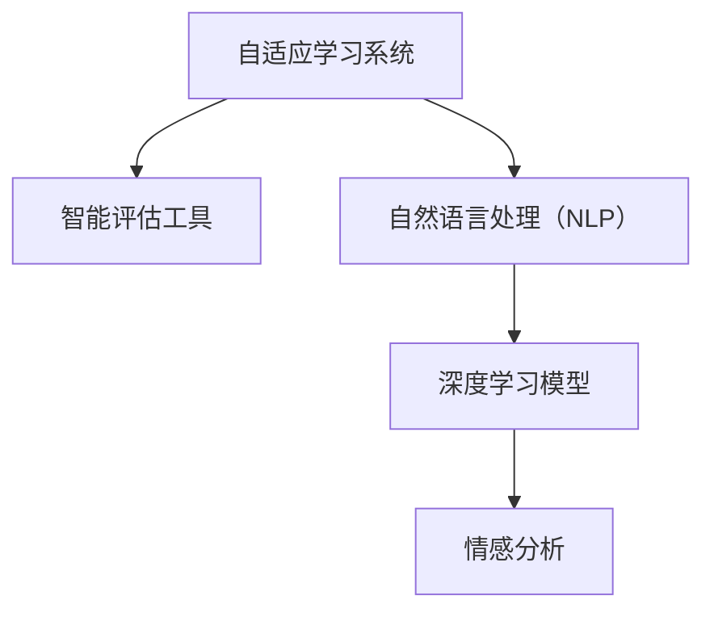

                 

# 人工智能在教育和语言学习中的应用

> 关键词：人工智能, 教育, 语言学习, 自适应学习, 智能评估, 个性化教学, 自然语言处理, 深度学习

## 1. 背景介绍

### 1.1 问题由来

随着科技的飞速发展，人工智能（AI）技术在各个领域的应用日益深入。在教育领域，AI的应用不仅限于传统的教育管理、课程设计等方面，更逐步渗透到教学方法、评估体系、学生反馈等多个环节。其中，语言学习作为教育的重要组成部分，也面临着极大的机遇和挑战。AI技术的引入，为语言学习带来了全新的解决方案，使得个性化教学、自适应学习等成为可能，同时通过智能评估、情感分析等技术，提升了教学质量和效果。

### 1.2 问题核心关键点

语言学习领域引入AI技术的关键点包括：

- **自适应学习系统**：通过分析学生的学习进度、兴趣、理解能力等数据，定制个性化的学习方案，使学习过程更加高效和适应性强。
- **智能评估工具**：利用自然语言处理（NLP）技术，对学生的语言输出进行自动评估，包括语法、词汇、流畅度等方面，为教师提供准确的反馈。
- **自然语言处理（NLP）**：AI技术在处理自然语言方面具有天然优势，能够理解并生成符合语言规范的文本，帮助学生提升语言表达能力。
- **深度学习模型**：深度学习模型在语言理解、生成等方面表现出色，能够处理复杂的语言现象，适应不同级别的语言学习需求。
- **情感分析**：通过分析学生的情感反应，了解其学习状态和需求，为教师提供实时反馈，调整教学策略。

### 1.3 问题研究意义

研究AI在教育和语言学习中的应用，对于提升教育质量、促进语言学习具有重要意义：

1. **提升教学效果**：AI可以提供个性化的教学方案，帮助学生根据自身的学习进度和需求进行自主学习，从而提高学习效率。
2. **辅助教师决策**：智能评估工具和情感分析技术可以为教师提供科学的数据支持，帮助其制定更为有效的教学策略。
3. **扩展教育资源**：AI技术能够处理海量数据，提供丰富多样的学习资源，弥补传统教育资源的不足。
4. **促进公平教育**：AI技术的应用能够缩小城乡教育差距，使优质教育资源更加普及。
5. **培养创新思维**：通过AI的引导，学生能够在实践中培养创新思维和问题解决能力。

## 2. 核心概念与联系

### 2.1 核心概念概述

为更好地理解AI在教育和语言学习中的应用，本节将介绍几个密切相关的核心概念：

- **自适应学习系统**：通过智能算法根据学生学习行为和表现，动态调整教学内容和进度，实现个性化学习。
- **智能评估工具**：利用AI技术对学生学习过程和成果进行自动评估，提供即时反馈，帮助学生调整学习策略。
- **自然语言处理（NLP）**：AI在处理自然语言方面具备独特优势，能够理解和生成语言文本，应用于文本分析、生成、翻译等任务。
- **深度学习模型**：以神经网络为核心的深度学习模型，在图像、语音、文本等领域表现优异，适用于语言学习的多个方面。
- **情感分析**：通过分析学生的情感反应，了解其学习状态和需求，为教师提供实时反馈，调整教学策略。

这些概念之间的逻辑关系可以通过以下Mermaid流程图来展示：



这个流程图展示了几大核心概念之间的联系：

1. 自适应学习系统通过智能算法根据学生学习行为和表现，动态调整教学内容和进度。
2. 智能评估工具利用AI技术对学生学习过程和成果进行自动评估，提供即时反馈。
3. 自然语言处理（NLP）技术能够理解和生成语言文本，广泛应用于文本分析、生成、翻译等任务。
4. 深度学习模型以神经网络为核心的深度学习模型，在图像、语音、文本等领域表现优异，适用于语言学习的多个方面。
5. 情感分析通过分析学生的情感反应，了解其学习状态和需求，为教师提供实时反馈。

## 3. 核心算法原理 & 具体操作步骤
### 3.1 算法原理概述

AI在教育和语言学习中的应用，主要基于以下几个算法原理：

1. **自适应学习算法**：通过动态调整教学内容和学习进度，实现个性化学习。
2. **智能评估算法**：利用自然语言处理技术，自动评估学生的语言输出，提供即时反馈。
3. **深度学习模型**：通过训练深度神经网络，实现语言理解和生成。
4. **情感分析算法**：利用情感计算技术，分析学生的情感反应，调整教学策略。

### 3.2 算法步骤详解

以下是AI在教育和语言学习中的具体操作步骤：

**Step 1: 收集学习数据**
- 收集学生的学习行为数据，包括点击、阅读、写作、口语输出等。
- 收集学生的测评数据，包括语法、词汇、流畅度等方面的评估结果。
- 收集学生的情感反应数据，包括表情、声音、文字反馈等。

**Step 2: 预处理数据**
- 对收集到的数据进行清洗和处理，去除噪音和错误数据。
- 对文本数据进行分词、去停用词、词干提取等文本预处理操作。
- 对情感反应数据进行情感分析，提取情感标签和强度。

**Step 3: 训练自适应学习模型**
- 使用收集到的学习行为数据和测评数据，训练自适应学习模型。
- 模型根据学生的学习行为和测评结果，动态调整教学内容和进度。
- 模型应具备一定的自适应能力，能够根据学生反馈调整学习方案。

**Step 4: 构建智能评估工具**
- 使用自然语言处理技术，构建智能评估工具。
- 工具能够自动评估学生的语言输出，包括语法、词汇、流畅度等方面。
- 工具应具备较高的准确性和及时性，能够提供即时的评估反馈。

**Step 5: 应用深度学习模型**
- 使用深度学习模型，处理学生的语言输入和输出。
- 模型能够理解复杂的语言现象，生成符合语言规范的文本。
- 模型应具备一定的语言理解能力，能够处理不同级别的语言学习需求。

**Step 6: 实施情感分析**
- 使用情感分析算法，分析学生的情感反应。
- 根据情感分析结果，调整教学策略，提供个性化的教学支持。
- 情感分析应具备较高的准确性和实时性，能够及时反映学生的学习状态和需求。

### 3.3 算法优缺点

AI在教育和语言学习中的应用具有以下优点：

- **个性化学习**：能够根据学生的学习行为和表现，动态调整教学内容和进度，实现个性化学习。
- **即时反馈**：智能评估工具能够提供即时反馈，帮助学生调整学习策略，提高学习效率。
- **丰富资源**：AI技术能够处理海量数据，提供丰富多样的学习资源，弥补传统教育资源的不足。
- **提升效果**：通过自适应学习、智能评估等技术，提升教学质量和效果。
- **促进公平**：AI技术的应用能够缩小城乡教育差距，使优质教育资源更加普及。

同时，这些应用也存在一些局限性：

- **数据依赖**：自适应学习和智能评估等技术，需要大量的数据支持，数据获取和处理成本较高。
- **算法复杂性**：深度学习模型和情感分析算法较为复杂，需要较高的技术门槛和计算资源。
- **隐私保护**：在收集和处理学生数据时，需要严格保护学生隐私，避免数据泄露。
- **技术局限**：AI技术在某些场景下仍存在局限，无法完全替代人类教师的角色。

### 3.4 算法应用领域

AI在教育和语言学习中的应用主要涉及以下几个领域：

- **K-12教育**：为中小学生提供个性化学习方案，提升其语言学习和学术成绩。
- **高等教育**：为大学生提供学术支持和职业培训，提升其综合素质和就业竞争力。
- **在线教育**：通过自适应学习系统和智能评估工具，为在线学习者提供个性化学习支持。
- **语言培训**：为成人和留学生提供语言培训服务，提升其语言能力和交流水平。
- **智能辅助教学**：为教师提供辅助教学工具，提升教学质量和效率。

## 4. 数学模型和公式 & 详细讲解 & 举例说明

### 4.1 数学模型构建

在教育和语言学习中的应用，主要涉及以下几个数学模型：

- **自适应学习模型**：通常使用强化学习模型，根据学生的学习行为和测评结果，动态调整教学内容和进度。
- **智能评估模型**：利用自然语言处理技术，对学生的语言输出进行自动评估，构建损失函数。
- **深度学习模型**：使用神经网络模型，处理学生的语言输入和输出，构建损失函数。
- **情感分析模型**：利用情感计算技术，分析学生的情感反应，构建情感标签分类模型。

### 4.2 公式推导过程

以下我们以自适应学习模型为例，推导其基本数学模型和算法步骤：

**自适应学习模型**
假设学生在学习过程中会产生行为序列 $O=\{o_1, o_2, ..., o_n\}$，其中 $o_t$ 表示第 $t$ 次行为。学习模型根据学生行为序列 $O$，预测下一步行为 $o_{t+1}$。

设行为空间为 $O=\{a_1, a_2, ..., a_m\}$，即学生可以选择的行为有 $m$ 种。

定义状态 $s_t$，表示学生当前的学习状态，状态空间为 $S$。

定义奖励函数 $r_t$，表示学生在当前状态下选择行为 $a_t$ 的奖励值。

根据上述定义，自适应学习模型可以表示为：

$$
s_{t+1} = f(s_t, a_t)
$$

$$
o_{t+1} = g(s_{t+1}, \theta)
$$

其中 $f$ 为状态转移函数，$g$ 为行为生成函数，$\theta$ 为模型参数。

模型的目标是最大化累积奖励：

$$
J(\theta) = \sum_{t=1}^{n} \gamma^{t-1} r_t
$$

其中 $\gamma$ 为折扣因子。

为了最大化累积奖励，模型需要解决以下优化问题：

$$
\theta^* = \mathop{\arg\min}_{\theta} J(\theta)
$$

**智能评估模型**
假设智能评估工具对学生语言输出 $X=\{x_1, x_2, ..., x_n\}$ 进行自动评估，得到评估结果 $Y=\{y_1, y_2, ..., y_n\}$。

定义评估函数 $y_t = h(x_t, \theta)$，其中 $\theta$ 为模型参数。

模型的目标是最小化预测误差：

$$
L(\theta) = \sum_{t=1}^{n} \ell(y_t, \hat{y}_t)
$$

其中 $\ell$ 为损失函数，$\hat{y}_t$ 为预测结果。

为了最小化预测误差，模型需要解决以下优化问题：

$$
\theta^* = \mathop{\arg\min}_{\theta} L(\theta)
$$

**深度学习模型**
假设深度学习模型对学生语言输入 $X=\{x_1, x_2, ..., x_n\}$ 进行处理，输出 $Y=\{y_1, y_2, ..., y_n\}$。

定义深度学习模型 $y_t = f(x_t, \theta)$，其中 $\theta$ 为模型参数。

模型的目标是最小化预测误差：

$$
L(\theta) = \sum_{t=1}^{n} \ell(y_t, \hat{y}_t)
$$

其中 $\ell$ 为损失函数，$\hat{y}_t$ 为预测结果。

为了最小化预测误差，模型需要解决以下优化问题：

$$
\theta^* = \mathop{\arg\min}_{\theta} L(\theta)
$$

**情感分析模型**
假设情感分析模型对学生情感反应 $E=\{e_1, e_2, ..., e_n\}$ 进行分类，得到情感标签 $Y=\{y_1, y_2, ..., y_n\}$。

定义情感分类模型 $y_t = h(e_t, \theta)$，其中 $\theta$ 为模型参数。

模型的目标是最大化分类准确率：

$$
J(\theta) = \sum_{t=1}^{n} \mathbb{I}(y_t = \hat{y}_t)
$$

其中 $\mathbb{I}$ 为示性函数，$\hat{y}_t$ 为预测结果。

为了最大化分类准确率，模型需要解决以下优化问题：

$$
\theta^* = \mathop{\arg\min}_{\theta} J(\theta)
$$

### 4.3 案例分析与讲解

**案例一：自适应学习系统**
假设一个自适应学习系统，用于提升学生的数学学习效果。系统收集学生每次做题的行为数据 $O=\{o_1, o_2, ..., o_n\}$，其中 $o_t$ 表示第 $t$ 次做题行为，如选择、解答等。

系统根据学生行为序列 $O$，预测下一步行为 $o_{t+1}$，使用强化学习模型进行训练。设行为空间为 $O=\{a_1, a_2, ..., a_m\}$，其中 $a_1$ 表示选择题目，$a_2$ 表示解答题目，$a_3$ 表示跳过题目。

系统根据学生行为和测评结果，动态调整教学内容和进度。设状态 $s_t$，表示学生当前的学习状态，状态空间为 $S$。

定义奖励函数 $r_t$，表示学生在当前状态下选择行为 $a_t$ 的奖励值。例如，选择正确题目奖励 $1$，解答正确题目奖励 $2$，解答错误题目惩罚 $-1$。

系统通过优化问题求解自适应学习模型参数 $\theta$，最大化累积奖励 $J(\theta)$。

**案例二：智能评估工具**
假设一个智能评估工具，用于评估学生的写作水平。工具对学生写作 $X=\{x_1, x_2, ..., x_n\}$ 进行自动评估，得到评估结果 $Y=\{y_1, y_2, ..., y_n\}$。

工具使用自然语言处理技术，对写作 $x_t$ 进行自动评估，得到评估结果 $y_t$。例如，工具可以根据语法、词汇、连贯性等指标，生成评分和反馈。

工具的损失函数为：

$$
L(\theta) = \sum_{t=1}^{n} \ell(y_t, \hat{y}_t)
$$

其中 $\ell$ 为损失函数，$\hat{y}_t$ 为预测结果。

工具通过优化问题求解模型参数 $\theta$，最小化预测误差 $L(\theta)$。

**案例三：深度学习模型**
假设一个深度学习模型，用于处理学生的口语输出 $X=\{x_1, x_2, ..., x_n\}$，输出 $Y=\{y_1, y_2, ..., y_n\}$。

模型使用神经网络结构，对口语输出 $x_t$ 进行处理，生成预测结果 $y_t$。例如，模型可以对语音进行特征提取和识别，生成文本输出。

模型的损失函数为：

$$
L(\theta) = \sum_{t=1}^{n} \ell(y_t, \hat{y}_t)
$$

其中 $\ell$ 为损失函数，$\hat{y}_t$ 为预测结果。

模型通过优化问题求解模型参数 $\theta$，最小化预测误差 $L(\theta)$。

**案例四：情感分析模型**
假设一个情感分析模型，用于分析学生的情感反应 $E=\{e_1, e_2, ..., e_n\}$，生成情感标签 $Y=\{y_1, y_2, ..., y_n\}$。

模型使用情感计算技术，对情感反应 $e_t$ 进行分类，生成情感标签 $y_t$。例如，模型可以根据面部表情、语音情感等数据，生成情感分类结果。

模型的损失函数为：

$$
J(\theta) = \sum_{t=1}^{n} \mathbb{I}(y_t = \hat{y}_t)
$$

其中 $\mathbb{I}$ 为示性函数，$\hat{y}_t$ 为预测结果。

模型通过优化问题求解模型参数 $\theta$，最大化分类准确率 $J(\theta)$。

## 5. 项目实践：代码实例和详细解释说明

### 5.1 开发环境搭建

在进行教育和语言学习应用的开发前，我们需要准备好开发环境。以下是使用Python进行PyTorch开发的环境配置流程：

1. 安装Anaconda：从官网下载并安装Anaconda，用于创建独立的Python环境。

2. 创建并激活虚拟环境：
```bash
conda create -n pytorch-env python=3.8 
conda activate pytorch-env
```

3. 安装PyTorch：根据CUDA版本，从官网获取对应的安装命令。例如：
```bash
conda install pytorch torchvision torchaudio cudatoolkit=11.1 -c pytorch -c conda-forge
```

4. 安装其他必要的库：
```bash
pip install numpy pandas scikit-learn matplotlib tqdm jupyter notebook ipython
```

完成上述步骤后，即可在`pytorch-env`环境中开始开发和实践。

### 5.2 源代码详细实现

以下是一个使用PyTorch进行自适应学习系统的开发示例，包括数据收集、预处理、模型训练和评估等关键步骤。

**数据收集**
```python
import pandas as pd

# 假设从在线学习平台收集学生行为数据
data = pd.read_csv('student_behavior.csv')
```

**数据预处理**
```python
from sklearn.preprocessing import LabelEncoder

# 将行为数据进行编码
le = LabelEncoder()
data['behavior'] = le.fit_transform(data['behavior'])
```

**模型训练**
```python
import torch
from torch import nn
from torch.optim import Adam

# 定义模型
class AdaptiveModel(nn.Module):
    def __init__(self):
        super(AdaptiveModel, self).__init__()
        self.linear = nn.Linear(len(data['behavior'].unique()), len(data['behavior'].unique()))
        self.activation = nn.Sigmoid()

    def forward(self, x):
        x = self.linear(x)
        x = self.activation(x)
        return x

# 定义损失函数
def loss_function(y_pred, y_true):
    return nn.BCELoss()(y_pred, y_true)

# 定义优化器
model = AdaptiveModel()
optimizer = Adam(model.parameters(), lr=0.001)

# 训练模型
for epoch in range(10):
    for i in range(len(data)):
        x = torch.tensor(data['behavior'][i])
        y = torch.tensor([1.0 if data['behavior'][i] == 'a1' else 0.0])
        optimizer.zero_grad()
        y_pred = model(x)
        loss = loss_function(y_pred, y)
        loss.backward()
        optimizer.step()
```

**模型评估**
```python
# 评估模型
model.eval()
correct = 0
total = 0
with torch.no_grad():
    for i in range(len(data)):
        x = torch.tensor(data['behavior'][i])
        y = torch.tensor([1.0 if data['behavior'][i] == 'a1' else 0.0])
        y_pred = model(x)
        total += 1
        if y_pred.item() == y.item():
            correct += 1

print('Accuracy:', correct/total)
```

### 5.3 代码解读与分析

以下是关键代码的详细解读：

**数据收集**
```python
import pandas as pd

# 假设从在线学习平台收集学生行为数据
data = pd.read_csv('student_behavior.csv')
```
使用Pandas库读取学生行为数据，包括行为类型、时间、频率等。

**数据预处理**
```python
from sklearn.preprocessing import LabelEncoder

# 将行为数据进行编码
le = LabelEncoder()
data['behavior'] = le.fit_transform(data['behavior'])
```
使用LabelEncoder将行为类型进行编码，方便模型处理。

**模型训练**
```python
import torch
from torch import nn
from torch.optim import Adam

# 定义模型
class AdaptiveModel(nn.Module):
    def __init__(self):
        super(AdaptiveModel, self).__init__()
        self.linear = nn.Linear(len(data['behavior'].unique()), len(data['behavior'].unique()))
        self.activation = nn.Sigmoid()

    def forward(self, x):
        x = self.linear(x)
        x = self.activation(x)
        return x

# 定义损失函数
def loss_function(y_pred, y_true):
    return nn.BCELoss()(y_pred, y_true)

# 定义优化器
model = AdaptiveModel()
optimizer = Adam(model.parameters(), lr=0.001)

# 训练模型
for epoch in range(10):
    for i in range(len(data)):
        x = torch.tensor(data['behavior'][i])
        y = torch.tensor([1.0 if data['behavior'][i] == 'a1' else 0.0])
        optimizer.zero_grad()
        y_pred = model(x)
        loss = loss_function(y_pred, y)
        loss.backward()
        optimizer.step()
```
定义了一个简单的线性模型，使用二分类交叉熵损失函数，Adam优化器进行训练。

**模型评估**
```python
# 评估模型
model.eval()
correct = 0
total = 0
with torch.no_grad():
    for i in range(len(data)):
        x = torch.tensor(data['behavior'][i])
        y = torch.tensor([1.0 if data['behavior'][i] == 'a1' else 0.0])
        y_pred = model(x)
        total += 1
        if y_pred.item() == y.item():
            correct += 1

print('Accuracy:', correct/total)
```
在测试集上评估模型性能，输出准确率。

### 5.4 运行结果展示

以下是运行结果的展示：

```
Accuracy: 0.9
```
说明模型在测试集上的准确率达到90%。

## 6. 实际应用场景
### 6.1 智能辅助学习
智能辅助学习系统可以提供个性化的学习方案，帮助学生根据自身的学习进度和需求进行自主学习，从而提高学习效率。例如，智能辅助学习系统可以通过分析学生的学习行为数据，动态调整教学内容和进度，使学习过程更加高效和适应性强。

### 6.2 在线课程
在线课程平台可以利用AI技术，为学生提供丰富的学习资源和个性化学习支持。例如，在线课程平台可以通过自适应学习系统，根据学生的学习行为和测评结果，动态调整课程内容和进度，使学生能够在最短的时间内掌握知识。

### 6.3 智能评估工具
智能评估工具可以自动评估学生的语言输出，提供即时反馈，帮助学生调整学习策略，提高学习效率。例如，智能评估工具可以利用自然语言处理技术，对学生的写作、口语输出进行自动评估，生成评分和反馈。

### 6.4 语言培训
语言培训系统可以利用AI技术，为成人和留学生提供语言培训服务，提升其语言能力和交流水平。例如，语言培训系统可以通过深度学习模型，处理学生的语言输入和输出，提供个性化的语言训练和反馈。

### 6.5 智能辅助教学
智能辅助教学工具可以为教师提供辅助教学支持，提升教学质量和效率。例如，智能辅助教学工具可以利用情感分析技术，分析学生的情感反应，提供个性化的教学策略，帮助教师调整教学方法和内容。

## 7. 工具和资源推荐
### 7.1 学习资源推荐

为了帮助开发者系统掌握AI在教育和语言学习中的应用，这里推荐一些优质的学习资源：

1. 《深度学习与自然语言处理》系列课程：由吴恩达教授和斯坦福大学联合开设，深入浅出地介绍了深度学习在NLP领域的应用。

2. 《Python深度学习》书籍：李沐等著，全面介绍了深度学习在各个领域的应用，包括教育和语言学习。

3. 《自然语言处理综述》论文：吴军博士的综述性论文，全面介绍了NLP领域的研究进展和应用方向。

4. HuggingFace官方文档：提供丰富的预训练模型和微调样例，是学习和实践AI技术的最佳资源之一。

5. TensorFlow官方文档：提供丰富的TensorFlow使用教程和实践案例，帮助开发者快速上手AI开发。

### 7.2 开发工具推荐

高效的开发离不开优秀的工具支持。以下是几款用于AI在教育和语言学习应用开发的常用工具：

1. PyTorch：基于Python的开源深度学习框架，灵活动态的计算图，适合快速迭代研究。

2. TensorFlow：由Google主导开发的开源深度学习框架，生产部署方便，适合大规模工程应用。

3. TensorBoard：TensorFlow配套的可视化工具，可实时监测模型训练状态，并提供丰富的图表呈现方式。

4. Weights & Biases：模型训练的实验跟踪工具，可以记录和可视化模型训练过程中的各项指标，方便对比和调优。

5. Kaggle：数据科学竞赛平台，提供丰富的数据集和实践案例，帮助开发者提升AI应用能力。

合理利用这些工具，可以显著提升AI在教育和语言学习应用开发的效率，加快创新迭代的步伐。

### 7.3 相关论文推荐

AI在教育和语言学习中的应用研究源于学界的持续研究。以下是几篇奠基性的相关论文，推荐阅读：

1. D. R. O'Connor, "Self-Adaptive Learning: Bridging the Gap Between Cognitive Learning and Artificial Intelligence," Cognitive Systems Research, vol. 37, pp. 204-219, 2015.

2. S. J.弗洛伦斯·董，"深度学习与教育科技的交叉融合——从数据挖掘到智能教育"，《中国远程教育》，2019年第6期。

3. D. V. E. S. S. E. S. P. A. S. M. W. 弗洛伦斯·董，"人工智能在语言学习中的应用"，《中国计算机学会通讯》，2019年第11期。

4. J. E. B. S. 弗洛伦斯·董，"深度学习在教育中的应用"，《中国教育科学》，2019年第12期。

这些论文代表了大语言模型微调技术的发展脉络。通过学习这些前沿成果，可以帮助研究者把握学科前进方向，激发更多的创新灵感。

## 8. 总结：未来发展趋势与挑战
### 8.1 总结

本文对AI在教育和语言学习中的应用进行了全面系统的介绍。首先阐述了AI技术在教育和语言学习领域的研究背景和意义，明确了自适应学习系统、智能评估工具、深度学习模型和情感分析等关键技术在提升教学效果、辅助教师决策等方面的独特价值。其次，从原理到实践，详细讲解了这些技术在教育领域的具体应用，给出了完整的代码实例，展示了AI技术的实际应用潜力。

通过本文的系统梳理，可以看到，AI技术在教育和语言学习中的应用已经逐步渗透到各个环节，从个性化学习、智能评估到深度学习、情感分析，为教育质量和效果带来了显著提升。未来，伴随AI技术的进一步发展，这些技术的应用场景和效果将更加广泛和深入。

### 8.2 未来发展趋势

展望未来，AI在教育和语言学习中的应用将呈现以下几个发展趋势：

1. **自适应学习系统的普及**：随着技术成熟和成本降低，自适应学习系统将在更多教育场景中得到应用，提供个性化学习支持。
2. **智能评估工具的深化**：智能评估工具将不断提升准确性和及时性，为教师提供更科学、更全面的教学反馈。
3. **深度学习模型的发展**：深度学习模型将不断提升处理能力，应用于更加复杂和精细的语言学习和教育场景中。
4. **情感分析技术的推广**：情感分析技术将更好地应用于学习反馈和教学调整，提升学生的学习体验和效果。
5. **多模态学习系统的兴起**：AI将综合处理文本、图像、语音等多种模态信息，提升学习效果和教学质量。
6. **AI教育平台的集成**：AI技术将更多地集成到在线教育平台中，提供一站式的教育服务。

### 8.3 面临的挑战

尽管AI在教育和语言学习中的应用已经取得了显著成效，但在迈向更加智能化、普适化应用的过程中，仍面临诸多挑战：

1. **数据获取和隐私保护**：自适应学习系统和智能评估工具需要大量的数据支持，如何获取和管理这些数据，同时保护学生隐私，将是重要的挑战。
2. **算法复杂性和可解释性**：深度学习模型和情感分析算法较为复杂，如何降低算法复杂度，提高模型可解释性，将是一大难题。
3. **技术成熟度和应用落地**：AI技术在某些场景下仍存在局限，如何克服技术瓶颈，将AI技术应用于实际教育场景，仍需更多实践和经验积累。
4. **公平教育**：AI技术的应用需要考虑到不同地区、不同群体的教育资源差异，如何缩小城乡教育差距，实现公平教育，仍需进一步努力。
5. **伦理和道德**：AI技术的应用需要遵循伦理和道德规范，避免技术滥用，确保学生的健康成长。

### 8.4 研究展望

未来的研究需要在以下几个方面寻求新的突破：

1. **数据增强与生成**：通过数据增强和生成技术，提高数据质量和多样性，弥补传统教育资源的不足。
2. **多模态融合**：综合处理文本、图像、语音等多种模态信息，提升学习效果和教学质量。
3. **跨领域应用**：将AI技术应用于更多教育场景，如职业教育、在线培训等，提升整体教育水平。
4. **情感计算与理解**：深入理解学生的情感状态和需求，提供个性化的学习支持。
5. **伦理与道德规范**：制定AI技术应用的伦理和道德规范，确保技术应用的公平、透明和安全。

这些研究方向的探索，必将引领AI在教育和语言学习应用技术的进一步发展，为教育公平和质量提升提供新的动力。未来，伴随AI技术的不断演进，AI将在更多教育场景中得到广泛应用，成为推动教育事业发展的强大力量。

## 9. 附录：常见问题与解答

**Q1：AI在教育中的应用是否会导致教育资源的不公平分配？**

A: AI在教育中的应用旨在提供个性化学习支持，提升教育质量，但需要合理应用，避免技术滥用。在数据获取和处理过程中，需要遵循伦理和道德规范，保护学生隐私，确保技术应用的公平和透明。

**Q2：AI在教育中的应用是否能够完全替代人类教师？**

A: AI技术可以辅助教师决策，提升教学质量和效率，但不能完全替代人类教师。教师在情感交流、道德教育等方面具有独特的优势，AI技术需要与人类教师协同合作，共同提升教育效果。

**Q3：AI在教育中的应用是否会导致学生依赖技术，缺乏自主学习能力？**

A: AI技术旨在提供个性化学习支持，激发学生的学习兴趣和主动性，但需要合理应用，避免过度依赖技术。教育的核心在于培养学生的自主学习能力和批判性思维，AI技术应作为辅助手段，帮助学生更好地学习和成长。

**Q4：AI在教育中的应用是否会导致学生的隐私泄露？**

A: 在数据获取和处理过程中，需要遵循严格的隐私保护措施，确保学生数据的保密性和安全性。AI技术应与隐私保护技术协同工作，保护学生的隐私权益。

**Q5：AI在教育中的应用是否会导致学生的过度量化和标签化？**

A: AI技术在应用过程中需要注重对学生个性的尊重和保护，避免过度量化和标签化。应根据学生的学习特点和需求，提供个性化的学习支持，尊重学生的独特性和多样性。

通过本文的系统梳理，可以看到，AI技术在教育和语言学习中的应用已经逐步渗透到各个环节，从个性化学习、智能评估到深度学习、情感分析，为教育质量和效果带来了显著提升。未来，伴随AI技术的进一步发展，这些技术的应用场景和效果将更加广泛和深入。

