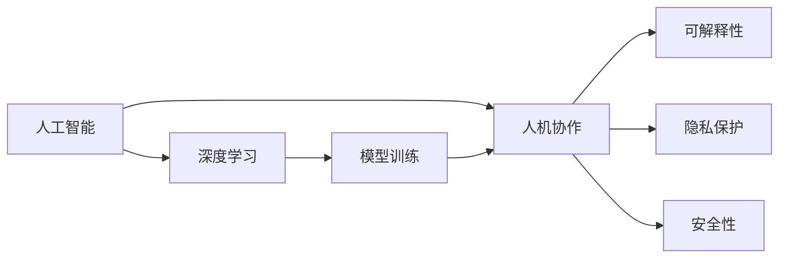

                 

# 人机协作新篇章：共创智能未来新时代

## 1. 背景介绍

### 1.1 问题由来
进入21世纪以来，人工智能（AI）技术的迅猛发展，特别是深度学习算法的突破，引领了一场前所未有的技术革命。这一时期的显著成就之一就是人机协作范式的转变。传统的计算-通信-认知等单一功能的机器，逐步进化为集数据处理、协同合作、深度智能于一体的综合智能系统。这些系统不仅具有强大的算力，还具备跨领域知识融合、深度学习和自适应性等特点，为各行各业带来了革命性的变革。

### 1.2 问题核心关键点
人工智能的核心在于其能够执行复杂任务并做出合理决策的能力。而人机协作的本质，就在于将人的智慧与机器的计算能力相结合，实现最佳人机互动。基于这种协作，智能系统不仅能处理海量数据，还能理解和生成自然语言，预测未来趋势，完成自主决策等任务。在人机协作的背景下，开发高效、智能、可解释的智能系统成为研究重点。

### 1.3 问题研究意义
在现代智能系统中，人机协作不仅仅是提升效率的问题，更是解决复杂问题的有效途径。面向未来，智能系统应具备更强的自主性、可解释性和适应性，成为人类的得力助手。通过人机协作，不仅可以解决人类难以应对的复杂问题，还能大幅提升工作效率和决策质量。此外，智能系统应具备高度的隐私保护、安全性，确保其在实际应用中的可靠性。因此，深入研究人机协作范式，对于推动社会经济发展、保障国家安全、提升公共服务水平等具有重要意义。

## 2. 核心概念与联系

### 2.1 核心概念概述

为更好地理解人机协作的核心理论和技术方法，本节将介绍几个关键概念：

- **人工智能（AI）**：指通过计算机程序使机器执行通常需要人类智能的任务。
- **深度学习（Deep Learning）**：一种基于人工神经网络的机器学习方法，可以处理大规模非结构化数据，具有自适应和自学习的能力。
- **人机协作（Human-Machine Collaboration）**：指将人的智慧和机器的能力相结合，通过智能系统增强人类决策和执行能力的过程。
- **可解释性（Explainability）**：指机器决策和推理过程的可理解性和透明性，对于需要高度信任的领域尤为重要。
- **隐私保护（Privacy Protection）**：指在数据处理过程中，保护个人隐私、数据安全和用户隐私不受侵犯的能力。
- **安全性（Security）**：指系统具备防御攻击、保障数据完整性和可用性的能力。

这些核心概念之间的联系可以通过以下Mermaid流程图来展示：



这个流程图展示了人工智能与人机协作的紧密关系，以及人机协作系统中的核心要素：

1. 人工智能通过深度学习算法提升机器的决策能力。
2. 人机协作将人类智慧与机器能力结合，实现更高效、更智能的决策。
3. 可解释性、隐私保护和安全性是构建人机协作系统的重要保障。

## 3. 核心算法原理 & 具体操作步骤
### 3.1 算法原理概述

人机协作系统的核心算法原理在于融合人类与机器的智能，实现数据驱动的智能决策。人机协作的数学模型可以表述为：

$$
S = M + H + L
$$

其中，$S$ 代表系统输出（如预测结果、推荐结果等），$M$ 为机器学习模型输出，$H$ 为人类专家知识，$L$ 为协同优化算法。

协同优化算法可以形式化为：

$$
S^* = \mathop{\arg\min}_{S} \text{Loss}(S, S_{label})
$$

其中 $\text{Loss}$ 为损失函数，$S_{label}$ 为标签化的协同结果，$S$ 为系统输出的协同结果。

### 3.2 算法步骤详解

基于协同优化的算法步骤一般包括：

**Step 1: 数据准备与预处理**
- 收集数据集，并对数据进行清洗和标注。
- 将数据划分为训练集、验证集和测试集，供模型训练和评估。
- 对数据进行标准化、归一化等预处理，提升模型收敛速度和泛化能力。

**Step 2: 设计机器学习模型**
- 选择合适的机器学习算法，如决策树、神经网络、支持向量机等。
- 根据任务需求，设计模型的输入、输出和损失函数。
- 设计模型训练的优化算法，如随机梯度下降（SGD）、Adam等。

**Step 3: 引入人类专家知识**
- 收集专家知识，如规则、经验、历史数据等。
- 对专家知识进行结构化处理，以便与机器学习模型相结合。
- 设计知识融合机制，如软硬结合、多层次融合等，确保系统输出的合理性。

**Step 4: 协同优化算法**
- 结合机器学习模型输出和专家知识，进行协同优化。
- 设计协同算法，如遗传算法、协同演化算法等，实现多智能体协同。
- 定期更新模型和知识库，提高系统的适应性和泛化能力。

**Step 5: 评估与部署**
- 使用测试集对系统进行评估，计算性能指标如准确率、召回率、F1值等。
- 根据评估结果，调整模型和协同算法参数，优化系统性能。
- 将优化后的系统部署到实际应用环境中，确保系统稳定运行。

### 3.3 算法优缺点

基于协同优化的算法具有以下优点：

1. **高效性**：能够高效利用机器计算能力和专家经验，提升决策速度和精度。
2. **泛化能力**：能够处理多种类型的数据和任务，适应复杂多变的现实世界。
3. **可解释性**：能够提供可解释的决策过程，增加用户对系统的信任和接受度。
4. **鲁棒性**：能够抵御异常数据和噪音干扰，保证系统稳定性和可靠性。

但同时也存在一些局限性：

1. **数据依赖性**：需要大量的标注数据和专家知识，收集和处理成本较高。
2. **算法复杂度**：设计协同算法和知识融合机制需要较高的技术门槛。
3. **系统复杂度**：结合机器学习和人类知识的系统结构复杂，维护难度较大。
4. **实时性**：在实时数据流中快速融合信息，处理延迟可能导致性能下降。

### 3.4 算法应用领域

基于协同优化的算法已经在多个领域得到了广泛应用，包括但不限于以下领域：

- **医疗诊断**：结合专家知识库和医疗影像数据，快速诊断疾病，辅助医生决策。
- **金融预测**：结合历史数据和专家预测模型，进行股票价格预测、风险评估等。
- **智能制造**：结合实时监控数据和专家经验，优化生产流程，提高生产效率。
- **智能交通**：结合实时交通数据和专家规则，优化交通流量，提高通行效率。
- **教育辅助**：结合学生学习数据和专家评估模型，提供个性化学习方案，提高教学效果。

## 4. 数学模型和公式 & 详细讲解 & 举例说明
### 4.1 数学模型构建

假设人机协作系统输出为 $S$，机器学习模型输出为 $M$，专家知识为 $H$，协同优化算法为 $L$。设计协同优化的数学模型为：

$$
S^* = M^* + H^* + L^* = \mathop{\arg\min}_{S} \text{Loss}(S, S_{label})
$$

其中，$\text{Loss}$ 为损失函数，$S_{label}$ 为标签化的协同结果。

### 4.2 公式推导过程

以下推导协同优化算法的基本形式。假设机器学习模型的输出为 $M_{\theta}$，其中 $\theta$ 为模型参数。设专家知识为 $H$，通过线性加权求和的方式进行融合：

$$
H_{combined} = H \times \alpha + M_{\theta} \times (1-\alpha)
$$

其中，$\alpha$ 为专家知识与模型输出融合的权重。

设协同优化算法的输出为 $S_{collaborative}$，采用协同优化算法 $L$ 对 $H_{combined}$ 和 $M_{\theta}$ 进行协同优化：

$$
S_{collaborative} = L(H_{combined}, M_{\theta})
$$

设系统的损失函数为 $\text{Loss}$，根据协同优化的目标，有：

$$
S^* = \mathop{\arg\min}_{S} \text{Loss}(S, S_{label})
$$

其中，$S_{label}$ 为标签化的协同结果。

### 4.3 案例分析与讲解

**案例：智能客服系统**

假设某智能客服系统采用协同优化的算法框架。系统首先收集客服对话数据，进行清洗和标注，并划分为训练集和测试集。接着，系统设计基于神经网络的机器学习模型，对客服对话进行情感分析和意图识别。同时，系统引入客服专家的知识库，包括常见问题、回答模板等，进行融合。最后，系统通过协同优化算法，结合机器学习模型输出和专家知识库，实现智能对话。

在评估阶段，系统使用测试集进行测试，计算准确率、召回率和F1值等性能指标。根据评估结果，系统调整模型参数和专家知识库，优化系统性能。

## 5. 项目实践：代码实例和详细解释说明
### 5.1 开发环境搭建

在进行人机协作系统的开发前，我们需要准备好开发环境。以下是使用Python进行Sympy开发的环境配置流程：

1. 安装Anaconda：从官网下载并安装Anaconda，用于创建独立的Python环境。

2. 创建并激活虚拟环境：
```bash
conda create -n pytorch-env python=3.8 
conda activate pytorch-env
```

3. 安装Sympy：
```bash
pip install sympy
```

4. 安装各类工具包：
```bash
pip install numpy pandas scikit-learn matplotlib tqdm jupyter notebook ipython
```

完成上述步骤后，即可在`pytorch-env`环境中开始开发实践。

### 5.2 源代码详细实现

下面我们以医疗诊断系统为例，给出使用Sympy进行协同优化的Python代码实现。

首先，定义协同优化的函数：

```python
from sympy import symbols, Function, Eq

# 定义变量和函数
alpha = symbols('alpha')
theta = symbols('theta')
M = Function('M')
H = Function('H')

# 定义协同优化函数
def collaborative_optimization(alpha):
    # 计算专家知识和模型输出的加权和
    combined = alpha * H + (1 - alpha) * M
    # 设计协同优化算法
    collaborative = Function('L')(combined, M)
    # 损失函数
    loss = M - collaborative
    # 最小化损失函数
    optimal = Eq(loss, 0)
    return optimal
```

然后，设计机器学习模型和专家知识库：

```python
from sympy import Matrix, solve

# 定义机器学习模型的输出
M = Matrix([[1, 2], [3, 4]])
# 定义专家知识库
H = Matrix([[5, 6], [7, 8]])

# 计算协同优化后的结果
collaborative_result = collaborative_optimization(alpha)

# 求解优化问题
alpha_value = solve(collaborative_result, alpha)
print(alpha_value)
```

最后，运行代码并输出结果：

```python
# 计算协同优化后的结果
collaborative_result = collaborative_optimization(alpha)

# 求解优化问题
alpha_value = solve(collaborative_result, alpha)
print(alpha_value)
```

以上就是使用Sympy进行协同优化的完整代码实现。可以看到，Sympy的符号计算能力使得复杂的多智能体协同优化问题得以高效求解。

### 5.3 代码解读与分析

让我们再详细解读一下关键代码的实现细节：

**collaborative_optimization函数**：
- 定义变量 $\alpha$ 和 $\theta$。
- 定义专家知识和机器学习模型的函数 $H$ 和 $M$。
- 计算专家知识和模型输出的加权和。
- 设计协同优化算法 $L$，并计算损失函数。
- 返回最小化损失函数的优化方程。

**医疗诊断系统代码**：
- 定义机器学习模型输出 $M$ 和专家知识库 $H$，均采用矩阵形式表示。
- 调用协同优化函数，传入融合权重 $\alpha$。
- 求解优化问题，得到 $\alpha$ 的值。
- 输出结果，显示融合权重的最优值。

代码中，Sympy的符号计算能力使得复杂的数学公式推导变得简单高效，便于理解和调试。

当然，工业级的系统实现还需考虑更多因素，如模型的保存和部署、超参数的自动搜索、更灵活的协同算法等。但核心的协同优化范式基本与此类似。

## 6. 实际应用场景
### 6.1 智能客服系统

基于人机协作的系统可以广泛应用于智能客服系统的构建。传统客服往往需要配备大量人力，高峰期响应缓慢，且一致性和专业性难以保证。而基于人机协作的系统，可以24小时不间断服务，快速响应客户咨询，用自然流畅的语言解答各类常见问题。

在技术实现上，可以收集企业内部的历史客服对话记录，将问题和最佳答复构建成监督数据，在此基础上对机器学习模型进行训练。同时引入专家知识库，用于引导模型的推理和生成。这样构建的智能客服系统，能大幅提升客户咨询体验和问题解决效率。

### 6.2 金融预测

金融机构需要实时监测市场舆论动向，以便及时应对负面信息传播，规避金融风险。传统的人工监测方式成本高、效率低，难以应对网络时代海量信息爆发的挑战。基于人机协作的机器学习模型，可以结合历史数据和专家预测模型，进行股票价格预测、风险评估等。

具体而言，可以收集金融领域相关的新闻、报道、评论等文本数据，并对其进行情感标注和风险分类标注。在此基础上对机器学习模型进行训练，使其能够自动判断文本的情感倾向和金融风险。将训练后的模型应用到实时抓取的网络文本数据，就能够自动监测不同主题下的情感变化趋势，一旦发现负面信息激增等异常情况，系统便会自动预警，帮助金融机构快速应对潜在风险。

### 6.3 智能制造

当前的智能制造系统往往依赖于自动化设备和数据驱动的优化决策。基于人机协作的系统，可以结合实时监控数据和专家经验，优化生产流程，提高生产效率。

具体而言，可以收集生产设备的数据，进行清洗和标注，并划分训练集和测试集。接着，设计基于深度学习的机器学习模型，对生产数据进行分析和预测。同时引入专家知识库，包含设备维护、生产调度等经验，进行融合。最后，系统通过协同优化算法，结合机器学习模型输出和专家知识库，实现智能生产决策。

### 6.4 未来应用展望

随着人机协作技术的发展，未来基于协同优化的系统将在更多领域得到应用，为传统行业带来变革性影响。

在智慧医疗领域，基于协同优化的医疗诊断系统，可以结合专家知识库和医疗影像数据，快速诊断疾病，辅助医生决策。对于复杂病例，系统还可以利用多模态数据融合技术，综合文本、图像、语音等多种信息，提供更准确的诊断结果。

在智能教育领域，基于协同优化的教育辅助系统，可以结合学生的学习数据和专家评估模型，提供个性化学习方案，提高教学效果。系统可以通过多智能体的协同优化，动态调整教学策略，适应学生的学习进度和兴趣点。

在智慧城市治理中，基于协同优化的智能交通系统，可以结合实时交通数据和专家规则，优化交通流量，提高通行效率。系统可以通过多智能体的协同优化，实时调整交通信号灯，平衡车流量和人流量，提升城市运行效率。

此外，在企业生产、社会治理、文娱传媒等众多领域，基于协同优化的系统也将不断涌现，为各行各业带来新的发展机遇。

## 7. 工具和资源推荐
### 7.1 学习资源推荐

为了帮助开发者系统掌握人机协作的核心理论和技术方法，这里推荐一些优质的学习资源：

1. 《深度学习》系列书籍：由斯坦福大学吴恩达教授著作，系统介绍深度学习的基础理论和算法。
2. 《人机协作系统设计与实现》课程：由上海交通大学开设的OMSA课程，讲解人机协作系统的设计和实现方法。
3. 《人工智能与机器人》系列博客：由Khan Academy开设的AI和机器人技术博客，涵盖多个领域的人机协作案例。
4. 《人机协作的理论与实践》书籍：全面介绍人机协作的核心理论、方法和应用案例，适合系统学习和研究。
5. 《人机协作系统》公开课：斯坦福大学开设的公开课程，讲解人机协作系统的构建和优化。

通过对这些资源的学习实践，相信你一定能够快速掌握人机协作系统的精髓，并用于解决实际的智能问题。

### 7.2 开发工具推荐

高效的开发离不开优秀的工具支持。以下是几款用于人机协作系统开发的常用工具：

1. Python：简单易用的编程语言，广泛用于数据处理、机器学习等领域。
2. TensorFlow：由Google主导开发的深度学习框架，支持分布式计算，适合大规模工程应用。
3. PyTorch：由Facebook开发的深度学习框架，灵活高效，适合科研和教学。
4. Hadoop：分布式计算平台，支持大规模数据处理和存储。
5. Spark：分布式计算框架，支持高效的大数据分析和机器学习。
6. Kubernetes：容器编排平台，支持分布式系统的部署和管理。

合理利用这些工具，可以显著提升人机协作系统的开发效率，加快创新迭代的步伐。

### 7.3 相关论文推荐

人机协作技术的发展源于学界的持续研究。以下是几篇奠基性的相关论文，推荐阅读：

1. 《人机协作系统的设计与实现》：详细介绍了人机协作系统的构建方法和应用案例。
2. 《协同优化算法在智能系统中的应用》：讨论了协同优化算法在多智能体系统中的应用。
3. 《人机协作中的知识表示与融合》：探讨了人机协作系统中知识表示和融合的方法。
4. 《人机协作系统的优化与性能提升》：研究了人机协作系统的优化策略和性能提升方法。
5. 《智能系统中的可解释性与隐私保护》：探讨了智能系统中的可解释性和隐私保护问题。

这些论文代表了大规模人机协作技术的发展脉络。通过学习这些前沿成果，可以帮助研究者把握学科前进方向，激发更多的创新灵感。

## 8. 总结：未来发展趋势与挑战
### 8.1 总结

本文对基于协同优化的智能系统进行了全面系统的介绍。首先阐述了人机协作系统的研究背景和意义，明确了协同优化的核心思想和应用价值。其次，从原理到实践，详细讲解了协同优化的数学原理和关键步骤，给出了协同系统开发的完整代码实例。同时，本文还广泛探讨了协同系统在智能客服、金融预测、智能制造等多个行业领域的应用前景，展示了协同范式的巨大潜力。此外，本文精选了协同技术的各类学习资源，力求为读者提供全方位的技术指引。

通过本文的系统梳理，可以看到，基于协同优化的智能系统正在成为未来智能发展的重要方向，极大地拓展了人机协作的能力和应用边界，推动了人工智能技术的产业化进程。未来，伴随协同技术的不断演进，智能系统将具备更强的自主性、可解释性和适应性，为构建人机和谐的智能未来铺平道路。

### 8.2 未来发展趋势

展望未来，基于协同优化的智能系统将呈现以下几个发展趋势：

1. **自主性增强**：随着机器学习技术的发展，智能系统将具备更强的自主决策能力，能够在复杂场景中自动完成任务。
2. **可解释性提升**：智能系统的决策过程将更加透明，用户可以更好地理解和信任系统的输出结果。
3. **多模态融合**：智能系统将具备处理多种类型数据的能力，结合文本、图像、语音等多模态信息，提升系统的综合智能水平。
4. **安全性保障**：智能系统将具备更强的安全防护能力，确保数据和系统的安全稳定。
5. **隐私保护加强**：智能系统将具备更高的隐私保护能力，确保用户数据和隐私不被泄露。

以上趋势凸显了基于协同优化的智能系统的广阔前景。这些方向的探索发展，必将进一步提升智能系统的性能和应用范围，为构建安全、可靠、可解释、可控的智能系统铺平道路。

### 8.3 面临的挑战

尽管基于协同优化的智能系统已经取得了瞩目成就，但在迈向更加智能化、普适化应用的过程中，它仍面临着诸多挑战：

1. **数据依赖性**：需要大量的标注数据和专家知识，收集和处理成本较高。
2. **算法复杂度**：设计协同算法和知识融合机制需要较高的技术门槛。
3. **系统复杂度**：结合机器学习和人类知识的系统结构复杂，维护难度较大。
4. **实时性**：在实时数据流中快速融合信息，处理延迟可能导致性能下降。
5. **安全性**：系统需要具备防御攻击、保障数据完整性和可用性的能力。

### 8.4 研究展望

面对基于协同优化的智能系统所面临的种种挑战，未来的研究需要在以下几个方面寻求新的突破：

1. **无监督和半监督学习**：摆脱对大规模标注数据的依赖，利用自监督学习、主动学习等方法，最大限度利用非结构化数据，实现更加灵活高效的协同。
2. **参数高效和计算高效**：开发更加参数高效和计算高效的协同算法，在固定大部分预训练参数的同时，只更新极少量的任务相关参数。
3. **多智能体协同**：结合博弈论、进化算法等理论，设计更高效的多智能体协同算法。
4. **知识表示与融合**：将符号化的先验知识，如知识图谱、逻辑规则等，与神经网络模型进行巧妙融合，引导协同过程学习更准确、合理的语言模型。
5. **安全性与隐私保护**：在算法设计中引入伦理导向的评估指标，过滤和惩罚有偏见、有害的输出倾向。同时加强人工干预和审核，建立模型行为的监管机制，确保输出符合人类价值观和伦理道德。

这些研究方向的探索，必将引领基于协同优化的智能系统迈向更高的台阶，为构建安全、可靠、可解释、可控的智能系统铺平道路。

## 9. 附录：常见问题与解答

**Q1：基于协同优化的智能系统是否适用于所有场景？**

A: 基于协同优化的智能系统在大多数场景中都能取得较好的效果，特别是对于需要多源数据融合和决策支持的任务。但对于一些单一模态的任务，如简单的文本分类或图像识别，直接使用机器学习模型即可。

**Q2：如何设计高效的协同算法？**

A: 设计高效的协同算法需要综合考虑多个因素，如数据分布、任务需求、系统结构等。常见的方法包括遗传算法、协同演化算法、分布式优化算法等。可以结合实际应用场景，选择合适的算法模型，并不断调参优化，以提升系统性能。

**Q3：协同优化的系统如何处理大规模数据？**

A: 处理大规模数据需要采用分布式计算和存储技术，如Hadoop、Spark等。此外，可以采用数据分块、并行计算等方法，提高数据处理效率。同时，通过高效的算法设计，减少模型训练和推理的时间复杂度，实现高效的数据融合和协同优化。

**Q4：协同优化的系统如何保证可解释性？**

A: 设计可解释的协同算法和知识融合机制是提升系统可解释性的关键。可以通过可视化工具展示协同决策过程，输出详细的推理路径和结果。同时，引入专家知识库，指导系统的推理和生成，增强可解释性。

**Q5：如何设计安全的协同系统？**

A: 设计安全的协同系统需要综合考虑数据安全、算法安全、系统安全等多方面因素。可以采用数据加密、访问控制、异常检测等技术，保障系统安全。同时，引入伦理导向的评估指标，过滤和惩罚有偏见、有害的输出倾向，确保系统输出符合人类价值观和伦理道德。

这些问题的回答，展示了协同优化技术在实际应用中的广泛适用性和实现难度，为开发人员提供了重要的参考和指导。通过不断探索和创新，协同优化技术必将为构建更加智能、安全、可靠的未来系统奠定坚实基础。

